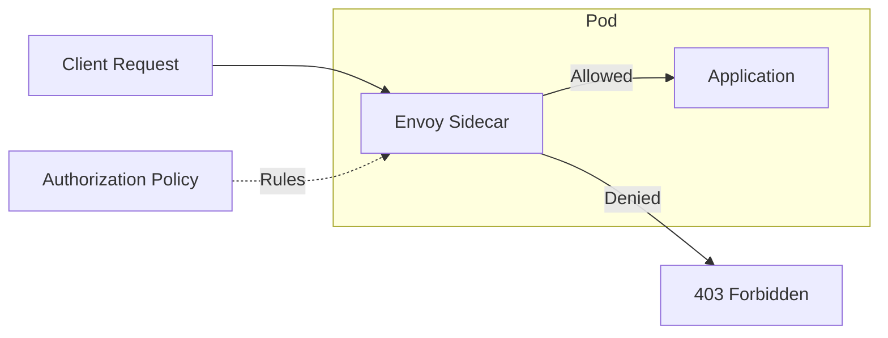

# How to Configure Istio Authorization Policies

Author: [nawazdhandala](https://www.github.com/nawazdhandala)

Tags: Istio, Kubernetes, Security, Authorization, Service Mesh, RBAC, Zero Trust

Description: Learn how to implement fine-grained access control in Istio using Authorization Policies, from basic allow/deny rules to advanced JWT-based authorization.

---

Authorization Policies in Istio let you control who can access what within your service mesh. They work at Layer 7, meaning you can make decisions based on HTTP methods, paths, headers, and even JWT claims. This is essential for implementing zero-trust security.

## How Authorization Works in Istio

Istio evaluates authorization at the Envoy sidecar level. Every request passes through the proxy, which checks it against configured policies before forwarding to your application.



The evaluation order matters:
1. CUSTOM policies (external authorization)
2. DENY policies
3. ALLOW policies
4. If no policy matches, default action applies

## Basic Authorization Patterns

### Default Deny All

Start with denying everything, then explicitly allow what you need.

```yaml
apiVersion: security.istio.io/v1beta1
kind: AuthorizationPolicy
metadata:
  name: deny-all
  namespace: production
spec:
  {}  # Empty spec = deny all
```

This blocks all traffic to the namespace. Now add explicit allows.

### Allow Specific Service-to-Service Communication

Allow only the frontend service to call the API.

```yaml
apiVersion: security.istio.io/v1beta1
kind: AuthorizationPolicy
metadata:
  name: allow-frontend-to-api
  namespace: production
spec:
  selector:
    matchLabels:
      app: api-service
  action: ALLOW
  rules:
    - from:
        - source:
            principals:
              - "cluster.local/ns/production/sa/frontend-service"
```

The principal is the service account identity in the format `cluster.local/ns/<namespace>/sa/<service-account>`.

### Allow by Namespace

Allow all services from a specific namespace to access your service.

```yaml
apiVersion: security.istio.io/v1beta1
kind: AuthorizationPolicy
metadata:
  name: allow-monitoring-namespace
  namespace: production
spec:
  selector:
    matchLabels:
      app: api-service
  action: ALLOW
  rules:
    - from:
        - source:
            namespaces:
              - monitoring
              - observability
```

## HTTP Method and Path Rules

Control access based on the specific operation being performed.

### Allow Read-Only Access

Some services should only allow GET requests.

```yaml
apiVersion: security.istio.io/v1beta1
kind: AuthorizationPolicy
metadata:
  name: read-only-access
  namespace: production
spec:
  selector:
    matchLabels:
      app: catalog-service
  action: ALLOW
  rules:
    - from:
        - source:
            principals:
              - "cluster.local/ns/production/sa/web-frontend"
      to:
        - operation:
            methods:
              - GET
            paths:
              - /api/products/*
              - /api/categories/*
```

### Protect Sensitive Endpoints

Deny access to admin endpoints except from specific services.

```yaml
apiVersion: security.istio.io/v1beta1
kind: AuthorizationPolicy
metadata:
  name: protect-admin-endpoints
  namespace: production
spec:
  selector:
    matchLabels:
      app: user-service
  action: DENY
  rules:
    - to:
        - operation:
            paths:
              - /admin/*
              - /internal/*
      from:
        - source:
            notPrincipals:
              - "cluster.local/ns/production/sa/admin-dashboard"
```

## JWT-Based Authorization

Integrate with identity providers by validating JWT tokens and making authorization decisions based on claims.

### Configure JWT Validation

First, set up RequestAuthentication to validate JWTs.

```yaml
apiVersion: security.istio.io/v1beta1
kind: RequestAuthentication
metadata:
  name: jwt-auth
  namespace: production
spec:
  selector:
    matchLabels:
      app: api-service
  jwtRules:
    - issuer: "https://auth.example.com"
      jwksUri: "https://auth.example.com/.well-known/jwks.json"
      audiences:
        - "api.example.com"
      forwardOriginalToken: true
```

### Authorize Based on JWT Claims

Allow access only if the JWT contains specific claims.

```yaml
apiVersion: security.istio.io/v1beta1
kind: AuthorizationPolicy
metadata:
  name: require-valid-jwt
  namespace: production
spec:
  selector:
    matchLabels:
      app: api-service
  action: ALLOW
  rules:
    - from:
        - source:
            requestPrincipals:
              - "https://auth.example.com/*"  # Any user from this issuer
      when:
        - key: request.auth.claims[email_verified]
          values:
            - "true"
```

### Role-Based Access with JWT

Restrict endpoints based on user roles from JWT claims.

```yaml
apiVersion: security.istio.io/v1beta1
kind: AuthorizationPolicy
metadata:
  name: admin-only-endpoints
  namespace: production
spec:
  selector:
    matchLabels:
      app: api-service
  action: ALLOW
  rules:
    - to:
        - operation:
            paths:
              - /api/admin/*
      when:
        - key: request.auth.claims[roles]
          values:
            - "admin"
            - "super-admin"
---
apiVersion: security.istio.io/v1beta1
kind: AuthorizationPolicy
metadata:
  name: user-endpoints
  namespace: production
spec:
  selector:
    matchLabels:
      app: api-service
  action: ALLOW
  rules:
    - to:
        - operation:
            paths:
              - /api/users/*
      when:
        - key: request.auth.claims[roles]
          values:
            - "user"
            - "admin"
            - "super-admin"
```

## Combining Multiple Conditions

Use complex rules with multiple conditions. All conditions in a rule must match (AND logic). Multiple rules provide OR logic.

```yaml
apiVersion: security.istio.io/v1beta1
kind: AuthorizationPolicy
metadata:
  name: complex-policy
  namespace: production
spec:
  selector:
    matchLabels:
      app: payment-service
  action: ALLOW
  rules:
    # Rule 1: Internal services with specific header
    - from:
        - source:
            namespaces:
              - production
      to:
        - operation:
            methods:
              - POST
            paths:
              - /api/payments
      when:
        - key: request.headers[x-internal-request]
          values:
            - "true"
    # Rule 2: External requests with valid JWT and permission
    - from:
        - source:
            requestPrincipals:
              - "*"
      to:
        - operation:
            methods:
              - POST
            paths:
              - /api/payments
      when:
        - key: request.auth.claims[permissions]
          values:
            - "payments:write"
```

## External Authorization

For complex authorization logic, use an external service.

```yaml
apiVersion: security.istio.io/v1beta1
kind: AuthorizationPolicy
metadata:
  name: external-authz
  namespace: production
spec:
  selector:
    matchLabels:
      app: api-service
  action: CUSTOM
  provider:
    name: opa-authz  # Defined in mesh config
  rules:
    - to:
        - operation:
            paths:
              - /api/*
```

Configure the provider in the Istio mesh config.

```yaml
apiVersion: install.istio.io/v1alpha1
kind: IstioOperator
spec:
  meshConfig:
    extensionProviders:
      - name: opa-authz
        envoyExtAuthzGrpc:
          service: opa.authz-system.svc.cluster.local
          port: 9191
```

## Debugging Authorization Policies

### Check Policy Application

Verify policies are applied to the correct workloads.

```bash
# List all authorization policies
kubectl get authorizationpolicies -A

# Check which policies apply to a pod
istioctl x authz check <pod-name> -n <namespace>

# Describe policy details
kubectl describe authorizationpolicy <policy-name> -n <namespace>
```

### Debug Denied Requests

When requests are denied, check Envoy logs.

```bash
# Enable access logging
kubectl exec -it <pod-name> -c istio-proxy -- \
  curl -X POST "localhost:15000/logging?rbac=debug"

# Watch logs for RBAC decisions
kubectl logs <pod-name> -c istio-proxy -f | grep -i rbac
```

Look for these log patterns:
- `enforced_denied` - Policy explicitly denied
- `shadow_denied` - Would be denied in dry-run mode
- `allowed` - Request permitted

### Common Issues

**All requests denied after adding policy:**
- Check selector labels match the workload
- Verify principals format is correct
- Ensure namespace matches

**JWT claims not working:**
- Confirm RequestAuthentication is configured
- Verify the JWT issuer matches exactly
- Check claim names are correct (case-sensitive)

**Policies not taking effect:**
- Run `istioctl analyze` to find configuration errors
- Check istiod logs for push failures
- Verify the policy is in the correct namespace

## Best Practices

### Use Namespace-Scoped Policies

Apply policies at namespace level when possible for easier management.

```yaml
apiVersion: security.istio.io/v1beta1
kind: AuthorizationPolicy
metadata:
  name: namespace-default-deny
  namespace: production
spec:
  {}
---
apiVersion: security.istio.io/v1beta1
kind: AuthorizationPolicy
metadata:
  name: allow-internal
  namespace: production
spec:
  action: ALLOW
  rules:
    - from:
        - source:
            namespaces:
              - production
```

### Document Your Policies

Add annotations explaining the policy purpose.

```yaml
apiVersion: security.istio.io/v1beta1
kind: AuthorizationPolicy
metadata:
  name: payment-service-policy
  namespace: production
  annotations:
    description: "Controls access to payment processing endpoints"
    owner: "security-team"
    last-reviewed: "2026-01-24"
spec:
  # ...
```

### Test with Dry-Run Mode

Use AUDIT action to test policies without enforcing them.

```yaml
apiVersion: security.istio.io/v1beta1
kind: AuthorizationPolicy
metadata:
  name: test-policy
spec:
  action: AUDIT  # Logs decisions but allows all traffic
  rules:
    - from:
        - source:
            principals:
              - "cluster.local/ns/production/sa/frontend"
```

Authorization policies are your last line of defense within the mesh. Start with default deny, add specific allows, and always test in a non-production environment first. Combined with mTLS, they provide a strong zero-trust security posture for your microservices.
