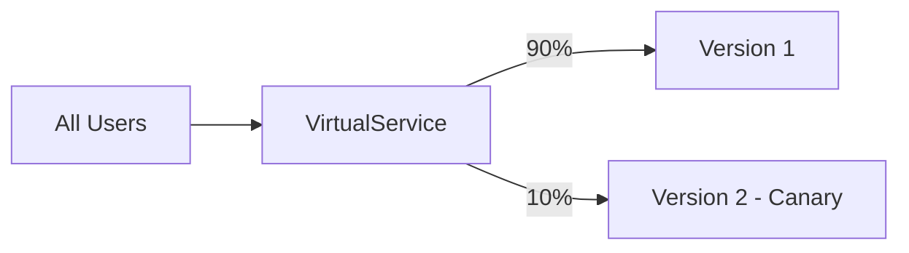
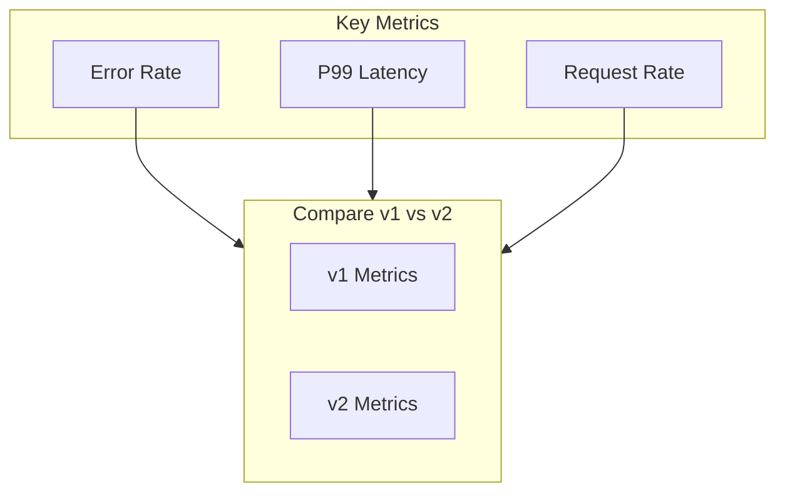

# How to Handle Istio Canary Deployments

Author: [nawazdhandala](https://www.github.com/nawazdhandala)

Tags: Istio, Service Mesh, Kubernetes, Canary Deployment, Traffic Splitting, Progressive Delivery

Description: A comprehensive guide to implementing canary deployments with Istio, including traffic splitting, header-based routing, and automated rollout strategies.

---

Canary deployments let you release new versions to a small percentage of users before rolling out to everyone. Istio makes this remarkably easy with its traffic management capabilities. Instead of deploying a new version and hoping for the best, you can gradually shift traffic while monitoring for problems.

## Understanding Canary Deployments

The basic idea is simple: run two versions simultaneously and control what percentage of traffic goes to each.



If the canary shows problems, you route traffic back to the stable version. If it performs well, you gradually increase the canary percentage until it handles all traffic.

## Setting Up the Deployment

First, deploy both versions with different version labels. This is the foundation that everything else builds on.

Deploy the stable version:

```yaml
apiVersion: apps/v1
kind: Deployment
metadata:
  name: reviews-v1
  namespace: default
spec:
  replicas: 3
  selector:
    matchLabels:
      app: reviews
      version: v1
  template:
    metadata:
      labels:
        app: reviews
        version: v1
    spec:
      containers:
        - name: reviews
          image: reviews:1.0.0
          ports:
            - containerPort: 9080
```

Deploy the canary version:

```yaml
apiVersion: apps/v1
kind: Deployment
metadata:
  name: reviews-v2
  namespace: default
spec:
  replicas: 1  # Start with fewer replicas
  selector:
    matchLabels:
      app: reviews
      version: v2
  template:
    metadata:
      labels:
        app: reviews
        version: v2
    spec:
      containers:
        - name: reviews
          image: reviews:2.0.0
          ports:
            - containerPort: 9080
```

Create a single Service that selects both versions:

```yaml
apiVersion: v1
kind: Service
metadata:
  name: reviews
  namespace: default
spec:
  selector:
    app: reviews  # Matches both v1 and v2
  ports:
    - port: 9080
      targetPort: 9080
```

## Configuring Traffic Splitting

Create a DestinationRule to define the subsets:

```yaml
apiVersion: networking.istio.io/v1beta1
kind: DestinationRule
metadata:
  name: reviews-destination
  namespace: default
spec:
  host: reviews
  subsets:
    - name: v1
      labels:
        version: v1
    - name: v2
      labels:
        version: v2
```

Now create a VirtualService that splits traffic:

```yaml
apiVersion: networking.istio.io/v1beta1
kind: VirtualService
metadata:
  name: reviews-canary
  namespace: default
spec:
  hosts:
    - reviews
  http:
    - route:
        - destination:
            host: reviews
            subset: v1
          weight: 90
        - destination:
            host: reviews
            subset: v2
          weight: 10
```

10% of traffic now goes to the canary. Monitor your metrics and logs to see how it performs.

## Progressive Traffic Shifting

As confidence grows, shift more traffic to the canary:

```yaml
# Week 1: 10% canary
- destination:
    host: reviews
    subset: v1
  weight: 90
- destination:
    host: reviews
    subset: v2
  weight: 10

# Week 2: 25% canary
- destination:
    host: reviews
    subset: v1
  weight: 75
- destination:
    host: reviews
    subset: v2
  weight: 25

# Week 3: 50% canary
- destination:
    host: reviews
    subset: v1
  weight: 50
- destination:
    host: reviews
    subset: v2
  weight: 50

# Week 4: 100% canary (promotion complete)
- destination:
    host: reviews
    subset: v2
  weight: 100
```

## Header-Based Canary Testing

Before exposing the canary to real users, test it with internal traffic using header-based routing:

```yaml
apiVersion: networking.istio.io/v1beta1
kind: VirtualService
metadata:
  name: reviews-header-canary
  namespace: default
spec:
  hosts:
    - reviews
  http:
    # Internal testing with header
    - match:
        - headers:
            x-canary:
              exact: "true"
      route:
        - destination:
            host: reviews
            subset: v2
    # Everyone else gets stable
    - route:
        - destination:
            host: reviews
            subset: v1
```

Test the canary version by adding the header:

```bash
curl -H "x-canary: true" http://reviews:9080/api/reviews
```

## User-Based Canary

Route specific users to the canary for beta testing:

```yaml
apiVersion: networking.istio.io/v1beta1
kind: VirtualService
metadata:
  name: reviews-user-canary
  namespace: default
spec:
  hosts:
    - reviews
  http:
    # Beta users get canary
    - match:
        - headers:
            x-user-group:
              exact: "beta"
      route:
        - destination:
            host: reviews
            subset: v2
    # Internal employees get canary
    - match:
        - headers:
            x-user-email:
              regex: ".*@yourcompany\\.com$"
      route:
        - destination:
            host: reviews
            subset: v2
    # Everyone else gets stable
    - route:
        - destination:
            host: reviews
            subset: v1
```

## Geographic Canary

Roll out to specific regions first:

```yaml
apiVersion: networking.istio.io/v1beta1
kind: VirtualService
metadata:
  name: reviews-geo-canary
  namespace: default
spec:
  hosts:
    - reviews
  http:
    # Users from specific region get canary
    - match:
        - headers:
            x-region:
              exact: "us-west-2"
      route:
        - destination:
            host: reviews
            subset: v2
    # All other regions get stable
    - route:
        - destination:
            host: reviews
            subset: v1
```

## Monitoring the Canary

Set up proper monitoring before starting any canary deployment. Here's what to watch:



### Prometheus Queries

Compare error rates between versions:

```promql
# Error rate for v1
sum(rate(istio_requests_total{destination_service="reviews.default.svc.cluster.local",destination_version="v1",response_code=~"5.*"}[5m]))
/
sum(rate(istio_requests_total{destination_service="reviews.default.svc.cluster.local",destination_version="v1"}[5m]))

# Error rate for v2
sum(rate(istio_requests_total{destination_service="reviews.default.svc.cluster.local",destination_version="v2",response_code=~"5.*"}[5m]))
/
sum(rate(istio_requests_total{destination_service="reviews.default.svc.cluster.local",destination_version="v2"}[5m]))
```

Compare latency:

```promql
# P99 latency for v1
histogram_quantile(0.99, sum(rate(istio_request_duration_milliseconds_bucket{destination_service="reviews.default.svc.cluster.local",destination_version="v1"}[5m])) by (le))

# P99 latency for v2
histogram_quantile(0.99, sum(rate(istio_request_duration_milliseconds_bucket{destination_service="reviews.default.svc.cluster.local",destination_version="v2"}[5m])) by (le))
```

## Automated Rollback

If the canary shows problems, roll back immediately:

```yaml
apiVersion: networking.istio.io/v1beta1
kind: VirtualService
metadata:
  name: reviews-rollback
  namespace: default
spec:
  hosts:
    - reviews
  http:
    - route:
        - destination:
            host: reviews
            subset: v1
          weight: 100
```

Apply the rollback:

```bash
kubectl apply -f reviews-rollback.yaml
```

Traffic immediately shifts back to the stable version.

## Using Flagger for Automated Canaries

For production environments, consider using Flagger to automate the canary process:

```yaml
apiVersion: flagger.app/v1beta1
kind: Canary
metadata:
  name: reviews
  namespace: default
spec:
  targetRef:
    apiVersion: apps/v1
    kind: Deployment
    name: reviews
  service:
    port: 9080
  analysis:
    interval: 1m
    threshold: 5
    maxWeight: 50
    stepWeight: 10
    metrics:
      - name: request-success-rate
        thresholdRange:
          min: 99
        interval: 1m
      - name: request-duration
        thresholdRange:
          max: 500
        interval: 1m
```

Flagger will automatically:
- Create the VirtualService and DestinationRule
- Incrementally increase traffic to the canary
- Monitor metrics against defined thresholds
- Roll back if metrics breach thresholds
- Promote the canary if all checks pass

## Canary Deployment Checklist

Before starting a canary:

1. Both versions deployed with appropriate labels
2. Single Service selecting both versions by app label
3. DestinationRule defining subsets for each version
4. Monitoring dashboards showing version-specific metrics
5. Alerting configured for error rate and latency spikes
6. Rollback VirtualService ready to apply

During the canary:

1. Start with minimal traffic (5-10%)
2. Watch metrics for at least 24 hours at each stage
3. Increase traffic incrementally (10% -> 25% -> 50% -> 100%)
4. Have someone on-call who can trigger rollback

After successful promotion:

1. Remove the old version's Deployment
2. Update DestinationRule to remove old subset
3. Simplify VirtualService to single destination
4. Document any issues encountered

## Common Mistakes

**Mistake: Forgetting the DestinationRule**

Without a DestinationRule, subsets don't exist and traffic splitting fails silently:

```bash
# Always verify DestinationRule exists
kubectl get destinationrule reviews -o yaml
```

**Mistake: Weight sum not equaling 100**

Weights should add up to 100:

```yaml
# Wrong - weights sum to 90
- destination:
    subset: v1
  weight: 50
- destination:
    subset: v2
  weight: 40

# Correct - weights sum to 100
- destination:
    subset: v1
  weight: 60
- destination:
    subset: v2
  weight: 40
```

**Mistake: Not monitoring before shifting traffic**

Always establish baseline metrics for the stable version before starting the canary. Otherwise, you have nothing to compare against.

---

Canary deployments with Istio give you precise control over how new versions are rolled out. Start with header-based testing for internal validation, then gradually shift real traffic while monitoring metrics. The ability to instantly roll back by changing VirtualService weights provides a safety net that traditional deployments lack.
