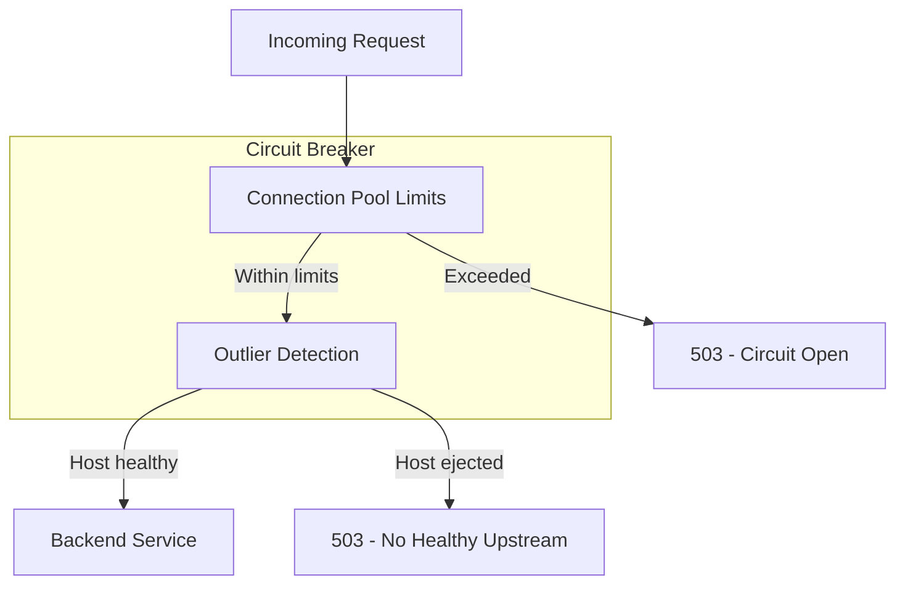

# How to Fix Circuit Breaker Not Working in Istio

Author: [nawazdhandala](https://www.github.com/nawazdhandala)

Tags: Istio, Circuit Breaker, Kubernetes, Service Mesh, Resilience, DestinationRule, Traffic Management

Description: Troubleshoot and fix common issues with Istio circuit breakers, including configuration mistakes, outlier detection problems, and testing strategies.

---

Circuit breakers in Istio prevent cascading failures by stopping requests to unhealthy services. When they do not work as expected, it is usually a configuration issue or a misunderstanding of how Istio implements this pattern. Let us fix that.

## How Circuit Breakers Work in Istio

Istio implements circuit breaking through DestinationRules with two mechanisms: connection pool limits and outlier detection.



Connection pool limits control how many connections and pending requests are allowed. Outlier detection ejects unhealthy hosts from the load balancing pool.

## Common Issue 1: Missing DestinationRule

The most common reason circuit breakers do not work is simply not having a DestinationRule configured.

```bash
# Check if DestinationRule exists for your service
kubectl get destinationrules -A | grep <service-name>
```

Create a basic circuit breaker configuration.

```yaml
apiVersion: networking.istio.io/v1beta1
kind: DestinationRule
metadata:
  name: my-service-cb
  namespace: production
spec:
  host: my-service
  trafficPolicy:
    connectionPool:
      tcp:
        maxConnections: 100
      http:
        http1MaxPendingRequests: 100
        http2MaxRequests: 1000
        maxRequestsPerConnection: 10
    outlierDetection:
      consecutive5xxErrors: 5
      interval: 30s
      baseEjectionTime: 30s
      maxEjectionPercent: 50
```

## Common Issue 2: Wrong Host Name

The `host` field must match exactly how the service is called. This is a frequent source of confusion.

```yaml
# If your service is called as:
# http://my-service.production.svc.cluster.local:8080

# The DestinationRule host should be:
spec:
  host: my-service.production.svc.cluster.local

# Or for same-namespace services:
spec:
  host: my-service
```

Check how requests are being made.

```bash
# See the actual service resolution
istioctl proxy-config clusters <pod-name> -n <namespace> | grep my-service
```

## Common Issue 3: VirtualService Overriding Settings

If you have a VirtualService with its own timeout or retry settings, they may conflict with your DestinationRule.

```yaml
# VirtualService might override circuit breaker behavior
apiVersion: networking.istio.io/v1beta1
kind: VirtualService
metadata:
  name: my-service-vs
spec:
  hosts:
    - my-service
  http:
    - route:
        - destination:
            host: my-service
      retries:
        attempts: 10  # This can mask circuit breaker ejections
        perTryTimeout: 2s
```

Reduce retry attempts when using circuit breakers to let failures propagate.

```yaml
apiVersion: networking.istio.io/v1beta1
kind: VirtualService
metadata:
  name: my-service-vs
spec:
  hosts:
    - my-service
  http:
    - route:
        - destination:
            host: my-service
      retries:
        attempts: 2  # Lower retry count
        perTryTimeout: 1s
        retryOn: connect-failure,reset
```

## Common Issue 4: Outlier Detection Not Triggering

Outlier detection requires multiple instances to work effectively. If you have a single replica, there is nothing to eject.

```bash
# Check how many endpoints exist
kubectl get endpoints my-service -n production
```

Outlier detection also needs enough traffic and failures to trigger. Check the settings.

```yaml
apiVersion: networking.istio.io/v1beta1
kind: DestinationRule
metadata:
  name: my-service-cb
spec:
  host: my-service
  trafficPolicy:
    outlierDetection:
      # Number of consecutive 5xx errors before ejection
      consecutive5xxErrors: 3  # Lower = more sensitive

      # How often to analyze hosts
      interval: 10s  # More frequent checks

      # Minimum time a host is ejected
      baseEjectionTime: 30s

      # Maximum percentage of hosts that can be ejected
      maxEjectionPercent: 100  # Allow ejecting all hosts

      # Minimum number of requests to consider
      minHealthPercent: 0  # Consider even with few requests
```

For gateway errors (502, 503, 504), use `consecutiveGatewayErrors` instead.

```yaml
outlierDetection:
  consecutiveGatewayErrors: 3
  consecutive5xxErrors: 5
  interval: 10s
  baseEjectionTime: 30s
```

## Common Issue 5: Connection Pool Not Limiting

Connection pool limits might seem ineffective if they are set too high or if you are testing with low traffic.

Verify the settings are applied.

```bash
# Check cluster configuration
istioctl proxy-config clusters <pod-name> -o json | \
  jq '.[] | select(.name | contains("my-service"))'
```

Look for `circuitBreakers` and `outlierDetection` in the output.

Set more aggressive limits for testing.

```yaml
apiVersion: networking.istio.io/v1beta1
kind: DestinationRule
metadata:
  name: my-service-cb-test
spec:
  host: my-service
  trafficPolicy:
    connectionPool:
      tcp:
        maxConnections: 1  # Very low for testing
      http:
        http1MaxPendingRequests: 1
        http2MaxRequests: 1
        maxRequestsPerConnection: 1
```

## Testing Circuit Breakers

### Test Connection Pool Limits

Use a tool like fortio to generate load and observe circuit breaking.

```bash
# Install fortio
kubectl apply -f https://raw.githubusercontent.com/istio/istio/release-1.20/samples/httpbin/sample-client/fortio-deploy.yaml

# Generate load to trigger circuit breaker
FORTIO_POD=$(kubectl get pods -l app=fortio -o jsonpath='{.items[0].metadata.name}')

# 20 concurrent connections, 100 requests
kubectl exec $FORTIO_POD -c fortio -- \
  fortio load -c 20 -qps 0 -n 100 -loglevel Warning \
  http://my-service:8080/
```

Look for responses with status code 503. These indicate the circuit breaker tripped.

### Test Outlier Detection

Create a failing endpoint and observe ejection.

```bash
# Deploy a test service that fails 50% of the time
kubectl apply -f - <<EOF
apiVersion: apps/v1
kind: Deployment
metadata:
  name: flaky-service
spec:
  replicas: 3
  selector:
    matchLabels:
      app: flaky-service
  template:
    metadata:
      labels:
        app: flaky-service
    spec:
      containers:
        - name: httpbin
          image: kennethreitz/httpbin
          ports:
            - containerPort: 80
---
apiVersion: v1
kind: Service
metadata:
  name: flaky-service
spec:
  selector:
    app: flaky-service
  ports:
    - port: 8080
      targetPort: 80
EOF
```

Apply outlier detection and monitor ejections.

```bash
# Watch Envoy stats for ejections
kubectl exec <client-pod> -c istio-proxy -- \
  curl -s localhost:15000/stats | grep outlier

# Key metrics:
# outlier_detection.ejections_active - Currently ejected hosts
# outlier_detection.ejections_total - Total ejection count
# outlier_detection.ejections_consecutive_5xx - 5xx triggered ejections
```

## Monitoring Circuit Breaker Status

Set up dashboards to track circuit breaker activity.

### Key Metrics

```promql
# Upstream overflow (circuit breaker triggered)
sum(rate(istio_requests_total{
  response_flags="UO"
}[5m])) by (destination_service)

# Outlier detection ejections
sum(rate(envoy_cluster_outlier_detection_ejections_total[5m])) by (cluster_name)

# Active ejections
envoy_cluster_outlier_detection_ejections_active
```

### Grafana Dashboard Query

Create an alert for circuit breaker trips.

```yaml
# AlertManager rule
groups:
  - name: istio-circuit-breaker
    rules:
      - alert: CircuitBreakerTripped
        expr: |
          sum(rate(istio_requests_total{response_flags="UO"}[5m])) by (destination_service) > 0
        for: 5m
        labels:
          severity: warning
        annotations:
          summary: "Circuit breaker tripping for {{ $labels.destination_service }}"
```

## Complete Working Example

Here is a complete configuration that combines connection pool limits and outlier detection.

```yaml
apiVersion: networking.istio.io/v1beta1
kind: DestinationRule
metadata:
  name: production-circuit-breaker
  namespace: production
spec:
  host: api-service
  trafficPolicy:
    connectionPool:
      tcp:
        maxConnections: 100
        connectTimeout: 5s
      http:
        http1MaxPendingRequests: 100
        http2MaxRequests: 1000
        maxRequestsPerConnection: 100
        maxRetries: 3
    outlierDetection:
      consecutiveGatewayErrors: 3
      consecutive5xxErrors: 5
      interval: 10s
      baseEjectionTime: 30s
      maxEjectionPercent: 50
      minHealthPercent: 30
    loadBalancer:
      simple: LEAST_REQUEST
---
apiVersion: networking.istio.io/v1beta1
kind: VirtualService
metadata:
  name: api-service-vs
  namespace: production
spec:
  hosts:
    - api-service
  http:
    - route:
        - destination:
            host: api-service
      timeout: 10s
      retries:
        attempts: 2
        perTryTimeout: 3s
        retryOn: connect-failure,refused-stream,unavailable,cancelled
```

## Debugging Checklist

When circuit breakers do not work, check these items:

1. **DestinationRule exists**: `kubectl get dr -A`
2. **Host name matches**: Compare with `istioctl proxy-config clusters`
3. **Multiple replicas exist**: Outlier detection needs multiple hosts
4. **Settings are applied**: Check `istioctl proxy-config clusters -o json`
5. **VirtualService conflicts**: Check retry and timeout settings
6. **Traffic is sufficient**: Need enough requests to trigger thresholds
7. **Metrics show activity**: Check Envoy stats for circuit breaker events

Circuit breakers are essential for resilient microservices. When configured correctly, they prevent cascading failures and give unhealthy services time to recover. Test them under load before relying on them in production.
