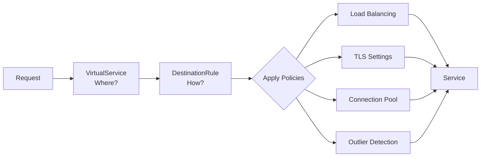
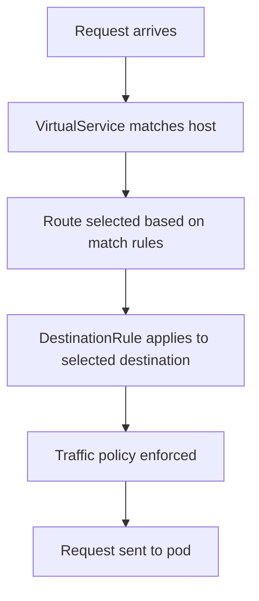

# How to Fix 'Destination Rule' Issues in Istio

Author: [nawazdhandala](https://www.github.com/nawazdhandala)

Tags: Istio, Service Mesh, Kubernetes, DestinationRule, Traffic Policy, mTLS

Description: A troubleshooting guide for common DestinationRule issues in Istio, including subset misconfigurations, mTLS conflicts, load balancing problems, and connection pool settings.

---

DestinationRules in Istio define policies that apply after routing decisions are made. They control things like load balancing, connection pools, outlier detection, and TLS settings. When they're misconfigured, you see cryptic errors like "no healthy upstream" or connections that mysteriously fail.

## What DestinationRules Do

While VirtualServices control where traffic goes, DestinationRules control how traffic gets there.



## Problem 1: Subset Not Found

The most common error is referencing a subset in a VirtualService that doesn't exist in any DestinationRule.

### Symptoms

```bash
# In proxy logs
kubectl logs <pod-name> -c istio-proxy | grep "no healthy upstream"
```

Requests fail with 503 errors even though pods are running and healthy.

### Diagnosis

Check that the subset exists:

```bash
# List DestinationRules for the service
kubectl get destinationrule -n default | grep reviews

# Describe to see subsets
kubectl describe destinationrule reviews -n default
```

### Fix

Make sure every subset referenced in VirtualServices is defined:

```yaml
# VirtualService references subset "v2"
apiVersion: networking.istio.io/v1beta1
kind: VirtualService
metadata:
  name: reviews-route
spec:
  hosts:
    - reviews
  http:
    - route:
        - destination:
            host: reviews
            subset: v2  # Must exist in DestinationRule
```

```yaml
# DestinationRule must define "v2"
apiVersion: networking.istio.io/v1beta1
kind: DestinationRule
metadata:
  name: reviews-destination
spec:
  host: reviews
  subsets:
    - name: v1
      labels:
        version: v1
    - name: v2  # This must exist
      labels:
        version: v2
```

## Problem 2: Host Mismatch

The `host` field in DestinationRule must match how clients address the service.

### Short Name vs FQDN

If your VirtualService uses the short name but the DestinationRule uses the FQDN, they might not match:

```yaml
# This DestinationRule only applies to "reviews" short name
apiVersion: networking.istio.io/v1beta1
kind: DestinationRule
metadata:
  name: reviews-dr
  namespace: default
spec:
  host: reviews  # Short name
  subsets:
    - name: v1
      labels:
        version: v1
```

For cross-namespace traffic, use the full name:

```yaml
apiVersion: networking.istio.io/v1beta1
kind: DestinationRule
metadata:
  name: reviews-dr
  namespace: default
spec:
  host: reviews.default.svc.cluster.local  # FQDN for cross-namespace
  subsets:
    - name: v1
      labels:
        version: v1
```

### Check with istioctl

```bash
# See what host the proxy is using
istioctl proxy-config clusters <pod-name> | grep reviews
```

## Problem 3: mTLS Configuration Conflicts

When you enable mTLS in a DestinationRule but the destination doesn't support it, connections fail.

### Symptoms

```
upstream connect error or disconnect/reset before headers. reset reason: connection termination
```

### Common Scenario

You have a service outside the mesh (no sidecar) and try to connect with mTLS:

```yaml
# Wrong - external service doesn't have a sidecar
apiVersion: networking.istio.io/v1beta1
kind: DestinationRule
metadata:
  name: external-db
spec:
  host: mysql.database.svc.cluster.local
  trafficPolicy:
    tls:
      mode: ISTIO_MUTUAL  # Fails if mysql has no sidecar
```

### Fix

For services without sidecars, disable mTLS:

```yaml
apiVersion: networking.istio.io/v1beta1
kind: DestinationRule
metadata:
  name: external-db
spec:
  host: mysql.database.svc.cluster.local
  trafficPolicy:
    tls:
      mode: DISABLE  # No mTLS for this destination
```

### Check mTLS Status

```bash
# See mTLS status for all services
istioctl x authz check <pod-name>

# Or check specific destination
istioctl proxy-config clusters <pod-name> -o json | jq '.[] | select(.name | contains("mysql")) | .transportSocketMatches'
```

## Problem 4: Label Selector Not Matching Pods

Subsets use label selectors. If your pods don't have matching labels, the subset has no endpoints.

### Diagnosis

```bash
# Check what labels your pods have
kubectl get pods -l app=reviews --show-labels

# Check what labels the subset expects
kubectl get destinationrule reviews -o yaml | grep -A5 "subsets:"
```

### Fix

Either update pod labels or subset selectors to match:

```yaml
# Pod labels
labels:
  app: reviews
  version: v2  # Must match subset selector

# Subset selector
subsets:
  - name: v2
    labels:
      version: v2  # Must match pod labels
```

## Problem 5: Connection Pool Exhaustion

Connection pool settings can cause failures under load if set too conservatively.

### Symptoms

- Requests fail under high load
- "upstream connect error" with "overflow" reason
- Connections refused even though the service is healthy

### Configuration

```yaml
apiVersion: networking.istio.io/v1beta1
kind: DestinationRule
metadata:
  name: reviews-connection-pool
spec:
  host: reviews
  trafficPolicy:
    connectionPool:
      tcp:
        maxConnections: 100  # Max TCP connections
        connectTimeout: 30s
      http:
        h2UpgradePolicy: UPGRADE  # Use HTTP/2 when possible
        http1MaxPendingRequests: 100  # Queue size for HTTP/1
        http2MaxRequests: 1000  # Max concurrent HTTP/2 requests
        maxRequestsPerConnection: 10  # Requests before closing connection
        maxRetries: 3
```

### Tuning for High Traffic

```yaml
apiVersion: networking.istio.io/v1beta1
kind: DestinationRule
metadata:
  name: high-traffic-service
spec:
  host: api-gateway
  trafficPolicy:
    connectionPool:
      tcp:
        maxConnections: 1000
        connectTimeout: 10s
      http:
        http2MaxRequests: 10000
        http1MaxPendingRequests: 1000
        maxRequestsPerConnection: 100
```

## Problem 6: Outlier Detection Too Aggressive

Outlier detection removes unhealthy pods from the load balancing pool. If configured too aggressively, healthy pods get ejected.

### Symptoms

- Pods marked unhealthy despite responding correctly
- All pods eventually ejected, causing complete failure
- Intermittent 503 errors

### Default Behavior

With default settings, a pod that returns 5 consecutive 5xx errors gets ejected for 30 seconds.

### Conservative Configuration

```yaml
apiVersion: networking.istio.io/v1beta1
kind: DestinationRule
metadata:
  name: reviews-outlier
spec:
  host: reviews
  trafficPolicy:
    outlierDetection:
      consecutive5xxErrors: 10  # More tolerance
      interval: 30s  # Check less frequently
      baseEjectionTime: 30s
      maxEjectionPercent: 50  # Never eject more than half
      minHealthPercent: 30  # Keep load balancing if >30% healthy
```

### Disable Outlier Detection

For debugging, you can disable it entirely:

```yaml
apiVersion: networking.istio.io/v1beta1
kind: DestinationRule
metadata:
  name: reviews-no-outlier
spec:
  host: reviews
  trafficPolicy:
    outlierDetection:
      consecutive5xxErrors: 0  # Effectively disables
```

## Problem 7: Load Balancing Not Working as Expected

By default, Istio uses round-robin load balancing. If you need something different, configure it explicitly.

### Available Algorithms

```yaml
apiVersion: networking.istio.io/v1beta1
kind: DestinationRule
metadata:
  name: reviews-lb
spec:
  host: reviews
  trafficPolicy:
    loadBalancer:
      simple: LEAST_CONN  # Options: ROUND_ROBIN, LEAST_CONN, RANDOM, PASSTHROUGH
```

### Consistent Hashing

For sticky sessions based on headers, cookies, or source IP:

```yaml
apiVersion: networking.istio.io/v1beta1
kind: DestinationRule
metadata:
  name: reviews-sticky
spec:
  host: reviews
  trafficPolicy:
    loadBalancer:
      consistentHash:
        httpHeaderName: x-user-id  # Route same user to same pod
```

Or use cookies:

```yaml
trafficPolicy:
  loadBalancer:
    consistentHash:
      httpCookie:
        name: SERVERID
        ttl: 3600s
```

## Debugging DestinationRules

### Check Configuration Applied

```bash
# List all DestinationRules
kubectl get destinationrule -A

# Describe specific rule
kubectl describe destinationrule reviews -n default

# Check proxy has the configuration
istioctl proxy-config clusters <pod-name> -o json | jq '.[] | select(.name | contains("reviews"))'
```

### Analyze for Issues

```bash
# Istio's built-in analyzer catches many problems
istioctl analyze -n default

# Common output:
# Warning [IST0101] (DestinationRule reviews.default) Referenced subset not found
```

### Check Endpoints

```bash
# Verify the subset has endpoints
istioctl proxy-config endpoints <pod-name> | grep reviews
```

## DestinationRule Checklist

When creating or debugging DestinationRules:

1. Host field matches how clients address the service
2. All subsets referenced in VirtualServices are defined
3. Subset label selectors match actual pod labels
4. mTLS mode matches destination capability (sidecar or not)
5. Connection pool sized for expected traffic
6. Outlier detection not ejecting healthy pods
7. Load balancer algorithm appropriate for use case

## Order of Operations

Remember that DestinationRules apply after routing. The flow is:



If there's no matching DestinationRule, Istio uses default settings. If the VirtualService references a subset that doesn't exist, the request fails.

---

DestinationRules control the "how" of traffic management after VirtualServices decide the "where." Most issues come from mismatched hosts, missing subsets, or mTLS conflicts. Use `istioctl analyze` as your first debugging step, and check that label selectors actually match your pods. Once you understand the relationship between VirtualServices and DestinationRules, most configuration problems become obvious.
