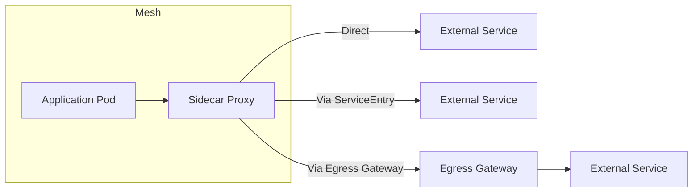
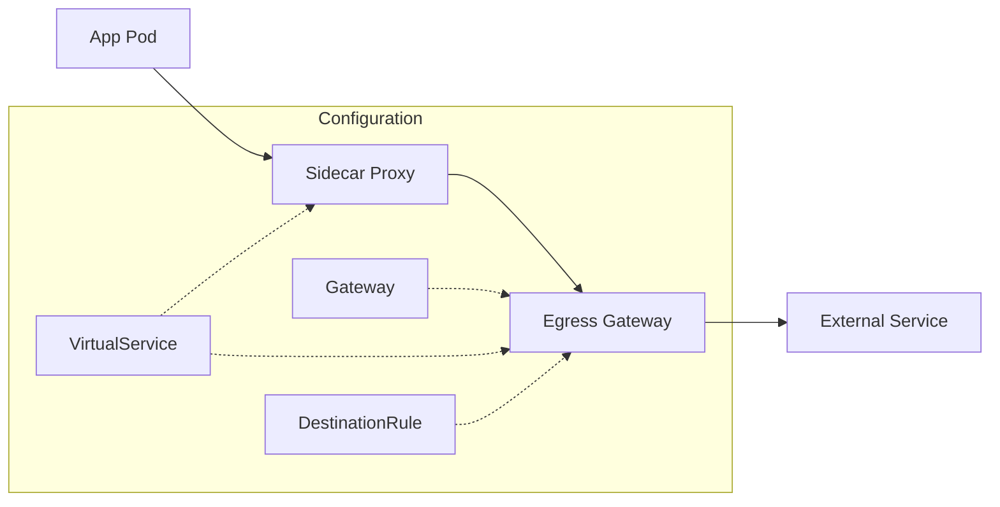

# How to Configure Istio Egress Traffic

Author: [nawazdhandala](https://www.github.com/nawazdhandala)

Tags: Istio, Kubernetes, Egress, Service Mesh, Networking, Security, Traffic Management

Description: Learn how to configure Istio egress traffic to control and secure outbound connections from your mesh to external services.

---

By default, Istio allows pods to reach external services freely. This works fine for development, but production environments need tighter control. You want to know exactly what external services your applications talk to, enforce security policies, and route traffic through specific gateways.

This guide covers everything from basic egress setup to advanced scenarios like routing through dedicated proxies.

## Understanding Istio Egress Options

Istio provides three approaches for handling egress traffic:



**Option 1: Allow All (Default)** - Sidecars pass through traffic to unknown destinations. Simple but you lose visibility.

**Option 2: Registry Only** - Sidecars only allow traffic to services explicitly defined in the mesh registry. This requires ServiceEntry resources for external services.

**Option 3: Egress Gateway** - Route all external traffic through a dedicated gateway for centralized control, monitoring, and policy enforcement.

## Configuring the Outbound Traffic Policy

First, decide on your outbound traffic policy. The `meshConfig.outboundTrafficPolicy.mode` setting controls this behavior.

Check your current setting with this command:

```bash
# Check current outbound traffic policy mode
kubectl get configmap istio -n istio-system -o yaml | grep -A 2 outboundTrafficPolicy
```

To switch to REGISTRY_ONLY mode (recommended for production), update your Istio installation:

```yaml
# istio-config.yaml - IstioOperator configuration for registry-only mode
apiVersion: install.istio.io/v1alpha1
kind: IstioOperator
spec:
  meshConfig:
    # Only allow traffic to services registered in the mesh
    # This blocks all external traffic unless explicitly allowed via ServiceEntry
    outboundTrafficPolicy:
      mode: REGISTRY_ONLY
```

Apply this configuration:

```bash
# Apply the updated Istio configuration
istioctl install -f istio-config.yaml -y
```

After enabling REGISTRY_ONLY mode, your applications cannot reach external services until you create ServiceEntry resources for them.

## Creating ServiceEntry for External Services

ServiceEntry tells Istio about external services your mesh needs to access. Without it, requests to external hosts will fail in REGISTRY_ONLY mode.

Here is a ServiceEntry for accessing an external API:

```yaml
# external-api-service-entry.yaml
apiVersion: networking.istio.io/v1beta1
kind: ServiceEntry
metadata:
  name: external-api
  namespace: production
spec:
  # The hostname your application uses to reach the external service
  hosts:
    - api.external-service.com
  # MESH_EXTERNAL indicates this service lives outside the mesh
  location: MESH_EXTERNAL
  # Port configuration for the external service
  ports:
    - number: 443
      name: https
      protocol: HTTPS
  # DNS resolution strategy
  resolution: DNS
```

For services that need HTTP and HTTPS access:

```yaml
# multi-port-service-entry.yaml
apiVersion: networking.istio.io/v1beta1
kind: ServiceEntry
metadata:
  name: github-api
  namespace: default
spec:
  hosts:
    - api.github.com
    - github.com
  location: MESH_EXTERNAL
  ports:
    - number: 80
      name: http
      protocol: HTTP
    - number: 443
      name: https
      protocol: HTTPS
  resolution: DNS
```

Apply the ServiceEntry:

```bash
# Create the ServiceEntry to allow external access
kubectl apply -f external-api-service-entry.yaml

# Verify the ServiceEntry was created
kubectl get serviceentry -n production
```

## Setting Up an Egress Gateway

Egress gateways provide centralized control over outbound traffic. All external requests flow through the gateway, giving you a single point for monitoring, logging, and applying security policies.

First, ensure your Istio installation includes the egress gateway:

```yaml
# istio-with-egress-gateway.yaml
apiVersion: install.istio.io/v1alpha1
kind: IstioOperator
spec:
  components:
    egressGateways:
      # Enable the egress gateway component
      - name: istio-egressgateway
        enabled: true
        k8s:
          # Resource allocation for the egress gateway
          resources:
            requests:
              cpu: 100m
              memory: 128Mi
            limits:
              cpu: 500m
              memory: 256Mi
```

Install or update Istio with the egress gateway:

```bash
# Install Istio with egress gateway enabled
istioctl install -f istio-with-egress-gateway.yaml -y

# Verify the egress gateway is running
kubectl get pods -n istio-system -l app=istio-egressgateway
```

## Routing Traffic Through the Egress Gateway

Now configure traffic to flow through the egress gateway. This requires a Gateway, DestinationRule, and VirtualService working together.



Here is the complete configuration for routing external API traffic through the egress gateway:

```yaml
# egress-gateway-config.yaml
apiVersion: networking.istio.io/v1beta1
kind: ServiceEntry
metadata:
  name: external-api
  namespace: production
spec:
  hosts:
    - api.external-service.com
  location: MESH_EXTERNAL
  ports:
    - number: 443
      name: https
      protocol: HTTPS
  resolution: DNS
---
# Gateway configuration for the egress gateway to handle external traffic
apiVersion: networking.istio.io/v1beta1
kind: Gateway
metadata:
  name: external-api-gateway
  namespace: production
spec:
  # Select the egress gateway pods
  selector:
    istio: egressgateway
  servers:
    - port:
        number: 443
        name: https
        protocol: HTTPS
      hosts:
        - api.external-service.com
      tls:
        # Passthrough mode - the gateway does not terminate TLS
        mode: PASSTHROUGH
---
# DestinationRule for TLS origination at the egress gateway
apiVersion: networking.istio.io/v1beta1
kind: DestinationRule
metadata:
  name: external-api-dr
  namespace: production
spec:
  host: api.external-service.com
  trafficPolicy:
    portLevelSettings:
      - port:
          number: 443
        tls:
          mode: SIMPLE
          sni: api.external-service.com
---
# VirtualService to route traffic through the egress gateway
apiVersion: networking.istio.io/v1beta1
kind: VirtualService
metadata:
  name: external-api-vs
  namespace: production
spec:
  hosts:
    - api.external-service.com
  gateways:
    # Apply to both mesh traffic and egress gateway traffic
    - mesh
    - external-api-gateway
  tls:
    # Route from sidecars to egress gateway
    - match:
        - gateways:
            - mesh
          port: 443
          sniHosts:
            - api.external-service.com
      route:
        - destination:
            host: istio-egressgateway.istio-system.svc.cluster.local
            port:
              number: 443
    # Route from egress gateway to external service
    - match:
        - gateways:
            - external-api-gateway
          port: 443
          sniHosts:
            - api.external-service.com
      route:
        - destination:
            host: api.external-service.com
            port:
              number: 443
```

Apply the configuration:

```bash
# Apply all egress gateway configuration
kubectl apply -f egress-gateway-config.yaml

# Verify the configuration is synced
istioctl proxy-status
```

## Allowing Access to IP Ranges

Sometimes you need to allow access to IP ranges rather than hostnames. This is common for cloud provider APIs or internal corporate networks.

```yaml
# ip-range-service-entry.yaml
apiVersion: networking.istio.io/v1beta1
kind: ServiceEntry
metadata:
  name: corporate-network
  namespace: production
spec:
  hosts:
    # Use a wildcard for IP-based services
    - "*.corp.internal"
  # Specify the IP addresses or CIDR ranges
  addresses:
    - 10.0.0.0/8
    - 172.16.0.0/12
  location: MESH_EXTERNAL
  ports:
    - number: 443
      name: https
      protocol: HTTPS
    - number: 80
      name: http
      protocol: HTTP
  # Use STATIC resolution when providing explicit addresses
  resolution: STATIC
  endpoints:
    - address: 10.0.1.100
    - address: 10.0.1.101
```

## Monitoring Egress Traffic

After configuring egress, monitor traffic to ensure everything works and to track external dependencies.

Check if traffic flows through the egress gateway:

```bash
# View egress gateway logs for external traffic
kubectl logs -n istio-system -l app=istio-egressgateway --tail=100

# Check Envoy access logs in the egress gateway
kubectl logs -n istio-system -l app=istio-egressgateway -c istio-proxy | grep "api.external-service.com"
```

Use Kiali to visualize egress traffic flow:

```bash
# Open Kiali dashboard to see traffic flow visualization
istioctl dashboard kiali
```

Query Prometheus for egress metrics:

```bash
# Forward Prometheus port for local access
kubectl port-forward -n istio-system svc/prometheus 9090:9090
```

Then query for outbound request metrics:

```promql
# Total outbound requests through egress gateway
istio_requests_total{destination_service="api.external-service.com", reporter="source"}
```

## Troubleshooting Egress Issues

When egress traffic fails, start with these diagnostic steps:

```bash
# Check if ServiceEntry is recognized by Istio
istioctl proxy-config cluster deploy/your-app -n production | grep external-service

# Verify the egress gateway sees the configuration
istioctl proxy-config route deploy/istio-egressgateway -n istio-system

# Test connectivity from inside a pod
kubectl exec -it deploy/your-app -n production -- curl -v https://api.external-service.com/health
```

Common issues and fixes:

**Traffic blocked in REGISTRY_ONLY mode**: Create a ServiceEntry for the external host.

**Connection refused through egress gateway**: Check Gateway and VirtualService configurations match the destination host and port.

**TLS handshake failures**: Verify the SNI in DestinationRule matches the external service hostname.

**DNS resolution failures**: Ensure `resolution: DNS` is set and your cluster can resolve external hostnames.

## Best Practices

1. **Use REGISTRY_ONLY mode in production** to maintain visibility and control over external dependencies.

2. **Route sensitive external traffic through egress gateways** for centralized logging and security policies.

3. **Document all ServiceEntry resources** so teams know which external services are approved.

4. **Set timeouts on external calls** using VirtualService to prevent hanging requests.

5. **Monitor egress traffic metrics** to detect unexpected external dependencies or traffic patterns.

Configuring egress properly takes effort upfront but pays off with better security posture, clearer dependency mapping, and easier troubleshooting when external services have issues.
