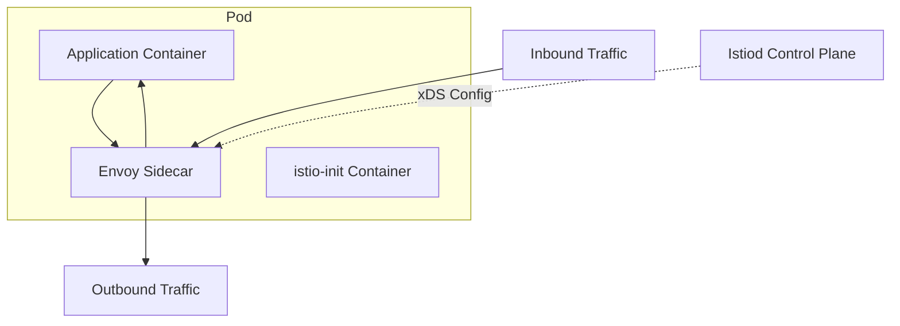

# How to Fix Envoy Proxy Issues in Istio

Author: [nawazdhandala](https://www.github.com/nawazdhandala)

Tags: Istio, Envoy, Kubernetes, Service Mesh, Debugging, Proxy, Troubleshooting

Description: Learn how to diagnose and fix common Envoy proxy issues in Istio, from sidecar injection problems to configuration conflicts and performance bottlenecks.

---

Envoy is the data plane of Istio. Every request in your mesh flows through Envoy sidecars, which makes proxy issues particularly frustrating when they occur. This guide covers the most common Envoy problems in Istio and how to fix them.

## How Envoy Works in Istio

Before diving into fixes, understand the architecture. Istio injects an Envoy sidecar into each pod, intercepting all inbound and outbound traffic.



The istio-init container sets up iptables rules to redirect traffic through Envoy. Istiod pushes configuration to Envoy via the xDS protocol.

## Sidecar Injection Issues

### Problem: Sidecar Not Injected

Pods start without the Envoy sidecar, bypassing the mesh entirely.

Check if injection is enabled for the namespace.

```bash
# Check namespace labels
kubectl get namespace default --show-labels

# Enable injection
kubectl label namespace default istio-injection=enabled

# Force restart existing pods
kubectl rollout restart deployment -n default
```

For individual pods, check the annotations.

```yaml
apiVersion: v1
kind: Pod
metadata:
  annotations:
    # Disable injection for this pod
    sidecar.istio.io/inject: "false"
```

### Problem: Sidecar Injection Webhook Failing

If injection fails completely, check the webhook configuration.

```bash
# Check webhook status
kubectl get mutatingwebhookconfigurations istio-sidecar-injector -o yaml

# Check istiod logs for injection errors
kubectl logs -l app=istiod -n istio-system | grep -i inject

# Verify the injection service
kubectl get svc istiod -n istio-system
```

## Proxy Configuration Problems

### Problem: Envoy Not Receiving Configuration

Envoy starts but has stale or missing configuration from Istiod.

Check the sync status of the proxy.

```bash
# Check proxy sync status for a specific pod
istioctl proxy-status

# Look for pods that are not synced
istioctl proxy-status | grep -v SYNCED
```

If proxies show as NOT SENT or STALE, check Istiod connectivity.

```bash
# From inside a pod, test connection to Istiod
kubectl exec -it <pod-name> -c istio-proxy -- \
  curl -s localhost:15000/config_dump | head -20

# Check Istiod logs
kubectl logs -l app=istiod -n istio-system --tail=100
```

### Problem: Configuration Conflicts

Multiple resources targeting the same host or service cause unpredictable behavior.

```bash
# Analyze configuration for conflicts
istioctl analyze -A

# Check for VirtualService conflicts
istioctl analyze --all-namespaces 2>&1 | grep -i conflict

# Get detailed config for a service
istioctl proxy-config routes <pod-name> -o json
```

Common conflict scenarios include multiple VirtualServices for the same host.

```yaml
# Bad: Two VirtualServices for same host in different namespaces
# They will merge unpredictably

# Good: Single VirtualService per host, or use explicit ordering
apiVersion: networking.istio.io/v1beta1
kind: VirtualService
metadata:
  name: api-routes
spec:
  hosts:
    - api.example.com
  http:
    # All routes in one place
    - match:
        - uri:
            prefix: /v1
      route:
        - destination:
            host: api-v1
    - match:
        - uri:
            prefix: /v2
      route:
        - destination:
            host: api-v2
```

## Connection and Timeout Issues

### Problem: 503 Service Unavailable Errors

This is one of the most common Envoy issues. It typically means Envoy cannot connect to the upstream service.

```bash
# Check the specific error from Envoy
kubectl logs <pod-name> -c istio-proxy | grep -i "503"

# Common response flags:
# UC = Upstream connection failure
# UF = Upstream connection failure (TLS)
# NR = No route configured
# UH = No healthy upstream
```

For UC (Upstream Connection) errors, check the destination service.

```bash
# Verify service endpoints
kubectl get endpoints <service-name>

# Check if destination pod is healthy
kubectl get pods -l app=<app-name>

# Test connectivity from the source pod
kubectl exec -it <source-pod> -c istio-proxy -- \
  curl -v http://<service>:<port>/health
```

For NR (No Route) errors, verify the routing configuration.

```bash
# Check routes in the proxy
istioctl proxy-config routes <pod-name> --name <port>

# Verify VirtualService configuration
kubectl get virtualservice -A -o yaml | grep -A20 <service-name>
```

### Problem: Request Timeouts

Requests time out even when the destination service responds quickly.

Check timeout configuration in the VirtualService.

```yaml
apiVersion: networking.istio.io/v1beta1
kind: VirtualService
metadata:
  name: api-vs
spec:
  hosts:
    - api-service
  http:
    - route:
        - destination:
            host: api-service
      timeout: 30s  # Increase timeout
      retries:
        attempts: 3
        perTryTimeout: 10s
```

Also check DestinationRule for connection pool settings.

```yaml
apiVersion: networking.istio.io/v1beta1
kind: DestinationRule
metadata:
  name: api-dr
spec:
  host: api-service
  trafficPolicy:
    connectionPool:
      tcp:
        maxConnections: 100
        connectTimeout: 10s
      http:
        h2UpgradePolicy: UPGRADE
        http1MaxPendingRequests: 100
        http2MaxRequests: 1000
```

## TLS and mTLS Issues

### Problem: TLS Handshake Failures

Services cannot communicate due to mTLS misconfiguration.

```bash
# Check mTLS status between services
istioctl authn tls-check <pod-name> <service-name>

# View the TLS mode for a namespace
kubectl get peerauthentication -A
```

If you see "CONFLICT" or handshake errors, align the PeerAuthentication policy.

```yaml
apiVersion: security.istio.io/v1beta1
kind: PeerAuthentication
metadata:
  name: default
  namespace: default
spec:
  mtls:
    mode: STRICT  # or PERMISSIVE for migration
```

For services that cannot use mTLS (external databases, legacy services), exclude them.

```yaml
apiVersion: networking.istio.io/v1beta1
kind: DestinationRule
metadata:
  name: external-db
spec:
  host: external-database.com
  trafficPolicy:
    tls:
      mode: DISABLE
```

### Problem: Certificate Expiration

mTLS stops working when certificates expire.

```bash
# Check certificate expiration in a sidecar
istioctl proxy-config secret <pod-name> -o json | \
  jq '.dynamicActiveSecrets[0].secret.tlsCertificate.certificateChain.inlineBytes' | \
  base64 -d | openssl x509 -noout -dates

# Force certificate rotation
kubectl delete pod <pod-name>
```

## Performance Issues

### Problem: High Latency Through Envoy

Envoy adds noticeable latency to requests.

Check Envoy stats for bottlenecks.

```bash
# Get Envoy stats
kubectl exec -it <pod-name> -c istio-proxy -- \
  curl -s localhost:15000/stats | grep -E "upstream_cx|downstream_cx"

# Check for connection pool exhaustion
kubectl exec -it <pod-name> -c istio-proxy -- \
  curl -s localhost:15000/stats | grep pending
```

Tune the connection pool settings.

```yaml
apiVersion: networking.istio.io/v1beta1
kind: DestinationRule
metadata:
  name: high-traffic-service
spec:
  host: high-traffic-service
  trafficPolicy:
    connectionPool:
      tcp:
        maxConnections: 1000
      http:
        http1MaxPendingRequests: 1000
        http2MaxRequests: 10000
        maxRequestsPerConnection: 100
```

### Problem: Memory Usage Too High

Envoy sidecars consume excessive memory.

Check current resource usage.

```bash
# Get memory usage
kubectl top pod <pod-name> --containers
```

Configure sidecar resource limits in the deployment or globally.

```yaml
apiVersion: v1
kind: Pod
metadata:
  annotations:
    sidecar.istio.io/proxyCPU: "100m"
    sidecar.istio.io/proxyMemory: "128Mi"
    sidecar.istio.io/proxyCPULimit: "500m"
    sidecar.istio.io/proxyMemoryLimit: "512Mi"
spec:
  containers:
    - name: app
      # ...
```

Reduce config size by limiting the scope of sidecar configuration.

```yaml
apiVersion: networking.istio.io/v1beta1
kind: Sidecar
metadata:
  name: limit-egress
  namespace: my-namespace
spec:
  egress:
    - hosts:
        - "./*"  # Only services in same namespace
        - "istio-system/*"  # Plus istio-system
```

## Debugging Commands Reference

Here is a quick reference of essential debugging commands.

```bash
# Overall mesh health
istioctl proxy-status
istioctl analyze -A

# Specific proxy configuration
istioctl proxy-config listeners <pod> -o json
istioctl proxy-config routes <pod> -o json
istioctl proxy-config clusters <pod> -o json
istioctl proxy-config endpoints <pod> -o json

# Envoy admin interface (from inside pod)
kubectl exec -it <pod> -c istio-proxy -- curl localhost:15000/help
kubectl exec -it <pod> -c istio-proxy -- curl localhost:15000/config_dump
kubectl exec -it <pod> -c istio-proxy -- curl localhost:15000/stats

# Logs with increased verbosity
kubectl exec -it <pod> -c istio-proxy -- \
  curl -X POST "localhost:15000/logging?level=debug"
```

## Prevention Best Practices

1. **Use istioctl analyze**: Run it in CI/CD before deploying changes
2. **Monitor Proxy Metrics**: Set up alerts for 5xx errors and connection failures
3. **Limit Sidecar Scope**: Use Sidecar resources to reduce configuration size
4. **Test mTLS Changes**: Use PERMISSIVE mode during migration
5. **Version Control**: Keep all Istio configuration in Git

Envoy issues in Istio usually come down to configuration mismatches or resource constraints. Use istioctl for diagnosis, check sync status regularly, and keep your Istio version updated to benefit from bug fixes and improvements.
