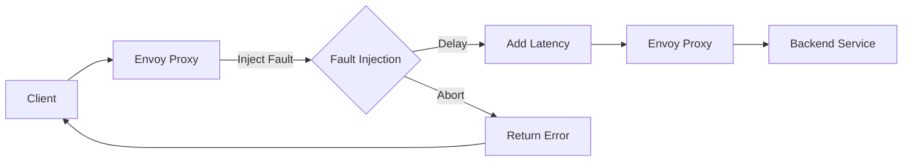

# How to Configure Istio Fault Injection

Author: [nawazdhandala](https://www.github.com/nawazdhandala)

Tags: Istio, Service Mesh, Kubernetes, Fault Injection, Chaos Engineering, Resilience Testing

Description: Learn how to use Istio's fault injection capabilities to test application resilience by injecting delays, HTTP errors, and connection failures in a controlled manner.

---

Your application works perfectly in development. All the tests pass. Then production hits, and a downstream service takes 30 seconds to respond instead of 300 milliseconds. Everything cascades into failure. Fault injection lets you simulate these conditions before they happen in production, so you can verify your timeouts, retries, and circuit breakers actually work.

## Why Inject Faults?

Testing only the happy path is not enough. Real distributed systems experience:

- Network latency spikes
- Partial failures where some requests fail and others succeed
- Complete service outages
- Slow responses that cause cascading timeouts

Istio's fault injection allows you to simulate all of these without modifying application code.



## Injecting Delays

Delays simulate network latency or slow upstream services. This is useful for testing timeout configurations.

Here is how to add a 5-second delay to 100% of requests to the ratings service:

```yaml
apiVersion: networking.istio.io/v1beta1
kind: VirtualService
metadata:
  name: ratings-delay
  namespace: default
spec:
  hosts:
    - ratings
  http:
    - fault:
        delay:
          percentage:
            value: 100.0
          fixedDelay: 5s
      route:
        - destination:
            host: ratings
            subset: v1
```

You can also target specific users or requests using match conditions:

```yaml
apiVersion: networking.istio.io/v1beta1
kind: VirtualService
metadata:
  name: ratings-delay-test-users
  namespace: default
spec:
  hosts:
    - ratings
  http:
    # Delay only for test users
    - match:
        - headers:
            end-user:
              exact: "test-user"
      fault:
        delay:
          percentage:
            value: 100.0
          fixedDelay: 7s
      route:
        - destination:
            host: ratings
            subset: v1
    # Normal traffic - no fault
    - route:
        - destination:
            host: ratings
            subset: v1
```

## Injecting HTTP Errors

Abort faults return HTTP errors immediately without forwarding the request to the upstream service. Use this to test error handling and retry logic.

Return HTTP 503 for 50% of requests:

```yaml
apiVersion: networking.istio.io/v1beta1
kind: VirtualService
metadata:
  name: ratings-abort
  namespace: default
spec:
  hosts:
    - ratings
  http:
    - fault:
        abort:
          percentage:
            value: 50.0
          httpStatus: 503
      route:
        - destination:
            host: ratings
            subset: v1
```

You can inject different error codes to test various failure scenarios:

```yaml
apiVersion: networking.istio.io/v1beta1
kind: VirtualService
metadata:
  name: api-error-injection
  namespace: default
spec:
  hosts:
    - api-gateway
  http:
    # Simulate authentication failures
    - match:
        - uri:
            prefix: /auth/
      fault:
        abort:
          percentage:
            value: 10.0
          httpStatus: 401
      route:
        - destination:
            host: api-gateway
    # Simulate rate limiting
    - match:
        - uri:
            prefix: /api/
      fault:
        abort:
          percentage:
            value: 5.0
          httpStatus: 429
      route:
        - destination:
            host: api-gateway
    # Default route
    - route:
        - destination:
            host: api-gateway
```

## Combining Delays and Aborts

For realistic chaos testing, combine both fault types:

```yaml
apiVersion: networking.istio.io/v1beta1
kind: VirtualService
metadata:
  name: payment-chaos
  namespace: default
spec:
  hosts:
    - payment-service
  http:
    - fault:
        delay:
          percentage:
            value: 20.0
          fixedDelay: 3s
        abort:
          percentage:
            value: 10.0
          httpStatus: 500
      route:
        - destination:
            host: payment-service
            subset: v1
```

This configuration means:
- 20% of requests will be delayed by 3 seconds
- 10% of requests will return a 500 error immediately
- The remaining requests proceed normally

Note that delay and abort percentages are independent. Some requests could theoretically get both (delayed, then aborted), but in practice Istio evaluates them separately.

## Testing Timeout Configurations

One of the most valuable uses of fault injection is verifying your timeout settings. If your service has a 2-second timeout, inject a 5-second delay and verify it fails appropriately.

First, set up the timeout in your client-side VirtualService:

```yaml
apiVersion: networking.istio.io/v1beta1
kind: VirtualService
metadata:
  name: productpage-timeout
  namespace: default
spec:
  hosts:
    - reviews
  http:
    - timeout: 2s
      route:
        - destination:
            host: reviews
            subset: v1
```

Then inject a delay longer than your timeout:

```yaml
apiVersion: networking.istio.io/v1beta1
kind: VirtualService
metadata:
  name: reviews-slow
  namespace: default
spec:
  hosts:
    - reviews
  http:
    - fault:
        delay:
          percentage:
            value: 100.0
          fixedDelay: 5s
      route:
        - destination:
            host: reviews
            subset: v1
```

When you hit the productpage, it should timeout after 2 seconds even though the injected delay is 5 seconds.

## Testing Retry Logic

Similarly, test your retry configuration by injecting failures:

```yaml
# First, configure retries on the client side
apiVersion: networking.istio.io/v1beta1
kind: VirtualService
metadata:
  name: reviews-with-retries
  namespace: default
spec:
  hosts:
    - reviews
  http:
    - retries:
        attempts: 3
        perTryTimeout: 2s
        retryOn: 5xx,reset,connect-failure
      route:
        - destination:
            host: reviews
            subset: v1
```

```yaml
# Then inject failures to trigger retries
apiVersion: networking.istio.io/v1beta1
kind: VirtualService
metadata:
  name: reviews-failure
  namespace: default
spec:
  hosts:
    - reviews
  http:
    - fault:
        abort:
          percentage:
            value: 50.0
          httpStatus: 503
      route:
        - destination:
            host: reviews
            subset: v1
```

With 50% failure rate and 3 retry attempts, most requests should eventually succeed.

## Scoped Fault Injection

In production, you don't want to affect all users. Scope faults to specific test traffic.

### By Header

```yaml
apiVersion: networking.istio.io/v1beta1
kind: VirtualService
metadata:
  name: reviews-chaos-test
  namespace: default
spec:
  hosts:
    - reviews
  http:
    - match:
        - headers:
            x-chaos-test:
              exact: "true"
      fault:
        delay:
          percentage:
            value: 100.0
          fixedDelay: 10s
      route:
        - destination:
            host: reviews
            subset: v1
    - route:
        - destination:
            host: reviews
            subset: v1
```

### By Source Workload

Target faults only when requests come from specific services:

```yaml
apiVersion: networking.istio.io/v1beta1
kind: VirtualService
metadata:
  name: reviews-fault-from-productpage
  namespace: default
spec:
  hosts:
    - reviews
  http:
    - match:
        - sourceLabels:
            app: productpage
            version: v1
      fault:
        abort:
          percentage:
            value: 100.0
          httpStatus: 500
      route:
        - destination:
            host: reviews
            subset: v1
    - route:
        - destination:
            host: reviews
            subset: v1
```

## Observing Fault Injection

Monitor the effects of your fault injection using Istio's observability features.

### Check Proxy Metrics

```bash
# View fault injection metrics from the proxy
kubectl exec <pod-name> -c istio-proxy -- pilot-agent request GET stats | grep fault

# Look for metrics like:
# cluster.outbound|9080||reviews.default.svc.cluster.local.upstream_rq_pending_active
```

### Kiali Visualization

If you have Kiali installed, it shows fault injection effects in the service graph with latency and error rate indicators.

### Access Logs

Enable access logging and look for the response flags:

```bash
kubectl logs <pod-name> -c istio-proxy | grep "response_flags"

# DI = Delay Injected
# FI = Fault Injected
```

## Cleaning Up

Remove fault injection by deleting the VirtualService or removing the fault section:

```bash
# Delete the VirtualService entirely
kubectl delete virtualservice ratings-delay

# Or apply a version without the fault block
kubectl apply -f virtualservice-no-fault.yaml
```

## Best Practices for Fault Injection

1. **Start small** - Begin with low percentages (1-5%) and increase gradually
2. **Use scoping** - Always scope faults to test traffic in production environments
3. **Document expected behavior** - Before injecting, write down what should happen
4. **Have a rollback plan** - Know how to quickly remove the fault if things go wrong
5. **Combine with observability** - Make sure you can see the effects in metrics and traces
6. **Test timeouts explicitly** - Inject delays that exceed your timeout configurations
7. **Test circuit breakers** - Use abort faults to verify circuit breakers trip correctly

## Common Mistakes

**Mistake: Forgetting the route block**

The fault block needs to be alongside a route, not replace it:

```yaml
# Wrong - missing route
http:
  - fault:
      delay:
        fixedDelay: 5s

# Correct - includes route
http:
  - fault:
      delay:
        fixedDelay: 5s
    route:
      - destination:
          host: reviews
```

**Mistake: Percentage values**

Percentages are floats from 0.0 to 100.0, not decimals:

```yaml
# Wrong
percentage:
  value: 0.5  # This is 0.5%, not 50%

# Correct
percentage:
  value: 50.0  # This is 50%
```

---

Fault injection is one of Istio's most valuable features for building resilient systems. By intentionally breaking things in controlled ways, you can verify that your timeouts, retries, and circuit breakers work before real failures hit your production environment.
