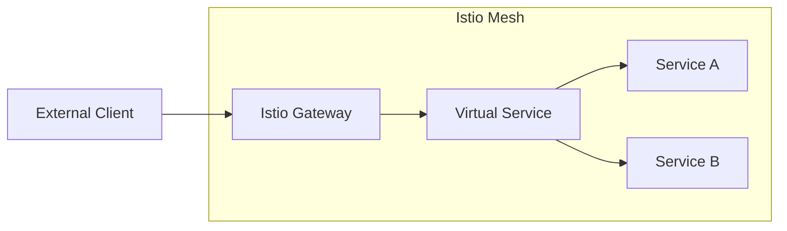

# How to Handle Istio Gateway Configuration

Author: [nawazdhandala](https://www.github.com/nawazdhandala)

Tags: Istio, Kubernetes, Service Mesh, Gateway, Networking, DevOps

Description: A practical guide to configuring Istio Gateways for managing ingress traffic in your Kubernetes service mesh, including common patterns and troubleshooting tips.

---

Istio Gateways are the entry points to your service mesh. They control how external traffic reaches your services, handling TLS termination, routing, and traffic management. Getting gateway configuration right is essential for both security and functionality.

## Understanding Istio Gateways

An Istio Gateway is different from a Kubernetes Ingress. While Ingress controllers handle basic HTTP routing, Istio Gateways give you fine-grained control over traffic at the edge of your mesh.



The architecture involves two resources working together:
- **Gateway**: Configures the load balancer (ports, protocols, TLS)
- **VirtualService**: Defines routing rules bound to the gateway

## Basic Gateway Configuration

Start with a simple HTTP gateway that listens on port 80.

```yaml
apiVersion: networking.istio.io/v1beta1
kind: Gateway
metadata:
  name: my-gateway
  namespace: istio-system
spec:
  # Select which ingress gateway pods to configure
  selector:
    istio: ingressgateway
  servers:
    - port:
        number: 80
        name: http
        protocol: HTTP
      hosts:
        - "api.example.com"
        - "web.example.com"
```

Next, bind a VirtualService to the gateway to route traffic.

```yaml
apiVersion: networking.istio.io/v1beta1
kind: VirtualService
metadata:
  name: api-routes
  namespace: default
spec:
  hosts:
    - "api.example.com"
  gateways:
    - istio-system/my-gateway  # Reference the gateway
  http:
    - match:
        - uri:
            prefix: /v1
      route:
        - destination:
            host: api-service
            port:
              number: 8080
    - route:
        - destination:
            host: api-service-legacy
            port:
              number: 8080
```

## Configuring HTTPS with TLS

Production environments need TLS. Here is how to configure HTTPS with certificate management.

### Using a Kubernetes Secret for TLS

First, create a TLS secret from your certificate files.

```bash
kubectl create secret tls api-tls-secret \
  --cert=path/to/cert.pem \
  --key=path/to/key.pem \
  -n istio-system
```

Then configure the gateway to use the secret.

```yaml
apiVersion: networking.istio.io/v1beta1
kind: Gateway
metadata:
  name: secure-gateway
  namespace: istio-system
spec:
  selector:
    istio: ingressgateway
  servers:
    - port:
        number: 443
        name: https
        protocol: HTTPS
      tls:
        mode: SIMPLE
        credentialName: api-tls-secret
      hosts:
        - "api.example.com"
    # Redirect HTTP to HTTPS
    - port:
        number: 80
        name: http
        protocol: HTTP
      tls:
        httpsRedirect: true
      hosts:
        - "api.example.com"
```

### Using cert-manager for Automatic Certificate Management

If you use cert-manager, configure the gateway to reference certificates automatically.

```yaml
apiVersion: cert-manager.io/v1
kind: Certificate
metadata:
  name: api-cert
  namespace: istio-system
spec:
  secretName: api-tls-secret
  issuerRef:
    name: letsencrypt-prod
    kind: ClusterIssuer
  dnsNames:
    - api.example.com
    - web.example.com
---
apiVersion: networking.istio.io/v1beta1
kind: Gateway
metadata:
  name: secure-gateway
  namespace: istio-system
spec:
  selector:
    istio: ingressgateway
  servers:
    - port:
        number: 443
        name: https
        protocol: HTTPS
      tls:
        mode: SIMPLE
        credentialName: api-tls-secret
      hosts:
        - "api.example.com"
        - "web.example.com"
```

## Mutual TLS (mTLS) for Client Authentication

For APIs that require client certificate authentication, configure mTLS mode.

```yaml
apiVersion: networking.istio.io/v1beta1
kind: Gateway
metadata:
  name: mtls-gateway
  namespace: istio-system
spec:
  selector:
    istio: ingressgateway
  servers:
    - port:
        number: 443
        name: https-mtls
        protocol: HTTPS
      tls:
        mode: MUTUAL
        credentialName: server-tls-secret
        # CA certificate for validating client certs
        caCertificates: /etc/istio/client-ca-certs/ca.crt
      hosts:
        - "secure-api.example.com"
```

Mount the CA certificate as a secret and configure the ingress gateway deployment to include it.

## Multi-Host Gateway Configuration

When serving multiple applications through a single gateway, organize your configuration cleanly.

```yaml
apiVersion: networking.istio.io/v1beta1
kind: Gateway
metadata:
  name: multi-app-gateway
  namespace: istio-system
spec:
  selector:
    istio: ingressgateway
  servers:
    # API application
    - port:
        number: 443
        name: https-api
        protocol: HTTPS
      tls:
        mode: SIMPLE
        credentialName: api-tls-secret
      hosts:
        - "api.example.com"
    # Web application
    - port:
        number: 443
        name: https-web
        protocol: HTTPS
      tls:
        mode: SIMPLE
        credentialName: web-tls-secret
      hosts:
        - "www.example.com"
    # Admin application with mTLS
    - port:
        number: 443
        name: https-admin
        protocol: HTTPS
      tls:
        mode: MUTUAL
        credentialName: admin-tls-secret
      hosts:
        - "admin.example.com"
```

Each application gets its own VirtualService that binds to the gateway.

```yaml
apiVersion: networking.istio.io/v1beta1
kind: VirtualService
metadata:
  name: api-vs
  namespace: api-namespace
spec:
  hosts:
    - "api.example.com"
  gateways:
    - istio-system/multi-app-gateway
  http:
    - route:
        - destination:
            host: api-service
            port:
              number: 8080
---
apiVersion: networking.istio.io/v1beta1
kind: VirtualService
metadata:
  name: web-vs
  namespace: web-namespace
spec:
  hosts:
    - "www.example.com"
  gateways:
    - istio-system/multi-app-gateway
  http:
    - route:
        - destination:
            host: web-frontend
            port:
              number: 3000
```

## Common Gateway Patterns

### Path-Based Routing

Route different URL paths to different services.

```yaml
apiVersion: networking.istio.io/v1beta1
kind: VirtualService
metadata:
  name: path-routing
spec:
  hosts:
    - "app.example.com"
  gateways:
    - istio-system/my-gateway
  http:
    - match:
        - uri:
            prefix: /api
      route:
        - destination:
            host: api-backend
    - match:
        - uri:
            prefix: /static
      route:
        - destination:
            host: cdn-service
    - route:
        - destination:
            host: web-frontend
```

### Header-Based Routing

Route based on request headers, useful for canary deployments or A/B testing.

```yaml
apiVersion: networking.istio.io/v1beta1
kind: VirtualService
metadata:
  name: header-routing
spec:
  hosts:
    - "api.example.com"
  gateways:
    - istio-system/my-gateway
  http:
    - match:
        - headers:
            x-canary:
              exact: "true"
      route:
        - destination:
            host: api-service
            subset: canary
    - route:
        - destination:
            host: api-service
            subset: stable
```

## Troubleshooting Gateway Issues

### Check Gateway Status

Verify the gateway resource is created correctly.

```bash
# List all gateways
kubectl get gateways -A

# Describe specific gateway
kubectl describe gateway my-gateway -n istio-system

# Check the ingress gateway pod logs
kubectl logs -l istio=ingressgateway -n istio-system -f
```

### Verify VirtualService Binding

Ensure VirtualServices are correctly bound to gateways.

```bash
# List virtual services with their gateways
kubectl get virtualservices -A -o custom-columns=\
NAME:.metadata.name,\
GATEWAYS:.spec.gateways,\
HOSTS:.spec.hosts
```

### Test Configuration with istioctl

Use istioctl to analyze configuration issues.

```bash
# Analyze configuration
istioctl analyze -n istio-system

# Proxy config dump for the ingress gateway
istioctl proxy-config routes deploy/istio-ingressgateway -n istio-system

# Check listeners
istioctl proxy-config listeners deploy/istio-ingressgateway -n istio-system
```

### Common Issues and Fixes

**Traffic not reaching services:**
- Check that the VirtualService hosts match the Gateway hosts
- Verify the gateway selector matches your ingress gateway labels
- Ensure the destination service exists and has endpoints

**TLS handshake failures:**
- Verify the secret exists in istio-system namespace
- Check that the credentialName matches the secret name exactly
- Validate certificate chain is complete

**404 errors:**
- Verify VirtualService is in the correct namespace
- Check that the gateway reference includes the namespace
- Ensure host matching is correct

## Best Practices

1. **Namespace Organization**: Keep gateways in istio-system but VirtualServices in application namespaces
2. **TLS Everywhere**: Always use HTTPS in production, configure HTTP to HTTPS redirects
3. **Least Privilege Hosts**: Only expose the hosts you need, avoid wildcard hosts in production
4. **Monitor Gateway Metrics**: Track request latency and error rates at the gateway level
5. **Use Semantic Port Names**: Name ports clearly (https-api, https-admin) for better debugging

Istio Gateways provide powerful traffic management at the edge of your mesh. Start simple with HTTP, add TLS for production, and use VirtualServices to implement sophisticated routing patterns as your needs grow.
