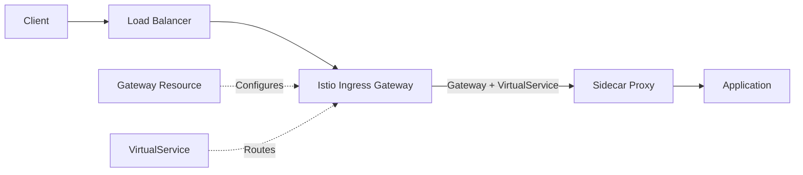

# How to Fix 'Istio Ingress' Not Working

Author: [nawazdhandala](https://www.github.com/nawazdhandala)

Tags: Istio, Kubernetes, Ingress, Gateway, Troubleshooting, Service Mesh, Networking

Description: Learn how to diagnose and fix common Istio ingress issues including 404 errors, connection refused, TLS problems, and routing failures.

---

Istio ingress not working is one of the most frustrating issues to debug. Traffic comes in through the ingress gateway but requests return 404, connection refused, or just hang. The problem could be in the Gateway, VirtualService, the backend service, or the mesh configuration itself.

This guide walks through systematic debugging steps and fixes for the most common Istio ingress problems.

## How Istio Ingress Works

Understanding the traffic flow helps pinpoint where things break:



Traffic flows through:
1. External load balancer (cloud provider or bare metal)
2. Istio Ingress Gateway (Envoy pod)
3. Gateway resource defines which hosts/ports the gateway accepts
4. VirtualService defines routing rules to backend services
5. Sidecar proxy in the destination pod
6. Application container

Problems at any step cause ingress failures.

## Problem 1: 404 Not Found

The most common issue. The ingress gateway receives traffic but returns 404.

**Check if the gateway pod is receiving traffic:**

```bash
# View ingress gateway logs
kubectl logs -n istio-system -l app=istio-ingressgateway --tail=100

# Look for access log entries
# 404 means the request reached the gateway but no route matched
```

**Common Cause: VirtualService not bound to Gateway**

```yaml
# broken-virtualservice.yaml - Missing gateway binding
apiVersion: networking.istio.io/v1beta1
kind: VirtualService
metadata:
  name: myapp
  namespace: production
spec:
  hosts:
    - myapp.example.com
  # Missing: gateways field
  http:
    - route:
        - destination:
            host: myapp
            port:
              number: 80
```

**Fix: Add the gateways field:**

```yaml
# fixed-virtualservice.yaml
apiVersion: networking.istio.io/v1beta1
kind: VirtualService
metadata:
  name: myapp
  namespace: production
spec:
  hosts:
    - myapp.example.com
  # Bind this VirtualService to the gateway
  gateways:
    - myapp-gateway  # Same namespace
    # Or use full name: istio-system/myapp-gateway
  http:
    - route:
        - destination:
            host: myapp
            port:
              number: 80
```

**Common Cause: Host mismatch between Gateway and VirtualService**

```yaml
# gateway.yaml
apiVersion: networking.istio.io/v1beta1
kind: Gateway
metadata:
  name: myapp-gateway
spec:
  selector:
    istio: ingressgateway
  servers:
    - port:
        number: 80
        name: http
        protocol: HTTP
      hosts:
        - "myapp.example.com"  # Specific host
---
# virtualservice.yaml
apiVersion: networking.istio.io/v1beta1
kind: VirtualService
metadata:
  name: myapp
spec:
  hosts:
    - "*.example.com"  # Wildcard does not match exactly
  gateways:
    - myapp-gateway
  http:
    - route:
        - destination:
            host: myapp
```

**Fix: Make hosts match:**

```yaml
# Both should have the same host
# Gateway
hosts:
  - "myapp.example.com"

# VirtualService
hosts:
  - "myapp.example.com"
```

Verify configuration is synced:

```bash
# Check if VirtualService is attached to Gateway
istioctl analyze -n production

# Check routes configured on ingress gateway
istioctl proxy-config routes deploy/istio-ingressgateway -n istio-system
```

## Problem 2: Connection Refused

Requests fail before reaching the gateway. The load balancer or gateway pod is not accepting connections.

**Check the ingress gateway service:**

```bash
# Get the external IP/hostname
kubectl get svc istio-ingressgateway -n istio-system

# Check if pods are running and ready
kubectl get pods -n istio-system -l app=istio-ingressgateway

# Check pod events for errors
kubectl describe pod -n istio-system -l app=istio-ingressgateway
```

**Common Cause: Service port not exposed in Gateway**

```yaml
# gateway-missing-port.yaml
apiVersion: networking.istio.io/v1beta1
kind: Gateway
metadata:
  name: myapp-gateway
spec:
  selector:
    istio: ingressgateway
  servers:
    - port:
        number: 443  # Only HTTPS configured
        name: https
        protocol: HTTPS
      hosts:
        - "*"
      tls:
        mode: SIMPLE
        credentialName: myapp-cert
```

**Fix: Add the missing port configuration:**

```yaml
# gateway-with-http.yaml
apiVersion: networking.istio.io/v1beta1
kind: Gateway
metadata:
  name: myapp-gateway
spec:
  selector:
    istio: ingressgateway
  servers:
    # HTTP port
    - port:
        number: 80
        name: http
        protocol: HTTP
      hosts:
        - "*"
    # HTTPS port
    - port:
        number: 443
        name: https
        protocol: HTTPS
      hosts:
        - "*"
      tls:
        mode: SIMPLE
        credentialName: myapp-cert
```

**Check if the gateway pod listens on expected ports:**

```bash
# List all listeners on ingress gateway
istioctl proxy-config listener deploy/istio-ingressgateway -n istio-system

# Should show listeners for ports 80, 443, etc.
```

## Problem 3: TLS/HTTPS Not Working

HTTPS requests fail with certificate errors or connection reset.

**Common Cause: Missing or incorrect TLS secret**

```bash
# Check if the secret exists
kubectl get secret myapp-cert -n istio-system

# Verify the secret has the required keys
kubectl get secret myapp-cert -n istio-system -o yaml
# Should have: tls.crt and tls.key
```

**Fix: Create a proper TLS secret:**

```bash
# Create TLS secret from certificate files
kubectl create secret tls myapp-cert -n istio-system \
  --cert=path/to/tls.crt \
  --key=path/to/tls.key
```

**Common Cause: Wrong credentialName in Gateway**

```yaml
# Check the Gateway TLS configuration
apiVersion: networking.istio.io/v1beta1
kind: Gateway
metadata:
  name: myapp-gateway
  namespace: production
spec:
  selector:
    istio: ingressgateway
  servers:
    - port:
        number: 443
        name: https
        protocol: HTTPS
      hosts:
        - myapp.example.com
      tls:
        mode: SIMPLE
        # credentialName must reference a secret in istio-system namespace
        # or the namespace where the gateway pod runs
        credentialName: myapp-cert
```

**Verify TLS is configured correctly:**

```bash
# Check if the certificate is loaded
istioctl proxy-config secret deploy/istio-ingressgateway -n istio-system

# Test TLS connection
openssl s_client -connect <ingress-ip>:443 -servername myapp.example.com
```

## Problem 4: Backend Service Unreachable

Gateway receives traffic but cannot reach the backend service. Returns 503 or connection timeout.

**Check if the backend service exists and has endpoints:**

```bash
# Verify service exists
kubectl get svc myapp -n production

# Check if endpoints are populated
kubectl get endpoints myapp -n production

# If endpoints are empty, pods may not be ready or labels do not match
```

**Common Cause: Service port mismatch**

```yaml
# virtualservice.yaml
http:
  - route:
      - destination:
          host: myapp
          port:
            number: 8080  # VirtualService uses 8080
---
# service.yaml
apiVersion: v1
kind: Service
metadata:
  name: myapp
spec:
  ports:
    - port: 80  # Service exposes 80, not 8080
      targetPort: 8080
```

**Fix: Match the service port:**

```yaml
# Correct the VirtualService destination port
http:
  - route:
      - destination:
          host: myapp
          port:
            number: 80  # Match the service port
```

**Check proxy connectivity to backend:**

```bash
# Check clusters (upstream services) known to ingress gateway
istioctl proxy-config cluster deploy/istio-ingressgateway -n istio-system | grep myapp

# Check endpoints for the service
istioctl proxy-config endpoint deploy/istio-ingressgateway -n istio-system | grep myapp
```

## Problem 5: Intermittent Failures

Requests work sometimes but fail randomly with 503 errors.

**Common Cause: Unhealthy pods in the backend**

```bash
# Check pod health
kubectl get pods -n production -l app=myapp

# Look for pods that are not Ready
kubectl describe pod <pod-name> -n production
```

**Configure circuit breaker to handle unhealthy backends:**

```yaml
# destination-rule.yaml
apiVersion: networking.istio.io/v1beta1
kind: DestinationRule
metadata:
  name: myapp-dr
  namespace: production
spec:
  host: myapp
  trafficPolicy:
    connectionPool:
      tcp:
        maxConnections: 100
      http:
        h2UpgradePolicy: UPGRADE
        http1MaxPendingRequests: 100
    # Outlier detection removes unhealthy pods from rotation
    outlierDetection:
      consecutive5xxErrors: 3
      interval: 10s
      baseEjectionTime: 30s
      maxEjectionPercent: 50
```

## Complete Debugging Checklist

Run through this checklist when ingress is not working:

```bash
# 1. Check ingress gateway pods are running
kubectl get pods -n istio-system -l app=istio-ingressgateway

# 2. Get external IP/hostname
kubectl get svc istio-ingressgateway -n istio-system

# 3. Verify Gateway resource exists and is valid
kubectl get gateway -A
istioctl analyze

# 4. Check VirtualService binds to Gateway
kubectl get virtualservice -A -o yaml | grep -A 5 gateways

# 5. Check routes on ingress gateway
istioctl proxy-config routes deploy/istio-ingressgateway -n istio-system

# 6. Check listeners on ingress gateway
istioctl proxy-config listener deploy/istio-ingressgateway -n istio-system

# 7. Check backend service has endpoints
kubectl get endpoints <service-name> -n <namespace>

# 8. Test from inside the cluster
kubectl run tmp --rm -it --image=curlimages/curl -- curl -v http://myapp.production.svc.cluster.local

# 9. View ingress gateway logs
kubectl logs -n istio-system -l app=istio-ingressgateway -f
```

## Working Example Configuration

Here is a complete working ingress configuration for reference:

```yaml
# Complete working ingress setup
apiVersion: networking.istio.io/v1beta1
kind: Gateway
metadata:
  name: myapp-gateway
  namespace: production
spec:
  selector:
    istio: ingressgateway
  servers:
    - port:
        number: 80
        name: http
        protocol: HTTP
      hosts:
        - "myapp.example.com"
      # Optional: redirect HTTP to HTTPS
      tls:
        httpsRedirect: true
    - port:
        number: 443
        name: https
        protocol: HTTPS
      hosts:
        - "myapp.example.com"
      tls:
        mode: SIMPLE
        credentialName: myapp-tls
---
apiVersion: networking.istio.io/v1beta1
kind: VirtualService
metadata:
  name: myapp
  namespace: production
spec:
  hosts:
    - "myapp.example.com"
  gateways:
    - myapp-gateway
  http:
    - match:
        - uri:
            prefix: /
      route:
        - destination:
            host: myapp
            port:
              number: 80
      timeout: 30s
      retries:
        attempts: 3
        perTryTimeout: 10s
```

Most ingress issues come down to mismatched hostnames, missing gateway bindings, or backend service problems. Work through the debugging checklist systematically and you will find the issue.
