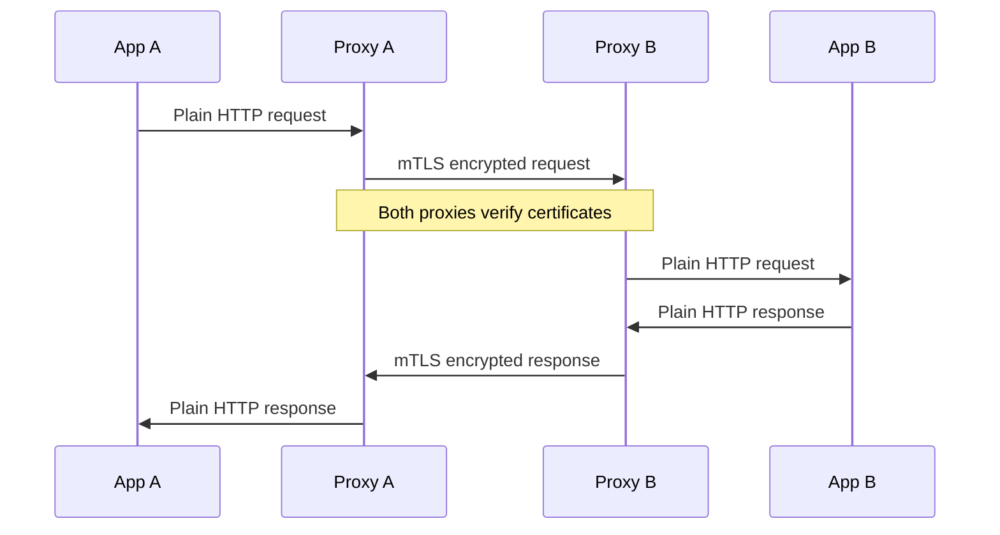

# How to Fix "mTLS" Configuration Errors in Istio

Author: [nawazdhandala](https://www.github.com/nawazdhandala)

Tags: Istio, Kubernetes, Service Mesh, mTLS, Security, TLS, Encryption

Description: Learn how to diagnose and fix mTLS configuration errors in Istio, including authentication policy mismatches, certificate issues, and migration strategies.

---

Mutual TLS (mTLS) is one of Istio's core security features. It encrypts traffic between services and verifies the identity of both the client and server. When mTLS is misconfigured, you'll see connection failures, certificate errors, and services that can't communicate. This guide helps you understand mTLS in Istio and fix common configuration problems.

## How mTLS Works in Istio

In Istio's mTLS setup, each sidecar proxy has its own certificate issued by Istio's certificate authority (istiod). When two services communicate, their sidecars perform a TLS handshake where both sides present and verify certificates.



Your application code doesn't need to handle TLS at all. The sidecars take care of encryption and certificate management automatically.

## Understanding mTLS Modes

Istio supports several mTLS modes that control how strict the enforcement is:

- **STRICT**: Only accept mTLS traffic. Reject any plain-text connections.
- **PERMISSIVE**: Accept both mTLS and plain-text traffic. Useful during migration.
- **DISABLE**: Don't use mTLS for this workload.

The mode is configured using PeerAuthentication resources.

## Common Error 1: Strict Mode with Non-Mesh Clients

The most common mTLS error happens when you enable STRICT mode but have clients that don't have Istio sidecars. These clients can't establish mTLS connections, so their requests fail.

Check if you have strict mTLS enabled:

```bash
# Check PeerAuthentication policies in your namespace
kubectl get peerauthentication -n your-namespace -o yaml

# Check mesh-wide policy
kubectl get peerauthentication -n istio-system -o yaml
```

If you see a policy like this, non-mesh traffic will be rejected:

```yaml
# Strict mTLS policy (blocks non-mesh traffic)
apiVersion: security.istio.io/v1beta1
kind: PeerAuthentication
metadata:
  name: default
  namespace: your-namespace
spec:
  mtls:
    mode: STRICT  # This rejects plain-text connections
```

**Solution 1**: Use PERMISSIVE mode during migration:

```yaml
# Permissive policy allows both mTLS and plain-text
apiVersion: security.istio.io/v1beta1
kind: PeerAuthentication
metadata:
  name: default
  namespace: your-namespace
spec:
  mtls:
    mode: PERMISSIVE
```

**Solution 2**: Exclude specific ports from mTLS:

```yaml
# Allow plain-text on specific ports
apiVersion: security.istio.io/v1beta1
kind: PeerAuthentication
metadata:
  name: default
  namespace: your-namespace
spec:
  mtls:
    mode: STRICT
  portLevelMtls:
    8080:
      mode: DISABLE  # This port accepts plain-text
```

## Common Error 2: DestinationRule TLS Mode Mismatch

DestinationRules specify how the client proxy should connect to upstream services. If the DestinationRule's TLS mode doesn't match the server's PeerAuthentication, connections will fail.

Here's a problematic scenario where the client tries plain-text but the server requires mTLS:

```yaml
# This DestinationRule disables TLS
apiVersion: networking.istio.io/v1beta1
kind: DestinationRule
metadata:
  name: my-service-dr
spec:
  host: my-service
  trafficPolicy:
    tls:
      mode: DISABLE  # Client sends plain-text
---
# But the server requires mTLS
apiVersion: security.istio.io/v1beta1
kind: PeerAuthentication
metadata:
  name: my-service-auth
  namespace: default
spec:
  selector:
    matchLabels:
      app: my-service
  mtls:
    mode: STRICT  # Server requires mTLS
```

The fix is to align the DestinationRule with the PeerAuthentication:

```yaml
# DestinationRule matching the server's mTLS requirement
apiVersion: networking.istio.io/v1beta1
kind: DestinationRule
metadata:
  name: my-service-dr
spec:
  host: my-service
  trafficPolicy:
    tls:
      mode: ISTIO_MUTUAL  # Use Istio's mTLS certificates
```

## Common Error 3: Certificate Issues

Certificate problems can cause mTLS handshake failures. Symptoms include "certificate verify failed" or "x509: certificate signed by unknown authority" errors.

Check if certificates are properly distributed:

```bash
# Check if the proxy has valid certificates
istioctl proxy-config secret your-pod.your-namespace

# Look for certificate chain issues
kubectl logs your-pod -c istio-proxy | grep -i cert

# Verify the certificate chain
istioctl proxy-config secret your-pod.your-namespace -o json | \
  jq -r '.dynamicActiveSecrets[0].secret.tlsCertificate.certificateChain.inlineBytes' | \
  base64 -d | openssl x509 -text -noout
```

If certificates are missing or expired, restart istiod and then the affected pods:

```bash
# Restart the Istio control plane
kubectl rollout restart deployment istiod -n istio-system

# Wait for istiod to be ready
kubectl wait --for=condition=ready pod -l app=istiod -n istio-system --timeout=60s

# Restart your workloads to get new certificates
kubectl rollout restart deployment -n your-namespace
```

## Common Error 4: Service Entry Without TLS Settings

When calling external services through ServiceEntry, you need to configure TLS settings correctly. Without them, Istio might try to initiate mTLS with services that don't support it.

Here's how to properly configure an external service:

```yaml
# ServiceEntry for an external HTTPS API
apiVersion: networking.istio.io/v1beta1
kind: ServiceEntry
metadata:
  name: external-api
spec:
  hosts:
  - api.external-service.com
  ports:
  - number: 443
    name: https
    protocol: HTTPS
  location: MESH_EXTERNAL
  resolution: DNS
---
# DestinationRule to handle TLS origination
apiVersion: networking.istio.io/v1beta1
kind: DestinationRule
metadata:
  name: external-api-dr
spec:
  host: api.external-service.com
  trafficPolicy:
    tls:
      mode: SIMPLE  # Standard TLS, not mTLS
      sni: api.external-service.com
```

## Common Error 5: Auto mTLS Not Working

Istio has auto mTLS which automatically detects if the destination has a sidecar and uses mTLS accordingly. If this isn't working, check these settings:

```bash
# Verify auto mTLS is enabled in the mesh config
kubectl get configmap istio -n istio-system -o yaml | grep -A 5 "enableAutoMtls"
```

Auto mTLS should be enabled by default. If it's disabled, you can enable it:

```yaml
# Enable auto mTLS in IstioOperator
apiVersion: install.istio.io/v1alpha1
kind: IstioOperator
spec:
  meshConfig:
    enableAutoMtls: true
```

## Debugging mTLS Issues

These commands help you diagnose mTLS problems:

```bash
# Check the actual TLS mode being used between services
istioctl x authz check your-pod.your-namespace

# View TLS configuration for a specific route
istioctl proxy-config cluster your-pod.your-namespace --fqdn your-service.your-namespace.svc.cluster.local -o json | jq '.[] | .transportSocket'

# Check for authentication policy conflicts
istioctl analyze -n your-namespace

# See all PeerAuthentication policies affecting a workload
kubectl get peerauthentication --all-namespaces

# Test connectivity with debug logging
kubectl exec -it your-pod -c istio-proxy -- curl -v https://target-service:8080
```

## Migration Strategy: Plain-text to mTLS

When migrating an existing cluster to mTLS, follow this sequence to avoid outages:


Step 1: Set mesh-wide PERMISSIVE mode:

```yaml
apiVersion: security.istio.io/v1beta1
kind: PeerAuthentication
metadata:
  name: default
  namespace: istio-system
spec:
  mtls:
    mode: PERMISSIVE
```

Step 2: Add Istio sidecars to all workloads by labeling namespaces and restarting deployments.

Step 3: Verify mTLS is being used with Kiali or proxy logs.

Step 4: Enable STRICT mode namespace by namespace, starting with less critical services.

Step 5: Finally, enable mesh-wide STRICT mode once all services are verified.

mTLS configuration errors often come down to mismatches between what the client expects and what the server requires. By systematically checking PeerAuthentication policies, DestinationRules, and certificate status, you can identify and resolve most issues. Remember to use PERMISSIVE mode during transitions and always test changes in a staging environment first.
