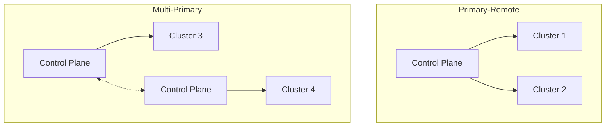

# How to Handle Istio Multi-Cluster Setup

Author: [nawazdhandala](https://www.github.com/nawazdhandala)

Tags: Istio, Kubernetes, Multi-Cluster, Service Mesh, Federation, High Availability, DevOps

Description: Learn how to set up and manage Istio across multiple Kubernetes clusters for high availability, disaster recovery, and geographic distribution.

---

Running Istio across multiple clusters enables cross-cluster service discovery, load balancing, and failover. Whether you need geographic distribution, disaster recovery, or just want to spread workloads across clusters, multi-cluster Istio makes services in different clusters communicate as if they were in one mesh.

This guide covers the different multi-cluster topologies, setup steps, and troubleshooting common issues.

## Multi-Cluster Topology Options

Istio supports several multi-cluster configurations. Choose based on your network topology and requirements.



**Primary-Remote:** One cluster runs the control plane, remote clusters connect to it. Simpler but creates a single point of failure.

**Multi-Primary:** Each cluster has its own control plane. Control planes share configuration. More resilient but more complex.

**Shared Control Plane (Deprecated):** Single external control plane for all clusters. Replaced by primary-remote in newer Istio versions.

## Prerequisites

Before setting up multi-cluster Istio, ensure:

1. **Network connectivity** between clusters (either flat network or through gateways)
2. **Root CA certificates** that can be shared or a common trust domain
3. **Similar Istio versions** across all clusters
4. **Unique cluster and network names**

Check cluster connectivity:

```bash
# From cluster 1, test connectivity to cluster 2 API server
kubectl --context=cluster1 run tmp --rm -it --image=curlimages/curl -- \
  curl -k https://<cluster2-api-server>:6443

# Verify you can access both clusters
kubectl --context=cluster1 get nodes
kubectl --context=cluster2 get nodes
```

## Setting Up Multi-Primary on Different Networks

This is the most common production setup. Each cluster has its own control plane, and clusters communicate through east-west gateways.

### Step 1: Configure Trust Between Clusters

Both clusters need certificates from the same root CA. Generate and distribute certificates:

```bash
# Create a directory for certificates
mkdir -p certs && cd certs

# Generate root CA (do this once)
make -f istio-*/tools/certs/Makefile.selfsigned.mk root-ca

# Generate intermediate CA for cluster1
make -f istio-*/tools/certs/Makefile.selfsigned.mk cluster1-cacerts

# Generate intermediate CA for cluster2
make -f istio-*/tools/certs/Makefile.selfsigned.mk cluster2-cacerts
```

Create the cacerts secret in each cluster:

```bash
# Create namespace and secret in cluster1
kubectl --context=cluster1 create namespace istio-system
kubectl --context=cluster1 create secret generic cacerts -n istio-system \
  --from-file=cluster1/ca-cert.pem \
  --from-file=cluster1/ca-key.pem \
  --from-file=cluster1/root-cert.pem \
  --from-file=cluster1/cert-chain.pem

# Create namespace and secret in cluster2
kubectl --context=cluster2 create namespace istio-system
kubectl --context=cluster2 create secret generic cacerts -n istio-system \
  --from-file=cluster2/ca-cert.pem \
  --from-file=cluster2/ca-key.pem \
  --from-file=cluster2/root-cert.pem \
  --from-file=cluster2/cert-chain.pem
```

### Step 2: Install Istio on Cluster 1

Create the installation configuration for cluster 1:

```yaml
# cluster1-config.yaml
apiVersion: install.istio.io/v1alpha1
kind: IstioOperator
spec:
  # Unique name for this cluster
  values:
    global:
      meshID: mesh1
      multiCluster:
        clusterName: cluster1
      network: network1
  # Enable the east-west gateway for cross-cluster traffic
  components:
    ingressGateways:
      - name: istio-eastwestgateway
        label:
          istio: eastwestgateway
          app: istio-eastwestgateway
        enabled: true
        k8s:
          env:
            # Required for SNI-based routing between clusters
            - name: ISTIO_META_ROUTER_MODE
              value: "sni-dnat"
            - name: ISTIO_META_REQUESTED_NETWORK_VIEW
              value: network1
          service:
            ports:
              - name: status-port
                port: 15021
                targetPort: 15021
              - name: tls
                port: 15443
                targetPort: 15443
              - name: tls-istiod
                port: 15012
                targetPort: 15012
              - name: tls-webhook
                port: 15017
                targetPort: 15017
```

Install Istio on cluster 1:

```bash
# Install Istio with multi-cluster configuration
istioctl install --context=cluster1 -f cluster1-config.yaml -y

# Verify installation
kubectl --context=cluster1 get pods -n istio-system
```

### Step 3: Expose Services in Cluster 1

Create a Gateway to expose services to other clusters:

```yaml
# expose-services-cluster1.yaml
apiVersion: networking.istio.io/v1beta1
kind: Gateway
metadata:
  name: cross-network-gateway
  namespace: istio-system
spec:
  selector:
    istio: eastwestgateway
  servers:
    - port:
        number: 15443
        name: tls
        protocol: TLS
      tls:
        mode: AUTO_PASSTHROUGH
      hosts:
        # Expose all services in the mesh
        - "*.local"
```

Apply the gateway:

```bash
kubectl --context=cluster1 apply -f expose-services-cluster1.yaml
```

### Step 4: Install Istio on Cluster 2

Create similar configuration for cluster 2:

```yaml
# cluster2-config.yaml
apiVersion: install.istio.io/v1alpha1
kind: IstioOperator
spec:
  values:
    global:
      meshID: mesh1
      multiCluster:
        clusterName: cluster2
      network: network2
  components:
    ingressGateways:
      - name: istio-eastwestgateway
        label:
          istio: eastwestgateway
          app: istio-eastwestgateway
        enabled: true
        k8s:
          env:
            - name: ISTIO_META_ROUTER_MODE
              value: "sni-dnat"
            - name: ISTIO_META_REQUESTED_NETWORK_VIEW
              value: network2
          service:
            ports:
              - name: status-port
                port: 15021
                targetPort: 15021
              - name: tls
                port: 15443
                targetPort: 15443
              - name: tls-istiod
                port: 15012
                targetPort: 15012
              - name: tls-webhook
                port: 15017
                targetPort: 15017
```

Install and expose services:

```bash
# Install Istio on cluster 2
istioctl install --context=cluster2 -f cluster2-config.yaml -y

# Apply the cross-network gateway
kubectl --context=cluster2 apply -f expose-services-cluster2.yaml
```

### Step 5: Enable Endpoint Discovery

Each cluster needs to know about services in other clusters. Create remote secrets:

```bash
# Create a secret in cluster1 that provides access to cluster2 API server
istioctl create-remote-secret --context=cluster2 --name=cluster2 | \
  kubectl --context=cluster1 apply -f -

# Create a secret in cluster2 that provides access to cluster1 API server
istioctl create-remote-secret --context=cluster1 --name=cluster1 | \
  kubectl --context=cluster2 apply -f -
```

Verify the secrets were created:

```bash
# Check remote secrets in cluster1
kubectl --context=cluster1 get secrets -n istio-system | grep istio-remote-secret

# Check remote secrets in cluster2
kubectl --context=cluster2 get secrets -n istio-system | grep istio-remote-secret
```

## Verifying Multi-Cluster Setup

Deploy a test application across both clusters:

```yaml
# test-deployment.yaml
apiVersion: apps/v1
kind: Deployment
metadata:
  name: helloworld
  labels:
    app: helloworld
spec:
  replicas: 1
  selector:
    matchLabels:
      app: helloworld
  template:
    metadata:
      labels:
        app: helloworld
    spec:
      containers:
        - name: helloworld
          image: docker.io/istio/examples-helloworld-v1
          ports:
            - containerPort: 5000
---
apiVersion: v1
kind: Service
metadata:
  name: helloworld
spec:
  selector:
    app: helloworld
  ports:
    - port: 5000
      targetPort: 5000
```

Deploy to both clusters:

```bash
# Deploy to cluster1
kubectl --context=cluster1 create namespace sample
kubectl --context=cluster1 label namespace sample istio-injection=enabled
kubectl --context=cluster1 apply -f test-deployment.yaml -n sample

# Deploy to cluster2
kubectl --context=cluster2 create namespace sample
kubectl --context=cluster2 label namespace sample istio-injection=enabled
kubectl --context=cluster2 apply -f test-deployment.yaml -n sample
```

Test cross-cluster connectivity:

```bash
# Deploy a client pod in cluster1
kubectl --context=cluster1 run client --rm -it --image=curlimages/curl -n sample -- sh

# Inside the pod, call the helloworld service multiple times
# You should see responses from both clusters
for i in $(seq 1 10); do curl -s helloworld:5000/hello; done
```

## Troubleshooting Multi-Cluster Issues

### Issue: Services Not Discovered Across Clusters

Check if remote endpoints are visible:

```bash
# Check endpoints in cluster1 for services from cluster2
istioctl --context=cluster1 proxy-config endpoint deploy/helloworld -n sample | grep helloworld
```

Verify remote secrets are working:

```bash
# Check istiod logs for remote cluster connection errors
kubectl --context=cluster1 logs -n istio-system -l app=istiod | grep -i "remote"
```

### Issue: Cross-Cluster Traffic Fails

Verify east-west gateway is reachable:

```bash
# Get the east-west gateway external IP
kubectl --context=cluster1 get svc istio-eastwestgateway -n istio-system

# Test connectivity from cluster2 to cluster1 gateway
kubectl --context=cluster2 run tmp --rm -it --image=curlimages/curl -- \
  curl -v <cluster1-eastwest-gateway-ip>:15443
```

Check certificate trust:

```bash
# Verify certificates match between clusters
kubectl --context=cluster1 get secret cacerts -n istio-system -o jsonpath='{.data.root-cert\.pem}' | base64 -d | openssl x509 -text | grep Issuer

kubectl --context=cluster2 get secret cacerts -n istio-system -o jsonpath='{.data.root-cert\.pem}' | base64 -d | openssl x509 -text | grep Issuer
```

### Issue: High Latency for Cross-Cluster Calls

Configure locality load balancing to prefer local instances:

```yaml
# locality-load-balancing.yaml
apiVersion: networking.istio.io/v1beta1
kind: DestinationRule
metadata:
  name: helloworld-locality
  namespace: sample
spec:
  host: helloworld.sample.svc.cluster.local
  trafficPolicy:
    connectionPool:
      http:
        h2UpgradePolicy: UPGRADE
    loadBalancer:
      simple: ROUND_ROBIN
      localityLbSetting:
        # Enable locality-aware load balancing
        enabled: true
        # Failover to other regions if local is unhealthy
        failoverPriority:
          - "topology.kubernetes.io/region"
          - "topology.kubernetes.io/zone"
    outlierDetection:
      consecutive5xxErrors: 5
      interval: 30s
      baseEjectionTime: 30s
```

## Best Practices

1. **Use different networks only when necessary.** Flat networks (same network) are simpler and have lower latency.

2. **Monitor cross-cluster traffic.** Set up alerts for east-west gateway health and latency.

3. **Plan for control plane failures.** In multi-primary, one control plane going down should not affect the other cluster.

4. **Keep Istio versions in sync.** Version skew between clusters can cause unexpected behavior.

5. **Test failover regularly.** Simulate cluster failures to ensure traffic routes correctly.

Multi-cluster Istio adds complexity but enables powerful use cases like geographic redundancy and hybrid cloud deployments. Start with a simple two-cluster setup and expand once you are comfortable with the operational model.
