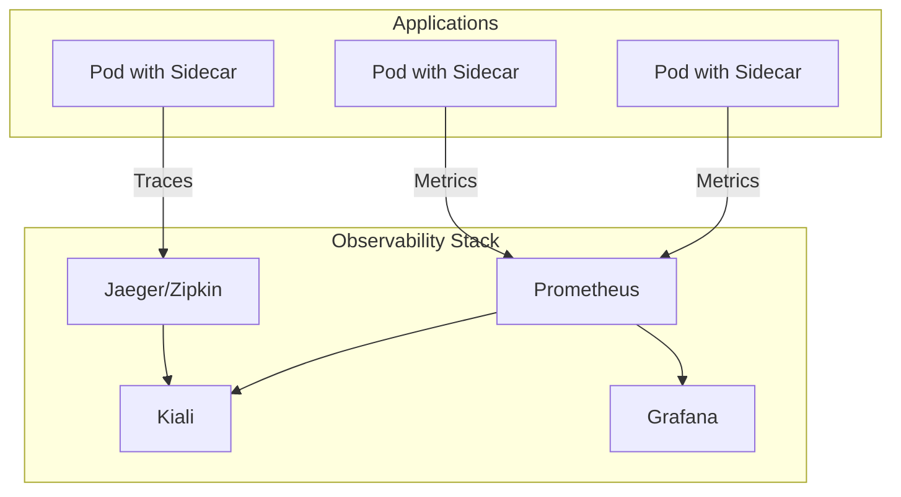

# How to Handle Istio Observability Setup

Author: [nawazdhandala](https://www.github.com/nawazdhandala)

Tags: Istio, Observability, Kubernetes, Prometheus, Grafana, Jaeger, Kiali, Service Mesh, Monitoring

Description: A complete guide to setting up observability in Istio with metrics, distributed tracing, and service graph visualization using Prometheus, Jaeger, and Kiali.

---

One of the biggest advantages of running Istio is the built-in observability you get for free. Every request flowing through the mesh generates metrics, traces, and logs without changing your application code. Setting this up correctly makes debugging production issues much easier.

## Istio Observability Architecture

Istio provides three pillars of observability through its Envoy sidecars.



- **Metrics**: Request counts, latencies, error rates (Prometheus)
- **Traces**: Distributed request tracing across services (Jaeger/Zipkin)
- **Service Graph**: Visualization of service dependencies (Kiali)

## Installing the Observability Stack

### Option 1: Install with Istio Addons

The quickest way to get started is using the sample addons that come with Istio.

```bash
# Navigate to your Istio installation directory
cd istio-1.20.0

# Install all observability addons
kubectl apply -f samples/addons/

# Wait for deployments to be ready
kubectl rollout status deployment/prometheus -n istio-system
kubectl rollout status deployment/grafana -n istio-system
kubectl rollout status deployment/jaeger -n istio-system
kubectl rollout status deployment/kiali -n istio-system
```

### Option 2: Production-Ready Installation

For production, install each component with proper configuration.

First, install Prometheus with Istio-specific scrape configs.

```yaml
apiVersion: v1
kind: ConfigMap
metadata:
  name: prometheus
  namespace: istio-system
data:
  prometheus.yml: |
    global:
      scrape_interval: 15s
      evaluation_interval: 15s

    scrape_configs:
      # Scrape Istio control plane
      - job_name: 'istiod'
        kubernetes_sd_configs:
          - role: pod
            namespaces:
              names:
                - istio-system
        relabel_configs:
          - source_labels: [__meta_kubernetes_pod_label_app]
            action: keep
            regex: istiod

      # Scrape Envoy sidecars
      - job_name: 'envoy-stats'
        metrics_path: /stats/prometheus
        kubernetes_sd_configs:
          - role: pod
        relabel_configs:
          - source_labels: [__meta_kubernetes_pod_container_port_name]
            action: keep
            regex: '.*-envoy-prom'
          - source_labels: [__address__, __meta_kubernetes_pod_annotation_prometheus_io_port]
            action: replace
            regex: ([^:]+)(?::\d+)?;(\d+)
            replacement: $1:15090
            target_label: __address__
```

## Configuring Metrics Collection

### Enable Prometheus Metrics in Istio

Configure Istio to expose metrics that Prometheus can scrape.

```yaml
apiVersion: install.istio.io/v1alpha1
kind: IstioOperator
spec:
  meshConfig:
    enablePrometheusMerge: true
    defaultConfig:
      proxyStatsMatcher:
        inclusionPrefixes:
          - "cluster.outbound"
          - "listener"
          - "http"
        inclusionRegexps:
          - ".*circuit_breakers.*"
```

### Key Istio Metrics

Istio generates these metrics by default.

```promql
# Request count by source and destination
istio_requests_total{
  source_workload="frontend",
  destination_workload="api"
}

# Request duration histogram
istio_request_duration_milliseconds_bucket{
  destination_service="api.default.svc.cluster.local"
}

# Request size
istio_request_bytes_bucket

# Response size
istio_response_bytes_bucket

# TCP connections
istio_tcp_connections_opened_total
istio_tcp_connections_closed_total
```

### Custom Metrics with Telemetry API

Define custom metrics using the Telemetry resource.

```yaml
apiVersion: telemetry.istio.io/v1alpha1
kind: Telemetry
metadata:
  name: custom-metrics
  namespace: istio-system
spec:
  metrics:
    - providers:
        - name: prometheus
      overrides:
        - match:
            metric: REQUEST_COUNT
          tagOverrides:
            request_host:
              operation: UPSERT
              value: request.host
        - match:
            metric: REQUEST_DURATION
          tagOverrides:
            request_protocol:
              operation: UPSERT
              value: request.protocol
```

## Setting Up Distributed Tracing

### Configure Tracing in Istio

Enable tracing and set the sampling rate.

```yaml
apiVersion: install.istio.io/v1alpha1
kind: IstioOperator
spec:
  meshConfig:
    enableTracing: true
    defaultConfig:
      tracing:
        sampling: 10.0  # 10% of requests
        zipkin:
          address: jaeger-collector.istio-system:9411
```

For production, use a lower sampling rate (1-10%) to reduce overhead.

### Deploy Jaeger

Install Jaeger with persistent storage for production.

```yaml
apiVersion: apps/v1
kind: Deployment
metadata:
  name: jaeger
  namespace: istio-system
spec:
  replicas: 1
  selector:
    matchLabels:
      app: jaeger
  template:
    metadata:
      labels:
        app: jaeger
    spec:
      containers:
        - name: jaeger
          image: jaegertracing/all-in-one:1.50
          ports:
            - containerPort: 16686  # UI
            - containerPort: 9411   # Zipkin collector
            - containerPort: 14268  # Jaeger collector
          env:
            - name: COLLECTOR_ZIPKIN_HOST_PORT
              value: ":9411"
            - name: SPAN_STORAGE_TYPE
              value: "elasticsearch"
            - name: ES_SERVER_URLS
              value: "http://elasticsearch:9200"
---
apiVersion: v1
kind: Service
metadata:
  name: jaeger-collector
  namespace: istio-system
spec:
  ports:
    - name: zipkin
      port: 9411
    - name: jaeger
      port: 14268
  selector:
    app: jaeger
---
apiVersion: v1
kind: Service
metadata:
  name: tracing
  namespace: istio-system
spec:
  ports:
    - name: http
      port: 80
      targetPort: 16686
  selector:
    app: jaeger
```

### Propagate Trace Headers in Your Application

For traces to connect across services, your application must forward these headers.

```python
# Python example using Flask
TRACE_HEADERS = [
    'x-request-id',
    'x-b3-traceid',
    'x-b3-spanid',
    'x-b3-parentspanid',
    'x-b3-sampled',
    'x-b3-flags',
    'x-ot-span-context',
    'traceparent',
    'tracestate',
]

@app.route('/api/data')
def get_data():
    # Forward trace headers to downstream services
    headers = {h: request.headers.get(h) for h in TRACE_HEADERS if request.headers.get(h)}

    response = requests.get('http://downstream-service/data', headers=headers)
    return response.json()
```

## Setting Up Kiali for Service Graph

Kiali provides a visual representation of your service mesh.

### Install Kiali

```yaml
apiVersion: v1
kind: Secret
metadata:
  name: kiali
  namespace: istio-system
type: Opaque
data:
  username: YWRtaW4=  # admin
  passphrase: YWRtaW4=  # admin
---
apiVersion: apps/v1
kind: Deployment
metadata:
  name: kiali
  namespace: istio-system
spec:
  replicas: 1
  selector:
    matchLabels:
      app: kiali
  template:
    metadata:
      labels:
        app: kiali
    spec:
      containers:
        - name: kiali
          image: quay.io/kiali/kiali:v1.76
          ports:
            - containerPort: 20001
          env:
            - name: AUTH_STRATEGY
              value: "token"
          volumeMounts:
            - name: kiali-config
              mountPath: /kiali-configuration
      volumes:
        - name: kiali-config
          configMap:
            name: kiali
---
apiVersion: v1
kind: ConfigMap
metadata:
  name: kiali
  namespace: istio-system
data:
  config.yaml: |
    server:
      port: 20001
    external_services:
      prometheus:
        url: http://prometheus:9090
      tracing:
        url: http://tracing:80
      grafana:
        url: http://grafana:3000
    auth:
      strategy: token
```

### Access Kiali Dashboard

```bash
# Port forward to access Kiali
kubectl port-forward svc/kiali -n istio-system 20001:20001

# Or use istioctl
istioctl dashboard kiali
```

## Grafana Dashboards for Istio

### Install Istio Dashboards

Import the official Istio dashboards into Grafana.

```bash
# The dashboards are included with the Istio addon installation
# Key dashboard IDs:
# - 7639: Istio Mesh Dashboard
# - 7636: Istio Service Dashboard
# - 7630: Istio Workload Dashboard
# - 11829: Istio Performance Dashboard
```

### Custom Dashboard Queries

Create dashboards with these useful queries.

```promql
# Success rate by service
sum(rate(istio_requests_total{response_code!~"5.*"}[5m])) by (destination_service)
/
sum(rate(istio_requests_total[5m])) by (destination_service)

# P99 latency by service
histogram_quantile(0.99,
  sum(rate(istio_request_duration_milliseconds_bucket[5m])) by (le, destination_service)
)

# Error rate by source
sum(rate(istio_requests_total{response_code=~"5.*"}[5m])) by (source_workload)

# Request throughput
sum(rate(istio_requests_total[5m])) by (destination_service)
```

## Access Logging

Enable access logs for detailed request information.

```yaml
apiVersion: telemetry.istio.io/v1alpha1
kind: Telemetry
metadata:
  name: mesh-logging
  namespace: istio-system
spec:
  accessLogging:
    - providers:
        - name: envoy
      filter:
        expression: response.code >= 400
```

View logs from the sidecar.

```bash
# Get access logs from a specific pod
kubectl logs <pod-name> -c istio-proxy -f

# Filter for errors
kubectl logs <pod-name> -c istio-proxy | grep "response_code\":5"
```

## Production Checklist

Before going to production, verify these items.

```bash
# Check Prometheus is scraping targets
kubectl port-forward svc/prometheus -n istio-system 9090:9090
# Visit http://localhost:9090/targets

# Verify Jaeger is receiving traces
kubectl port-forward svc/tracing -n istio-system 16686:80
# Visit http://localhost:16686

# Check Kiali can see services
istioctl dashboard kiali
# Verify service graph shows your applications

# Test metrics are being collected
kubectl exec -it <any-pod> -c istio-proxy -- \
  curl -s localhost:15000/stats/prometheus | head -50
```

### Resource Considerations

Observability tools consume resources. Plan accordingly.

| Component | CPU Request | Memory Request | Storage |
|-----------|------------|----------------|---------|
| Prometheus | 500m | 2Gi | 50Gi+ |
| Jaeger | 200m | 1Gi | Depends on retention |
| Kiali | 100m | 256Mi | None |
| Grafana | 100m | 256Mi | 1Gi |

Set up retention policies to manage storage.

```yaml
# Prometheus retention
args:
  - '--storage.tsdb.retention.time=15d'
  - '--storage.tsdb.retention.size=45GB'
```

Observability is what makes a service mesh worth the operational overhead. With metrics, traces, and service graphs properly configured, you can understand exactly what is happening in your system and troubleshoot issues quickly. Start with the basic addon installation, then customize as your needs grow.
