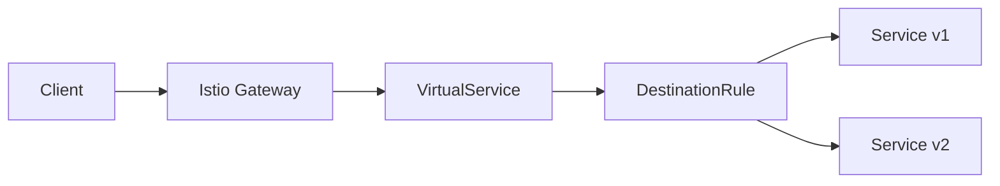
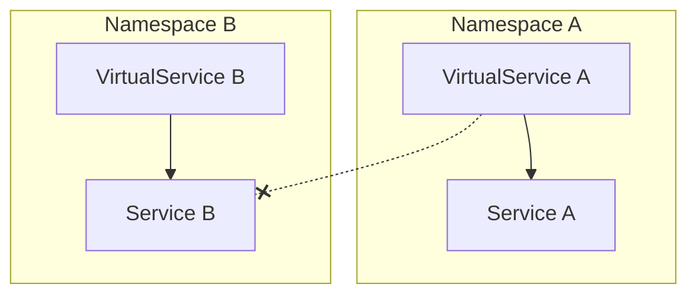

# How to Fix 'Request Routing' Issues in Istio

Author: [nawazdhandala](https://www.github.com/nawazdhandala)

Tags: Istio, Service Mesh, Kubernetes, Request Routing, VirtualService, Traffic Management

Description: A practical guide to diagnosing and fixing common request routing issues in Istio, including VirtualService misconfigurations, host matching problems, and route precedence errors.

---

Request routing in Istio seems simple until it stops working. You deploy a VirtualService, expect traffic to flow to your canary deployment, and instead everything goes to the old version. Or worse, you get 404s even though your service is running fine. This guide walks through the most common routing issues and how to fix them.

## How Istio Routing Works

Before diving into fixes, let's understand how Istio routes requests. When a request hits the mesh, it goes through several layers.



The VirtualService defines the routing rules, and the DestinationRule defines the policies after routing decisions are made. Getting this order wrong is the source of most problems.

## Problem 1: VirtualService Not Matching Requests

The most common issue is that your VirtualService exists but requests bypass it completely.

### Check the Host Field

The `hosts` field in your VirtualService must match exactly what the client uses to reach your service.

Here is a VirtualService that only works for internal cluster traffic:

```yaml
# This VirtualService only matches internal cluster DNS
apiVersion: networking.istio.io/v1beta1
kind: VirtualService
metadata:
  name: reviews-route
  namespace: default
spec:
  hosts:
    - reviews  # Only matches "reviews" exactly
  http:
    - route:
        - destination:
            host: reviews
            subset: v1
```

If you are calling from outside the cluster or using the full DNS name, you need to include all possible hostnames:

```yaml
# This VirtualService matches multiple host patterns
apiVersion: networking.istio.io/v1beta1
kind: VirtualService
metadata:
  name: reviews-route
  namespace: default
spec:
  hosts:
    - reviews
    - reviews.default
    - reviews.default.svc.cluster.local
  http:
    - route:
        - destination:
            host: reviews
            subset: v1
```

### Verify Gateway Binding

For external traffic, your VirtualService needs to bind to a Gateway:

```yaml
apiVersion: networking.istio.io/v1beta1
kind: VirtualService
metadata:
  name: reviews-external
  namespace: default
spec:
  hosts:
    - reviews.example.com
  gateways:
    - reviews-gateway  # Must match your Gateway name
  http:
    - route:
        - destination:
            host: reviews
            subset: v1
```

Check that the Gateway exists and is configured correctly:

```bash
# List all gateways and check their configuration
kubectl get gateway -A
kubectl describe gateway reviews-gateway -n default
```

## Problem 2: Route Precedence Confusion

Istio evaluates routes in order, and the first match wins. This catches people off guard.

Consider this configuration where the specific path never matches because the catch-all comes first:

```yaml
# Wrong order - specific route never matches
apiVersion: networking.istio.io/v1beta1
kind: VirtualService
metadata:
  name: api-routes
spec:
  hosts:
    - api.example.com
  http:
    # This matches everything first
    - route:
        - destination:
            host: api-service
            subset: v1
    # This never gets evaluated
    - match:
        - uri:
            prefix: /v2/
      route:
        - destination:
            host: api-service
            subset: v2
```

Here is the corrected version with specific routes first:

```yaml
# Correct order - specific routes first
apiVersion: networking.istio.io/v1beta1
kind: VirtualService
metadata:
  name: api-routes
spec:
  hosts:
    - api.example.com
  http:
    # Specific route first
    - match:
        - uri:
            prefix: /v2/
      route:
        - destination:
            host: api-service
            subset: v2
    # Catch-all route last
    - route:
        - destination:
            host: api-service
            subset: v1
```

## Problem 3: Missing DestinationRule Subsets

You reference a subset in your VirtualService but haven't defined it in a DestinationRule.

```bash
# Check for this common error message in proxy logs
kubectl logs <pod-name> -c istio-proxy | grep "no healthy upstream"
```

Make sure your DestinationRule defines all referenced subsets:

```yaml
apiVersion: networking.istio.io/v1beta1
kind: DestinationRule
metadata:
  name: reviews-destination
  namespace: default
spec:
  host: reviews
  subsets:
    - name: v1
      labels:
        version: v1
    - name: v2
      labels:
        version: v2
    - name: v3
      labels:
        version: v3
```

Verify your pods have the correct labels:

```bash
# Check that pods have version labels matching your subsets
kubectl get pods -l app=reviews --show-labels
```

## Problem 4: Namespace Boundaries

Istio VirtualServices are namespace-scoped by default. A VirtualService in namespace A won't affect traffic in namespace B.



To route across namespaces, use the full service name:

```yaml
apiVersion: networking.istio.io/v1beta1
kind: VirtualService
metadata:
  name: cross-namespace-route
  namespace: frontend
spec:
  hosts:
    - backend.backend-ns.svc.cluster.local
  http:
    - route:
        - destination:
            host: backend.backend-ns.svc.cluster.local
            port:
              number: 8080
```

You also need to export the service using a ServiceEntry or ensure the DestinationRule is in the correct namespace.

## Problem 5: Header-Based Routing Not Working

Header matching is case-sensitive and exact by default:

```yaml
apiVersion: networking.istio.io/v1beta1
kind: VirtualService
metadata:
  name: header-routing
spec:
  hosts:
    - api.example.com
  http:
    - match:
        - headers:
            x-api-version:
              exact: "v2"  # Case sensitive, must be exactly "v2"
      route:
        - destination:
            host: api-service
            subset: v2
    - route:
        - destination:
            host: api-service
            subset: v1
```

For case-insensitive matching, use regex:

```yaml
- match:
    - headers:
        x-api-version:
          regex: "(?i)v2"  # Case insensitive match
```

## Debugging Tools

### Check Istio Proxy Configuration

Use `istioctl` to verify what configuration the proxy actually has:

```bash
# See all routes configured in the proxy
istioctl proxy-config routes <pod-name> -o json

# Check cluster configuration
istioctl proxy-config clusters <pod-name>

# Analyze configuration for issues
istioctl analyze -n default
```

### Enable Access Logging

Add access logs to see exactly what Istio is doing with your requests:

```yaml
apiVersion: telemetry.istio.io/v1alpha1
kind: Telemetry
metadata:
  name: mesh-default
  namespace: istio-system
spec:
  accessLogging:
    - providers:
        - name: envoy
```

Then check the logs:

```bash
# View access logs from the sidecar
kubectl logs <pod-name> -c istio-proxy
```

### Test with curl

Test your routing rules directly:

```bash
# Test from inside the mesh using a debug pod
kubectl run curl-test --image=curlimages/curl --rm -it -- sh

# Then test with headers
curl -H "x-api-version: v2" http://api-service:8080/endpoint
```

## Common Fixes Checklist

When routing is not working as expected, go through this checklist:

1. Verify the VirtualService `hosts` field matches the hostname used by clients
2. Check that the Gateway exists and binds to the correct VirtualService
3. Confirm route order has specific matches before catch-all rules
4. Validate that all referenced subsets exist in a DestinationRule
5. Ensure pod labels match the subset label selectors
6. Check namespace boundaries for cross-namespace routing
7. Run `istioctl analyze` to catch configuration errors
8. Review proxy logs for upstream connection failures

## Best Practices

Keep your routing configuration maintainable with these practices:

1. Use consistent naming between VirtualServices, DestinationRules, and Services
2. Always define a default route as the last rule
3. Test routing changes in a staging environment first
4. Use `istioctl analyze` in your CI/CD pipeline
5. Document the intended traffic flow in comments within your YAML files

---

Request routing issues in Istio usually come down to mismatched hostnames, incorrect route ordering, or missing DestinationRule subsets. Use `istioctl analyze` liberally and check proxy logs when things go wrong. Once you understand the evaluation order and namespace boundaries, most routing problems become straightforward to diagnose.
