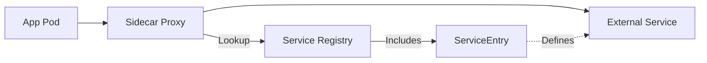

# How to Fix "Service Entry" Configuration Errors in Istio

Author: [nawazdhandala](https://www.github.com/nawazdhandala)

Tags: Istio, Kubernetes, ServiceEntry, Troubleshooting, Service Mesh, Networking, Configuration

Description: Learn how to diagnose and fix common ServiceEntry configuration errors in Istio including DNS resolution failures, protocol mismatches, and routing issues.

---

ServiceEntry is one of the most commonly misconfigured resources in Istio. It defines how your mesh accesses external services, and getting it wrong means broken connections, failed requests, or traffic routing to the wrong place. This guide walks through the most common ServiceEntry errors and how to fix them.

## How ServiceEntry Works

Before diving into errors, let us understand what ServiceEntry does:



ServiceEntry adds external services to Istio's internal service registry. Without it, the sidecar proxy does not know how to handle traffic to external destinations (especially in REGISTRY_ONLY mode).

## Error 1: DNS Resolution Failures

The most common ServiceEntry error is DNS resolution not working. You will see errors like "no healthy upstream" or connection timeouts.

**Symptom:**
```bash
# Testing from inside a pod
$ curl https://api.example.com/v1/data
curl: (6) Could not resolve host: api.example.com
```

**Root Cause:** The `resolution` field is set incorrectly for your use case.

Here is a broken ServiceEntry:

```yaml
# broken-resolution.yaml - This will cause DNS failures
apiVersion: networking.istio.io/v1beta1
kind: ServiceEntry
metadata:
  name: external-api
spec:
  hosts:
    - api.example.com
  location: MESH_EXTERNAL
  ports:
    - number: 443
      name: https
      protocol: HTTPS
  # STATIC resolution requires endpoints, but none are provided
  resolution: STATIC
```

**Fix:** Match the resolution type to your service type:

```yaml
# fixed-dns-resolution.yaml
apiVersion: networking.istio.io/v1beta1
kind: ServiceEntry
metadata:
  name: external-api
spec:
  hosts:
    - api.example.com
  location: MESH_EXTERNAL
  ports:
    - number: 443
      name: https
      protocol: HTTPS
  # Use DNS resolution for external hostnames
  # This tells Istio to perform DNS lookup at connection time
  resolution: DNS
```

If you need STATIC resolution, provide the endpoints:

```yaml
# static-with-endpoints.yaml
apiVersion: networking.istio.io/v1beta1
kind: ServiceEntry
metadata:
  name: external-api-static
spec:
  hosts:
    - api.example.com
  location: MESH_EXTERNAL
  ports:
    - number: 443
      name: https
      protocol: HTTPS
  resolution: STATIC
  # Required when using STATIC resolution
  endpoints:
    - address: 203.0.113.10
    - address: 203.0.113.11
```

Resolution options:

| Resolution | Use When |
|------------|----------|
| `DNS` | External hostnames that resolve via DNS |
| `STATIC` | Known IP addresses, must provide endpoints |
| `NONE` | Passthrough, no load balancing |

## Error 2: Protocol Mismatch

Protocol mismatches cause connection failures or unexpected behavior. The protocol in ServiceEntry must match how your application sends traffic.

**Symptom:**
```bash
# HTTPS request fails even though ServiceEntry exists
$ curl https://api.example.com/data
curl: (35) error:1408F10B:SSL routines:ssl3_get_record:wrong version number
```

**Root Cause:** Protocol field does not match actual traffic:

```yaml
# broken-protocol.yaml - Protocol mismatch
apiVersion: networking.istio.io/v1beta1
kind: ServiceEntry
metadata:
  name: external-api
spec:
  hosts:
    - api.example.com
  ports:
    # Wrong: Using HTTP protocol for HTTPS traffic
    - number: 443
      name: https
      protocol: HTTP
  resolution: DNS
```

**Fix:** Set the correct protocol:

```yaml
# fixed-protocol.yaml
apiVersion: networking.istio.io/v1beta1
kind: ServiceEntry
metadata:
  name: external-api
spec:
  hosts:
    - api.example.com
  location: MESH_EXTERNAL
  ports:
    # Correct: Use HTTPS or TLS protocol for port 443
    - number: 443
      name: https
      protocol: HTTPS
  resolution: DNS
```

Protocol options for external services:

- `HTTP` - Plain HTTP traffic (port 80 typically)
- `HTTPS` - TLS-encrypted HTTP (port 443 typically)
- `TLS` - Generic TLS traffic (when Istio should not inspect)
- `TCP` - Raw TCP, no protocol inspection
- `GRPC` - gRPC traffic

## Error 3: Missing TLS Configuration

When accessing HTTPS services, you need proper TLS settings or connections fail silently.

**Symptom:**
```bash
# Connection hangs or times out
$ curl --connect-timeout 5 https://secure-api.example.com/data
curl: (28) Connection timed out
```

**Root Cause:** Missing DestinationRule for TLS origination:

```yaml
# incomplete-tls-setup.yaml - Missing TLS configuration
apiVersion: networking.istio.io/v1beta1
kind: ServiceEntry
metadata:
  name: secure-api
spec:
  hosts:
    - secure-api.example.com
  ports:
    - number: 443
      name: https
      protocol: HTTPS
  resolution: DNS
  # No DestinationRule = no TLS settings
```

**Fix:** Add a DestinationRule for TLS:

```yaml
# complete-tls-setup.yaml
apiVersion: networking.istio.io/v1beta1
kind: ServiceEntry
metadata:
  name: secure-api
spec:
  hosts:
    - secure-api.example.com
  location: MESH_EXTERNAL
  ports:
    - number: 443
      name: https
      protocol: HTTPS
  resolution: DNS
---
# DestinationRule defines TLS settings for the external service
apiVersion: networking.istio.io/v1beta1
kind: DestinationRule
metadata:
  name: secure-api-tls
spec:
  host: secure-api.example.com
  trafficPolicy:
    tls:
      # SIMPLE mode - one-way TLS, validates server certificate
      mode: SIMPLE
      # SNI must match the hostname
      sni: secure-api.example.com
```

For mutual TLS (client certificates):

```yaml
# mtls-destination-rule.yaml
apiVersion: networking.istio.io/v1beta1
kind: DestinationRule
metadata:
  name: secure-api-mtls
spec:
  host: secure-api.example.com
  trafficPolicy:
    tls:
      # MUTUAL mode - two-way TLS with client certificates
      mode: MUTUAL
      clientCertificate: /etc/certs/client.pem
      privateKey: /etc/certs/client-key.pem
      caCertificates: /etc/certs/ca.pem
      sni: secure-api.example.com
```

## Error 4: Namespace Scope Issues

ServiceEntry resources are namespace-scoped by default. A ServiceEntry in one namespace is not visible to workloads in other namespaces.

**Symptom:**
```bash
# Works in namespace-a but fails in namespace-b
$ kubectl exec -n namespace-a deploy/app -- curl https://api.example.com
# Success

$ kubectl exec -n namespace-b deploy/app -- curl https://api.example.com
# Failed: no healthy upstream
```

**Root Cause:** ServiceEntry only exists in one namespace:

```bash
# Check where ServiceEntry exists
kubectl get serviceentry --all-namespaces | grep api.example.com
# NAMESPACE     NAME           HOSTS                  AGE
# namespace-a   external-api   ["api.example.com"]    1d
```

**Fix Option 1:** Create ServiceEntry in each namespace that needs it:

```bash
# Copy ServiceEntry to other namespaces
kubectl get serviceentry external-api -n namespace-a -o yaml | \
  sed 's/namespace: namespace-a/namespace: namespace-b/' | \
  kubectl apply -f -
```

**Fix Option 2:** Export the ServiceEntry to all namespaces:

```yaml
# exported-service-entry.yaml
apiVersion: networking.istio.io/v1beta1
kind: ServiceEntry
metadata:
  name: external-api
  namespace: istio-system
spec:
  hosts:
    - api.example.com
  location: MESH_EXTERNAL
  ports:
    - number: 443
      name: https
      protocol: HTTPS
  resolution: DNS
  # Export to all namespaces in the mesh
  exportTo:
    - "*"
```

Export options:

- `"*"` - Export to all namespaces
- `"."` - Export only to the current namespace (default)
- `"namespace-name"` - Export to specific namespace

## Error 5: Wildcard Host Conflicts

Wildcard ServiceEntry can conflict with more specific entries or catch unintended traffic.

**Symptom:** Traffic goes to the wrong destination or fails unexpectedly.

**Root Cause:** Overlapping wildcard and specific hosts:

```yaml
# conflicting-entries.yaml
apiVersion: networking.istio.io/v1beta1
kind: ServiceEntry
metadata:
  name: wildcard-example
spec:
  hosts:
    # This wildcard catches ALL subdomains
    - "*.example.com"
  ports:
    - number: 443
      name: https
      protocol: HTTPS
  resolution: DNS
---
apiVersion: networking.istio.io/v1beta1
kind: ServiceEntry
metadata:
  name: specific-api
spec:
  hosts:
    # This specific host overlaps with the wildcard
    - api.example.com
  ports:
    - number: 443
      name: https
      protocol: HTTPS
  resolution: STATIC
  endpoints:
    - address: 10.0.0.50
```

**Fix:** Use consistent resolution strategies or remove the overlap:

```yaml
# non-conflicting-entries.yaml
apiVersion: networking.istio.io/v1beta1
kind: ServiceEntry
metadata:
  name: example-services
spec:
  hosts:
    # List specific hosts instead of wildcard
    - api.example.com
    - auth.example.com
    - data.example.com
  location: MESH_EXTERNAL
  ports:
    - number: 443
      name: https
      protocol: HTTPS
  resolution: DNS
```

## Diagnosing ServiceEntry Issues

Use these commands to diagnose ServiceEntry problems:

```bash
# Check if ServiceEntry is valid and accepted
kubectl get serviceentry -n production

# Analyze Istio configuration for errors
istioctl analyze -n production

# Verify the proxy received the ServiceEntry configuration
istioctl proxy-config cluster deploy/your-app -n production | grep example.com

# Check endpoints known to the proxy
istioctl proxy-config endpoint deploy/your-app -n production | grep example.com

# View detailed listener configuration
istioctl proxy-config listener deploy/your-app -n production -o json
```

Test connectivity from inside a meshed pod:

```bash
# Exec into a pod and test the external connection
kubectl exec -it deploy/your-app -n production -- sh

# Inside the pod, test DNS resolution
nslookup api.example.com

# Test HTTP connectivity
curl -v https://api.example.com/health
```

## Quick Reference: ServiceEntry Template

Here is a complete template covering common options:

```yaml
# complete-service-entry-template.yaml
apiVersion: networking.istio.io/v1beta1
kind: ServiceEntry
metadata:
  name: external-service
  namespace: production
spec:
  # Hostnames for this external service
  hosts:
    - api.external-service.com
  # MESH_EXTERNAL for services outside the mesh
  # MESH_INTERNAL for services inside (rare)
  location: MESH_EXTERNAL
  # Ports the service listens on
  ports:
    - number: 443
      name: https
      protocol: HTTPS
    - number: 80
      name: http
      protocol: HTTP
  # DNS for hostname resolution, STATIC for IP addresses
  resolution: DNS
  # Export to all namespaces
  exportTo:
    - "*"
```

Getting ServiceEntry right is essential for mesh egress. When in doubt, start with a minimal configuration using DNS resolution and add complexity only when needed. Use `istioctl analyze` regularly to catch configuration errors before they cause production issues.
