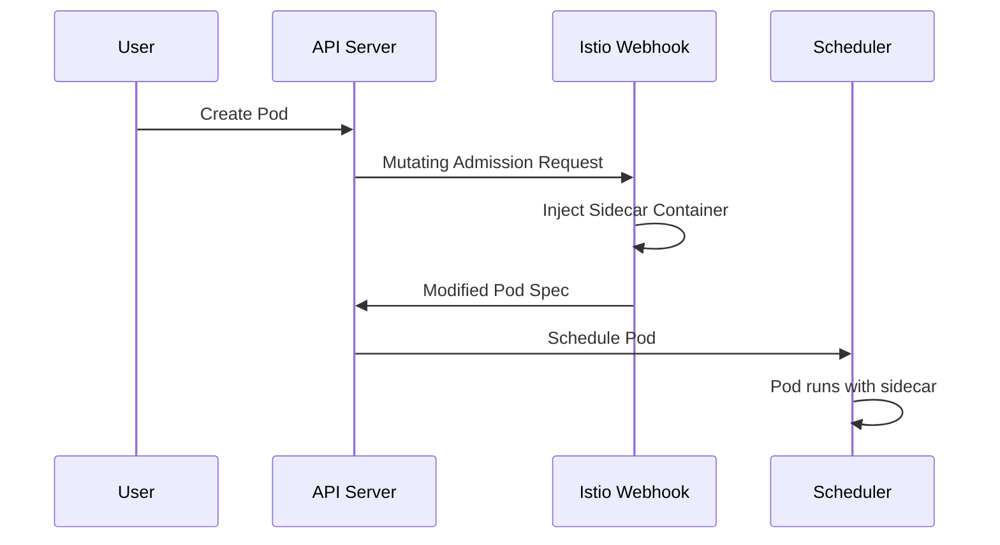

# How to Fix "Sidecar Injection" Failures in Istio

Author: [nawazdhandala](https://www.github.com/nawazdhandala)

Tags: Istio, Kubernetes, Service Mesh, Sidecar, Envoy, Troubleshooting

Description: Learn how to diagnose and fix sidecar injection failures in Istio, including namespace labeling issues, webhook problems, and resource constraints.

---

Istio relies on sidecar proxies (Envoy) to intercept and manage traffic between your services. When sidecar injection fails, your pods won't participate in the service mesh, leading to broken service discovery, missing metrics, and security gaps. This guide walks you through the common causes of sidecar injection failures and how to fix them.

## Understanding Sidecar Injection

Before diving into troubleshooting, let's understand how Istio injects sidecars. Istio uses a Kubernetes mutating admission webhook that intercepts pod creation requests and adds the Envoy sidecar container to your pod spec.

Here's a simplified view of the injection flow:



## Common Cause 1: Missing Namespace Label

The most frequent reason for sidecar injection failures is a missing or incorrect namespace label. By default, Istio only injects sidecars into namespaces that have the `istio-injection=enabled` label.

Check if your namespace has the correct label:

```bash
# Check the namespace labels
kubectl get namespace your-namespace --show-labels
```

If the `istio-injection=enabled` label is missing, add it:

```bash
# Enable automatic sidecar injection for a namespace
kubectl label namespace your-namespace istio-injection=enabled
```

For existing pods, you need to restart them to trigger injection. The label only affects new pods:

```bash
# Restart all deployments in the namespace to inject sidecars
kubectl rollout restart deployment -n your-namespace
```

## Common Cause 2: Conflicting Pod Annotations

Individual pods can override namespace-level injection settings using annotations. If a pod has `sidecar.istio.io/inject: "false"`, the sidecar won't be injected even if the namespace has injection enabled.

Check your pod or deployment for injection annotations:

```yaml
# Example deployment with injection disabled (problematic)
apiVersion: apps/v1
kind: Deployment
metadata:
  name: my-app
spec:
  template:
    metadata:
      annotations:
        sidecar.istio.io/inject: "false"  # This prevents injection
    spec:
      containers:
      - name: my-app
        image: my-app:latest
```

Remove or change this annotation to allow injection:

```yaml
# Fixed deployment with injection enabled
apiVersion: apps/v1
kind: Deployment
metadata:
  name: my-app
spec:
  template:
    metadata:
      annotations:
        sidecar.istio.io/inject: "true"  # Explicitly enable injection
    spec:
      containers:
      - name: my-app
        image: my-app:latest
```

## Common Cause 3: Webhook Not Running

If the Istio sidecar injector webhook is not running or unhealthy, injection will fail silently. Your pods will be created without sidecars.

Verify the injector pod is running:

```bash
# Check if the istiod pod is running (handles injection in newer Istio versions)
kubectl get pods -n istio-system -l app=istiod

# For older Istio versions, check the sidecar-injector
kubectl get pods -n istio-system -l istio=sidecar-injector
```

Check the webhook configuration exists and points to the correct service:

```bash
# List mutating webhooks and look for istio-sidecar-injector
kubectl get mutatingwebhookconfiguration

# Get details about the Istio webhook
kubectl get mutatingwebhookconfiguration istio-sidecar-injector -o yaml
```

If the webhook is missing, you may need to reinstall or upgrade Istio:

```bash
# Reinstall Istio using istioctl
istioctl install --set profile=default
```

## Common Cause 4: Resource Constraints

Sidecar injection adds containers to your pods, which means additional CPU and memory requirements. If your cluster doesn't have enough resources, pods with sidecars may fail to schedule.

Check for resource-related issues:

```bash
# Check pod events for scheduling failures
kubectl describe pod your-pod-name -n your-namespace

# Look for events like "Insufficient cpu" or "Insufficient memory"
kubectl get events -n your-namespace --sort-by='.lastTimestamp'
```

You can adjust the sidecar resource requests using annotations:

```yaml
# Deployment with custom sidecar resource limits
apiVersion: apps/v1
kind: Deployment
metadata:
  name: my-app
spec:
  template:
    metadata:
      annotations:
        # Reduce sidecar CPU request
        sidecar.istio.io/proxyCPU: "50m"
        # Reduce sidecar memory request
        sidecar.istio.io/proxyMemory: "64Mi"
        # Set CPU limit
        sidecar.istio.io/proxyCPULimit: "200m"
        # Set memory limit
        sidecar.istio.io/proxyMemoryLimit: "256Mi"
    spec:
      containers:
      - name: my-app
        image: my-app:latest
```

## Common Cause 5: Init Container Failures

Istio uses an init container (`istio-init`) to set up iptables rules for traffic interception. If this init container fails, the pod won't start properly.

Check for init container failures:

```bash
# Get detailed pod status including init containers
kubectl get pod your-pod-name -n your-namespace -o jsonpath='{.status.initContainerStatuses}'

# Check init container logs
kubectl logs your-pod-name -n your-namespace -c istio-init
```

Common reasons for init container failures include:

1. Missing NET_ADMIN capability (required for iptables)
2. Security policies blocking privileged operations
3. CNI plugin conflicts

If you're using a restrictive PodSecurityPolicy or OPA Gatekeeper, you may need to allow the required capabilities:

```yaml
# Example PodSecurityPolicy allowing Istio init containers
apiVersion: policy/v1beta1
kind: PodSecurityPolicy
metadata:
  name: istio-sidecar
spec:
  allowedCapabilities:
    - NET_ADMIN
    - NET_RAW
  runAsUser:
    rule: RunAsAny
  seLinux:
    rule: RunAsAny
  fsGroup:
    rule: RunAsAny
  volumes:
    - '*'
```

## Common Cause 6: Revision Labels Mismatch

If you're using Istio's canary upgrade feature with revision labels, make sure your namespace uses the correct revision label.

Check what Istio revisions are installed:

```bash
# List all Istio control planes
kubectl get pods -n istio-system -l app=istiod --show-labels
```

Use the revision-specific label instead of the default:

```bash
# For a revision named "1-17-2"
kubectl label namespace your-namespace istio.io/rev=1-17-2

# Remove the old label if present
kubectl label namespace your-namespace istio-injection-
```

## Debugging Tips

When troubleshooting injection failures, these commands are invaluable:

```bash
# Check what would be injected without actually creating the pod
istioctl kube-inject -f your-deployment.yaml

# Analyze your Istio configuration for issues
istioctl analyze -n your-namespace

# Check the proxy status for existing pods
istioctl proxy-status

# View the actual sidecar configuration
istioctl proxy-config bootstrap your-pod-name.your-namespace
```

## Prevention: Use a Checklist

Before deploying to an Istio-enabled cluster, verify:

1. The target namespace has `istio-injection=enabled` or the correct revision label
2. Your deployment doesn't have `sidecar.istio.io/inject: "false"` annotations
3. The Istio control plane is healthy (`istioctl verify-install`)
4. Your pods have sufficient resource requests for the sidecar overhead
5. Security policies allow the required capabilities for init containers

Sidecar injection issues can be frustrating, but they're almost always caused by one of these common problems. By systematically checking each potential cause, you can quickly identify and resolve the issue. Remember that sidecars are essential for Istio's traffic management, security, and observability features, so getting injection right is crucial for a functioning service mesh.
