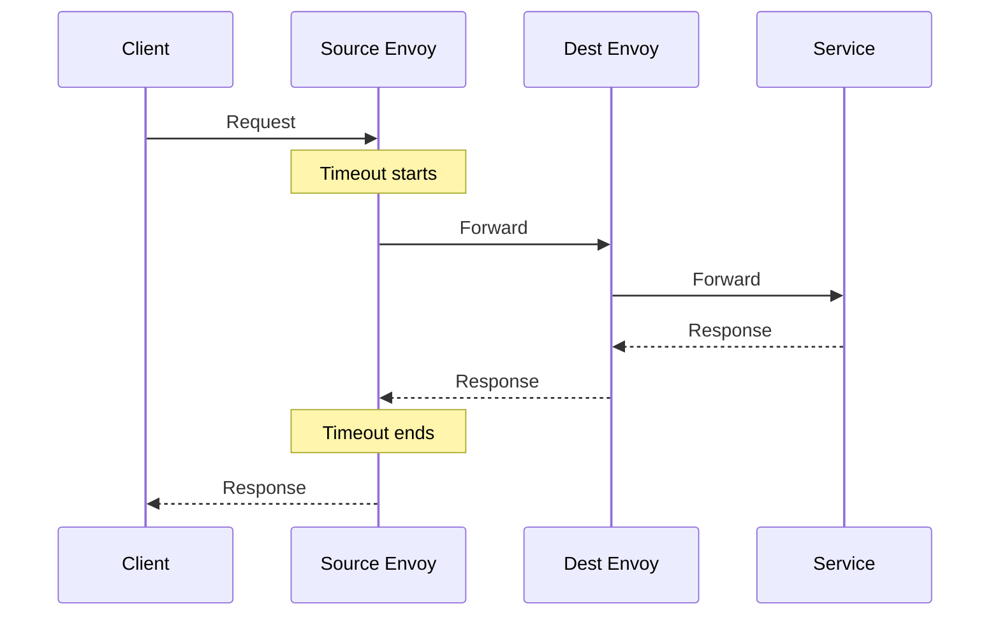
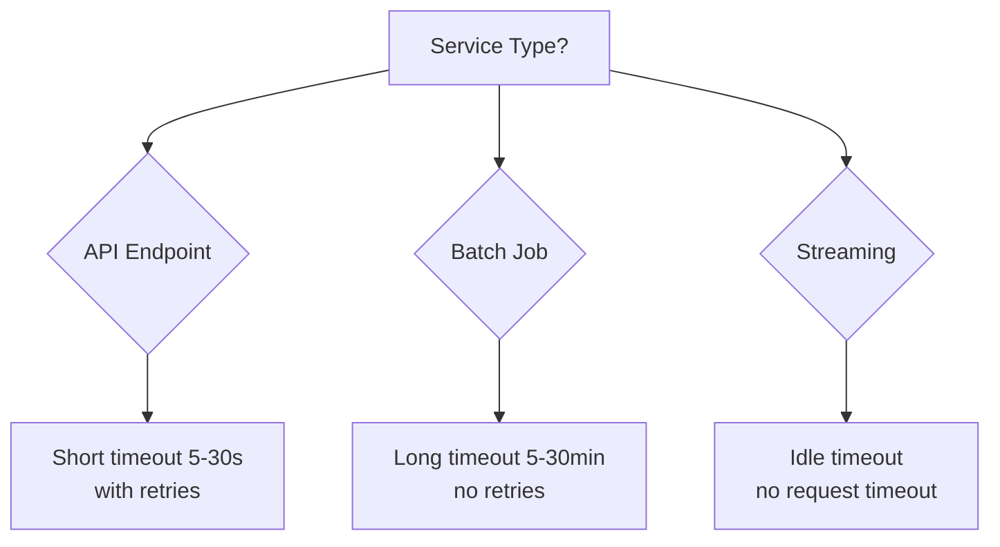

# How to Fix 'Timeout' Configuration in Istio

Author: [nawazdhandala](https://www.github.com/nawazdhandala)

Tags: Istio, Service Mesh, Kubernetes, Timeout, VirtualService, Resilience

Description: A practical guide to configuring and troubleshooting timeouts in Istio, including VirtualService timeouts, per-try timeouts, and handling timeout conflicts.

---

Timeouts in Istio are straightforward to configure but surprisingly easy to get wrong. You set a 30-second timeout, but requests still fail after 15 seconds. Or you configure retries, and now requests take 2 minutes before finally failing. This guide explains how Istio timeouts actually work and how to configure them correctly.

## How Istio Timeouts Work

Istio applies timeouts at the Envoy proxy level, which sits between your application and the network. The timeout controls how long the proxy waits for a complete response from an upstream service.



The timeout covers the entire round trip from when the source proxy sends the request until it receives the complete response.

## Basic Timeout Configuration

Set a timeout in your VirtualService:

```yaml
apiVersion: networking.istio.io/v1beta1
kind: VirtualService
metadata:
  name: reviews-timeout
  namespace: default
spec:
  hosts:
    - reviews
  http:
    - timeout: 10s
      route:
        - destination:
            host: reviews
            subset: v1
```

This gives the reviews service 10 seconds to respond. If it takes longer, the client receives a 504 Gateway Timeout.

## Timeout vs Per-Try Timeout

When you combine timeouts with retries, things get confusing. There are two timeout settings:

- **timeout**: The overall timeout for the entire request, including all retries
- **perTryTimeout**: The timeout for each individual attempt

Here is a common mistake where each retry can take 30 seconds, but you only have 30 seconds total:

```yaml
# Problematic: per-try timeout equals overall timeout
apiVersion: networking.istio.io/v1beta1
kind: VirtualService
metadata:
  name: reviews-retries
spec:
  hosts:
    - reviews
  http:
    - timeout: 30s
      retries:
        attempts: 3
        perTryTimeout: 30s  # Each try can take 30s, but total is also 30s
      route:
        - destination:
            host: reviews
```

The correct approach is to make the overall timeout accommodate all retry attempts:

```yaml
# Correct: total timeout accommodates retries
apiVersion: networking.istio.io/v1beta1
kind: VirtualService
metadata:
  name: reviews-retries
spec:
  hosts:
    - reviews
  http:
    - timeout: 60s  # Allows for 3 attempts at 10s each plus buffer
      retries:
        attempts: 3
        perTryTimeout: 10s
        retryOn: 5xx,reset,connect-failure
      route:
        - destination:
            host: reviews
```

The math should be: `timeout >= (attempts * perTryTimeout)` plus some buffer for network overhead.

## Default Timeout Behavior

If you don't specify a timeout, Istio uses a default of 15 seconds. This surprises many people who expect no timeout at all.

To disable the timeout entirely (not recommended for production), set it to 0s:

```yaml
apiVersion: networking.istio.io/v1beta1
kind: VirtualService
metadata:
  name: long-running-job
spec:
  hosts:
    - batch-processor
  http:
    - timeout: 0s  # Disables timeout - use with caution
      route:
        - destination:
            host: batch-processor
```

## Route-Specific Timeouts

Different routes can have different timeouts:

```yaml
apiVersion: networking.istio.io/v1beta1
kind: VirtualService
metadata:
  name: api-timeouts
spec:
  hosts:
    - api-gateway
  http:
    # Quick endpoints get short timeouts
    - match:
        - uri:
            prefix: /health
      timeout: 2s
      route:
        - destination:
            host: api-gateway
    # Report generation needs more time
    - match:
        - uri:
            prefix: /reports/generate
      timeout: 120s
      route:
        - destination:
            host: api-gateway
    # Default timeout for everything else
    - timeout: 30s
      route:
        - destination:
            host: api-gateway
```

## Debugging Timeout Issues

### Problem: Timeout Shorter Than Expected

Your VirtualService says 30 seconds, but requests timeout after 15 seconds.

**Cause 1: Multiple VirtualServices**

If multiple VirtualServices match the same host, Istio merges them, and timeout behavior can be unpredictable.

```bash
# Check for conflicting VirtualServices
kubectl get virtualservice -A | grep reviews
istioctl analyze -n default
```

**Cause 2: Gateway Timeout**

The Istio Gateway or ingress controller might have its own timeout:

```yaml
apiVersion: networking.istio.io/v1beta1
kind: Gateway
metadata:
  name: my-gateway
spec:
  servers:
    - port:
        number: 80
        name: http
        protocol: HTTP
      hosts:
        - "*.example.com"
```

Check your ingress controller's timeout settings as well.

**Cause 3: Application-Level Timeout**

Your application might be timing out before Istio does. Check your HTTP client configurations.

### Problem: Timeout Longer Than Expected

Requests take much longer than your configured timeout before failing.

**Cause: Retry multiplication**

Calculate the worst-case time:

```
Worst case = attempts * perTryTimeout + retry backoff
```

With 3 attempts and 30-second per-try timeout, the worst case is over 90 seconds.

### Check Envoy Configuration

Verify what timeout the proxy actually has:

```bash
# See the route configuration including timeouts
istioctl proxy-config routes <pod-name> -o json | jq '.[] | select(.name == "9080") | .virtualHosts[].routes[].route.timeout'
```

### Enable Debug Logging

Temporarily enable debug logging to see timeout events:

```bash
istioctl proxy-config log <pod-name> --level debug
kubectl logs <pod-name> -c istio-proxy | grep -i timeout
```

## Handling Long-Running Connections

For WebSocket or streaming connections, standard timeouts don't work well. Use idle timeouts instead via DestinationRule:

```yaml
apiVersion: networking.istio.io/v1beta1
kind: DestinationRule
metadata:
  name: websocket-config
spec:
  host: websocket-service
  trafficPolicy:
    connectionPool:
      tcp:
        connectTimeout: 10s
        tcpKeepalive:
          time: 7200s
          interval: 75s
```

For HTTP/2 and gRPC streams, configure via EnvoyFilter if needed:

```yaml
apiVersion: networking.istio.io/v1alpha3
kind: EnvoyFilter
metadata:
  name: stream-idle-timeout
  namespace: default
spec:
  workloadSelector:
    labels:
      app: streaming-service
  configPatches:
    - applyTo: NETWORK_FILTER
      match:
        context: SIDECAR_INBOUND
        listener:
          filterChain:
            filter:
              name: envoy.filters.network.http_connection_manager
      patch:
        operation: MERGE
        value:
          typed_config:
            "@type": type.googleapis.com/envoy.extensions.filters.network.http_connection_manager.v3.HttpConnectionManager
            stream_idle_timeout: 3600s
```

## Timeout Strategy by Service Type

Different services need different timeout strategies:



### API Services

```yaml
# Fast API with retries
timeout: 10s
retries:
  attempts: 3
  perTryTimeout: 3s
  retryOn: 5xx,reset
```

### Batch Processing

```yaml
# Long-running batch job
timeout: 1800s  # 30 minutes
# No retries - let it complete or fail
```

### Real-time Streaming

```yaml
# Streaming/WebSocket - disable request timeout
timeout: 0s
# Configure idle timeout in DestinationRule instead
```

## Testing Your Timeout Configuration

Use fault injection to verify timeouts work as expected:

```yaml
# Inject a delay longer than your timeout
apiVersion: networking.istio.io/v1beta1
kind: VirtualService
metadata:
  name: reviews-test-timeout
spec:
  hosts:
    - reviews
  http:
    - fault:
        delay:
          percentage:
            value: 100.0
          fixedDelay: 60s  # Longer than any expected timeout
      timeout: 10s
      route:
        - destination:
            host: reviews
```

The request should fail after 10 seconds, not 60. If it takes longer, your timeout isn't being applied correctly.

## Common Timeout Values

Here are reasonable starting points for different scenarios:

| Use Case | Timeout | Per-Try Timeout | Retries |
|----------|---------|-----------------|---------|
| Health check | 2s | 1s | 2 |
| API call | 10s | 3s | 3 |
| Database query | 30s | 10s | 2 |
| File upload | 120s | 60s | 1 |
| Report generation | 300s | none | 0 |

## Checklist for Timeout Configuration

1. Set explicit timeouts, don't rely on defaults
2. Make overall timeout greater than `attempts * perTryTimeout`
3. Check for conflicting VirtualServices with `istioctl analyze`
4. Verify the proxy has correct config with `istioctl proxy-config`
5. Test with fault injection before going to production
6. Consider application-level timeouts in your total time budget
7. Use idle timeouts for streaming connections instead of request timeouts

---

Getting timeouts right in Istio requires understanding the interaction between VirtualService timeout, perTryTimeout, and retry attempts. Always verify your configuration with `istioctl proxy-config` and test with fault injection. A well-configured timeout prevents cascade failures and improves user experience by failing fast when services are unhealthy.
