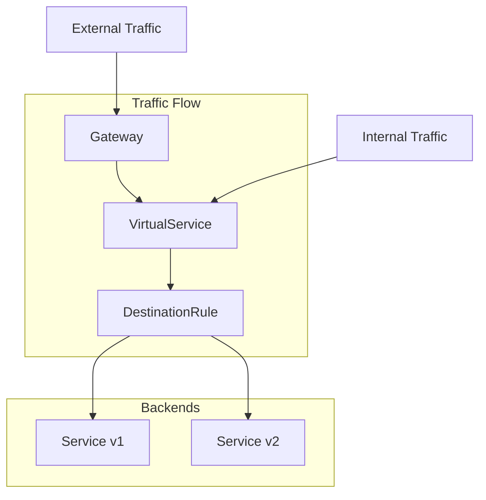

# How to Handle Traffic Management in Istio

Author: [nawazdhandala](https://www.github.com/nawazdhandala)

Tags: Istio, Kubernetes, Service Mesh, Traffic Management, Load Balancing, Canary Deployment

Description: Learn how to manage traffic in Istio using VirtualServices, DestinationRules, and Gateways for advanced routing, load balancing, and canary deployments.

---

Traffic management is one of Istio's most powerful features. It lets you control how requests flow between services without changing your application code. You can implement canary deployments, A/B testing, circuit breakers, and sophisticated routing rules. This guide covers the essential traffic management concepts and provides practical examples you can use in production.

## Traffic Management Architecture

Istio's traffic management relies on three main custom resources that work together:



**Gateway** handles ingress traffic from outside the mesh. **VirtualService** defines routing rules for how traffic reaches a service. **DestinationRule** defines policies applied after routing, like load balancing and connection pool settings.

## Setting Up a Gateway

Gateways configure the Istio ingress gateway to accept external traffic. Here's a basic example that accepts HTTP traffic on port 80:

```yaml
# Gateway configuration for external traffic
apiVersion: networking.istio.io/v1beta1
kind: Gateway
metadata:
  name: my-gateway
  namespace: default
spec:
  selector:
    istio: ingressgateway  # Use Istio's default ingress gateway
  servers:
  - port:
      number: 80
      name: http
      protocol: HTTP
    hosts:
    - "myapp.example.com"  # Accept traffic for this host
```

For HTTPS traffic with TLS termination:

```yaml
# Gateway with TLS configuration
apiVersion: networking.istio.io/v1beta1
kind: Gateway
metadata:
  name: secure-gateway
spec:
  selector:
    istio: ingressgateway
  servers:
  - port:
      number: 443
      name: https
      protocol: HTTPS
    tls:
      mode: SIMPLE
      credentialName: myapp-tls-secret  # Kubernetes secret with cert
    hosts:
    - "myapp.example.com"
```

## Routing with VirtualServices

VirtualServices define how requests are routed to services. They're extremely flexible and support routing based on headers, URI paths, query parameters, and more.

Here's a basic VirtualService that routes all traffic to a single service:

```yaml
# Simple VirtualService routing to one backend
apiVersion: networking.istio.io/v1beta1
kind: VirtualService
metadata:
  name: my-app-vs
spec:
  hosts:
  - "myapp.example.com"  # Match requests to this host
  gateways:
  - my-gateway  # Use traffic from this gateway
  http:
  - route:
    - destination:
        host: my-app-service  # Kubernetes service name
        port:
          number: 8080
```

### Path-Based Routing

Route different URL paths to different services:

```yaml
# Route based on URL path
apiVersion: networking.istio.io/v1beta1
kind: VirtualService
metadata:
  name: api-routing
spec:
  hosts:
  - "api.example.com"
  gateways:
  - api-gateway
  http:
  # Route /users/* to user service
  - match:
    - uri:
        prefix: "/users"
    route:
    - destination:
        host: user-service
        port:
          number: 8080
  # Route /orders/* to order service
  - match:
    - uri:
        prefix: "/orders"
    route:
    - destination:
        host: order-service
        port:
          number: 8080
  # Default route for everything else
  - route:
    - destination:
        host: default-service
        port:
          number: 8080
```

### Header-Based Routing

Route based on HTTP headers, useful for A/B testing or feature flags:

```yaml
# Route based on headers
apiVersion: networking.istio.io/v1beta1
kind: VirtualService
metadata:
  name: header-routing
spec:
  hosts:
  - my-service
  http:
  # Users with beta header get the new version
  - match:
    - headers:
        x-beta-user:
          exact: "true"
    route:
    - destination:
        host: my-service
        subset: v2  # Defined in DestinationRule
  # Everyone else gets stable version
  - route:
    - destination:
        host: my-service
        subset: v1
```

## Implementing Canary Deployments

Canary deployments let you gradually roll out changes by sending a percentage of traffic to the new version. This is one of the most common use cases for Istio traffic management.

First, you need a DestinationRule to define subsets:

```yaml
# Define version subsets
apiVersion: networking.istio.io/v1beta1
kind: DestinationRule
metadata:
  name: my-app-dr
spec:
  host: my-app-service
  subsets:
  - name: v1
    labels:
      version: v1  # Pods with this label
  - name: v2
    labels:
      version: v2  # Pods with this label
```

Then create a VirtualService with weighted routing:

```yaml
# Canary deployment with 90/10 traffic split
apiVersion: networking.istio.io/v1beta1
kind: VirtualService
metadata:
  name: my-app-canary
spec:
  hosts:
  - my-app-service
  http:
  - route:
    - destination:
        host: my-app-service
        subset: v1
      weight: 90  # 90% to stable version
    - destination:
        host: my-app-service
        subset: v2
      weight: 10  # 10% to canary version
```

Gradually increase the v2 weight as you gain confidence:

```yaml
# Progressive rollout: 50/50 split
http:
- route:
  - destination:
      host: my-app-service
      subset: v1
    weight: 50
  - destination:
      host: my-app-service
      subset: v2
    weight: 50
```

## Load Balancing Strategies

DestinationRules let you configure load balancing algorithms. The default is round-robin, but you have several options.

```yaml
# DestinationRule with load balancing configuration
apiVersion: networking.istio.io/v1beta1
kind: DestinationRule
metadata:
  name: my-service-lb
spec:
  host: my-service
  trafficPolicy:
    loadBalancer:
      simple: LEAST_REQUEST  # Route to instance with fewest requests
```

Available load balancing options:

- `ROUND_ROBIN`: Rotate through all instances (default)
- `LEAST_REQUEST`: Send to instance with fewest active requests
- `RANDOM`: Random instance selection
- `PASSTHROUGH`: Forward to the address specified by the caller

For session affinity (sticky sessions), use consistent hashing:

```yaml
# Sticky sessions based on user header
apiVersion: networking.istio.io/v1beta1
kind: DestinationRule
metadata:
  name: sticky-sessions
spec:
  host: my-service
  trafficPolicy:
    loadBalancer:
      consistentHash:
        httpHeaderName: x-user-id  # Same user always goes to same pod
```

## Circuit Breakers and Outlier Detection

Protect your services from cascading failures with circuit breakers:

```yaml
# Circuit breaker configuration
apiVersion: networking.istio.io/v1beta1
kind: DestinationRule
metadata:
  name: circuit-breaker
spec:
  host: my-service
  trafficPolicy:
    connectionPool:
      tcp:
        maxConnections: 100  # Max connections to the service
      http:
        h2UpgradePolicy: UPGRADE
        http1MaxPendingRequests: 100  # Max pending requests
        http2MaxRequests: 1000  # Max concurrent requests
    outlierDetection:
      consecutive5xxErrors: 5  # Eject after 5 consecutive errors
      interval: 30s  # Check every 30 seconds
      baseEjectionTime: 30s  # Eject for at least 30 seconds
      maxEjectionPercent: 50  # Never eject more than 50% of hosts
```

## Timeouts and Retries

Configure timeouts to prevent slow services from blocking requests:

```yaml
# Timeout and retry configuration
apiVersion: networking.istio.io/v1beta1
kind: VirtualService
metadata:
  name: timeout-retry
spec:
  hosts:
  - my-service
  http:
  - route:
    - destination:
        host: my-service
    timeout: 10s  # Request timeout
    retries:
      attempts: 3  # Retry up to 3 times
      perTryTimeout: 3s  # Timeout per retry attempt
      retryOn: gateway-error,connect-failure,refused-stream
```

## Traffic Mirroring

Mirror production traffic to a test service for shadow testing:

```yaml
# Mirror traffic to test environment
apiVersion: networking.istio.io/v1beta1
kind: VirtualService
metadata:
  name: traffic-mirror
spec:
  hosts:
  - my-service
  http:
  - route:
    - destination:
        host: my-service
        subset: v1
    mirror:
      host: my-service
      subset: v2-test
    mirrorPercentage:
      value: 100.0  # Mirror 100% of traffic
```

The mirrored requests are fire-and-forget. Responses from the mirror are ignored, so it won't affect your production traffic.

## Debugging Traffic Issues

When traffic isn't flowing as expected, use these commands to investigate:

```bash
# Check VirtualService configuration
istioctl analyze -n your-namespace

# View the routes configured on a proxy
istioctl proxy-config routes your-pod.your-namespace

# Check cluster endpoints
istioctl proxy-config clusters your-pod.your-namespace

# View real-time traffic with Kiali (if installed)
istioctl dashboard kiali
```

Traffic management in Istio gives you fine-grained control over how requests flow through your system. Start with simple routing rules and gradually add more sophisticated features like canary deployments and circuit breakers as your needs grow. The key is to test your configurations in a staging environment before applying them to production, since misconfigured routes can lead to service outages.
