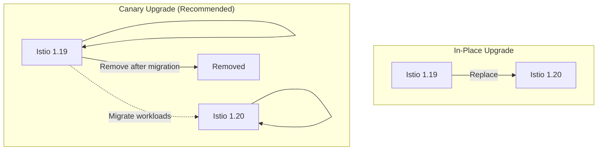

# How to Upgrade Istio Without Downtime

Author: [nawazdhandala](https://www.github.com/nawazdhandala)

Tags: Istio, Kubernetes, Upgrade, Zero Downtime, Service Mesh, DevOps, Operations

Description: Learn how to upgrade Istio safely without causing downtime using canary upgrades, revision-based deployments, and proper rollback strategies.

---

Upgrading Istio is nerve-wracking. The service mesh handles all your traffic, and a bad upgrade can take down your entire application. But Istio provides mechanisms for safe upgrades that keep traffic flowing even if something goes wrong.

This guide covers the canary upgrade process, which lets you run two Istio versions simultaneously and gradually migrate workloads.

## Understanding Istio Upgrade Methods

Istio supports two upgrade approaches:



**In-Place Upgrade:** Replace the existing control plane directly. Faster but riskier. If something breaks, rolling back is harder.

**Canary Upgrade:** Install the new version alongside the old one. Migrate workloads gradually. Roll back by moving workloads back to the old version.

We will focus on canary upgrades because they are the safe choice for production.

## Pre-Upgrade Checklist

Before starting, verify your cluster is ready:

```bash
# Check current Istio version
istioctl version

# Verify the mesh is healthy
istioctl analyze --all-namespaces

# Check for deprecated APIs your configs might use
istioctl analyze --use-kube=false --recursive configs/

# Ensure all proxies are in sync with control plane
istioctl proxy-status
```

Review the release notes for breaking changes:

```bash
# Download the new version
curl -L https://istio.io/downloadIstio | ISTIO_VERSION=1.20.0 sh -
cd istio-1.20.0

# Check upgrade notes
cat UPGRADE-NOTES.md
```

## Step 1: Install the New Control Plane with a Revision

Install Istio 1.20 alongside your existing 1.19 installation using a revision tag:

```bash
# Install new version with a revision label
# The revision allows both versions to coexist
istioctl install --set revision=1-20 -y
```

This creates a new control plane with revision `1-20`. Your existing control plane continues running.

Verify both control planes are running:

```bash
# Check istiod deployments - should see both versions
kubectl get pods -n istio-system -l app=istiod

# Output shows both:
# istiod-5f4c7db8c-xxxxx          (old, default revision)
# istiod-1-20-7d8f9b6c4d-xxxxx    (new, revision 1-20)
```

## Step 2: Verify the New Control Plane

Before migrating any workloads, verify the new control plane works:

```bash
# Check the new control plane is ready
kubectl get pods -n istio-system -l istio.io/rev=1-20

# Verify the new version responds correctly
istioctl version --revision 1-20

# Run pre-upgrade checks
istioctl x precheck --revision 1-20
```

## Step 3: Migrate Namespaces Gradually

Start with a non-critical namespace. Change the injection label to use the new revision:

```bash
# First, check current namespace labels
kubectl get namespace production --show-labels

# Remove the old injection label
kubectl label namespace production istio-injection-

# Add the new revision label
kubectl label namespace production istio.io/rev=1-20
```

Restart pods to pick up the new sidecar:

```bash
# Rolling restart all deployments in the namespace
kubectl rollout restart deployment -n production

# Watch the rollout progress
kubectl get pods -n production -w
```

Verify pods use the new proxy version:

```bash
# Check proxy versions in the namespace
istioctl proxy-status | grep production

# Should show version 1.20.x for migrated pods
```

## Step 4: Monitor and Validate

After migrating a namespace, monitor for issues:

```bash
# Check for proxy errors
kubectl logs -n production -l app=myapp -c istio-proxy --tail=100

# Verify traffic flows correctly
istioctl analyze -n production

# Check proxy sync status
istioctl proxy-status
```

Monitor key metrics:

```bash
# Port-forward to Prometheus if using Istio's addon
kubectl port-forward -n istio-system svc/prometheus 9090:9090
```

Key metrics to watch:

- `istio_requests_total` - Request counts
- `istio_request_duration_milliseconds` - Latency
- `pilot_xds_push_errors` - Control plane push failures
- `pilot_proxy_convergence_time` - Time for proxies to sync

## Step 5: Migrate Remaining Namespaces

Once the first namespace looks good, migrate the rest:

```bash
# List all namespaces with Istio injection
kubectl get namespaces -l istio-injection=enabled

# Migrate each namespace
for ns in staging production; do
  echo "Migrating namespace: $ns"
  kubectl label namespace $ns istio-injection-
  kubectl label namespace $ns istio.io/rev=1-20
  kubectl rollout restart deployment -n $ns
  # Wait for rollout to complete
  kubectl rollout status deployment -n $ns --timeout=300s
done
```

## Step 6: Upgrade Gateways

Istio gateways need special attention. Upgrade them after workloads are migrated:

```bash
# Check current gateway version
kubectl get pods -n istio-system -l app=istio-ingressgateway -o jsonpath='{.items[0].spec.containers[0].image}'

# Install new gateway with revision
istioctl install --set revision=1-20 \
  --set components.ingressGateways[0].name=istio-ingressgateway-1-20 \
  --set components.ingressGateways[0].enabled=true
```

Gradually shift traffic to the new gateway:

```yaml
# Update Gateway to use new ingress gateway
apiVersion: networking.istio.io/v1beta1
kind: Gateway
metadata:
  name: myapp-gateway
spec:
  selector:
    # Point to new gateway
    istio: ingressgateway-1-20
  servers:
    - port:
        number: 80
        name: http
        protocol: HTTP
      hosts:
        - "*"
```

## Step 7: Remove the Old Control Plane

Once all workloads are migrated and stable, remove the old control plane:

```bash
# Verify no pods use the old revision
istioctl proxy-status | grep -v "1-20"

# If empty, safe to remove old control plane
istioctl uninstall --revision default -y

# Or if using a different revision name
istioctl uninstall --revision 1-19 -y
```

Clean up old webhooks:

```bash
# Remove old mutating webhook
kubectl delete mutatingwebhookconfiguration istio-sidecar-injector

# Keep the revision-specific one
kubectl get mutatingwebhookconfiguration
```

## Rolling Back If Something Goes Wrong

If the new version causes issues, roll back by reversing the migration:

```bash
# Move namespace back to old revision
kubectl label namespace production istio.io/rev-
kubectl label namespace production istio-injection=enabled

# Restart pods to get old sidecar version
kubectl rollout restart deployment -n production
```

For faster rollback, use PodDisruptionBudgets:

```yaml
# Ensure some pods stay available during restart
apiVersion: policy/v1
kind: PodDisruptionBudget
metadata:
  name: myapp-pdb
  namespace: production
spec:
  minAvailable: 50%
  selector:
    matchLabels:
      app: myapp
```

## Automation Script

Here is a script that automates the safe upgrade process:

```bash
#!/bin/bash
# istio-canary-upgrade.sh
# Usage: ./istio-canary-upgrade.sh <new-version> <namespaces>

NEW_VERSION=$1
REVISION=$(echo $NEW_VERSION | tr '.' '-')
NAMESPACES="${@:2}"

# Install new control plane
echo "Installing Istio $NEW_VERSION with revision $REVISION"
istioctl install --set revision=$REVISION -y

# Wait for control plane to be ready
kubectl wait --for=condition=ready pod -l istio.io/rev=$REVISION -n istio-system --timeout=300s

# Migrate each namespace
for ns in $NAMESPACES; do
  echo "Migrating namespace: $ns"

  # Update labels
  kubectl label namespace $ns istio-injection- --overwrite
  kubectl label namespace $ns istio.io/rev=$REVISION --overwrite

  # Restart deployments
  kubectl rollout restart deployment -n $ns

  # Wait for rollout
  for deploy in $(kubectl get deploy -n $ns -o name); do
    kubectl rollout status $deploy -n $ns --timeout=300s
  done

  # Verify
  istioctl analyze -n $ns

  echo "Namespace $ns migrated successfully"
done

echo "Migration complete. Verify all traffic before removing old control plane."
```

Run it:

```bash
chmod +x istio-canary-upgrade.sh
./istio-canary-upgrade.sh 1.20.0 staging production
```

## Best Practices

1. **Always use canary upgrades in production.** The few extra steps are worth the safety.

2. **Upgrade one minor version at a time.** Jumping multiple versions increases risk.

3. **Test in staging first.** Migrate staging namespace, run tests, then proceed to production.

4. **Keep the old control plane for 24-48 hours** after migration before removing it.

5. **Have a rollback plan ready.** Document the exact commands to revert before starting.

6. **Schedule upgrades during low-traffic periods.** Even with zero-downtime upgrades, having fewer requests makes issues easier to spot.

Istio upgrades do not have to be scary. With canary upgrades and proper monitoring, you can update your service mesh safely while keeping traffic flowing.
