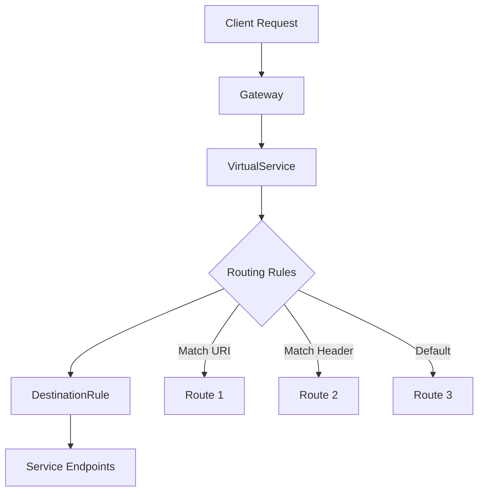

# How to Configure Istio Virtual Services

Author: [nawazdhandala](https://www.github.com/nawazdhandala)

Tags: Istio, Kubernetes, Service Mesh, VirtualService, Routing, Traffic Control

Description: Learn how to configure Istio VirtualServices for advanced routing including path matching, header routing, fault injection, and traffic shifting.

---

VirtualServices are the heart of Istio's traffic management. They define how requests are routed to services within your mesh, giving you control over traffic that would otherwise just follow Kubernetes service discovery. This guide covers everything from basic routing to advanced patterns like fault injection and traffic mirroring.

## What is a VirtualService?

A VirtualService is a custom resource that configures how requests are routed to a service. Think of it as a layer on top of Kubernetes services that gives you fine-grained control over traffic routing. Without VirtualServices, Istio just uses the default Kubernetes service load balancing.

Here's the relationship between Istio resources:



## Basic VirtualService Configuration

Let's start with a simple VirtualService that routes traffic to a single backend:

```yaml
# Basic VirtualService for internal service routing
apiVersion: networking.istio.io/v1beta1
kind: VirtualService
metadata:
  name: reviews-route
  namespace: default
spec:
  hosts:
  - reviews  # Short name of the Kubernetes service
  http:
  - route:
    - destination:
        host: reviews  # Target service
        port:
          number: 9080
```

The `hosts` field specifies which services this VirtualService applies to. It can be a short service name, a fully qualified domain name, or a wildcard.

## Routing for Ingress Traffic

When handling traffic from outside the mesh, you need to bind the VirtualService to a Gateway:

```yaml
# Gateway for external traffic
apiVersion: networking.istio.io/v1beta1
kind: Gateway
metadata:
  name: bookinfo-gateway
spec:
  selector:
    istio: ingressgateway
  servers:
  - port:
      number: 80
      name: http
      protocol: HTTP
    hosts:
    - "bookinfo.example.com"
---
# VirtualService bound to the Gateway
apiVersion: networking.istio.io/v1beta1
kind: VirtualService
metadata:
  name: bookinfo-vs
spec:
  hosts:
  - "bookinfo.example.com"
  gateways:
  - bookinfo-gateway  # Reference to the Gateway
  http:
  - route:
    - destination:
        host: productpage
        port:
          number: 9080
```

You can also apply a VirtualService to both mesh traffic (internal) and gateway traffic (external):

```yaml
spec:
  hosts:
  - "bookinfo.example.com"
  gateways:
  - bookinfo-gateway
  - mesh  # Special keyword for internal mesh traffic
```

## URI-Based Routing

Route requests to different backends based on the URL path:

```yaml
# Route different paths to different services
apiVersion: networking.istio.io/v1beta1
kind: VirtualService
metadata:
  name: api-routes
spec:
  hosts:
  - api.example.com
  gateways:
  - api-gateway
  http:
  # Exact path match
  - match:
    - uri:
        exact: "/health"
    route:
    - destination:
        host: health-service
  # Prefix match for user endpoints
  - match:
    - uri:
        prefix: "/api/v1/users"
    route:
    - destination:
        host: user-service
  # Regex match for versioned APIs
  - match:
    - uri:
        regex: "^/api/v[0-9]+/products.*"
    route:
    - destination:
        host: product-service
  # Default catch-all route
  - route:
    - destination:
        host: default-backend
```

You can also rewrite URIs before forwarding:

```yaml
http:
- match:
  - uri:
      prefix: "/api/v1/users"
  rewrite:
    uri: "/users"  # Strip the /api/v1 prefix
  route:
  - destination:
      host: user-service
```

## Header-Based Routing

Route based on HTTP headers for A/B testing or feature flags:

```yaml
# Route based on custom headers
apiVersion: networking.istio.io/v1beta1
kind: VirtualService
metadata:
  name: feature-routing
spec:
  hosts:
  - my-service
  http:
  # Route beta users to v2
  - match:
    - headers:
        x-user-type:
          exact: "beta"
    route:
    - destination:
        host: my-service
        subset: v2
  # Route based on user agent
  - match:
    - headers:
        user-agent:
          regex: ".*Mobile.*"
    route:
    - destination:
        host: my-service-mobile
  # Default route
  - route:
    - destination:
        host: my-service
        subset: v1
```

You can also add or modify headers:

```yaml
http:
- route:
  - destination:
      host: my-service
    headers:
      request:
        add:
          x-forwarded-by: "istio-proxy"
        remove:
        - x-internal-header
      response:
        add:
          x-served-by: "my-service-v1"
```

## Traffic Splitting

Distribute traffic between multiple versions for canary deployments:

```yaml
# Split traffic between versions
apiVersion: networking.istio.io/v1beta1
kind: VirtualService
metadata:
  name: canary-release
spec:
  hosts:
  - my-service
  http:
  - route:
    - destination:
        host: my-service
        subset: stable
      weight: 90
    - destination:
        host: my-service
        subset: canary
      weight: 10
```

Remember to create a DestinationRule that defines the subsets:

```yaml
# DestinationRule defining version subsets
apiVersion: networking.istio.io/v1beta1
kind: DestinationRule
metadata:
  name: my-service-versions
spec:
  host: my-service
  subsets:
  - name: stable
    labels:
      version: v1
  - name: canary
    labels:
      version: v2
```

## Fault Injection

Inject faults to test resilience and chaos engineering:

```yaml
# Inject delays and aborts for testing
apiVersion: networking.istio.io/v1beta1
kind: VirtualService
metadata:
  name: fault-injection
spec:
  hosts:
  - ratings
  http:
  # Inject a 7 second delay for 10% of requests
  - match:
    - headers:
        end-user:
          exact: "chaos-tester"
    fault:
      delay:
        percentage:
          value: 10
        fixedDelay: 7s
    route:
    - destination:
        host: ratings
  # Inject HTTP 500 errors for specific users
  - match:
    - headers:
        end-user:
          exact: "error-tester"
    fault:
      abort:
        percentage:
          value: 100
        httpStatus: 500
    route:
    - destination:
        host: ratings
  # Normal traffic
  - route:
    - destination:
        host: ratings
```

## Timeouts and Retries

Configure timeouts and automatic retries:

```yaml
# Configure resilience settings
apiVersion: networking.istio.io/v1beta1
kind: VirtualService
metadata:
  name: resilient-service
spec:
  hosts:
  - backend-service
  http:
  - route:
    - destination:
        host: backend-service
    timeout: 5s
    retries:
      attempts: 3
      perTryTimeout: 2s
      retryOn: connect-failure,refused-stream,unavailable,cancelled,retriable-4xx,5xx
```

The `retryOn` conditions include:

- `5xx`: Retry on 500-level errors
- `connect-failure`: Retry on connection failures
- `refused-stream`: Retry if the upstream refuses the stream
- `unavailable`: Retry if the upstream is unavailable
- `retriable-4xx`: Retry on retriable 4xx errors (like 409)

## Traffic Mirroring

Mirror traffic to a shadow service for testing:

```yaml
# Mirror production traffic to staging
apiVersion: networking.istio.io/v1beta1
kind: VirtualService
metadata:
  name: traffic-mirror
spec:
  hosts:
  - production-service
  http:
  - route:
    - destination:
        host: production-service
    mirror:
      host: staging-service
    mirrorPercentage:
      value: 50.0  # Mirror 50% of traffic
```

Mirrored traffic is fire-and-forget. The response from the mirror is ignored, so it won't impact your production latency.

## Combining Multiple Conditions

Match multiple conditions with AND/OR logic:

```yaml
# Complex routing with multiple conditions
apiVersion: networking.istio.io/v1beta1
kind: VirtualService
metadata:
  name: complex-routing
spec:
  hosts:
  - api-service
  http:
  # AND condition: must match both URI and header
  - match:
    - uri:
        prefix: "/admin"
      headers:
        x-admin-token:
          exact: "valid-token"
    route:
    - destination:
        host: admin-service
  # OR condition: match either condition (separate match entries)
  - match:
    - uri:
        prefix: "/api"
    - headers:
        x-api-version:
          exact: "v2"
    route:
    - destination:
        host: api-service-v2
```

## Debugging VirtualService Issues

When routing doesn't work as expected:

```bash
# Validate your VirtualService configuration
istioctl analyze -n your-namespace

# See what routes are configured on a proxy
istioctl proxy-config routes your-pod.your-namespace

# Check if the VirtualService is being applied
istioctl proxy-config routes your-pod.your-namespace --name 80 -o json

# Test routing from a specific pod
kubectl exec -it your-pod -c istio-proxy -- pilot-agent request GET /config_dump
```

Common issues to watch for:

1. **Host mismatch**: The `hosts` field must match exactly what clients use
2. **Missing DestinationRule**: Subsets require a corresponding DestinationRule
3. **Gateway binding**: External traffic needs both Gateway and VirtualService
4. **Order matters**: Routes are evaluated in order, put specific matches first

VirtualServices give you powerful control over traffic routing in Istio. Start simple with basic routing and gradually add features like traffic splitting and fault injection as your needs grow. Always test your configurations in a non-production environment first, as misconfigured routes can cause service disruptions.
