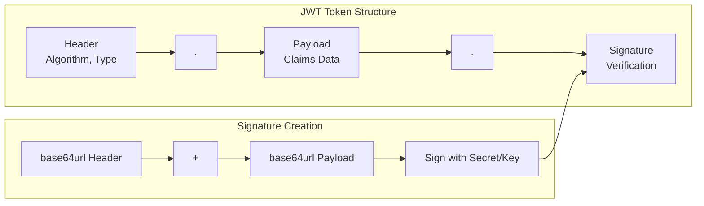
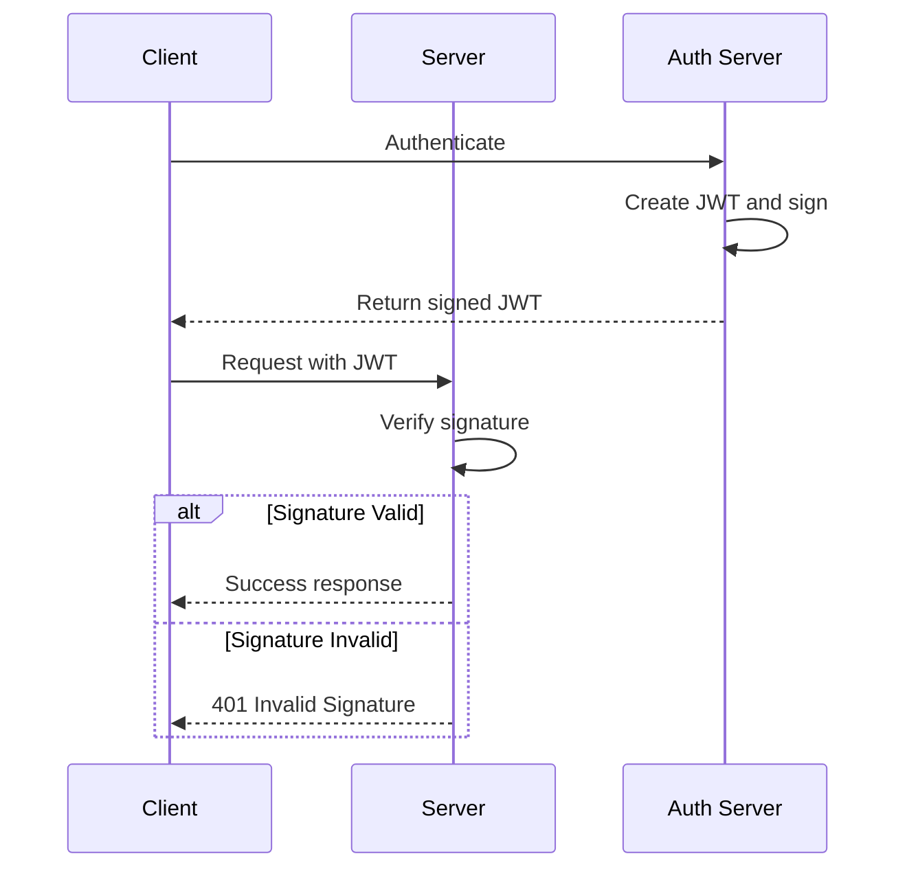
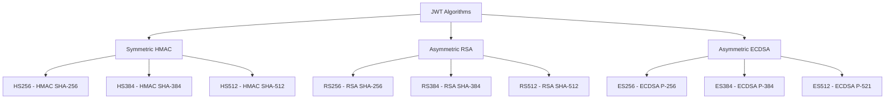

# How to Fix 'Invalid Signature' JWT Errors

Author: [nawazdhandala](https://www.github.com/nawazdhandala)

Tags: JWT, Authentication, Security, Troubleshooting, Tokens, Cryptography

Description: Learn how to diagnose and fix 'Invalid Signature' errors in JWT tokens with practical debugging techniques and code examples.

---

The "Invalid Signature" error is one of the most frustrating JWT issues to debug because the token often looks correct but fails verification. This guide covers all the common causes and provides systematic approaches to identify and fix signature validation problems.

## Understanding JWT Signatures

A JWT consists of three parts: header, payload, and signature. The signature ensures the token has not been tampered with.





## Common Causes and Solutions

### Cause 1: Wrong Secret or Key

The most common cause is using a different secret/key for verification than was used for signing.

```javascript
// wrong-secret.js
// Demonstrating secret mismatch issues

const jwt = require('jsonwebtoken');

// Token was signed with this secret
const signingSecret = 'production-secret-key-12345';

// But you're trying to verify with this
const wrongSecret = 'development-secret-key-67890';

// Create a token
const token = jwt.sign(
    { userId: 123, role: 'admin' },
    signingSecret,
    { algorithm: 'HS256' }
);

// This will fail with "invalid signature"
try {
    jwt.verify(token, wrongSecret);
} catch (error) {
    console.log('Error:', error.message);  // "invalid signature"
}

// SOLUTION: Use the correct secret
try {
    const decoded = jwt.verify(token, signingSecret);
    console.log('Success:', decoded);
} catch (error) {
    console.log('Error:', error.message);
}
```

### Cause 2: Secret Encoding Issues

Secrets may be base64 encoded or contain special characters that need proper handling.

```javascript
// secret-encoding.js
// Handle various secret encoding formats

const jwt = require('jsonwebtoken');

// Common scenario: Auth0 and similar services provide base64-encoded secrets
const base64Secret = 'c2VjcmV0LWtleS10aGF0LWlzLWJhc2U2NC1lbmNvZGVk';

// WRONG: Using the base64 string directly
try {
    jwt.verify(token, base64Secret);  // Will fail
} catch (error) {
    console.log('Failed with base64 string directly');
}

// CORRECT: Decode the base64 secret first
const decodedSecret = Buffer.from(base64Secret, 'base64');
try {
    const decoded = jwt.verify(token, decodedSecret);
    console.log('Success with decoded secret');
} catch (error) {
    console.log('Error:', error.message);
}

// Handle secrets with special characters
function normalizeSecret(secret) {
    // Check if it's base64 encoded
    if (isBase64(secret)) {
        return Buffer.from(secret, 'base64');
    }

    // Check if it's a hex string
    if (/^[0-9a-fA-F]+$/.test(secret) && secret.length % 2 === 0) {
        return Buffer.from(secret, 'hex');
    }

    // Return as-is (UTF-8 string)
    return secret;
}

function isBase64(str) {
    try {
        return Buffer.from(str, 'base64').toString('base64') === str;
    } catch {
        return false;
    }
}
```

### Cause 3: Algorithm Mismatch

The verification must use the same algorithm that was used for signing.

```javascript
// algorithm-mismatch.js
// Handle algorithm mismatches

const jwt = require('jsonwebtoken');
const fs = require('fs');

// Token signed with RS256 (asymmetric)
const privateKey = fs.readFileSync('private.pem');
const publicKey = fs.readFileSync('public.pem');

const token = jwt.sign(
    { userId: 123 },
    privateKey,
    { algorithm: 'RS256' }
);

// WRONG: Trying to verify with HS256
try {
    jwt.verify(token, 'some-secret', { algorithms: ['HS256'] });
} catch (error) {
    console.log('Error:', error.message);  // "invalid algorithm" or "invalid signature"
}

// CORRECT: Use RS256 with the public key
try {
    const decoded = jwt.verify(token, publicKey, { algorithms: ['RS256'] });
    console.log('Success:', decoded);
} catch (error) {
    console.log('Error:', error.message);
}

// SECURITY: Always specify allowed algorithms to prevent algorithm confusion attacks
function secureVerify(token, secret, publicKey) {
    const header = JSON.parse(
        Buffer.from(token.split('.')[0], 'base64url').toString()
    );

    if (header.alg === 'none') {
        throw new Error('Algorithm "none" is not allowed');
    }

    if (header.alg.startsWith('HS')) {
        // Symmetric algorithm - use secret
        return jwt.verify(token, secret, { algorithms: ['HS256', 'HS384', 'HS512'] });
    } else if (header.alg.startsWith('RS') || header.alg.startsWith('ES') || header.alg.startsWith('PS')) {
        // Asymmetric algorithm - use public key
        return jwt.verify(token, publicKey, {
            algorithms: ['RS256', 'RS384', 'RS512', 'ES256', 'ES384', 'ES512', 'PS256', 'PS384', 'PS512']
        });
    }

    throw new Error(`Unsupported algorithm: ${header.alg}`);
}
```

### Cause 4: Key Format Issues (RSA/ECDSA)

Asymmetric keys must be in the correct format.

```javascript
// key-format.js
// Handle various key formats

const jwt = require('jsonwebtoken');
const crypto = require('crypto');

// Common issue: Key without proper PEM headers
const keyWithoutHeaders = `MIIBIjANBgkqhkiG9w0BAQEFAAOCAQ8AMIIBCgKCAQEA...`;

// WRONG: Using key without PEM wrapper
try {
    jwt.verify(token, keyWithoutHeaders);
} catch (error) {
    console.log('Error:', error.message);  // "invalid signature" or key format error
}

// CORRECT: Add PEM headers
function formatPublicKey(key) {
    // Remove any existing headers and whitespace
    const cleanKey = key
        .replace(/-----BEGIN PUBLIC KEY-----/g, '')
        .replace(/-----END PUBLIC KEY-----/g, '')
        .replace(/\s/g, '');

    // Split into 64-character lines
    const lines = cleanKey.match(/.{1,64}/g) || [];

    return `-----BEGIN PUBLIC KEY-----\n${lines.join('\n')}\n-----END PUBLIC KEY-----`;
}

// Handle JWKS (JSON Web Key Set) format
async function getKeyFromJWKS(jwksUri, kid) {
    const response = await fetch(jwksUri);
    const jwks = await response.json();

    const key = jwks.keys.find(k => k.kid === kid);

    if (!key) {
        throw new Error(`Key with kid "${kid}" not found in JWKS`);
    }

    // Convert JWK to PEM
    return crypto.createPublicKey({ key, format: 'jwk' });
}

// Usage with JWKS
async function verifyWithJWKS(token, jwksUri) {
    const header = JSON.parse(
        Buffer.from(token.split('.')[0], 'base64url').toString()
    );

    const publicKey = await getKeyFromJWKS(jwksUri, header.kid);

    return jwt.verify(token, publicKey, { algorithms: ['RS256'] });
}
```

### Cause 5: Token Modification or Corruption

The token may have been modified or corrupted during transmission.

```javascript
// token-corruption.js
// Detect and handle token corruption

const jwt = require('jsonwebtoken');

function analyzeToken(token) {
    const parts = token.split('.');

    console.log('Token Analysis:');
    console.log('================');

    // Check structure
    if (parts.length !== 3) {
        console.log(`ERROR: Token has ${parts.length} parts, expected 3`);
        return;
    }

    // Check for common corruption issues
    const issues = [];

    // Check for URL encoding issues
    if (token.includes('%')) {
        issues.push('Token may be URL encoded - decode before use');
    }

    // Check for line breaks
    if (token.includes('\n') || token.includes('\r')) {
        issues.push('Token contains line breaks - remove them');
    }

    // Check for spaces
    if (token.includes(' ')) {
        issues.push('Token contains spaces - remove them');
    }

    // Check base64url encoding
    const base64urlRegex = /^[A-Za-z0-9_-]+$/;
    parts.forEach((part, index) => {
        if (!base64urlRegex.test(part)) {
            issues.push(`Part ${index + 1} contains invalid base64url characters`);
        }
    });

    // Try to decode each part
    try {
        const header = JSON.parse(Buffer.from(parts[0], 'base64url').toString());
        console.log('Header:', JSON.stringify(header, null, 2));
    } catch (e) {
        issues.push('Cannot decode header - invalid base64url or JSON');
    }

    try {
        const payload = JSON.parse(Buffer.from(parts[1], 'base64url').toString());
        console.log('Payload:', JSON.stringify(payload, null, 2));
    } catch (e) {
        issues.push('Cannot decode payload - invalid base64url or JSON');
    }

    console.log('Signature length:', parts[2].length);

    if (issues.length > 0) {
        console.log('\nIssues found:');
        issues.forEach(issue => console.log(`  - ${issue}`));
    } else {
        console.log('\nNo structural issues found');
    }
}

// Clean a potentially corrupted token
function cleanToken(token) {
    return token
        .replace(/\s/g, '')          // Remove whitespace
        .replace(/%([0-9A-F]{2})/gi, // URL decode
            (_, hex) => String.fromCharCode(parseInt(hex, 16))
        );
}
```

### Cause 6: Clock Skew and Expiration

While not directly a signature error, clock skew can cause verification failures.

```javascript
// clock-skew.js
// Handle clock skew issues

const jwt = require('jsonwebtoken');

// Token might fail if server clocks are out of sync
const token = jwt.sign(
    { userId: 123 },
    'secret',
    {
        expiresIn: '1h',
        notBefore: 0
    }
);

// Allow for clock skew (in seconds)
const verifyOptions = {
    clockTolerance: 60,  // Allow 60 seconds of clock skew
    algorithms: ['HS256']
};

try {
    const decoded = jwt.verify(token, 'secret', verifyOptions);
    console.log('Token valid:', decoded);
} catch (error) {
    if (error.name === 'TokenExpiredError') {
        console.log('Token expired at:', error.expiredAt);
    } else if (error.name === 'NotBeforeError') {
        console.log('Token not active until:', error.date);
    } else {
        console.log('Verification error:', error.message);
    }
}
```

## Comprehensive Debugging Tool

Here is a complete debugging tool for JWT signature issues.

```javascript
// jwt-debugger.js
// Comprehensive JWT debugging utility

const jwt = require('jsonwebtoken');
const crypto = require('crypto');

class JWTDebugger {
    constructor(options = {}) {
        this.verbose = options.verbose || false;
    }

    async debug(token, secret, options = {}) {
        console.log('=== JWT Signature Debugger ===\n');

        // Step 1: Validate token structure
        const structureCheck = this.checkStructure(token);
        if (!structureCheck.valid) {
            console.log('STRUCTURE CHECK: FAILED');
            console.log('Issues:', structureCheck.issues);
            return { valid: false, error: 'Invalid token structure' };
        }
        console.log('STRUCTURE CHECK: PASSED\n');

        // Step 2: Decode and display token
        const decoded = this.decodeToken(token);
        console.log('DECODED TOKEN:');
        console.log('Header:', JSON.stringify(decoded.header, null, 2));
        console.log('Payload:', JSON.stringify(decoded.payload, null, 2));
        console.log('');

        // Step 3: Check algorithm
        console.log('ALGORITHM CHECK:');
        console.log(`Token algorithm: ${decoded.header.alg}`);

        const keyInfo = this.analyzeKey(secret, decoded.header.alg);
        console.log(`Key type: ${keyInfo.type}`);
        console.log(`Key compatible: ${keyInfo.compatible ? 'Yes' : 'No'}`);

        if (!keyInfo.compatible) {
            console.log(`\nERROR: Key type mismatch`);
            console.log(`Algorithm ${decoded.header.alg} requires ${keyInfo.expectedKeyType}`);
            return { valid: false, error: 'Key type mismatch' };
        }
        console.log('');

        // Step 4: Attempt verification
        console.log('SIGNATURE VERIFICATION:');

        const verificationResult = this.verifySignature(token, secret, decoded.header.alg, options);

        if (verificationResult.valid) {
            console.log('Result: VALID');
            console.log('Decoded payload:', verificationResult.payload);
        } else {
            console.log('Result: INVALID');
            console.log('Error:', verificationResult.error);

            // Provide suggestions
            console.log('\nTROUBLESHOOTING SUGGESTIONS:');
            this.provideSuggestions(verificationResult.error, decoded.header.alg, secret);
        }

        return verificationResult;
    }

    checkStructure(token) {
        const issues = [];

        // Check for whitespace
        if (token !== token.trim()) {
            issues.push('Token has leading/trailing whitespace');
        }

        // Check parts
        const parts = token.split('.');
        if (parts.length !== 3) {
            issues.push(`Token has ${parts.length} parts instead of 3`);
        }

        // Check base64url encoding
        const base64urlRegex = /^[A-Za-z0-9_-]*$/;
        parts.forEach((part, i) => {
            if (!base64urlRegex.test(part)) {
                issues.push(`Part ${i + 1} has invalid base64url characters`);
            }
        });

        return { valid: issues.length === 0, issues };
    }

    decodeToken(token) {
        const parts = token.split('.');

        return {
            header: JSON.parse(Buffer.from(parts[0], 'base64url').toString()),
            payload: JSON.parse(Buffer.from(parts[1], 'base64url').toString()),
            signature: parts[2]
        };
    }

    analyzeKey(key, algorithm) {
        const isSymmetric = algorithm.startsWith('HS');

        let keyType;
        let compatible = false;
        let expectedKeyType;

        if (typeof key === 'string') {
            if (key.includes('-----BEGIN')) {
                keyType = 'PEM';
                compatible = !isSymmetric;
                expectedKeyType = 'symmetric secret';
            } else {
                keyType = 'string secret';
                compatible = isSymmetric;
                expectedKeyType = 'PEM key';
            }
        } else if (Buffer.isBuffer(key)) {
            // Could be either
            const keyStr = key.toString();
            if (keyStr.includes('-----BEGIN')) {
                keyType = 'PEM (Buffer)';
                compatible = !isSymmetric;
            } else {
                keyType = 'binary secret';
                compatible = isSymmetric;
            }
            expectedKeyType = isSymmetric ? 'symmetric secret' : 'PEM key';
        } else if (typeof key === 'object') {
            keyType = 'KeyObject or JWK';
            compatible = true;
            expectedKeyType = 'any';
        }

        return { type: keyType, compatible, expectedKeyType };
    }

    verifySignature(token, secret, algorithm, options) {
        try {
            const payload = jwt.verify(token, secret, {
                algorithms: [algorithm],
                ...options
            });

            return { valid: true, payload };
        } catch (error) {
            return { valid: false, error: error.message };
        }
    }

    provideSuggestions(error, algorithm, secret) {
        const suggestions = [];

        if (error.includes('invalid signature')) {
            suggestions.push('1. Verify you are using the exact same secret/key used to sign the token');
            suggestions.push('2. Check if the secret needs to be base64 decoded');
            suggestions.push('3. Ensure no whitespace or encoding issues in the secret');

            if (algorithm.startsWith('RS') || algorithm.startsWith('ES')) {
                suggestions.push('4. For asymmetric algorithms, use the PUBLIC key for verification');
                suggestions.push('5. Verify the key is in correct PEM format');
            }
        }

        if (error.includes('algorithm')) {
            suggestions.push('1. Ensure the algorithms option matches the token algorithm');
            suggestions.push('2. Check for algorithm confusion attack attempts');
        }

        suggestions.forEach(s => console.log(`  ${s}`));
    }
}

// Usage
const debugger = new JWTDebugger({ verbose: true });

// Debug a token
const result = await debugger.debug(
    'eyJhbGciOiJIUzI1NiIsInR5cCI6IkpXVCJ9...',
    'your-secret-key'
);
```

## Server-Side Verification Best Practices

```javascript
// secure-verify.js
// Production-ready JWT verification

const jwt = require('jsonwebtoken');
const jwksClient = require('jwks-rsa');

class SecureJWTVerifier {
    constructor(options) {
        this.issuer = options.issuer;
        this.audience = options.audience;
        this.algorithms = options.algorithms || ['RS256'];

        // For JWKS-based verification (recommended for production)
        if (options.jwksUri) {
            this.jwksClient = jwksClient({
                jwksUri: options.jwksUri,
                cache: true,
                cacheMaxAge: 600000,  // 10 minutes
                rateLimit: true,
                jwksRequestsPerMinute: 10
            });
        }

        // For secret-based verification
        this.secret = options.secret;
    }

    async verify(token) {
        // Step 1: Decode header to get algorithm and key ID
        const decoded = jwt.decode(token, { complete: true });

        if (!decoded) {
            throw new Error('Invalid token format');
        }

        // Step 2: Validate algorithm
        if (!this.algorithms.includes(decoded.header.alg)) {
            throw new Error(`Algorithm ${decoded.header.alg} not allowed`);
        }

        // Step 3: Get verification key
        let key;

        if (this.jwksClient) {
            key = await this.getKeyFromJWKS(decoded.header.kid);
        } else {
            key = this.secret;
        }

        // Step 4: Verify token
        try {
            return jwt.verify(token, key, {
                algorithms: this.algorithms,
                issuer: this.issuer,
                audience: this.audience,
                clockTolerance: 30  // 30 seconds clock skew tolerance
            });
        } catch (error) {
            // Provide detailed error information
            throw this.enhanceError(error);
        }
    }

    async getKeyFromJWKS(kid) {
        return new Promise((resolve, reject) => {
            this.jwksClient.getSigningKey(kid, (err, key) => {
                if (err) {
                    reject(new Error(`Failed to get signing key: ${err.message}`));
                    return;
                }
                resolve(key.getPublicKey());
            });
        });
    }

    enhanceError(error) {
        const enhanced = new Error(error.message);
        enhanced.code = 'JWT_VERIFICATION_FAILED';

        if (error.name === 'JsonWebTokenError') {
            if (error.message === 'invalid signature') {
                enhanced.hint = 'The token signature does not match. ' +
                    'Verify the signing key/secret is correct.';
            } else if (error.message.includes('algorithm')) {
                enhanced.hint = 'Algorithm mismatch between token and verifier.';
            }
        } else if (error.name === 'TokenExpiredError') {
            enhanced.code = 'TOKEN_EXPIRED';
            enhanced.expiredAt = error.expiredAt;
            enhanced.hint = 'Token has expired. Obtain a new token.';
        } else if (error.name === 'NotBeforeError') {
            enhanced.code = 'TOKEN_NOT_ACTIVE';
            enhanced.hint = 'Token is not yet valid.';
        }

        return enhanced;
    }
}

// Express middleware using the verifier
function createAuthMiddleware(verifier) {
    return async (req, res, next) => {
        const authHeader = req.headers.authorization;

        if (!authHeader || !authHeader.startsWith('Bearer ')) {
            return res.status(401).json({
                error: 'missing_token',
                message: 'Authorization header with Bearer token required'
            });
        }

        const token = authHeader.substring(7);

        try {
            req.user = await verifier.verify(token);
            next();
        } catch (error) {
            res.status(401).json({
                error: error.code || 'invalid_token',
                message: error.message,
                hint: error.hint
            });
        }
    };
}

// Usage
const verifier = new SecureJWTVerifier({
    jwksUri: 'https://auth.example.com/.well-known/jwks.json',
    issuer: 'https://auth.example.com/',
    audience: 'https://api.example.com',
    algorithms: ['RS256']
});

app.use('/api', createAuthMiddleware(verifier));
```

## Quick Reference: Signature Algorithms



| Algorithm | Key Type | Key for Signing | Key for Verification |
|-----------|----------|-----------------|---------------------|
| HS256/384/512 | Symmetric | Shared secret | Same shared secret |
| RS256/384/512 | Asymmetric | Private key | Public key |
| ES256/384/512 | Asymmetric | Private key | Public key |
| PS256/384/512 | Asymmetric | Private key | Public key |

## Conclusion

Invalid signature errors typically result from key/secret mismatches, encoding issues, or algorithm misconfigurations. Use the debugging techniques in this guide to systematically identify the root cause. Always ensure you are using the correct key type for your algorithm, handle encoding properly, and implement secure verification practices in production. When in doubt, decode the token header to verify the algorithm and use the appropriate key for verification.
