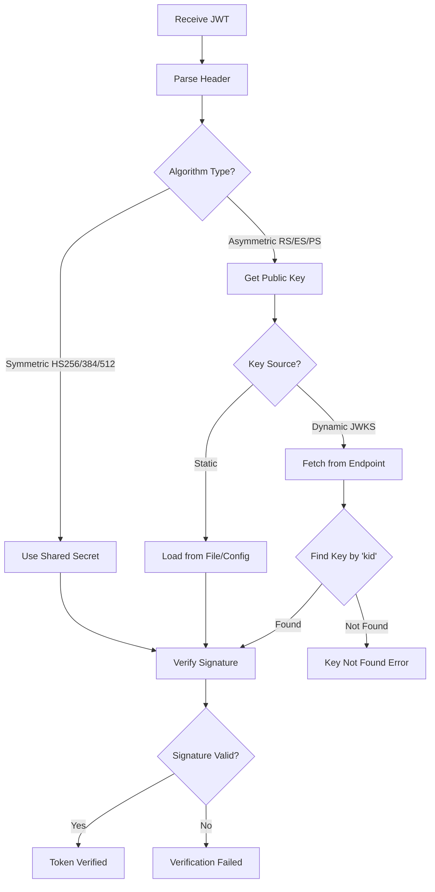
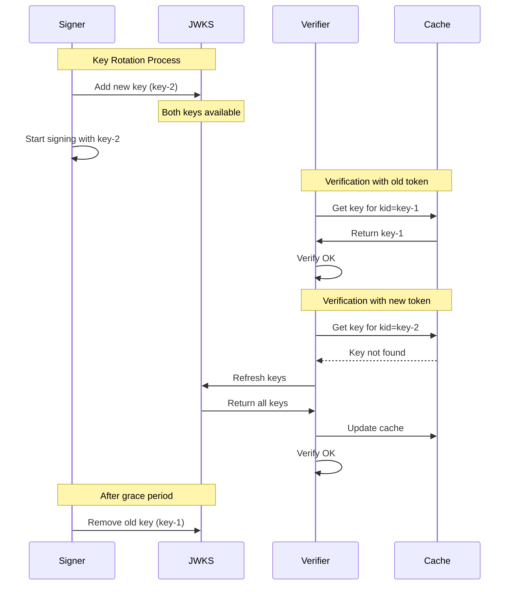

# How to Fix "Key Not Found" JWT Verification Errors

Author: [nawazdhandala](https://www.github.com/nawazdhandala)

Tags: JWT, Security, Cryptography, Key Management, RSA, ECDSA, JWKS

Description: Learn how to diagnose and fix JWT key not found errors, including JWKS configuration, key rotation, and multi-key verification strategies.

---

> JWT verification fails when the key used for signing cannot be found or matched. This error is common when dealing with key rotation, multiple issuers, or misconfigured JWKS endpoints.

This guide covers the causes of "key not found" errors and provides practical solutions for robust key management in JWT verification.

---

## Understanding JWT Key Verification



---

## Common Causes of Key Not Found Errors

| Cause | Description | Solution |
|-------|-------------|----------|
| Missing `kid` in token | Token header lacks key ID | Add kid during signing |
| JWKS endpoint unreachable | Network or configuration issue | Check URL and connectivity |
| Key rotated | Signing key changed but old tokens still in use | Implement key rotation handling |
| Wrong JWKS URL | Different environment URLs | Verify configuration per environment |
| Cache stale | Old keys cached, new key not fetched | Implement cache refresh |
| Key ID mismatch | Token kid does not match any JWKS key | Verify signing key configuration |

---

## Debugging Key Not Found Errors

### Step 1: Inspect the Token Header

```python
import jwt
import json
import base64
from typing import Optional, Dict, Any

def inspect_jwt_header(token: str) -> Dict[str, Any]:
    """
    Extract and inspect JWT header without verification.
    """
    try:
        # Get unverified header
        header = jwt.get_unverified_header(token)

        return {
            'algorithm': header.get('alg'),
            'key_id': header.get('kid'),
            'type': header.get('typ'),
            'all_headers': header,
            'analysis': analyze_header(header)
        }
    except jwt.exceptions.DecodeError as e:
        return {'error': f'Failed to decode header: {str(e)}'}


def analyze_header(header: Dict[str, Any]) -> Dict[str, str]:
    """
    Analyze JWT header for potential issues.
    """
    issues = []
    recommendations = []

    alg = header.get('alg')
    kid = header.get('kid')

    # Check algorithm
    if alg == 'none':
        issues.append("Algorithm is 'none' - token is unsigned")
    elif alg in ['HS256', 'HS384', 'HS512']:
        recommendations.append(
            "Symmetric algorithm - ensure same secret used for sign/verify"
        )
    elif alg in ['RS256', 'RS384', 'RS512', 'ES256', 'ES384', 'ES512']:
        recommendations.append(
            "Asymmetric algorithm - need public key for verification"
        )
        if not kid:
            issues.append("No 'kid' header - cannot identify key in JWKS")

    # Check kid
    if kid:
        recommendations.append(f"Look for key with kid='{kid}' in JWKS")

    return {
        'issues': issues,
        'recommendations': recommendations
    }


# Example usage
token = "eyJhbGciOiJSUzI1NiIsInR5cCI6IkpXVCIsImtpZCI6ImtleS0xIn0..."
result = inspect_jwt_header(token)
print(json.dumps(result, indent=2))
```

### Step 2: Verify JWKS Endpoint

```python
import httpx
import json
from typing import Optional, List, Dict

async def check_jwks_endpoint(jwks_url: str, expected_kid: Optional[str] = None):
    """
    Check JWKS endpoint accessibility and contents.
    """
    result = {
        'url': jwks_url,
        'reachable': False,
        'keys': [],
        'errors': []
    }

    try:
        async with httpx.AsyncClient(timeout=10.0) as client:
            response = await client.get(jwks_url)

            result['status_code'] = response.status_code
            result['reachable'] = True

            if response.status_code != 200:
                result['errors'].append(
                    f"Non-200 response: {response.status_code}"
                )
                return result

            # Parse JWKS
            try:
                jwks = response.json()
            except json.JSONDecodeError:
                result['errors'].append("Response is not valid JSON")
                return result

            if 'keys' not in jwks:
                result['errors'].append("Response missing 'keys' array")
                return result

            # Analyze keys
            for key in jwks['keys']:
                key_info = {
                    'kid': key.get('kid'),
                    'kty': key.get('kty'),
                    'alg': key.get('alg'),
                    'use': key.get('use'),
                }
                result['keys'].append(key_info)

            # Check for expected kid
            if expected_kid:
                kids = [k.get('kid') for k in jwks['keys']]
                if expected_kid in kids:
                    result['kid_found'] = True
                else:
                    result['kid_found'] = False
                    result['errors'].append(
                        f"Expected kid '{expected_kid}' not found. "
                        f"Available: {kids}"
                    )

    except httpx.TimeoutException:
        result['errors'].append("Request timed out")
    except httpx.RequestError as e:
        result['errors'].append(f"Request failed: {str(e)}")

    return result


# Example usage
async def debug_key_not_found():
    # First, get kid from token
    token = "eyJhbGciOiJSUzI1NiIsImtpZCI6ImtleS0xIn0..."
    header = inspect_jwt_header(token)
    kid = header.get('key_id')

    # Then check JWKS
    jwks_result = await check_jwks_endpoint(
        "https://auth.example.com/.well-known/jwks.json",
        expected_kid=kid
    )
    print(json.dumps(jwks_result, indent=2))
```

---

## Implementing Robust Key Management

### JWKS Client with Caching and Refresh

```python
import asyncio
import httpx
from datetime import datetime, timedelta
from typing import Dict, Optional, Any
from cryptography.hazmat.primitives import serialization
from jwt.algorithms import RSAAlgorithm, ECAlgorithm
import logging

logger = logging.getLogger(__name__)

class JWKSClient:
    """
    JWKS client with caching, automatic refresh, and fallback.
    """

    def __init__(
        self,
        jwks_url: str,
        cache_ttl: int = 3600,  # 1 hour
        refresh_before_expiry: int = 300,  # 5 minutes
        max_retries: int = 3
    ):
        self.jwks_url = jwks_url
        self.cache_ttl = cache_ttl
        self.refresh_before_expiry = refresh_before_expiry
        self.max_retries = max_retries

        # Cache storage
        self._keys: Dict[str, Any] = {}
        self._cache_expires: Optional[datetime] = None
        self._lock = asyncio.Lock()

    async def get_key(self, kid: str) -> Optional[Any]:
        """
        Get public key by key ID.
        """
        # Check if cache needs refresh
        if self._should_refresh():
            await self._refresh_keys()

        # Try to find key
        key = self._keys.get(kid)

        if key is None:
            # Key not in cache, try forcing a refresh
            logger.info(f"Key '{kid}' not in cache, forcing refresh")
            await self._refresh_keys(force=True)
            key = self._keys.get(kid)

        return key

    async def get_all_keys(self) -> Dict[str, Any]:
        """
        Get all cached keys.
        """
        if self._should_refresh():
            await self._refresh_keys()
        return self._keys.copy()

    def _should_refresh(self) -> bool:
        """
        Check if cache should be refreshed.
        """
        if self._cache_expires is None:
            return True

        # Refresh before expiry for seamless rotation
        refresh_threshold = self._cache_expires - timedelta(
            seconds=self.refresh_before_expiry
        )
        return datetime.utcnow() >= refresh_threshold

    async def _refresh_keys(self, force: bool = False):
        """
        Refresh keys from JWKS endpoint.
        """
        async with self._lock:
            # Double-check after acquiring lock
            if not force and not self._should_refresh():
                return

            for attempt in range(self.max_retries):
                try:
                    async with httpx.AsyncClient(timeout=10.0) as client:
                        response = await client.get(self.jwks_url)
                        response.raise_for_status()

                        jwks = response.json()
                        self._parse_and_cache_keys(jwks)

                        logger.info(
                            f"JWKS refreshed: {len(self._keys)} keys cached"
                        )
                        return

                except Exception as e:
                    logger.warning(
                        f"JWKS refresh attempt {attempt + 1} failed: {e}"
                    )
                    if attempt < self.max_retries - 1:
                        await asyncio.sleep(2 ** attempt)  # Exponential backoff

            logger.error("All JWKS refresh attempts failed")

    def _parse_and_cache_keys(self, jwks: Dict):
        """
        Parse JWKS and cache public keys.
        """
        new_keys = {}

        for jwk in jwks.get('keys', []):
            kid = jwk.get('kid')
            if not kid:
                logger.warning("JWK without kid, skipping")
                continue

            try:
                key = self._jwk_to_key(jwk)
                new_keys[kid] = key
            except Exception as e:
                logger.error(f"Failed to parse JWK {kid}: {e}")

        self._keys = new_keys
        self._cache_expires = datetime.utcnow() + timedelta(
            seconds=self.cache_ttl
        )

    def _jwk_to_key(self, jwk: Dict) -> Any:
        """
        Convert JWK to cryptographic key.
        """
        kty = jwk.get('kty')

        if kty == 'RSA':
            return RSAAlgorithm.from_jwk(jwk)
        elif kty == 'EC':
            return ECAlgorithm.from_jwk(jwk)
        else:
            raise ValueError(f"Unsupported key type: {kty}")


class MultiSourceJWKSClient:
    """
    JWKS client supporting multiple sources (for multi-tenant or federated auth).
    """

    def __init__(self):
        self._clients: Dict[str, JWKSClient] = {}

    def add_source(self, issuer: str, jwks_url: str):
        """
        Add a JWKS source for an issuer.
        """
        self._clients[issuer] = JWKSClient(jwks_url)

    async def get_key(self, issuer: str, kid: str) -> Optional[Any]:
        """
        Get key from the appropriate source.
        """
        client = self._clients.get(issuer)
        if not client:
            raise ValueError(f"Unknown issuer: {issuer}")

        return await client.get_key(kid)
```

---

## JWT Verification with Key Lookup

```python
import jwt
from jwt.exceptions import InvalidTokenError
from typing import Dict, Any, Optional, List

class JWTVerifier:
    """
    JWT verifier with automatic key lookup.
    """

    def __init__(
        self,
        jwks_client: JWKSClient,
        allowed_algorithms: List[str] = None,
        required_claims: List[str] = None,
        audience: str = None,
        issuer: str = None
    ):
        self.jwks_client = jwks_client
        self.allowed_algorithms = allowed_algorithms or [
            'RS256', 'RS384', 'RS512',
            'ES256', 'ES384', 'ES512'
        ]
        self.required_claims = required_claims or ['sub', 'exp', 'iat']
        self.audience = audience
        self.issuer = issuer

    async def verify(self, token: str) -> Dict[str, Any]:
        """
        Verify JWT token.

        Returns:
            Decoded payload if valid

        Raises:
            InvalidTokenError: If verification fails
        """
        # Get unverified header
        try:
            header = jwt.get_unverified_header(token)
        except jwt.exceptions.DecodeError as e:
            raise InvalidTokenError(f"Invalid token format: {e}")

        # Validate algorithm
        alg = header.get('alg')
        if alg not in self.allowed_algorithms:
            raise InvalidTokenError(f"Algorithm '{alg}' not allowed")

        # Get key ID
        kid = header.get('kid')
        if not kid:
            raise InvalidTokenError("Token missing 'kid' header")

        # Lookup key
        key = await self.jwks_client.get_key(kid)
        if not key:
            raise InvalidTokenError(
                f"Key not found for kid '{kid}'. "
                "Key may have been rotated or token signed with unknown key."
            )

        # Verify token
        try:
            payload = jwt.decode(
                token,
                key,
                algorithms=[alg],
                audience=self.audience,
                issuer=self.issuer,
                options={
                    'require': self.required_claims
                }
            )
            return payload

        except jwt.ExpiredSignatureError:
            raise InvalidTokenError("Token has expired")
        except jwt.InvalidAudienceError:
            raise InvalidTokenError("Invalid audience")
        except jwt.InvalidIssuerError:
            raise InvalidTokenError("Invalid issuer")
        except jwt.InvalidTokenError as e:
            raise InvalidTokenError(f"Token verification failed: {e}")


# Usage example
async def verify_token_example():
    # Initialize JWKS client
    jwks_client = JWKSClient(
        jwks_url="https://auth.example.com/.well-known/jwks.json"
    )

    # Initialize verifier
    verifier = JWTVerifier(
        jwks_client=jwks_client,
        audience="my-api",
        issuer="https://auth.example.com"
    )

    # Verify token
    token = "eyJhbGciOiJSUzI1NiIsImtpZCI6ImtleS0xIn0..."

    try:
        payload = await verifier.verify(token)
        print(f"Token valid. User: {payload['sub']}")
    except InvalidTokenError as e:
        print(f"Token invalid: {e}")
```

---

## Handling Key Rotation



### Key Rotation Handler

```python
from datetime import datetime, timedelta
from typing import Dict, List, Optional
import uuid

class KeyRotationManager:
    """
    Manages key rotation for JWT signing.
    """

    def __init__(
        self,
        key_store,  # Your key storage (HSM, KMS, etc.)
        rotation_period_days: int = 30,
        grace_period_days: int = 7
    ):
        self.key_store = key_store
        self.rotation_period = timedelta(days=rotation_period_days)
        self.grace_period = timedelta(days=grace_period_days)

    async def get_signing_key(self) -> tuple:
        """
        Get the current signing key.
        Returns (key_id, private_key).
        """
        keys = await self.key_store.list_keys()
        active_key = self._get_active_key(keys)

        if not active_key or self._should_rotate(active_key):
            active_key = await self._rotate_key()

        return active_key['kid'], active_key['private_key']

    async def get_jwks(self) -> Dict:
        """
        Get JWKS for public key distribution.
        Only includes keys that are active or in grace period.
        """
        keys = await self.key_store.list_keys()
        now = datetime.utcnow()

        valid_keys = []
        for key in keys:
            # Include active keys
            if key['status'] == 'active':
                valid_keys.append(self._to_jwk(key))

            # Include rotated keys in grace period
            elif key['status'] == 'rotated':
                rotated_at = key.get('rotated_at')
                if rotated_at and (now - rotated_at) < self.grace_period:
                    valid_keys.append(self._to_jwk(key))

        return {'keys': valid_keys}

    def _get_active_key(self, keys: List[Dict]) -> Optional[Dict]:
        """Get the currently active key."""
        for key in keys:
            if key['status'] == 'active':
                return key
        return None

    def _should_rotate(self, key: Dict) -> bool:
        """Check if key should be rotated."""
        created_at = key.get('created_at')
        if not created_at:
            return True
        return (datetime.utcnow() - created_at) >= self.rotation_period

    async def _rotate_key(self) -> Dict:
        """
        Perform key rotation.
        """
        # Generate new key
        new_kid = f"key-{uuid.uuid4().hex[:8]}"
        new_key = await self.key_store.generate_key(
            kid=new_kid,
            algorithm='RS256'
        )

        # Mark old key as rotated
        old_keys = await self.key_store.list_keys(status='active')
        for old_key in old_keys:
            await self.key_store.update_key_status(
                kid=old_key['kid'],
                status='rotated',
                rotated_at=datetime.utcnow()
            )

        # Activate new key
        await self.key_store.update_key_status(
            kid=new_kid,
            status='active',
            created_at=datetime.utcnow()
        )

        return new_key

    def _to_jwk(self, key: Dict) -> Dict:
        """Convert internal key format to JWK."""
        public_key = key['public_key']
        # Convert to JWK format
        jwk = RSAAlgorithm.to_jwk(public_key)
        jwk_dict = json.loads(jwk)
        jwk_dict['kid'] = key['kid']
        jwk_dict['use'] = 'sig'
        jwk_dict['alg'] = key.get('algorithm', 'RS256')
        return jwk_dict


async def cleanup_expired_keys(key_store, grace_period_days: int = 7):
    """
    Clean up keys that are past their grace period.
    Run this periodically (e.g., daily cron job).
    """
    grace_period = timedelta(days=grace_period_days)
    now = datetime.utcnow()

    keys = await key_store.list_keys(status='rotated')

    for key in keys:
        rotated_at = key.get('rotated_at')
        if rotated_at and (now - rotated_at) > grace_period:
            await key_store.delete_key(key['kid'])
            logger.info(f"Deleted expired key: {key['kid']}")
```

---

## Handling Multiple Algorithms

```python
class MultiAlgorithmVerifier:
    """
    Verifier supporting multiple signature algorithms.
    """

    def __init__(self):
        self._symmetric_secrets: Dict[str, str] = {}
        self._jwks_clients: Dict[str, JWKSClient] = {}

    def add_symmetric_key(self, kid: str, secret: str):
        """Add a symmetric key for HS256/384/512."""
        self._symmetric_secrets[kid] = secret

    def add_jwks_source(self, issuer: str, jwks_url: str):
        """Add JWKS source for asymmetric keys."""
        self._jwks_clients[issuer] = JWKSClient(jwks_url)

    async def verify(self, token: str) -> Dict[str, Any]:
        """
        Verify token using appropriate key based on algorithm.
        """
        header = jwt.get_unverified_header(token)
        alg = header.get('alg')
        kid = header.get('kid')

        # Determine key type needed
        if alg in ['HS256', 'HS384', 'HS512']:
            # Symmetric algorithm
            if not kid:
                raise InvalidTokenError(
                    "Symmetric tokens must include 'kid' header"
                )

            secret = self._symmetric_secrets.get(kid)
            if not secret:
                raise InvalidTokenError(
                    f"Unknown symmetric key: {kid}"
                )

            return jwt.decode(token, secret, algorithms=[alg])

        elif alg in ['RS256', 'RS384', 'RS512', 'ES256', 'ES384', 'ES512']:
            # Asymmetric algorithm - need to find right JWKS
            unverified_payload = jwt.decode(
                token,
                options={"verify_signature": False}
            )
            issuer = unverified_payload.get('iss')

            if not issuer:
                raise InvalidTokenError("Token missing 'iss' claim")

            jwks_client = self._jwks_clients.get(issuer)
            if not jwks_client:
                raise InvalidTokenError(f"Unknown issuer: {issuer}")

            key = await jwks_client.get_key(kid)
            if not key:
                raise InvalidTokenError(
                    f"Key '{kid}' not found for issuer '{issuer}'"
                )

            return jwt.decode(
                token,
                key,
                algorithms=[alg],
                issuer=issuer
            )

        else:
            raise InvalidTokenError(f"Unsupported algorithm: {alg}")
```

---

## Error Messages and Troubleshooting

```python
class JWTKeyError(Exception):
    """Detailed JWT key error with troubleshooting info."""

    def __init__(
        self,
        message: str,
        kid: str = None,
        issuer: str = None,
        available_kids: List[str] = None,
        suggestions: List[str] = None
    ):
        self.message = message
        self.kid = kid
        self.issuer = issuer
        self.available_kids = available_kids or []
        self.suggestions = suggestions or []
        super().__init__(self.full_message())

    def full_message(self) -> str:
        parts = [self.message]

        if self.kid:
            parts.append(f"Requested key ID: {self.kid}")

        if self.available_kids:
            parts.append(f"Available keys: {', '.join(self.available_kids)}")

        if self.issuer:
            parts.append(f"Issuer: {self.issuer}")

        if self.suggestions:
            parts.append("Suggestions:")
            for s in self.suggestions:
                parts.append(f"  - {s}")

        return "\n".join(parts)


def create_key_not_found_error(
    kid: str,
    issuer: str,
    jwks_keys: List[Dict]
) -> JWTKeyError:
    """
    Create detailed error for key not found.
    """
    available = [k.get('kid') for k in jwks_keys if k.get('kid')]

    suggestions = [
        "Verify the token was signed with a currently valid key",
        "Check if key rotation occurred recently",
        "Ensure JWKS endpoint URL is correct for this environment",
    ]

    if kid and available:
        # Check for similar kids (typos, version differences)
        for avail_kid in available:
            if kid.split('-')[0] == avail_kid.split('-')[0]:
                suggestions.insert(
                    0,
                    f"Found similar key '{avail_kid}' - possible version mismatch"
                )
                break

    return JWTKeyError(
        message="Key not found in JWKS",
        kid=kid,
        issuer=issuer,
        available_kids=available,
        suggestions=suggestions
    )
```

---

## Testing Key Verification

```python
import pytest
from unittest.mock import AsyncMock, patch

class TestJWKSClient:
    """Tests for JWKS client."""

    @pytest.fixture
    def mock_jwks_response(self):
        return {
            "keys": [
                {
                    "kty": "RSA",
                    "kid": "key-1",
                    "use": "sig",
                    "alg": "RS256",
                    "n": "...",  # RSA modulus
                    "e": "AQAB"
                },
                {
                    "kty": "RSA",
                    "kid": "key-2",
                    "use": "sig",
                    "alg": "RS256",
                    "n": "...",
                    "e": "AQAB"
                }
            ]
        }

    @pytest.mark.asyncio
    async def test_get_key_found(self, mock_jwks_response):
        """Test successful key retrieval."""
        with patch('httpx.AsyncClient') as mock_client:
            mock_response = AsyncMock()
            mock_response.status_code = 200
            mock_response.json.return_value = mock_jwks_response
            mock_client.return_value.__aenter__.return_value.get.return_value = mock_response

            client = JWKSClient("https://auth.example.com/.well-known/jwks.json")
            key = await client.get_key("key-1")

            assert key is not None

    @pytest.mark.asyncio
    async def test_get_key_not_found(self, mock_jwks_response):
        """Test key not found scenario."""
        with patch('httpx.AsyncClient') as mock_client:
            mock_response = AsyncMock()
            mock_response.status_code = 200
            mock_response.json.return_value = mock_jwks_response
            mock_client.return_value.__aenter__.return_value.get.return_value = mock_response

            client = JWKSClient("https://auth.example.com/.well-known/jwks.json")
            key = await client.get_key("nonexistent-key")

            assert key is None

    @pytest.mark.asyncio
    async def test_cache_refresh_on_missing_key(self, mock_jwks_response):
        """Test that cache is refreshed when key not found."""
        call_count = 0

        async def mock_get(*args, **kwargs):
            nonlocal call_count
            call_count += 1
            mock_response = AsyncMock()
            mock_response.status_code = 200
            # Add new key on second call
            if call_count > 1:
                mock_jwks_response['keys'].append({
                    "kty": "RSA",
                    "kid": "new-key",
                    "use": "sig",
                    "alg": "RS256",
                    "n": "...",
                    "e": "AQAB"
                })
            mock_response.json.return_value = mock_jwks_response
            return mock_response

        with patch('httpx.AsyncClient') as mock_client:
            mock_client.return_value.__aenter__.return_value.get = mock_get

            client = JWKSClient("https://auth.example.com/.well-known/jwks.json")

            # First call - key not in initial JWKS
            # Should trigger refresh
            key = await client.get_key("new-key")

            # Should have made 2 calls (initial + refresh)
            assert call_count == 2
```

---

## Summary

When facing "key not found" JWT errors:

1. **Inspect the token header** - Verify `kid` and `alg` are present and correct
2. **Check JWKS endpoint** - Ensure it is reachable and contains expected keys
3. **Implement caching with refresh** - Cache keys but refresh when unknown kid encountered
4. **Handle key rotation** - Maintain grace periods and support multiple active keys
5. **Use detailed error messages** - Include available keys and troubleshooting suggestions

Key management best practices:
- Always include `kid` in token headers
- Implement automatic JWKS refresh with backoff
- Plan for key rotation with overlapping validity periods
- Log key-related errors with sufficient context for debugging
- Test key rotation scenarios before production deployment

The "key not found" error is often a symptom of misconfiguration rather than a problem with the token itself. Systematic debugging of the key lookup chain will identify the root cause.
