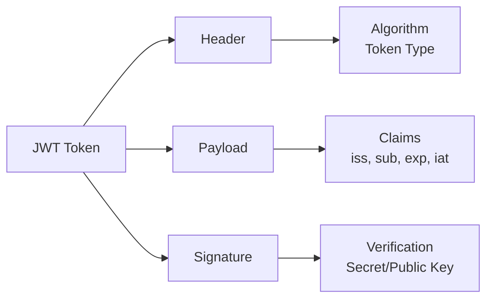
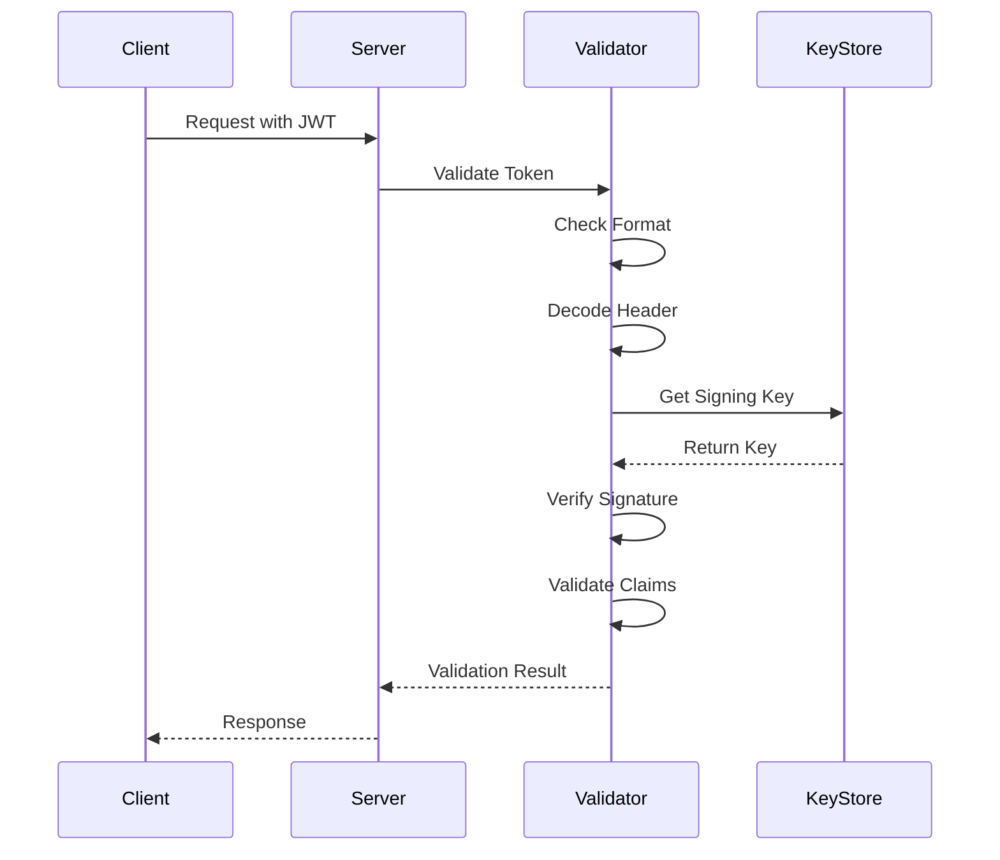
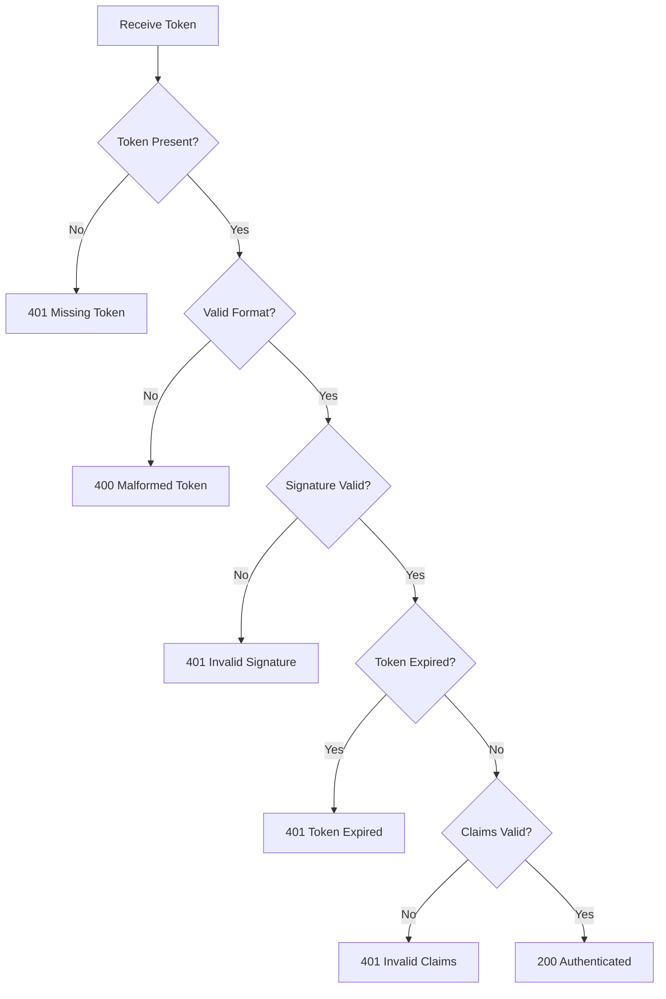

# How to Handle JWT Token Validation

Author: [nawazdhandala](https://www.github.com/nawazdhandala)

Tags: JWT, Authentication, Security, Token Validation, OAuth2

Description: Learn how to properly validate JWT tokens including signature verification, claims validation, expiration checks, and handling common validation errors.

---

JSON Web Tokens (JWTs) are widely used for authentication and authorization in modern applications. Proper validation is critical to ensure security. This guide covers comprehensive JWT token validation strategies with practical code examples.

## Understanding JWT Structure

A JWT consists of three parts separated by dots: Header, Payload, and Signature.



## JWT Validation Flow



## Basic JWT Validation in Node.js

```javascript
// jwt-validator.js
// Complete JWT validation implementation with comprehensive error handling

const jwt = require('jsonwebtoken');
const jwksClient = require('jwks-rsa');

class JWTValidator {
    constructor(options) {
        // Configuration for JWT validation
        this.issuer = options.issuer;
        this.audience = options.audience;
        this.algorithms = options.algorithms || ['RS256', 'HS256'];
        this.clockTolerance = options.clockTolerance || 30; // seconds

        // Initialize JWKS client for RS256 tokens
        if (options.jwksUri) {
            this.jwksClient = jwksClient({
                jwksUri: options.jwksUri,
                cache: true,
                cacheMaxEntries: 5,
                cacheMaxAge: 600000, // 10 minutes
                rateLimit: true,
                jwksRequestsPerMinute: 10
            });
        }

        // Secret for HS256 tokens
        this.secret = options.secret;
    }

    // Main validation method
    async validate(token) {
        try {
            // Step 1: Check token format
            this.validateFormat(token);

            // Step 2: Decode header without verification
            const decoded = jwt.decode(token, { complete: true });
            if (!decoded) {
                throw new ValidationError('INVALID_TOKEN', 'Unable to decode token');
            }

            // Step 3: Get the signing key based on algorithm
            const signingKey = await this.getSigningKey(decoded.header);

            // Step 4: Verify token with all options
            const payload = jwt.verify(token, signingKey, {
                algorithms: this.algorithms,
                issuer: this.issuer,
                audience: this.audience,
                clockTolerance: this.clockTolerance
            });

            // Step 5: Additional custom validations
            this.validateCustomClaims(payload);

            return {
                valid: true,
                payload: payload,
                header: decoded.header
            };

        } catch (error) {
            return this.handleValidationError(error);
        }
    }

    // Validate basic token format
    validateFormat(token) {
        if (!token || typeof token !== 'string') {
            throw new ValidationError('MISSING_TOKEN', 'Token is required');
        }

        // Check for Bearer prefix and remove if present
        if (token.startsWith('Bearer ')) {
            token = token.slice(7);
        }

        // JWT should have exactly 3 parts
        const parts = token.split('.');
        if (parts.length !== 3) {
            throw new ValidationError(
                'MALFORMED_TOKEN',
                'Token must have three parts separated by dots'
            );
        }

        // Validate each part is valid base64url
        parts.forEach((part, index) => {
            if (!this.isValidBase64Url(part)) {
                throw new ValidationError(
                    'INVALID_ENCODING',
                    `Token part ${index + 1} is not valid base64url`
                );
            }
        });

        return true;
    }

    // Check if string is valid base64url
    isValidBase64Url(str) {
        // Base64url uses - and _ instead of + and /
        const base64UrlRegex = /^[A-Za-z0-9_-]+$/;
        return base64UrlRegex.test(str);
    }

    // Get signing key based on algorithm
    async getSigningKey(header) {
        const { alg, kid } = header;

        // Handle symmetric algorithms (HS256, HS384, HS512)
        if (alg.startsWith('HS')) {
            if (!this.secret) {
                throw new ValidationError(
                    'MISSING_SECRET',
                    'Secret required for HMAC algorithms'
                );
            }
            return this.secret;
        }

        // Handle asymmetric algorithms (RS256, RS384, RS512, ES256, etc.)
        if (alg.startsWith('RS') || alg.startsWith('ES') || alg.startsWith('PS')) {
            if (!this.jwksClient) {
                throw new ValidationError(
                    'MISSING_JWKS',
                    'JWKS client required for asymmetric algorithms'
                );
            }

            // Fetch signing key from JWKS endpoint
            return new Promise((resolve, reject) => {
                this.jwksClient.getSigningKey(kid, (err, key) => {
                    if (err) {
                        reject(new ValidationError(
                            'KEY_NOT_FOUND',
                            `Unable to find signing key: ${err.message}`
                        ));
                        return;
                    }
                    resolve(key.getPublicKey());
                });
            });
        }

        throw new ValidationError(
            'UNSUPPORTED_ALGORITHM',
            `Algorithm ${alg} is not supported`
        );
    }

    // Validate custom claims
    validateCustomClaims(payload) {
        // Check for required claims
        const requiredClaims = ['sub', 'iat', 'exp'];
        for (const claim of requiredClaims) {
            if (!payload[claim]) {
                throw new ValidationError(
                    'MISSING_CLAIM',
                    `Required claim '${claim}' is missing`
                );
            }
        }

        // Validate subject is not empty
        if (typeof payload.sub !== 'string' || payload.sub.trim() === '') {
            throw new ValidationError(
                'INVALID_SUBJECT',
                'Subject claim must be a non-empty string'
            );
        }

        // Check token is not issued in the future
        const now = Math.floor(Date.now() / 1000);
        if (payload.iat > now + this.clockTolerance) {
            throw new ValidationError(
                'TOKEN_FROM_FUTURE',
                'Token was issued in the future'
            );
        }

        // Validate nbf (not before) if present
        if (payload.nbf && payload.nbf > now + this.clockTolerance) {
            throw new ValidationError(
                'TOKEN_NOT_ACTIVE',
                'Token is not yet valid'
            );
        }
    }

    // Handle validation errors
    handleValidationError(error) {
        // Map jsonwebtoken errors to our error format
        const errorMap = {
            'TokenExpiredError': {
                code: 'TOKEN_EXPIRED',
                message: 'Token has expired'
            },
            'JsonWebTokenError': {
                code: 'INVALID_TOKEN',
                message: error.message
            },
            'NotBeforeError': {
                code: 'TOKEN_NOT_ACTIVE',
                message: 'Token is not yet valid'
            }
        };

        if (error instanceof ValidationError) {
            return {
                valid: false,
                error: {
                    code: error.code,
                    message: error.message
                }
            };
        }

        const mapped = errorMap[error.name] || {
            code: 'VALIDATION_ERROR',
            message: error.message
        };

        return {
            valid: false,
            error: mapped
        };
    }
}

// Custom validation error class
class ValidationError extends Error {
    constructor(code, message) {
        super(message);
        this.name = 'ValidationError';
        this.code = code;
    }
}

module.exports = { JWTValidator, ValidationError };
```

## JWT Validation in Python

```python
# jwt_validator.py
# Comprehensive JWT validation for Python applications

import jwt
from jwt import PyJWKClient
from datetime import datetime, timezone
from typing import Dict, Any, Optional, List
from dataclasses import dataclass
from enum import Enum


class ValidationErrorCode(Enum):
    """Error codes for JWT validation failures."""
    MISSING_TOKEN = "MISSING_TOKEN"
    MALFORMED_TOKEN = "MALFORMED_TOKEN"
    INVALID_SIGNATURE = "INVALID_SIGNATURE"
    TOKEN_EXPIRED = "TOKEN_EXPIRED"
    TOKEN_NOT_ACTIVE = "TOKEN_NOT_ACTIVE"
    INVALID_ISSUER = "INVALID_ISSUER"
    INVALID_AUDIENCE = "INVALID_AUDIENCE"
    MISSING_CLAIM = "MISSING_CLAIM"
    INVALID_CLAIM = "INVALID_CLAIM"
    KEY_NOT_FOUND = "KEY_NOT_FOUND"


@dataclass
class ValidationResult:
    """Result of JWT validation."""
    valid: bool
    payload: Optional[Dict[str, Any]] = None
    header: Optional[Dict[str, Any]] = None
    error_code: Optional[ValidationErrorCode] = None
    error_message: Optional[str] = None


class JWTValidator:
    """
    JWT Token validator with comprehensive validation options.

    Supports both symmetric (HS256) and asymmetric (RS256) algorithms.
    """

    def __init__(
        self,
        issuer: Optional[str] = None,
        audience: Optional[str] = None,
        jwks_uri: Optional[str] = None,
        secret: Optional[str] = None,
        algorithms: List[str] = None,
        clock_skew_seconds: int = 30
    ):
        """
        Initialize the JWT validator.

        Args:
            issuer: Expected issuer claim (iss)
            audience: Expected audience claim (aud)
            jwks_uri: URI for JWKS endpoint (for RS256)
            secret: Secret key for HS256 validation
            algorithms: List of allowed algorithms
            clock_skew_seconds: Allowed clock skew in seconds
        """
        self.issuer = issuer
        self.audience = audience
        self.secret = secret
        self.algorithms = algorithms or ["RS256", "HS256"]
        self.clock_skew = clock_skew_seconds

        # Initialize JWKS client if URI provided
        self.jwks_client = None
        if jwks_uri:
            self.jwks_client = PyJWKClient(jwks_uri, cache_keys=True)

    def validate(self, token: str) -> ValidationResult:
        """
        Validate a JWT token.

        Args:
            token: The JWT token string (with or without Bearer prefix)

        Returns:
            ValidationResult with validation status and payload/error
        """
        try:
            # Remove Bearer prefix if present
            if token.startswith("Bearer "):
                token = token[7:]

            # Basic format validation
            self._validate_format(token)

            # Decode header to determine algorithm
            unverified_header = jwt.get_unverified_header(token)
            algorithm = unverified_header.get("alg")

            # Get signing key based on algorithm
            signing_key = self._get_signing_key(token, algorithm)

            # Build verification options
            options = {
                "verify_signature": True,
                "verify_exp": True,
                "verify_iat": True,
                "require": ["exp", "iat", "sub"]
            }

            # Verify and decode the token
            payload = jwt.decode(
                token,
                signing_key,
                algorithms=self.algorithms,
                issuer=self.issuer,
                audience=self.audience,
                leeway=self.clock_skew,
                options=options
            )

            # Additional custom validations
            self._validate_custom_claims(payload)

            return ValidationResult(
                valid=True,
                payload=payload,
                header=unverified_header
            )

        except jwt.ExpiredSignatureError:
            return ValidationResult(
                valid=False,
                error_code=ValidationErrorCode.TOKEN_EXPIRED,
                error_message="Token has expired"
            )
        except jwt.ImmatureSignatureError:
            return ValidationResult(
                valid=False,
                error_code=ValidationErrorCode.TOKEN_NOT_ACTIVE,
                error_message="Token is not yet valid"
            )
        except jwt.InvalidIssuerError:
            return ValidationResult(
                valid=False,
                error_code=ValidationErrorCode.INVALID_ISSUER,
                error_message=f"Invalid issuer. Expected: {self.issuer}"
            )
        except jwt.InvalidAudienceError:
            return ValidationResult(
                valid=False,
                error_code=ValidationErrorCode.INVALID_AUDIENCE,
                error_message=f"Invalid audience. Expected: {self.audience}"
            )
        except jwt.InvalidSignatureError:
            return ValidationResult(
                valid=False,
                error_code=ValidationErrorCode.INVALID_SIGNATURE,
                error_message="Token signature verification failed"
            )
        except jwt.DecodeError as e:
            return ValidationResult(
                valid=False,
                error_code=ValidationErrorCode.MALFORMED_TOKEN,
                error_message=f"Unable to decode token: {str(e)}"
            )
        except ValidationError as e:
            return ValidationResult(
                valid=False,
                error_code=e.code,
                error_message=e.message
            )
        except Exception as e:
            return ValidationResult(
                valid=False,
                error_code=ValidationErrorCode.INVALID_CLAIM,
                error_message=str(e)
            )

    def _validate_format(self, token: str) -> None:
        """Validate basic JWT format."""
        if not token:
            raise ValidationError(
                ValidationErrorCode.MISSING_TOKEN,
                "Token is required"
            )

        parts = token.split(".")
        if len(parts) != 3:
            raise ValidationError(
                ValidationErrorCode.MALFORMED_TOKEN,
                "Token must have three parts"
            )

    def _get_signing_key(self, token: str, algorithm: str) -> Any:
        """Get the appropriate signing key based on algorithm."""
        # Symmetric algorithms use the secret
        if algorithm.startswith("HS"):
            if not self.secret:
                raise ValidationError(
                    ValidationErrorCode.KEY_NOT_FOUND,
                    "Secret required for HMAC algorithms"
                )
            return self.secret

        # Asymmetric algorithms use JWKS
        if algorithm.startswith("RS") or algorithm.startswith("ES"):
            if not self.jwks_client:
                raise ValidationError(
                    ValidationErrorCode.KEY_NOT_FOUND,
                    "JWKS client required for asymmetric algorithms"
                )
            signing_key = self.jwks_client.get_signing_key_from_jwt(token)
            return signing_key.key

        raise ValidationError(
            ValidationErrorCode.INVALID_CLAIM,
            f"Unsupported algorithm: {algorithm}"
        )

    def _validate_custom_claims(self, payload: Dict[str, Any]) -> None:
        """Perform additional custom claim validations."""
        # Validate subject is meaningful
        sub = payload.get("sub")
        if not sub or not isinstance(sub, str) or not sub.strip():
            raise ValidationError(
                ValidationErrorCode.INVALID_CLAIM,
                "Subject claim must be a non-empty string"
            )

        # Check iat is not in the future
        iat = payload.get("iat")
        now = datetime.now(timezone.utc).timestamp()
        if iat and iat > now + self.clock_skew:
            raise ValidationError(
                ValidationErrorCode.INVALID_CLAIM,
                "Token issued in the future"
            )


class ValidationError(Exception):
    """Custom exception for validation errors."""

    def __init__(self, code: ValidationErrorCode, message: str):
        self.code = code
        self.message = message
        super().__init__(message)


# Example usage
if __name__ == "__main__":
    # Configure validator for Auth0
    validator = JWTValidator(
        issuer="https://your-tenant.auth0.com/",
        audience="https://your-api.example.com",
        jwks_uri="https://your-tenant.auth0.com/.well-known/jwks.json"
    )

    # Validate a token
    token = "eyJhbGciOiJSUzI1NiIs..."
    result = validator.validate(token)

    if result.valid:
        print(f"Token is valid. Subject: {result.payload['sub']}")
    else:
        print(f"Validation failed: {result.error_code.value} - {result.error_message}")
```

## Express Middleware for JWT Validation

```javascript
// middleware/jwt-auth.js
// Express middleware for JWT authentication and validation

const { JWTValidator, ValidationError } = require('./jwt-validator');

function createJWTMiddleware(options) {
    // Create validator instance
    const validator = new JWTValidator({
        issuer: options.issuer,
        audience: options.audience,
        jwksUri: options.jwksUri,
        secret: options.secret,
        algorithms: options.algorithms,
        clockTolerance: options.clockTolerance || 30
    });

    // Token extraction strategies
    const extractors = {
        // Extract from Authorization header
        header: (req) => {
            const authHeader = req.headers.authorization;
            if (authHeader && authHeader.startsWith('Bearer ')) {
                return authHeader.slice(7);
            }
            return null;
        },

        // Extract from cookie
        cookie: (cookieName) => (req) => {
            return req.cookies && req.cookies[cookieName];
        },

        // Extract from query parameter
        query: (paramName) => (req) => {
            return req.query && req.query[paramName];
        }
    };

    // Build extractor chain
    const tokenExtractors = [];

    if (options.extractFromHeader !== false) {
        tokenExtractors.push(extractors.header);
    }
    if (options.cookieName) {
        tokenExtractors.push(extractors.cookie(options.cookieName));
    }
    if (options.queryParam) {
        tokenExtractors.push(extractors.query(options.queryParam));
    }

    // Return middleware function
    return async function jwtAuthMiddleware(req, res, next) {
        // Extract token using configured extractors
        let token = null;
        for (const extractor of tokenExtractors) {
            token = extractor(req);
            if (token) break;
        }

        // Check if token was found
        if (!token) {
            return res.status(401).json({
                error: 'UNAUTHORIZED',
                message: 'No authentication token provided',
                code: 'MISSING_TOKEN'
            });
        }

        // Validate the token
        const result = await validator.validate(token);

        if (!result.valid) {
            // Map error codes to HTTP status codes
            const statusCode = getStatusCode(result.error.code);

            return res.status(statusCode).json({
                error: 'AUTHENTICATION_FAILED',
                message: result.error.message,
                code: result.error.code
            });
        }

        // Attach decoded token to request
        req.user = result.payload;
        req.token = {
            raw: token,
            header: result.header,
            payload: result.payload
        };

        // Continue to next middleware
        next();
    };
}

// Map error codes to HTTP status codes
function getStatusCode(errorCode) {
    const statusMap = {
        'MISSING_TOKEN': 401,
        'MALFORMED_TOKEN': 400,
        'INVALID_TOKEN': 401,
        'TOKEN_EXPIRED': 401,
        'TOKEN_NOT_ACTIVE': 401,
        'INVALID_SIGNATURE': 401,
        'KEY_NOT_FOUND': 500,
        'UNSUPPORTED_ALGORITHM': 400
    };

    return statusMap[errorCode] || 401;
}

// Optional: middleware to require specific claims or roles
function requireClaims(claims) {
    return function(req, res, next) {
        if (!req.user) {
            return res.status(401).json({
                error: 'UNAUTHORIZED',
                message: 'Authentication required'
            });
        }

        for (const [claim, expectedValue] of Object.entries(claims)) {
            const actualValue = req.user[claim];

            // Handle array claims (like roles or permissions)
            if (Array.isArray(expectedValue)) {
                const hasValue = expectedValue.some(v =>
                    Array.isArray(actualValue)
                        ? actualValue.includes(v)
                        : actualValue === v
                );
                if (!hasValue) {
                    return res.status(403).json({
                        error: 'FORBIDDEN',
                        message: `Missing required claim: ${claim}`
                    });
                }
            } else if (actualValue !== expectedValue) {
                return res.status(403).json({
                    error: 'FORBIDDEN',
                    message: `Invalid claim value for: ${claim}`
                });
            }
        }

        next();
    };
}

module.exports = { createJWTMiddleware, requireClaims };
```

## Usage Example with Express

```javascript
// app.js
// Example Express application with JWT authentication

const express = require('express');
const { createJWTMiddleware, requireClaims } = require('./middleware/jwt-auth');

const app = express();

// Configure JWT middleware
const jwtAuth = createJWTMiddleware({
    issuer: 'https://auth.example.com',
    audience: 'https://api.example.com',
    jwksUri: 'https://auth.example.com/.well-known/jwks.json',
    extractFromHeader: true,
    cookieName: 'access_token' // Also check cookies
});

// Public routes (no authentication)
app.get('/health', (req, res) => {
    res.json({ status: 'healthy' });
});

// Protected routes (require valid JWT)
app.get('/api/profile', jwtAuth, (req, res) => {
    // req.user contains the decoded token payload
    res.json({
        userId: req.user.sub,
        email: req.user.email,
        name: req.user.name
    });
});

// Routes requiring specific roles
app.get('/api/admin/users',
    jwtAuth,
    requireClaims({ roles: ['admin'] }),
    (req, res) => {
        res.json({ users: [] });
    }
);

// Error handling middleware
app.use((err, req, res, next) => {
    console.error('Unhandled error:', err);
    res.status(500).json({
        error: 'INTERNAL_ERROR',
        message: 'An unexpected error occurred'
    });
});

app.listen(3000, () => {
    console.log('Server running on port 3000');
});
```

## Common Validation Scenarios



## Handling Token Refresh

```javascript
// token-refresh.js
// Handle token refresh flow when access tokens expire

class TokenManager {
    constructor(options) {
        this.accessToken = null;
        this.refreshToken = null;
        this.tokenEndpoint = options.tokenEndpoint;
        this.clientId = options.clientId;
        this.clientSecret = options.clientSecret;
        this.onTokenRefresh = options.onTokenRefresh;
    }

    // Check if access token needs refresh
    needsRefresh() {
        if (!this.accessToken) return true;

        try {
            // Decode token without verification to check expiration
            const payload = JSON.parse(
                Buffer.from(this.accessToken.split('.')[1], 'base64').toString()
            );

            // Refresh if token expires within 5 minutes
            const expiresAt = payload.exp * 1000;
            const refreshThreshold = 5 * 60 * 1000;

            return Date.now() > (expiresAt - refreshThreshold);
        } catch {
            return true;
        }
    }

    // Refresh the access token
    async refresh() {
        if (!this.refreshToken) {
            throw new Error('No refresh token available');
        }

        const response = await fetch(this.tokenEndpoint, {
            method: 'POST',
            headers: {
                'Content-Type': 'application/x-www-form-urlencoded'
            },
            body: new URLSearchParams({
                grant_type: 'refresh_token',
                refresh_token: this.refreshToken,
                client_id: this.clientId,
                client_secret: this.clientSecret
            })
        });

        if (!response.ok) {
            const error = await response.json();
            throw new TokenRefreshError(error.error, error.error_description);
        }

        const tokens = await response.json();

        this.accessToken = tokens.access_token;
        if (tokens.refresh_token) {
            this.refreshToken = tokens.refresh_token;
        }

        // Notify callback of new tokens
        if (this.onTokenRefresh) {
            this.onTokenRefresh(tokens);
        }

        return tokens;
    }

    // Get valid access token, refreshing if needed
    async getAccessToken() {
        if (this.needsRefresh()) {
            await this.refresh();
        }
        return this.accessToken;
    }
}

class TokenRefreshError extends Error {
    constructor(code, message) {
        super(message);
        this.name = 'TokenRefreshError';
        this.code = code;
    }
}

module.exports = { TokenManager, TokenRefreshError };
```

## Security Best Practices

1. **Always validate the signature**: Never trust the payload without verifying the signature
2. **Check all standard claims**: Validate `iss`, `aud`, `exp`, `iat`, and `nbf`
3. **Use appropriate algorithms**: Prefer RS256 over HS256 for distributed systems
4. **Implement clock tolerance**: Allow small time differences between servers
5. **Validate token source**: Ensure tokens come from expected locations
6. **Handle errors gracefully**: Never expose internal errors to clients
7. **Log validation failures**: Monitor for potential attacks
8. **Use short expiration times**: Minimize impact of compromised tokens
9. **Rotate signing keys**: Regularly rotate keys and support multiple active keys
10. **Validate custom claims**: Check application-specific claims thoroughly

## Conclusion

Proper JWT token validation is essential for application security. By implementing comprehensive validation that checks the token format, verifies the signature, validates all claims, and handles errors appropriately, you can ensure that only legitimate tokens grant access to your protected resources. Remember to always validate on the server side and never trust client-side validation alone.
