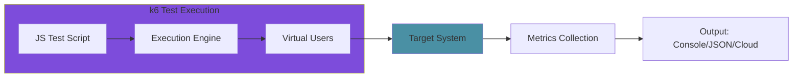

# How to Configure Load Testing with k6

Author: [nawazdhandala](https://www.github.com/nawazdhandala)

Tags: k6, Load Testing, Performance Testing, JavaScript, Stress Testing, Grafana, DevOps

Description: A practical guide to configuring and running load tests with k6, covering test scenarios, thresholds, metrics, and CI/CD integration.

---

Load testing helps you understand how your application behaves under stress before your users discover performance issues in production. k6 is a modern load testing tool that uses JavaScript for test scripts, making it accessible to developers already familiar with the language. This guide walks through practical k6 configurations for real-world load testing scenarios.

## Why k6?

k6 stands out from other load testing tools for several reasons: it uses JavaScript (not a custom DSL), runs efficiently with low resource usage, integrates well with CI/CD pipelines, and offers excellent metrics and visualization options. It's developer-friendly while being powerful enough for serious performance testing.



## Installing k6

Install k6 based on your operating system:

```bash
# macOS with Homebrew
brew install k6

# Ubuntu/Debian
sudo gpg -k
sudo gpg --no-default-keyring --keyring /usr/share/keyrings/k6-archive-keyring.gpg --keyserver hkp://keyserver.ubuntu.com:80 --recv-keys C5AD17C747E3415A3642D57D77C6C491D6AC1D69
echo "deb [signed-by=/usr/share/keyrings/k6-archive-keyring.gpg] https://dl.k6.io/deb stable main" | sudo tee /etc/apt/sources.list.d/k6.list
sudo apt-get update
sudo apt-get install k6

# Windows with Chocolatey
choco install k6

# Docker
docker pull grafana/k6
```

## Writing Your First Load Test

Create a basic test script:

```javascript
// basic-test.js
import http from 'k6/http';
import { check, sleep } from 'k6';

// Test configuration
export const options = {
  // Ramp up from 0 to 50 users over 1 minute
  // Stay at 50 users for 3 minutes
  // Ramp down to 0 over 1 minute
  stages: [
    { duration: '1m', target: 50 },
    { duration: '3m', target: 50 },
    { duration: '1m', target: 0 },
  ],

  // Performance thresholds
  thresholds: {
    http_req_duration: ['p(95)<500'], // 95% of requests under 500ms
    http_req_failed: ['rate<0.01'],    // Less than 1% failure rate
  },
};

// Default function runs once per virtual user iteration
export default function () {
  // Make HTTP request
  const response = http.get('https://api.example.com/users');

  // Validate response
  check(response, {
    'status is 200': (r) => r.status === 200,
    'response time < 500ms': (r) => r.timings.duration < 500,
    'body contains users': (r) => r.body.includes('users'),
  });

  // Wait between iterations (simulates user think time)
  sleep(1);
}
```

Run the test:

```bash
k6 run basic-test.js
```

## Load Test Patterns

### Constant Load Test

Test how your system handles a steady number of concurrent users:

```javascript
// constant-load.js
import http from 'k6/http';
import { sleep } from 'k6';

export const options = {
  vus: 100,           // 100 virtual users
  duration: '5m',     // Run for 5 minutes
};

export default function () {
  http.get('https://api.example.com/health');
  sleep(1);
}
```

### Stress Test

Gradually increase load to find breaking points:

```javascript
// stress-test.js
import http from 'k6/http';
import { sleep } from 'k6';

export const options = {
  stages: [
    { duration: '2m', target: 100 },   // Ramp up to 100 users
    { duration: '5m', target: 100 },   // Stay at 100
    { duration: '2m', target: 200 },   // Ramp up to 200
    { duration: '5m', target: 200 },   // Stay at 200
    { duration: '2m', target: 300 },   // Ramp up to 300
    { duration: '5m', target: 300 },   // Stay at 300
    { duration: '2m', target: 0 },     // Ramp down
  ],

  thresholds: {
    http_req_duration: ['p(99)<1500'], // 99% under 1.5s
    http_req_failed: ['rate<0.05'],    // Less than 5% failures
  },
};

export default function () {
  http.get('https://api.example.com/products');
  sleep(Math.random() * 3); // Random think time 0-3 seconds
}
```

### Spike Test

Test sudden traffic spikes:

```javascript
// spike-test.js
import http from 'k6/http';
import { sleep } from 'k6';

export const options = {
  stages: [
    { duration: '1m', target: 50 },    // Normal load
    { duration: '10s', target: 500 },  // Spike to 500 users
    { duration: '2m', target: 500 },   // Stay at spike
    { duration: '10s', target: 50 },   // Back to normal
    { duration: '2m', target: 50 },    // Recovery period
    { duration: '30s', target: 0 },    // Ramp down
  ],
};

export default function () {
  http.get('https://api.example.com/checkout');
  sleep(1);
}
```

## Load Testing Scenarios Visualization

```mermaid
graph TD
    subgraph Constant["Constant Load"]
        C1[100 Users] --> C2[5 Minutes]
        C2 --> C3[Steady State]
    end

    subgraph Stress["Stress Test"]
        S1[Start Low] --> S2[Increase Step]
        S2 --> S3[Increase Step]
        S3 --> S4[Find Breaking Point]
    end

    subgraph Spike["Spike Test"]
        SP1[Normal Load] --> SP2[Sudden Spike]
        SP2 --> SP3[Recovery]
    end

    subgraph Soak["Soak Test"]
        SK1[Moderate Load] --> SK2[Extended Duration]
        SK2 --> SK3[Find Memory Leaks]
    end
```



## Advanced Configuration

### Testing Multiple Endpoints

```javascript
// multi-endpoint.js
import http from 'k6/http';
import { check, group, sleep } from 'k6';

export const options = {
  stages: [
    { duration: '2m', target: 100 },
    { duration: '5m', target: 100 },
    { duration: '1m', target: 0 },
  ],
};

const BASE_URL = 'https://api.example.com';

export default function () {
  group('User Flow', function () {
    // Step 1: Login
    const loginRes = http.post(`${BASE_URL}/auth/login`, JSON.stringify({
      email: 'test@example.com',
      password: 'password123',
    }), {
      headers: { 'Content-Type': 'application/json' },
    });

    check(loginRes, {
      'login successful': (r) => r.status === 200,
      'has auth token': (r) => r.json('token') !== undefined,
    });

    const token = loginRes.json('token');
    const authHeaders = {
      headers: {
        'Authorization': `Bearer ${token}`,
        'Content-Type': 'application/json',
      },
    };

    sleep(1);

    // Step 2: Get Products
    const productsRes = http.get(`${BASE_URL}/products`, authHeaders);
    check(productsRes, {
      'products loaded': (r) => r.status === 200,
      'has products': (r) => r.json('products').length > 0,
    });

    sleep(2);

    // Step 3: Add to Cart
    const cartRes = http.post(`${BASE_URL}/cart`, JSON.stringify({
      productId: 1,
      quantity: 2,
    }), authHeaders);

    check(cartRes, {
      'item added to cart': (r) => r.status === 201,
    });

    sleep(1);
  });
}
```

### Custom Metrics

```javascript
// custom-metrics.js
import http from 'k6/http';
import { Counter, Trend, Rate, Gauge } from 'k6/metrics';

// Define custom metrics
const orderSuccessRate = new Rate('order_success_rate');
const orderDuration = new Trend('order_duration');
const ordersCreated = new Counter('orders_created');
const activeOrders = new Gauge('active_orders');

export const options = {
  vus: 50,
  duration: '5m',
  thresholds: {
    order_success_rate: ['rate>0.95'],     // 95% success rate
    order_duration: ['p(95)<2000'],         // 95% under 2s
  },
};

export default function () {
  const startTime = Date.now();

  const response = http.post('https://api.example.com/orders', JSON.stringify({
    items: [{ id: 1, quantity: 1 }],
  }), {
    headers: { 'Content-Type': 'application/json' },
  });

  const duration = Date.now() - startTime;

  // Record custom metrics
  const success = response.status === 201;
  orderSuccessRate.add(success);
  orderDuration.add(duration);

  if (success) {
    ordersCreated.add(1);
    activeOrders.add(1);
  }
}
```

### Parameterized Tests with Shared Data

```javascript
// parameterized-test.js
import http from 'k6/http';
import { SharedArray } from 'k6/data';

// Load test data (runs once, shared across VUs)
const users = new SharedArray('users', function () {
  return JSON.parse(open('./test-users.json'));
});

export const options = {
  vus: 100,
  duration: '5m',
};

export default function () {
  // Each VU gets a different user based on VU ID
  const user = users[__VU % users.length];

  const response = http.post('https://api.example.com/auth/login', JSON.stringify({
    email: user.email,
    password: user.password,
  }), {
    headers: { 'Content-Type': 'application/json' },
  });
}
```

## Thresholds and Pass/Fail Criteria

```javascript
// thresholds.js
export const options = {
  thresholds: {
    // Response time thresholds
    http_req_duration: [
      'p(50)<200',     // 50% of requests under 200ms
      'p(90)<500',     // 90% under 500ms
      'p(95)<1000',    // 95% under 1 second
      'p(99)<2000',    // 99% under 2 seconds
      'max<5000',      // Maximum under 5 seconds
    ],

    // Error rate threshold
    http_req_failed: ['rate<0.01'], // Less than 1% errors

    // Throughput threshold
    http_reqs: ['rate>100'],        // At least 100 requests/second

    // Custom metric thresholds
    order_success_rate: ['rate>0.99'],

    // Group-specific thresholds
    'http_req_duration{name:login}': ['p(95)<500'],
    'http_req_duration{name:checkout}': ['p(95)<2000'],
  },
};
```

## CI/CD Integration

### GitHub Actions

```yaml
# .github/workflows/load-test.yml
name: Load Tests

on:
  schedule:
    - cron: '0 2 * * *'  # Run nightly at 2 AM
  workflow_dispatch:      # Allow manual triggers

jobs:
  load-test:
    runs-on: ubuntu-latest

    steps:
      - uses: actions/checkout@v4

      - name: Install k6
        run: |
          sudo gpg -k
          sudo gpg --no-default-keyring --keyring /usr/share/keyrings/k6-archive-keyring.gpg --keyserver hkp://keyserver.ubuntu.com:80 --recv-keys C5AD17C747E3415A3642D57D77C6C491D6AC1D69
          echo "deb [signed-by=/usr/share/keyrings/k6-archive-keyring.gpg] https://dl.k6.io/deb stable main" | sudo tee /etc/apt/sources.list.d/k6.list
          sudo apt-get update
          sudo apt-get install k6

      - name: Run load tests
        run: k6 run --out json=results.json load-tests/stress-test.js
        env:
          K6_TARGET_URL: ${{ secrets.STAGING_URL }}

      - name: Upload results
        uses: actions/upload-artifact@v4
        with:
          name: k6-results
          path: results.json

      - name: Check thresholds
        if: failure()
        run: |
          echo "Load test failed! Check the results artifact for details."
          exit 1
```

### Output to Grafana/InfluxDB

```javascript
// Run with: k6 run --out influxdb=http://localhost:8086/k6 script.js
export const options = {
  vus: 100,
  duration: '5m',
};
```

## Best Practices

1. **Start Small**: Begin with low VU counts and short durations during development
2. **Use Think Time**: Add realistic `sleep()` calls between requests to simulate real users
3. **Test in Staging**: Never run load tests against production without careful planning
4. **Monitor Target System**: Watch CPU, memory, and database metrics during tests
5. **Version Your Tests**: Keep load test scripts in version control alongside your code
6. **Document Baselines**: Record baseline performance metrics for comparison

## Conclusion

k6 makes load testing accessible with its JavaScript-based scripting and excellent developer experience. Start with simple constant-load tests to establish baselines, then progress to stress and spike tests to understand your system's limits. Use thresholds to define clear pass/fail criteria and integrate tests into your CI/CD pipeline for continuous performance validation. Regular load testing catches performance regressions early and helps you scale confidently.
