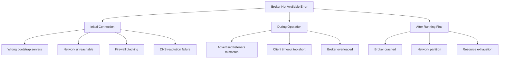
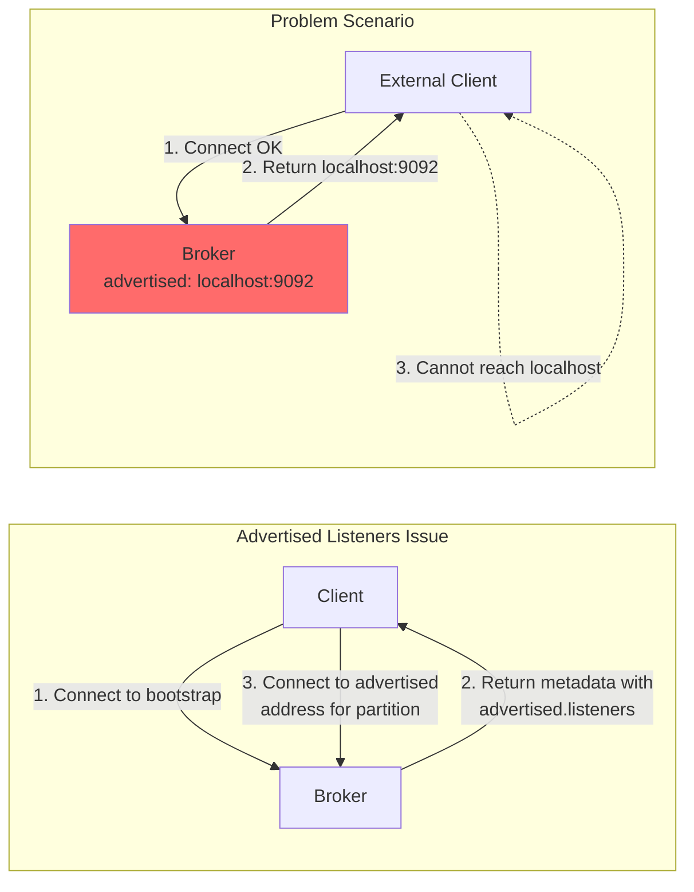
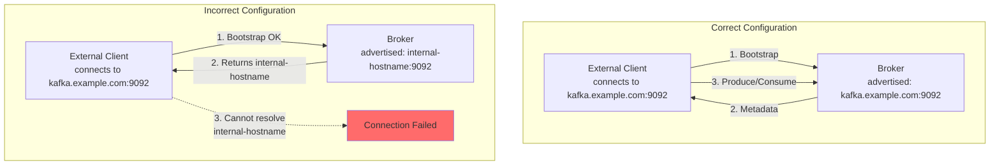
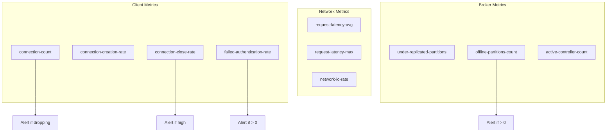
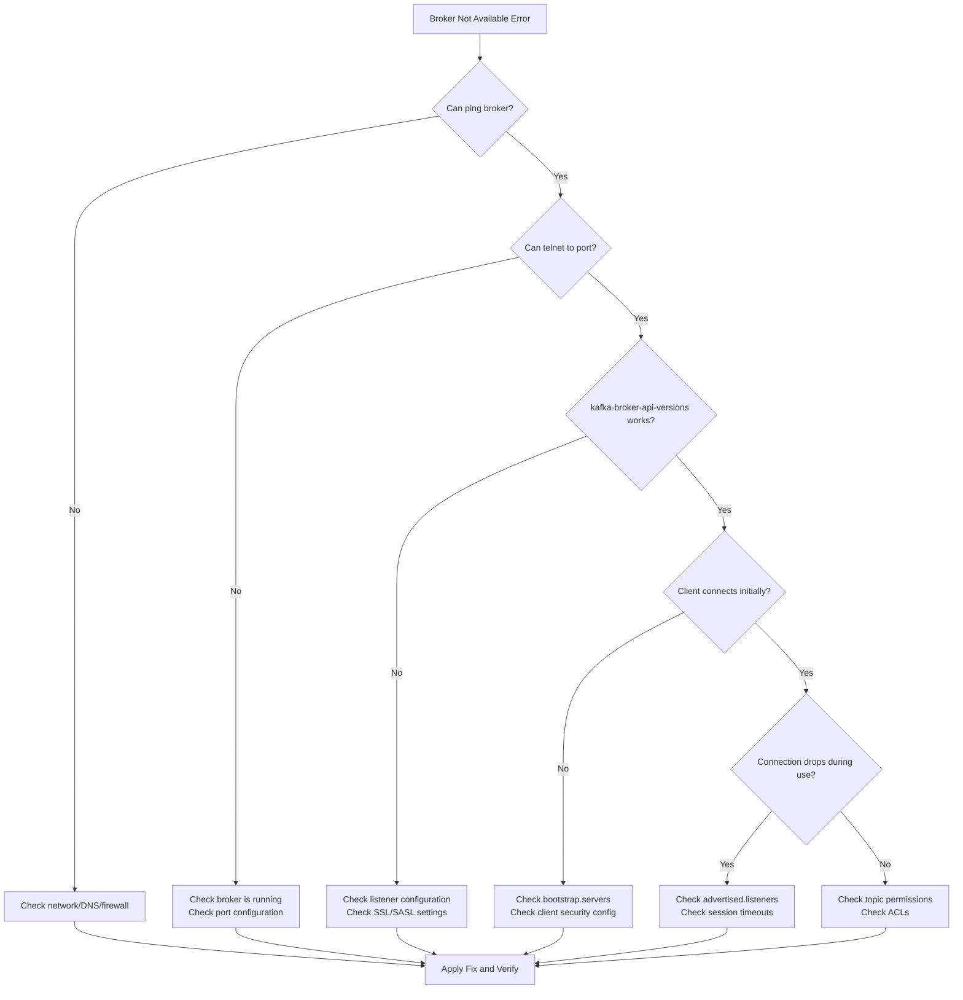

# How to Fix "Broker May Not Be Available" Connection Errors

Author: [nawazdhandala](https://www.github.com/nawazdhandala)

Tags: Kafka, Troubleshooting, Connection Errors, Networking, DevOps, Distributed Systems

Description: A practical guide to diagnosing and resolving "Broker May Not Be Available" connection errors in Apache Kafka, including network troubleshooting, configuration fixes, and preventive measures.

---

## Introduction

The "Broker May Not Be Available" error is one of the most frustrating issues Kafka users encounter. This error typically appears when clients cannot establish or maintain connections to Kafka brokers. The causes range from simple network issues to complex configuration mismatches.

This guide provides a systematic approach to diagnosing and resolving broker availability errors, covering network troubleshooting, configuration validation, and best practices for reliable Kafka connectivity.

## Understanding the Error

### When This Error Occurs

The "Broker May Not Be Available" error can occur in several scenarios:



### Error Message Variations

Different clients report this error differently:

```
# Java client
org.apache.kafka.common.errors.TimeoutException:
  Topic metadata-topic not present in metadata after 60000 ms.

# Python kafka-python
kafka.errors.NoBrokersAvailable: NoBrokersAvailable

# Command line tools
WARN [Producer clientId=console-producer]
  Connection to node -1 could not be established.
  Broker may not be available.

# librdkafka (confluent-kafka-python)
%3|1234567890.123|FAIL|rdkafka#producer-1|
  [thrd:localhost:9092/bootstrap]: localhost:9092/bootstrap:
  Connect to ipv4#127.0.0.1:9092 failed: Connection refused
```

## Diagnostic Steps

### Step 1: Verify Broker Status

First, confirm the broker is actually running.

```bash
# Check if Kafka process is running
ps aux | grep kafka | grep -v grep

# Check Kafka service status (systemd)
systemctl status kafka

# Check broker logs for errors
tail -100 /var/log/kafka/server.log | grep -i "error\|exception\|started"

# For Docker deployments
docker ps | grep kafka
docker logs kafka-container-name --tail 100
```

### Step 2: Test Network Connectivity

Verify basic network connectivity to the broker.

```bash
# Test TCP connection to broker port
nc -zv broker-hostname 9092

# Test with timeout
timeout 5 bash -c 'cat < /dev/null > /dev/tcp/broker-hostname/9092' && \
  echo "Connection successful" || echo "Connection failed"

# Check if port is listening (on broker machine)
netstat -tlnp | grep 9092
# or
ss -tlnp | grep 9092

# Test DNS resolution
nslookup broker-hostname
dig broker-hostname

# Trace route to broker
traceroute broker-hostname
```

### Step 3: Verify Bootstrap Server Configuration

Ensure the bootstrap servers are correctly configured.

```bash
# Test connection using Kafka tools
kafka-broker-api-versions.sh --bootstrap-server localhost:9092

# List brokers in the cluster
kafka-metadata.sh --snapshot /var/kafka-logs/__cluster_metadata-0/00000000000000000000.log \
  --command brokers 2>/dev/null || \
  zookeeper-shell.sh localhost:2181 <<< "ls /brokers/ids"

# Get broker details
kafka-configs.sh --bootstrap-server localhost:9092 \
  --entity-type brokers --describe --all
```

### Step 4: Check Advertised Listeners

The advertised listeners configuration is a common source of connection issues.

```bash
# Check broker's advertised listeners in logs
grep "advertised.listeners" /etc/kafka/server.properties

# Check what listeners the broker is actually using
kafka-configs.sh --bootstrap-server localhost:9092 \
  --entity-type brokers \
  --entity-name 0 \
  --describe | grep listener
```



### Step 5: Check Firewall Rules

Verify that firewalls allow Kafka traffic.

```bash
# Check iptables rules
sudo iptables -L -n | grep 9092

# Check firewalld (RHEL/CentOS)
sudo firewall-cmd --list-all

# Check UFW (Ubuntu)
sudo ufw status verbose

# Check cloud security groups (AWS example)
aws ec2 describe-security-groups --group-ids sg-xxxxxxxx \
  --query 'SecurityGroups[*].IpPermissions[?FromPort==`9092`]'
```

### Step 6: Review Client Configuration

Examine the client configuration for issues.

```python
# Python - Print effective configuration
from kafka import KafkaProducer
import logging

logging.basicConfig(level=logging.DEBUG)

try:
    producer = KafkaProducer(
        bootstrap_servers=['localhost:9092'],
        # Add debug options
        api_version_auto_timeout_ms=10000,
    )
    print("Connection successful")
    print(f"Bootstrap connected: {producer.bootstrap_connected()}")
except Exception as e:
    print(f"Connection failed: {e}")
```

```java
// Java - Enable detailed logging
import org.apache.kafka.clients.producer.*;
import org.apache.kafka.clients.CommonClientConfigs;
import java.util.Properties;

Properties props = new Properties();
props.put("bootstrap.servers", "localhost:9092");

// Enable debug logging
props.put("log.connection.close", "true");

// Set shorter timeout for faster failure detection during testing
props.put(CommonClientConfigs.REQUEST_TIMEOUT_MS_CONFIG, 10000);
props.put(CommonClientConfigs.DEFAULT_API_TIMEOUT_MS_CONFIG, 10000);

try {
    KafkaProducer<String, String> producer = new KafkaProducer<>(props);
    System.out.println("Connection successful");
} catch (Exception e) {
    System.err.println("Connection failed: " + e.getMessage());
    e.printStackTrace();
}
```

## Common Causes and Solutions

### Cause 1: Incorrect Bootstrap Servers

The bootstrap servers address is wrong or unreachable.

```python
# Wrong configuration
producer = KafkaProducer(
    bootstrap_servers=['kafka:9092'],  # Hostname not resolvable
)

# Correct configuration
producer = KafkaProducer(
    bootstrap_servers=['kafka.example.com:9092'],  # Use FQDN
    # Or use IP address
    # bootstrap_servers=['192.168.1.100:9092'],
)

# Multiple bootstrap servers for redundancy
producer = KafkaProducer(
    bootstrap_servers=[
        'kafka1.example.com:9092',
        'kafka2.example.com:9092',
        'kafka3.example.com:9092',
    ],
)
```

### Cause 2: Advertised Listeners Mismatch

The broker's advertised listeners don't match how clients reach it.

```properties
# server.properties - Common configurations

# Scenario 1: Single network (internal only)
listeners=PLAINTEXT://0.0.0.0:9092
advertised.listeners=PLAINTEXT://kafka-broker-1.internal:9092

# Scenario 2: Docker with host networking
listeners=PLAINTEXT://0.0.0.0:9092
advertised.listeners=PLAINTEXT://host.docker.internal:9092

# Scenario 3: Kubernetes with external access
listeners=INTERNAL://0.0.0.0:9092,EXTERNAL://0.0.0.0:9093
advertised.listeners=INTERNAL://kafka-0.kafka-headless:9092,EXTERNAL://kafka.example.com:9093
listener.security.protocol.map=INTERNAL:PLAINTEXT,EXTERNAL:PLAINTEXT
inter.broker.listener.name=INTERNAL

# Scenario 4: Cloud deployment with public IP
listeners=PLAINTEXT://0.0.0.0:9092
advertised.listeners=PLAINTEXT://public-ip-or-dns:9092
```



### Cause 3: Docker Networking Issues

Docker networking requires special configuration.

```yaml
# docker-compose.yml - Correct configuration
version: '3'
services:
  kafka:
    image: confluentinc/cp-kafka:latest
    ports:
      - "9092:9092"
      - "9093:9093"
    environment:
      # Listener configuration for Docker
      KAFKA_LISTENERS: INTERNAL://0.0.0.0:9092,EXTERNAL://0.0.0.0:9093
      KAFKA_ADVERTISED_LISTENERS: INTERNAL://kafka:9092,EXTERNAL://localhost:9093
      KAFKA_LISTENER_SECURITY_PROTOCOL_MAP: INTERNAL:PLAINTEXT,EXTERNAL:PLAINTEXT
      KAFKA_INTER_BROKER_LISTENER_NAME: INTERNAL

      # Other required settings
      KAFKA_BROKER_ID: 1
      KAFKA_ZOOKEEPER_CONNECT: zookeeper:2181
      KAFKA_OFFSETS_TOPIC_REPLICATION_FACTOR: 1
    networks:
      - kafka-network

  # Application in same Docker network
  app:
    build: .
    environment:
      # Use internal listener
      KAFKA_BOOTSTRAP_SERVERS: kafka:9092
    networks:
      - kafka-network

networks:
  kafka-network:
    driver: bridge
```

```python
# Client configuration for Docker

# If running inside Docker network
producer = KafkaProducer(
    bootstrap_servers=['kafka:9092'],  # Use service name
)

# If running on host machine
producer = KafkaProducer(
    bootstrap_servers=['localhost:9093'],  # Use external listener
)
```

### Cause 4: Kubernetes Service Discovery

Kubernetes requires proper service configuration.

```yaml
# kubernetes/kafka-service.yaml
apiVersion: v1
kind: Service
metadata:
  name: kafka-headless
  labels:
    app: kafka
spec:
  ports:
    - port: 9092
      name: internal
  clusterIP: None
  selector:
    app: kafka
---
apiVersion: v1
kind: Service
metadata:
  name: kafka-external
  labels:
    app: kafka
spec:
  type: LoadBalancer
  ports:
    - port: 9093
      name: external
  selector:
    app: kafka
```

```yaml
# kubernetes/kafka-statefulset.yaml (partial)
apiVersion: apps/v1
kind: StatefulSet
metadata:
  name: kafka
spec:
  serviceName: kafka-headless
  template:
    spec:
      containers:
        - name: kafka
          env:
            - name: KAFKA_LISTENERS
              value: "INTERNAL://0.0.0.0:9092,EXTERNAL://0.0.0.0:9093"
            - name: KAFKA_ADVERTISED_LISTENERS
              value: "INTERNAL://$(POD_NAME).kafka-headless:9092,EXTERNAL://$(EXTERNAL_IP):9093"
            - name: POD_NAME
              valueFrom:
                fieldRef:
                  fieldPath: metadata.name
```

```python
# Client configuration for Kubernetes

# Internal client (same cluster)
producer = KafkaProducer(
    bootstrap_servers=[
        'kafka-0.kafka-headless:9092',
        'kafka-1.kafka-headless:9092',
        'kafka-2.kafka-headless:9092',
    ],
)

# External client
producer = KafkaProducer(
    bootstrap_servers=['kafka-external.example.com:9093'],
)
```

### Cause 5: SSL/TLS Configuration Issues

SSL misconfigurations can prevent connections.

```python
# Python SSL configuration
from kafka import KafkaProducer
import ssl

# Create SSL context
ssl_context = ssl.create_default_context()
ssl_context.load_cert_chain(
    certfile='/path/to/client.crt',
    keyfile='/path/to/client.key',
)
ssl_context.load_verify_locations('/path/to/ca.crt')

producer = KafkaProducer(
    bootstrap_servers=['kafka.example.com:9093'],
    security_protocol='SSL',
    ssl_context=ssl_context,
)
```

```java
// Java SSL configuration
Properties props = new Properties();
props.put("bootstrap.servers", "kafka.example.com:9093");
props.put("security.protocol", "SSL");

// SSL configuration
props.put("ssl.truststore.location", "/path/to/truststore.jks");
props.put("ssl.truststore.password", "truststore-password");
props.put("ssl.keystore.location", "/path/to/keystore.jks");
props.put("ssl.keystore.password", "keystore-password");
props.put("ssl.key.password", "key-password");

// For debugging SSL issues
props.put("ssl.endpoint.identification.algorithm", "");  // Disable hostname verification for testing

KafkaProducer<String, String> producer = new KafkaProducer<>(props);
```

```bash
# Debug SSL connection
openssl s_client -connect kafka.example.com:9093 -showcerts

# Verify certificate
openssl x509 -in /path/to/client.crt -text -noout

# Test SSL connection with kafka tools
kafka-console-producer.sh --bootstrap-server kafka.example.com:9093 \
  --producer.config /path/to/ssl.properties \
  --topic test
```

### Cause 6: SASL Authentication Failures

Authentication issues can appear as connection failures.

```python
# Python SASL configuration
from kafka import KafkaProducer

producer = KafkaProducer(
    bootstrap_servers=['kafka.example.com:9093'],
    security_protocol='SASL_SSL',
    sasl_mechanism='PLAIN',
    sasl_plain_username='username',
    sasl_plain_password='password',
    ssl_cafile='/path/to/ca.crt',
)
```

```java
// Java SASL configuration
Properties props = new Properties();
props.put("bootstrap.servers", "kafka.example.com:9093");
props.put("security.protocol", "SASL_SSL");
props.put("sasl.mechanism", "PLAIN");
props.put("sasl.jaas.config",
    "org.apache.kafka.common.security.plain.PlainLoginModule required " +
    "username=\"username\" " +
    "password=\"password\";");

// SSL settings
props.put("ssl.truststore.location", "/path/to/truststore.jks");
props.put("ssl.truststore.password", "password");

KafkaProducer<String, String> producer = new KafkaProducer<>(props);
```

## Implementing Connection Resilience

### Retry Configuration

Configure clients to handle transient connection failures.

```python
from kafka import KafkaProducer
from kafka.errors import KafkaError, NoBrokersAvailable
import time

def create_resilient_producer(bootstrap_servers, max_retries=5):
    """
    Create a Kafka producer with retry logic.
    """
    for attempt in range(max_retries):
        try:
            producer = KafkaProducer(
                bootstrap_servers=bootstrap_servers,

                # Connection settings
                request_timeout_ms=30000,
                api_version_auto_timeout_ms=30000,

                # Retry settings
                retries=10,
                retry_backoff_ms=100,

                # Reconnect settings
                reconnect_backoff_ms=50,
                reconnect_backoff_max_ms=1000,

                # Metadata refresh
                metadata_max_age_ms=300000,
            )

            # Verify connection
            producer.bootstrap_connected()
            print(f"Connected on attempt {attempt + 1}")
            return producer

        except NoBrokersAvailable as e:
            wait_time = min(30, 2 ** attempt)
            print(f"Connection attempt {attempt + 1} failed: {e}")
            print(f"Retrying in {wait_time} seconds...")
            time.sleep(wait_time)

    raise Exception(f"Failed to connect after {max_retries} attempts")


# Usage
producer = create_resilient_producer(['localhost:9092'])
```

```java
// Java resilient producer
import org.apache.kafka.clients.producer.*;
import org.apache.kafka.common.errors.*;
import java.util.Properties;

public class ResilientProducer {

    private static final int MAX_RETRIES = 5;

    public static KafkaProducer<String, String> createProducer(String bootstrapServers) {
        Properties props = new Properties();
        props.put("bootstrap.servers", bootstrapServers);

        // Connection settings
        props.put(ProducerConfig.REQUEST_TIMEOUT_MS_CONFIG, 30000);
        props.put(ProducerConfig.MAX_BLOCK_MS_CONFIG, 60000);

        // Retry settings
        props.put(ProducerConfig.RETRIES_CONFIG, 10);
        props.put(ProducerConfig.RETRY_BACKOFF_MS_CONFIG, 100);

        // Reconnect settings
        props.put("reconnect.backoff.ms", 50);
        props.put("reconnect.backoff.max.ms", 1000);

        // Metadata refresh
        props.put(ProducerConfig.METADATA_MAX_AGE_CONFIG, 300000);

        // Serializers
        props.put(ProducerConfig.KEY_SERIALIZER_CLASS_CONFIG,
            "org.apache.kafka.common.serialization.StringSerializer");
        props.put(ProducerConfig.VALUE_SERIALIZER_CLASS_CONFIG,
            "org.apache.kafka.common.serialization.StringSerializer");

        for (int attempt = 0; attempt < MAX_RETRIES; attempt++) {
            try {
                KafkaProducer<String, String> producer = new KafkaProducer<>(props);

                // Verify connection by requesting metadata
                producer.partitionsFor("__consumer_offsets");
                System.out.println("Connected on attempt " + (attempt + 1));
                return producer;

            } catch (TimeoutException e) {
                int waitTime = (int) Math.min(30, Math.pow(2, attempt));
                System.out.println("Connection attempt " + (attempt + 1) +
                    " failed. Retrying in " + waitTime + " seconds...");
                try {
                    Thread.sleep(waitTime * 1000);
                } catch (InterruptedException ie) {
                    Thread.currentThread().interrupt();
                }
            }
        }

        throw new RuntimeException("Failed to connect after " + MAX_RETRIES + " attempts");
    }
}
```

### Health Check Implementation

Implement health checks to detect broker availability issues early.

```python
from kafka import KafkaAdminClient, KafkaConsumer
from kafka.errors import KafkaError
import json
import time

class KafkaHealthChecker:
    """
    Health checker for Kafka broker connectivity.
    """

    def __init__(self, bootstrap_servers, timeout_ms=10000):
        self.bootstrap_servers = bootstrap_servers
        self.timeout_ms = timeout_ms

    def check_connectivity(self):
        """
        Check if brokers are reachable.
        """
        try:
            admin = KafkaAdminClient(
                bootstrap_servers=self.bootstrap_servers,
                request_timeout_ms=self.timeout_ms,
            )
            cluster = admin.describe_cluster()
            admin.close()

            return {
                'status': 'healthy',
                'brokers': len(cluster['brokers']),
                'controller_id': cluster['controller_id'],
            }

        except KafkaError as e:
            return {
                'status': 'unhealthy',
                'error': str(e),
            }

    def check_broker_details(self):
        """
        Get detailed broker information.
        """
        try:
            admin = KafkaAdminClient(
                bootstrap_servers=self.bootstrap_servers,
                request_timeout_ms=self.timeout_ms,
            )

            cluster = admin.describe_cluster()
            broker_details = []

            for broker in cluster['brokers']:
                broker_details.append({
                    'id': broker.nodeId,
                    'host': broker.host,
                    'port': broker.port,
                    'rack': broker.rack,
                })

            admin.close()

            return {
                'status': 'healthy',
                'brokers': broker_details,
                'controller_id': cluster['controller_id'],
            }

        except KafkaError as e:
            return {
                'status': 'unhealthy',
                'error': str(e),
            }

    def check_topic_access(self, topic):
        """
        Verify ability to access a specific topic.
        """
        try:
            consumer = KafkaConsumer(
                topic,
                bootstrap_servers=self.bootstrap_servers,
                consumer_timeout_ms=self.timeout_ms,
                auto_offset_reset='latest',
            )

            partitions = consumer.partitions_for_topic(topic)
            consumer.close()

            if partitions:
                return {
                    'status': 'healthy',
                    'topic': topic,
                    'partitions': len(partitions),
                }
            else:
                return {
                    'status': 'warning',
                    'topic': topic,
                    'message': 'Topic not found',
                }

        except KafkaError as e:
            return {
                'status': 'unhealthy',
                'topic': topic,
                'error': str(e),
            }

    def full_health_check(self, topics=None):
        """
        Perform comprehensive health check.
        """
        results = {
            'timestamp': time.time(),
            'bootstrap_servers': self.bootstrap_servers,
            'checks': {},
        }

        # Check connectivity
        results['checks']['connectivity'] = self.check_connectivity()

        # Check broker details
        results['checks']['brokers'] = self.check_broker_details()

        # Check topic access if topics provided
        if topics:
            results['checks']['topics'] = {}
            for topic in topics:
                results['checks']['topics'][topic] = self.check_topic_access(topic)

        # Determine overall status
        statuses = [
            results['checks']['connectivity']['status'],
            results['checks']['brokers']['status'],
        ]
        if topics:
            statuses.extend(
                check['status']
                for check in results['checks']['topics'].values()
            )

        if 'unhealthy' in statuses:
            results['overall_status'] = 'unhealthy'
        elif 'warning' in statuses:
            results['overall_status'] = 'warning'
        else:
            results['overall_status'] = 'healthy'

        return results


# Usage example
if __name__ == '__main__':
    checker = KafkaHealthChecker(['localhost:9092'])
    result = checker.full_health_check(topics=['orders', 'events'])
    print(json.dumps(result, indent=2))
```

## Monitoring and Alerting

### Key Metrics to Monitor



### Prometheus Alerting Rules

```yaml
# prometheus-alerts.yaml
groups:
  - name: kafka-connectivity
    rules:
      # Alert when no connections to brokers
      - alert: KafkaNoConnectionsToBrokers
        expr: kafka_producer_connection_count == 0
        for: 2m
        labels:
          severity: critical
        annotations:
          summary: "No connections to Kafka brokers"
          description: "Producer {{ $labels.client_id }} has no active broker connections"

      # Alert on high connection close rate
      - alert: KafkaHighConnectionCloseRate
        expr: rate(kafka_producer_connection_close_total[5m]) > 1
        for: 5m
        labels:
          severity: warning
        annotations:
          summary: "High Kafka connection close rate"
          description: "Connections are being closed at {{ $value }}/sec"

      # Alert on authentication failures
      - alert: KafkaAuthenticationFailures
        expr: rate(kafka_producer_failed_authentication_total[5m]) > 0
        for: 1m
        labels:
          severity: warning
        annotations:
          summary: "Kafka authentication failures"
          description: "Authentication failures occurring at {{ $value }}/sec"

      # Alert on request timeouts
      - alert: KafkaRequestTimeouts
        expr: rate(kafka_producer_request_timeout_total[5m]) > 0.1
        for: 5m
        labels:
          severity: warning
        annotations:
          summary: "Kafka request timeouts"
          description: "Request timeouts at {{ $value }}/sec"

      # Alert on broker unavailability
      - alert: KafkaBrokerOffline
        expr: kafka_controller_kafkacontroller_activecontrollercount != 1
        for: 1m
        labels:
          severity: critical
        annotations:
          summary: "Kafka cluster has no active controller"
          description: "The Kafka cluster may be unavailable"
```

## Troubleshooting Checklist



## Best Practices Summary

### Configuration Checklist

```properties
# server.properties - Broker configuration

# Listener configuration
# Bind to all interfaces
listeners=INTERNAL://0.0.0.0:9092,EXTERNAL://0.0.0.0:9093

# Advertise reachable addresses
advertised.listeners=INTERNAL://broker1.internal:9092,EXTERNAL://broker1.example.com:9093

# Protocol mapping
listener.security.protocol.map=INTERNAL:PLAINTEXT,EXTERNAL:SSL
inter.broker.listener.name=INTERNAL

# Connection settings
connections.max.idle.ms=600000
socket.connection.setup.timeout.ms=10000
socket.connection.setup.timeout.max.ms=30000
```

```python
# Client configuration best practices
producer_config = {
    # Multiple bootstrap servers for redundancy
    'bootstrap_servers': [
        'broker1.example.com:9092',
        'broker2.example.com:9092',
        'broker3.example.com:9092',
    ],

    # Connection timeouts
    'request_timeout_ms': 30000,
    'api_version_auto_timeout_ms': 30000,

    # Reconnection settings
    'reconnect_backoff_ms': 50,
    'reconnect_backoff_max_ms': 1000,

    # Retry settings
    'retries': 10,
    'retry_backoff_ms': 100,

    # Metadata refresh
    'metadata_max_age_ms': 300000,

    # Delivery guarantees
    'acks': 'all',
    'enable_idempotence': True,
}
```

## Conclusion

The "Broker May Not Be Available" error can stem from various causes, from simple network issues to complex configuration mismatches. By following a systematic diagnostic approach and implementing proper resilience patterns, you can minimize the impact of connectivity issues.

Key takeaways:

- Always verify network connectivity first using basic tools (ping, telnet, nc)
- Pay special attention to advertised.listeners configuration, especially in containerized environments
- Use multiple bootstrap servers for redundancy
- Implement connection retry logic with exponential backoff
- Set up monitoring and alerting for connection metrics
- Use health checks to detect issues before they impact applications

With these practices in place, your Kafka clients will handle broker availability issues gracefully and recover automatically when possible.
