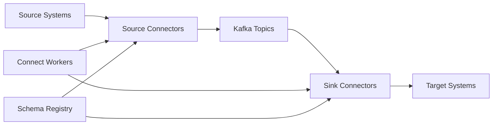
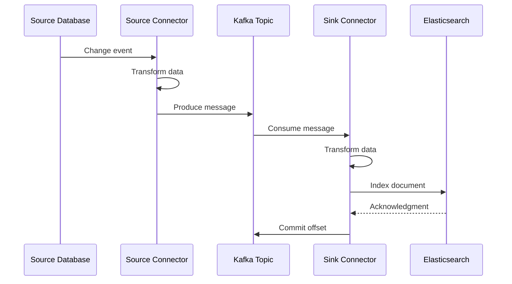

# How to Configure Kafka Connect Connectors

Author: [nawazdhandala](https://www.github.com/nawazdhandala)

Tags: Kafka, Kafka Connect, Data Integration, Connectors, ETL, Streaming

Description: Learn how to configure Kafka Connect connectors for data integration, including source and sink connectors, transformations, and production best practices.

---

Kafka Connect is a powerful framework for streaming data between Apache Kafka and external systems. It provides a scalable and reliable way to move large amounts of data without writing custom integration code. This guide covers practical configuration for common connector scenarios.

---

## Kafka Connect Architecture



---

## Setting Up Kafka Connect

### Distributed Mode Configuration

```properties
# connect-distributed.properties

# Kafka cluster connection
bootstrap.servers=kafka-1:9092,kafka-2:9092,kafka-3:9092

# Connect cluster identity
group.id=connect-cluster

# Converter settings for key and value
key.converter=io.confluent.connect.avro.AvroConverter
key.converter.schema.registry.url=http://schema-registry:8081
value.converter=io.confluent.connect.avro.AvroConverter
value.converter.schema.registry.url=http://schema-registry:8081

# Internal topic settings
config.storage.topic=connect-configs
config.storage.replication.factor=3
offset.storage.topic=connect-offsets
offset.storage.replication.factor=3
offset.storage.partitions=25
status.storage.topic=connect-status
status.storage.replication.factor=3
status.storage.partitions=5

# Flush settings
offset.flush.interval.ms=10000

# REST API settings
rest.host.name=0.0.0.0
rest.port=8083

# Plugin path for connectors
plugin.path=/usr/share/java,/usr/share/confluent-hub-components
```

---

## Source Connector: PostgreSQL to Kafka

### Debezium PostgreSQL Connector

```json
{
  "name": "postgres-source-connector",
  "config": {
    "connector.class": "io.debezium.connector.postgresql.PostgresConnector",
    "tasks.max": "1",

    "database.hostname": "postgres.example.com",
    "database.port": "5432",
    "database.user": "debezium",
    "database.password": "${file:/secrets/postgres:password}",
    "database.dbname": "myapp",
    "database.server.name": "myapp-db",

    "schema.include.list": "public",
    "table.include.list": "public.users,public.orders,public.products",

    "plugin.name": "pgoutput",
    "publication.name": "dbz_publication",
    "slot.name": "debezium_slot",

    "topic.prefix": "myapp",
    "topic.creation.enable": "true",
    "topic.creation.default.replication.factor": "3",
    "topic.creation.default.partitions": "6",

    "snapshot.mode": "initial",
    "decimal.handling.mode": "precise",
    "time.precision.mode": "adaptive_time_microseconds",

    "heartbeat.interval.ms": "10000",
    "heartbeat.topics.prefix": "__debezium-heartbeat",

    "transforms": "unwrap,route",
    "transforms.unwrap.type": "io.debezium.transforms.ExtractNewRecordState",
    "transforms.unwrap.drop.tombstones": "false",
    "transforms.unwrap.delete.handling.mode": "rewrite",
    "transforms.route.type": "org.apache.kafka.connect.transforms.RegexRouter",
    "transforms.route.regex": "myapp\\.public\\.(.*)",
    "transforms.route.replacement": "db.$1"
  }
}
```

---

## Source Connector: JDBC for Batch Ingestion

```json
{
  "name": "jdbc-source-connector",
  "config": {
    "connector.class": "io.confluent.connect.jdbc.JdbcSourceConnector",
    "tasks.max": "4",

    "connection.url": "jdbc:mysql://mysql.example.com:3306/analytics",
    "connection.user": "kafka_connect",
    "connection.password": "${file:/secrets/mysql:password}",

    "mode": "timestamp+incrementing",
    "incrementing.column.name": "id",
    "timestamp.column.name": "updated_at",

    "table.whitelist": "events,metrics,logs",
    "catalog.pattern": "analytics",

    "topic.prefix": "jdbc-",
    "poll.interval.ms": "5000",
    "batch.max.rows": "1000",

    "validate.non.null": "false",
    "numeric.mapping": "best_fit",
    "db.timezone": "UTC",

    "transforms": "createKey,extractInt",
    "transforms.createKey.type": "org.apache.kafka.connect.transforms.ValueToKey",
    "transforms.createKey.fields": "id",
    "transforms.extractInt.type": "org.apache.kafka.connect.transforms.ExtractField$Key",
    "transforms.extractInt.field": "id"
  }
}
```

---

## Sink Connector: Kafka to Elasticsearch

```json
{
  "name": "elasticsearch-sink-connector",
  "config": {
    "connector.class": "io.confluent.connect.elasticsearch.ElasticsearchSinkConnector",
    "tasks.max": "3",

    "topics": "db.users,db.orders,db.products",

    "connection.url": "https://elasticsearch.example.com:9200",
    "connection.username": "elastic",
    "connection.password": "${file:/secrets/elastic:password}",

    "type.name": "_doc",
    "key.ignore": "false",
    "schema.ignore": "false",

    "write.method": "upsert",
    "behavior.on.null.values": "delete",

    "batch.size": "2000",
    "max.buffered.records": "20000",
    "flush.timeout.ms": "120000",
    "linger.ms": "1000",

    "max.retries": "5",
    "retry.backoff.ms": "1000",

    "transforms": "topicIndex",
    "transforms.topicIndex.type": "org.apache.kafka.connect.transforms.RegexRouter",
    "transforms.topicIndex.regex": "db\\.(.*)",
    "transforms.topicIndex.replacement": "$1-index",

    "errors.tolerance": "all",
    "errors.log.enable": "true",
    "errors.log.include.messages": "true",
    "errors.deadletterqueue.topic.name": "dlq-elasticsearch",
    "errors.deadletterqueue.topic.replication.factor": "3"
  }
}
```

---

## Connector Data Flow



---

## Sink Connector: Kafka to S3

```json
{
  "name": "s3-sink-connector",
  "config": {
    "connector.class": "io.confluent.connect.s3.S3SinkConnector",
    "tasks.max": "6",

    "topics": "events,metrics,logs",

    "s3.region": "us-east-1",
    "s3.bucket.name": "data-lake-raw",
    "aws.access.key.id": "${file:/secrets/aws:access_key}",
    "aws.secret.access.key": "${file:/secrets/aws:secret_key}",

    "topics.dir": "kafka-connect",
    "path.format": "'year'=YYYY/'month'=MM/'day'=dd/'hour'=HH",
    "partition.duration.ms": "3600000",

    "format.class": "io.confluent.connect.s3.format.parquet.ParquetFormat",
    "parquet.codec": "snappy",

    "flush.size": "10000",
    "rotate.interval.ms": "600000",
    "rotate.schedule.interval.ms": "3600000",

    "storage.class": "io.confluent.connect.s3.storage.S3Storage",
    "schema.compatibility": "NONE",

    "locale": "en-US",
    "timezone": "UTC",

    "behavior.on.null.values": "ignore",

    "transforms": "addTimestamp",
    "transforms.addTimestamp.type": "org.apache.kafka.connect.transforms.InsertField$Value",
    "transforms.addTimestamp.timestamp.field": "kafka_timestamp"
  }
}
```

---

## Single Message Transforms (SMTs)

### Common Transformations

```json
{
  "name": "connector-with-transforms",
  "config": {
    "connector.class": "...",

    "transforms": "filter,mask,rename,addField,flatten,route",

    "transforms.filter.type": "org.apache.kafka.connect.transforms.Filter",
    "transforms.filter.predicate": "isActive",
    "predicates": "isActive",
    "predicates.isActive.type": "org.apache.kafka.connect.transforms.predicates.RecordIsTombstone",
    "predicates.isActive.negate": "true",

    "transforms.mask.type": "org.apache.kafka.connect.transforms.MaskField$Value",
    "transforms.mask.fields": "credit_card,ssn,password",
    "transforms.mask.replacement": "****",

    "transforms.rename.type": "org.apache.kafka.connect.transforms.ReplaceField$Value",
    "transforms.rename.renames": "old_name:new_name,created:created_at",

    "transforms.addField.type": "org.apache.kafka.connect.transforms.InsertField$Value",
    "transforms.addField.static.field": "source",
    "transforms.addField.static.value": "kafka-connect",

    "transforms.flatten.type": "org.apache.kafka.connect.transforms.Flatten$Value",
    "transforms.flatten.delimiter": "_",

    "transforms.route.type": "org.apache.kafka.connect.transforms.RegexRouter",
    "transforms.route.regex": "(.*)",
    "transforms.route.replacement": "processed-$1"
  }
}
```

---

## Managing Connectors via REST API

```bash
# List all connectors
curl -X GET http://connect:8083/connectors

# Get connector status
curl -X GET http://connect:8083/connectors/postgres-source-connector/status

# Get connector configuration
curl -X GET http://connect:8083/connectors/postgres-source-connector/config

# Create a new connector
curl -X POST http://connect:8083/connectors \
  -H "Content-Type: application/json" \
  -d @connector-config.json

# Update connector configuration
curl -X PUT http://connect:8083/connectors/postgres-source-connector/config \
  -H "Content-Type: application/json" \
  -d @updated-config.json

# Pause a connector
curl -X PUT http://connect:8083/connectors/postgres-source-connector/pause

# Resume a connector
curl -X PUT http://connect:8083/connectors/postgres-source-connector/resume

# Restart a connector
curl -X POST http://connect:8083/connectors/postgres-source-connector/restart

# Restart a specific task
curl -X POST http://connect:8083/connectors/postgres-source-connector/tasks/0/restart

# Delete a connector
curl -X DELETE http://connect:8083/connectors/postgres-source-connector

# Validate connector config without creating
curl -X PUT http://connect:8083/connector-plugins/io.debezium.connector.postgresql.PostgresConnector/config/validate \
  -H "Content-Type: application/json" \
  -d @connector-config.json
```

---

## Python Connector Management

```python
# kafka_connect_manager.py

import requests
import json
from typing import Dict, List, Optional

class KafkaConnectManager:
    """Manage Kafka Connect connectors programmatically."""

    def __init__(self, connect_url: str):
        self.base_url = connect_url.rstrip('/')

    def list_connectors(self) -> List[str]:
        """List all connector names."""
        response = requests.get(f"{self.base_url}/connectors")
        response.raise_for_status()
        return response.json()

    def get_connector_status(self, name: str) -> Dict:
        """Get detailed status of a connector."""
        response = requests.get(f"{self.base_url}/connectors/{name}/status")
        response.raise_for_status()
        return response.json()

    def create_connector(self, config: Dict) -> Dict:
        """Create a new connector."""
        response = requests.post(
            f"{self.base_url}/connectors",
            headers={"Content-Type": "application/json"},
            json=config
        )
        response.raise_for_status()
        return response.json()

    def update_connector(self, name: str, config: Dict) -> Dict:
        """Update an existing connector configuration."""
        response = requests.put(
            f"{self.base_url}/connectors/{name}/config",
            headers={"Content-Type": "application/json"},
            json=config
        )
        response.raise_for_status()
        return response.json()

    def delete_connector(self, name: str) -> bool:
        """Delete a connector."""
        response = requests.delete(f"{self.base_url}/connectors/{name}")
        return response.status_code == 204

    def restart_connector(self, name: str, include_tasks: bool = True) -> bool:
        """Restart a connector and optionally its tasks."""
        params = {"includeTasks": str(include_tasks).lower()}
        response = requests.post(
            f"{self.base_url}/connectors/{name}/restart",
            params=params
        )
        return response.status_code in [200, 204]

    def get_failed_connectors(self) -> List[Dict]:
        """Get all connectors in FAILED state."""
        failed = []
        for name in self.list_connectors():
            status = self.get_connector_status(name)

            # Check connector state
            if status['connector']['state'] == 'FAILED':
                failed.append({
                    'name': name,
                    'type': 'connector',
                    'trace': status['connector'].get('trace', '')
                })

            # Check task states
            for task in status.get('tasks', []):
                if task['state'] == 'FAILED':
                    failed.append({
                        'name': name,
                        'task_id': task['id'],
                        'type': 'task',
                        'trace': task.get('trace', '')
                    })

        return failed

    def wait_for_healthy(self, name: str, timeout: int = 60) -> bool:
        """Wait for a connector to become healthy."""
        import time
        start = time.time()

        while time.time() - start < timeout:
            try:
                status = self.get_connector_status(name)
                connector_running = status['connector']['state'] == 'RUNNING'
                tasks_running = all(
                    t['state'] == 'RUNNING'
                    for t in status.get('tasks', [])
                )

                if connector_running and tasks_running:
                    return True
            except Exception:
                pass

            time.sleep(2)

        return False


# Usage example
if __name__ == "__main__":
    manager = KafkaConnectManager("http://localhost:8083")

    # Check for failed connectors
    failed = manager.get_failed_connectors()
    for f in failed:
        print(f"Failed: {f['name']} - {f['type']}")

        # Attempt restart
        if manager.restart_connector(f['name']):
            print(f"Restarted {f['name']}")
```

---

## Error Handling Configuration

```json
{
  "name": "resilient-sink-connector",
  "config": {
    "connector.class": "...",

    "errors.tolerance": "all",
    "errors.retry.timeout": "300000",
    "errors.retry.delay.max.ms": "60000",

    "errors.log.enable": "true",
    "errors.log.include.messages": "true",

    "errors.deadletterqueue.topic.name": "dlq-sink-errors",
    "errors.deadletterqueue.topic.replication.factor": "3",
    "errors.deadletterqueue.context.headers.enable": "true",

    "consumer.override.max.poll.interval.ms": "600000",
    "consumer.override.session.timeout.ms": "30000",

    "producer.override.retries": "10",
    "producer.override.retry.backoff.ms": "500"
  }
}
```

---

## Best Practices

1. **Use distributed mode** - Always run Kafka Connect in distributed mode for production

2. **Externalize secrets** - Use config providers to avoid storing passwords in configs

3. **Set appropriate tasks.max** - Scale based on partitions and downstream system capacity

4. **Enable dead letter queues** - Capture failed records instead of blocking the pipeline

5. **Monitor connector lag** - Track consumer lag and connector health metrics

6. **Test transforms** - Validate SMTs in a staging environment before production

7. **Use schema registry** - Enable schema evolution and compatibility checking

8. **Configure retries** - Set appropriate retry policies for transient failures

---

*Running Kafka Connect in production? [OneUptime](https://oneuptime.com) helps you monitor connector health, track pipeline lag, and alert on failures before data is lost.*
