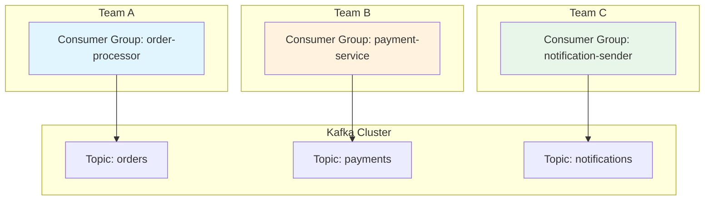
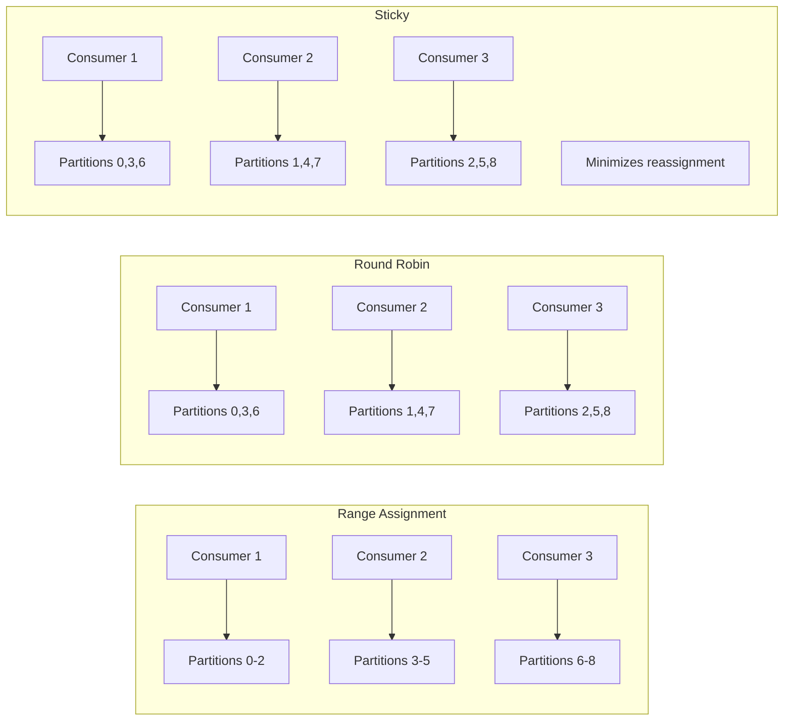

# How to Configure Kafka Consumer Group Isolation

Author: [nawazdhandala](https://github.com/nawazdhandala)

Tags: Apache Kafka, Consumer Groups, Isolation, Distributed Systems, DevOps, Streaming

Description: Learn how to configure Kafka consumer group isolation to prevent resource contention and ensure reliable message processing across multiple applications.

---

Consumer group isolation in Kafka ensures that different applications or teams can consume from the same topics without interfering with each other. Without proper isolation, one misbehaving consumer can affect others, leading to lag, rebalancing storms, and degraded performance. This guide covers practical strategies for achieving robust consumer group isolation.

## Why Consumer Group Isolation Matters

When multiple applications share a Kafka cluster, they compete for resources. A consumer that processes messages slowly or crashes frequently can trigger rebalances that affect other consumers. Isolation prevents these cascading failures.



## Consumer Group Naming Conventions

A consistent naming convention helps identify which team owns a consumer group and makes monitoring easier. Include the team name, application name, and environment in the group ID.

```java
// Naming pattern: {team}-{application}-{environment}-{purpose}
// Examples:
// - payments-processor-prod-orders
// - analytics-aggregator-staging-events
// - notifications-sender-prod-alerts

public class ConsumerGroupConfig {

    // Build a consistent consumer group ID
    public static String buildGroupId(String team, String application,
                                       String environment, String purpose) {
        return String.format("%s-%s-%s-%s", team, application, environment, purpose);
    }

    public static Properties createConsumerConfig(String groupId) {
        Properties props = new Properties();

        // Unique group ID for isolation
        props.put(ConsumerConfig.GROUP_ID_CONFIG, groupId);

        // Instance ID for static membership (prevents unnecessary rebalances)
        props.put(ConsumerConfig.GROUP_INSTANCE_ID_CONFIG,
            groupId + "-" + getHostname());

        props.put(ConsumerConfig.BOOTSTRAP_SERVERS_CONFIG, "kafka:9092");
        props.put(ConsumerConfig.KEY_DESERIALIZER_CLASS_CONFIG,
            StringDeserializer.class.getName());
        props.put(ConsumerConfig.VALUE_DESERIALIZER_CLASS_CONFIG,
            StringDeserializer.class.getName());

        return props;
    }

    private static String getHostname() {
        try {
            return InetAddress.getLocalHost().getHostName();
        } catch (UnknownHostException e) {
            return UUID.randomUUID().toString().substring(0, 8);
        }
    }
}
```

## Static Group Membership

Static membership prevents unnecessary rebalances when consumers temporarily disconnect. Each consumer gets a persistent identity, so Kafka waits before reassigning partitions.

```java
// Static membership configuration
// Prevents rebalances during brief disconnections (deployments, restarts)
public class StaticMembershipConsumer {

    public static KafkaConsumer<String, String> createConsumer(
            String groupId, String instanceId) {

        Properties props = new Properties();
        props.put(ConsumerConfig.BOOTSTRAP_SERVERS_CONFIG, "kafka:9092");
        props.put(ConsumerConfig.GROUP_ID_CONFIG, groupId);

        // Static membership: consumer keeps its identity across restarts
        // Kafka waits session.timeout.ms before reassigning partitions
        props.put(ConsumerConfig.GROUP_INSTANCE_ID_CONFIG, instanceId);

        // How long to wait before considering a static member dead
        // Set higher than typical deployment time
        props.put(ConsumerConfig.SESSION_TIMEOUT_MS_CONFIG, 300000); // 5 minutes

        // Heartbeat interval (must be less than session timeout)
        props.put(ConsumerConfig.HEARTBEAT_INTERVAL_MS_CONFIG, 10000); // 10 seconds

        props.put(ConsumerConfig.KEY_DESERIALIZER_CLASS_CONFIG,
            StringDeserializer.class.getName());
        props.put(ConsumerConfig.VALUE_DESERIALIZER_CLASS_CONFIG,
            StringDeserializer.class.getName());

        return new KafkaConsumer<>(props);
    }
}
```

## Partition Assignment Strategies

Different assignment strategies affect how partitions are distributed among consumers. Choose based on your isolation requirements.



```java
// Configure partition assignment strategy
public class PartitionAssignmentConfig {

    public static Properties createConfigWithStrategy(String strategy) {
        Properties props = new Properties();
        props.put(ConsumerConfig.BOOTSTRAP_SERVERS_CONFIG, "kafka:9092");

        // Choose assignment strategy based on needs:
        // - RangeAssignor: Good for topic-based isolation
        // - RoundRobinAssignor: Even distribution across topics
        // - StickyAssignor: Minimizes partition movement during rebalance
        // - CooperativeStickyAssignor: Incremental rebalancing (recommended)

        switch (strategy) {
            case "range":
                props.put(ConsumerConfig.PARTITION_ASSIGNMENT_STRATEGY_CONFIG,
                    RangeAssignor.class.getName());
                break;
            case "roundrobin":
                props.put(ConsumerConfig.PARTITION_ASSIGNMENT_STRATEGY_CONFIG,
                    RoundRobinAssignor.class.getName());
                break;
            case "sticky":
                props.put(ConsumerConfig.PARTITION_ASSIGNMENT_STRATEGY_CONFIG,
                    StickyAssignor.class.getName());
                break;
            case "cooperative":
                // Recommended: allows incremental rebalancing
                props.put(ConsumerConfig.PARTITION_ASSIGNMENT_STRATEGY_CONFIG,
                    CooperativeStickyAssignor.class.getName());
                break;
            default:
                props.put(ConsumerConfig.PARTITION_ASSIGNMENT_STRATEGY_CONFIG,
                    CooperativeStickyAssignor.class.getName());
        }

        return props;
    }
}
```

## Isolating Consumer Groups with ACLs

Access Control Lists (ACLs) provide security-level isolation. Each consumer group can only access specific topics and operations.

```bash
#!/bin/bash
# Create ACLs for consumer group isolation

# Variables
BOOTSTRAP="kafka:9092"
TEAM="payments"
GROUP="payments-processor-prod"
TOPIC="payment-events"

# Grant read access to topic
kafka-acls.sh --bootstrap-server $BOOTSTRAP \
    --add \
    --allow-principal User:$TEAM \
    --operation Read \
    --topic $TOPIC

# Grant read access to consumer group (required for commits)
kafka-acls.sh --bootstrap-server $BOOTSTRAP \
    --add \
    --allow-principal User:$TEAM \
    --operation Read \
    --group $GROUP

# Grant describe access (required for group coordination)
kafka-acls.sh --bootstrap-server $BOOTSTRAP \
    --add \
    --allow-principal User:$TEAM \
    --operation Describe \
    --group $GROUP

# List ACLs for verification
kafka-acls.sh --bootstrap-server $BOOTSTRAP \
    --list \
    --principal User:$TEAM
```

## Session and Rebalance Timeout Configuration

Proper timeout configuration prevents unnecessary rebalances while ensuring failed consumers are detected promptly.

```java
// Timeout configuration for different scenarios
public class TimeoutConfiguration {

    // For stable, long-running consumers
    public static Properties stableConsumerConfig() {
        Properties props = new Properties();
        props.put(ConsumerConfig.BOOTSTRAP_SERVERS_CONFIG, "kafka:9092");

        // Session timeout: how long before broker considers consumer dead
        // Longer timeout = fewer false-positive rebalances
        props.put(ConsumerConfig.SESSION_TIMEOUT_MS_CONFIG, 45000); // 45 seconds

        // Heartbeat interval: frequency of heartbeats to coordinator
        // Should be 1/3 of session timeout
        props.put(ConsumerConfig.HEARTBEAT_INTERVAL_MS_CONFIG, 15000); // 15 seconds

        // Max poll interval: max time between poll() calls
        // Set based on your processing time
        props.put(ConsumerConfig.MAX_POLL_INTERVAL_MS_CONFIG, 300000); // 5 minutes

        // Max records per poll: limits processing time per batch
        props.put(ConsumerConfig.MAX_POLL_RECORDS_CONFIG, 500);

        return props;
    }

    // For consumers with variable processing time
    public static Properties variableProcessingConfig() {
        Properties props = new Properties();
        props.put(ConsumerConfig.BOOTSTRAP_SERVERS_CONFIG, "kafka:9092");

        // Higher max poll interval for variable workloads
        props.put(ConsumerConfig.MAX_POLL_INTERVAL_MS_CONFIG, 600000); // 10 minutes

        // Smaller batches to avoid timeout
        props.put(ConsumerConfig.MAX_POLL_RECORDS_CONFIG, 100);

        // Standard session timeout
        props.put(ConsumerConfig.SESSION_TIMEOUT_MS_CONFIG, 30000);
        props.put(ConsumerConfig.HEARTBEAT_INTERVAL_MS_CONFIG, 10000);

        return props;
    }
}
```

## Rebalance Listener for Graceful Handling

Implement a rebalance listener to handle partition assignments and revocations gracefully. This prevents message loss during consumer group changes.

```java
// Rebalance listener for graceful partition handling
public class IsolatedConsumerRebalanceListener implements ConsumerRebalanceListener {

    private final KafkaConsumer<String, String> consumer;
    private final Map<TopicPartition, OffsetAndMetadata> pendingOffsets;
    private final AtomicBoolean processing;

    public IsolatedConsumerRebalanceListener(
            KafkaConsumer<String, String> consumer,
            Map<TopicPartition, OffsetAndMetadata> pendingOffsets,
            AtomicBoolean processing) {
        this.consumer = consumer;
        this.pendingOffsets = pendingOffsets;
        this.processing = processing;
    }

    @Override
    public void onPartitionsRevoked(Collection<TopicPartition> partitions) {
        // Called before rebalance starts
        // Commit any pending offsets to avoid reprocessing

        System.out.println("Partitions being revoked: " + partitions);

        // Signal processing to stop
        processing.set(false);

        // Commit pending offsets synchronously
        if (!pendingOffsets.isEmpty()) {
            try {
                consumer.commitSync(pendingOffsets);
                System.out.println("Committed offsets before rebalance: " + pendingOffsets);
                pendingOffsets.clear();
            } catch (CommitFailedException e) {
                System.err.println("Failed to commit offsets: " + e.getMessage());
            }
        }
    }

    @Override
    public void onPartitionsAssigned(Collection<TopicPartition> partitions) {
        // Called after rebalance completes
        // Initialize state for new partitions

        System.out.println("Partitions assigned: " + partitions);

        // Resume processing
        processing.set(true);

        // Optionally seek to specific offsets
        for (TopicPartition partition : partitions) {
            // Get committed offset for this partition
            OffsetAndMetadata committed = consumer.committed(
                Collections.singleton(partition)).get(partition);

            if (committed != null) {
                System.out.println("Partition " + partition +
                    " starting from offset " + committed.offset());
            } else {
                System.out.println("Partition " + partition +
                    " starting from auto.offset.reset position");
            }
        }
    }

    @Override
    public void onPartitionsLost(Collection<TopicPartition> partitions) {
        // Called when partitions are lost unexpectedly (not graceful revocation)
        // Do not commit offsets here as another consumer may have them

        System.out.println("Partitions lost: " + partitions);
        processing.set(false);

        // Clear pending offsets for lost partitions
        partitions.forEach(pendingOffsets::remove);
    }
}
```

## Multi-Tenant Consumer Configuration

For multi-tenant scenarios, configure separate consumer groups with resource limits to prevent one tenant from affecting others.

```java
// Multi-tenant consumer factory with isolation
public class MultiTenantConsumerFactory {

    private final String bootstrapServers;
    private final Map<String, RateLimiter> tenantRateLimiters;

    public MultiTenantConsumerFactory(String bootstrapServers) {
        this.bootstrapServers = bootstrapServers;
        this.tenantRateLimiters = new ConcurrentHashMap<>();
    }

    // Create isolated consumer for a specific tenant
    public KafkaConsumer<String, String> createTenantConsumer(
            String tenantId, TenantConfig config) {

        Properties props = new Properties();
        props.put(ConsumerConfig.BOOTSTRAP_SERVERS_CONFIG, bootstrapServers);

        // Tenant-specific group ID
        props.put(ConsumerConfig.GROUP_ID_CONFIG,
            "tenant-" + tenantId + "-" + config.getApplicationName());

        // Static membership for stability
        props.put(ConsumerConfig.GROUP_INSTANCE_ID_CONFIG,
            "tenant-" + tenantId + "-" + getInstanceId());

        // Limit fetch size per tenant to prevent resource hogging
        props.put(ConsumerConfig.FETCH_MAX_BYTES_CONFIG,
            config.getMaxFetchBytes()); // e.g., 10MB for small tenants

        // Limit records per poll
        props.put(ConsumerConfig.MAX_POLL_RECORDS_CONFIG,
            config.getMaxPollRecords()); // e.g., 100 for small tenants

        // Tenant-specific timeouts
        props.put(ConsumerConfig.MAX_POLL_INTERVAL_MS_CONFIG,
            config.getMaxPollIntervalMs());

        props.put(ConsumerConfig.KEY_DESERIALIZER_CLASS_CONFIG,
            StringDeserializer.class.getName());
        props.put(ConsumerConfig.VALUE_DESERIALIZER_CLASS_CONFIG,
            StringDeserializer.class.getName());

        // Create rate limiter for this tenant
        tenantRateLimiters.put(tenantId,
            RateLimiter.create(config.getMessagesPerSecond()));

        return new KafkaConsumer<>(props);
    }

    // Rate-limited consume for tenant isolation
    public ConsumerRecords<String, String> consumeWithRateLimit(
            String tenantId,
            KafkaConsumer<String, String> consumer,
            Duration timeout) {

        RateLimiter limiter = tenantRateLimiters.get(tenantId);
        if (limiter != null) {
            limiter.acquire();
        }

        return consumer.poll(timeout);
    }

    private String getInstanceId() {
        return UUID.randomUUID().toString().substring(0, 8);
    }
}

// Tenant configuration
class TenantConfig {
    private String applicationName;
    private int maxFetchBytes = 10485760; // 10MB default
    private int maxPollRecords = 500;
    private int maxPollIntervalMs = 300000;
    private double messagesPerSecond = 1000.0;

    // Getters and setters
    public String getApplicationName() { return applicationName; }
    public void setApplicationName(String name) { this.applicationName = name; }
    public int getMaxFetchBytes() { return maxFetchBytes; }
    public void setMaxFetchBytes(int bytes) { this.maxFetchBytes = bytes; }
    public int getMaxPollRecords() { return maxPollRecords; }
    public void setMaxPollRecords(int records) { this.maxPollRecords = records; }
    public int getMaxPollIntervalMs() { return maxPollIntervalMs; }
    public void setMaxPollIntervalMs(int ms) { this.maxPollIntervalMs = ms; }
    public double getMessagesPerSecond() { return messagesPerSecond; }
    public void setMessagesPerSecond(double mps) { this.messagesPerSecond = mps; }
}
```

## Monitoring Consumer Group Isolation

Monitor consumer group metrics to detect isolation issues before they cause problems.

```java
// Consumer group monitoring with JMX metrics
public class ConsumerGroupMonitor {

    private final AdminClient adminClient;
    private final MeterRegistry meterRegistry;

    public ConsumerGroupMonitor(String bootstrapServers, MeterRegistry meterRegistry) {
        Properties props = new Properties();
        props.put(AdminClientConfig.BOOTSTRAP_SERVERS_CONFIG, bootstrapServers);
        this.adminClient = AdminClient.create(props);
        this.meterRegistry = meterRegistry;
    }

    // Check consumer group health and record metrics
    public void monitorConsumerGroup(String groupId) {
        try {
            // Get consumer group description
            DescribeConsumerGroupsResult result = adminClient.describeConsumerGroups(
                Collections.singletonList(groupId));

            ConsumerGroupDescription description = result.describedGroups()
                .get(groupId).get();

            // Record metrics
            meterRegistry.gauge("kafka.consumer.group.members",
                Tags.of("group", groupId),
                description.members().size());

            meterRegistry.gauge("kafka.consumer.group.state",
                Tags.of("group", groupId, "state", description.state().toString()),
                description.state() == ConsumerGroupState.STABLE ? 1 : 0);

            // Check for rebalancing
            if (description.state() == ConsumerGroupState.PREPARING_REBALANCE ||
                description.state() == ConsumerGroupState.COMPLETING_REBALANCE) {
                System.out.println("WARNING: Consumer group " + groupId +
                    " is rebalancing");
            }

            // Get lag for each partition
            ListConsumerGroupOffsetsResult offsetsResult =
                adminClient.listConsumerGroupOffsets(groupId);

            Map<TopicPartition, OffsetAndMetadata> offsets =
                offsetsResult.partitionsToOffsetAndMetadata().get();

            for (Map.Entry<TopicPartition, OffsetAndMetadata> entry : offsets.entrySet()) {
                TopicPartition partition = entry.getKey();
                long committedOffset = entry.getValue().offset();

                // Get end offset to calculate lag
                Map<TopicPartition, ListOffsetsResult.ListOffsetsResultInfo> endOffsets =
                    adminClient.listOffsets(Collections.singletonMap(
                        partition, OffsetSpec.latest())).all().get();

                long endOffset = endOffsets.get(partition).offset();
                long lag = endOffset - committedOffset;

                meterRegistry.gauge("kafka.consumer.group.lag",
                    Tags.of("group", groupId,
                        "topic", partition.topic(),
                        "partition", String.valueOf(partition.partition())),
                    lag);
            }

        } catch (Exception e) {
            System.err.println("Failed to monitor consumer group: " + e.getMessage());
        }
    }

    // Alert on isolation violations
    public void checkIsolationViolations(String groupId, IsolationPolicy policy) {
        try {
            // Get group lag
            ListConsumerGroupOffsetsResult result =
                adminClient.listConsumerGroupOffsets(groupId);

            Map<TopicPartition, OffsetAndMetadata> offsets =
                result.partitionsToOffsetAndMetadata().get();

            long totalLag = 0;
            for (Map.Entry<TopicPartition, OffsetAndMetadata> entry : offsets.entrySet()) {
                TopicPartition partition = entry.getKey();

                Map<TopicPartition, ListOffsetsResult.ListOffsetsResultInfo> endOffsets =
                    adminClient.listOffsets(Collections.singletonMap(
                        partition, OffsetSpec.latest())).all().get();

                totalLag += endOffsets.get(partition).offset() - entry.getValue().offset();
            }

            // Check against policy
            if (totalLag > policy.getMaxAllowedLag()) {
                System.out.println("ALERT: Consumer group " + groupId +
                    " lag (" + totalLag + ") exceeds limit (" +
                    policy.getMaxAllowedLag() + ")");
            }

        } catch (Exception e) {
            System.err.println("Failed to check isolation: " + e.getMessage());
        }
    }

    public void close() {
        adminClient.close();
    }
}

class IsolationPolicy {
    private long maxAllowedLag = 10000;

    public long getMaxAllowedLag() { return maxAllowedLag; }
    public void setMaxAllowedLag(long lag) { this.maxAllowedLag = lag; }
}
```

## Summary

| Strategy | Use Case | Benefit |
|----------|----------|---------|
| **Naming conventions** | Team organization | Easy identification and monitoring |
| **Static membership** | Frequent restarts | Prevents unnecessary rebalances |
| **ACLs** | Security requirements | Topic and group access control |
| **Cooperative assignment** | Large clusters | Incremental rebalancing |
| **Timeout tuning** | Variable workloads | Balance detection vs stability |
| **Multi-tenant config** | Shared clusters | Resource isolation per tenant |

Consumer group isolation is essential for running Kafka reliably at scale. Combine naming conventions, static membership, proper assignment strategies, and monitoring to ensure your consumer groups operate independently without affecting each other.
