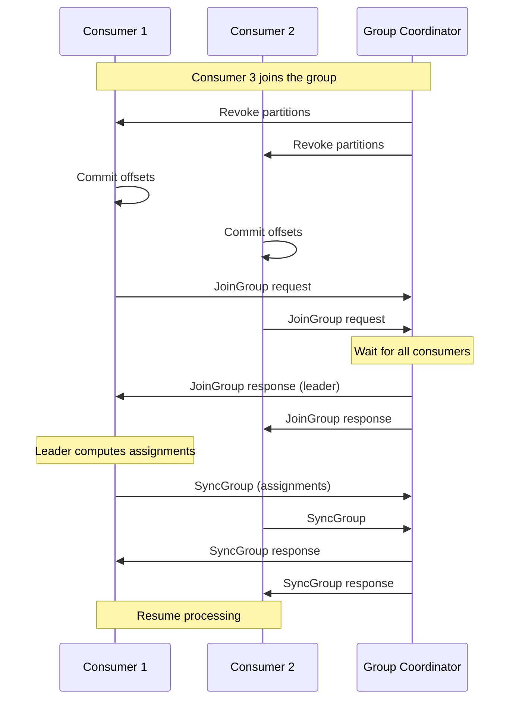
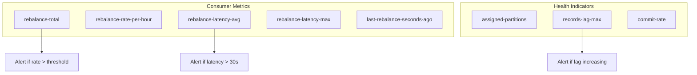
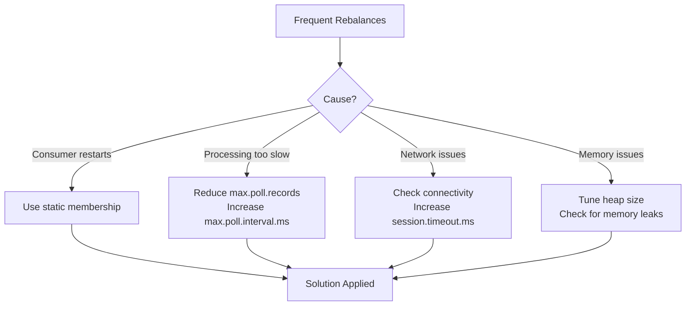

# How to Handle Consumer Group Rebalancing in Kafka

Author: [nawazdhandala](https://www.github.com/nawazdhandala)

Tags: Kafka, Consumer Groups, Rebalancing, Distributed Systems, Message Queue, Performance

Description: A comprehensive guide to understanding, managing, and optimizing Kafka consumer group rebalancing to minimize processing disruptions and improve application reliability.

---

## Introduction

Consumer group rebalancing is a fundamental mechanism in Kafka that redistributes partition assignments among consumers when the group membership changes. While essential for scalability and fault tolerance, rebalancing can cause temporary processing pauses and, if not handled properly, lead to duplicate message processing or message loss.

This guide explains how consumer group rebalancing works, common triggers, optimization strategies, and best practices for minimizing disruption during rebalances.

## Understanding Consumer Group Rebalancing

### What is Rebalancing?

When consumers join or leave a consumer group, Kafka redistributes partitions among the remaining consumers. This process is called rebalancing.

```mermaid
flowchart TB
    subgraph Before Rebalance
        direction TB
        C1A[Consumer 1<br/>P0, P1, P2]
        C2A[Consumer 2<br/>P3, P4, P5]
    end

    subgraph "Consumer 3 Joins"
        direction TB
        R[Rebalance<br/>Triggered]
    end

    subgraph After Rebalance
        direction TB
        C1B[Consumer 1<br/>P0, P1]
        C2B[Consumer 2<br/>P2, P3]
        C3B[Consumer 3<br/>P4, P5]
    end

    Before Rebalance --> R
    R --> After Rebalance
```

### The Rebalancing Process

During a rebalance, all consumers in the group must stop processing and rejoin the group with new partition assignments.



## Common Rebalancing Triggers

### 1. Consumer Joins or Leaves

The most common trigger is when consumers are added or removed from the group.

```python
from kafka import KafkaConsumer
import signal
import sys

# Create a consumer that joins a group
consumer = KafkaConsumer(
    'orders',
    bootstrap_servers=['localhost:9092'],
    group_id='order-processors',
    # Enable auto commit for simplicity
    enable_auto_commit=True,
    auto_commit_interval_ms=5000,
)

def graceful_shutdown(signum, frame):
    """
    Handle shutdown gracefully to trigger a clean rebalance.
    Closing the consumer properly ensures offsets are committed
    and the group coordinator is notified immediately.
    """
    print("Shutting down consumer gracefully...")
    consumer.close()
    sys.exit(0)

# Register signal handlers for graceful shutdown
signal.signal(signal.SIGTERM, graceful_shutdown)
signal.signal(signal.SIGINT, graceful_shutdown)

print("Consumer started, processing messages...")
for message in consumer:
    print(f"Processing: {message.value}")
```

### 2. Session Timeout

If a consumer fails to send heartbeats within the session timeout, it is considered dead.

```python
consumer = KafkaConsumer(
    'orders',
    bootstrap_servers=['localhost:9092'],
    group_id='order-processors',

    # Session timeout: Time before consumer is considered dead
    # If no heartbeat is received within this time, rebalance is triggered
    session_timeout_ms=30000,

    # Heartbeat interval: How often to send heartbeats
    # Should be less than session_timeout_ms / 3
    heartbeat_interval_ms=10000,
)
```

### 3. Max Poll Interval Exceeded

If a consumer takes too long between poll() calls, it triggers a rebalance.

```python
consumer = KafkaConsumer(
    'orders',
    bootstrap_servers=['localhost:9092'],
    group_id='order-processors',

    # Maximum time between poll() calls
    # If exceeded, consumer is considered stuck and removed from group
    max_poll_interval_ms=300000,  # 5 minutes

    # Maximum records returned per poll
    # Reduce this if processing takes too long
    max_poll_records=500,
)

# Process messages with awareness of poll interval
for message in consumer:
    try:
        # Ensure processing completes within max_poll_interval_ms
        process_message_with_timeout(message, timeout=280)
    except TimeoutError:
        # Log and continue to avoid exceeding poll interval
        print(f"Processing timeout for message at offset {message.offset}")
```

### 4. Subscription Changes

Changing the topics a consumer subscribes to triggers a rebalance.

```python
# Initial subscription
consumer.subscribe(['orders'])

# Changing subscription triggers rebalance
consumer.subscribe(['orders', 'payments'])

# Using pattern subscription
# Adding new topics matching the pattern triggers rebalance
consumer.subscribe(pattern='order-.*')
```

## Rebalancing Protocols

### Eager Rebalancing (Default before Kafka 2.4)

In eager rebalancing, all consumers revoke all partitions before reassignment.

```mermaid
flowchart TB
    subgraph Phase 1: Revoke All
        C1R[Consumer 1<br/>Revokes P0, P1]
        C2R[Consumer 2<br/>Revokes P2, P3]
    end

    subgraph Phase 2: Rejoin
        J[All consumers<br/>rejoin group]
    end

    subgraph Phase 3: Reassign
        C1A[Consumer 1<br/>Assigned P0, P2]
        C2A[Consumer 2<br/>Assigned P1, P3]
    end

    Phase 1: Revoke All --> Phase 2: Rejoin --> Phase 3: Reassign

    style Phase 1: Revoke All fill:#ff6b6b
    style Phase 2: Rejoin fill:#feca57
    style Phase 3: Reassign fill:#48dbfb
```

### Cooperative Rebalancing (Incremental)

Cooperative rebalancing only revokes partitions that need to move, reducing downtime.

```mermaid
flowchart TB
    subgraph Phase 1: Identify Changes
        I[Coordinator identifies<br/>partitions to move]
    end

    subgraph Phase 2: Revoke Only Moving Partitions
        C1R[Consumer 1<br/>Keeps P0, Revokes P1]
        C2R[Consumer 2<br/>Keeps P2, P3]
    end

    subgraph Phase 3: Reassign
        C1A[Consumer 1<br/>Has P0]
        C2A[Consumer 2<br/>Has P2, P3]
        C3A[Consumer 3<br/>Gets P1]
    end

    Phase 1: Identify Changes --> Phase 2: Revoke Only Moving Partitions --> Phase 3: Reassign

    style Phase 2: Revoke Only Moving Partitions fill:#48dbfb
```

### Enabling Cooperative Rebalancing

```python
from kafka import KafkaConsumer

consumer = KafkaConsumer(
    'orders',
    bootstrap_servers=['localhost:9092'],
    group_id='order-processors',

    # Use cooperative sticky assignor for incremental rebalancing
    # This minimizes partition movement during rebalances
    partition_assignment_strategy=[
        'org.apache.kafka.clients.consumer.CooperativeStickyAssignor'
    ],
)
```

```java
// Java configuration for cooperative rebalancing
Properties props = new Properties();
props.put("bootstrap.servers", "localhost:9092");
props.put("group.id", "order-processors");

// Enable cooperative sticky assignor
props.put(ConsumerConfig.PARTITION_ASSIGNMENT_STRATEGY_CONFIG,
    CooperativeStickyAssignor.class.getName());

KafkaConsumer<String, String> consumer = new KafkaConsumer<>(props);
```

## Handling Rebalances in Code

### Using ConsumerRebalanceListener

Implement a rebalance listener to handle partition assignment changes.

```java
import org.apache.kafka.clients.consumer.*;
import org.apache.kafka.common.TopicPartition;
import java.util.*;
import java.time.Duration;

public class RebalanceAwareConsumer {

    private final KafkaConsumer<String, String> consumer;
    private final Map<TopicPartition, OffsetAndMetadata> pendingOffsets;

    public RebalanceAwareConsumer(Properties props) {
        this.consumer = new KafkaConsumer<>(props);
        this.pendingOffsets = new HashMap<>();
    }

    public void subscribe(String topic) {
        consumer.subscribe(
            Collections.singletonList(topic),
            new ConsumerRebalanceListener() {

                @Override
                public void onPartitionsRevoked(Collection<TopicPartition> partitions) {
                    // Called before rebalance starts
                    // Commit any pending offsets to avoid reprocessing
                    System.out.println("Partitions revoked: " + partitions);

                    if (!pendingOffsets.isEmpty()) {
                        System.out.println("Committing pending offsets before rebalance");
                        consumer.commitSync(pendingOffsets);
                        pendingOffsets.clear();
                    }

                    // Perform any cleanup for revoked partitions
                    for (TopicPartition partition : partitions) {
                        cleanupPartition(partition);
                    }
                }

                @Override
                public void onPartitionsAssigned(Collection<TopicPartition> partitions) {
                    // Called after rebalance completes
                    // Initialize state for new partitions
                    System.out.println("Partitions assigned: " + partitions);

                    for (TopicPartition partition : partitions) {
                        initializePartition(partition);
                    }
                }

                @Override
                public void onPartitionsLost(Collection<TopicPartition> partitions) {
                    // Called when partitions are lost unexpectedly
                    // (only with cooperative rebalancing)
                    System.out.println("Partitions lost: " + partitions);

                    // Cannot commit offsets here as partitions are already gone
                    // Just cleanup local state
                    for (TopicPartition partition : partitions) {
                        cleanupPartition(partition);
                    }
                }
            }
        );
    }

    private void cleanupPartition(TopicPartition partition) {
        // Clean up any resources associated with this partition
        // For example, flush buffers, close file handles, etc.
        System.out.println("Cleaning up partition: " + partition);
    }

    private void initializePartition(TopicPartition partition) {
        // Initialize resources for the new partition
        // For example, create buffers, open connections, etc.
        System.out.println("Initializing partition: " + partition);
    }

    public void consume() {
        try {
            while (true) {
                ConsumerRecords<String, String> records =
                    consumer.poll(Duration.ofMillis(100));

                for (ConsumerRecord<String, String> record : records) {
                    // Process the record
                    processRecord(record);

                    // Track offset for manual commit
                    TopicPartition tp = new TopicPartition(
                        record.topic(), record.partition());
                    pendingOffsets.put(tp,
                        new OffsetAndMetadata(record.offset() + 1));
                }

                // Commit periodically
                if (!pendingOffsets.isEmpty()) {
                    consumer.commitAsync(pendingOffsets, (offsets, exception) -> {
                        if (exception != null) {
                            System.err.println("Commit failed: " + exception);
                        }
                    });
                    pendingOffsets.clear();
                }
            }
        } finally {
            consumer.close();
        }
    }

    private void processRecord(ConsumerRecord<String, String> record) {
        System.out.println("Processing: " + record.value());
    }
}
```

### Python Implementation

```python
from kafka import KafkaConsumer, ConsumerRebalanceListener
from kafka.structs import TopicPartition
import threading

class RebalanceHandler(ConsumerRebalanceListener):
    """
    Custom rebalance listener to handle partition assignment changes.
    """

    def __init__(self, consumer):
        self.consumer = consumer
        self.pending_offsets = {}
        self.lock = threading.Lock()

    def on_partitions_revoked(self, revoked):
        """
        Called before partitions are revoked during rebalance.
        Use this to commit offsets and cleanup resources.
        """
        print(f"Partitions being revoked: {revoked}")

        with self.lock:
            if self.pending_offsets:
                print("Committing pending offsets before rebalance...")
                try:
                    self.consumer.commit(self.pending_offsets)
                    self.pending_offsets.clear()
                    print("Offsets committed successfully")
                except Exception as e:
                    print(f"Failed to commit offsets: {e}")

        # Cleanup resources for revoked partitions
        for tp in revoked:
            self._cleanup_partition(tp)

    def on_partitions_assigned(self, assigned):
        """
        Called after partitions are assigned during rebalance.
        Use this to initialize resources for new partitions.
        """
        print(f"Partitions assigned: {assigned}")

        # Initialize resources for new partitions
        for tp in assigned:
            self._initialize_partition(tp)

    def _cleanup_partition(self, tp):
        """Clean up resources for a partition."""
        print(f"Cleaning up partition: {tp}")
        # Add your cleanup logic here

    def _initialize_partition(self, tp):
        """Initialize resources for a partition."""
        print(f"Initializing partition: {tp}")
        # Add your initialization logic here

    def track_offset(self, tp, offset):
        """Track an offset for later commit."""
        with self.lock:
            self.pending_offsets[tp] = offset + 1


def create_rebalance_aware_consumer():
    """
    Create a consumer with rebalance handling.
    """
    consumer = KafkaConsumer(
        bootstrap_servers=['localhost:9092'],
        group_id='order-processors',
        enable_auto_commit=False,  # Manual commit for control
        auto_offset_reset='earliest',

        # Cooperative rebalancing for minimal disruption
        partition_assignment_strategy=[
            'org.apache.kafka.clients.consumer.CooperativeStickyAssignor'
        ],
    )

    rebalance_handler = RebalanceHandler(consumer)

    # Subscribe with rebalance listener
    consumer.subscribe(['orders'], listener=rebalance_handler)

    return consumer, rebalance_handler


def main():
    consumer, handler = create_rebalance_aware_consumer()

    try:
        while True:
            # Poll for messages
            records = consumer.poll(timeout_ms=100)

            for tp, messages in records.items():
                for message in messages:
                    # Process the message
                    print(f"Processing: {message.value}")

                    # Track offset for commit
                    handler.track_offset(tp, message.offset)

            # Commit offsets asynchronously
            if handler.pending_offsets:
                consumer.commit_async()
                handler.pending_offsets.clear()

    except KeyboardInterrupt:
        print("Shutting down...")
    finally:
        consumer.close()


if __name__ == '__main__':
    main()
```

## Minimizing Rebalance Impact

### 1. Configure Static Group Membership

Static membership prevents rebalances during short consumer restarts.

```python
from kafka import KafkaConsumer
import uuid

# Generate a stable instance ID for this consumer
# Use the same ID across restarts to avoid rebalances
INSTANCE_ID = "order-processor-" + get_hostname()  # or use a stable identifier

consumer = KafkaConsumer(
    'orders',
    bootstrap_servers=['localhost:9092'],
    group_id='order-processors',

    # Static group membership
    # Consumer will rejoin with same partitions if it restarts
    # within session.timeout.ms
    group_instance_id=INSTANCE_ID,

    # Increase session timeout for static members
    # Consumer has this long to restart without triggering rebalance
    session_timeout_ms=300000,  # 5 minutes
)
```

```java
// Java configuration for static membership
Properties props = new Properties();
props.put("bootstrap.servers", "localhost:9092");
props.put("group.id", "order-processors");

// Static membership configuration
// Use a stable identifier like hostname or pod name
props.put(ConsumerConfig.GROUP_INSTANCE_ID_CONFIG,
    "order-processor-" + InetAddress.getLocalHost().getHostName());

// Increase session timeout for static members
props.put(ConsumerConfig.SESSION_TIMEOUT_MS_CONFIG, 300000);

KafkaConsumer<String, String> consumer = new KafkaConsumer<>(props);
```

### 2. Tune Timeout Settings

Optimize timeout settings to balance responsiveness and stability.

```python
consumer = KafkaConsumer(
    'orders',
    bootstrap_servers=['localhost:9092'],
    group_id='order-processors',

    # Session timeout: Balance between quick failure detection
    # and avoiding unnecessary rebalances
    session_timeout_ms=45000,  # 45 seconds

    # Heartbeat interval: Send heartbeats frequently
    # Rule: heartbeat_interval < session_timeout / 3
    heartbeat_interval_ms=15000,  # 15 seconds

    # Max poll interval: Allow enough time for processing
    # but not so long that failures go undetected
    max_poll_interval_ms=600000,  # 10 minutes

    # Max records per poll: Limit to ensure processing
    # completes within max_poll_interval
    max_poll_records=100,
)
```

### 3. Process Messages Efficiently

Ensure message processing completes within the poll interval.

```python
import concurrent.futures
from kafka import KafkaConsumer

def process_batch_with_parallelism(consumer, max_workers=4):
    """
    Process messages in parallel to complete within poll interval.
    """
    with concurrent.futures.ThreadPoolExecutor(max_workers=max_workers) as executor:
        while True:
            # Poll for messages
            records = consumer.poll(timeout_ms=100)

            if not records:
                continue

            # Submit all messages for parallel processing
            futures = []
            for tp, messages in records.items():
                for message in messages:
                    future = executor.submit(process_message, message)
                    futures.append((tp, message.offset, future))

            # Wait for all processing to complete
            for tp, offset, future in futures:
                try:
                    # Set a timeout to avoid exceeding poll interval
                    future.result(timeout=60)
                except concurrent.futures.TimeoutError:
                    print(f"Processing timeout for offset {offset}")
                except Exception as e:
                    print(f"Processing error for offset {offset}: {e}")

            # Commit offsets after successful processing
            consumer.commit()


def process_message(message):
    """Process a single message."""
    # Your processing logic here
    pass
```

### 4. Use Pause and Resume

Pause consumption during heavy processing to avoid rebalances.

```python
from kafka import KafkaConsumer
import time

consumer = KafkaConsumer(
    'orders',
    bootstrap_servers=['localhost:9092'],
    group_id='order-processors',
    max_poll_interval_ms=300000,
)

def process_with_pause_resume():
    """
    Pause partitions during heavy processing to maintain heartbeats.
    """
    while True:
        records = consumer.poll(timeout_ms=100)

        if not records:
            continue

        # Get assigned partitions
        assigned = consumer.assignment()

        # Pause all partitions during heavy processing
        consumer.pause(*assigned)

        try:
            for tp, messages in records.items():
                for message in messages:
                    # Heavy processing that might take a while
                    process_heavy_message(message)

                    # Periodically poll to send heartbeats
                    # This empty poll maintains session
                    consumer.poll(timeout_ms=0)

        finally:
            # Resume partitions after processing
            consumer.resume(*assigned)

        # Commit offsets
        consumer.commit()


def process_heavy_message(message):
    """Simulate heavy processing."""
    time.sleep(5)  # Heavy processing
    print(f"Processed: {message.value}")
```

## Monitoring Rebalances

### Key Metrics



### Prometheus Metrics

```python
from prometheus_client import Counter, Gauge, Histogram, start_http_server
from kafka import KafkaConsumer, ConsumerRebalanceListener

# Define metrics
REBALANCE_TOTAL = Counter(
    'kafka_consumer_rebalance_total',
    'Total number of rebalances',
    ['group_id']
)

REBALANCE_DURATION = Histogram(
    'kafka_consumer_rebalance_duration_seconds',
    'Duration of rebalance operations',
    ['group_id'],
    buckets=[0.1, 0.5, 1, 2, 5, 10, 30, 60]
)

ASSIGNED_PARTITIONS = Gauge(
    'kafka_consumer_assigned_partitions',
    'Number of partitions assigned to this consumer',
    ['group_id']
)

class MetricsRebalanceListener(ConsumerRebalanceListener):
    """Rebalance listener that exposes metrics."""

    def __init__(self, group_id):
        self.group_id = group_id
        self.rebalance_start = None

    def on_partitions_revoked(self, revoked):
        """Record start of rebalance."""
        self.rebalance_start = time.time()
        REBALANCE_TOTAL.labels(group_id=self.group_id).inc()
        print(f"Rebalance started, revoking {len(revoked)} partitions")

    def on_partitions_assigned(self, assigned):
        """Record end of rebalance and update metrics."""
        if self.rebalance_start:
            duration = time.time() - self.rebalance_start
            REBALANCE_DURATION.labels(group_id=self.group_id).observe(duration)
            print(f"Rebalance completed in {duration:.2f}s")
            self.rebalance_start = None

        ASSIGNED_PARTITIONS.labels(group_id=self.group_id).set(len(assigned))
        print(f"Assigned {len(assigned)} partitions")


def main():
    # Start Prometheus metrics server
    start_http_server(8000)

    group_id = 'order-processors'

    consumer = KafkaConsumer(
        bootstrap_servers=['localhost:9092'],
        group_id=group_id,
    )

    listener = MetricsRebalanceListener(group_id)
    consumer.subscribe(['orders'], listener=listener)

    for message in consumer:
        process_message(message)
```

### Alerting Rules

```yaml
# prometheus-alerts.yaml
groups:
  - name: kafka-consumer-rebalance
    rules:
      # Alert on frequent rebalances
      - alert: KafkaConsumerFrequentRebalances
        expr: |
          increase(kafka_consumer_rebalance_total[1h]) > 10
        for: 5m
        labels:
          severity: warning
        annotations:
          summary: "Frequent Kafka consumer rebalances detected"
          description: "Consumer group {{ $labels.group_id }} has rebalanced {{ $value }} times in the last hour"

      # Alert on slow rebalances
      - alert: KafkaConsumerSlowRebalance
        expr: |
          kafka_consumer_rebalance_duration_seconds > 30
        for: 1m
        labels:
          severity: warning
        annotations:
          summary: "Slow Kafka consumer rebalance"
          description: "Rebalance for {{ $labels.group_id }} took {{ $value }}s"

      # Alert on zero assigned partitions
      - alert: KafkaConsumerNoPartitions
        expr: |
          kafka_consumer_assigned_partitions == 0
        for: 5m
        labels:
          severity: critical
        annotations:
          summary: "Kafka consumer has no assigned partitions"
          description: "Consumer in group {{ $labels.group_id }} has 0 partitions"
```

## Debugging Rebalance Issues

### Enable Debug Logging

```python
import logging

# Enable detailed Kafka logging
logging.basicConfig(level=logging.DEBUG)

# Or specifically for the Kafka module
kafka_logger = logging.getLogger('kafka')
kafka_logger.setLevel(logging.DEBUG)
```

### Check Consumer Group Status

```bash
# Describe consumer group to see current assignments
kafka-consumer-groups.sh --bootstrap-server localhost:9092 \
    --group order-processors --describe

# Output shows partition assignments and lag
# GROUP           TOPIC     PARTITION  CURRENT-OFFSET  LOG-END-OFFSET  LAG
# order-processors orders    0          1000           1050            50
# order-processors orders    1          2000           2000            0

# List all members of a consumer group
kafka-consumer-groups.sh --bootstrap-server localhost:9092 \
    --group order-processors --describe --members

# Check group state
kafka-consumer-groups.sh --bootstrap-server localhost:9092 \
    --group order-processors --describe --state
```

### Common Issues and Solutions



## Best Practices Summary

### Configuration Checklist

```python
# Recommended configuration for production
consumer_config = {
    'bootstrap_servers': ['broker1:9092', 'broker2:9092', 'broker3:9092'],
    'group_id': 'order-processors',

    # Use cooperative rebalancing
    'partition_assignment_strategy': [
        'org.apache.kafka.clients.consumer.CooperativeStickyAssignor'
    ],

    # Static membership (use stable identifier)
    'group_instance_id': f'order-processor-{hostname}',

    # Timeout configuration
    'session_timeout_ms': 45000,
    'heartbeat_interval_ms': 15000,
    'max_poll_interval_ms': 300000,

    # Batch configuration
    'max_poll_records': 500,
    'fetch_max_bytes': 52428800,

    # Offset management
    'enable_auto_commit': False,
    'auto_offset_reset': 'earliest',
}
```

### Operational Guidelines

1. **Use cooperative rebalancing** - Minimizes partition movement and processing disruption
2. **Enable static membership** - Prevents rebalances during rolling deployments
3. **Implement graceful shutdown** - Always close consumers properly to trigger clean rebalances
4. **Monitor rebalance frequency** - Alert on unusual rebalance patterns
5. **Handle rebalances in code** - Use rebalance listeners to commit offsets and cleanup resources
6. **Tune timeouts carefully** - Balance between failure detection and stability
7. **Process messages efficiently** - Stay within poll interval limits

## Conclusion

Consumer group rebalancing is essential for Kafka's scalability and fault tolerance, but it requires careful handling to minimize disruption. By using cooperative rebalancing, static membership, and proper rebalance listeners, you can significantly reduce the impact of rebalances on your application.

Key takeaways:

- Understand the rebalancing process and its triggers
- Use cooperative sticky assignor for incremental rebalancing
- Enable static membership for stable consumer instances
- Implement rebalance listeners to handle partition changes gracefully
- Monitor rebalance frequency and duration
- Tune timeout settings based on your processing requirements

With these practices in place, your Kafka consumers will handle rebalances smoothly without impacting message processing reliability.
