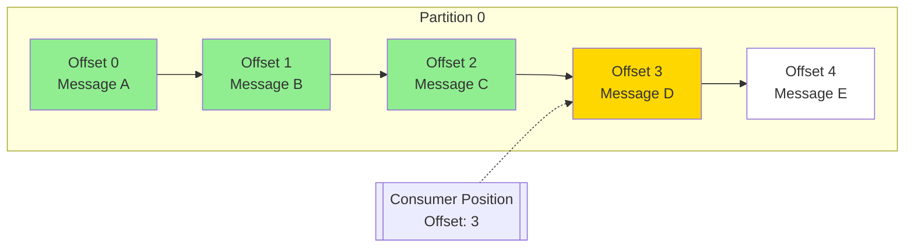
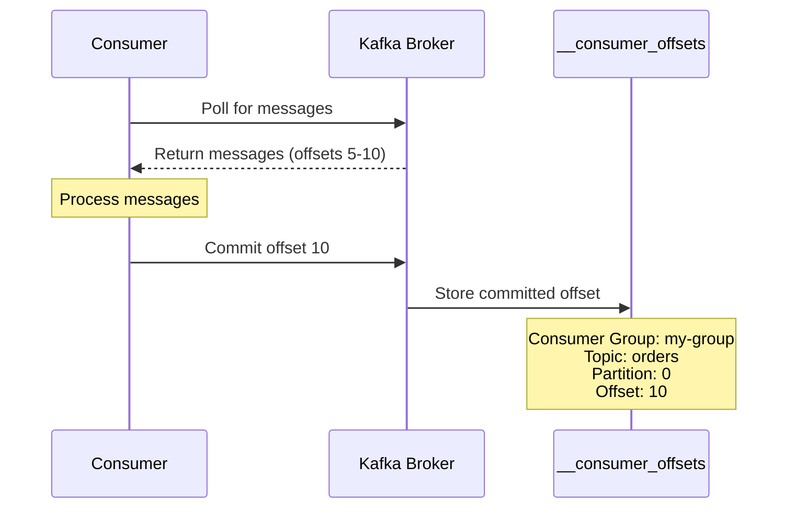
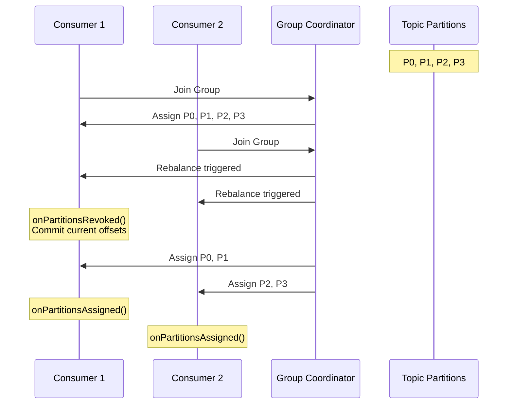
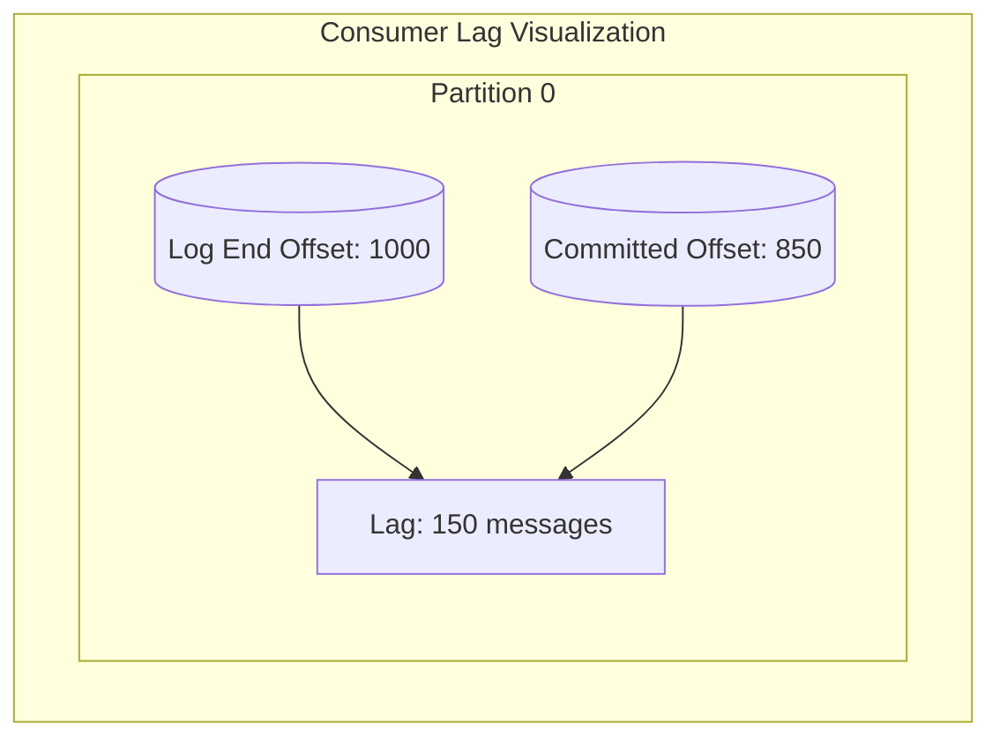
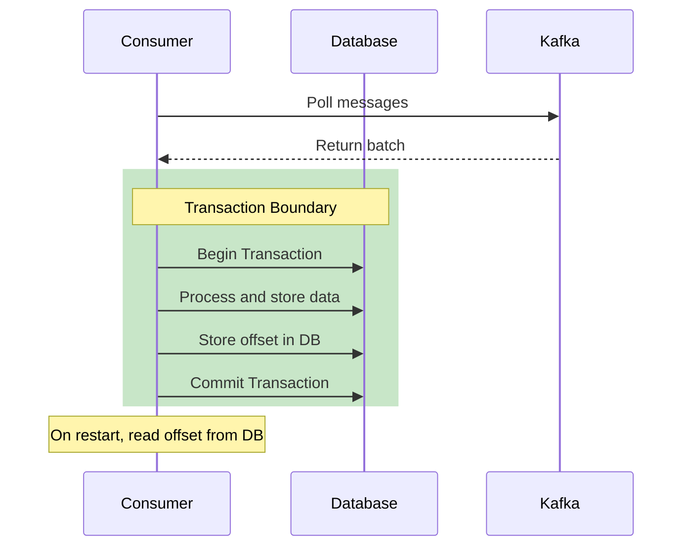
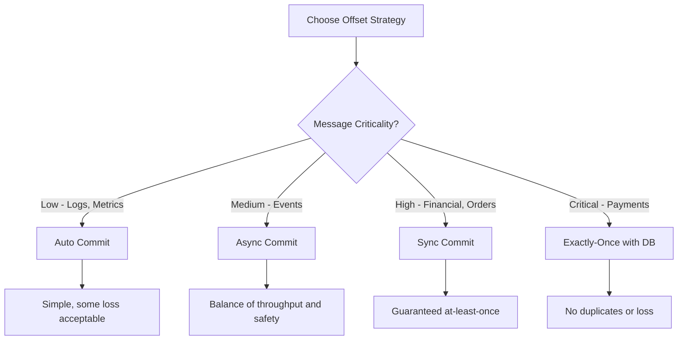

# How to Handle Kafka Consumer Offset Management

Author: [nawazdhandala](https://www.github.com/nawazdhandala)

Tags: Kafka, Apache Kafka, Consumer Groups, Offset Management, Message Processing, Distributed Systems, Reliability

Description: Learn how to properly manage Kafka consumer offsets to ensure reliable message processing, prevent data loss, and handle reprocessing scenarios.

---

## Introduction

Consumer offset management is one of the most critical aspects of building reliable Kafka applications. Offsets track which messages a consumer has processed, and improper handling can lead to data loss, duplicate processing, or missed messages. This guide covers everything you need to know about managing consumer offsets effectively.

Understanding offset management is essential for building robust event-driven architectures where message delivery guarantees matter.

## Understanding Consumer Offsets

### What are Offsets?

In Kafka, each message within a partition has a unique sequential identifier called an offset. Offsets are assigned by the broker when messages are written and never change. Consumers track their position in each partition using these offsets.



### Committed vs Current Offset

There are two important offset concepts:

- **Current Offset**: The next message the consumer will read
- **Committed Offset**: The last offset the consumer has confirmed processing



## Offset Commit Strategies

### Strategy 1: Auto Commit

The simplest approach where Kafka automatically commits offsets at regular intervals.

```java
import org.apache.kafka.clients.consumer.ConsumerConfig;
import org.apache.kafka.clients.consumer.ConsumerRecords;
import org.apache.kafka.clients.consumer.KafkaConsumer;
import org.apache.kafka.common.serialization.StringDeserializer;

import java.time.Duration;
import java.util.Collections;
import java.util.Properties;

public class AutoCommitConsumer {

    public static void main(String[] args) {
        Properties props = new Properties();
        props.put(ConsumerConfig.BOOTSTRAP_SERVERS_CONFIG, "localhost:9092");
        props.put(ConsumerConfig.GROUP_ID_CONFIG, "auto-commit-group");
        props.put(ConsumerConfig.KEY_DESERIALIZER_CLASS_CONFIG, StringDeserializer.class.getName());
        props.put(ConsumerConfig.VALUE_DESERIALIZER_CLASS_CONFIG, StringDeserializer.class.getName());

        // Enable auto commit (this is the default)
        props.put(ConsumerConfig.ENABLE_AUTO_COMMIT_CONFIG, "true");

        // Commit every 5 seconds (default is 5000ms)
        props.put(ConsumerConfig.AUTO_COMMIT_INTERVAL_MS_CONFIG, "5000");

        try (KafkaConsumer<String, String> consumer = new KafkaConsumer<>(props)) {
            consumer.subscribe(Collections.singletonList("orders"));

            while (true) {
                // Poll for new messages
                ConsumerRecords<String, String> records = consumer.poll(Duration.ofMillis(100));

                records.forEach(record -> {
                    // Process the message
                    System.out.printf("Processing: key=%s, value=%s, offset=%d%n",
                        record.key(), record.value(), record.offset());

                    // Warning: If processing fails after poll but before auto-commit,
                    // messages may be lost. If processing succeeds but crash occurs
                    // before auto-commit, messages may be reprocessed.
                });
            }
        }
    }
}
```

**Pros and Cons of Auto Commit:**

| Pros | Cons |
|------|------|
| Simple to implement | Risk of data loss |
| No manual offset management | Potential duplicate processing |
| Good for non-critical data | No control over commit timing |

### Strategy 2: Manual Synchronous Commit

Commit offsets explicitly after processing each batch, waiting for confirmation.

```java
import org.apache.kafka.clients.consumer.*;
import org.apache.kafka.common.serialization.StringDeserializer;

import java.time.Duration;
import java.util.Collections;
import java.util.Properties;

public class SyncCommitConsumer {

    public static void main(String[] args) {
        Properties props = new Properties();
        props.put(ConsumerConfig.BOOTSTRAP_SERVERS_CONFIG, "localhost:9092");
        props.put(ConsumerConfig.GROUP_ID_CONFIG, "sync-commit-group");
        props.put(ConsumerConfig.KEY_DESERIALIZER_CLASS_CONFIG, StringDeserializer.class.getName());
        props.put(ConsumerConfig.VALUE_DESERIALIZER_CLASS_CONFIG, StringDeserializer.class.getName());

        // Disable auto commit for manual control
        props.put(ConsumerConfig.ENABLE_AUTO_COMMIT_CONFIG, "false");

        try (KafkaConsumer<String, String> consumer = new KafkaConsumer<>(props)) {
            consumer.subscribe(Collections.singletonList("orders"));

            while (true) {
                ConsumerRecords<String, String> records = consumer.poll(Duration.ofMillis(100));

                for (ConsumerRecord<String, String> record : records) {
                    try {
                        // Process the message
                        processRecord(record);
                    } catch (Exception e) {
                        // Handle processing error
                        System.err.println("Error processing record: " + e.getMessage());
                        // Decide whether to skip or retry
                    }
                }

                // Commit after processing all records in the batch
                // This blocks until the broker confirms the commit
                if (!records.isEmpty()) {
                    try {
                        consumer.commitSync();
                        System.out.println("Offsets committed successfully");
                    } catch (CommitFailedException e) {
                        System.err.println("Commit failed: " + e.getMessage());
                        // Handle commit failure - may need to reprocess
                    }
                }
            }
        }
    }

    private static void processRecord(ConsumerRecord<String, String> record) {
        System.out.printf("Processing: key=%s, value=%s, partition=%d, offset=%d%n",
            record.key(), record.value(), record.partition(), record.offset());
        // Business logic here
    }
}
```

### Strategy 3: Manual Asynchronous Commit

Commit offsets without waiting for confirmation, improving throughput.

```java
import org.apache.kafka.clients.consumer.*;
import org.apache.kafka.common.serialization.StringDeserializer;

import java.time.Duration;
import java.util.Collections;
import java.util.Properties;
import java.util.concurrent.atomic.AtomicLong;

public class AsyncCommitConsumer {

    // Track the last successfully committed offset for monitoring
    private static final AtomicLong lastCommittedOffset = new AtomicLong(-1);

    public static void main(String[] args) {
        Properties props = new Properties();
        props.put(ConsumerConfig.BOOTSTRAP_SERVERS_CONFIG, "localhost:9092");
        props.put(ConsumerConfig.GROUP_ID_CONFIG, "async-commit-group");
        props.put(ConsumerConfig.KEY_DESERIALIZER_CLASS_CONFIG, StringDeserializer.class.getName());
        props.put(ConsumerConfig.VALUE_DESERIALIZER_CLASS_CONFIG, StringDeserializer.class.getName());
        props.put(ConsumerConfig.ENABLE_AUTO_COMMIT_CONFIG, "false");

        try (KafkaConsumer<String, String> consumer = new KafkaConsumer<>(props)) {
            consumer.subscribe(Collections.singletonList("orders"));

            while (true) {
                ConsumerRecords<String, String> records = consumer.poll(Duration.ofMillis(100));

                for (ConsumerRecord<String, String> record : records) {
                    processRecord(record);
                }

                // Commit asynchronously with callback
                if (!records.isEmpty()) {
                    consumer.commitAsync((offsets, exception) -> {
                        if (exception != null) {
                            // Log the error but continue processing
                            // The next commit will include these offsets
                            System.err.println("Async commit failed: " + exception.getMessage());
                        } else {
                            // Track successful commits
                            offsets.forEach((tp, offset) -> {
                                lastCommittedOffset.set(offset.offset());
                                System.out.printf("Committed offset %d for %s%n",
                                    offset.offset(), tp);
                            });
                        }
                    });
                }
            }
        }
    }

    private static void processRecord(ConsumerRecord<String, String> record) {
        System.out.printf("Processing: key=%s, offset=%d%n",
            record.key(), record.offset());
    }
}
```

### Strategy 4: Commit Specific Offsets

Commit offsets for specific partitions, providing fine-grained control.

```java
import org.apache.kafka.clients.consumer.*;
import org.apache.kafka.common.TopicPartition;
import org.apache.kafka.common.serialization.StringDeserializer;

import java.time.Duration;
import java.util.*;

public class SpecificOffsetCommitConsumer {

    public static void main(String[] args) {
        Properties props = new Properties();
        props.put(ConsumerConfig.BOOTSTRAP_SERVERS_CONFIG, "localhost:9092");
        props.put(ConsumerConfig.GROUP_ID_CONFIG, "specific-offset-group");
        props.put(ConsumerConfig.KEY_DESERIALIZER_CLASS_CONFIG, StringDeserializer.class.getName());
        props.put(ConsumerConfig.VALUE_DESERIALIZER_CLASS_CONFIG, StringDeserializer.class.getName());
        props.put(ConsumerConfig.ENABLE_AUTO_COMMIT_CONFIG, "false");

        try (KafkaConsumer<String, String> consumer = new KafkaConsumer<>(props)) {
            consumer.subscribe(Collections.singletonList("orders"));

            // Track offsets for each partition
            Map<TopicPartition, OffsetAndMetadata> currentOffsets = new HashMap<>();
            int messageCount = 0;

            while (true) {
                ConsumerRecords<String, String> records = consumer.poll(Duration.ofMillis(100));

                for (ConsumerRecord<String, String> record : records) {
                    processRecord(record);

                    // Track the offset for this partition
                    // Note: We commit offset + 1 because committed offset is the next offset to read
                    TopicPartition partition = new TopicPartition(record.topic(), record.partition());
                    currentOffsets.put(partition,
                        new OffsetAndMetadata(record.offset() + 1, "processed"));

                    messageCount++;

                    // Commit every 100 messages for more frequent checkpointing
                    if (messageCount % 100 == 0) {
                        consumer.commitAsync(currentOffsets, (offsets, exception) -> {
                            if (exception != null) {
                                System.err.println("Commit failed for offsets: " + offsets);
                            }
                        });
                        System.out.println("Committed offsets: " + currentOffsets);
                    }
                }
            }
        }
    }

    private static void processRecord(ConsumerRecord<String, String> record) {
        System.out.printf("Processing: partition=%d, offset=%d, key=%s%n",
            record.partition(), record.offset(), record.key());
    }
}
```

## Handling Rebalances

When consumers join or leave a group, Kafka triggers a rebalance. Proper offset handling during rebalances prevents message loss or duplication.



### Implementing a Rebalance Listener

```java
import org.apache.kafka.clients.consumer.*;
import org.apache.kafka.common.TopicPartition;
import org.apache.kafka.common.serialization.StringDeserializer;

import java.time.Duration;
import java.util.*;
import java.util.concurrent.ConcurrentHashMap;

public class RebalanceAwareConsumer {

    // Track current offsets for each partition
    private static final Map<TopicPartition, Long> currentOffsets = new ConcurrentHashMap<>();

    public static void main(String[] args) {
        Properties props = new Properties();
        props.put(ConsumerConfig.BOOTSTRAP_SERVERS_CONFIG, "localhost:9092");
        props.put(ConsumerConfig.GROUP_ID_CONFIG, "rebalance-aware-group");
        props.put(ConsumerConfig.KEY_DESERIALIZER_CLASS_CONFIG, StringDeserializer.class.getName());
        props.put(ConsumerConfig.VALUE_DESERIALIZER_CLASS_CONFIG, StringDeserializer.class.getName());
        props.put(ConsumerConfig.ENABLE_AUTO_COMMIT_CONFIG, "false");

        KafkaConsumer<String, String> consumer = new KafkaConsumer<>(props);

        // Create rebalance listener to handle partition assignment changes
        ConsumerRebalanceListener rebalanceListener = new ConsumerRebalanceListener() {

            @Override
            public void onPartitionsRevoked(Collection<TopicPartition> partitions) {
                // Called before rebalance - commit current offsets
                System.out.println("Partitions revoked: " + partitions);

                // Build offset map for revoked partitions
                Map<TopicPartition, OffsetAndMetadata> offsetsToCommit = new HashMap<>();
                for (TopicPartition partition : partitions) {
                    Long offset = currentOffsets.get(partition);
                    if (offset != null) {
                        offsetsToCommit.put(partition, new OffsetAndMetadata(offset + 1));
                    }
                }

                // Synchronously commit to ensure offsets are saved before rebalance
                if (!offsetsToCommit.isEmpty()) {
                    try {
                        consumer.commitSync(offsetsToCommit);
                        System.out.println("Committed offsets before rebalance: " + offsetsToCommit);
                    } catch (CommitFailedException e) {
                        System.err.println("Failed to commit offsets during rebalance: " + e.getMessage());
                    }
                }

                // Clear tracked offsets for revoked partitions
                partitions.forEach(currentOffsets::remove);
            }

            @Override
            public void onPartitionsAssigned(Collection<TopicPartition> partitions) {
                // Called after rebalance - initialize tracking for new partitions
                System.out.println("Partitions assigned: " + partitions);

                // Optionally seek to specific offsets or beginning/end
                for (TopicPartition partition : partitions) {
                    // Get the committed offset for this partition
                    OffsetAndMetadata committed = consumer.committed(
                        Collections.singleton(partition)).get(partition);

                    if (committed != null) {
                        System.out.printf("Partition %s: resuming from committed offset %d%n",
                            partition, committed.offset());
                    } else {
                        System.out.printf("Partition %s: no committed offset, starting fresh%n",
                            partition);
                    }
                }
            }
        };

        // Subscribe with rebalance listener
        consumer.subscribe(Collections.singletonList("orders"), rebalanceListener);

        try {
            while (true) {
                ConsumerRecords<String, String> records = consumer.poll(Duration.ofMillis(100));

                for (ConsumerRecord<String, String> record : records) {
                    processRecord(record);

                    // Track current offset for this partition
                    TopicPartition partition = new TopicPartition(record.topic(), record.partition());
                    currentOffsets.put(partition, record.offset());
                }

                // Periodic async commit
                if (!records.isEmpty()) {
                    consumer.commitAsync();
                }
            }
        } finally {
            // Final synchronous commit before closing
            try {
                consumer.commitSync();
            } finally {
                consumer.close();
            }
        }
    }

    private static void processRecord(ConsumerRecord<String, String> record) {
        System.out.printf("Processing: partition=%d, offset=%d, key=%s%n",
            record.partition(), record.offset(), record.key());
    }
}
```

## Seeking to Specific Offsets

Sometimes you need to reprocess messages or skip to a specific position.

### Seek Operations

```java
import org.apache.kafka.clients.consumer.*;
import org.apache.kafka.common.TopicPartition;
import org.apache.kafka.common.serialization.StringDeserializer;

import java.time.Duration;
import java.time.Instant;
import java.time.temporal.ChronoUnit;
import java.util.*;

public class OffsetSeekConsumer {

    public static void main(String[] args) {
        Properties props = new Properties();
        props.put(ConsumerConfig.BOOTSTRAP_SERVERS_CONFIG, "localhost:9092");
        props.put(ConsumerConfig.GROUP_ID_CONFIG, "seek-demo-group");
        props.put(ConsumerConfig.KEY_DESERIALIZER_CLASS_CONFIG, StringDeserializer.class.getName());
        props.put(ConsumerConfig.VALUE_DESERIALIZER_CLASS_CONFIG, StringDeserializer.class.getName());
        props.put(ConsumerConfig.ENABLE_AUTO_COMMIT_CONFIG, "false");

        try (KafkaConsumer<String, String> consumer = new KafkaConsumer<>(props)) {
            String topic = "orders";

            // Manually assign partitions (no consumer group coordination)
            List<TopicPartition> partitions = Arrays.asList(
                new TopicPartition(topic, 0),
                new TopicPartition(topic, 1),
                new TopicPartition(topic, 2)
            );
            consumer.assign(partitions);

            // Example 1: Seek to beginning of all partitions
            seekToBeginning(consumer, partitions);

            // Example 2: Seek to end of all partitions
            seekToEnd(consumer, partitions);

            // Example 3: Seek to specific offset
            seekToOffset(consumer, new TopicPartition(topic, 0), 100);

            // Example 4: Seek to timestamp (reprocess last 24 hours)
            seekToTimestamp(consumer, partitions, Instant.now().minus(24, ChronoUnit.HOURS));

            // Now consume from the seeked position
            while (true) {
                ConsumerRecords<String, String> records = consumer.poll(Duration.ofMillis(100));
                for (ConsumerRecord<String, String> record : records) {
                    System.out.printf("Consumed: partition=%d, offset=%d, key=%s%n",
                        record.partition(), record.offset(), record.key());
                }
            }
        }
    }

    /**
     * Seeks to the beginning of all specified partitions.
     * Useful for reprocessing all messages from the start.
     */
    private static void seekToBeginning(KafkaConsumer<String, String> consumer,
                                        List<TopicPartition> partitions) {
        consumer.seekToBeginning(partitions);
        System.out.println("Seeked to beginning of partitions: " + partitions);

        // Verify positions
        for (TopicPartition partition : partitions) {
            System.out.printf("Position for %s: %d%n", partition, consumer.position(partition));
        }
    }

    /**
     * Seeks to the end of all specified partitions.
     * Useful for skipping to latest messages.
     */
    private static void seekToEnd(KafkaConsumer<String, String> consumer,
                                  List<TopicPartition> partitions) {
        consumer.seekToEnd(partitions);
        System.out.println("Seeked to end of partitions: " + partitions);

        for (TopicPartition partition : partitions) {
            System.out.printf("Position for %s: %d%n", partition, consumer.position(partition));
        }
    }

    /**
     * Seeks to a specific offset for a partition.
     * Useful for replaying from a known good point.
     */
    private static void seekToOffset(KafkaConsumer<String, String> consumer,
                                     TopicPartition partition, long offset) {
        consumer.seek(partition, offset);
        System.out.printf("Seeked %s to offset %d%n", partition, offset);
    }

    /**
     * Seeks to offsets corresponding to a specific timestamp.
     * Useful for time-based replay scenarios.
     */
    private static void seekToTimestamp(KafkaConsumer<String, String> consumer,
                                        List<TopicPartition> partitions, Instant timestamp) {
        // Build timestamp query for each partition
        Map<TopicPartition, Long> timestampToSearch = new HashMap<>();
        long timestampMs = timestamp.toEpochMilli();
        for (TopicPartition partition : partitions) {
            timestampToSearch.put(partition, timestampMs);
        }

        // Query offsets for timestamps
        Map<TopicPartition, OffsetAndTimestamp> offsetsForTimes =
            consumer.offsetsForTimes(timestampToSearch);

        // Seek to the returned offsets
        for (Map.Entry<TopicPartition, OffsetAndTimestamp> entry : offsetsForTimes.entrySet()) {
            if (entry.getValue() != null) {
                consumer.seek(entry.getKey(), entry.getValue().offset());
                System.out.printf("Seeked %s to offset %d (timestamp: %d)%n",
                    entry.getKey(), entry.getValue().offset(), entry.getValue().timestamp());
            } else {
                // No messages at or after the timestamp - seek to end
                consumer.seekToEnd(Collections.singleton(entry.getKey()));
                System.out.printf("No messages after timestamp for %s, seeked to end%n",
                    entry.getKey());
            }
        }
    }
}
```

## Monitoring Consumer Lag

Consumer lag indicates how far behind a consumer is from the latest messages.



### Monitoring with Java

```java
import org.apache.kafka.clients.admin.*;
import org.apache.kafka.clients.consumer.OffsetAndMetadata;
import org.apache.kafka.common.TopicPartition;

import java.util.*;
import java.util.concurrent.ExecutionException;

public class ConsumerLagMonitor {

    private final AdminClient adminClient;

    public ConsumerLagMonitor(String bootstrapServers) {
        Properties props = new Properties();
        props.put(AdminClientConfig.BOOTSTRAP_SERVERS_CONFIG, bootstrapServers);
        this.adminClient = AdminClient.create(props);
    }

    /**
     * Calculates consumer lag for a specific consumer group.
     * Lag = Log End Offset - Committed Offset
     */
    public Map<TopicPartition, Long> getConsumerLag(String groupId)
            throws ExecutionException, InterruptedException {

        Map<TopicPartition, Long> lagByPartition = new HashMap<>();

        // Get committed offsets for the consumer group
        Map<TopicPartition, OffsetAndMetadata> committedOffsets =
            adminClient.listConsumerGroupOffsets(groupId)
                .partitionsToOffsetAndMetadata()
                .get();

        if (committedOffsets.isEmpty()) {
            System.out.println("No committed offsets found for group: " + groupId);
            return lagByPartition;
        }

        // Get end offsets (latest offsets) for all partitions
        Map<TopicPartition, OffsetSpec> offsetSpecMap = new HashMap<>();
        for (TopicPartition partition : committedOffsets.keySet()) {
            offsetSpecMap.put(partition, OffsetSpec.latest());
        }

        Map<TopicPartition, ListOffsetsResult.ListOffsetsResultInfo> endOffsets =
            adminClient.listOffsets(offsetSpecMap).all().get();

        // Calculate lag for each partition
        for (Map.Entry<TopicPartition, OffsetAndMetadata> entry : committedOffsets.entrySet()) {
            TopicPartition partition = entry.getKey();
            long committedOffset = entry.getValue().offset();
            long endOffset = endOffsets.get(partition).offset();

            long lag = endOffset - committedOffset;
            lagByPartition.put(partition, lag);

            System.out.printf("Partition %s: committed=%d, end=%d, lag=%d%n",
                partition, committedOffset, endOffset, lag);
        }

        return lagByPartition;
    }

    /**
     * Gets total lag across all partitions for a consumer group.
     */
    public long getTotalLag(String groupId) throws ExecutionException, InterruptedException {
        return getConsumerLag(groupId).values().stream()
            .mapToLong(Long::longValue)
            .sum();
    }

    /**
     * Lists all consumer groups and their states.
     */
    public void listConsumerGroups() throws ExecutionException, InterruptedException {
        Collection<ConsumerGroupListing> groups =
            adminClient.listConsumerGroups().all().get();

        System.out.println("Consumer Groups:");
        for (ConsumerGroupListing group : groups) {
            System.out.printf("  Group: %s, State: %s%n",
                group.groupId(), group.state().orElse(null));
        }
    }

    public void close() {
        adminClient.close();
    }

    public static void main(String[] args) throws Exception {
        ConsumerLagMonitor monitor = new ConsumerLagMonitor("localhost:9092");

        try {
            // List all consumer groups
            monitor.listConsumerGroups();

            // Get lag for a specific group
            String groupId = "my-consumer-group";
            Map<TopicPartition, Long> lag = monitor.getConsumerLag(groupId);

            long totalLag = monitor.getTotalLag(groupId);
            System.out.println("Total lag for " + groupId + ": " + totalLag);

        } finally {
            monitor.close();
        }
    }
}
```

### Using Kafka CLI Tools

```bash
# Describe consumer group and see lag
kafka-consumer-groups.sh --bootstrap-server localhost:9092 \
  --describe --group my-consumer-group

# Output includes:
# GROUP           TOPIC     PARTITION  CURRENT-OFFSET  LOG-END-OFFSET  LAG
# my-group        orders    0          1000            1150            150
# my-group        orders    1          2000            2050            50
# my-group        orders    2          1500            1500            0

# Reset offsets to earliest (dry run)
kafka-consumer-groups.sh --bootstrap-server localhost:9092 \
  --group my-consumer-group \
  --reset-offsets --to-earliest \
  --topic orders \
  --dry-run

# Reset offsets to earliest (execute)
kafka-consumer-groups.sh --bootstrap-server localhost:9092 \
  --group my-consumer-group \
  --reset-offsets --to-earliest \
  --topic orders \
  --execute

# Reset to specific offset
kafka-consumer-groups.sh --bootstrap-server localhost:9092 \
  --group my-consumer-group \
  --reset-offsets --to-offset 1000 \
  --topic orders:0 \
  --execute

# Reset to timestamp
kafka-consumer-groups.sh --bootstrap-server localhost:9092 \
  --group my-consumer-group \
  --reset-offsets --to-datetime 2024-01-15T00:00:00.000 \
  --topic orders \
  --execute
```

## Exactly-Once Processing Pattern

Achieving exactly-once semantics requires careful coordination between message processing and offset commits.



### Transactional Offset Storage

```java
import org.apache.kafka.clients.consumer.*;
import org.apache.kafka.common.TopicPartition;
import org.apache.kafka.common.serialization.StringDeserializer;

import java.sql.*;
import java.time.Duration;
import java.util.*;

public class ExactlyOnceConsumer {

    private final KafkaConsumer<String, String> consumer;
    private final Connection dbConnection;

    public ExactlyOnceConsumer(String bootstrapServers, String jdbcUrl) throws SQLException {
        Properties props = new Properties();
        props.put(ConsumerConfig.BOOTSTRAP_SERVERS_CONFIG, bootstrapServers);
        props.put(ConsumerConfig.GROUP_ID_CONFIG, "exactly-once-group");
        props.put(ConsumerConfig.KEY_DESERIALIZER_CLASS_CONFIG, StringDeserializer.class.getName());
        props.put(ConsumerConfig.VALUE_DESERIALIZER_CLASS_CONFIG, StringDeserializer.class.getName());

        // Disable auto commit - we manage offsets in the database
        props.put(ConsumerConfig.ENABLE_AUTO_COMMIT_CONFIG, "false");

        this.consumer = new KafkaConsumer<>(props);
        this.dbConnection = DriverManager.getConnection(jdbcUrl);
        this.dbConnection.setAutoCommit(false);
    }

    /**
     * Initializes the offset tracking table in the database.
     */
    public void initializeOffsetTable() throws SQLException {
        String createTable = """
            CREATE TABLE IF NOT EXISTS kafka_offsets (
                consumer_group VARCHAR(255),
                topic VARCHAR(255),
                partition_id INT,
                committed_offset BIGINT,
                updated_at TIMESTAMP DEFAULT CURRENT_TIMESTAMP,
                PRIMARY KEY (consumer_group, topic, partition_id)
            )
            """;

        try (Statement stmt = dbConnection.createStatement()) {
            stmt.execute(createTable);
            dbConnection.commit();
        }
    }

    /**
     * Retrieves the last committed offset from the database.
     */
    private Long getStoredOffset(TopicPartition partition) throws SQLException {
        String query = """
            SELECT committed_offset FROM kafka_offsets
            WHERE consumer_group = ? AND topic = ? AND partition_id = ?
            """;

        try (PreparedStatement stmt = dbConnection.prepareStatement(query)) {
            stmt.setString(1, "exactly-once-group");
            stmt.setString(2, partition.topic());
            stmt.setInt(3, partition.partition());

            ResultSet rs = stmt.executeQuery();
            if (rs.next()) {
                return rs.getLong("committed_offset");
            }
        }
        return null;
    }

    /**
     * Stores the offset in the database within the same transaction as data processing.
     */
    private void storeOffset(TopicPartition partition, long offset) throws SQLException {
        String upsert = """
            INSERT INTO kafka_offsets (consumer_group, topic, partition_id, committed_offset, updated_at)
            VALUES (?, ?, ?, ?, CURRENT_TIMESTAMP)
            ON CONFLICT (consumer_group, topic, partition_id)
            DO UPDATE SET committed_offset = ?, updated_at = CURRENT_TIMESTAMP
            """;

        try (PreparedStatement stmt = dbConnection.prepareStatement(upsert)) {
            stmt.setString(1, "exactly-once-group");
            stmt.setString(2, partition.topic());
            stmt.setInt(3, partition.partition());
            stmt.setLong(4, offset);
            stmt.setLong(5, offset);
            stmt.executeUpdate();
        }
    }

    /**
     * Processes a record and stores both data and offset in a single transaction.
     */
    private void processAndStoreWithOffset(ConsumerRecord<String, String> record) throws SQLException {
        // Example: Store processed data
        String insertData = """
            INSERT INTO processed_orders (order_id, order_data, processed_at)
            VALUES (?, ?, CURRENT_TIMESTAMP)
            ON CONFLICT (order_id) DO NOTHING
            """;

        try (PreparedStatement stmt = dbConnection.prepareStatement(insertData)) {
            stmt.setString(1, record.key());
            stmt.setString(2, record.value());
            stmt.executeUpdate();
        }

        // Store the offset in the same transaction
        TopicPartition partition = new TopicPartition(record.topic(), record.partition());
        storeOffset(partition, record.offset() + 1);
    }

    public void consume() throws SQLException {
        // Subscribe with rebalance listener that seeks to stored offsets
        consumer.subscribe(Collections.singletonList("orders"), new ConsumerRebalanceListener() {
            @Override
            public void onPartitionsRevoked(Collection<TopicPartition> partitions) {
                // Commit any pending database transaction
                try {
                    dbConnection.commit();
                } catch (SQLException e) {
                    System.err.println("Failed to commit on rebalance: " + e.getMessage());
                }
            }

            @Override
            public void onPartitionsAssigned(Collection<TopicPartition> partitions) {
                // Seek to stored offsets from database
                for (TopicPartition partition : partitions) {
                    try {
                        Long storedOffset = getStoredOffset(partition);
                        if (storedOffset != null) {
                            consumer.seek(partition, storedOffset);
                            System.out.printf("Seeking %s to stored offset %d%n",
                                partition, storedOffset);
                        }
                    } catch (SQLException e) {
                        System.err.println("Failed to get stored offset: " + e.getMessage());
                    }
                }
            }
        });

        while (true) {
            ConsumerRecords<String, String> records = consumer.poll(Duration.ofMillis(100));

            for (ConsumerRecord<String, String> record : records) {
                try {
                    // Process data and store offset in same transaction
                    processAndStoreWithOffset(record);

                    System.out.printf("Processed: partition=%d, offset=%d, key=%s%n",
                        record.partition(), record.offset(), record.key());

                } catch (SQLException e) {
                    // Rollback on error
                    dbConnection.rollback();
                    System.err.println("Processing failed, rolled back: " + e.getMessage());
                    // Decide: retry, skip, or fail
                    throw new RuntimeException("Processing failed", e);
                }
            }

            // Commit the database transaction for this batch
            if (!records.isEmpty()) {
                dbConnection.commit();
            }
        }
    }

    public void close() {
        consumer.close();
        try {
            dbConnection.close();
        } catch (SQLException e) {
            System.err.println("Failed to close database connection: " + e.getMessage());
        }
    }
}
```

## Best Practices Summary

### Offset Commit Strategy Selection



### Configuration Checklist

| Setting | Development | Production |
|---------|-------------|------------|
| `enable.auto.commit` | true | false |
| `auto.commit.interval.ms` | 5000 | N/A |
| `max.poll.records` | 500 | 100-500 |
| `max.poll.interval.ms` | 300000 | 300000 |
| `session.timeout.ms` | 45000 | 45000 |
| `heartbeat.interval.ms` | 3000 | 3000 |

### Key Takeaways

1. **Disable auto-commit** for production workloads requiring reliability
2. **Commit after processing**, not before, to prevent data loss
3. **Handle rebalances** with a `ConsumerRebalanceListener`
4. **Monitor consumer lag** to detect processing bottlenecks
5. **Use transactions** for exactly-once semantics when required
6. **Test failure scenarios** including consumer crashes and rebalances

## Conclusion

Effective consumer offset management is crucial for building reliable Kafka applications. By understanding the different commit strategies and their trade-offs, you can choose the right approach for your use case. Remember that the choice depends on your requirements for data loss tolerance, duplicate handling, and processing throughput.

For critical data, always prefer manual commits with proper error handling. For highest reliability, implement exactly-once semantics by storing offsets alongside processed data in a transactional database.
