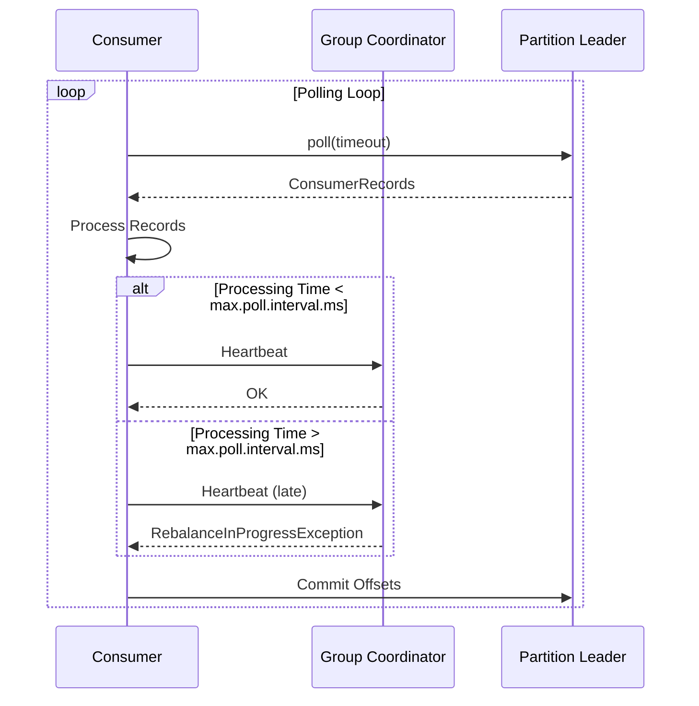
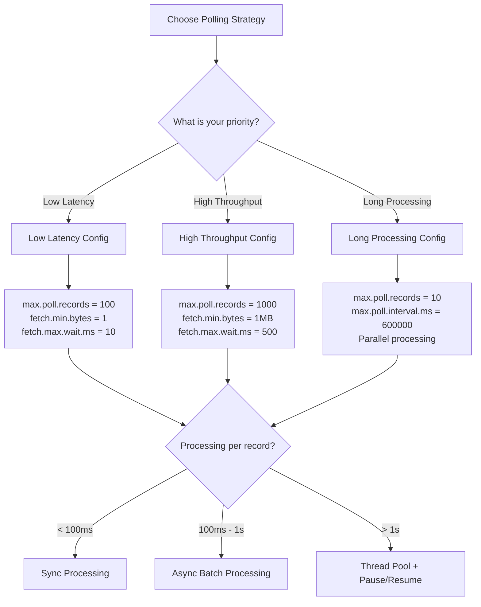

# How to Handle Kafka Consumer Polling Strategy

Author: [nawazdhandala](https://www.github.com/nawazdhandala)

Tags: Apache Kafka, Consumer, Polling, Performance, max.poll.records, max.poll.interval.ms, Throughput Optimization

Description: Learn how to configure and optimize Kafka consumer polling strategies for different workloads, balancing throughput, latency, and resource usage.

---

Kafka consumers use a pull-based model where they actively poll for messages from brokers. The polling strategy directly impacts throughput, latency, and consumer group stability. This guide covers how to configure and optimize your consumer polling for various use cases.

## Understanding Consumer Polling



## Key Polling Configuration Parameters

| Parameter | Default | Description |
|-----------|---------|-------------|
| `max.poll.records` | 500 | Maximum records returned per poll |
| `max.poll.interval.ms` | 300000 (5 min) | Maximum time between polls |
| `fetch.min.bytes` | 1 | Minimum data to fetch per request |
| `fetch.max.wait.ms` | 500 | Maximum wait time for fetch.min.bytes |
| `fetch.max.bytes` | 52428800 (50 MB) | Maximum data per fetch request |
| `max.partition.fetch.bytes` | 1048576 (1 MB) | Maximum data per partition per fetch |

## Basic Polling Patterns

### Simple Polling Loop (Java)

```java
import org.apache.kafka.clients.consumer.*;
import java.time.Duration;
import java.util.*;

public class BasicConsumer {

    public static void main(String[] args) {
        Properties props = new Properties();
        props.put(ConsumerConfig.BOOTSTRAP_SERVERS_CONFIG, "localhost:9092");
        props.put(ConsumerConfig.GROUP_ID_CONFIG, "my-group");
        props.put(ConsumerConfig.KEY_DESERIALIZER_CLASS_CONFIG,
            "org.apache.kafka.common.serialization.StringDeserializer");
        props.put(ConsumerConfig.VALUE_DESERIALIZER_CLASS_CONFIG,
            "org.apache.kafka.common.serialization.StringDeserializer");

        // Polling configuration
        props.put(ConsumerConfig.MAX_POLL_RECORDS_CONFIG, 500);
        props.put(ConsumerConfig.MAX_POLL_INTERVAL_MS_CONFIG, 300000);

        try (KafkaConsumer<String, String> consumer = new KafkaConsumer<>(props)) {
            consumer.subscribe(Collections.singletonList("my-topic"));

            while (true) {
                // Poll with timeout - returns immediately if records available
                ConsumerRecords<String, String> records = consumer.poll(Duration.ofMillis(1000));

                for (ConsumerRecord<String, String> record : records) {
                    processRecord(record);
                }

                // Commit after processing
                consumer.commitSync();
            }
        }
    }

    private static void processRecord(ConsumerRecord<String, String> record) {
        System.out.printf("Received: key=%s, value=%s, partition=%d, offset=%d%n",
            record.key(), record.value(), record.partition(), record.offset());
    }
}
```

## Polling Strategy Patterns

### High Throughput Configuration

For scenarios where you need maximum message processing rate:

```java
import org.apache.kafka.clients.consumer.*;
import java.time.Duration;
import java.util.*;

public class HighThroughputConsumer {

    public static void main(String[] args) {
        Properties props = new Properties();
        props.put(ConsumerConfig.BOOTSTRAP_SERVERS_CONFIG, "localhost:9092");
        props.put(ConsumerConfig.GROUP_ID_CONFIG, "high-throughput-group");
        props.put(ConsumerConfig.KEY_DESERIALIZER_CLASS_CONFIG,
            "org.apache.kafka.common.serialization.StringDeserializer");
        props.put(ConsumerConfig.VALUE_DESERIALIZER_CLASS_CONFIG,
            "org.apache.kafka.common.serialization.StringDeserializer");

        // High throughput settings
        props.put(ConsumerConfig.MAX_POLL_RECORDS_CONFIG, 1000);  // More records per poll
        props.put(ConsumerConfig.FETCH_MIN_BYTES_CONFIG, 1048576);  // 1 MB minimum
        props.put(ConsumerConfig.FETCH_MAX_WAIT_MS_CONFIG, 500);  // Wait up to 500ms for data
        props.put(ConsumerConfig.MAX_PARTITION_FETCH_BYTES_CONFIG, 10485760);  // 10 MB per partition

        // Async commits for better throughput
        props.put(ConsumerConfig.ENABLE_AUTO_COMMIT_CONFIG, false);

        try (KafkaConsumer<String, String> consumer = new KafkaConsumer<>(props)) {
            consumer.subscribe(Collections.singletonList("high-volume-topic"));

            int recordCount = 0;
            long lastCommitTime = System.currentTimeMillis();

            while (true) {
                ConsumerRecords<String, String> records = consumer.poll(Duration.ofMillis(100));

                // Batch process records
                processBatch(records);
                recordCount += records.count();

                // Commit periodically rather than every poll
                if (System.currentTimeMillis() - lastCommitTime > 5000) {
                    consumer.commitAsync((offsets, exception) -> {
                        if (exception != null) {
                            System.err.println("Commit failed: " + exception.getMessage());
                        }
                    });
                    System.out.printf("Committed after processing %d records%n", recordCount);
                    recordCount = 0;
                    lastCommitTime = System.currentTimeMillis();
                }
            }
        }
    }

    private static void processBatch(ConsumerRecords<String, String> records) {
        // Process all records in batch for efficiency
        for (ConsumerRecord<String, String> record : records) {
            // Fast processing logic
        }
    }
}
```

### Low Latency Configuration

For scenarios where you need quick response to new messages:

```java
import org.apache.kafka.clients.consumer.*;
import java.time.Duration;
import java.util.*;

public class LowLatencyConsumer {

    public static void main(String[] args) {
        Properties props = new Properties();
        props.put(ConsumerConfig.BOOTSTRAP_SERVERS_CONFIG, "localhost:9092");
        props.put(ConsumerConfig.GROUP_ID_CONFIG, "low-latency-group");
        props.put(ConsumerConfig.KEY_DESERIALIZER_CLASS_CONFIG,
            "org.apache.kafka.common.serialization.StringDeserializer");
        props.put(ConsumerConfig.VALUE_DESERIALIZER_CLASS_CONFIG,
            "org.apache.kafka.common.serialization.StringDeserializer");

        // Low latency settings
        props.put(ConsumerConfig.MAX_POLL_RECORDS_CONFIG, 100);  // Smaller batches
        props.put(ConsumerConfig.FETCH_MIN_BYTES_CONFIG, 1);  // Return immediately
        props.put(ConsumerConfig.FETCH_MAX_WAIT_MS_CONFIG, 100);  // Minimal wait time
        props.put(ConsumerConfig.MAX_POLL_INTERVAL_MS_CONFIG, 60000);  // 1 minute

        try (KafkaConsumer<String, String> consumer = new KafkaConsumer<>(props)) {
            consumer.subscribe(Collections.singletonList("realtime-events"));

            while (true) {
                // Short poll timeout for responsiveness
                ConsumerRecords<String, String> records = consumer.poll(Duration.ofMillis(50));

                for (ConsumerRecord<String, String> record : records) {
                    // Process each record immediately
                    processWithLogging(record);
                }

                // Commit synchronously for exactly-once semantics
                if (!records.isEmpty()) {
                    consumer.commitSync();
                }
            }
        }
    }

    private static void processWithLogging(ConsumerRecord<String, String> record) {
        long latency = System.currentTimeMillis() - record.timestamp();
        System.out.printf("Processed record with latency: %dms%n", latency);
    }
}
```

### Long Processing Time Pattern

For scenarios where each record takes significant time to process:

```java
import org.apache.kafka.clients.consumer.*;
import java.time.Duration;
import java.util.*;
import java.util.concurrent.*;

public class LongProcessingConsumer {

    private final ExecutorService executor = Executors.newFixedThreadPool(4);
    private final KafkaConsumer<String, String> consumer;
    private volatile boolean running = true;

    public LongProcessingConsumer(Properties props) {
        // Configure for long processing times
        props.put(ConsumerConfig.MAX_POLL_RECORDS_CONFIG, 10);  // Small batches
        props.put(ConsumerConfig.MAX_POLL_INTERVAL_MS_CONFIG, 600000);  // 10 minutes
        props.put(ConsumerConfig.SESSION_TIMEOUT_MS_CONFIG, 30000);
        props.put(ConsumerConfig.HEARTBEAT_INTERVAL_MS_CONFIG, 10000);
        props.put(ConsumerConfig.ENABLE_AUTO_COMMIT_CONFIG, false);

        this.consumer = new KafkaConsumer<>(props);
    }

    public void consume(String topic) {
        consumer.subscribe(Collections.singletonList(topic));

        while (running) {
            ConsumerRecords<String, String> records = consumer.poll(Duration.ofMillis(1000));

            if (records.isEmpty()) {
                continue;
            }

            // Submit all records for parallel processing
            List<Future<?>> futures = new ArrayList<>();
            Map<TopicPartition, OffsetAndMetadata> offsetsToCommit = new ConcurrentHashMap<>();

            for (ConsumerRecord<String, String> record : records) {
                futures.add(executor.submit(() -> {
                    try {
                        // Long-running processing
                        processLongRunning(record);

                        // Track offset for commit
                        TopicPartition tp = new TopicPartition(record.topic(), record.partition());
                        OffsetAndMetadata om = new OffsetAndMetadata(record.offset() + 1);

                        offsetsToCommit.merge(tp, om, (existing, newOffset) ->
                            newOffset.offset() > existing.offset() ? newOffset : existing
                        );
                    } catch (Exception e) {
                        System.err.println("Processing failed: " + e.getMessage());
                    }
                }));
            }

            // Wait for all processing to complete
            for (Future<?> future : futures) {
                try {
                    future.get(5, TimeUnit.MINUTES);
                } catch (Exception e) {
                    System.err.println("Task failed: " + e.getMessage());
                }
            }

            // Commit processed offsets
            if (!offsetsToCommit.isEmpty()) {
                consumer.commitSync(offsetsToCommit);
            }
        }
    }

    private void processLongRunning(ConsumerRecord<String, String> record) throws Exception {
        // Simulate long processing (e.g., ML inference, external API call)
        Thread.sleep(30000);  // 30 seconds
        System.out.printf("Processed record: %s%n", record.key());
    }

    public void shutdown() {
        running = false;
        executor.shutdown();
        consumer.close();
    }
}
```

## Python Consumer Polling Strategies

```python
from confluent_kafka import Consumer, KafkaException
from dataclasses import dataclass
from typing import Callable, List, Optional
import time
import threading
from concurrent.futures import ThreadPoolExecutor, as_completed


@dataclass
class PollingConfig:
    """Configuration for consumer polling behavior"""
    max_poll_records: int = 500
    max_poll_interval_ms: int = 300000
    fetch_min_bytes: int = 1
    fetch_max_wait_ms: int = 500
    poll_timeout_seconds: float = 1.0


class ConfigurableConsumer:
    """Consumer with configurable polling strategies"""

    def __init__(self, bootstrap_servers: str, group_id: str,
                 polling_config: PollingConfig = None):
        self.polling_config = polling_config or PollingConfig()
        self.running = True

        self.config = {
            'bootstrap.servers': bootstrap_servers,
            'group.id': group_id,
            'auto.offset.reset': 'earliest',
            'enable.auto.commit': False,

            # Polling configuration
            'max.poll.interval.ms': self.polling_config.max_poll_interval_ms,
            'fetch.min.bytes': self.polling_config.fetch_min_bytes,
            'fetch.wait.max.ms': self.polling_config.fetch_max_wait_ms,
        }

        self.consumer = Consumer(self.config)

    def consume_simple(self, topic: str, handler: Callable):
        """Simple polling loop with synchronous processing"""
        self.consumer.subscribe([topic])

        while self.running:
            msg = self.consumer.poll(self.polling_config.poll_timeout_seconds)

            if msg is None:
                continue

            if msg.error():
                print(f"Consumer error: {msg.error()}")
                continue

            # Process message
            handler(msg)

            # Commit after each message
            self.consumer.commit(asynchronous=False)

    def consume_batch(self, topic: str, batch_handler: Callable,
                      batch_size: int = 100, batch_timeout_seconds: float = 5.0):
        """
        Batch polling - collect messages and process in batches.
        Good for high throughput with batch-oriented processing.
        """
        self.consumer.subscribe([topic])
        batch = []
        batch_start_time = time.time()

        while self.running:
            msg = self.consumer.poll(0.1)  # Short poll timeout for batching

            if msg is not None and not msg.error():
                batch.append(msg)

            # Process batch when size or time threshold reached
            batch_age = time.time() - batch_start_time
            should_process = (
                len(batch) >= batch_size or
                (batch and batch_age >= batch_timeout_seconds)
            )

            if should_process and batch:
                try:
                    batch_handler(batch)
                    self.consumer.commit(asynchronous=False)
                    print(f"Processed batch of {len(batch)} messages")
                except Exception as e:
                    print(f"Batch processing failed: {e}")
                finally:
                    batch = []
                    batch_start_time = time.time()

    def consume_with_pause_resume(self, topic: str, handler: Callable,
                                  max_in_flight: int = 100):
        """
        Polling with pause/resume for backpressure handling.
        Pauses consumption when processing falls behind.
        """
        self.consumer.subscribe([topic])
        in_flight = 0
        lock = threading.Lock()

        def on_complete():
            nonlocal in_flight
            with lock:
                in_flight -= 1

        executor = ThreadPoolExecutor(max_workers=10)

        while self.running:
            with lock:
                current_in_flight = in_flight

            # Pause if too many in-flight
            if current_in_flight >= max_in_flight:
                partitions = self.consumer.assignment()
                self.consumer.pause(partitions)
                time.sleep(0.1)
                continue

            # Resume if below threshold
            partitions = self.consumer.assignment()
            self.consumer.resume(partitions)

            msg = self.consumer.poll(self.polling_config.poll_timeout_seconds)

            if msg is None or msg.error():
                continue

            with lock:
                in_flight += 1

            # Submit for async processing
            future = executor.submit(self._process_with_callback, msg, handler, on_complete)

        executor.shutdown(wait=True)

    def _process_with_callback(self, msg, handler, callback):
        try:
            handler(msg)
        finally:
            callback()

    def close(self):
        self.running = False
        self.consumer.close()


class HighThroughputConsumer:
    """Optimized for maximum throughput"""

    def __init__(self, bootstrap_servers: str, group_id: str):
        self.config = {
            'bootstrap.servers': bootstrap_servers,
            'group.id': group_id,
            'auto.offset.reset': 'earliest',
            'enable.auto.commit': True,
            'auto.commit.interval.ms': 5000,

            # High throughput settings
            'fetch.min.bytes': 1048576,  # 1 MB
            'fetch.wait.max.ms': 500,
            'max.partition.fetch.bytes': 10485760,  # 10 MB
            'queued.min.messages': 100000,
            'queued.max.messages.kbytes': 65536,  # 64 MB
        }
        self.consumer = Consumer(self.config)
        self.running = True

    def consume(self, topic: str, handler: Callable):
        self.consumer.subscribe([topic])
        messages_processed = 0
        start_time = time.time()

        while self.running:
            msg = self.consumer.poll(0.1)

            if msg is None:
                continue

            if msg.error():
                continue

            handler(msg)
            messages_processed += 1

            # Log throughput every 10 seconds
            elapsed = time.time() - start_time
            if elapsed >= 10:
                rate = messages_processed / elapsed
                print(f"Throughput: {rate:.2f} messages/second")
                messages_processed = 0
                start_time = time.time()

    def close(self):
        self.running = False
        self.consumer.close()


class LowLatencyConsumer:
    """Optimized for minimum latency"""

    def __init__(self, bootstrap_servers: str, group_id: str):
        self.config = {
            'bootstrap.servers': bootstrap_servers,
            'group.id': group_id,
            'auto.offset.reset': 'latest',  # Start from latest for real-time
            'enable.auto.commit': False,

            # Low latency settings
            'fetch.min.bytes': 1,  # Return immediately
            'fetch.wait.max.ms': 10,  # Minimal wait
            'max.poll.interval.ms': 60000,
        }
        self.consumer = Consumer(self.config)
        self.running = True

    def consume(self, topic: str, handler: Callable):
        self.consumer.subscribe([topic])

        while self.running:
            msg = self.consumer.poll(0.01)  # 10ms poll timeout

            if msg is None:
                continue

            if msg.error():
                continue

            # Process and measure latency
            receive_time = time.time() * 1000
            message_time = msg.timestamp()[1]
            latency = receive_time - message_time

            handler(msg)

            # Commit immediately for consistency
            self.consumer.commit(asynchronous=False)

            print(f"End-to-end latency: {latency:.2f}ms")

    def close(self):
        self.running = False
        self.consumer.close()


# Example usage
def main():
    bootstrap_servers = "localhost:9092"

    # High throughput example
    def simple_handler(msg):
        pass  # Fast processing

    print("High Throughput Consumer:")
    high_throughput = HighThroughputConsumer(bootstrap_servers, "high-throughput-group")
    # high_throughput.consume("high-volume-topic", simple_handler)

    # Low latency example
    print("\nLow Latency Consumer:")
    low_latency = LowLatencyConsumer(bootstrap_servers, "low-latency-group")
    # low_latency.consume("realtime-events", simple_handler)

    # Configurable consumer with batching
    print("\nBatch Consumer:")
    config = PollingConfig(
        max_poll_records=1000,
        fetch_min_bytes=1048576,
        poll_timeout_seconds=0.5
    )
    configurable = ConfigurableConsumer(bootstrap_servers, "batch-group", config)

    def batch_handler(messages):
        print(f"Processing batch of {len(messages)} messages")

    # configurable.consume_batch("events", batch_handler, batch_size=100)


if __name__ == '__main__':
    main()
```

## Polling Strategy Decision Flow



## Monitoring Polling Performance

```java
import org.apache.kafka.clients.consumer.*;
import org.apache.kafka.common.metrics.Metrics;
import org.apache.kafka.common.MetricName;

import java.time.Duration;
import java.util.*;
import java.util.concurrent.*;

public class MonitoredConsumer {

    private final KafkaConsumer<String, String> consumer;
    private final ScheduledExecutorService metricsReporter;

    // Custom metrics
    private long totalRecordsProcessed = 0;
    private long totalPollTime = 0;
    private long pollCount = 0;
    private long lastReportTime = System.currentTimeMillis();

    public MonitoredConsumer(Properties props) {
        this.consumer = new KafkaConsumer<>(props);
        this.metricsReporter = Executors.newScheduledThreadPool(1);

        // Start metrics reporting
        metricsReporter.scheduleAtFixedRate(this::reportMetrics, 10, 10, TimeUnit.SECONDS);
    }

    public void consume(String topic) {
        consumer.subscribe(Collections.singletonList(topic));

        while (true) {
            long pollStart = System.currentTimeMillis();
            ConsumerRecords<String, String> records = consumer.poll(Duration.ofMillis(1000));
            long pollDuration = System.currentTimeMillis() - pollStart;

            // Update metrics
            totalPollTime += pollDuration;
            pollCount++;
            totalRecordsProcessed += records.count();

            // Process records
            for (ConsumerRecord<String, String> record : records) {
                processRecord(record);
            }

            consumer.commitAsync();
        }
    }

    private void processRecord(ConsumerRecord<String, String> record) {
        // Processing logic
    }

    private void reportMetrics() {
        long currentTime = System.currentTimeMillis();
        long elapsed = currentTime - lastReportTime;

        if (pollCount > 0) {
            double avgPollTime = (double) totalPollTime / pollCount;
            double recordsPerSecond = (totalRecordsProcessed * 1000.0) / elapsed;
            double recordsPerPoll = (double) totalRecordsProcessed / pollCount;

            System.out.printf(
                "Metrics - Polls: %d, Avg Poll Time: %.2fms, Records/sec: %.2f, Records/poll: %.2f%n",
                pollCount, avgPollTime, recordsPerSecond, recordsPerPoll
            );

            // Access Kafka consumer metrics
            Map<MetricName, ? extends org.apache.kafka.common.Metric> metrics = consumer.metrics();
            for (Map.Entry<MetricName, ? extends org.apache.kafka.common.Metric> entry : metrics.entrySet()) {
                String name = entry.getKey().name();
                if (name.contains("fetch") || name.contains("poll") || name.contains("lag")) {
                    System.out.printf("  %s: %s%n", name, entry.getValue().metricValue());
                }
            }
        }

        // Reset counters
        totalRecordsProcessed = 0;
        totalPollTime = 0;
        pollCount = 0;
        lastReportTime = currentTime;
    }

    public void close() {
        metricsReporter.shutdown();
        consumer.close();
    }
}
```

## Configuration Summary

### For High Throughput

```properties
# Fetch larger batches
max.poll.records=1000
fetch.min.bytes=1048576
fetch.max.wait.ms=500
max.partition.fetch.bytes=10485760

# Async commits
enable.auto.commit=true
auto.commit.interval.ms=5000
```

### For Low Latency

```properties
# Return data immediately
max.poll.records=100
fetch.min.bytes=1
fetch.max.wait.ms=10

# Shorter poll timeout in code
# poll(Duration.ofMillis(50))
```

### For Long Processing

```properties
# Small batches, long intervals
max.poll.records=10
max.poll.interval.ms=600000

# Manual commits after processing
enable.auto.commit=false
```

## Conclusion

Choosing the right polling strategy depends on your specific requirements for throughput, latency, and processing time. Key considerations include:

1. **High throughput**: Increase `max.poll.records` and `fetch.min.bytes`, use async commits
2. **Low latency**: Decrease `fetch.min.bytes` and `fetch.max.wait.ms`, use short poll timeouts
3. **Long processing**: Reduce `max.poll.records`, increase `max.poll.interval.ms`, use parallel processing

Monitor your consumer metrics regularly and adjust configurations based on observed behavior. The right configuration can significantly improve your Kafka application performance.
