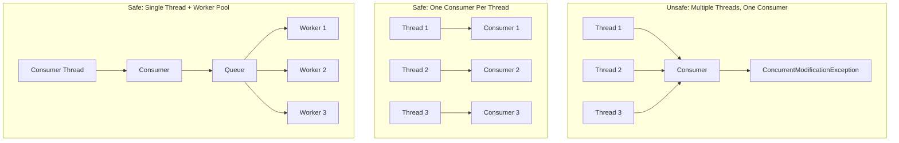
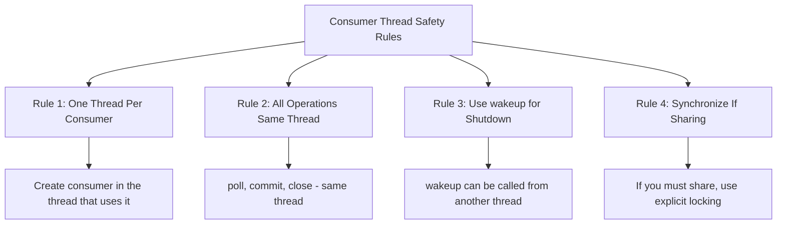

# How to Handle Kafka Consumer Thread Safety

Author: [nawazdhandala](https://www.github.com/nawazdhandala)

Tags: Apache Kafka, Consumer, Thread Safety, Concurrency, Java, Python, Multi-threading

Description: Learn how to safely use Kafka consumers in multi-threaded applications, including patterns for concurrent processing and common pitfalls to avoid.

---

Kafka consumers are not thread-safe. Using a single consumer instance from multiple threads will cause errors and undefined behavior. This guide covers safe patterns for multi-threaded Kafka consumption and concurrent message processing.

## Understanding Consumer Thread Safety

The Kafka consumer documentation clearly states:

> The Kafka consumer is NOT thread-safe. All network I/O happens in the thread of the application making the call. It is the responsibility of the user to ensure that multi-threaded access is properly synchronized.



## Common Thread Safety Violations

### Violation 1: Sharing Consumer Across Threads

```java
// WRONG: This will cause ConcurrentModificationException
public class UnsafeConsumer {
    private final KafkaConsumer<String, String> consumer;

    public UnsafeConsumer(String bootstrapServers, String groupId) {
        Properties props = new Properties();
        props.put(ConsumerConfig.BOOTSTRAP_SERVERS_CONFIG, bootstrapServers);
        props.put(ConsumerConfig.GROUP_ID_CONFIG, groupId);
        props.put(ConsumerConfig.KEY_DESERIALIZER_CLASS_CONFIG,
            "org.apache.kafka.common.serialization.StringDeserializer");
        props.put(ConsumerConfig.VALUE_DESERIALIZER_CLASS_CONFIG,
            "org.apache.kafka.common.serialization.StringDeserializer");

        this.consumer = new KafkaConsumer<>(props);
        this.consumer.subscribe(Collections.singletonList("my-topic"));
    }

    // WRONG: Multiple threads calling poll() on the same consumer
    public void processMessages() {
        while (true) {
            ConsumerRecords<String, String> records = consumer.poll(Duration.ofMillis(100));
            for (ConsumerRecord<String, String> record : records) {
                processRecord(record);  // If this is slow, other threads may call poll()
            }
        }
    }
}
```

### The Exception You Will See

```
java.util.ConcurrentModificationException:
KafkaConsumer is not safe for multi-threaded access.
At most one thread should access the consumer at any given time.
```

## Safe Patterns

### Pattern 1: One Consumer Per Thread

The simplest approach is to create a separate consumer for each thread:

```java
import org.apache.kafka.clients.consumer.*;
import java.util.*;
import java.util.concurrent.*;
import java.time.Duration;

public class ConsumerPerThread {

    private final String bootstrapServers;
    private final String groupId;
    private final String topic;
    private final int numThreads;
    private final List<ConsumerThread> threads;
    private volatile boolean running = true;

    public ConsumerPerThread(String bootstrapServers, String groupId,
                              String topic, int numThreads) {
        this.bootstrapServers = bootstrapServers;
        this.groupId = groupId;
        this.topic = topic;
        this.numThreads = numThreads;
        this.threads = new ArrayList<>();
    }

    /**
     * Start consumers - each thread gets its own consumer instance.
     */
    public void start() {
        for (int i = 0; i < numThreads; i++) {
            ConsumerThread thread = new ConsumerThread(i);
            threads.add(thread);
            thread.start();
        }
    }

    public void shutdown() {
        running = false;
        for (ConsumerThread thread : threads) {
            thread.shutdown();
        }
    }

    private class ConsumerThread extends Thread {
        private final int threadId;
        private KafkaConsumer<String, String> consumer;

        public ConsumerThread(int threadId) {
            this.threadId = threadId;
            setName("consumer-thread-" + threadId);
        }

        @Override
        public void run() {
            // Each thread creates its own consumer
            Properties props = new Properties();
            props.put(ConsumerConfig.BOOTSTRAP_SERVERS_CONFIG, bootstrapServers);
            props.put(ConsumerConfig.GROUP_ID_CONFIG, groupId);
            props.put(ConsumerConfig.KEY_DESERIALIZER_CLASS_CONFIG,
                "org.apache.kafka.common.serialization.StringDeserializer");
            props.put(ConsumerConfig.VALUE_DESERIALIZER_CLASS_CONFIG,
                "org.apache.kafka.common.serialization.StringDeserializer");
            props.put(ConsumerConfig.ENABLE_AUTO_COMMIT_CONFIG, false);

            this.consumer = new KafkaConsumer<>(props);
            consumer.subscribe(Collections.singletonList(topic));

            try {
                while (running) {
                    ConsumerRecords<String, String> records =
                        consumer.poll(Duration.ofMillis(100));

                    for (ConsumerRecord<String, String> record : records) {
                        processRecord(record);
                    }

                    if (!records.isEmpty()) {
                        consumer.commitSync();
                    }
                }
            } finally {
                consumer.close();
            }
        }

        private void processRecord(ConsumerRecord<String, String> record) {
            System.out.printf("Thread %d: partition=%d, offset=%d, value=%s%n",
                threadId, record.partition(), record.offset(), record.value());
        }

        public void shutdown() {
            if (consumer != null) {
                consumer.wakeup();
            }
        }
    }

    public static void main(String[] args) throws InterruptedException {
        ConsumerPerThread consumers = new ConsumerPerThread(
            "localhost:9092", "my-group", "my-topic", 4);

        consumers.start();

        // Run for a while
        Thread.sleep(60000);

        consumers.shutdown();
    }
}
```

### Pattern 2: Single Consumer with Worker Pool

Use one consumer thread that dispatches messages to a worker pool:

```java
import org.apache.kafka.clients.consumer.*;
import org.apache.kafka.common.TopicPartition;
import java.util.*;
import java.util.concurrent.*;
import java.time.Duration;

public class ConsumerWithWorkerPool {

    private final KafkaConsumer<String, String> consumer;
    private final ExecutorService workerPool;
    private final BlockingQueue<ConsumerRecord<String, String>> workQueue;
    private final Map<TopicPartition, Long> offsets;
    private volatile boolean running = true;
    private final int numWorkers;

    public ConsumerWithWorkerPool(String bootstrapServers, String groupId,
                                   String topic, int numWorkers) {
        Properties props = new Properties();
        props.put(ConsumerConfig.BOOTSTRAP_SERVERS_CONFIG, bootstrapServers);
        props.put(ConsumerConfig.GROUP_ID_CONFIG, groupId);
        props.put(ConsumerConfig.KEY_DESERIALIZER_CLASS_CONFIG,
            "org.apache.kafka.common.serialization.StringDeserializer");
        props.put(ConsumerConfig.VALUE_DESERIALIZER_CLASS_CONFIG,
            "org.apache.kafka.common.serialization.StringDeserializer");
        props.put(ConsumerConfig.ENABLE_AUTO_COMMIT_CONFIG, false);
        props.put(ConsumerConfig.MAX_POLL_RECORDS_CONFIG, 500);

        this.consumer = new KafkaConsumer<>(props);
        this.consumer.subscribe(Collections.singletonList(topic));

        this.numWorkers = numWorkers;
        this.workerPool = Executors.newFixedThreadPool(numWorkers);
        this.workQueue = new LinkedBlockingQueue<>(10000);
        this.offsets = new ConcurrentHashMap<>();
    }

    /**
     * Start the consumer and worker threads.
     */
    public void start() {
        // Start worker threads
        for (int i = 0; i < numWorkers; i++) {
            workerPool.submit(this::workerLoop);
        }

        // Start consumer thread
        Thread consumerThread = new Thread(this::consumerLoop, "consumer-thread");
        consumerThread.start();
    }

    /**
     * Consumer loop - polls and dispatches to workers.
     * Only this thread accesses the consumer.
     */
    private void consumerLoop() {
        try {
            while (running) {
                ConsumerRecords<String, String> records =
                    consumer.poll(Duration.ofMillis(100));

                for (ConsumerRecord<String, String> record : records) {
                    // Block if queue is full (backpressure)
                    while (!workQueue.offer(record, 100, TimeUnit.MILLISECONDS)) {
                        if (!running) return;
                    }
                }

                // Commit processed offsets periodically
                commitProcessedOffsets();
            }
        } catch (InterruptedException e) {
            Thread.currentThread().interrupt();
        } finally {
            consumer.close();
        }
    }

    /**
     * Worker loop - processes messages from queue.
     */
    private void workerLoop() {
        while (running) {
            try {
                ConsumerRecord<String, String> record =
                    workQueue.poll(100, TimeUnit.MILLISECONDS);

                if (record != null) {
                    processRecord(record);
                    trackOffset(record);
                }
            } catch (InterruptedException e) {
                Thread.currentThread().interrupt();
                break;
            } catch (Exception e) {
                System.err.println("Worker error: " + e.getMessage());
            }
        }
    }

    private void processRecord(ConsumerRecord<String, String> record) {
        // Simulate processing
        System.out.printf("Processing: partition=%d, offset=%d%n",
            record.partition(), record.offset());
    }

    /**
     * Track the latest processed offset for each partition.
     */
    private void trackOffset(ConsumerRecord<String, String> record) {
        TopicPartition tp = new TopicPartition(record.topic(), record.partition());
        offsets.merge(tp, record.offset() + 1, Math::max);
    }

    /**
     * Commit offsets that have been processed.
     * Only called from consumer thread.
     */
    private void commitProcessedOffsets() {
        if (offsets.isEmpty()) return;

        Map<TopicPartition, OffsetAndMetadata> toCommit = new HashMap<>();
        for (Map.Entry<TopicPartition, Long> entry : offsets.entrySet()) {
            toCommit.put(entry.getKey(), new OffsetAndMetadata(entry.getValue()));
        }

        consumer.commitSync(toCommit);
        offsets.clear();
    }

    public void shutdown() {
        running = false;
        workerPool.shutdown();
        try {
            workerPool.awaitTermination(30, TimeUnit.SECONDS);
        } catch (InterruptedException e) {
            Thread.currentThread().interrupt();
        }
    }
}
```

### Pattern 3: Partition-Based Threading

Assign partitions to dedicated threads for ordered processing:

```java
import org.apache.kafka.clients.consumer.*;
import org.apache.kafka.common.TopicPartition;
import java.util.*;
import java.util.concurrent.*;
import java.time.Duration;

public class PartitionBasedThreading {

    private final String bootstrapServers;
    private final String groupId;
    private final String topic;
    private final Map<Integer, PartitionProcessor> processors;
    private final ExecutorService executor;
    private KafkaConsumer<String, String> consumer;
    private volatile boolean running = true;

    public PartitionBasedThreading(String bootstrapServers, String groupId, String topic) {
        this.bootstrapServers = bootstrapServers;
        this.groupId = groupId;
        this.topic = topic;
        this.processors = new ConcurrentHashMap<>();
        this.executor = Executors.newCachedThreadPool();
    }

    public void start() {
        Properties props = new Properties();
        props.put(ConsumerConfig.BOOTSTRAP_SERVERS_CONFIG, bootstrapServers);
        props.put(ConsumerConfig.GROUP_ID_CONFIG, groupId);
        props.put(ConsumerConfig.KEY_DESERIALIZER_CLASS_CONFIG,
            "org.apache.kafka.common.serialization.StringDeserializer");
        props.put(ConsumerConfig.VALUE_DESERIALIZER_CLASS_CONFIG,
            "org.apache.kafka.common.serialization.StringDeserializer");
        props.put(ConsumerConfig.ENABLE_AUTO_COMMIT_CONFIG, false);

        consumer = new KafkaConsumer<>(props);

        // Subscribe with rebalance listener
        consumer.subscribe(Collections.singletonList(topic), new ConsumerRebalanceListener() {
            @Override
            public void onPartitionsRevoked(Collection<TopicPartition> partitions) {
                for (TopicPartition tp : partitions) {
                    PartitionProcessor processor = processors.remove(tp.partition());
                    if (processor != null) {
                        processor.shutdown();
                    }
                }
            }

            @Override
            public void onPartitionsAssigned(Collection<TopicPartition> partitions) {
                for (TopicPartition tp : partitions) {
                    PartitionProcessor processor = new PartitionProcessor(tp.partition());
                    processors.put(tp.partition(), processor);
                    executor.submit(processor);
                }
            }
        });

        // Main poll loop
        Thread pollThread = new Thread(this::pollLoop, "poll-thread");
        pollThread.start();
    }

    private void pollLoop() {
        while (running) {
            ConsumerRecords<String, String> records = consumer.poll(Duration.ofMillis(100));

            // Dispatch records to partition processors
            for (ConsumerRecord<String, String> record : records) {
                PartitionProcessor processor = processors.get(record.partition());
                if (processor != null) {
                    processor.enqueue(record);
                }
            }

            // Commit offsets
            if (!records.isEmpty()) {
                consumer.commitAsync();
            }
        }

        consumer.close();
    }

    public void shutdown() {
        running = false;
        for (PartitionProcessor processor : processors.values()) {
            processor.shutdown();
        }
        executor.shutdown();
    }

    /**
     * Processes messages for a single partition.
     * Guarantees ordering within the partition.
     */
    private static class PartitionProcessor implements Runnable {
        private final int partition;
        private final BlockingQueue<ConsumerRecord<String, String>> queue;
        private volatile boolean running = true;

        public PartitionProcessor(int partition) {
            this.partition = partition;
            this.queue = new LinkedBlockingQueue<>(1000);
        }

        public void enqueue(ConsumerRecord<String, String> record) {
            try {
                queue.put(record);
            } catch (InterruptedException e) {
                Thread.currentThread().interrupt();
            }
        }

        @Override
        public void run() {
            while (running) {
                try {
                    ConsumerRecord<String, String> record =
                        queue.poll(100, TimeUnit.MILLISECONDS);

                    if (record != null) {
                        process(record);
                    }
                } catch (InterruptedException e) {
                    Thread.currentThread().interrupt();
                    break;
                }
            }
        }

        private void process(ConsumerRecord<String, String> record) {
            System.out.printf("Partition %d: offset=%d, value=%s%n",
                partition, record.offset(), record.value());
        }

        public void shutdown() {
            running = false;
        }
    }
}
```

## Python Thread-Safe Patterns

```python
from confluent_kafka import Consumer, KafkaError
import threading
from queue import Queue, Empty
from typing import Callable, List
import logging
from concurrent.futures import ThreadPoolExecutor
import time

logging.basicConfig(level=logging.INFO)
logger = logging.getLogger(__name__)


class ConsumerPerThread:
    """
    Pattern 1: One consumer per thread.
    Each thread has its own consumer instance.
    """

    def __init__(self, bootstrap_servers: str, group_id: str,
                 topics: List[str], num_threads: int):
        self.bootstrap_servers = bootstrap_servers
        self.group_id = group_id
        self.topics = topics
        self.num_threads = num_threads
        self.threads: List[threading.Thread] = []
        self.running = True

    def _create_config(self) -> dict:
        return {
            'bootstrap.servers': self.bootstrap_servers,
            'group.id': self.group_id,
            'auto.offset.reset': 'earliest',
            'enable.auto.commit': False
        }

    def _consumer_thread(self, thread_id: int, handler: Callable):
        """
        Consumer thread - each thread has its own consumer.
        """
        # Create consumer in this thread
        consumer = Consumer(self._create_config())
        consumer.subscribe(self.topics)

        logger.info(f"Consumer thread {thread_id} started")

        try:
            while self.running:
                msg = consumer.poll(timeout=1.0)

                if msg is None:
                    continue

                if msg.error():
                    if msg.error().code() != KafkaError._PARTITION_EOF:
                        logger.error(f"Consumer error: {msg.error()}")
                    continue

                # Process message
                try:
                    handler(msg, thread_id)
                    consumer.commit(msg)
                except Exception as e:
                    logger.error(f"Processing error: {e}")

        finally:
            consumer.close()
            logger.info(f"Consumer thread {thread_id} stopped")

    def start(self, handler: Callable):
        """Start all consumer threads."""
        for i in range(self.num_threads):
            thread = threading.Thread(
                target=self._consumer_thread,
                args=(i, handler),
                name=f"consumer-{i}"
            )
            thread.start()
            self.threads.append(thread)

    def stop(self):
        """Stop all consumer threads."""
        self.running = False
        for thread in self.threads:
            thread.join(timeout=10)


class SingleConsumerWithWorkers:
    """
    Pattern 2: Single consumer with worker pool.
    One thread polls, workers process.
    """

    def __init__(self, bootstrap_servers: str, group_id: str,
                 topics: List[str], num_workers: int):
        self.config = {
            'bootstrap.servers': bootstrap_servers,
            'group.id': group_id,
            'auto.offset.reset': 'earliest',
            'enable.auto.commit': False,
            'max.poll.records': 500
        }
        self.topics = topics
        self.num_workers = num_workers
        self.work_queue = Queue(maxsize=10000)
        self.running = True
        self.consumer = None
        self.executor = ThreadPoolExecutor(max_workers=num_workers)

    def _worker(self, worker_id: int, handler: Callable):
        """Worker thread that processes messages from queue."""
        logger.info(f"Worker {worker_id} started")

        while self.running:
            try:
                msg = self.work_queue.get(timeout=1.0)
                handler(msg, worker_id)
            except Empty:
                continue
            except Exception as e:
                logger.error(f"Worker {worker_id} error: {e}")

        logger.info(f"Worker {worker_id} stopped")

    def _consumer_loop(self):
        """Consumer thread - only this thread accesses the consumer."""
        self.consumer = Consumer(self.config)
        self.consumer.subscribe(self.topics)

        logger.info("Consumer loop started")

        try:
            while self.running:
                msg = self.consumer.poll(timeout=0.1)

                if msg is None:
                    continue

                if msg.error():
                    if msg.error().code() != KafkaError._PARTITION_EOF:
                        logger.error(f"Consumer error: {msg.error()}")
                    continue

                # Dispatch to worker queue
                try:
                    self.work_queue.put(msg, timeout=5.0)
                except Exception:
                    logger.warning("Queue full, applying backpressure")

                # Commit periodically
                if self.work_queue.qsize() < 5000:
                    self.consumer.commit(asynchronous=True)

        finally:
            self.consumer.close()
            logger.info("Consumer loop stopped")

    def start(self, handler: Callable):
        """Start consumer and workers."""
        # Start workers
        for i in range(self.num_workers):
            self.executor.submit(self._worker, i, handler)

        # Start consumer thread
        consumer_thread = threading.Thread(
            target=self._consumer_loop,
            name="consumer-thread"
        )
        consumer_thread.start()

    def stop(self):
        """Stop consumer and workers."""
        self.running = False
        self.executor.shutdown(wait=True)


class ThreadSafeConsumerWrapper:
    """
    Thread-safe wrapper that synchronizes access to consumer.
    Use only when you must share a consumer (not recommended).
    """

    def __init__(self, bootstrap_servers: str, group_id: str, topics: List[str]):
        self.config = {
            'bootstrap.servers': bootstrap_servers,
            'group.id': group_id,
            'auto.offset.reset': 'earliest',
            'enable.auto.commit': False
        }
        self.topics = topics
        self.consumer = Consumer(self.config)
        self.consumer.subscribe(topics)
        self.lock = threading.Lock()

    def poll(self, timeout: float = 1.0):
        """Thread-safe poll."""
        with self.lock:
            return self.consumer.poll(timeout=timeout)

    def commit(self, msg=None):
        """Thread-safe commit."""
        with self.lock:
            if msg:
                self.consumer.commit(msg)
            else:
                self.consumer.commit()

    def close(self):
        """Thread-safe close."""
        with self.lock:
            self.consumer.close()


# Example usage
def example_handler(msg, worker_id: int):
    """Example message handler."""
    logger.info(f"Worker {worker_id}: {msg.partition()}/{msg.offset()}")
    time.sleep(0.01)  # Simulate processing


if __name__ == '__main__':
    # Example 1: Consumer per thread
    consumer_per_thread = ConsumerPerThread(
        'localhost:9092', 'my-group', ['my-topic'], num_threads=4
    )
    consumer_per_thread.start(example_handler)

    # Run for a while
    time.sleep(60)

    consumer_per_thread.stop()
```

## Thread Safety Rules



## Best Practices

1. **Never share a consumer** across threads without synchronization
2. **Create consumers in the thread** that will use them
3. **Use `wakeup()`** to safely interrupt a consumer from another thread
4. **Choose the right pattern** based on your ordering requirements
5. **Monitor queue depths** when using worker pools
6. **Handle rebalances** properly when using partition-based threading

## Conclusion

Kafka consumers are not thread-safe, but there are several safe patterns for concurrent consumption. The consumer-per-thread pattern is simplest and works well when you have fewer partitions than threads. The single-consumer-with-workers pattern provides better throughput for I/O-bound processing. The partition-based pattern maintains ordering within partitions while allowing parallel processing. Choose the pattern that best fits your ordering and throughput requirements.
