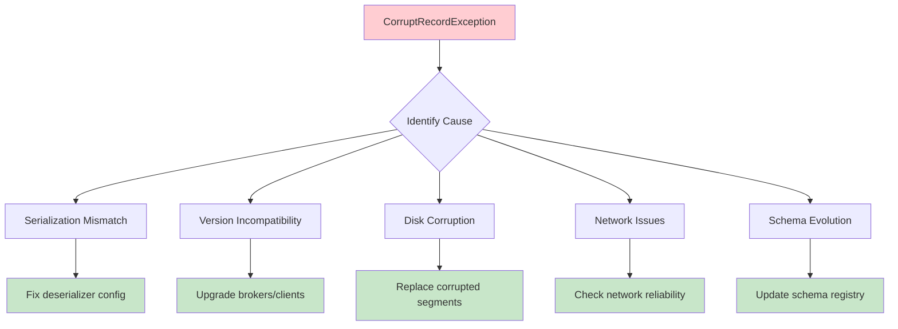
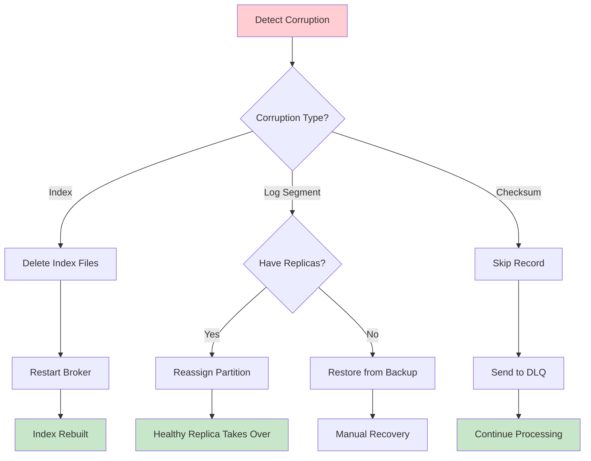

# How to Fix 'CorruptRecordException' in Kafka

Author: [nawazdhandala](https://github.com/nawazdhandala)

Tags: Apache Kafka, Troubleshooting, Error Handling, Data Integrity, DevOps, Streaming

Description: Learn how to diagnose and fix CorruptRecordException errors in Kafka, including causes like serialization issues, version mismatches, and disk corruption.

---

CorruptRecordException is one of the most frustrating errors in Kafka. It occurs when Kafka cannot properly read a record due to data corruption, serialization mismatches, or checksum failures. This guide covers how to identify the root cause and implement fixes to prevent data loss.

## Understanding CorruptRecordException



## Common Causes and Solutions

### 1. Serialization/Deserialization Mismatch

The most common cause is a mismatch between how messages were serialized and how you are trying to deserialize them.

```java
// WRONG: Trying to deserialize Avro data with String deserializer
Properties wrongProps = new Properties();
wrongProps.put(ConsumerConfig.VALUE_DESERIALIZER_CLASS_CONFIG,
    StringDeserializer.class.getName()); // This will fail for Avro data

// CORRECT: Use matching deserializer for your data format
public class DeserializerConfiguration {

    // For String data
    public static Properties stringConfig() {
        Properties props = new Properties();
        props.put(ConsumerConfig.BOOTSTRAP_SERVERS_CONFIG, "kafka:9092");
        props.put(ConsumerConfig.KEY_DESERIALIZER_CLASS_CONFIG,
            StringDeserializer.class.getName());
        props.put(ConsumerConfig.VALUE_DESERIALIZER_CLASS_CONFIG,
            StringDeserializer.class.getName());
        return props;
    }

    // For Avro data with Schema Registry
    public static Properties avroConfig() {
        Properties props = new Properties();
        props.put(ConsumerConfig.BOOTSTRAP_SERVERS_CONFIG, "kafka:9092");
        props.put(ConsumerConfig.KEY_DESERIALIZER_CLASS_CONFIG,
            StringDeserializer.class.getName());
        props.put(ConsumerConfig.VALUE_DESERIALIZER_CLASS_CONFIG,
            KafkaAvroDeserializer.class.getName());
        props.put("schema.registry.url", "http://schema-registry:8081");
        return props;
    }

    // For JSON data
    public static Properties jsonConfig() {
        Properties props = new Properties();
        props.put(ConsumerConfig.BOOTSTRAP_SERVERS_CONFIG, "kafka:9092");
        props.put(ConsumerConfig.KEY_DESERIALIZER_CLASS_CONFIG,
            StringDeserializer.class.getName());
        props.put(ConsumerConfig.VALUE_DESERIALIZER_CLASS_CONFIG,
            JsonDeserializer.class.getName());
        props.put(JsonDeserializer.TRUSTED_PACKAGES, "*");
        return props;
    }

    // For Protobuf data
    public static Properties protobufConfig() {
        Properties props = new Properties();
        props.put(ConsumerConfig.BOOTSTRAP_SERVERS_CONFIG, "kafka:9092");
        props.put(ConsumerConfig.KEY_DESERIALIZER_CLASS_CONFIG,
            StringDeserializer.class.getName());
        props.put(ConsumerConfig.VALUE_DESERIALIZER_CLASS_CONFIG,
            KafkaProtobufDeserializer.class.getName());
        props.put("schema.registry.url", "http://schema-registry:8081");
        return props;
    }
}
```

### 2. Error-Tolerant Deserialization

Implement a custom deserializer that handles corrupt records gracefully instead of crashing.

```java
// Error-tolerant deserializer that logs and skips corrupt records
public class ErrorTolerantDeserializer<T> implements Deserializer<T> {

    private final Deserializer<T> delegate;
    private final Counter corruptRecordCounter;

    public ErrorTolerantDeserializer(Deserializer<T> delegate,
                                      MeterRegistry meterRegistry) {
        this.delegate = delegate;
        this.corruptRecordCounter = meterRegistry.counter(
            "kafka.deserializer.corrupt.records");
    }

    @Override
    public void configure(Map<String, ?> configs, boolean isKey) {
        delegate.configure(configs, isKey);
    }

    @Override
    public T deserialize(String topic, byte[] data) {
        if (data == null) {
            return null;
        }

        try {
            return delegate.deserialize(topic, data);
        } catch (Exception e) {
            // Log the corruption but do not crash
            corruptRecordCounter.increment();

            System.err.println("Failed to deserialize record from topic " + topic +
                ": " + e.getMessage());
            System.err.println("Raw data (first 100 bytes): " +
                bytesToHex(data, 100));

            // Return null to skip this record
            // Consumer must handle null values
            return null;
        }
    }

    @Override
    public T deserialize(String topic, Headers headers, byte[] data) {
        if (data == null) {
            return null;
        }

        try {
            return delegate.deserialize(topic, headers, data);
        } catch (Exception e) {
            corruptRecordCounter.increment();

            // Log with headers for debugging
            System.err.println("Failed to deserialize record from topic " + topic);
            System.err.println("Headers: " + headersToString(headers));
            System.err.println("Error: " + e.getMessage());

            return null;
        }
    }

    @Override
    public void close() {
        delegate.close();
    }

    private String bytesToHex(byte[] data, int maxBytes) {
        StringBuilder sb = new StringBuilder();
        int limit = Math.min(data.length, maxBytes);
        for (int i = 0; i < limit; i++) {
            sb.append(String.format("%02x ", data[i]));
        }
        if (data.length > maxBytes) {
            sb.append("...");
        }
        return sb.toString();
    }

    private String headersToString(Headers headers) {
        StringBuilder sb = new StringBuilder();
        for (Header header : headers) {
            sb.append(header.key()).append("=")
              .append(new String(header.value())).append(", ");
        }
        return sb.toString();
    }
}
```

### 3. Dead Letter Queue for Corrupt Records

Instead of losing corrupt records, send them to a dead letter queue for manual inspection and recovery.

```java
// Dead letter queue handler for corrupt records
public class DeadLetterQueueHandler<K, V> {

    private final KafkaProducer<byte[], byte[]> dlqProducer;
    private final String dlqTopic;
    private final Counter dlqCounter;

    public DeadLetterQueueHandler(String bootstrapServers, String dlqTopic,
                                   MeterRegistry meterRegistry) {
        this.dlqTopic = dlqTopic;
        this.dlqCounter = meterRegistry.counter("kafka.dlq.records");

        Properties props = new Properties();
        props.put(ProducerConfig.BOOTSTRAP_SERVERS_CONFIG, bootstrapServers);
        props.put(ProducerConfig.KEY_SERIALIZER_CLASS_CONFIG,
            ByteArraySerializer.class.getName());
        props.put(ProducerConfig.VALUE_SERIALIZER_CLASS_CONFIG,
            ByteArraySerializer.class.getName());

        this.dlqProducer = new KafkaProducer<>(props);
    }

    // Send corrupt record to DLQ with metadata
    public void sendToDeadLetterQueue(ConsumerRecord<byte[], byte[]> record,
                                       Exception error) {
        try {
            // Create DLQ record with original data and error metadata
            ProducerRecord<byte[], byte[]> dlqRecord = new ProducerRecord<>(
                dlqTopic,
                null, // partition
                record.key(),
                record.value()
            );

            // Add headers with error context
            dlqRecord.headers()
                .add("dlq.original.topic", record.topic().getBytes())
                .add("dlq.original.partition",
                    String.valueOf(record.partition()).getBytes())
                .add("dlq.original.offset",
                    String.valueOf(record.offset()).getBytes())
                .add("dlq.original.timestamp",
                    String.valueOf(record.timestamp()).getBytes())
                .add("dlq.error.message", error.getMessage().getBytes())
                .add("dlq.error.class", error.getClass().getName().getBytes())
                .add("dlq.timestamp",
                    String.valueOf(System.currentTimeMillis()).getBytes());

            // Copy original headers
            for (Header header : record.headers()) {
                dlqRecord.headers().add("dlq.original.header." + header.key(),
                    header.value());
            }

            dlqProducer.send(dlqRecord, (metadata, exception) -> {
                if (exception != null) {
                    System.err.println("Failed to send to DLQ: " +
                        exception.getMessage());
                } else {
                    dlqCounter.increment();
                    System.out.println("Sent corrupt record to DLQ: " +
                        metadata.topic() + "-" + metadata.partition() +
                        "@" + metadata.offset());
                }
            });

        } catch (Exception e) {
            System.err.println("Error sending to DLQ: " + e.getMessage());
        }
    }

    public void close() {
        dlqProducer.close();
    }
}
```

### 4. Consumer with Corruption Handling

Complete consumer implementation that handles corrupt records gracefully.

```java
// Consumer that handles corrupt records with DLQ
public class CorruptionTolerantConsumer {

    private final KafkaConsumer<byte[], byte[]> consumer;
    private final Deserializer<String> keyDeserializer;
    private final Deserializer<Object> valueDeserializer;
    private final DeadLetterQueueHandler<String, Object> dlqHandler;
    private volatile boolean running = true;

    public CorruptionTolerantConsumer(String bootstrapServers,
                                       String groupId,
                                       String topic,
                                       String dlqTopic,
                                       MeterRegistry meterRegistry) {
        // Use byte array deserializers at consumer level
        // Deserialize manually to catch errors
        Properties props = new Properties();
        props.put(ConsumerConfig.BOOTSTRAP_SERVERS_CONFIG, bootstrapServers);
        props.put(ConsumerConfig.GROUP_ID_CONFIG, groupId);
        props.put(ConsumerConfig.KEY_DESERIALIZER_CLASS_CONFIG,
            ByteArrayDeserializer.class.getName());
        props.put(ConsumerConfig.VALUE_DESERIALIZER_CLASS_CONFIG,
            ByteArrayDeserializer.class.getName());
        props.put(ConsumerConfig.ENABLE_AUTO_COMMIT_CONFIG, "false");

        this.consumer = new KafkaConsumer<>(props);
        this.consumer.subscribe(Collections.singletonList(topic));

        // Initialize actual deserializers
        this.keyDeserializer = new StringDeserializer();
        this.valueDeserializer = new KafkaAvroDeserializer();

        Map<String, Object> deserializerConfig = new HashMap<>();
        deserializerConfig.put("schema.registry.url",
            "http://schema-registry:8081");
        this.valueDeserializer.configure(deserializerConfig, false);

        this.dlqHandler = new DeadLetterQueueHandler<>(
            bootstrapServers, dlqTopic, meterRegistry);
    }

    public void consume() {
        try {
            while (running) {
                ConsumerRecords<byte[], byte[]> records =
                    consumer.poll(Duration.ofMillis(1000));

                for (ConsumerRecord<byte[], byte[]> record : records) {
                    processRecord(record);
                }

                consumer.commitSync();
            }
        } finally {
            consumer.close();
            dlqHandler.close();
        }
    }

    private void processRecord(ConsumerRecord<byte[], byte[]> record) {
        String key = null;
        Object value = null;

        // Deserialize key
        try {
            if (record.key() != null) {
                key = keyDeserializer.deserialize(record.topic(), record.key());
            }
        } catch (Exception e) {
            System.err.println("Failed to deserialize key: " + e.getMessage());
            dlqHandler.sendToDeadLetterQueue(record, e);
            return;
        }

        // Deserialize value
        try {
            if (record.value() != null) {
                value = valueDeserializer.deserialize(
                    record.topic(), record.headers(), record.value());
            }
        } catch (Exception e) {
            System.err.println("Failed to deserialize value: " + e.getMessage());
            dlqHandler.sendToDeadLetterQueue(record, e);
            return;
        }

        // Process the successfully deserialized record
        try {
            handleRecord(key, value, record);
        } catch (Exception e) {
            System.err.println("Failed to process record: " + e.getMessage());
            dlqHandler.sendToDeadLetterQueue(record, e);
        }
    }

    private void handleRecord(String key, Object value,
                               ConsumerRecord<byte[], byte[]> record) {
        // Your business logic here
        System.out.println("Processing: " + key + " -> " + value);
    }

    public void shutdown() {
        running = false;
    }
}
```

## Diagnosing Corruption at the Broker Level

### Check Log Segments

```bash
#!/bin/bash
# Check Kafka log segments for corruption

KAFKA_HOME="/opt/kafka"
LOG_DIR="/var/kafka-logs"
TOPIC="your-topic"
PARTITION="0"

# Dump log segment to check for corruption
$KAFKA_HOME/bin/kafka-dump-log.sh \
    --files $LOG_DIR/$TOPIC-$PARTITION/00000000000000000000.log \
    --print-data-log \
    --deep-iteration

# Verify log segment integrity
$KAFKA_HOME/bin/kafka-dump-log.sh \
    --files $LOG_DIR/$TOPIC-$PARTITION/00000000000000000000.log \
    --verify-index-only

# Check for index corruption
$KAFKA_HOME/bin/kafka-dump-log.sh \
    --files $LOG_DIR/$TOPIC-$PARTITION/00000000000000000000.index \
    --print-data-log
```

### Rebuild Corrupted Indexes

```bash
#!/bin/bash
# Rebuild corrupted index files

KAFKA_HOME="/opt/kafka"
LOG_DIR="/var/kafka-logs"
TOPIC="your-topic"
PARTITION="0"

# Stop the broker first
systemctl stop kafka

# Remove corrupted index files
# Kafka will rebuild them on startup
rm -f $LOG_DIR/$TOPIC-$PARTITION/*.index
rm -f $LOG_DIR/$TOPIC-$PARTITION/*.timeindex

# Start the broker
systemctl start kafka

# Verify indexes are rebuilt
ls -la $LOG_DIR/$TOPIC-$PARTITION/
```

## Handling Schema Evolution Issues

Schema changes can cause deserialization failures. Use proper schema evolution with backward/forward compatibility.

```java
// Schema registry client for handling schema evolution
public class SchemaEvolutionHandler {

    private final SchemaRegistryClient schemaRegistry;
    private final Map<Integer, Schema> schemaCache;

    public SchemaEvolutionHandler(String schemaRegistryUrl) {
        this.schemaRegistry = new CachedSchemaRegistryClient(
            schemaRegistryUrl, 100);
        this.schemaCache = new ConcurrentHashMap<>();
    }

    // Get schema by ID (cached)
    public Schema getSchema(int schemaId) throws Exception {
        return schemaCache.computeIfAbsent(schemaId, id -> {
            try {
                return schemaRegistry.getById(id);
            } catch (Exception e) {
                throw new RuntimeException("Failed to get schema: " + id, e);
            }
        });
    }

    // Deserialize with schema evolution support
    public GenericRecord deserializeWithEvolution(String topic, byte[] data,
                                                   Schema readerSchema)
            throws Exception {

        if (data == null || data.length < 5) {
            throw new IllegalArgumentException("Invalid data length");
        }

        // First byte is magic byte (0)
        // Next 4 bytes are schema ID
        ByteBuffer buffer = ByteBuffer.wrap(data);
        byte magicByte = buffer.get();

        if (magicByte != 0) {
            throw new CorruptRecordException(
                "Unknown magic byte: " + magicByte);
        }

        int writerSchemaId = buffer.getInt();
        Schema writerSchema = getSchema(writerSchemaId);

        // Check compatibility
        if (!isCompatible(writerSchema, readerSchema)) {
            System.out.println("Schema evolution detected: v" + writerSchemaId +
                " -> current");
        }

        // Deserialize with schema resolution
        byte[] avroData = new byte[data.length - 5];
        buffer.get(avroData);

        DatumReader<GenericRecord> reader = new GenericDatumReader<>(
            writerSchema, readerSchema);
        Decoder decoder = DecoderFactory.get().binaryDecoder(avroData, null);

        return reader.read(null, decoder);
    }

    private boolean isCompatible(Schema writer, Schema reader) {
        // Implement compatibility check logic
        SchemaValidator validator = SchemaValidatorBuilder.builder()
            .canReadStrategy()
            .validateLatest();

        try {
            validator.validate(reader, Collections.singletonList(writer));
            return true;
        } catch (SchemaValidationException e) {
            return false;
        }
    }
}
```

## Preventing Corruption

### Producer-Side Validation

```java
// Validate messages before sending to prevent corruption
public class ValidatingProducer<K, V> {

    private final KafkaProducer<K, V> producer;
    private final Validator<V> validator;
    private final Counter validationFailures;

    public ValidatingProducer(Properties props, Validator<V> validator,
                               MeterRegistry meterRegistry) {
        this.producer = new KafkaProducer<>(props);
        this.validator = validator;
        this.validationFailures = meterRegistry.counter(
            "kafka.producer.validation.failures");
    }

    public Future<RecordMetadata> send(ProducerRecord<K, V> record) {
        // Validate before sending
        ValidationResult result = validator.validate(record.value());

        if (!result.isValid()) {
            validationFailures.increment();
            throw new IllegalArgumentException(
                "Invalid record: " + result.getErrors());
        }

        // Add checksum header for additional integrity check
        byte[] checksum = calculateChecksum(record.value());
        record.headers().add("checksum", checksum);

        return producer.send(record);
    }

    private byte[] calculateChecksum(V value) {
        try {
            MessageDigest md = MessageDigest.getInstance("MD5");
            // Serialize value and calculate checksum
            // Implementation depends on your serialization format
            return md.digest(value.toString().getBytes());
        } catch (NoSuchAlgorithmException e) {
            throw new RuntimeException(e);
        }
    }

    public void close() {
        producer.close();
    }
}

interface Validator<V> {
    ValidationResult validate(V value);
}

class ValidationResult {
    private final boolean valid;
    private final List<String> errors;

    public ValidationResult(boolean valid, List<String> errors) {
        this.valid = valid;
        this.errors = errors;
    }

    public boolean isValid() { return valid; }
    public List<String> getErrors() { return errors; }
}
```

### Consumer-Side Checksum Verification

```java
// Verify checksums on consumer side
public class ChecksumVerifyingConsumer {

    public boolean verifyChecksum(ConsumerRecord<String, byte[]> record) {
        // Get checksum from header
        Header checksumHeader = record.headers().lastHeader("checksum");

        if (checksumHeader == null) {
            // No checksum, skip verification
            return true;
        }

        byte[] expectedChecksum = checksumHeader.value();
        byte[] actualChecksum = calculateChecksum(record.value());

        if (!Arrays.equals(expectedChecksum, actualChecksum)) {
            System.err.println("Checksum mismatch for record at offset " +
                record.offset());
            System.err.println("Expected: " + bytesToHex(expectedChecksum));
            System.err.println("Actual: " + bytesToHex(actualChecksum));
            return false;
        }

        return true;
    }

    private byte[] calculateChecksum(byte[] data) {
        try {
            MessageDigest md = MessageDigest.getInstance("MD5");
            return md.digest(data);
        } catch (NoSuchAlgorithmException e) {
            throw new RuntimeException(e);
        }
    }

    private String bytesToHex(byte[] bytes) {
        StringBuilder sb = new StringBuilder();
        for (byte b : bytes) {
            sb.append(String.format("%02x", b));
        }
        return sb.toString();
    }
}
```

## Recovery from Corrupt Segments



```bash
#!/bin/bash
# Recovery script for corrupted partitions

KAFKA_HOME="/opt/kafka"
BOOTSTRAP="kafka:9092"
TOPIC="corrupted-topic"
PARTITION="0"

# Check if partition is under-replicated
$KAFKA_HOME/bin/kafka-topics.sh \
    --bootstrap-server $BOOTSTRAP \
    --describe \
    --topic $TOPIC \
    --under-replicated-partitions

# If healthy replicas exist, trigger leader election
$KAFKA_HOME/bin/kafka-leader-election.sh \
    --bootstrap-server $BOOTSTRAP \
    --election-type preferred \
    --topic $TOPIC \
    --partition $PARTITION

# If no healthy replicas, may need unclean leader election
# WARNING: This can cause data loss
# $KAFKA_HOME/bin/kafka-leader-election.sh \
#     --bootstrap-server $BOOTSTRAP \
#     --election-type unclean \
#     --topic $TOPIC \
#     --partition $PARTITION
```

## Summary

| Issue | Solution |
|-------|----------|
| **Serializer mismatch** | Use matching deserializer for data format |
| **Schema evolution** | Use schema registry with compatibility settings |
| **Index corruption** | Delete index files and restart broker |
| **Log corruption** | Reassign partition to healthy replica |
| **Transient errors** | Implement retry with DLQ |
| **Prevention** | Add checksums and validation |

CorruptRecordException can be caused by various issues from serialization mismatches to actual disk corruption. Implement error-tolerant deserialization with dead letter queues to handle corrupt records gracefully, and use checksums and validation to prevent corruption at the source.
