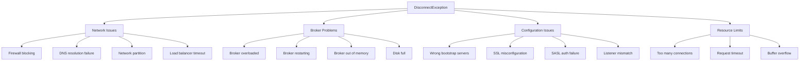
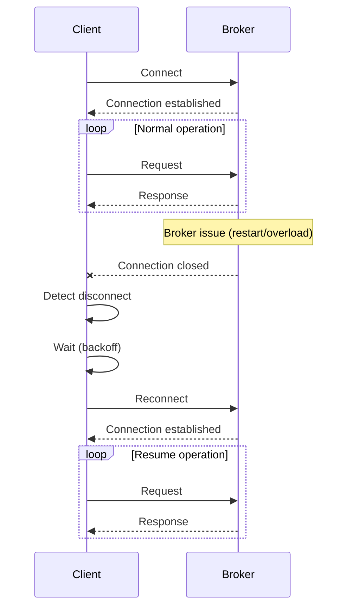

# How to Fix 'DisconnectException' in Kafka

Author: [nawazdhandala](https://www.github.com/nawazdhandala)

Tags: Apache Kafka, DisconnectException, Troubleshooting, Network, Connection, Configuration

Description: Learn how to diagnose and fix DisconnectException errors in Kafka, including network issues, broker problems, and client configuration.

---

The `DisconnectException` in Kafka indicates that the connection between your client (producer or consumer) and the Kafka broker was unexpectedly closed. This guide covers the common causes and solutions for this error.

## Understanding the Error

```
org.apache.kafka.common.errors.DisconnectException:
Unexpected error in join group response: The coordinator is not available.

org.apache.kafka.common.errors.DisconnectException:
Broker may not be available.

org.apache.kafka.clients.NetworkClient:
[Consumer clientId=consumer-1, groupId=my-group]
Connection to node -1 (localhost/127.0.0.1:9092) was disconnected.
```

## Root Causes



## Diagnostic Steps

### Step 1: Verify Network Connectivity

```bash
# Test basic connectivity to broker
nc -zv broker1.example.com 9092

# Check DNS resolution
nslookup broker1.example.com
dig broker1.example.com

# Test with telnet
telnet broker1.example.com 9092

# Check route to broker
traceroute broker1.example.com

# Test from within container/pod (Kubernetes)
kubectl exec -it my-pod -- nc -zv kafka-broker 9092
```

### Step 2: Check Broker Health

```bash
# Verify brokers are responding
kafka-broker-api-versions.sh --bootstrap-server localhost:9092

# Check broker logs for errors
grep -i "error\|exception\|disconnect" /var/log/kafka/server.log | tail -100

# Check broker metrics
kafka-run-class.sh kafka.tools.JmxTool \
  --object-name kafka.server:type=BrokerTopicMetrics,name=BytesInPerSec \
  --jmx-url service:jmx:rmi:///jndi/rmi://localhost:9999/jmxrmi

# Check controller status
kafka-metadata.sh --snapshot /var/kafka-logs/__cluster_metadata-0/00000000000000000000.log \
  --command "cat -all" | grep -i controller
```

### Step 3: Check Client Configuration

```java
// Verify bootstrap servers are correct
String bootstrapServers = props.getProperty(ProducerConfig.BOOTSTRAP_SERVERS_CONFIG);
System.out.println("Bootstrap servers: " + bootstrapServers);

// Check if using advertised listeners
// Broker's advertised.listeners must be reachable from client
```

## Solutions

### Solution 1: Connection Retry Configuration

Configure clients to handle temporary disconnections:

```java
import org.apache.kafka.clients.producer.*;
import org.apache.kafka.clients.consumer.*;
import java.util.Properties;

public class ResilientConnectionConfig {

    public static Properties getProducerConfig(String bootstrapServers) {
        Properties props = new Properties();
        props.put(ProducerConfig.BOOTSTRAP_SERVERS_CONFIG, bootstrapServers);
        props.put(ProducerConfig.KEY_SERIALIZER_CLASS_CONFIG,
            "org.apache.kafka.common.serialization.StringSerializer");
        props.put(ProducerConfig.VALUE_SERIALIZER_CLASS_CONFIG,
            "org.apache.kafka.common.serialization.StringSerializer");

        // Connection retry settings
        // Initial backoff before retrying connection
        props.put(ProducerConfig.RECONNECT_BACKOFF_MS_CONFIG, 50);

        // Maximum backoff between reconnection attempts
        props.put(ProducerConfig.RECONNECT_BACKOFF_MAX_MS_CONFIG, 1000);

        // Number of retries for failed requests
        props.put(ProducerConfig.RETRIES_CONFIG, 10);

        // Backoff between retries
        props.put(ProducerConfig.RETRY_BACKOFF_MS_CONFIG, 100);

        // Request timeout
        props.put(ProducerConfig.REQUEST_TIMEOUT_MS_CONFIG, 30000);

        // Delivery timeout (includes retries)
        props.put(ProducerConfig.DELIVERY_TIMEOUT_MS_CONFIG, 120000);

        // Connection timeout
        props.put("socket.connection.setup.timeout.ms", 10000);
        props.put("socket.connection.setup.timeout.max.ms", 30000);

        return props;
    }

    public static Properties getConsumerConfig(String bootstrapServers, String groupId) {
        Properties props = new Properties();
        props.put(ConsumerConfig.BOOTSTRAP_SERVERS_CONFIG, bootstrapServers);
        props.put(ConsumerConfig.GROUP_ID_CONFIG, groupId);
        props.put(ConsumerConfig.KEY_DESERIALIZER_CLASS_CONFIG,
            "org.apache.kafka.common.serialization.StringDeserializer");
        props.put(ConsumerConfig.VALUE_DESERIALIZER_CLASS_CONFIG,
            "org.apache.kafka.common.serialization.StringDeserializer");

        // Connection retry settings
        props.put(ConsumerConfig.RECONNECT_BACKOFF_MS_CONFIG, 50);
        props.put(ConsumerConfig.RECONNECT_BACKOFF_MAX_MS_CONFIG, 1000);
        props.put(ConsumerConfig.RETRY_BACKOFF_MS_CONFIG, 100);

        // Session and heartbeat settings
        props.put(ConsumerConfig.SESSION_TIMEOUT_MS_CONFIG, 45000);
        props.put(ConsumerConfig.HEARTBEAT_INTERVAL_MS_CONFIG, 10000);

        // Request timeout
        props.put(ConsumerConfig.REQUEST_TIMEOUT_MS_CONFIG, 30000);

        // Default API timeout
        props.put(ConsumerConfig.DEFAULT_API_TIMEOUT_MS_CONFIG, 60000);

        return props;
    }
}
```

### Solution 2: Connection Health Monitoring

Implement connection health monitoring:

```java
import org.apache.kafka.clients.producer.*;
import org.apache.kafka.clients.consumer.*;
import org.apache.kafka.common.errors.DisconnectException;
import org.apache.kafka.common.errors.TimeoutException;

import java.util.*;
import java.util.concurrent.*;
import java.time.Duration;

public class ConnectionHealthMonitor {

    private final String bootstrapServers;
    private final ScheduledExecutorService scheduler;
    private final List<ConnectionStatusListener> listeners;
    private volatile boolean connected = false;

    public ConnectionHealthMonitor(String bootstrapServers) {
        this.bootstrapServers = bootstrapServers;
        this.scheduler = Executors.newScheduledThreadPool(1);
        this.listeners = new CopyOnWriteArrayList<>();
    }

    /**
     * Start monitoring connection health.
     */
    public void startMonitoring(long intervalSeconds) {
        scheduler.scheduleAtFixedRate(this::checkConnection,
            0, intervalSeconds, TimeUnit.SECONDS);
    }

    private void checkConnection() {
        Properties props = new Properties();
        props.put(ProducerConfig.BOOTSTRAP_SERVERS_CONFIG, bootstrapServers);
        props.put(ProducerConfig.KEY_SERIALIZER_CLASS_CONFIG,
            "org.apache.kafka.common.serialization.StringSerializer");
        props.put(ProducerConfig.VALUE_SERIALIZER_CLASS_CONFIG,
            "org.apache.kafka.common.serialization.StringSerializer");
        props.put(ProducerConfig.REQUEST_TIMEOUT_MS_CONFIG, 5000);
        props.put(ProducerConfig.MAX_BLOCK_MS_CONFIG, 5000);

        try (KafkaProducer<String, String> testProducer = new KafkaProducer<>(props)) {
            // Try to get metadata
            testProducer.partitionsFor("__consumer_offsets");

            if (!connected) {
                connected = true;
                notifyListeners(true, null);
            }

        } catch (Exception e) {
            if (connected) {
                connected = false;
                notifyListeners(false, e);
            }
        }
    }

    public void addListener(ConnectionStatusListener listener) {
        listeners.add(listener);
    }

    private void notifyListeners(boolean isConnected, Exception error) {
        for (ConnectionStatusListener listener : listeners) {
            listener.onConnectionStatusChange(isConnected, error);
        }
    }

    public boolean isConnected() {
        return connected;
    }

    public void stop() {
        scheduler.shutdown();
    }

    public interface ConnectionStatusListener {
        void onConnectionStatusChange(boolean connected, Exception error);
    }
}
```

### Solution 3: Auto-Reconnecting Producer

```java
import org.apache.kafka.clients.producer.*;
import org.apache.kafka.common.errors.DisconnectException;
import org.apache.kafka.common.errors.TimeoutException;

import java.util.*;
import java.util.concurrent.*;
import java.time.Duration;

public class AutoReconnectingProducer {

    private volatile KafkaProducer<String, String> producer;
    private final Properties config;
    private final Object lock = new Object();
    private volatile boolean closed = false;

    public AutoReconnectingProducer(String bootstrapServers) {
        this.config = new Properties();
        config.put(ProducerConfig.BOOTSTRAP_SERVERS_CONFIG, bootstrapServers);
        config.put(ProducerConfig.KEY_SERIALIZER_CLASS_CONFIG,
            "org.apache.kafka.common.serialization.StringSerializer");
        config.put(ProducerConfig.VALUE_SERIALIZER_CLASS_CONFIG,
            "org.apache.kafka.common.serialization.StringSerializer");
        config.put(ProducerConfig.RECONNECT_BACKOFF_MS_CONFIG, 100);
        config.put(ProducerConfig.RECONNECT_BACKOFF_MAX_MS_CONFIG, 2000);
        config.put(ProducerConfig.RETRIES_CONFIG, 5);
        config.put(ProducerConfig.DELIVERY_TIMEOUT_MS_CONFIG, 60000);

        this.producer = new KafkaProducer<>(config);
    }

    /**
     * Send message with automatic reconnection on disconnect.
     */
    public Future<RecordMetadata> send(String topic, String key, String value) {
        int attempts = 0;
        int maxAttempts = 3;

        while (attempts < maxAttempts && !closed) {
            try {
                ProducerRecord<String, String> record = new ProducerRecord<>(topic, key, value);
                return getProducer().send(record);

            } catch (Exception e) {
                if (isDisconnectError(e)) {
                    attempts++;
                    System.out.println("Disconnect detected, reconnecting... (attempt " +
                        attempts + ")");
                    reconnect();

                    try {
                        Thread.sleep(1000 * attempts);
                    } catch (InterruptedException ie) {
                        Thread.currentThread().interrupt();
                        throw new RuntimeException("Interrupted during reconnect", ie);
                    }
                } else {
                    throw e;
                }
            }
        }

        throw new RuntimeException("Failed to send after " + maxAttempts + " attempts");
    }

    private KafkaProducer<String, String> getProducer() {
        synchronized (lock) {
            if (producer == null) {
                producer = new KafkaProducer<>(config);
            }
            return producer;
        }
    }

    private void reconnect() {
        synchronized (lock) {
            if (producer != null) {
                try {
                    producer.close(Duration.ofSeconds(5));
                } catch (Exception e) {
                    // Ignore close errors
                }
                producer = null;
            }
            producer = new KafkaProducer<>(config);
        }
    }

    private boolean isDisconnectError(Exception e) {
        Throwable cause = e;
        while (cause != null) {
            if (cause instanceof DisconnectException ||
                cause instanceof TimeoutException ||
                cause.getMessage() != null &&
                cause.getMessage().contains("disconnect")) {
                return true;
            }
            cause = cause.getCause();
        }
        return false;
    }

    public void close() {
        closed = true;
        synchronized (lock) {
            if (producer != null) {
                producer.close(Duration.ofSeconds(30));
            }
        }
    }
}
```

### Solution 4: Auto-Reconnecting Consumer

```java
import org.apache.kafka.clients.consumer.*;
import org.apache.kafka.common.errors.DisconnectException;
import org.apache.kafka.common.errors.WakeupException;

import java.util.*;
import java.time.Duration;

public class AutoReconnectingConsumer {

    private volatile KafkaConsumer<String, String> consumer;
    private final Properties config;
    private final List<String> topics;
    private final Object lock = new Object();
    private volatile boolean running = true;

    public AutoReconnectingConsumer(String bootstrapServers, String groupId,
                                     List<String> topics) {
        this.config = new Properties();
        config.put(ConsumerConfig.BOOTSTRAP_SERVERS_CONFIG, bootstrapServers);
        config.put(ConsumerConfig.GROUP_ID_CONFIG, groupId);
        config.put(ConsumerConfig.KEY_DESERIALIZER_CLASS_CONFIG,
            "org.apache.kafka.common.serialization.StringDeserializer");
        config.put(ConsumerConfig.VALUE_DESERIALIZER_CLASS_CONFIG,
            "org.apache.kafka.common.serialization.StringDeserializer");
        config.put(ConsumerConfig.ENABLE_AUTO_COMMIT_CONFIG, false);
        config.put(ConsumerConfig.RECONNECT_BACKOFF_MS_CONFIG, 100);
        config.put(ConsumerConfig.RECONNECT_BACKOFF_MAX_MS_CONFIG, 2000);
        config.put(ConsumerConfig.SESSION_TIMEOUT_MS_CONFIG, 45000);

        this.topics = new ArrayList<>(topics);
        this.consumer = createConsumer();
    }

    private KafkaConsumer<String, String> createConsumer() {
        KafkaConsumer<String, String> newConsumer = new KafkaConsumer<>(config);
        newConsumer.subscribe(topics);
        return newConsumer;
    }

    /**
     * Poll loop with automatic reconnection.
     */
    public void pollLoop(MessageHandler handler) {
        int consecutiveErrors = 0;
        int maxConsecutiveErrors = 5;

        while (running) {
            try {
                ConsumerRecords<String, String> records =
                    getConsumer().poll(Duration.ofMillis(1000));

                // Reset error counter on successful poll
                consecutiveErrors = 0;

                for (ConsumerRecord<String, String> record : records) {
                    try {
                        handler.handle(record);
                    } catch (Exception e) {
                        System.err.println("Error processing message: " + e.getMessage());
                    }
                }

                if (!records.isEmpty()) {
                    getConsumer().commitSync();
                }

            } catch (WakeupException e) {
                // Shutdown signal
                if (!running) {
                    break;
                }
            } catch (Exception e) {
                consecutiveErrors++;
                System.err.println("Poll error (attempt " + consecutiveErrors + "): " +
                    e.getMessage());

                if (isDisconnectError(e)) {
                    System.out.println("Disconnect detected, reconnecting...");
                    reconnect();
                }

                if (consecutiveErrors >= maxConsecutiveErrors) {
                    System.err.println("Too many consecutive errors, backing off...");
                    try {
                        Thread.sleep(5000);
                    } catch (InterruptedException ie) {
                        Thread.currentThread().interrupt();
                        break;
                    }
                    consecutiveErrors = 0;
                }
            }
        }
    }

    private KafkaConsumer<String, String> getConsumer() {
        synchronized (lock) {
            if (consumer == null) {
                consumer = createConsumer();
            }
            return consumer;
        }
    }

    private void reconnect() {
        synchronized (lock) {
            if (consumer != null) {
                try {
                    consumer.close(Duration.ofSeconds(5));
                } catch (Exception e) {
                    // Ignore close errors
                }
                consumer = null;
            }

            // Wait before reconnecting
            try {
                Thread.sleep(1000);
            } catch (InterruptedException e) {
                Thread.currentThread().interrupt();
            }

            consumer = createConsumer();
        }
    }

    private boolean isDisconnectError(Exception e) {
        Throwable cause = e;
        while (cause != null) {
            if (cause instanceof DisconnectException ||
                (cause.getMessage() != null &&
                 (cause.getMessage().contains("disconnect") ||
                  cause.getMessage().contains("not available")))) {
                return true;
            }
            cause = cause.getCause();
        }
        return false;
    }

    public void shutdown() {
        running = false;
        synchronized (lock) {
            if (consumer != null) {
                consumer.wakeup();
            }
        }
    }

    public void close() {
        shutdown();
        synchronized (lock) {
            if (consumer != null) {
                consumer.close(Duration.ofSeconds(30));
            }
        }
    }

    public interface MessageHandler {
        void handle(ConsumerRecord<String, String> record) throws Exception;
    }
}
```

## Python Solutions

```python
from confluent_kafka import Producer, Consumer, KafkaError, KafkaException
import time
import threading
import logging
from typing import Callable, List, Optional

logging.basicConfig(level=logging.INFO)
logger = logging.getLogger(__name__)


class ResilientProducer:
    """
    Producer with automatic reconnection on disconnect.
    """

    def __init__(self, bootstrap_servers: str):
        self.config = {
            'bootstrap.servers': bootstrap_servers,
            'reconnect.backoff.ms': 100,
            'reconnect.backoff.max.ms': 2000,
            'message.send.max.retries': 5,
            'retry.backoff.ms': 100,
            'request.timeout.ms': 30000,
            'message.timeout.ms': 60000
        }
        self.producer = Producer(self.config)
        self.lock = threading.Lock()

    def send(self, topic: str, key: str, value: str,
             max_retries: int = 3) -> bool:
        """
        Send message with automatic retry on disconnect.
        """
        for attempt in range(max_retries):
            try:
                self.producer.produce(
                    topic,
                    key=key.encode('utf-8') if key else None,
                    value=value.encode('utf-8'),
                    callback=self._delivery_callback
                )

                # Flush to ensure delivery
                remaining = self.producer.flush(timeout=30)
                if remaining == 0:
                    return True
                else:
                    logger.warning(f"Flush incomplete: {remaining} messages pending")

            except Exception as e:
                logger.error(f"Send error (attempt {attempt + 1}): {e}")

                if self._is_disconnect_error(e):
                    logger.info("Disconnect detected, reconnecting...")
                    self._reconnect()
                    time.sleep(1 * (attempt + 1))
                else:
                    raise

        return False

    def _delivery_callback(self, err, msg):
        if err:
            logger.error(f"Delivery failed: {err}")

    def _is_disconnect_error(self, error) -> bool:
        error_str = str(error).lower()
        return ('disconnect' in error_str or
                'not available' in error_str or
                'broker' in error_str)

    def _reconnect(self):
        with self.lock:
            try:
                self.producer.flush(timeout=5)
            except Exception:
                pass
            self.producer = Producer(self.config)

    def close(self):
        self.producer.flush(timeout=30)


class ResilientConsumer:
    """
    Consumer with automatic reconnection on disconnect.
    """

    def __init__(self, bootstrap_servers: str, group_id: str, topics: List[str]):
        self.config = {
            'bootstrap.servers': bootstrap_servers,
            'group.id': group_id,
            'auto.offset.reset': 'earliest',
            'enable.auto.commit': False,
            'reconnect.backoff.ms': 100,
            'reconnect.backoff.max.ms': 2000,
            'session.timeout.ms': 45000
        }
        self.topics = topics
        self.consumer = self._create_consumer()
        self.running = True
        self.lock = threading.Lock()

    def _create_consumer(self) -> Consumer:
        consumer = Consumer(self.config)
        consumer.subscribe(self.topics)
        return consumer

    def poll_loop(self, handler: Callable, commit_interval: int = 100):
        """
        Poll loop with automatic reconnection.
        """
        message_count = 0
        consecutive_errors = 0
        max_consecutive_errors = 5

        while self.running:
            try:
                msg = self.consumer.poll(timeout=1.0)

                if msg is None:
                    continue

                if msg.error():
                    if msg.error().code() == KafkaError._PARTITION_EOF:
                        continue
                    else:
                        raise KafkaException(msg.error())

                # Reset error counter
                consecutive_errors = 0

                # Process message
                try:
                    handler(msg)
                    message_count += 1

                    # Periodic commit
                    if message_count % commit_interval == 0:
                        self.consumer.commit()

                except Exception as e:
                    logger.error(f"Processing error: {e}")

            except Exception as e:
                consecutive_errors += 1
                logger.error(f"Poll error (attempt {consecutive_errors}): {e}")

                if self._is_disconnect_error(e):
                    logger.info("Disconnect detected, reconnecting...")
                    self._reconnect()

                if consecutive_errors >= max_consecutive_errors:
                    logger.warning("Too many errors, backing off...")
                    time.sleep(5)
                    consecutive_errors = 0

    def _is_disconnect_error(self, error) -> bool:
        error_str = str(error).lower()
        return ('disconnect' in error_str or
                'not available' in error_str or
                'broker' in error_str or
                'coordinator' in error_str)

    def _reconnect(self):
        with self.lock:
            try:
                self.consumer.close()
            except Exception:
                pass

            time.sleep(1)
            self.consumer = self._create_consumer()

    def stop(self):
        self.running = False

    def close(self):
        self.stop()
        with self.lock:
            self.consumer.close()


class ConnectionMonitor:
    """
    Monitor Kafka connection health.
    """

    def __init__(self, bootstrap_servers: str):
        self.bootstrap_servers = bootstrap_servers
        self.connected = False
        self.running = False
        self.listeners = []

    def start(self, check_interval: float = 10.0):
        """Start monitoring in background thread."""
        self.running = True

        def monitor_loop():
            while self.running:
                self._check_connection()
                time.sleep(check_interval)

        thread = threading.Thread(target=monitor_loop, daemon=True)
        thread.start()

    def _check_connection(self):
        try:
            # Try to create a producer and get metadata
            producer = Producer({
                'bootstrap.servers': self.bootstrap_servers,
                'socket.timeout.ms': 5000
            })

            # List topics to verify connection
            metadata = producer.list_topics(timeout=5)

            if not self.connected:
                self.connected = True
                self._notify_listeners(True)

        except Exception as e:
            if self.connected:
                self.connected = False
                self._notify_listeners(False, str(e))

    def add_listener(self, listener: Callable):
        self.listeners.append(listener)

    def _notify_listeners(self, connected: bool, error: str = None):
        for listener in self.listeners:
            listener(connected, error)

    def stop(self):
        self.running = False
```

## Broker Configuration

Ensure brokers are configured to handle connections properly:

```properties
# server.properties

# Connection limits
max.connections=1000
max.connections.per.ip=100

# Connection timeouts
connections.max.idle.ms=600000

# Socket settings
socket.send.buffer.bytes=102400
socket.receive.buffer.bytes=102400
socket.request.max.bytes=104857600

# Request processing
num.network.threads=3
num.io.threads=8
queued.max.requests=500
```

## Connection Flow Diagram



## Troubleshooting Checklist

1. **Network connectivity**: Verify client can reach broker on expected port
2. **DNS resolution**: Ensure broker hostnames resolve correctly
3. **Firewall rules**: Check for blocked ports
4. **Broker health**: Verify brokers are running and healthy
5. **Configuration match**: Ensure `advertised.listeners` matches client expectations
6. **SSL/TLS configuration**: Verify certificates and trust stores
7. **Authentication**: Check SASL credentials if enabled
8. **Resource limits**: Check connection limits on both client and broker

## Conclusion

DisconnectException errors are usually caused by network issues, broker problems, or misconfiguration. Implementing proper retry logic with exponential backoff, connection health monitoring, and automatic reconnection ensures your Kafka clients can recover gracefully from temporary disconnections. Always investigate the root cause while also building resilience into your application.
