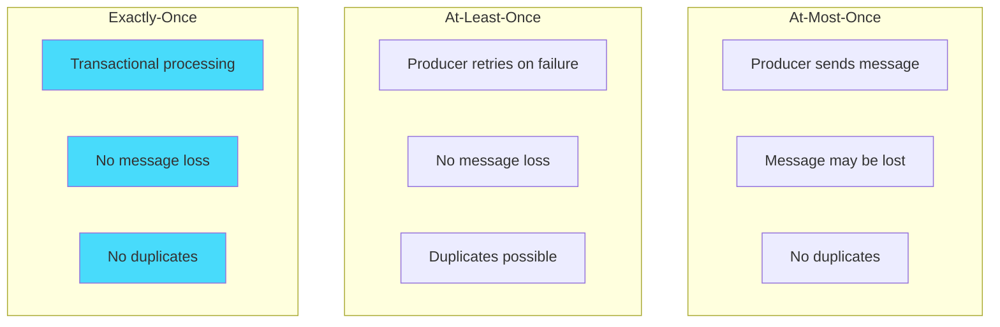
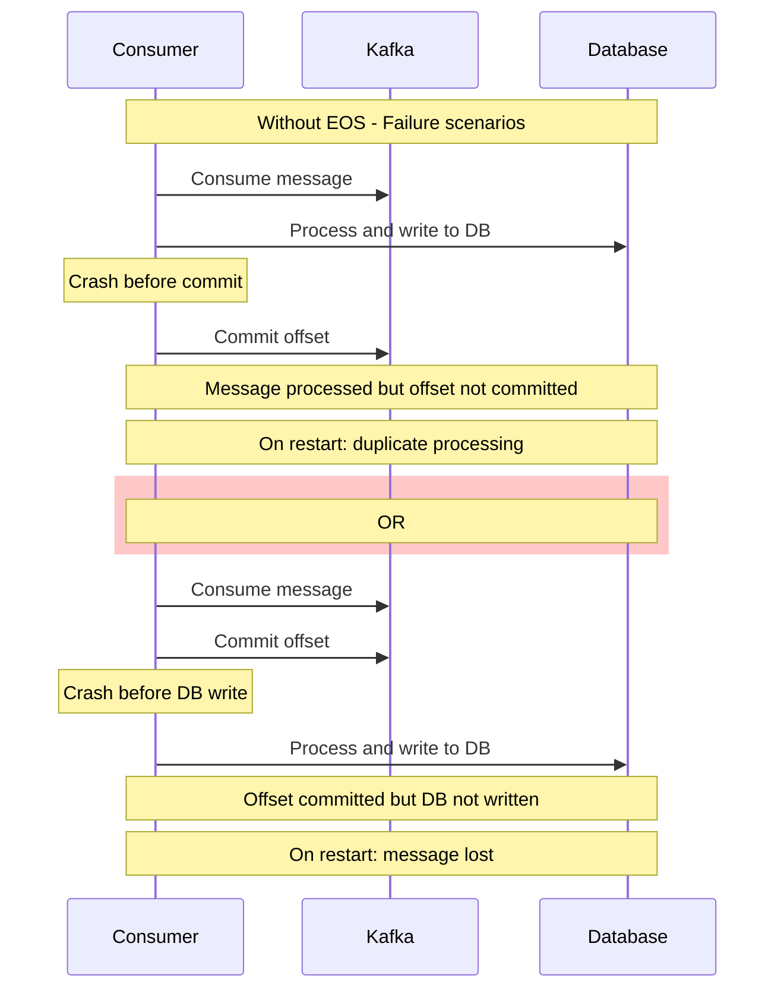
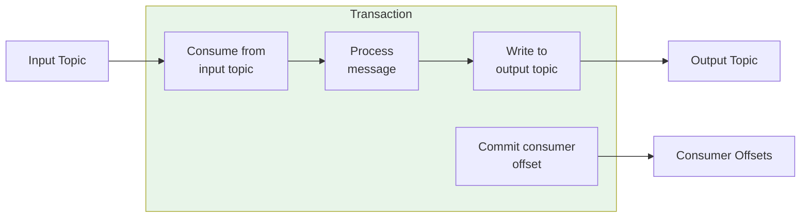
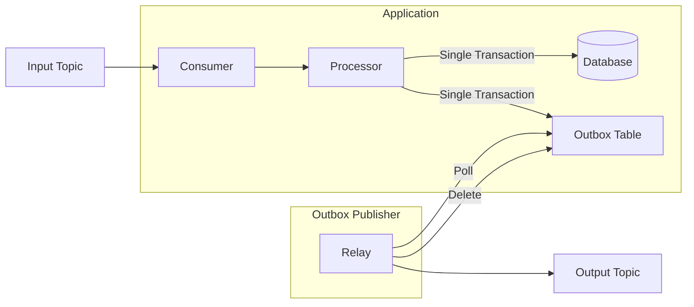
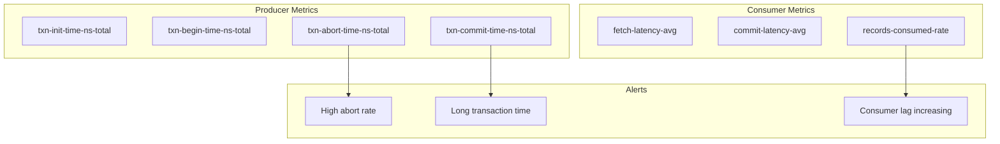

# How to Configure Kafka Consumer for Exactly-Once Processing

Author: [nawazdhandala](https://www.github.com/nawazdhandala)

Tags: Kafka, Exactly-Once, Transactions, Consumer, Idempotent Processing, Distributed Systems

Description: A comprehensive guide to implementing exactly-once message processing in Apache Kafka consumers using transactions, idempotent producers, and proper offset management.

---

## Introduction

Exactly-once processing is one of the most challenging guarantees to achieve in distributed systems. In Apache Kafka, exactly-once semantics (EOS) ensure that each message is processed exactly one time, even in the presence of failures. This eliminates the risks of duplicate processing or data loss.

This guide covers how to configure Kafka consumers for exactly-once processing, including transactional producers, idempotent operations, and patterns for achieving end-to-end exactly-once semantics.

## Understanding Message Delivery Semantics

### The Three Guarantees

Kafka supports three message delivery semantics:



### Why Exactly-Once is Difficult

Achieving exactly-once requires coordinating multiple operations atomically:



## Kafka's Exactly-Once Components

### 1. Idempotent Producer

The idempotent producer ensures each message is written exactly once to Kafka, even with retries.

```python
from kafka import KafkaProducer

# Configure idempotent producer
producer = KafkaProducer(
    bootstrap_servers=['localhost:9092'],

    # Enable idempotence - ensures exactly-once delivery to Kafka
    enable_idempotence=True,

    # Required settings for idempotence
    acks='all',           # Wait for all replicas
    retries=10,           # Allow retries
    max_in_flight_requests_per_connection=5,  # Max 5 for idempotence

    # Serialization
    value_serializer=lambda v: v.encode('utf-8'),
    key_serializer=lambda k: k.encode('utf-8') if k else None,
)
```

```java
// Java idempotent producer configuration
Properties props = new Properties();
props.put("bootstrap.servers", "localhost:9092");

// Enable idempotence
props.put(ProducerConfig.ENABLE_IDEMPOTENCE_CONFIG, true);

// Required for idempotence
props.put(ProducerConfig.ACKS_CONFIG, "all");
props.put(ProducerConfig.RETRIES_CONFIG, Integer.MAX_VALUE);
props.put(ProducerConfig.MAX_IN_FLIGHT_REQUESTS_PER_CONNECTION, 5);

// Serializers
props.put(ProducerConfig.KEY_SERIALIZER_CLASS_CONFIG,
    StringSerializer.class.getName());
props.put(ProducerConfig.VALUE_SERIALIZER_CLASS_CONFIG,
    StringSerializer.class.getName());

KafkaProducer<String, String> producer = new KafkaProducer<>(props);
```

### 2. Transactional Producer

Transactions allow atomic writes across multiple partitions and topics.

```java
import org.apache.kafka.clients.producer.*;
import java.util.Properties;

public class TransactionalProducerExample {

    public static void main(String[] args) {
        Properties props = new Properties();
        props.put("bootstrap.servers", "localhost:9092");

        // Transactional configuration
        // Unique ID for this producer instance
        props.put(ProducerConfig.TRANSACTIONAL_ID_CONFIG, "order-processor-1");

        // Enable idempotence (required for transactions)
        props.put(ProducerConfig.ENABLE_IDEMPOTENCE_CONFIG, true);
        props.put(ProducerConfig.ACKS_CONFIG, "all");

        // Serializers
        props.put(ProducerConfig.KEY_SERIALIZER_CLASS_CONFIG,
            "org.apache.kafka.common.serialization.StringSerializer");
        props.put(ProducerConfig.VALUE_SERIALIZER_CLASS_CONFIG,
            "org.apache.kafka.common.serialization.StringSerializer");

        KafkaProducer<String, String> producer = new KafkaProducer<>(props);

        // Initialize transactions - must be called once
        producer.initTransactions();

        try {
            // Begin transaction
            producer.beginTransaction();

            // Send multiple messages atomically
            producer.send(new ProducerRecord<>("orders", "key1", "order1"));
            producer.send(new ProducerRecord<>("inventory", "key1", "update1"));
            producer.send(new ProducerRecord<>("notifications", "key1", "notify1"));

            // Commit transaction - all messages are visible atomically
            producer.commitTransaction();
            System.out.println("Transaction committed successfully");

        } catch (Exception e) {
            // Abort transaction on any error
            producer.abortTransaction();
            System.err.println("Transaction aborted: " + e.getMessage());
        } finally {
            producer.close();
        }
    }
}
```

### 3. Transactional Consumer

Configure consumers to read only committed transactional messages.

```java
import org.apache.kafka.clients.consumer.*;
import java.util.Properties;

// Consumer configuration for exactly-once
Properties props = new Properties();
props.put("bootstrap.servers", "localhost:9092");
props.put("group.id", "order-processors");

// Read only committed messages from transactions
// This ensures we don't see messages from aborted transactions
props.put(ConsumerConfig.ISOLATION_LEVEL_CONFIG, "read_committed");

// Disable auto commit - we'll commit as part of transactions
props.put(ConsumerConfig.ENABLE_AUTO_COMMIT_CONFIG, false);

// Deserializers
props.put(ConsumerConfig.KEY_DESERIALIZER_CLASS_CONFIG,
    "org.apache.kafka.common.serialization.StringDeserializer");
props.put(ConsumerConfig.VALUE_DESERIALIZER_CLASS_CONFIG,
    "org.apache.kafka.common.serialization.StringDeserializer");

KafkaConsumer<String, String> consumer = new KafkaConsumer<>(props);
```

## Consume-Transform-Produce Pattern

The most common exactly-once pattern involves consuming messages, processing them, and producing results atomically.



### Java Implementation

```java
import org.apache.kafka.clients.consumer.*;
import org.apache.kafka.clients.producer.*;
import org.apache.kafka.common.TopicPartition;
import java.time.Duration;
import java.util.*;

public class ExactlyOnceProcessor {

    private final KafkaConsumer<String, String> consumer;
    private final KafkaProducer<String, String> producer;
    private final String inputTopic;
    private final String outputTopic;

    public ExactlyOnceProcessor(String inputTopic, String outputTopic) {
        this.inputTopic = inputTopic;
        this.outputTopic = outputTopic;

        // Configure consumer
        Properties consumerProps = new Properties();
        consumerProps.put("bootstrap.servers", "localhost:9092");
        consumerProps.put("group.id", "exactly-once-processors");

        // Critical: read only committed messages
        consumerProps.put(ConsumerConfig.ISOLATION_LEVEL_CONFIG, "read_committed");
        consumerProps.put(ConsumerConfig.ENABLE_AUTO_COMMIT_CONFIG, false);
        consumerProps.put(ConsumerConfig.AUTO_OFFSET_RESET_CONFIG, "earliest");

        consumerProps.put(ConsumerConfig.KEY_DESERIALIZER_CLASS_CONFIG,
            "org.apache.kafka.common.serialization.StringDeserializer");
        consumerProps.put(ConsumerConfig.VALUE_DESERIALIZER_CLASS_CONFIG,
            "org.apache.kafka.common.serialization.StringDeserializer");

        this.consumer = new KafkaConsumer<>(consumerProps);

        // Configure transactional producer
        Properties producerProps = new Properties();
        producerProps.put("bootstrap.servers", "localhost:9092");

        // Unique transactional ID
        producerProps.put(ProducerConfig.TRANSACTIONAL_ID_CONFIG,
            "exactly-once-processor-" + UUID.randomUUID());

        producerProps.put(ProducerConfig.ENABLE_IDEMPOTENCE_CONFIG, true);
        producerProps.put(ProducerConfig.ACKS_CONFIG, "all");

        producerProps.put(ProducerConfig.KEY_SERIALIZER_CLASS_CONFIG,
            "org.apache.kafka.common.serialization.StringSerializer");
        producerProps.put(ProducerConfig.VALUE_SERIALIZER_CLASS_CONFIG,
            "org.apache.kafka.common.serialization.StringSerializer");

        this.producer = new KafkaProducer<>(producerProps);

        // Initialize transactions
        producer.initTransactions();
    }

    public void process() {
        consumer.subscribe(Collections.singletonList(inputTopic));

        try {
            while (true) {
                ConsumerRecords<String, String> records =
                    consumer.poll(Duration.ofMillis(100));

                if (records.isEmpty()) {
                    continue;
                }

                // Begin transaction
                producer.beginTransaction();

                try {
                    // Process each record
                    for (ConsumerRecord<String, String> record : records) {
                        // Transform the message
                        String result = processMessage(record.value());

                        // Send to output topic (within transaction)
                        producer.send(new ProducerRecord<>(
                            outputTopic,
                            record.key(),
                            result
                        ));
                    }

                    // Commit consumer offsets as part of the transaction
                    // This is the key to exactly-once: offsets and output
                    // are committed atomically
                    Map<TopicPartition, OffsetAndMetadata> offsets = new HashMap<>();
                    for (TopicPartition partition : records.partitions()) {
                        List<ConsumerRecord<String, String>> partitionRecords =
                            records.records(partition);
                        long lastOffset = partitionRecords
                            .get(partitionRecords.size() - 1).offset();
                        offsets.put(partition,
                            new OffsetAndMetadata(lastOffset + 1));
                    }

                    // Send offsets to transaction
                    producer.sendOffsetsToTransaction(
                        offsets,
                        consumer.groupMetadata()
                    );

                    // Commit transaction
                    producer.commitTransaction();

                    System.out.println("Processed " + records.count() +
                        " records in transaction");

                } catch (Exception e) {
                    // Abort transaction on any error
                    producer.abortTransaction();
                    System.err.println("Transaction aborted: " + e.getMessage());

                    // Seek back to last committed offsets
                    // Messages will be reprocessed
                    for (TopicPartition partition : consumer.assignment()) {
                        OffsetAndMetadata committed =
                            consumer.committed(Collections.singleton(partition))
                                .get(partition);
                        if (committed != null) {
                            consumer.seek(partition, committed.offset());
                        }
                    }
                }
            }
        } finally {
            consumer.close();
            producer.close();
        }
    }

    private String processMessage(String input) {
        // Your transformation logic here
        return "processed: " + input;
    }

    public static void main(String[] args) {
        ExactlyOnceProcessor processor =
            new ExactlyOnceProcessor("input-topic", "output-topic");
        processor.process();
    }
}
```

### Python Implementation with confluent-kafka

```python
from confluent_kafka import Consumer, Producer, KafkaError, KafkaException
from confluent_kafka.admin import AdminClient
import json
import uuid

class ExactlyOnceProcessor:
    """
    Exactly-once processor using Kafka transactions.
    """

    def __init__(self, bootstrap_servers, input_topic, output_topic, group_id):
        self.input_topic = input_topic
        self.output_topic = output_topic
        self.group_id = group_id

        # Consumer configuration
        self.consumer_config = {
            'bootstrap.servers': bootstrap_servers,
            'group.id': group_id,
            'auto.offset.reset': 'earliest',
            'enable.auto.commit': False,
            # Read only committed transactional messages
            'isolation.level': 'read_committed',
        }

        # Producer configuration with transactions
        self.producer_config = {
            'bootstrap.servers': bootstrap_servers,
            # Unique transactional ID
            'transactional.id': f'eos-processor-{uuid.uuid4()}',
            'enable.idempotence': True,
            'acks': 'all',
        }

        self.consumer = Consumer(self.consumer_config)
        self.producer = Producer(self.producer_config)

        # Initialize transactions
        self.producer.init_transactions()

    def process(self):
        """
        Main processing loop with exactly-once semantics.
        """
        self.consumer.subscribe([self.input_topic])

        try:
            while True:
                # Poll for messages
                msg = self.consumer.poll(timeout=1.0)

                if msg is None:
                    continue

                if msg.error():
                    if msg.error().code() == KafkaError._PARTITION_EOF:
                        continue
                    raise KafkaException(msg.error())

                # Begin transaction
                self.producer.begin_transaction()

                try:
                    # Process the message
                    result = self._process_message(msg.value().decode('utf-8'))

                    # Produce to output topic (within transaction)
                    self.producer.produce(
                        self.output_topic,
                        key=msg.key(),
                        value=result.encode('utf-8'),
                    )

                    # Send consumer offset as part of transaction
                    self.producer.send_offsets_to_transaction(
                        [TopicPartition(msg.topic(), msg.partition(),
                                       msg.offset() + 1)],
                        self.consumer.consumer_group_metadata(),
                    )

                    # Commit transaction atomically
                    self.producer.commit_transaction()

                    print(f"Processed message at offset {msg.offset()}")

                except Exception as e:
                    # Abort transaction on error
                    print(f"Error processing message: {e}")
                    self.producer.abort_transaction()

        except KeyboardInterrupt:
            print("Shutting down...")
        finally:
            self.consumer.close()

    def _process_message(self, value):
        """Process a single message."""
        # Your transformation logic here
        return f"processed: {value}"


# For Python, using the kafka-python library (limited transaction support)
# A simpler approach using manual offset management and idempotent writes

from kafka import KafkaConsumer, KafkaProducer
import hashlib
import redis

class SimpleExactlyOnceProcessor:
    """
    Simplified exactly-once processing using idempotency.
    This approach works when the output system supports idempotent writes.
    """

    def __init__(self, bootstrap_servers, input_topic, output_topic,
                 group_id, redis_host='localhost'):
        self.input_topic = input_topic
        self.output_topic = output_topic

        # Consumer with manual offset control
        self.consumer = KafkaConsumer(
            input_topic,
            bootstrap_servers=bootstrap_servers,
            group_id=group_id,
            enable_auto_commit=False,
            auto_offset_reset='earliest',
        )

        # Idempotent producer
        self.producer = KafkaProducer(
            bootstrap_servers=bootstrap_servers,
            acks='all',
            retries=10,
            enable_idempotence=True,
        )

        # Redis for deduplication
        self.redis = redis.Redis(host=redis_host)
        self.dedup_ttl = 86400 * 7  # 7 days

    def _message_id(self, message):
        """Generate unique ID for deduplication."""
        unique = f"{message.topic}:{message.partition}:{message.offset}"
        return hashlib.md5(unique.encode()).hexdigest()

    def _is_processed(self, msg_id):
        """Check if message was already processed."""
        return self.redis.exists(f"processed:{msg_id}")

    def _mark_processed(self, msg_id):
        """Mark message as processed."""
        self.redis.setex(f"processed:{msg_id}", self.dedup_ttl, "1")

    def process(self):
        """Main processing loop with idempotent writes."""
        try:
            for message in self.consumer:
                msg_id = self._message_id(message)

                # Skip if already processed (idempotency check)
                if self._is_processed(msg_id):
                    print(f"Skipping duplicate: offset {message.offset}")
                    self.consumer.commit()
                    continue

                try:
                    # Process the message
                    result = self._process_message(
                        message.value.decode('utf-8'))

                    # Write to output topic
                    future = self.producer.send(
                        self.output_topic,
                        key=message.key,
                        value=result.encode('utf-8'),
                    )
                    # Wait for send to complete
                    future.get(timeout=10)

                    # Mark as processed (for idempotency)
                    self._mark_processed(msg_id)

                    # Commit consumer offset
                    self.consumer.commit()

                    print(f"Processed message at offset {message.offset}")

                except Exception as e:
                    print(f"Error processing message: {e}")
                    # Don't commit - message will be reprocessed
                    # Idempotency check prevents duplicates

        except KeyboardInterrupt:
            print("Shutting down...")
        finally:
            self.consumer.close()
            self.producer.close()

    def _process_message(self, value):
        """Process a single message."""
        return f"processed: {value}"
```

## Exactly-Once with External Systems

When writing to external systems (databases, APIs), you need additional strategies.

### Pattern 1: Transactional Outbox



```python
import psycopg2
from kafka import KafkaConsumer
import json
import threading
import time

class TransactionalOutboxProcessor:
    """
    Exactly-once processing with database using outbox pattern.
    """

    def __init__(self, bootstrap_servers, topic, group_id, db_config):
        self.consumer = KafkaConsumer(
            topic,
            bootstrap_servers=bootstrap_servers,
            group_id=group_id,
            enable_auto_commit=False,
            auto_offset_reset='earliest',
        )

        self.db_config = db_config
        self._init_outbox_table()

    def _init_outbox_table(self):
        """Create outbox table if not exists."""
        conn = psycopg2.connect(**self.db_config)
        cursor = conn.cursor()
        cursor.execute("""
            CREATE TABLE IF NOT EXISTS outbox (
                id SERIAL PRIMARY KEY,
                topic VARCHAR(255) NOT NULL,
                key VARCHAR(255),
                value TEXT NOT NULL,
                created_at TIMESTAMP DEFAULT CURRENT_TIMESTAMP,
                processed BOOLEAN DEFAULT FALSE
            )
        """)
        cursor.execute("""
            CREATE TABLE IF NOT EXISTS processed_offsets (
                topic VARCHAR(255),
                partition INTEGER,
                offset_value BIGINT,
                PRIMARY KEY (topic, partition)
            )
        """)
        conn.commit()
        cursor.close()
        conn.close()

    def _get_processed_offset(self, conn, topic, partition):
        """Get last processed offset for partition."""
        cursor = conn.cursor()
        cursor.execute("""
            SELECT offset_value FROM processed_offsets
            WHERE topic = %s AND partition = %s
        """, (topic, partition))
        row = cursor.fetchone()
        cursor.close()
        return row[0] if row else -1

    def process(self):
        """Main processing loop."""
        conn = psycopg2.connect(**self.db_config)

        try:
            for message in self.consumer:
                cursor = conn.cursor()

                try:
                    # Check if already processed
                    last_offset = self._get_processed_offset(
                        conn, message.topic, message.partition)

                    if message.offset <= last_offset:
                        print(f"Skipping already processed: {message.offset}")
                        continue

                    # Begin database transaction
                    # Process message and write to business tables
                    result = self._process_business_logic(cursor, message)

                    # Write to outbox (same transaction)
                    cursor.execute("""
                        INSERT INTO outbox (topic, key, value)
                        VALUES (%s, %s, %s)
                    """, ('output-topic', message.key, json.dumps(result)))

                    # Update processed offset (same transaction)
                    cursor.execute("""
                        INSERT INTO processed_offsets (topic, partition, offset_value)
                        VALUES (%s, %s, %s)
                        ON CONFLICT (topic, partition)
                        DO UPDATE SET offset_value = EXCLUDED.offset_value
                    """, (message.topic, message.partition, message.offset))

                    # Commit database transaction
                    conn.commit()

                    print(f"Processed message at offset {message.offset}")

                except Exception as e:
                    conn.rollback()
                    print(f"Error processing message: {e}")

                finally:
                    cursor.close()

        except KeyboardInterrupt:
            print("Shutting down...")
        finally:
            conn.close()
            self.consumer.close()

    def _process_business_logic(self, cursor, message):
        """Process message and update business tables."""
        data = json.loads(message.value.decode('utf-8'))

        # Example: Insert order into database
        cursor.execute("""
            INSERT INTO orders (order_id, customer_id, amount)
            VALUES (%s, %s, %s)
            ON CONFLICT (order_id) DO NOTHING
        """, (data['order_id'], data['customer_id'], data['amount']))

        return {'status': 'processed', 'order_id': data['order_id']}


class OutboxRelay:
    """
    Relay process that publishes outbox messages to Kafka.
    """

    def __init__(self, db_config, bootstrap_servers):
        self.db_config = db_config
        self.producer = KafkaProducer(
            bootstrap_servers=bootstrap_servers,
            acks='all',
            enable_idempotence=True,
        )

    def run(self, interval=1.0):
        """Poll outbox and publish to Kafka."""
        while True:
            conn = psycopg2.connect(**self.db_config)
            cursor = conn.cursor()

            try:
                # Get unprocessed outbox entries
                cursor.execute("""
                    SELECT id, topic, key, value
                    FROM outbox
                    WHERE processed = FALSE
                    ORDER BY id
                    LIMIT 100
                """)

                rows = cursor.fetchall()

                for row in rows:
                    id, topic, key, value = row

                    # Publish to Kafka
                    future = self.producer.send(
                        topic,
                        key=key.encode('utf-8') if key else None,
                        value=value.encode('utf-8'),
                    )
                    future.get(timeout=10)

                    # Mark as processed
                    cursor.execute("""
                        UPDATE outbox SET processed = TRUE WHERE id = %s
                    """, (id,))

                conn.commit()

                # Periodically clean up old entries
                cursor.execute("""
                    DELETE FROM outbox
                    WHERE processed = TRUE
                    AND created_at < NOW() - INTERVAL '7 days'
                """)
                conn.commit()

            except Exception as e:
                conn.rollback()
                print(f"Relay error: {e}")
            finally:
                cursor.close()
                conn.close()

            time.sleep(interval)
```

### Pattern 2: Idempotent Consumer with Deduplication

```python
from kafka import KafkaConsumer
import redis
import json
import hashlib

class IdempotentDatabaseWriter:
    """
    Idempotent database writer with deduplication.
    """

    def __init__(self, bootstrap_servers, topic, group_id,
                 db_config, redis_host='localhost'):
        self.consumer = KafkaConsumer(
            topic,
            bootstrap_servers=bootstrap_servers,
            group_id=group_id,
            enable_auto_commit=False,
            auto_offset_reset='earliest',
        )

        self.db = self._connect_db(db_config)
        self.redis = redis.Redis(host=redis_host)
        self.dedup_ttl = 86400 * 7

    def _message_key(self, message):
        """Generate deduplication key."""
        # Use business key if available, otherwise use offset
        try:
            data = json.loads(message.value.decode('utf-8'))
            if 'idempotency_key' in data:
                return f"dedup:{data['idempotency_key']}"
        except:
            pass

        return f"dedup:{message.topic}:{message.partition}:{message.offset}"

    def _try_acquire_lock(self, key):
        """Try to acquire processing lock."""
        return self.redis.set(key, "processing", nx=True, ex=300)

    def _mark_completed(self, key):
        """Mark message as completed."""
        self.redis.setex(key, self.dedup_ttl, "completed")

    def _is_completed(self, key):
        """Check if message was already completed."""
        return self.redis.get(key) == b"completed"

    def process(self):
        """Process messages with idempotency."""
        for message in self.consumer:
            key = self._message_key(message)

            # Skip if already completed
            if self._is_completed(key):
                print(f"Skipping completed message: {message.offset}")
                self.consumer.commit()
                continue

            # Try to acquire processing lock
            if not self._try_acquire_lock(key):
                print(f"Message being processed by another instance: {message.offset}")
                continue

            try:
                # Process with idempotent database write
                self._idempotent_write(message)

                # Mark as completed
                self._mark_completed(key)

                # Commit offset
                self.consumer.commit()

                print(f"Processed message: {message.offset}")

            except Exception as e:
                print(f"Error processing: {e}")
                # Lock will expire, allowing retry

    def _idempotent_write(self, message):
        """Perform idempotent database write."""
        data = json.loads(message.value.decode('utf-8'))

        # Use UPSERT for idempotency
        cursor = self.db.cursor()
        cursor.execute("""
            INSERT INTO orders (order_id, customer_id, amount, status)
            VALUES (%s, %s, %s, %s)
            ON CONFLICT (order_id) DO UPDATE SET
                status = EXCLUDED.status,
                updated_at = CURRENT_TIMESTAMP
        """, (data['order_id'], data['customer_id'],
              data['amount'], 'processed'))
        self.db.commit()
        cursor.close()
```

## Configuration Best Practices

### Broker Configuration

```properties
# server.properties

# Enable transactions
transaction.state.log.replication.factor=3
transaction.state.log.min.isr=2

# Transaction timeout
transaction.max.timeout.ms=900000

# Enable idempotent producers
enable.idempotence=true
```

### Producer Configuration Summary

```java
// Essential configuration for exactly-once producer
Properties props = new Properties();
props.put("bootstrap.servers", "localhost:9092");

// Transaction ID - must be unique per producer instance
// Use stable ID for recovery (e.g., based on application instance)
props.put(ProducerConfig.TRANSACTIONAL_ID_CONFIG, "app-instance-1");

// Idempotence - required for transactions
props.put(ProducerConfig.ENABLE_IDEMPOTENCE_CONFIG, true);

// Acknowledgment - must be "all" for exactly-once
props.put(ProducerConfig.ACKS_CONFIG, "all");

// Retries - set high for reliability
props.put(ProducerConfig.RETRIES_CONFIG, Integer.MAX_VALUE);

// In-flight requests - max 5 for idempotence
props.put(ProducerConfig.MAX_IN_FLIGHT_REQUESTS_PER_CONNECTION, 5);

// Transaction timeout
props.put(ProducerConfig.TRANSACTION_TIMEOUT_CONFIG, 60000);
```

### Consumer Configuration Summary

```java
// Essential configuration for exactly-once consumer
Properties props = new Properties();
props.put("bootstrap.servers", "localhost:9092");
props.put("group.id", "exactly-once-group");

// Isolation level - read only committed transactions
props.put(ConsumerConfig.ISOLATION_LEVEL_CONFIG, "read_committed");

// Disable auto commit - offsets committed via transaction
props.put(ConsumerConfig.ENABLE_AUTO_COMMIT_CONFIG, false);

// Auto offset reset
props.put(ConsumerConfig.AUTO_OFFSET_RESET_CONFIG, "earliest");
```

## Monitoring Exactly-Once Processing

### Key Metrics



### Prometheus Alerting Rules

```yaml
# prometheus-alerts.yaml
groups:
  - name: kafka-exactly-once
    rules:
      # Alert on high transaction abort rate
      - alert: KafkaHighTransactionAbortRate
        expr: |
          rate(kafka_producer_txn_abort_total[5m]) /
          (rate(kafka_producer_txn_commit_total[5m]) +
           rate(kafka_producer_txn_abort_total[5m])) > 0.1
        for: 5m
        labels:
          severity: warning
        annotations:
          summary: "High Kafka transaction abort rate"
          description: "Transaction abort rate is {{ $value | humanizePercentage }}"

      # Alert on long transaction times
      - alert: KafkaLongTransactionTime
        expr: |
          kafka_producer_txn_commit_time_ns_total /
          kafka_producer_txn_commit_total > 5000000000
        for: 5m
        labels:
          severity: warning
        annotations:
          summary: "Kafka transactions taking too long"
          description: "Average transaction time is {{ $value | humanizeDuration }}"
```

## Conclusion

Exactly-once processing in Kafka requires careful configuration and implementation. By using transactional producers, proper consumer isolation levels, and patterns like the transactional outbox, you can achieve strong delivery guarantees.

Key takeaways:

- Use transactional producers with unique transactional IDs
- Configure consumers with `isolation.level=read_committed`
- Commit consumer offsets as part of the transaction
- For external systems, use the transactional outbox pattern
- Implement idempotent writes as a defense-in-depth measure
- Monitor transaction metrics and set up appropriate alerts

Remember that exactly-once semantics come with performance overhead. Evaluate whether your use case truly requires exactly-once or if at-least-once with idempotent processing is sufficient.
