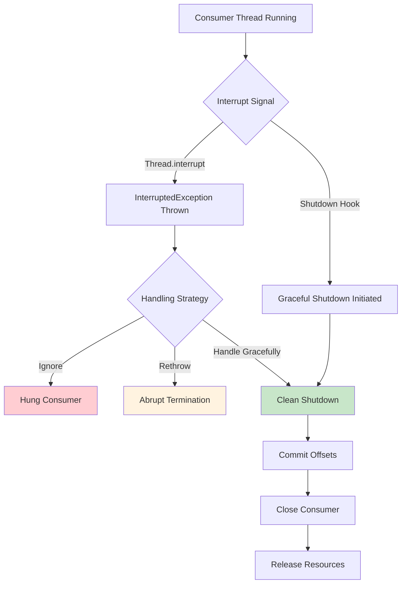
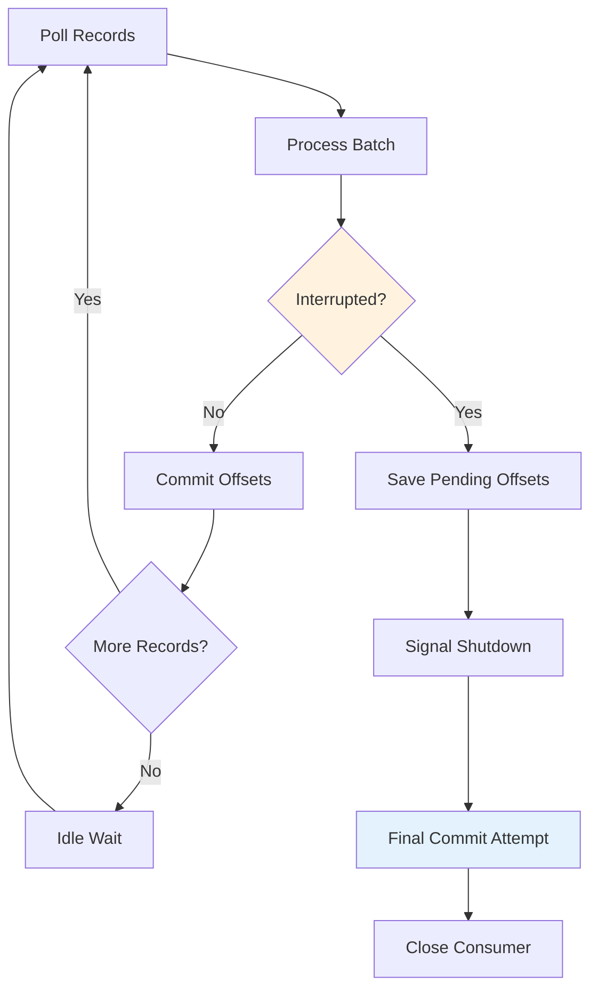

# How to Fix 'InterruptedException' in Kafka Consumer

Author: [nawazdhandala](https://github.com/nawazdhandala)

Tags: Apache Kafka, Troubleshooting, Error Handling, Threading, DevOps, Streaming

Description: Learn how to properly handle InterruptedException in Kafka consumers to ensure graceful shutdown, prevent message loss, and maintain data consistency.

---

InterruptedException in Kafka consumers is a common issue that occurs during shutdown, thread pool management, or when external code interrupts your consumer thread. Improper handling can lead to message loss, duplicate processing, or hung consumers. This guide covers how to handle interruptions correctly.

## Understanding InterruptedException



## Common Causes

| Cause | Description | Solution |
|-------|-------------|----------|
| **Shutdown hook** | JVM shutdown signal | Implement graceful shutdown |
| **Thread pool shutdown** | ExecutorService termination | Use proper thread lifecycle |
| **External interrupt** | Another thread calling interrupt() | Preserve interrupt status |
| **Timeout** | Future.get() or similar timeouts | Handle timeout gracefully |
| **Container lifecycle** | Kubernetes pod termination | Handle SIGTERM properly |

## Basic Interrupt Handling

```java
// Basic consumer with proper interrupt handling
public class InterruptSafeConsumer {

    private final KafkaConsumer<String, String> consumer;
    private final AtomicBoolean running = new AtomicBoolean(true);
    private final CountDownLatch shutdownLatch = new CountDownLatch(1);

    public InterruptSafeConsumer(Properties props) {
        this.consumer = new KafkaConsumer<>(props);
    }

    public void consume(String topic) {
        try {
            consumer.subscribe(Collections.singletonList(topic));

            while (running.get()) {
                try {
                    // poll() can throw InterruptException if thread is interrupted
                    ConsumerRecords<String, String> records =
                        consumer.poll(Duration.ofMillis(1000));

                    for (ConsumerRecord<String, String> record : records) {
                        if (!running.get()) {
                            // Stop processing if shutdown requested
                            break;
                        }
                        processRecord(record);
                    }

                    // Commit after processing
                    if (!records.isEmpty()) {
                        consumer.commitSync();
                    }

                } catch (WakeupException e) {
                    // WakeupException is expected during shutdown
                    if (running.get()) {
                        throw e; // Unexpected wakeup
                    }
                    System.out.println("Consumer woken up for shutdown");
                }
            }
        } catch (InterruptException e) {
            // Kafka's InterruptException wraps InterruptedException
            System.out.println("Consumer interrupted, shutting down");

            // Preserve interrupt status
            Thread.currentThread().interrupt();

        } finally {
            // Always close consumer and signal shutdown complete
            try {
                consumer.close();
            } finally {
                shutdownLatch.countDown();
            }
        }
    }

    public void shutdown() {
        running.set(false);
        consumer.wakeup(); // Trigger WakeupException in poll()
    }

    public void awaitShutdown(long timeout, TimeUnit unit)
            throws InterruptedException {
        shutdownLatch.await(timeout, unit);
    }

    private void processRecord(ConsumerRecord<String, String> record) {
        System.out.println("Processing: " + record.value());
    }
}
```

## Handling Interrupts in Blocking Operations

```java
// Consumer with blocking processing that handles interrupts
public class BlockingOperationConsumer {

    private final KafkaConsumer<String, String> consumer;
    private final ExecutorService processingExecutor;
    private final AtomicBoolean running = new AtomicBoolean(true);

    public BlockingOperationConsumer(Properties props, int processingThreads) {
        this.consumer = new KafkaConsumer<>(props);
        this.processingExecutor = Executors.newFixedThreadPool(processingThreads);
    }

    public void consume(String topic) {
        consumer.subscribe(Collections.singletonList(topic));

        try {
            while (running.get()) {
                ConsumerRecords<String, String> records =
                    consumer.poll(Duration.ofMillis(1000));

                if (records.isEmpty()) {
                    continue;
                }

                // Submit records for processing with timeout
                List<Future<?>> futures = new ArrayList<>();

                for (ConsumerRecord<String, String> record : records) {
                    futures.add(processingExecutor.submit(() -> {
                        try {
                            processWithBlockingCall(record);
                        } catch (InterruptedException e) {
                            // Preserve interrupt status
                            Thread.currentThread().interrupt();
                            System.out.println("Processing interrupted for record: " +
                                record.offset());
                        }
                    }));
                }

                // Wait for all processing with timeout
                boolean allCompleted = waitForCompletion(futures, 30, TimeUnit.SECONDS);

                if (allCompleted) {
                    consumer.commitSync();
                } else {
                    System.err.println("Some records did not complete processing");
                    // Handle partial completion
                }
            }
        } catch (WakeupException e) {
            if (running.get()) {
                throw e;
            }
        } finally {
            shutdown();
        }
    }

    private void processWithBlockingCall(ConsumerRecord<String, String> record)
            throws InterruptedException {

        // Example: HTTP call with timeout
        HttpClient client = HttpClient.newBuilder()
            .connectTimeout(Duration.ofSeconds(5))
            .build();

        HttpRequest request = HttpRequest.newBuilder()
            .uri(URI.create("https://api.example.com/process"))
            .POST(HttpRequest.BodyPublishers.ofString(record.value()))
            .build();

        try {
            // This can throw InterruptedException
            HttpResponse<String> response = client.send(
                request, HttpResponse.BodyHandlers.ofString());

            if (response.statusCode() != 200) {
                throw new RuntimeException("Processing failed: " + response.statusCode());
            }
        } catch (IOException e) {
            throw new RuntimeException("HTTP call failed", e);
        }
    }

    private boolean waitForCompletion(List<Future<?>> futures,
                                       long timeout, TimeUnit unit) {
        long deadline = System.currentTimeMillis() + unit.toMillis(timeout);

        for (Future<?> future : futures) {
            long remaining = deadline - System.currentTimeMillis();
            if (remaining <= 0) {
                return false;
            }

            try {
                future.get(remaining, TimeUnit.MILLISECONDS);
            } catch (InterruptedException e) {
                Thread.currentThread().interrupt();
                return false;
            } catch (ExecutionException e) {
                System.err.println("Processing error: " + e.getCause().getMessage());
            } catch (TimeoutException e) {
                future.cancel(true);
                return false;
            }
        }

        return true;
    }

    public void shutdown() {
        running.set(false);
        consumer.wakeup();

        // Shutdown processing executor gracefully
        processingExecutor.shutdown();
        try {
            if (!processingExecutor.awaitTermination(30, TimeUnit.SECONDS)) {
                processingExecutor.shutdownNow();
                processingExecutor.awaitTermination(10, TimeUnit.SECONDS);
            }
        } catch (InterruptedException e) {
            processingExecutor.shutdownNow();
            Thread.currentThread().interrupt();
        }

        consumer.close();
    }
}
```

## Graceful Shutdown with Shutdown Hooks

```java
// Consumer with proper shutdown hook handling
public class GracefulShutdownConsumer {

    private final KafkaConsumer<String, String> consumer;
    private final AtomicBoolean running = new AtomicBoolean(true);
    private final CountDownLatch startLatch = new CountDownLatch(1);
    private final CountDownLatch shutdownLatch = new CountDownLatch(1);
    private Thread consumerThread;

    public GracefulShutdownConsumer(Properties props) {
        this.consumer = new KafkaConsumer<>(props);
        registerShutdownHook();
    }

    private void registerShutdownHook() {
        Runtime.getRuntime().addShutdownHook(new Thread(() -> {
            System.out.println("Shutdown hook triggered");

            // Signal shutdown
            running.set(false);

            // Wake up consumer if blocked on poll()
            consumer.wakeup();

            // Wait for clean shutdown
            try {
                if (!shutdownLatch.await(30, TimeUnit.SECONDS)) {
                    System.err.println("Consumer did not shutdown cleanly");
                }
            } catch (InterruptedException e) {
                Thread.currentThread().interrupt();
            }

            System.out.println("Shutdown hook completed");
        }));
    }

    public void start(String topic) {
        consumerThread = new Thread(() -> {
            try {
                consume(topic);
            } finally {
                shutdownLatch.countDown();
            }
        }, "kafka-consumer-thread");

        consumerThread.start();

        // Wait for consumer to be ready
        try {
            startLatch.await(10, TimeUnit.SECONDS);
        } catch (InterruptedException e) {
            Thread.currentThread().interrupt();
        }
    }

    private void consume(String topic) {
        consumer.subscribe(Collections.singletonList(topic));
        startLatch.countDown(); // Signal ready

        Map<TopicPartition, OffsetAndMetadata> pendingOffsets = new HashMap<>();

        try {
            while (running.get()) {
                try {
                    ConsumerRecords<String, String> records =
                        consumer.poll(Duration.ofMillis(1000));

                    for (ConsumerRecord<String, String> record : records) {
                        if (!running.get()) {
                            break;
                        }

                        processRecord(record);

                        // Track offset for this partition
                        pendingOffsets.put(
                            new TopicPartition(record.topic(), record.partition()),
                            new OffsetAndMetadata(record.offset() + 1)
                        );
                    }

                    // Commit processed offsets
                    if (!pendingOffsets.isEmpty()) {
                        consumer.commitSync(pendingOffsets);
                        pendingOffsets.clear();
                    }

                } catch (WakeupException e) {
                    if (running.get()) {
                        throw e;
                    }
                    // Expected during shutdown
                }
            }
        } catch (Exception e) {
            System.err.println("Consumer error: " + e.getMessage());
        } finally {
            // Final commit of any pending offsets
            if (!pendingOffsets.isEmpty()) {
                try {
                    consumer.commitSync(pendingOffsets);
                    System.out.println("Final offset commit successful");
                } catch (Exception e) {
                    System.err.println("Failed to commit final offsets: " +
                        e.getMessage());
                }
            }

            consumer.close();
            System.out.println("Consumer closed");
        }
    }

    private void processRecord(ConsumerRecord<String, String> record) {
        // Processing logic
        System.out.println("Processed: " + record.offset());
    }

    public void shutdown() {
        running.set(false);
        consumer.wakeup();

        try {
            shutdownLatch.await(30, TimeUnit.SECONDS);
        } catch (InterruptedException e) {
            Thread.currentThread().interrupt();
        }
    }
}
```

## Handling Interrupts in Spring Kafka

```java
// Spring Kafka configuration with proper interrupt handling
@Configuration
@EnableKafka
public class KafkaConsumerConfig {

    @Bean
    public ConsumerFactory<String, String> consumerFactory() {
        Map<String, Object> props = new HashMap<>();
        props.put(ConsumerConfig.BOOTSTRAP_SERVERS_CONFIG, "kafka:9092");
        props.put(ConsumerConfig.GROUP_ID_CONFIG, "spring-consumer-group");
        props.put(ConsumerConfig.KEY_DESERIALIZER_CLASS_CONFIG,
            StringDeserializer.class);
        props.put(ConsumerConfig.VALUE_DESERIALIZER_CLASS_CONFIG,
            StringDeserializer.class);
        props.put(ConsumerConfig.ENABLE_AUTO_COMMIT_CONFIG, false);

        return new DefaultKafkaConsumerFactory<>(props);
    }

    @Bean
    public ConcurrentKafkaListenerContainerFactory<String, String>
            kafkaListenerContainerFactory() {

        ConcurrentKafkaListenerContainerFactory<String, String> factory =
            new ConcurrentKafkaListenerContainerFactory<>();

        factory.setConsumerFactory(consumerFactory());
        factory.setConcurrency(3);

        // Configure container properties for graceful shutdown
        factory.getContainerProperties().setAckMode(AckMode.MANUAL_IMMEDIATE);
        factory.getContainerProperties().setShutdownTimeout(30000L);

        // Set error handler for interrupt exceptions
        factory.setCommonErrorHandler(new DefaultErrorHandler(
            (record, exception) -> {
                if (exception.getCause() instanceof InterruptedException) {
                    System.out.println("Consumer interrupted, record: " +
                        record.offset());
                    Thread.currentThread().interrupt();
                } else {
                    System.err.println("Processing error: " + exception.getMessage());
                }
            },
            new FixedBackOff(1000L, 3L)
        ));

        return factory;
    }
}

@Service
public class KafkaMessageListener {

    @KafkaListener(topics = "my-topic", groupId = "spring-consumer-group")
    public void listen(ConsumerRecord<String, String> record,
                       Acknowledgment acknowledgment) {
        try {
            processMessage(record);
            acknowledgment.acknowledge();
        } catch (InterruptedException e) {
            // Do not acknowledge, let the message be reprocessed
            Thread.currentThread().interrupt();
            throw new RuntimeException("Processing interrupted", e);
        }
    }

    private void processMessage(ConsumerRecord<String, String> record)
            throws InterruptedException {
        // Check interrupt status before long operations
        if (Thread.currentThread().isInterrupted()) {
            throw new InterruptedException("Thread was interrupted");
        }

        // Your processing logic
        System.out.println("Processing: " + record.value());
    }
}
```

## Interrupt-Safe Commit Strategy



```java
// Consumer with interrupt-safe offset management
public class InterruptSafeCommitConsumer {

    private final KafkaConsumer<String, String> consumer;
    private final AtomicBoolean running = new AtomicBoolean(true);
    private final Map<TopicPartition, OffsetAndMetadata> processedOffsets;
    private final ReentrantLock offsetLock = new ReentrantLock();

    public InterruptSafeCommitConsumer(Properties props) {
        this.consumer = new KafkaConsumer<>(props);
        this.processedOffsets = new ConcurrentHashMap<>();
    }

    public void consume(String topic) {
        consumer.subscribe(Collections.singletonList(topic),
            new ConsumerRebalanceListener() {
                @Override
                public void onPartitionsRevoked(Collection<TopicPartition> partitions) {
                    // Commit before losing partitions
                    commitPendingOffsets();
                }

                @Override
                public void onPartitionsAssigned(Collection<TopicPartition> partitions) {
                    // Clear offsets for newly assigned partitions
                    offsetLock.lock();
                    try {
                        for (TopicPartition partition : partitions) {
                            processedOffsets.remove(partition);
                        }
                    } finally {
                        offsetLock.unlock();
                    }
                }
            });

        try {
            while (running.get()) {
                try {
                    ConsumerRecords<String, String> records =
                        consumer.poll(Duration.ofMillis(1000));

                    processRecordsBatch(records);

                    // Periodic commit
                    commitPendingOffsets();

                } catch (WakeupException e) {
                    if (running.get()) {
                        throw e;
                    }
                } catch (InterruptException e) {
                    // Kafka wraps InterruptedException
                    System.out.println("Consumer interrupted during poll");
                    Thread.currentThread().interrupt();
                    break;
                }
            }
        } finally {
            // Final commit attempt
            commitPendingOffsets();
            consumer.close();
        }
    }

    private void processRecordsBatch(ConsumerRecords<String, String> records) {
        for (ConsumerRecord<String, String> record : records) {
            // Check interrupt before processing each record
            if (Thread.currentThread().isInterrupted()) {
                System.out.println("Interrupted, stopping batch processing");
                running.set(false);
                break;
            }

            try {
                processRecord(record);

                // Track offset after successful processing
                offsetLock.lock();
                try {
                    processedOffsets.put(
                        new TopicPartition(record.topic(), record.partition()),
                        new OffsetAndMetadata(record.offset() + 1)
                    );
                } finally {
                    offsetLock.unlock();
                }

            } catch (Exception e) {
                System.err.println("Failed to process record: " + e.getMessage());
                // Decide: skip record or stop processing
            }
        }
    }

    private void commitPendingOffsets() {
        offsetLock.lock();
        try {
            if (!processedOffsets.isEmpty()) {
                try {
                    consumer.commitSync(new HashMap<>(processedOffsets));
                    System.out.println("Committed offsets: " + processedOffsets);
                    processedOffsets.clear();
                } catch (WakeupException | InterruptException e) {
                    // Save offsets for later commit attempt
                    System.out.println("Commit interrupted, will retry");
                } catch (CommitFailedException e) {
                    System.err.println("Commit failed: " + e.getMessage());
                    processedOffsets.clear(); // Offsets will be lost
                }
            }
        } finally {
            offsetLock.unlock();
        }
    }

    private void processRecord(ConsumerRecord<String, String> record) {
        // Processing logic
        System.out.println("Processed: " + record.offset());
    }

    public void shutdown() {
        running.set(false);
        consumer.wakeup();
    }
}
```

## Kubernetes Graceful Shutdown

```java
// Consumer optimized for Kubernetes pod termination
public class KubernetesConsumer {

    private final KafkaConsumer<String, String> consumer;
    private final AtomicBoolean running = new AtomicBoolean(true);
    private final int terminationGracePeriod;

    public KubernetesConsumer(Properties props, int terminationGracePeriod) {
        this.consumer = new KafkaConsumer<>(props);
        this.terminationGracePeriod = terminationGracePeriod;
        setupSignalHandlers();
    }

    private void setupSignalHandlers() {
        // Handle SIGTERM from Kubernetes
        Runtime.getRuntime().addShutdownHook(new Thread(() -> {
            System.out.println("SIGTERM received, starting graceful shutdown");

            long shutdownStart = System.currentTimeMillis();
            running.set(false);
            consumer.wakeup();

            // Give consumer time to finish current batch
            // Leave buffer for final commit
            int waitTime = terminationGracePeriod - 5000;

            while (System.currentTimeMillis() - shutdownStart < waitTime) {
                try {
                    Thread.sleep(100);
                } catch (InterruptedException e) {
                    Thread.currentThread().interrupt();
                    break;
                }
            }

            System.out.println("Shutdown hook completed");
        }));
    }

    public void consume(String topic) {
        consumer.subscribe(Collections.singletonList(topic));

        try {
            while (running.get()) {
                try {
                    ConsumerRecords<String, String> records =
                        consumer.poll(Duration.ofMillis(500)); // Short poll for responsiveness

                    if (records.isEmpty()) {
                        continue;
                    }

                    // Process with deadline awareness
                    long batchStart = System.currentTimeMillis();

                    for (ConsumerRecord<String, String> record : records) {
                        if (!running.get()) {
                            System.out.println("Shutdown requested, stopping processing");
                            break;
                        }

                        processRecord(record);
                    }

                    // Commit with retry
                    commitWithRetry(3);

                    long batchTime = System.currentTimeMillis() - batchStart;
                    System.out.println("Batch processed in " + batchTime + "ms");

                } catch (WakeupException e) {
                    if (running.get()) {
                        throw e;
                    }
                    System.out.println("Consumer woken up for shutdown");
                }
            }
        } finally {
            // Final commit attempt
            commitWithRetry(3);
            consumer.close(Duration.ofSeconds(5));
            System.out.println("Consumer closed");
        }
    }

    private void commitWithRetry(int maxRetries) {
        for (int i = 0; i < maxRetries; i++) {
            try {
                consumer.commitSync(Duration.ofSeconds(5));
                return;
            } catch (Exception e) {
                System.err.println("Commit attempt " + (i + 1) + " failed: " +
                    e.getMessage());
                if (i < maxRetries - 1) {
                    try {
                        Thread.sleep(100);
                    } catch (InterruptedException ie) {
                        Thread.currentThread().interrupt();
                        break;
                    }
                }
            }
        }
    }

    private void processRecord(ConsumerRecord<String, String> record) {
        System.out.println("Processing: " + record.offset());
    }
}
```

```yaml
# Kubernetes deployment with proper termination settings
apiVersion: apps/v1
kind: Deployment
metadata:
  name: kafka-consumer
spec:
  replicas: 3
  template:
    spec:
      # Grace period should match consumer configuration
      terminationGracePeriodSeconds: 60
      containers:
        - name: consumer
          image: my-kafka-consumer:latest
          env:
            - name: TERMINATION_GRACE_PERIOD
              value: "60000"
          # Readiness probe to handle rebalancing
          readinessProbe:
            httpGet:
              path: /ready
              port: 8080
            initialDelaySeconds: 10
            periodSeconds: 5
          # Liveness probe
          livenessProbe:
            httpGet:
              path: /health
              port: 8080
            initialDelaySeconds: 30
            periodSeconds: 10
```

## Summary

| Scenario | Best Practice |
|----------|---------------|
| **poll() interrupted** | Catch WakeupException, check running flag |
| **Processing interrupted** | Preserve interrupt status, stop gracefully |
| **Shutdown hook** | Use wakeup(), wait for clean shutdown |
| **Blocking operations** | Use timeouts, check interrupt status |
| **Spring Kafka** | Configure shutdown timeout, handle in error handler |
| **Kubernetes** | Match grace period, handle SIGTERM |

Proper interrupt handling in Kafka consumers ensures reliable message processing and clean shutdowns. Always preserve the interrupt status when catching InterruptedException, use the wakeup() method for graceful shutdown, and commit offsets before closing the consumer to prevent message loss or duplication.
