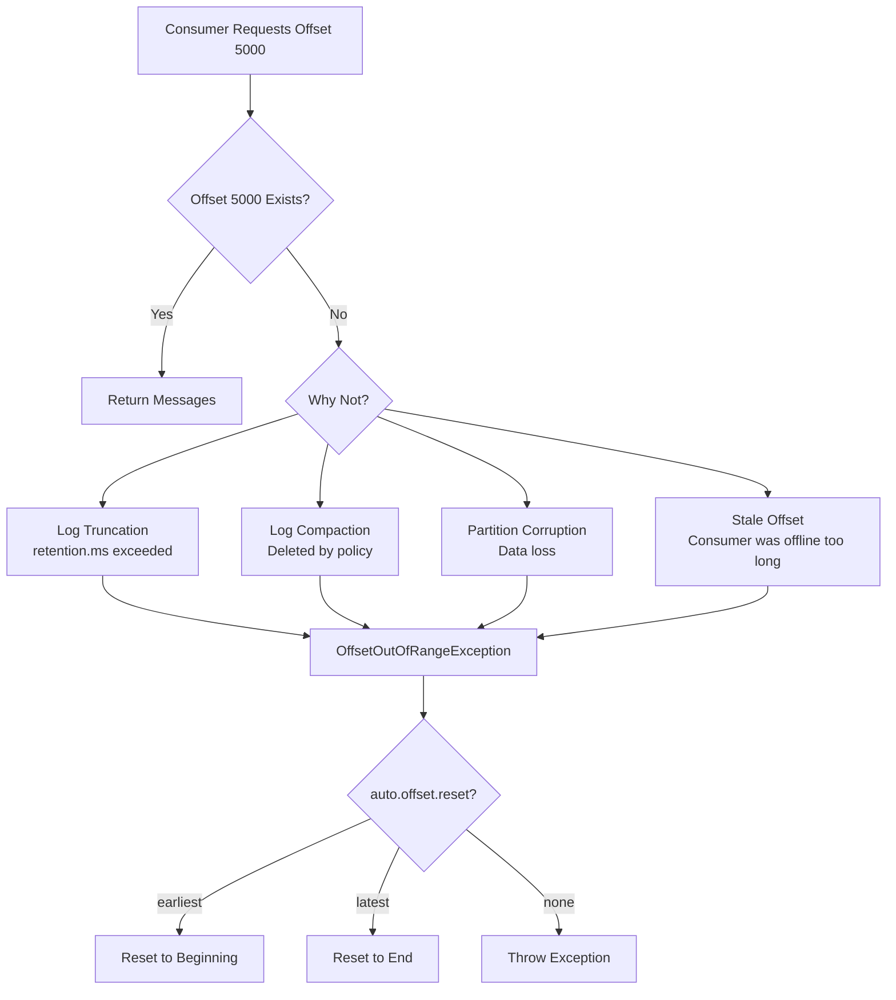
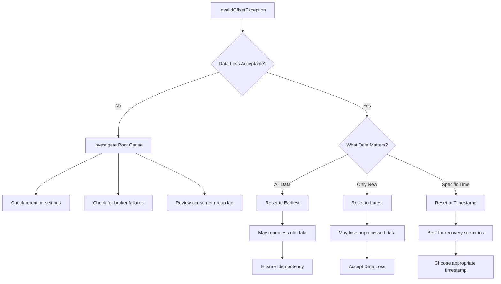

# How to Fix "InvalidOffsetException" in Kafka

Author: [nawazdhandala](https://www.github.com/nawazdhandala)

Tags: Apache Kafka, InvalidOffsetException, OffsetOutOfRangeException, Consumer Offset, Troubleshooting, Data Recovery

Description: Learn how to diagnose and fix Kafka InvalidOffsetException errors, including offset out of range issues, reset strategies, and data recovery approaches.

---

The `InvalidOffsetException` (and its subclass `OffsetOutOfRangeException`) occurs when a Kafka consumer tries to fetch messages from an offset that does not exist in the partition's log. This guide covers the causes, diagnosis, and solutions for these offset-related errors.

## Understanding the Error

```
org.apache.kafka.clients.consumer.OffsetOutOfRangeException:
Offsets out of range with no configured reset policy for partitions: {my-topic-0=5000}
```

### Why This Happens



### Common Causes

1. **Log retention**: Messages were deleted due to `retention.ms` or `retention.bytes`
2. **Log compaction**: Messages were removed by compaction
3. **Consumer offline too long**: Committed offset no longer exists
4. **Partition reassignment**: Offsets from old partitions do not apply
5. **Cluster data loss**: Broker failure caused data loss

## Diagnosing the Problem

### Check Partition Offsets

```bash
# Get the earliest and latest offsets for a topic
kafka-run-class.sh kafka.tools.GetOffsetShell \
  --broker-list localhost:9092 \
  --topic my-topic \
  --time -2  # -2 for earliest, -1 for latest

# Output format: topic:partition:offset
# my-topic:0:1000
# my-topic:1:1500
# my-topic:2:2000

# Also check latest offsets
kafka-run-class.sh kafka.tools.GetOffsetShell \
  --broker-list localhost:9092 \
  --topic my-topic \
  --time -1
```

### Check Consumer Group Offsets

```bash
# View committed offsets for a consumer group
kafka-consumer-groups.sh --bootstrap-server localhost:9092 \
  --group my-consumer-group \
  --describe

# Output shows current offset, log end offset, and lag
# GROUP           TOPIC       PARTITION  CURRENT-OFFSET  LOG-END-OFFSET  LAG
# my-group        my-topic    0          5000            10000           5000
# my-group        my-topic    1          UNKNOWN         8000            -
```

### Identify Invalid Offsets

```bash
# Compare committed offset with available range
# If committed offset < earliest offset, it is invalid

# Get consumer group offset
kafka-consumer-groups.sh --bootstrap-server localhost:9092 \
  --group my-group --describe 2>/dev/null | grep my-topic

# Get earliest available offset
kafka-run-class.sh kafka.tools.GetOffsetShell \
  --broker-list localhost:9092 \
  --topic my-topic --time -2
```

## Java Solutions

### Automatic Offset Reset Configuration

```java
import org.apache.kafka.clients.consumer.*;
import java.time.Duration;
import java.util.*;

public class AutoResetConsumer {

    public static void main(String[] args) {
        Properties props = new Properties();
        props.put(ConsumerConfig.BOOTSTRAP_SERVERS_CONFIG, "localhost:9092");
        props.put(ConsumerConfig.GROUP_ID_CONFIG, "my-group");
        props.put(ConsumerConfig.KEY_DESERIALIZER_CLASS_CONFIG,
            "org.apache.kafka.common.serialization.StringDeserializer");
        props.put(ConsumerConfig.VALUE_DESERIALIZER_CLASS_CONFIG,
            "org.apache.kafka.common.serialization.StringDeserializer");

        // Configure automatic offset reset
        // Options: "earliest", "latest", "none"
        props.put(ConsumerConfig.AUTO_OFFSET_RESET_CONFIG, "earliest");

        // When set to "earliest": consumer resets to beginning of partition
        // When set to "latest": consumer resets to end (only new messages)
        // When set to "none": throws OffsetOutOfRangeException

        try (KafkaConsumer<String, String> consumer = new KafkaConsumer<>(props)) {
            consumer.subscribe(Collections.singletonList("my-topic"));

            while (true) {
                try {
                    ConsumerRecords<String, String> records =
                        consumer.poll(Duration.ofMillis(1000));

                    for (ConsumerRecord<String, String> record : records) {
                        System.out.printf("Offset: %d, Key: %s%n",
                            record.offset(), record.key());
                    }

                    consumer.commitSync();
                } catch (Exception e) {
                    System.err.println("Error: " + e.getMessage());
                }
            }
        }
    }
}
```

### Manual Offset Reset Handler

```java
import org.apache.kafka.clients.consumer.*;
import org.apache.kafka.common.TopicPartition;
import org.apache.kafka.common.errors.OffsetOutOfRangeException;

import java.time.Duration;
import java.util.*;

public class ManualOffsetResetConsumer {

    private final KafkaConsumer<String, String> consumer;
    private final OffsetResetStrategy resetStrategy;

    public enum OffsetResetStrategy {
        EARLIEST,
        LATEST,
        TIMESTAMP,
        SKIP
    }

    public ManualOffsetResetConsumer(Properties props, OffsetResetStrategy strategy) {
        // Set auto.offset.reset to none to handle manually
        props.put(ConsumerConfig.AUTO_OFFSET_RESET_CONFIG, "none");
        props.put(ConsumerConfig.ENABLE_AUTO_COMMIT_CONFIG, false);

        this.consumer = new KafkaConsumer<>(props);
        this.resetStrategy = strategy;
    }

    public void consume(String topic) {
        consumer.subscribe(Collections.singletonList(topic));

        while (true) {
            try {
                ConsumerRecords<String, String> records =
                    consumer.poll(Duration.ofMillis(1000));

                for (ConsumerRecord<String, String> record : records) {
                    processRecord(record);
                }

                consumer.commitSync();

            } catch (OffsetOutOfRangeException e) {
                System.out.println("Offset out of range, resetting...");
                handleOffsetOutOfRange(e);
            }
        }
    }

    private void handleOffsetOutOfRange(OffsetOutOfRangeException e) {
        Set<TopicPartition> partitions = e.offsetOutOfRangePartitions().keySet();

        switch (resetStrategy) {
            case EARLIEST:
                resetToEarliest(partitions);
                break;
            case LATEST:
                resetToLatest(partitions);
                break;
            case TIMESTAMP:
                resetToTimestamp(partitions, System.currentTimeMillis() - 3600000); // 1 hour ago
                break;
            case SKIP:
                skipInvalidOffsets(partitions);
                break;
        }
    }

    private void resetToEarliest(Set<TopicPartition> partitions) {
        Map<TopicPartition, Long> earliestOffsets = consumer.beginningOffsets(partitions);
        for (Map.Entry<TopicPartition, Long> entry : earliestOffsets.entrySet()) {
            consumer.seek(entry.getKey(), entry.getValue());
            System.out.printf("Reset %s to earliest offset %d%n",
                entry.getKey(), entry.getValue());
        }
    }

    private void resetToLatest(Set<TopicPartition> partitions) {
        Map<TopicPartition, Long> latestOffsets = consumer.endOffsets(partitions);
        for (Map.Entry<TopicPartition, Long> entry : latestOffsets.entrySet()) {
            consumer.seek(entry.getKey(), entry.getValue());
            System.out.printf("Reset %s to latest offset %d%n",
                entry.getKey(), entry.getValue());
        }
    }

    private void resetToTimestamp(Set<TopicPartition> partitions, long timestamp) {
        Map<TopicPartition, Long> timestampMap = new HashMap<>();
        for (TopicPartition tp : partitions) {
            timestampMap.put(tp, timestamp);
        }

        Map<TopicPartition, OffsetAndTimestamp> offsetsForTimes =
            consumer.offsetsForTimes(timestampMap);

        for (Map.Entry<TopicPartition, OffsetAndTimestamp> entry : offsetsForTimes.entrySet()) {
            if (entry.getValue() != null) {
                consumer.seek(entry.getKey(), entry.getValue().offset());
                System.out.printf("Reset %s to offset %d at timestamp %d%n",
                    entry.getKey(), entry.getValue().offset(), entry.getValue().timestamp());
            } else {
                // No offset found for timestamp, seek to end
                Map<TopicPartition, Long> endOffset = consumer.endOffsets(
                    Collections.singleton(entry.getKey()));
                consumer.seek(entry.getKey(), endOffset.get(entry.getKey()));
            }
        }
    }

    private void skipInvalidOffsets(Set<TopicPartition> partitions) {
        // Skip to next valid offset (earliest available)
        Map<TopicPartition, Long> earliestOffsets = consumer.beginningOffsets(partitions);
        for (Map.Entry<TopicPartition, Long> entry : earliestOffsets.entrySet()) {
            consumer.seek(entry.getKey(), entry.getValue());
            System.out.printf("Skipped invalid offsets for %s, starting at %d%n",
                entry.getKey(), entry.getValue());
        }
    }

    private void processRecord(ConsumerRecord<String, String> record) {
        System.out.printf("Processing: partition=%d, offset=%d, key=%s%n",
            record.partition(), record.offset(), record.key());
    }

    public void close() {
        consumer.close();
    }
}
```

### Offset Validation Before Consumption

```java
import org.apache.kafka.clients.admin.*;
import org.apache.kafka.clients.consumer.*;
import org.apache.kafka.common.TopicPartition;

import java.util.*;
import java.util.concurrent.ExecutionException;

public class OffsetValidator {

    private final AdminClient adminClient;
    private final KafkaConsumer<String, String> consumer;

    public OffsetValidator(String bootstrapServers) {
        Properties adminProps = new Properties();
        adminProps.put(AdminClientConfig.BOOTSTRAP_SERVERS_CONFIG, bootstrapServers);
        this.adminClient = AdminClient.create(adminProps);

        Properties consumerProps = new Properties();
        consumerProps.put(ConsumerConfig.BOOTSTRAP_SERVERS_CONFIG, bootstrapServers);
        consumerProps.put(ConsumerConfig.GROUP_ID_CONFIG, "offset-validator");
        consumerProps.put(ConsumerConfig.KEY_DESERIALIZER_CLASS_CONFIG,
            "org.apache.kafka.common.serialization.StringDeserializer");
        consumerProps.put(ConsumerConfig.VALUE_DESERIALIZER_CLASS_CONFIG,
            "org.apache.kafka.common.serialization.StringDeserializer");
        this.consumer = new KafkaConsumer<>(consumerProps);
    }

    /**
     * Validates offsets for a consumer group and returns invalid partitions.
     */
    public Map<TopicPartition, OffsetStatus> validateOffsets(String groupId, String topic)
            throws ExecutionException, InterruptedException {

        Map<TopicPartition, OffsetStatus> results = new HashMap<>();

        // Get committed offsets for the group
        ListConsumerGroupOffsetsResult offsetsResult =
            adminClient.listConsumerGroupOffsets(groupId);
        Map<TopicPartition, OffsetAndMetadata> committedOffsets =
            offsetsResult.partitionsToOffsetAndMetadata().get();

        // Get partition info
        Collection<TopicPartition> partitions = new ArrayList<>();
        for (TopicPartition tp : committedOffsets.keySet()) {
            if (tp.topic().equals(topic)) {
                partitions.add(tp);
            }
        }

        if (partitions.isEmpty()) {
            System.out.println("No committed offsets found for topic: " + topic);
            return results;
        }

        // Get earliest and latest offsets
        Map<TopicPartition, Long> earliestOffsets = consumer.beginningOffsets(partitions);
        Map<TopicPartition, Long> latestOffsets = consumer.endOffsets(partitions);

        // Validate each partition
        for (TopicPartition tp : partitions) {
            long committed = committedOffsets.get(tp).offset();
            long earliest = earliestOffsets.get(tp);
            long latest = latestOffsets.get(tp);

            OffsetStatus status;
            if (committed < earliest) {
                status = new OffsetStatus(committed, earliest, latest, OffsetValidity.TOO_OLD);
            } else if (committed > latest) {
                status = new OffsetStatus(committed, earliest, latest, OffsetValidity.TOO_NEW);
            } else {
                status = new OffsetStatus(committed, earliest, latest, OffsetValidity.VALID);
            }

            results.put(tp, status);
        }

        return results;
    }

    /**
     * Resets invalid offsets for a consumer group.
     */
    public void resetInvalidOffsets(String groupId, Map<TopicPartition, OffsetStatus> offsets,
                                    ResetPolicy policy) throws ExecutionException, InterruptedException {

        Map<TopicPartition, OffsetAndMetadata> newOffsets = new HashMap<>();

        for (Map.Entry<TopicPartition, OffsetStatus> entry : offsets.entrySet()) {
            OffsetStatus status = entry.getValue();
            if (status.validity != OffsetValidity.VALID) {
                long newOffset;
                switch (policy) {
                    case EARLIEST:
                        newOffset = status.earliestOffset;
                        break;
                    case LATEST:
                        newOffset = status.latestOffset;
                        break;
                    default:
                        continue;
                }
                newOffsets.put(entry.getKey(), new OffsetAndMetadata(newOffset));
                System.out.printf("Will reset %s from %d to %d%n",
                    entry.getKey(), status.committedOffset, newOffset);
            }
        }

        if (!newOffsets.isEmpty()) {
            adminClient.alterConsumerGroupOffsets(groupId, newOffsets).all().get();
            System.out.println("Offsets reset successfully");
        }
    }

    public enum OffsetValidity {
        VALID,
        TOO_OLD,
        TOO_NEW
    }

    public enum ResetPolicy {
        EARLIEST,
        LATEST
    }

    public static class OffsetStatus {
        public final long committedOffset;
        public final long earliestOffset;
        public final long latestOffset;
        public final OffsetValidity validity;

        public OffsetStatus(long committed, long earliest, long latest, OffsetValidity validity) {
            this.committedOffset = committed;
            this.earliestOffset = earliest;
            this.latestOffset = latest;
            this.validity = validity;
        }

        @Override
        public String toString() {
            return String.format("committed=%d, range=[%d-%d], status=%s",
                committedOffset, earliestOffset, latestOffset, validity);
        }
    }

    public void close() {
        adminClient.close();
        consumer.close();
    }

    // Example usage
    public static void main(String[] args) throws Exception {
        OffsetValidator validator = new OffsetValidator("localhost:9092");

        Map<TopicPartition, OffsetStatus> statuses =
            validator.validateOffsets("my-consumer-group", "my-topic");

        for (Map.Entry<TopicPartition, OffsetStatus> entry : statuses.entrySet()) {
            System.out.printf("%s: %s%n", entry.getKey(), entry.getValue());
        }

        // Reset invalid offsets to earliest
        validator.resetInvalidOffsets("my-consumer-group", statuses, ResetPolicy.EARLIEST);

        validator.close();
    }
}
```

## Python Solutions

```python
from confluent_kafka import Consumer, KafkaException, TopicPartition
from confluent_kafka.admin import AdminClient
from dataclasses import dataclass
from enum import Enum
from typing import Dict, List, Optional, Callable
import time


class OffsetValidity(Enum):
    VALID = "valid"
    TOO_OLD = "too_old"
    TOO_NEW = "too_new"


class ResetStrategy(Enum):
    EARLIEST = "earliest"
    LATEST = "latest"
    TIMESTAMP = "timestamp"


@dataclass
class OffsetStatus:
    partition: int
    committed_offset: int
    earliest_offset: int
    latest_offset: int
    validity: OffsetValidity


class OffsetExceptionHandler:
    """Handles InvalidOffsetException and OffsetOutOfRangeException"""

    def __init__(self, bootstrap_servers: str, group_id: str):
        self.bootstrap_servers = bootstrap_servers
        self.group_id = group_id

        self.consumer_config = {
            'bootstrap.servers': bootstrap_servers,
            'group.id': group_id,
            'auto.offset.reset': 'none',  # Handle manually
            'enable.auto.commit': False,
        }

        self.admin = AdminClient({'bootstrap.servers': bootstrap_servers})
        self.consumer = Consumer(self.consumer_config)

    def get_partition_offsets(self, topic: str) -> Dict[int, Dict[str, int]]:
        """Get earliest and latest offsets for all partitions"""
        # Get partition metadata
        metadata = self.admin.list_topics(topic)
        partitions = metadata.topics[topic].partitions

        offsets = {}
        for partition_id in partitions.keys():
            tp = TopicPartition(topic, partition_id)

            # Get earliest offset
            self.consumer.assign([tp])
            earliest = self.consumer.get_watermark_offsets(tp, timeout=10)

            offsets[partition_id] = {
                'earliest': earliest[0],
                'latest': earliest[1]
            }

        return offsets

    def validate_consumer_offsets(self, topic: str) -> List[OffsetStatus]:
        """Validate committed offsets against available range"""
        # Get committed offsets
        committed = self.consumer.committed([
            TopicPartition(topic, p)
            for p in range(self._get_partition_count(topic))
        ])

        # Get partition offset ranges
        partition_offsets = self.get_partition_offsets(topic)

        statuses = []
        for tp in committed:
            if tp is None:
                continue

            partition_id = tp.partition
            committed_offset = tp.offset
            earliest = partition_offsets[partition_id]['earliest']
            latest = partition_offsets[partition_id]['latest']

            if committed_offset < earliest:
                validity = OffsetValidity.TOO_OLD
            elif committed_offset > latest:
                validity = OffsetValidity.TOO_NEW
            else:
                validity = OffsetValidity.VALID

            statuses.append(OffsetStatus(
                partition=partition_id,
                committed_offset=committed_offset,
                earliest_offset=earliest,
                latest_offset=latest,
                validity=validity
            ))

        return statuses

    def _get_partition_count(self, topic: str) -> int:
        metadata = self.admin.list_topics(topic)
        return len(metadata.topics[topic].partitions)

    def reset_offsets(self, topic: str, strategy: ResetStrategy,
                      timestamp_ms: Optional[int] = None):
        """Reset offsets based on strategy"""
        partition_count = self._get_partition_count(topic)
        partitions = [TopicPartition(topic, p) for p in range(partition_count)]

        self.consumer.assign(partitions)

        if strategy == ResetStrategy.EARLIEST:
            self.consumer.seek_to_beginning(partitions)
            print(f"Reset all partitions to earliest offset")

        elif strategy == ResetStrategy.LATEST:
            self.consumer.seek_to_end(partitions)
            print(f"Reset all partitions to latest offset")

        elif strategy == ResetStrategy.TIMESTAMP:
            if timestamp_ms is None:
                raise ValueError("timestamp_ms required for TIMESTAMP strategy")

            offsets_for_times = self.consumer.offsets_for_times([
                TopicPartition(topic, p, timestamp_ms)
                for p in range(partition_count)
            ])

            for tp in offsets_for_times:
                if tp.offset >= 0:
                    self.consumer.seek(tp)
                    print(f"Reset partition {tp.partition} to offset {tp.offset}")

        # Commit the new positions
        self.consumer.commit(asynchronous=False)

    def close(self):
        self.consumer.close()


class ResilientConsumer:
    """Consumer with automatic offset error recovery"""

    def __init__(self, bootstrap_servers: str, group_id: str,
                 reset_strategy: ResetStrategy = ResetStrategy.EARLIEST):
        self.config = {
            'bootstrap.servers': bootstrap_servers,
            'group.id': group_id,
            'auto.offset.reset': 'none',  # Handle manually
            'enable.auto.commit': False,
        }
        self.consumer = Consumer(self.config)
        self.reset_strategy = reset_strategy
        self.running = True

    def consume(self, topic: str, handler: Callable):
        """Consume messages with automatic offset recovery"""
        self.consumer.subscribe([topic])

        while self.running:
            try:
                msg = self.consumer.poll(1.0)

                if msg is None:
                    continue

                error = msg.error()
                if error:
                    self._handle_error(error, topic)
                    continue

                # Process the message
                handler(msg)
                self.consumer.commit(asynchronous=False)

            except KafkaException as e:
                error_code = e.args[0].code()
                # Handle offset out of range
                if error_code == -1:  # Check specific error code
                    self._reset_offsets(topic)
                else:
                    raise

    def _handle_error(self, error, topic: str):
        """Handle consumer errors including offset errors"""
        error_code = error.code()

        # Kafka error code for OFFSET_OUT_OF_RANGE
        if error_code == 1:  # OFFSET_OUT_OF_RANGE
            print(f"Offset out of range, resetting with strategy: {self.reset_strategy}")
            self._reset_offsets(topic)
        else:
            print(f"Consumer error: {error}")

    def _reset_offsets(self, topic: str):
        """Reset offsets based on configured strategy"""
        # Get assigned partitions
        assignment = self.consumer.assignment()

        if self.reset_strategy == ResetStrategy.EARLIEST:
            self.consumer.seek_to_beginning(assignment)
        elif self.reset_strategy == ResetStrategy.LATEST:
            self.consumer.seek_to_end(assignment)

        print(f"Reset offsets for {len(assignment)} partitions")

    def close(self):
        self.running = False
        self.consumer.close()


# Example usage
def main():
    bootstrap_servers = "localhost:9092"
    group_id = "my-consumer-group"
    topic = "my-topic"

    # Validate offsets
    handler = OffsetExceptionHandler(bootstrap_servers, group_id)

    statuses = handler.validate_consumer_offsets(topic)
    for status in statuses:
        print(f"Partition {status.partition}: {status.validity.value}")
        print(f"  Committed: {status.committed_offset}")
        print(f"  Range: [{status.earliest_offset}, {status.latest_offset}]")

        if status.validity != OffsetValidity.VALID:
            print(f"  WARNING: Offset is invalid!")

    # Reset invalid offsets
    invalid_partitions = [s for s in statuses if s.validity != OffsetValidity.VALID]
    if invalid_partitions:
        print("\nResetting invalid offsets to earliest...")
        handler.reset_offsets(topic, ResetStrategy.EARLIEST)

    handler.close()

    # Consume with automatic recovery
    def message_handler(msg):
        print(f"Received: partition={msg.partition()}, offset={msg.offset()}")

    consumer = ResilientConsumer(bootstrap_servers, group_id, ResetStrategy.EARLIEST)
    # consumer.consume(topic, message_handler)


if __name__ == '__main__':
    main()
```

## Offset Reset Decision Flow



## Command Line Solutions

### Reset Consumer Group Offsets

```bash
# Reset to earliest
kafka-consumer-groups.sh --bootstrap-server localhost:9092 \
  --group my-consumer-group \
  --topic my-topic \
  --reset-offsets \
  --to-earliest \
  --execute

# Reset to latest
kafka-consumer-groups.sh --bootstrap-server localhost:9092 \
  --group my-consumer-group \
  --topic my-topic \
  --reset-offsets \
  --to-latest \
  --execute

# Reset to specific timestamp
kafka-consumer-groups.sh --bootstrap-server localhost:9092 \
  --group my-consumer-group \
  --topic my-topic \
  --reset-offsets \
  --to-datetime "2025-01-24T10:00:00.000" \
  --execute

# Reset to specific offset
kafka-consumer-groups.sh --bootstrap-server localhost:9092 \
  --group my-consumer-group \
  --topic my-topic \
  --reset-offsets \
  --to-offset 1000 \
  --execute

# Dry run (preview without executing)
kafka-consumer-groups.sh --bootstrap-server localhost:9092 \
  --group my-consumer-group \
  --topic my-topic \
  --reset-offsets \
  --to-earliest \
  --dry-run
```

## Prevention Strategies

### Configure Appropriate Retention

```properties
# Topic-level retention
retention.ms=604800000       # 7 days
retention.bytes=-1           # Unlimited size

# Ensure retention exceeds max consumer downtime
# If consumers may be offline for 24 hours, set retention > 24 hours
```

### Monitor Consumer Lag

```bash
# Monitor lag regularly
kafka-consumer-groups.sh --bootstrap-server localhost:9092 \
  --group my-consumer-group \
  --describe

# Alert when lag approaches retention period
```

### Use Offset Monitoring

```java
// Track offset health as a metric
long committed = getCommittedOffset(partition);
long earliest = getEarliestOffset(partition);
long latest = getLatestOffset(partition);

long lagFromEarliest = committed - earliest;
double percentageOfLog = (double) lagFromEarliest / (latest - earliest);

if (percentageOfLog < 0.1) {
    // Warning: committed offset is close to being deleted
    alertOffsetNearDeletion(partition, committed, earliest);
}
```

## Conclusion

The `InvalidOffsetException` indicates a mismatch between committed offsets and available data. Key strategies for handling this error include:

1. **Configure auto.offset.reset** appropriately for your use case
2. **Implement manual offset handling** for fine-grained control
3. **Validate offsets** before starting consumption
4. **Monitor consumer lag** to prevent offsets from becoming invalid
5. **Set adequate retention** to match your consumer availability requirements

By implementing proper offset management and monitoring, you can minimize the impact of these errors and ensure reliable message consumption.
