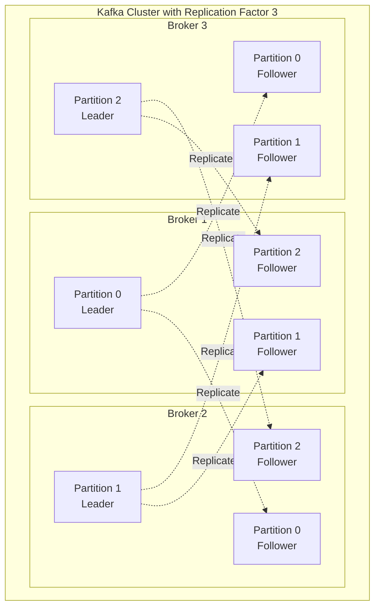
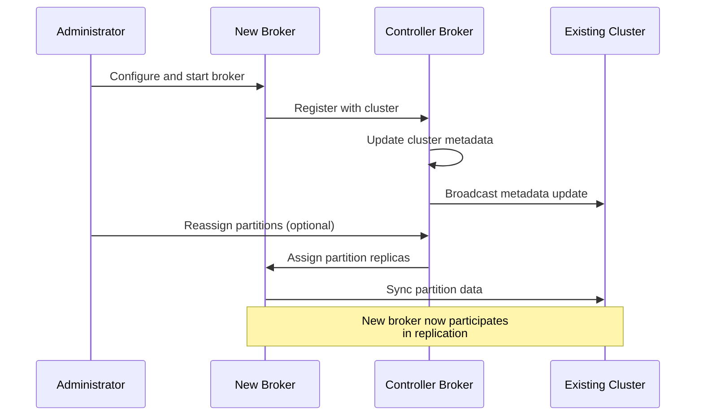
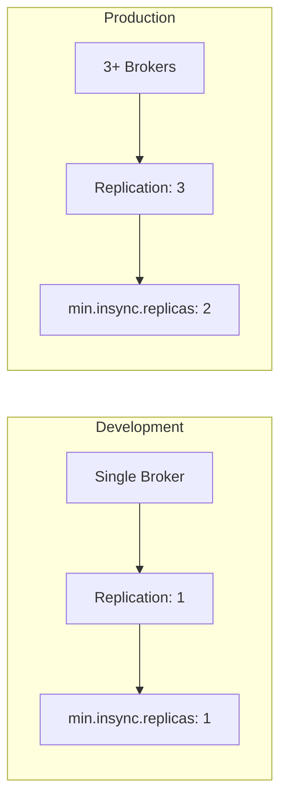

# How to Fix 'InvalidReplicationFactorException' in Kafka

Author: [nawazdhandala](https://www.github.com/nawazdhandala)

Tags: Kafka, Apache Kafka, Troubleshooting, Distributed Systems, Replication, Message Queue, DevOps

Description: Learn how to diagnose and fix the InvalidReplicationFactorException in Apache Kafka by understanding replication factors, broker configurations, and topic creation settings.

---

## Introduction

The `InvalidReplicationFactorException` is one of the most common errors encountered when working with Apache Kafka. This exception occurs when you attempt to create a topic with a replication factor that exceeds the number of available brokers in your Kafka cluster. Understanding this error and how to resolve it is essential for anyone managing Kafka deployments.

This guide covers the root causes of this exception, how to diagnose it, and multiple strategies for fixing it in both development and production environments.

## Understanding the Error

### What is Replication Factor?

In Kafka, the replication factor determines how many copies of each partition exist across different brokers. A replication factor of 3 means that every partition has 3 replicas stored on 3 different brokers.



### When the Exception Occurs

The `InvalidReplicationFactorException` is thrown when:

1. You try to create a topic with a replication factor greater than the number of available brokers
2. The default replication factor in server configuration exceeds available brokers
3. Auto-topic creation is enabled with an invalid default replication factor

Example error message:

```
org.apache.kafka.common.errors.InvalidReplicationFactorException:
Replication factor: 3 larger than available brokers: 1
```

## Diagnosing the Problem

### Step 1: Check Available Brokers

First, verify how many brokers are available in your cluster.

Using the Kafka CLI tools:

```bash
# List all broker IDs in the cluster
# This connects to ZooKeeper to retrieve broker information
kafka-broker-api-versions.sh --bootstrap-server localhost:9092 | grep 'id'

# Alternative: Use kafka-metadata.sh for KRaft mode clusters
kafka-metadata.sh --snapshot /var/kafka-logs/__cluster_metadata-0/00000000000000000000.log --command "broker-ids"
```

Using kafkacat/kcat:

```bash
# Display broker metadata including broker count
# The -L flag lists metadata for all topics and brokers
kcat -b localhost:9092 -L | grep broker
```

### Step 2: Check Topic Configuration

If the error occurs during topic creation, verify the replication factor being requested:

```bash
# Describe topic configuration including replication factor
# Replace 'my-topic' with your actual topic name
kafka-topics.sh --bootstrap-server localhost:9092 \
  --describe --topic my-topic
```

### Step 3: Check Default Configuration

Review the broker's default topic settings:

```bash
# Retrieve the default replication factor from broker configuration
kafka-configs.sh --bootstrap-server localhost:9092 \
  --entity-type brokers --entity-default --describe | grep replication
```

## Solution 1: Adjust Replication Factor During Topic Creation

The most straightforward fix is to set the replication factor to match your available brokers.

### Using Kafka CLI

```bash
# Create a topic with replication factor matching available brokers
# For a single-broker development environment, use replication factor 1
kafka-topics.sh --bootstrap-server localhost:9092 \
  --create \
  --topic my-topic \
  --partitions 6 \
  --replication-factor 1

# For a 3-broker production cluster, use replication factor 3
kafka-topics.sh --bootstrap-server localhost:9092 \
  --create \
  --topic my-topic \
  --partitions 6 \
  --replication-factor 3
```

### Using Java Admin Client

```java
import org.apache.kafka.clients.admin.AdminClient;
import org.apache.kafka.clients.admin.AdminClientConfig;
import org.apache.kafka.clients.admin.CreateTopicsResult;
import org.apache.kafka.clients.admin.NewTopic;
import org.apache.kafka.common.Node;

import java.util.Collection;
import java.util.Collections;
import java.util.Properties;
import java.util.concurrent.ExecutionException;

public class SafeTopicCreator {

    private final AdminClient adminClient;

    public SafeTopicCreator(String bootstrapServers) {
        Properties props = new Properties();
        props.put(AdminClientConfig.BOOTSTRAP_SERVERS_CONFIG, bootstrapServers);
        this.adminClient = AdminClient.create(props);
    }

    /**
     * Creates a topic with a safe replication factor that does not exceed
     * the number of available brokers in the cluster.
     *
     * @param topicName The name of the topic to create
     * @param partitions The number of partitions for the topic
     * @param desiredReplicationFactor The preferred replication factor
     * @throws ExecutionException If topic creation fails
     * @throws InterruptedException If the operation is interrupted
     */
    public void createTopicSafely(String topicName, int partitions, int desiredReplicationFactor)
            throws ExecutionException, InterruptedException {

        // Get the number of available brokers in the cluster
        Collection<Node> nodes = adminClient.describeCluster()
            .nodes()
            .get();

        int availableBrokers = nodes.size();
        System.out.println("Available brokers: " + availableBrokers);

        // Use the minimum of desired replication factor and available brokers
        // This prevents InvalidReplicationFactorException
        int safeReplicationFactor = Math.min(desiredReplicationFactor, availableBrokers);

        if (safeReplicationFactor < desiredReplicationFactor) {
            System.out.println("Warning: Reducing replication factor from " +
                desiredReplicationFactor + " to " + safeReplicationFactor +
                " due to limited brokers");
        }

        // Create the topic with the safe replication factor
        NewTopic newTopic = new NewTopic(topicName, partitions, (short) safeReplicationFactor);

        CreateTopicsResult result = adminClient.createTopics(
            Collections.singletonList(newTopic)
        );

        // Wait for topic creation to complete
        result.all().get();
        System.out.println("Topic '" + topicName + "' created successfully with " +
            "replication factor " + safeReplicationFactor);
    }

    public void close() {
        adminClient.close();
    }

    public static void main(String[] args) {
        SafeTopicCreator creator = new SafeTopicCreator("localhost:9092");
        try {
            // Attempt to create a topic with replication factor 3
            // Will automatically adjust if fewer brokers are available
            creator.createTopicSafely("orders", 12, 3);
        } catch (Exception e) {
            System.err.println("Failed to create topic: " + e.getMessage());
        } finally {
            creator.close();
        }
    }
}
```

### Using Python with confluent-kafka

```python
from confluent_kafka.admin import AdminClient, NewTopic
from confluent_kafka import KafkaException

def create_topic_safely(bootstrap_servers: str, topic_name: str,
                        partitions: int, desired_replication: int) -> None:
    """
    Creates a Kafka topic with automatic replication factor adjustment
    based on available brokers to prevent InvalidReplicationFactorException.

    Args:
        bootstrap_servers: Kafka bootstrap server address
        topic_name: Name of the topic to create
        partitions: Number of partitions for the topic
        desired_replication: Preferred replication factor
    """
    # Create admin client
    admin_client = AdminClient({'bootstrap.servers': bootstrap_servers})

    # Get cluster metadata to determine available brokers
    cluster_metadata = admin_client.list_topics(timeout=10)
    available_brokers = len(cluster_metadata.brokers)

    print(f"Available brokers in cluster: {available_brokers}")

    # Calculate safe replication factor
    safe_replication = min(desired_replication, available_brokers)

    if safe_replication < desired_replication:
        print(f"Warning: Adjusting replication factor from {desired_replication} "
              f"to {safe_replication} due to limited brokers")

    # Create the topic specification
    new_topic = NewTopic(
        topic=topic_name,
        num_partitions=partitions,
        replication_factor=safe_replication
    )

    # Create the topic
    futures = admin_client.create_topics([new_topic])

    # Wait for the operation to complete
    for topic, future in futures.items():
        try:
            future.result()  # Raises exception if creation failed
            print(f"Topic '{topic}' created successfully with "
                  f"replication factor {safe_replication}")
        except KafkaException as e:
            print(f"Failed to create topic '{topic}': {e}")
            raise


if __name__ == "__main__":
    create_topic_safely(
        bootstrap_servers="localhost:9092",
        topic_name="user-events",
        partitions=6,
        desired_replication=3
    )
```

## Solution 2: Modify Broker Configuration

If you want topics to be created automatically with a valid replication factor, update the broker configuration.

### Update server.properties

```properties
# /etc/kafka/server.properties

# Set default replication factor for auto-created topics
# This should not exceed the number of brokers in your cluster
default.replication.factor=1

# For production with 3+ brokers, use:
# default.replication.factor=3

# Minimum in-sync replicas for producer acknowledgments
# Should be less than or equal to replication factor
min.insync.replicas=1

# For production with replication factor 3:
# min.insync.replicas=2

# Number of partitions for auto-created topics
num.partitions=6

# Enable or disable auto topic creation
auto.create.topics.enable=true
```

### Dynamic Configuration Update

You can update broker configuration without restarting using the Kafka admin tools:

```bash
# Update the default replication factor dynamically
# This applies to all brokers in the cluster
kafka-configs.sh --bootstrap-server localhost:9092 \
  --entity-type brokers \
  --entity-default \
  --alter \
  --add-config default.replication.factor=1

# Verify the configuration was applied
kafka-configs.sh --bootstrap-server localhost:9092 \
  --entity-type brokers \
  --entity-default \
  --describe
```

## Solution 3: Add More Brokers

For production environments, the recommended approach is to add more brokers to meet your replication requirements.

### Broker Addition Flow



### Adding a Broker

1. Configure the new broker with a unique broker ID:

```properties
# /etc/kafka/server.properties on new broker

# Each broker must have a unique ID
broker.id=2

# Connect to existing ZooKeeper ensemble
zookeeper.connect=zk1:2181,zk2:2181,zk3:2181

# Or for KRaft mode, configure the controller quorum
# controller.quorum.voters=1@controller1:9093,2@controller2:9093,3@controller3:9093

# Listener configuration
listeners=PLAINTEXT://:9092
advertised.listeners=PLAINTEXT://broker2.example.com:9092
```

2. Start the new broker:

```bash
# Start Kafka broker
kafka-server-start.sh /etc/kafka/server.properties
```

3. Verify the broker joined the cluster:

```bash
# List all brokers in the cluster
kafka-broker-api-versions.sh --bootstrap-server localhost:9092
```

## Solution 4: Handle in Application Code

Implement defensive coding practices to handle replication factor validation.

### Spring Kafka Configuration

```java
import org.apache.kafka.clients.admin.AdminClient;
import org.apache.kafka.clients.admin.NewTopic;
import org.springframework.context.annotation.Bean;
import org.springframework.context.annotation.Configuration;
import org.springframework.kafka.config.TopicBuilder;
import org.springframework.kafka.core.KafkaAdmin;

import java.util.Map;
import java.util.concurrent.ExecutionException;

@Configuration
public class KafkaTopicConfig {

    private final KafkaAdmin kafkaAdmin;

    // Target replication factor for production
    private static final int DESIRED_REPLICATION_FACTOR = 3;

    public KafkaTopicConfig(KafkaAdmin kafkaAdmin) {
        this.kafkaAdmin = kafkaAdmin;
    }

    /**
     * Determines the safe replication factor based on available brokers.
     * This prevents InvalidReplicationFactorException during topic creation.
     */
    private int getSafeReplicationFactor() {
        Map<String, Object> configs = kafkaAdmin.getConfigurationProperties();

        try (AdminClient adminClient = AdminClient.create(configs)) {
            int brokerCount = adminClient.describeCluster()
                .nodes()
                .get()
                .size();

            int safeReplication = Math.min(DESIRED_REPLICATION_FACTOR, brokerCount);

            if (safeReplication < DESIRED_REPLICATION_FACTOR) {
                // Log warning for visibility
                System.out.println("Warning: Using replication factor " + safeReplication +
                    " instead of " + DESIRED_REPLICATION_FACTOR +
                    " due to " + brokerCount + " available brokers");
            }

            return safeReplication;

        } catch (InterruptedException | ExecutionException e) {
            // Default to 1 if we cannot determine broker count
            System.err.println("Could not determine broker count, using replication factor 1");
            return 1;
        }
    }

    @Bean
    public NewTopic ordersTopic() {
        return TopicBuilder.name("orders")
            .partitions(12)
            .replicas(getSafeReplicationFactor())
            .build();
    }

    @Bean
    public NewTopic userEventsTopic() {
        return TopicBuilder.name("user-events")
            .partitions(6)
            .replicas(getSafeReplicationFactor())
            .build();
    }

    @Bean
    public NewTopic notificationsTopic() {
        return TopicBuilder.name("notifications")
            .partitions(3)
            .replicas(getSafeReplicationFactor())
            .build();
    }
}
```

### Node.js with kafkajs

```javascript
const { Kafka } = require('kafkajs');

/**
 * KafkaTopicManager handles topic creation with automatic
 * replication factor adjustment based on available brokers.
 */
class KafkaTopicManager {
  constructor(brokers) {
    this.kafka = new Kafka({
      clientId: 'topic-manager',
      brokers: brokers,
    });
    this.admin = this.kafka.admin();
  }

  /**
   * Gets the number of available brokers in the cluster.
   * @returns {Promise<number>} Number of available brokers
   */
  async getAvailableBrokers() {
    await this.admin.connect();
    const cluster = await this.admin.describeCluster();
    return cluster.brokers.length;
  }

  /**
   * Creates a topic with automatic replication factor adjustment.
   * Prevents InvalidReplicationFactorException by checking broker count.
   *
   * @param {string} topicName - Name of the topic to create
   * @param {number} partitions - Number of partitions
   * @param {number} desiredReplication - Desired replication factor
   */
  async createTopicSafely(topicName, partitions, desiredReplication) {
    try {
      await this.admin.connect();

      // Get available broker count
      const brokerCount = await this.getAvailableBrokers();
      console.log(`Available brokers: ${brokerCount}`);

      // Calculate safe replication factor
      const safeReplication = Math.min(desiredReplication, brokerCount);

      if (safeReplication < desiredReplication) {
        console.warn(
          `Warning: Reducing replication factor from ${desiredReplication} ` +
            `to ${safeReplication} due to limited brokers`
        );
      }

      // Check if topic already exists
      const existingTopics = await this.admin.listTopics();
      if (existingTopics.includes(topicName)) {
        console.log(`Topic '${topicName}' already exists`);
        return;
      }

      // Create the topic
      await this.admin.createTopics({
        topics: [
          {
            topic: topicName,
            numPartitions: partitions,
            replicationFactor: safeReplication,
          },
        ],
        waitForLeaders: true,
      });

      console.log(
        `Topic '${topicName}' created with replication factor ${safeReplication}`
      );
    } finally {
      await this.admin.disconnect();
    }
  }

  /**
   * Creates multiple topics with the same replication requirements.
   * @param {Array<{name: string, partitions: number}>} topics - Topic specifications
   * @param {number} desiredReplication - Desired replication factor for all topics
   */
  async createMultipleTopics(topics, desiredReplication) {
    try {
      await this.admin.connect();

      const brokerCount = await this.getAvailableBrokers();
      const safeReplication = Math.min(desiredReplication, brokerCount);

      const topicConfigs = topics.map((t) => ({
        topic: t.name,
        numPartitions: t.partitions,
        replicationFactor: safeReplication,
      }));

      await this.admin.createTopics({
        topics: topicConfigs,
        waitForLeaders: true,
      });

      console.log(`Created ${topics.length} topics with replication factor ${safeReplication}`);
    } finally {
      await this.admin.disconnect();
    }
  }
}

// Usage example
async function main() {
  const manager = new KafkaTopicManager(['localhost:9092']);

  // Create a single topic
  await manager.createTopicSafely('orders', 12, 3);

  // Create multiple topics
  await manager.createMultipleTopics(
    [
      { name: 'user-events', partitions: 6 },
      { name: 'notifications', partitions: 3 },
      { name: 'audit-logs', partitions: 6 },
    ],
    3
  );
}

main().catch(console.error);
```

## Best Practices

### Development vs Production Configuration



### Configuration Recommendations

| Environment | Brokers | Replication Factor | min.insync.replicas |
|-------------|---------|-------------------|---------------------|
| Development | 1       | 1                 | 1                   |
| Staging     | 3       | 2                 | 1                   |
| Production  | 3+      | 3                 | 2                   |

### Validation Script

Create a script to validate your Kafka configuration before deployment:

```bash
#!/bin/bash
# validate-kafka-config.sh
# Validates Kafka cluster configuration to prevent replication errors

BOOTSTRAP_SERVER="${1:-localhost:9092}"
EXPECTED_REPLICATION="${2:-3}"

echo "Checking Kafka cluster configuration..."

# Get broker count
BROKER_COUNT=$(kafka-broker-api-versions.sh --bootstrap-server "$BOOTSTRAP_SERVER" 2>/dev/null | grep -c "id:")

if [ "$BROKER_COUNT" -eq 0 ]; then
    echo "ERROR: Cannot connect to Kafka cluster at $BOOTSTRAP_SERVER"
    exit 1
fi

echo "Available brokers: $BROKER_COUNT"
echo "Expected replication factor: $EXPECTED_REPLICATION"

if [ "$BROKER_COUNT" -lt "$EXPECTED_REPLICATION" ]; then
    echo "WARNING: Insufficient brokers for replication factor $EXPECTED_REPLICATION"
    echo "Recommended action: Add $(($EXPECTED_REPLICATION - $BROKER_COUNT)) more broker(s)"
    exit 1
else
    echo "SUCCESS: Cluster has sufficient brokers for replication factor $EXPECTED_REPLICATION"
    exit 0
fi
```

## Troubleshooting Checklist

When encountering `InvalidReplicationFactorException`, follow this checklist:

1. **Verify broker count**: Ensure you have enough brokers running
2. **Check topic creation command**: Verify the replication factor specified
3. **Review default configuration**: Check `default.replication.factor` setting
4. **Examine application code**: Look for hardcoded replication factors
5. **Check auto-topic creation**: If enabled, verify default settings
6. **Review Kubernetes/Docker configurations**: Ensure all broker pods/containers are running

## Conclusion

The `InvalidReplicationFactorException` is a straightforward error to resolve once you understand the relationship between replication factor and broker count. The key takeaways are:

- Never set a replication factor higher than your available broker count
- Implement dynamic replication factor calculation in your application code
- Use different configurations for development and production environments
- Consider using infrastructure-as-code to maintain consistent Kafka configurations

By following the solutions and best practices outlined in this guide, you can prevent this exception and ensure reliable Kafka topic creation across all environments.
