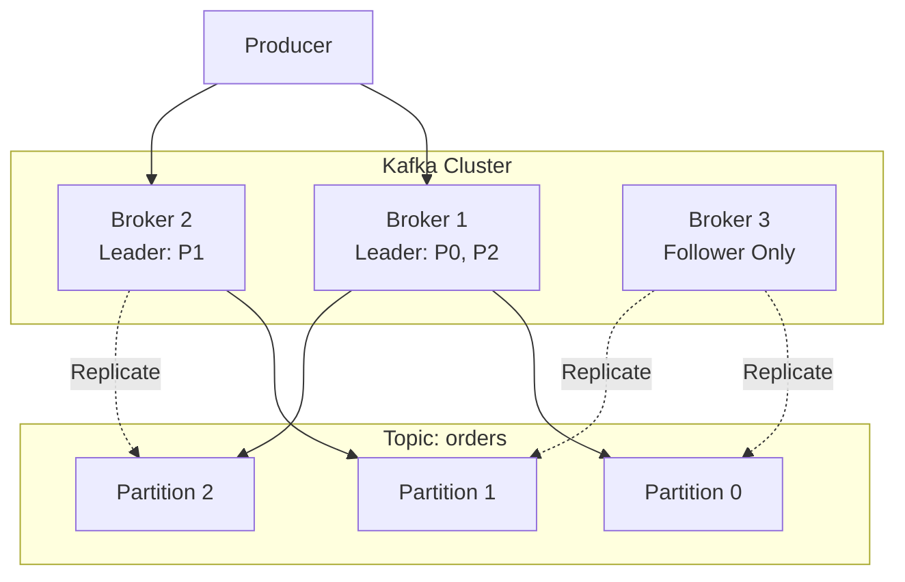
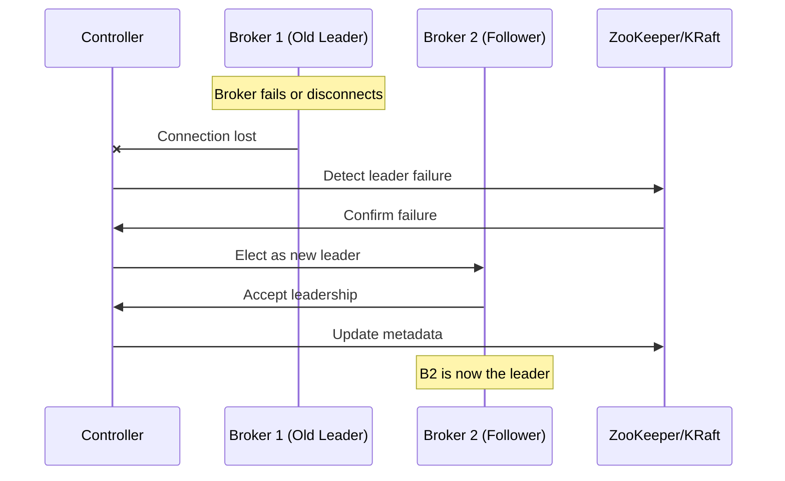
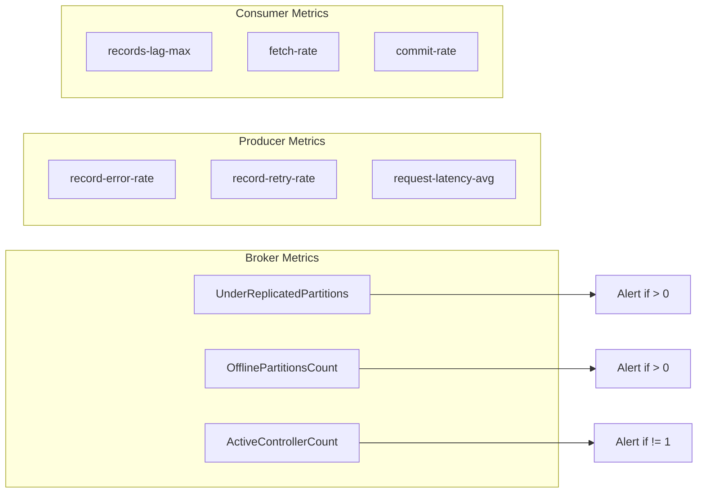

# How to Fix 'Leader Not Available' Errors in Kafka

Author: [nawazdhandala](https://www.github.com/nawazdhandala)

Tags: Kafka, Troubleshooting, Distributed Systems, Message Queue, DevOps, Streaming

Description: A practical guide to diagnosing and resolving the 'Leader Not Available' error in Apache Kafka, including common causes, debugging steps, and preventive measures.

---

## Introduction

The "Leader Not Available" error is one of the most common issues Kafka users encounter. This error occurs when a Kafka client attempts to produce or consume messages from a partition whose leader broker is either unavailable or in the process of being elected. Understanding why this happens and how to resolve it is crucial for maintaining a reliable Kafka deployment.

This guide covers the root causes of this error, step-by-step debugging procedures, and configuration best practices to prevent future occurrences.

## Understanding Kafka Leadership

Before diving into troubleshooting, it helps to understand how Kafka leadership works.

### Partition Leadership Model

In Kafka, each partition has exactly one leader broker that handles all read and write requests. Other brokers maintain replicas of the partition data for fault tolerance.



### Leader Election Process

When a leader becomes unavailable, Kafka must elect a new leader from the in-sync replicas (ISR). During this process, the partition is temporarily unavailable.



## Common Causes

### 1. Broker Unavailability

The most straightforward cause is when the leader broker is down or unreachable.

```bash
# Check broker status using Kafka tools
# This command lists all brokers in the cluster
kafka-broker-api-versions.sh --bootstrap-server localhost:9092

# Check if specific broker is responding
nc -zv broker-hostname 9092
```

### 2. Network Partitions

Network issues between clients and brokers or between brokers themselves can cause leadership problems.

```bash
# Test network connectivity to Kafka brokers
# Replace with your actual broker addresses
for broker in broker1:9092 broker2:9092 broker3:9092; do
    echo "Testing $broker"
    nc -zv ${broker%:*} ${broker#*:} 2>&1 | grep -E "(succeeded|failed)"
done
```

### 3. Topic Creation In Progress

When a new topic is created, partitions may briefly report "Leader Not Available" until leaders are assigned.

```bash
# Check topic status and partition assignments
kafka-topics.sh --bootstrap-server localhost:9092 \
    --describe --topic your-topic-name
```

### 4. Under-Replicated Partitions

If partitions are under-replicated and the leader fails, there may be no eligible replica to become the new leader.

```bash
# List under-replicated partitions across all topics
kafka-topics.sh --bootstrap-server localhost:9092 \
    --describe --under-replicated-partitions
```

### 5. Controller Issues

The Kafka controller is responsible for leader elections. If the controller is overloaded or failing, elections may be delayed.

```bash
# Find the current controller
kafka-metadata.sh --snapshot /var/kafka-logs/__cluster_metadata-0/00000000000000000000.log \
    --command controller

# For ZooKeeper-based clusters
zookeeper-shell.sh localhost:2181 get /controller
```

## Step-by-Step Debugging

### Step 1: Identify Affected Partitions

First, determine which partitions are experiencing the error.

```bash
# Describe the topic to see partition details
# Look for partitions where Leader is -1 or listed as "none"
kafka-topics.sh --bootstrap-server localhost:9092 \
    --describe --topic orders

# Example output showing a problem:
# Topic: orders   Partition: 0    Leader: none    Replicas: 1,2,3    Isr: 2,3
```

### Step 2: Check Broker Health

Verify that all brokers are running and accessible.

```bash
# List all broker IDs in the cluster
kafka-broker-api-versions.sh --bootstrap-server localhost:9092 2>/dev/null | \
    grep -E "^[a-zA-Z0-9.-]+:[0-9]+" | cut -d: -f1 | sort -u

# Check broker logs for errors
# Look for connection issues, OOM errors, or disk problems
tail -100 /var/log/kafka/server.log | grep -i "error\|exception\|failed"
```

### Step 3: Examine Controller Logs

The controller logs contain information about leader elections.

```bash
# Find which broker is the controller
kafka-metadata.sh --snapshot /var/kafka-logs/__cluster_metadata-0/00000000000000000000.log \
    --command controller 2>/dev/null || \
    echo "Check ZooKeeper for controller info"

# Check controller logs for election activity
grep -i "leader\|election\|partition" /var/log/kafka/controller.log | tail -50
```

### Step 4: Verify ISR Status

Check if partitions have sufficient in-sync replicas for leader election.

```bash
# Get detailed ISR information for a topic
kafka-topics.sh --bootstrap-server localhost:9092 \
    --describe --topic orders | \
    awk '{print "Partition:", $4, "Leader:", $6, "ISR:", $10}'
```

### Step 5: Check ZooKeeper/KRaft State

For ZooKeeper-based clusters, verify ZooKeeper health.

```bash
# Check ZooKeeper status
echo "stat" | nc localhost 2181

# Verify Kafka metadata in ZooKeeper
zookeeper-shell.sh localhost:2181 <<EOF
ls /brokers/ids
get /brokers/topics/orders/partitions/0/state
EOF
```

## Resolution Strategies

### Strategy 1: Restart Failed Broker

If a broker has failed, restart it to restore leadership.

```bash
# Stop the broker gracefully
kafka-server-stop.sh

# Wait for clean shutdown
sleep 10

# Start the broker
kafka-server-start.sh -daemon /etc/kafka/server.properties

# Monitor startup
tail -f /var/log/kafka/server.log | grep -i "started\|leader"
```

### Strategy 2: Trigger Leader Election

Force a leader election for affected partitions.

```bash
# Create a JSON file specifying partitions to reassign leadership
cat > /tmp/election.json << 'EOF'
{
  "partitions": [
    {"topic": "orders", "partition": 0},
    {"topic": "orders", "partition": 1}
  ]
}
EOF

# Trigger preferred leader election
kafka-leader-election.sh --bootstrap-server localhost:9092 \
    --election-type preferred \
    --path-to-json-file /tmp/election.json
```

### Strategy 3: Reassign Partitions

If a broker is permanently lost, reassign partitions to available brokers.

```bash
# Generate a reassignment plan
kafka-reassign-partitions.sh --bootstrap-server localhost:9092 \
    --topics-to-move-json-file /tmp/topics.json \
    --broker-list "1,2,3" \
    --generate

# Execute the reassignment
kafka-reassign-partitions.sh --bootstrap-server localhost:9092 \
    --reassignment-json-file /tmp/reassignment.json \
    --execute

# Verify completion
kafka-reassign-partitions.sh --bootstrap-server localhost:9092 \
    --reassignment-json-file /tmp/reassignment.json \
    --verify
```

### Strategy 4: Enable Unclean Leader Election (Use with Caution)

As a last resort, enable unclean leader election to allow out-of-sync replicas to become leaders. This may result in data loss.

```bash
# Enable unclean leader election for a specific topic
kafka-configs.sh --bootstrap-server localhost:9092 \
    --entity-type topics \
    --entity-name orders \
    --alter \
    --add-config unclean.leader.election.enable=true

# WARNING: This can cause data loss
# Disable after recovery
kafka-configs.sh --bootstrap-server localhost:9092 \
    --entity-type topics \
    --entity-name orders \
    --alter \
    --delete-config unclean.leader.election.enable
```

## Client-Side Handling

### Producer Configuration

Configure producers to handle transient leader unavailability.

```java
// Java producer configuration for resilience
Properties props = new Properties();

// Bootstrap servers - include multiple brokers for redundancy
props.put("bootstrap.servers", "broker1:9092,broker2:9092,broker3:9092");

// Retry configuration
// Number of retries before giving up
props.put("retries", 10);

// Time to wait before retrying
props.put("retry.backoff.ms", 100);

// Maximum time to block waiting for metadata
props.put("max.block.ms", 60000);

// Request timeout - should be higher than replica.lag.time.max.ms
props.put("request.timeout.ms", 30000);

// Delivery timeout - total time for send including retries
props.put("delivery.timeout.ms", 120000);

// Acknowledgment configuration
// "all" ensures data is written to all ISR before acknowledging
props.put("acks", "all");

KafkaProducer<String, String> producer = new KafkaProducer<>(props);
```

### Consumer Configuration

Configure consumers to handle leader changes gracefully.

```java
// Java consumer configuration for resilience
Properties props = new Properties();

// Bootstrap servers - include multiple brokers
props.put("bootstrap.servers", "broker1:9092,broker2:9092,broker3:9092");

// Consumer group configuration
props.put("group.id", "my-consumer-group");

// Session timeout - time before consumer is considered dead
props.put("session.timeout.ms", 30000);

// Heartbeat interval - should be less than session.timeout.ms/3
props.put("heartbeat.interval.ms", 10000);

// Maximum time between poll calls
props.put("max.poll.interval.ms", 300000);

// Fetch configuration
props.put("fetch.max.wait.ms", 500);

// Auto offset reset - what to do when no offset exists
props.put("auto.offset.reset", "earliest");

KafkaConsumer<String, String> consumer = new KafkaConsumer<>(props);
```

### Python Client Example

```python
from kafka import KafkaProducer, KafkaConsumer
from kafka.errors import KafkaError, NoBrokersAvailable
import time
import logging

logging.basicConfig(level=logging.INFO)
logger = logging.getLogger(__name__)

def create_resilient_producer():
    """
    Create a Kafka producer with resilient configuration
    for handling leader unavailability errors.
    """
    return KafkaProducer(
        # Multiple bootstrap servers for redundancy
        bootstrap_servers=['broker1:9092', 'broker2:9092', 'broker3:9092'],

        # Retry configuration
        retries=10,
        retry_backoff_ms=100,

        # Timeout configuration
        request_timeout_ms=30000,

        # Acknowledgment - wait for all replicas
        acks='all',

        # Serialization
        value_serializer=lambda v: v.encode('utf-8'),
        key_serializer=lambda k: k.encode('utf-8') if k else None,
    )

def send_with_retry(producer, topic, key, value, max_retries=5):
    """
    Send a message with retry logic for leader unavailability.
    """
    for attempt in range(max_retries):
        try:
            # Send the message and wait for acknowledgment
            future = producer.send(topic, key=key, value=value)
            record_metadata = future.get(timeout=30)

            logger.info(
                f"Message sent to {record_metadata.topic} "
                f"partition {record_metadata.partition} "
                f"offset {record_metadata.offset}"
            )
            return record_metadata

        except KafkaError as e:
            logger.warning(
                f"Send attempt {attempt + 1} failed: {e}. "
                f"Retrying in {2 ** attempt} seconds..."
            )
            time.sleep(2 ** attempt)  # Exponential backoff

    raise Exception(f"Failed to send message after {max_retries} attempts")

def create_resilient_consumer(group_id, topics):
    """
    Create a Kafka consumer with resilient configuration.
    """
    return KafkaConsumer(
        *topics,
        # Multiple bootstrap servers
        bootstrap_servers=['broker1:9092', 'broker2:9092', 'broker3:9092'],

        # Consumer group
        group_id=group_id,

        # Session management
        session_timeout_ms=30000,
        heartbeat_interval_ms=10000,

        # Offset management
        auto_offset_reset='earliest',
        enable_auto_commit=False,  # Manual commit for reliability

        # Deserialization
        value_deserializer=lambda v: v.decode('utf-8'),
        key_deserializer=lambda k: k.decode('utf-8') if k else None,
    )
```

## Preventive Measures

### 1. Configure Adequate Replication

Ensure topics have sufficient replicas to survive broker failures.

```bash
# Create topic with replication factor of 3
kafka-topics.sh --bootstrap-server localhost:9092 \
    --create \
    --topic orders \
    --partitions 6 \
    --replication-factor 3

# Update existing topic replication (requires reassignment)
# First, generate the reassignment plan
kafka-reassign-partitions.sh --bootstrap-server localhost:9092 \
    --topics-to-move-json-file /tmp/topics.json \
    --broker-list "1,2,3" \
    --generate
```

### 2. Monitor ISR Health

Set up monitoring for under-replicated partitions.

```bash
# Script to check ISR health
#!/bin/bash

# Get under-replicated partition count
UNDER_REPLICATED=$(kafka-topics.sh --bootstrap-server localhost:9092 \
    --describe --under-replicated-partitions 2>/dev/null | wc -l)

if [ "$UNDER_REPLICATED" -gt 0 ]; then
    echo "WARNING: $UNDER_REPLICATED under-replicated partitions detected"
    kafka-topics.sh --bootstrap-server localhost:9092 \
        --describe --under-replicated-partitions
    exit 1
fi

echo "OK: All partitions are fully replicated"
exit 0
```

### 3. Configure Broker Settings

Optimize broker configuration for stability.

```properties
# server.properties - Broker configuration

# Replication settings
default.replication.factor=3
min.insync.replicas=2

# Leader election settings
# Disable unclean leader election to prevent data loss
unclean.leader.election.enable=false

# Controller settings
controller.socket.timeout.ms=30000

# Replica settings
replica.lag.time.max.ms=30000
replica.fetch.max.bytes=1048576

# Log settings
log.retention.hours=168
log.segment.bytes=1073741824

# Network settings
num.network.threads=3
num.io.threads=8
socket.send.buffer.bytes=102400
socket.receive.buffer.bytes=102400
socket.request.max.bytes=104857600
```

### 4. Implement Health Checks

Create health check endpoints for your Kafka infrastructure.

```python
from kafka import KafkaAdminClient
from kafka.errors import KafkaError
import json

def check_kafka_health(bootstrap_servers):
    """
    Comprehensive health check for Kafka cluster.
    Returns a dict with health status and details.
    """
    health = {
        'status': 'healthy',
        'checks': {},
        'issues': []
    }

    try:
        admin = KafkaAdminClient(
            bootstrap_servers=bootstrap_servers,
            request_timeout_ms=10000
        )

        # Check cluster metadata
        cluster_metadata = admin.describe_cluster()
        health['checks']['cluster'] = {
            'controller_id': cluster_metadata.controller_id,
            'broker_count': len(cluster_metadata.brokers)
        }

        # Check for offline partitions
        topics = admin.list_topics()
        topic_descriptions = admin.describe_topics(topics)

        offline_partitions = []
        under_replicated = []

        for topic_desc in topic_descriptions:
            for partition in topic_desc.partitions:
                if partition.leader == -1:
                    offline_partitions.append({
                        'topic': topic_desc.topic,
                        'partition': partition.id
                    })
                if len(partition.isr) < len(partition.replicas):
                    under_replicated.append({
                        'topic': topic_desc.topic,
                        'partition': partition.id,
                        'isr_count': len(partition.isr),
                        'replica_count': len(partition.replicas)
                    })

        health['checks']['partitions'] = {
            'offline': offline_partitions,
            'under_replicated': under_replicated
        }

        if offline_partitions:
            health['status'] = 'critical'
            health['issues'].append(
                f"{len(offline_partitions)} offline partitions detected"
            )
        elif under_replicated:
            health['status'] = 'warning'
            health['issues'].append(
                f"{len(under_replicated)} under-replicated partitions detected"
            )

        admin.close()

    except KafkaError as e:
        health['status'] = 'critical'
        health['issues'].append(f"Failed to connect to Kafka: {e}")

    return health

# Example usage
if __name__ == '__main__':
    result = check_kafka_health(['localhost:9092'])
    print(json.dumps(result, indent=2))
```

## Monitoring and Alerting

### Key Metrics to Monitor



### Prometheus Alerting Rules

```yaml
# prometheus-alerts.yaml
groups:
  - name: kafka-leader-alerts
    rules:
      # Alert when partitions have no leader
      - alert: KafkaOfflinePartitions
        expr: kafka_controller_kafkacontroller_offlinepartitionscount > 0
        for: 1m
        labels:
          severity: critical
        annotations:
          summary: "Kafka has offline partitions"
          description: "{{ $value }} partitions have no leader available"

      # Alert when partitions are under-replicated
      - alert: KafkaUnderReplicatedPartitions
        expr: kafka_server_replicamanager_underreplicatedpartitions > 0
        for: 5m
        labels:
          severity: warning
        annotations:
          summary: "Kafka has under-replicated partitions"
          description: "{{ $value }} partitions are under-replicated"

      # Alert when no active controller
      - alert: KafkaNoActiveController
        expr: kafka_controller_kafkacontroller_activecontrollercount != 1
        for: 1m
        labels:
          severity: critical
        annotations:
          summary: "Kafka cluster has no active controller"
          description: "The Kafka cluster does not have an active controller"

      # Alert on high producer error rate
      - alert: KafkaProducerHighErrorRate
        expr: rate(kafka_producer_record_error_total[5m]) > 0.1
        for: 5m
        labels:
          severity: warning
        annotations:
          summary: "High Kafka producer error rate"
          description: "Producer error rate is {{ $value }} errors/sec"
```

## Conclusion

The "Leader Not Available" error in Kafka typically indicates issues with broker availability, network connectivity, or the leader election process. By understanding the underlying causes and implementing proper monitoring, configuration, and client-side handling, you can minimize the impact of these errors and maintain a reliable Kafka deployment.

Key takeaways:

- Always configure adequate replication (at least 3 replicas for production)
- Monitor ISR health and under-replicated partitions proactively
- Configure clients with appropriate retry and timeout settings
- Set up alerts for offline and under-replicated partitions
- Keep unclean leader election disabled unless absolutely necessary
- Maintain multiple bootstrap servers in client configurations

With these practices in place, your Kafka cluster will be resilient to broker failures and leader transitions.
