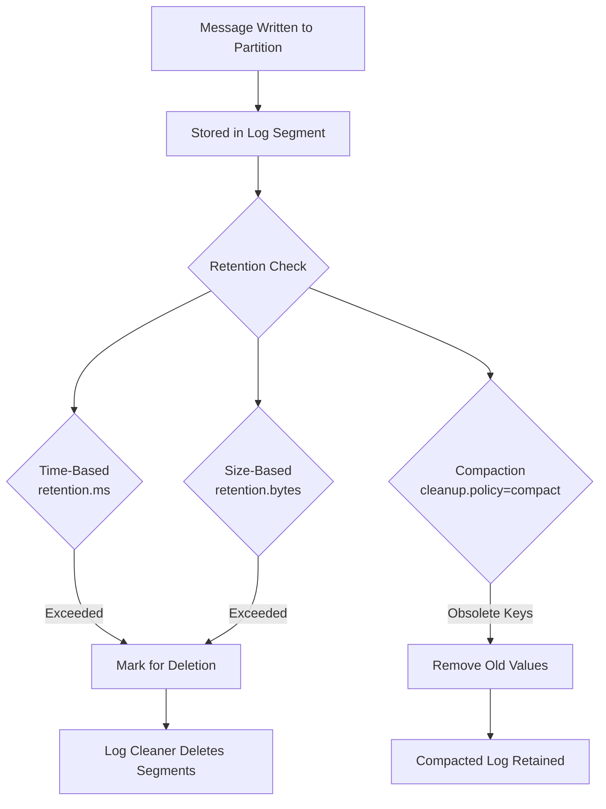
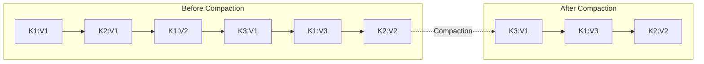
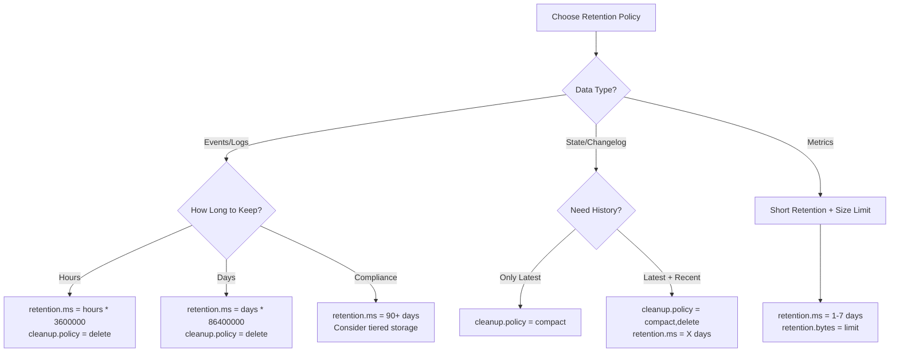
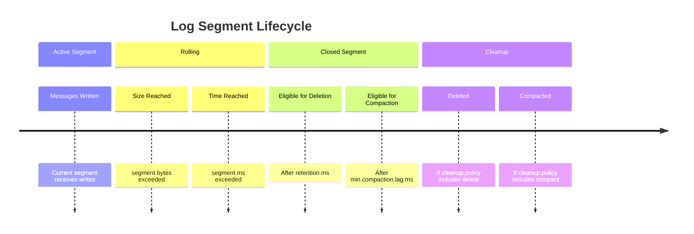

# How to Configure Kafka Log Retention Policies

Author: [nawazdhandala](https://www.github.com/nawazdhandala)

Tags: Apache Kafka, Log Retention, Data Management, retention.ms, retention.bytes, Log Compaction, Storage Optimization

Description: Learn how to configure Kafka log retention policies including time-based retention, size-based retention, and log compaction for different use cases.

---

Kafka log retention policies determine how long messages are kept and when they are deleted. Proper configuration ensures you retain data long enough for consumers while managing storage costs. This guide covers all aspects of Kafka retention configuration.

## Understanding Kafka Log Retention



## Retention Configuration Parameters

| Parameter | Default | Description |
|-----------|---------|-------------|
| `retention.ms` | 604800000 (7 days) | Time to retain messages |
| `retention.bytes` | -1 (unlimited) | Maximum partition size |
| `cleanup.policy` | delete | `delete`, `compact`, or `delete,compact` |
| `segment.ms` | 604800000 (7 days) | Time before closing segment |
| `segment.bytes` | 1073741824 (1 GB) | Max segment size |
| `min.cleanable.dirty.ratio` | 0.5 | Ratio to trigger compaction |
| `delete.retention.ms` | 86400000 (1 day) | Time to retain delete markers |

## Time-Based Retention

### Broker-Level Default Configuration

```properties
# /etc/kafka/server.properties

# Default retention for all topics (7 days)
log.retention.hours=168

# Or use milliseconds for precise control
log.retention.ms=604800000

# Segment configuration affects when retention is applied
log.segment.bytes=1073741824
log.segment.ms=604800000

# How often to check for segments to delete
log.retention.check.interval.ms=300000
```

### Topic-Level Configuration

```bash
# Create topic with custom retention
kafka-topics.sh --create \
  --topic short-lived-events \
  --partitions 6 \
  --replication-factor 3 \
  --config retention.ms=86400000 \
  --bootstrap-server localhost:9092

# Modify retention on existing topic
kafka-configs.sh --alter \
  --entity-type topics \
  --entity-name my-topic \
  --add-config retention.ms=259200000 \
  --bootstrap-server localhost:9092

# Verify configuration
kafka-configs.sh --describe \
  --entity-type topics \
  --entity-name my-topic \
  --bootstrap-server localhost:9092
```

### Java Topic Configuration

```java
import org.apache.kafka.clients.admin.*;
import org.apache.kafka.common.config.TopicConfig;

import java.util.*;
import java.util.concurrent.ExecutionException;

public class RetentionConfigurator {

    private final AdminClient adminClient;

    public RetentionConfigurator(String bootstrapServers) {
        Properties props = new Properties();
        props.put(AdminClientConfig.BOOTSTRAP_SERVERS_CONFIG, bootstrapServers);
        this.adminClient = AdminClient.create(props);
    }

    /**
     * Creates a topic with specified retention period.
     */
    public void createTopicWithRetention(String topicName, int partitions,
                                         short replicationFactor,
                                         long retentionMs) throws ExecutionException, InterruptedException {
        Map<String, String> configs = new HashMap<>();
        configs.put(TopicConfig.RETENTION_MS_CONFIG, String.valueOf(retentionMs));

        NewTopic newTopic = new NewTopic(topicName, partitions, replicationFactor);
        newTopic.configs(configs);

        adminClient.createTopics(Collections.singletonList(newTopic)).all().get();
        System.out.printf("Created topic %s with retention %d ms%n", topicName, retentionMs);
    }

    /**
     * Updates retention for an existing topic.
     */
    public void updateRetention(String topicName, long retentionMs)
            throws ExecutionException, InterruptedException {

        ConfigResource resource = new ConfigResource(ConfigResource.Type.TOPIC, topicName);

        Map<ConfigResource, Collection<AlterConfigOp>> configs = new HashMap<>();
        configs.put(resource, Collections.singletonList(
            new AlterConfigOp(
                new ConfigEntry(TopicConfig.RETENTION_MS_CONFIG, String.valueOf(retentionMs)),
                AlterConfigOp.OpType.SET
            )
        ));

        adminClient.incrementalAlterConfigs(configs).all().get();
        System.out.printf("Updated topic %s retention to %d ms%n", topicName, retentionMs);
    }

    /**
     * Gets current retention configuration for a topic.
     */
    public long getRetention(String topicName) throws ExecutionException, InterruptedException {
        ConfigResource resource = new ConfigResource(ConfigResource.Type.TOPIC, topicName);

        DescribeConfigsResult result = adminClient.describeConfigs(
            Collections.singletonList(resource));
        Config config = result.all().get().get(resource);

        String retentionMs = config.get(TopicConfig.RETENTION_MS_CONFIG).value();
        return Long.parseLong(retentionMs);
    }

    public void close() {
        adminClient.close();
    }

    // Example usage
    public static void main(String[] args) throws Exception {
        RetentionConfigurator configurator = new RetentionConfigurator("localhost:9092");

        // Create topic with 3-day retention
        long threeDaysMs = 3 * 24 * 60 * 60 * 1000L;
        configurator.createTopicWithRetention("events-3d", 6, (short) 3, threeDaysMs);

        // Update existing topic to 7-day retention
        long sevenDaysMs = 7 * 24 * 60 * 60 * 1000L;
        configurator.updateRetention("events-3d", sevenDaysMs);

        // Check current retention
        long currentRetention = configurator.getRetention("events-3d");
        System.out.printf("Current retention: %d ms (%d days)%n",
            currentRetention, currentRetention / (24 * 60 * 60 * 1000));

        configurator.close();
    }
}
```

## Size-Based Retention

Size-based retention limits the total size of a partition's log.

```properties
# Broker-level default (unlimited)
log.retention.bytes=-1

# Topic-level: limit to 10 GB per partition
# kafka-configs.sh --alter --entity-type topics --entity-name my-topic \
#   --add-config retention.bytes=10737418240
```

### Combined Time and Size Retention

```java
import org.apache.kafka.clients.admin.*;
import org.apache.kafka.common.config.TopicConfig;

import java.util.*;

public class CombinedRetentionConfig {

    /**
     * Configures both time and size retention.
     * Messages are deleted when EITHER limit is exceeded.
     */
    public void configureCombinedRetention(AdminClient admin, String topic,
                                           long retentionMs, long retentionBytes)
            throws Exception {

        ConfigResource resource = new ConfigResource(ConfigResource.Type.TOPIC, topic);

        List<AlterConfigOp> ops = Arrays.asList(
            new AlterConfigOp(
                new ConfigEntry(TopicConfig.RETENTION_MS_CONFIG, String.valueOf(retentionMs)),
                AlterConfigOp.OpType.SET
            ),
            new AlterConfigOp(
                new ConfigEntry(TopicConfig.RETENTION_BYTES_CONFIG, String.valueOf(retentionBytes)),
                AlterConfigOp.OpType.SET
            )
        );

        admin.incrementalAlterConfigs(
            Collections.singletonMap(resource, ops)
        ).all().get();

        System.out.printf("Configured %s: retention.ms=%d, retention.bytes=%d%n",
            topic, retentionMs, retentionBytes);
    }

    // Example: Keep data for 7 days OR until partition reaches 50 GB
    public static void main(String[] args) throws Exception {
        Properties props = new Properties();
        props.put(AdminClientConfig.BOOTSTRAP_SERVERS_CONFIG, "localhost:9092");
        AdminClient admin = AdminClient.create(props);

        CombinedRetentionConfig config = new CombinedRetentionConfig();

        long sevenDays = 7 * 24 * 60 * 60 * 1000L;
        long fiftyGb = 50L * 1024 * 1024 * 1024;

        config.configureCombinedRetention(admin, "high-volume-topic", sevenDays, fiftyGb);

        admin.close();
    }
}
```

## Log Compaction

Log compaction retains only the latest value for each key, making it ideal for changelog topics.



### Compaction Configuration

```properties
# Topic configuration for compaction
cleanup.policy=compact

# Minimum time before a message can be compacted
min.compaction.lag.ms=0

# Maximum time a message can remain uncompacted
max.compaction.lag.ms=9223372036854775807

# Minimum dirty ratio before compaction
min.cleanable.dirty.ratio=0.5

# Time to retain delete markers (tombstones)
delete.retention.ms=86400000
```

### Create Compacted Topic

```bash
# Create a compacted topic
kafka-topics.sh --create \
  --topic user-profiles \
  --partitions 6 \
  --replication-factor 3 \
  --config cleanup.policy=compact \
  --config min.cleanable.dirty.ratio=0.1 \
  --config delete.retention.ms=86400000 \
  --bootstrap-server localhost:9092
```

### Java Compacted Topic Configuration

```java
import org.apache.kafka.clients.admin.*;
import org.apache.kafka.common.config.TopicConfig;

import java.util.*;

public class CompactedTopicCreator {

    private final AdminClient adminClient;

    public CompactedTopicCreator(String bootstrapServers) {
        Properties props = new Properties();
        props.put(AdminClientConfig.BOOTSTRAP_SERVERS_CONFIG, bootstrapServers);
        this.adminClient = AdminClient.create(props);
    }

    /**
     * Creates a compacted topic for storing latest state per key.
     */
    public void createCompactedTopic(String topicName, int partitions,
                                     short replicationFactor) throws Exception {
        Map<String, String> configs = new HashMap<>();

        // Enable compaction
        configs.put(TopicConfig.CLEANUP_POLICY_CONFIG, TopicConfig.CLEANUP_POLICY_COMPACT);

        // Compaction tuning
        configs.put(TopicConfig.MIN_CLEANABLE_DIRTY_RATIO_CONFIG, "0.1");
        configs.put(TopicConfig.MIN_COMPACTION_LAG_MS_CONFIG, "0");

        // Delete marker retention (for tombstones)
        configs.put(TopicConfig.DELETE_RETENTION_MS_CONFIG, "86400000"); // 1 day

        // Segment configuration
        configs.put(TopicConfig.SEGMENT_MS_CONFIG, "3600000"); // 1 hour
        configs.put(TopicConfig.SEGMENT_BYTES_CONFIG, "104857600"); // 100 MB

        NewTopic newTopic = new NewTopic(topicName, partitions, replicationFactor);
        newTopic.configs(configs);

        adminClient.createTopics(Collections.singletonList(newTopic)).all().get();
        System.out.println("Created compacted topic: " + topicName);
    }

    /**
     * Creates a topic with both compaction and deletion.
     * Useful for keeping recent history with compacted older data.
     */
    public void createCompactDeleteTopic(String topicName, int partitions,
                                         short replicationFactor,
                                         long retentionMs) throws Exception {
        Map<String, String> configs = new HashMap<>();

        // Both delete and compact
        configs.put(TopicConfig.CLEANUP_POLICY_CONFIG, "compact,delete");

        // Time retention for delete policy
        configs.put(TopicConfig.RETENTION_MS_CONFIG, String.valueOf(retentionMs));

        // Compaction settings
        configs.put(TopicConfig.MIN_CLEANABLE_DIRTY_RATIO_CONFIG, "0.5");
        configs.put(TopicConfig.DELETE_RETENTION_MS_CONFIG, "86400000");

        NewTopic newTopic = new NewTopic(topicName, partitions, replicationFactor);
        newTopic.configs(configs);

        adminClient.createTopics(Collections.singletonList(newTopic)).all().get();
        System.out.println("Created compact+delete topic: " + topicName);
    }

    public void close() {
        adminClient.close();
    }

    public static void main(String[] args) throws Exception {
        CompactedTopicCreator creator = new CompactedTopicCreator("localhost:9092");

        // Pure compacted topic for state storage
        creator.createCompactedTopic("user-states", 6, (short) 3);

        // Compact + delete for audit logs (keep 30 days, compact older)
        long thirtyDays = 30L * 24 * 60 * 60 * 1000;
        creator.createCompactDeleteTopic("audit-logs", 12, (short) 3, thirtyDays);

        creator.close();
    }
}
```

## Python Retention Configuration

```python
from confluent_kafka.admin import AdminClient, NewTopic, ConfigResource
from dataclasses import dataclass
from enum import Enum
from typing import Dict, Optional
import time


class CleanupPolicy(Enum):
    DELETE = "delete"
    COMPACT = "compact"
    COMPACT_DELETE = "compact,delete"


@dataclass
class RetentionConfig:
    """Retention configuration for a Kafka topic"""
    retention_ms: Optional[int] = None        # Time-based retention
    retention_bytes: Optional[int] = None     # Size-based retention
    cleanup_policy: CleanupPolicy = CleanupPolicy.DELETE
    segment_ms: Optional[int] = None          # Segment roll time
    segment_bytes: Optional[int] = None       # Segment size
    min_compaction_lag_ms: Optional[int] = None
    delete_retention_ms: Optional[int] = None


class KafkaRetentionManager:
    """Manages Kafka topic retention policies"""

    def __init__(self, bootstrap_servers: str):
        self.admin = AdminClient({'bootstrap.servers': bootstrap_servers})

    def create_topic_with_retention(self, topic_name: str, partitions: int,
                                   replication_factor: int,
                                   retention: RetentionConfig) -> bool:
        """Creates a topic with specified retention configuration"""
        config = self._build_config(retention)

        new_topic = NewTopic(
            topic_name,
            num_partitions=partitions,
            replication_factor=replication_factor,
            config=config
        )

        futures = self.admin.create_topics([new_topic])

        for topic, future in futures.items():
            try:
                future.result()
                print(f"Created topic: {topic}")
                return True
            except Exception as e:
                print(f"Failed to create topic {topic}: {e}")
                return False

        return False

    def update_retention(self, topic_name: str, retention: RetentionConfig) -> bool:
        """Updates retention configuration for an existing topic"""
        config = self._build_config(retention)

        resource = ConfigResource('topic', topic_name)
        futures = self.admin.alter_configs([resource])

        # Note: Using alter_configs requires full config replacement
        # For incremental updates, use incremental_alter_configs if available

        for res, future in futures.items():
            try:
                future.result()
                print(f"Updated retention for: {topic_name}")
                return True
            except Exception as e:
                print(f"Failed to update retention: {e}")
                return False

        return False

    def get_retention_config(self, topic_name: str) -> Dict[str, str]:
        """Gets current retention configuration for a topic"""
        resource = ConfigResource('topic', topic_name)
        futures = self.admin.describe_configs([resource])

        for res, future in futures.items():
            try:
                config = future.result()
                retention_configs = {}
                for entry in config.values():
                    if 'retention' in entry.name or 'cleanup' in entry.name:
                        retention_configs[entry.name] = entry.value
                return retention_configs
            except Exception as e:
                print(f"Failed to get config: {e}")
                return {}

        return {}

    def _build_config(self, retention: RetentionConfig) -> Dict[str, str]:
        """Builds configuration dictionary from RetentionConfig"""
        config = {}

        if retention.retention_ms is not None:
            config['retention.ms'] = str(retention.retention_ms)

        if retention.retention_bytes is not None:
            config['retention.bytes'] = str(retention.retention_bytes)

        config['cleanup.policy'] = retention.cleanup_policy.value

        if retention.segment_ms is not None:
            config['segment.ms'] = str(retention.segment_ms)

        if retention.segment_bytes is not None:
            config['segment.bytes'] = str(retention.segment_bytes)

        if retention.min_compaction_lag_ms is not None:
            config['min.compaction.lag.ms'] = str(retention.min_compaction_lag_ms)

        if retention.delete_retention_ms is not None:
            config['delete.retention.ms'] = str(retention.delete_retention_ms)

        return config


# Preset configurations for common use cases
class RetentionPresets:
    """Common retention configurations"""

    @staticmethod
    def short_lived_events(hours: int = 24) -> RetentionConfig:
        """For temporary events that do not need long retention"""
        return RetentionConfig(
            retention_ms=hours * 60 * 60 * 1000,
            cleanup_policy=CleanupPolicy.DELETE,
            segment_ms=3600000  # 1 hour segments
        )

    @staticmethod
    def standard_events(days: int = 7) -> RetentionConfig:
        """Standard event retention"""
        return RetentionConfig(
            retention_ms=days * 24 * 60 * 60 * 1000,
            cleanup_policy=CleanupPolicy.DELETE
        )

    @staticmethod
    def audit_logs(days: int = 90) -> RetentionConfig:
        """Long retention for compliance"""
        return RetentionConfig(
            retention_ms=days * 24 * 60 * 60 * 1000,
            cleanup_policy=CleanupPolicy.DELETE,
            segment_bytes=1073741824  # 1 GB segments
        )

    @staticmethod
    def state_store() -> RetentionConfig:
        """Compacted topic for state/changelog"""
        return RetentionConfig(
            cleanup_policy=CleanupPolicy.COMPACT,
            min_compaction_lag_ms=0,
            delete_retention_ms=86400000  # 1 day for tombstones
        )

    @staticmethod
    def hybrid_changelog(days: int = 30) -> RetentionConfig:
        """Compacted with time-based deletion for older data"""
        return RetentionConfig(
            retention_ms=days * 24 * 60 * 60 * 1000,
            cleanup_policy=CleanupPolicy.COMPACT_DELETE,
            delete_retention_ms=86400000
        )

    @staticmethod
    def high_volume_limited_storage(gb_per_partition: int = 50) -> RetentionConfig:
        """Size-based retention for high-volume topics"""
        return RetentionConfig(
            retention_bytes=gb_per_partition * 1024 * 1024 * 1024,
            cleanup_policy=CleanupPolicy.DELETE
        )


# Example usage
def main():
    bootstrap_servers = "localhost:9092"
    manager = KafkaRetentionManager(bootstrap_servers)

    # Create topics with different retention policies

    # Short-lived events (24 hours)
    manager.create_topic_with_retention(
        "temp-events",
        partitions=6,
        replication_factor=3,
        retention=RetentionPresets.short_lived_events(24)
    )

    # Standard events (7 days)
    manager.create_topic_with_retention(
        "user-events",
        partitions=12,
        replication_factor=3,
        retention=RetentionPresets.standard_events(7)
    )

    # Audit logs (90 days)
    manager.create_topic_with_retention(
        "audit-events",
        partitions=6,
        replication_factor=3,
        retention=RetentionPresets.audit_logs(90)
    )

    # State store (compacted)
    manager.create_topic_with_retention(
        "user-state",
        partitions=6,
        replication_factor=3,
        retention=RetentionPresets.state_store()
    )

    # Hybrid changelog
    manager.create_topic_with_retention(
        "order-changelog",
        partitions=12,
        replication_factor=3,
        retention=RetentionPresets.hybrid_changelog(30)
    )

    # Check configuration
    config = manager.get_retention_config("user-events")
    print(f"\nuser-events retention config: {config}")


if __name__ == '__main__':
    main()
```

## Retention Use Case Guide



## Monitoring Retention

### Check Log Sizes

```bash
# Check disk usage by topic
kafka-log-dirs.sh --bootstrap-server localhost:9092 --describe

# Check specific topic
kafka-log-dirs.sh --bootstrap-server localhost:9092 \
  --topic-list my-topic --describe
```

### Monitor with JMX

```java
// Key JMX metrics for retention monitoring
// kafka.log:type=Log,name=Size,topic=*,partition=*
// kafka.log:type=Log,name=NumLogSegments,topic=*,partition=*
// kafka.log:type=LogCleaner,name=cleaner-recopy-percent
```

## Segment Configuration Impact



## Best Practices

### 1. Match Retention to Consumer SLAs

```properties
# If consumers may be offline for 24 hours max,
# set retention to at least 48 hours for safety margin
retention.ms=172800000
```

### 2. Use Size Limits for Unpredictable Volume

```properties
# Prevent disk exhaustion on high-volume topics
retention.bytes=107374182400  # 100 GB per partition
retention.ms=604800000        # Also keep 7-day time limit
```

### 3. Tune Segment Size for Your Workload

```properties
# Smaller segments = more frequent cleanup, higher overhead
# Larger segments = less frequent cleanup, coarser retention
segment.bytes=1073741824  # 1 GB is good default
segment.ms=86400000       # 1 day maximum segment age
```

### 4. Consider Tiered Storage for Long Retention

For very long retention requirements, consider Kafka's tiered storage feature or external archival solutions.

## Conclusion

Kafka log retention policies are fundamental to managing storage and ensuring data availability. Key takeaways:

1. **Time-based retention** (`retention.ms`) is the most common approach
2. **Size-based retention** (`retention.bytes`) helps control storage costs
3. **Log compaction** is essential for changelog and state store topics
4. **Combined policies** (`compact,delete`) provide flexibility for hybrid use cases
5. **Segment configuration** affects when retention policies take effect

Always align your retention policies with consumer availability requirements and storage constraints to ensure reliable message delivery while managing costs.
