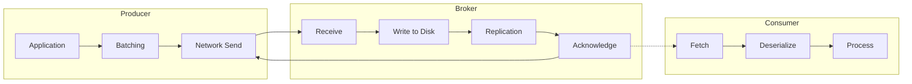
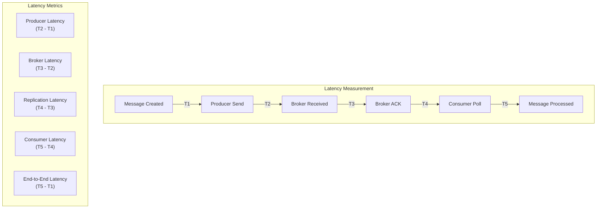

# How to Configure Kafka for Low Latency

Author: [nawazdhandala](https://www.github.com/nawazdhandala)

Tags: Apache Kafka, Low Latency, Performance, Configuration, Producer, Consumer, Broker

Description: Learn how to configure Kafka producers, consumers, and brokers for minimal latency in time-sensitive applications.

---

While Kafka is often optimized for throughput, many applications require low latency message delivery. This guide covers configurations and patterns to minimize end-to-end latency from producer to consumer.

## Understanding Kafka Latency

End-to-end latency in Kafka consists of several components:



### Latency Components

| Component | Typical Latency | Tunable |
|-----------|----------------|---------|
| Producer batching | 0-100ms | Yes |
| Network (producer to broker) | 0.5-10ms | Infrastructure |
| Broker disk write | 0.5-5ms | Yes |
| Replication | 1-10ms | Yes |
| Consumer fetch | 0-500ms | Yes |
| Network (broker to consumer) | 0.5-10ms | Infrastructure |

## Producer Configuration for Low Latency

### Minimal Batching Configuration

```java
import org.apache.kafka.clients.producer.*;
import java.util.Properties;

public class LowLatencyProducerConfig {

    public static KafkaProducer<String, String> createProducer(String bootstrapServers) {
        Properties props = new Properties();
        props.put(ProducerConfig.BOOTSTRAP_SERVERS_CONFIG, bootstrapServers);
        props.put(ProducerConfig.KEY_SERIALIZER_CLASS_CONFIG,
            "org.apache.kafka.common.serialization.StringSerializer");
        props.put(ProducerConfig.VALUE_SERIALIZER_CLASS_CONFIG,
            "org.apache.kafka.common.serialization.StringSerializer");

        // Disable batching delay - send immediately
        props.put(ProducerConfig.LINGER_MS_CONFIG, 0);

        // Small batch size to avoid waiting for batch to fill
        props.put(ProducerConfig.BATCH_SIZE_CONFIG, 16384);

        // Disable compression to avoid CPU overhead
        props.put(ProducerConfig.COMPRESSION_TYPE_CONFIG, "none");

        // Reduce request timeout
        props.put(ProducerConfig.REQUEST_TIMEOUT_MS_CONFIG, 10000);

        // Use acks=1 for lowest latency (leader only)
        // Use acks=all if durability is more important than latency
        props.put(ProducerConfig.ACKS_CONFIG, "1");

        // Enable idempotence for exactly-once without much latency cost
        props.put(ProducerConfig.ENABLE_IDEMPOTENCE_CONFIG, true);

        // Max in-flight requests - 1 ensures ordering but may impact latency
        // Higher values can improve latency at cost of ordering
        props.put(ProducerConfig.MAX_IN_FLIGHT_REQUESTS_PER_CONNECTION, 5);

        return new KafkaProducer<>(props);
    }
}
```

### Synchronous Send for Guaranteed Low Latency

```java
import org.apache.kafka.clients.producer.*;
import java.util.concurrent.Future;
import java.time.Duration;

public class SyncLowLatencyProducer {

    private final KafkaProducer<String, String> producer;

    public SyncLowLatencyProducer(String bootstrapServers) {
        this.producer = LowLatencyProducerConfig.createProducer(bootstrapServers);
    }

    /**
     * Send message synchronously with latency tracking.
     * Use when you need confirmation before proceeding.
     */
    public SendResult sendSync(String topic, String key, String value) throws Exception {
        long startTime = System.nanoTime();

        ProducerRecord<String, String> record = new ProducerRecord<>(topic, key, value);
        Future<RecordMetadata> future = producer.send(record);

        // Block until send completes
        RecordMetadata metadata = future.get();

        long latencyNanos = System.nanoTime() - startTime;
        long latencyMs = latencyNanos / 1_000_000;

        return new SendResult(metadata, latencyMs);
    }

    /**
     * Send message asynchronously with callback.
     * Lower latency from caller's perspective.
     */
    public void sendAsync(String topic, String key, String value,
                          SendCallback callback) {
        long startTime = System.nanoTime();

        ProducerRecord<String, String> record = new ProducerRecord<>(topic, key, value);

        producer.send(record, (metadata, exception) -> {
            long latencyNanos = System.nanoTime() - startTime;
            long latencyMs = latencyNanos / 1_000_000;

            if (exception == null) {
                callback.onSuccess(new SendResult(metadata, latencyMs));
            } else {
                callback.onFailure(exception, latencyMs);
            }
        });
    }

    public void close() {
        producer.close(Duration.ofSeconds(5));
    }

    public static class SendResult {
        public final RecordMetadata metadata;
        public final long latencyMs;

        public SendResult(RecordMetadata metadata, long latencyMs) {
            this.metadata = metadata;
            this.latencyMs = latencyMs;
        }
    }

    public interface SendCallback {
        void onSuccess(SendResult result);
        void onFailure(Exception e, long latencyMs);
    }
}
```

## Consumer Configuration for Low Latency

### Aggressive Fetch Configuration

```java
import org.apache.kafka.clients.consumer.*;
import java.util.Properties;

public class LowLatencyConsumerConfig {

    public static KafkaConsumer<String, String> createConsumer(String bootstrapServers,
                                                                String groupId) {
        Properties props = new Properties();
        props.put(ConsumerConfig.BOOTSTRAP_SERVERS_CONFIG, bootstrapServers);
        props.put(ConsumerConfig.GROUP_ID_CONFIG, groupId);
        props.put(ConsumerConfig.KEY_DESERIALIZER_CLASS_CONFIG,
            "org.apache.kafka.common.serialization.StringDeserializer");
        props.put(ConsumerConfig.VALUE_DESERIALIZER_CLASS_CONFIG,
            "org.apache.kafka.common.serialization.StringDeserializer");

        // Fetch immediately - do not wait for minimum bytes
        props.put(ConsumerConfig.FETCH_MIN_BYTES_CONFIG, 1);

        // Minimum wait time before returning
        // Lower values reduce latency but increase broker load
        props.put(ConsumerConfig.FETCH_MAX_WAIT_MS_CONFIG, 10);

        // Smaller max partition fetch for faster processing
        props.put(ConsumerConfig.MAX_PARTITION_FETCH_BYTES_CONFIG, 262144);  // 256 KB

        // Fewer records per poll for faster processing loop
        props.put(ConsumerConfig.MAX_POLL_RECORDS_CONFIG, 100);

        // Disable auto commit for manual control
        props.put(ConsumerConfig.ENABLE_AUTO_COMMIT_CONFIG, false);

        // Start from latest for real-time processing
        props.put(ConsumerConfig.AUTO_OFFSET_RESET_CONFIG, "latest");

        return new KafkaConsumer<>(props);
    }
}
```

### Low Latency Consumer Loop

```java
import org.apache.kafka.clients.consumer.*;
import org.apache.kafka.common.TopicPartition;
import java.util.*;
import java.time.Duration;

public class LowLatencyConsumer {

    private final KafkaConsumer<String, String> consumer;
    private volatile boolean running = true;
    private final LatencyTracker latencyTracker;

    public LowLatencyConsumer(String bootstrapServers, String groupId, String topic) {
        this.consumer = LowLatencyConsumerConfig.createConsumer(bootstrapServers, groupId);
        this.consumer.subscribe(Collections.singletonList(topic));
        this.latencyTracker = new LatencyTracker();
    }

    /**
     * Poll loop optimized for low latency.
     */
    public void pollLoop(MessageHandler handler) {
        while (running) {
            // Short poll timeout for responsiveness
            ConsumerRecords<String, String> records = consumer.poll(Duration.ofMillis(10));

            long pollTime = System.currentTimeMillis();

            for (ConsumerRecord<String, String> record : records) {
                long processStart = System.nanoTime();

                // Process message
                handler.handle(record);

                // Track latency
                long endToEndLatency = pollTime - record.timestamp();
                long processingLatency = (System.nanoTime() - processStart) / 1_000_000;

                latencyTracker.record(endToEndLatency, processingLatency);
            }

            // Commit after each batch for consistency
            if (!records.isEmpty()) {
                consumer.commitAsync();
            }
        }
    }

    /**
     * Get latency statistics.
     */
    public LatencyStats getLatencyStats() {
        return latencyTracker.getStats();
    }

    public void shutdown() {
        running = false;
        consumer.wakeup();
    }

    public interface MessageHandler {
        void handle(ConsumerRecord<String, String> record);
    }

    public static class LatencyTracker {
        private final List<Long> endToEndLatencies = new ArrayList<>();
        private final List<Long> processingLatencies = new ArrayList<>();

        public synchronized void record(long endToEnd, long processing) {
            endToEndLatencies.add(endToEnd);
            processingLatencies.add(processing);

            // Keep only last 10000 samples
            if (endToEndLatencies.size() > 10000) {
                endToEndLatencies.remove(0);
                processingLatencies.remove(0);
            }
        }

        public synchronized LatencyStats getStats() {
            if (endToEndLatencies.isEmpty()) {
                return new LatencyStats(0, 0, 0, 0, 0, 0);
            }

            List<Long> sortedE2E = new ArrayList<>(endToEndLatencies);
            Collections.sort(sortedE2E);

            List<Long> sortedProc = new ArrayList<>(processingLatencies);
            Collections.sort(sortedProc);

            return new LatencyStats(
                average(sortedE2E),
                percentile(sortedE2E, 0.99),
                sortedE2E.get(sortedE2E.size() - 1),
                average(sortedProc),
                percentile(sortedProc, 0.99),
                sortedProc.get(sortedProc.size() - 1)
            );
        }

        private double average(List<Long> values) {
            return values.stream().mapToLong(Long::longValue).average().orElse(0);
        }

        private long percentile(List<Long> sorted, double percentile) {
            int index = (int) Math.ceil(percentile * sorted.size()) - 1;
            return sorted.get(Math.max(0, index));
        }
    }

    public static class LatencyStats {
        public final double avgEndToEnd;
        public final long p99EndToEnd;
        public final long maxEndToEnd;
        public final double avgProcessing;
        public final long p99Processing;
        public final long maxProcessing;

        public LatencyStats(double avgEndToEnd, long p99EndToEnd, long maxEndToEnd,
                           double avgProcessing, long p99Processing, long maxProcessing) {
            this.avgEndToEnd = avgEndToEnd;
            this.p99EndToEnd = p99EndToEnd;
            this.maxEndToEnd = maxEndToEnd;
            this.avgProcessing = avgProcessing;
            this.p99Processing = p99Processing;
            this.maxProcessing = maxProcessing;
        }

        @Override
        public String toString() {
            return String.format(
                "End-to-End: avg=%.2fms, p99=%dms, max=%dms | " +
                "Processing: avg=%.2fms, p99=%dms, max=%dms",
                avgEndToEnd, p99EndToEnd, maxEndToEnd,
                avgProcessing, p99Processing, maxProcessing
            );
        }
    }
}
```

## Broker Configuration for Low Latency

### Server Properties

```properties
# Minimal replica acknowledgment for lower latency
# Set to 1 for lowest latency (risk of data loss if leader fails)
min.insync.replicas=1

# Faster log flush (trades durability for latency)
# Default is Long.MAX_VALUE - OS handles flushing
log.flush.interval.messages=1000
log.flush.interval.ms=1000

# Reduce network thread count if not CPU-bound
num.network.threads=3
num.io.threads=8

# Socket buffer sizes
socket.send.buffer.bytes=102400
socket.receive.buffer.bytes=102400

# Request processing
queued.max.requests=500

# Faster leader elections
replica.lag.time.max.ms=10000

# Log segment settings
log.segment.bytes=1073741824
log.index.interval.bytes=4096
```

### Topic Configuration for Low Latency

```bash
# Create topic optimized for low latency
kafka-topics.sh --create \
  --bootstrap-server localhost:9092 \
  --topic low-latency-topic \
  --partitions 6 \
  --replication-factor 2 \
  --config min.insync.replicas=1 \
  --config segment.bytes=536870912 \
  --config segment.ms=3600000
```

## Python Low Latency Configuration

```python
from confluent_kafka import Producer, Consumer
import time
from typing import Callable, Dict
import statistics


def create_low_latency_producer(bootstrap_servers: str) -> Producer:
    """
    Create a producer configured for minimal latency.
    """
    config = {
        'bootstrap.servers': bootstrap_servers,

        # Disable batching delay
        'queue.buffering.max.ms': 0,

        # Small batch size
        'batch.size': 16384,

        # No compression
        'compression.type': 'none',

        # Leader acknowledgment only
        'acks': 1,

        # Lower timeouts
        'request.timeout.ms': 10000,
        'delivery.timeout.ms': 30000,

        # Enable idempotence
        'enable.idempotence': True
    }

    return Producer(config)


def create_low_latency_consumer(bootstrap_servers: str, group_id: str) -> Consumer:
    """
    Create a consumer configured for minimal latency.
    """
    config = {
        'bootstrap.servers': bootstrap_servers,
        'group.id': group_id,
        'auto.offset.reset': 'latest',
        'enable.auto.commit': False,

        # Fetch immediately
        'fetch.min.bytes': 1,
        'fetch.wait.max.ms': 10,

        # Smaller fetch sizes
        'max.partition.fetch.bytes': 262144,

        # Fewer records per poll
        'max.poll.records': 100
    }

    return Consumer(config)


class LatencyMeasuringProducer:
    """
    Producer wrapper that measures send latency.
    """

    def __init__(self, bootstrap_servers: str):
        self.producer = create_low_latency_producer(bootstrap_servers)
        self.latencies = []

    def send(self, topic: str, key: str, value: str) -> float:
        """
        Send message and return latency in milliseconds.
        """
        start_time = time.time()

        # Use delivery callback to measure actual delivery time
        delivery_time = [None]

        def delivery_callback(err, msg):
            delivery_time[0] = time.time()
            if err:
                print(f"Delivery failed: {err}")

        self.producer.produce(
            topic,
            key=key.encode('utf-8') if key else None,
            value=value.encode('utf-8'),
            callback=delivery_callback
        )

        # Flush to ensure delivery
        self.producer.flush(timeout=10)

        latency_ms = (delivery_time[0] - start_time) * 1000
        self.latencies.append(latency_ms)

        return latency_ms

    def get_stats(self) -> Dict:
        """Get latency statistics."""
        if not self.latencies:
            return {}

        sorted_latencies = sorted(self.latencies)
        p99_index = int(len(sorted_latencies) * 0.99)

        return {
            'count': len(self.latencies),
            'avg_ms': statistics.mean(self.latencies),
            'min_ms': min(self.latencies),
            'max_ms': max(self.latencies),
            'p99_ms': sorted_latencies[p99_index] if p99_index < len(sorted_latencies) else sorted_latencies[-1]
        }

    def close(self):
        self.producer.flush()


class LatencyMeasuringConsumer:
    """
    Consumer wrapper that measures end-to-end latency.
    """

    def __init__(self, bootstrap_servers: str, group_id: str, topics: list):
        self.consumer = create_low_latency_consumer(bootstrap_servers, group_id)
        self.consumer.subscribe(topics)
        self.latencies = []
        self.running = True

    def poll_loop(self, handler: Callable, duration_seconds: float = None):
        """
        Poll loop that measures latency.
        """
        start = time.time()

        while self.running:
            if duration_seconds and (time.time() - start) > duration_seconds:
                break

            msg = self.consumer.poll(timeout=0.01)

            if msg is None:
                continue

            if msg.error():
                continue

            # Calculate end-to-end latency
            receive_time = time.time() * 1000
            message_time = msg.timestamp()[1]  # Message timestamp in ms
            latency = receive_time - message_time
            self.latencies.append(latency)

            # Process message
            handler(msg)

            # Commit
            self.consumer.commit(msg)

    def get_stats(self) -> Dict:
        """Get latency statistics."""
        if not self.latencies:
            return {}

        sorted_latencies = sorted(self.latencies)
        p99_index = int(len(sorted_latencies) * 0.99)

        return {
            'count': len(self.latencies),
            'avg_ms': statistics.mean(self.latencies),
            'min_ms': min(self.latencies),
            'max_ms': max(self.latencies),
            'p99_ms': sorted_latencies[p99_index] if p99_index < len(sorted_latencies) else sorted_latencies[-1]
        }

    def stop(self):
        self.running = False

    def close(self):
        self.consumer.close()
```

## Latency Measurement Architecture



## Latency Optimization Checklist

### Producer Optimizations

```java
// Optimization checklist for producers
Properties props = new Properties();

// 1. Minimize batching delay
props.put(ProducerConfig.LINGER_MS_CONFIG, 0);

// 2. Use appropriate acks setting
// acks=0: Lowest latency, no durability guarantee
// acks=1: Good balance (leader acknowledgment)
// acks=all: Highest durability, highest latency
props.put(ProducerConfig.ACKS_CONFIG, "1");

// 3. Disable compression for CPU-sensitive workloads
props.put(ProducerConfig.COMPRESSION_TYPE_CONFIG, "none");

// 4. Tune max.in.flight.requests
// Higher values can improve latency but may affect ordering
props.put(ProducerConfig.MAX_IN_FLIGHT_REQUESTS_PER_CONNECTION, 5);

// 5. Use appropriate buffer sizes
props.put(ProducerConfig.BUFFER_MEMORY_CONFIG, 33554432);

// 6. Enable TCP nodelay
// Note: This is handled at OS level, not Kafka config
```

### Consumer Optimizations

```java
// Optimization checklist for consumers
Properties props = new Properties();

// 1. Fetch immediately
props.put(ConsumerConfig.FETCH_MIN_BYTES_CONFIG, 1);
props.put(ConsumerConfig.FETCH_MAX_WAIT_MS_CONFIG, 10);

// 2. Limit records per poll
props.put(ConsumerConfig.MAX_POLL_RECORDS_CONFIG, 100);

// 3. Use short poll timeout
// In poll loop: consumer.poll(Duration.ofMillis(10))

// 4. Start from latest for real-time processing
props.put(ConsumerConfig.AUTO_OFFSET_RESET_CONFIG, "latest");

// 5. Disable auto commit for manual control
props.put(ConsumerConfig.ENABLE_AUTO_COMMIT_CONFIG, false);
```

## Tradeoffs to Consider

| Configuration | Lower Latency | Higher Latency | Tradeoff |
|--------------|---------------|----------------|----------|
| `acks=0` | Yes | | No durability |
| `acks=1` | | Yes | Leader durability |
| `acks=all` | | Yes | Full durability |
| `linger.ms=0` | Yes | | Lower throughput |
| `compression=none` | Yes | | Larger messages |
| `fetch.min.bytes=1` | Yes | | Higher broker CPU |
| Low replication | Yes | | Less fault tolerance |

## Monitoring Latency

```bash
# Check producer latency via JMX
kafka-run-class.sh kafka.tools.JmxTool \
  --object-name kafka.producer:type=producer-metrics,client-id=* \
  --attributes request-latency-avg,request-latency-max \
  --jmx-url service:jmx:rmi:///jndi/rmi://localhost:9999/jmxrmi

# Check consumer latency
kafka-run-class.sh kafka.tools.JmxTool \
  --object-name kafka.consumer:type=consumer-fetch-manager-metrics,client-id=* \
  --attributes fetch-latency-avg,fetch-latency-max \
  --jmx-url service:jmx:rmi:///jndi/rmi://localhost:9999/jmxrmi
```

## Conclusion

Achieving low latency in Kafka requires careful tuning across producers, consumers, and brokers. The key settings are `linger.ms`, `fetch.min.bytes`, `fetch.max.wait.ms`, and `acks`. Remember that low latency often comes at the cost of throughput and durability, so choose settings based on your specific requirements. Always measure latency in production to validate your configuration.
