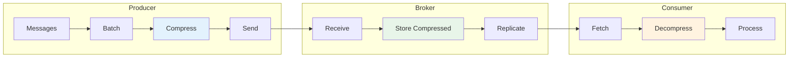
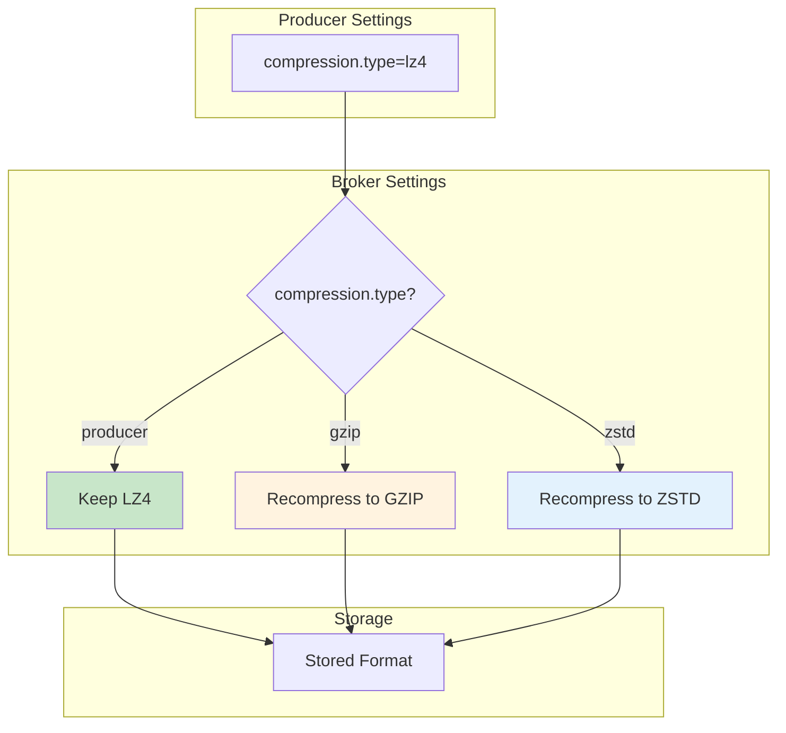

# How to Handle Kafka Message Compression

Author: [nawazdhandala](https://github.com/nawazdhandala)

Tags: Apache Kafka, Compression, Performance, Optimization, DevOps, Streaming

Description: Learn how to configure and optimize Kafka message compression to reduce storage costs, improve throughput, and minimize network bandwidth usage.

---

Message compression in Kafka reduces storage costs and network bandwidth while potentially improving throughput. However, choosing the wrong compression algorithm or configuration can hurt performance. This guide covers how to select, configure, and optimize compression for your Kafka workloads.

## Compression Overview



## Compression Algorithms Comparison

Kafka supports four compression types. Each has different trade-offs between compression ratio, CPU usage, and speed.

| Algorithm | Compression Ratio | CPU Usage | Speed | Best For |
|-----------|------------------|-----------|-------|----------|
| **none** | 1.0x | None | Fastest | Low latency requirements |
| **gzip** | High (2.5-3x) | High | Slow | Maximum space savings |
| **snappy** | Medium (1.5-2x) | Low | Fast | Balanced workloads |
| **lz4** | Medium (1.5-2x) | Very Low | Fastest | High throughput |
| **zstd** | High (2.5-3x) | Medium | Fast | Best overall |

## Producer Compression Configuration

```java
// Producer configuration for different compression strategies
public class CompressionConfig {

    // High throughput configuration using LZ4
    public static Properties highThroughputConfig() {
        Properties props = new Properties();
        props.put(ProducerConfig.BOOTSTRAP_SERVERS_CONFIG, "kafka:9092");

        // LZ4 provides fast compression with good ratios
        props.put(ProducerConfig.COMPRESSION_TYPE_CONFIG, "lz4");

        // Larger batches compress better
        props.put(ProducerConfig.BATCH_SIZE_CONFIG, 65536); // 64KB

        // Wait for more messages to fill the batch
        props.put(ProducerConfig.LINGER_MS_CONFIG, 20);

        // Buffer memory for batching
        props.put(ProducerConfig.BUFFER_MEMORY_CONFIG, 67108864); // 64MB

        props.put(ProducerConfig.KEY_SERIALIZER_CLASS_CONFIG,
            StringSerializer.class.getName());
        props.put(ProducerConfig.VALUE_SERIALIZER_CLASS_CONFIG,
            StringSerializer.class.getName());

        return props;
    }

    // Maximum compression configuration using ZSTD
    public static Properties maxCompressionConfig() {
        Properties props = new Properties();
        props.put(ProducerConfig.BOOTSTRAP_SERVERS_CONFIG, "kafka:9092");

        // ZSTD provides best compression ratio with reasonable speed
        props.put(ProducerConfig.COMPRESSION_TYPE_CONFIG, "zstd");

        // Large batches for better compression
        props.put(ProducerConfig.BATCH_SIZE_CONFIG, 131072); // 128KB

        // Wait longer to fill batches
        props.put(ProducerConfig.LINGER_MS_CONFIG, 50);

        props.put(ProducerConfig.KEY_SERIALIZER_CLASS_CONFIG,
            StringSerializer.class.getName());
        props.put(ProducerConfig.VALUE_SERIALIZER_CLASS_CONFIG,
            StringSerializer.class.getName());

        return props;
    }

    // Low latency configuration with Snappy
    public static Properties lowLatencyConfig() {
        Properties props = new Properties();
        props.put(ProducerConfig.BOOTSTRAP_SERVERS_CONFIG, "kafka:9092");

        // Snappy is fast with acceptable compression
        props.put(ProducerConfig.COMPRESSION_TYPE_CONFIG, "snappy");

        // Smaller batches for lower latency
        props.put(ProducerConfig.BATCH_SIZE_CONFIG, 16384); // 16KB

        // Minimal linger time
        props.put(ProducerConfig.LINGER_MS_CONFIG, 5);

        props.put(ProducerConfig.KEY_SERIALIZER_CLASS_CONFIG,
            StringSerializer.class.getName());
        props.put(ProducerConfig.VALUE_SERIALIZER_CLASS_CONFIG,
            StringSerializer.class.getName());

        return props;
    }
}
```

## Broker-Side Compression Settings

Brokers can recompress messages if needed. Configure topic-level compression policy.

```bash
#!/bin/bash
# Configure compression at the topic level

BOOTSTRAP="kafka:9092"

# Create topic with compression type
kafka-topics.sh --bootstrap-server $BOOTSTRAP \
    --create \
    --topic compressed-logs \
    --partitions 12 \
    --replication-factor 3 \
    --config compression.type=zstd

# Update existing topic compression
kafka-configs.sh --bootstrap-server $BOOTSTRAP \
    --alter \
    --entity-type topics \
    --entity-name existing-topic \
    --add-config compression.type=lz4

# Set broker default compression
# In server.properties:
# compression.type=producer  # Keep producer compression (recommended)
# compression.type=gzip      # Recompress to gzip
# compression.type=zstd      # Recompress to zstd
```



## Optimal Batch Size for Compression

Compression works best on larger batches. Calculate optimal batch size based on your message characteristics.

```java
// Batch size optimizer for compression
public class BatchSizeOptimizer {

    // Calculate optimal batch size based on message characteristics
    public static int calculateOptimalBatchSize(int avgMessageSize,
                                                 int messagesPerSecond,
                                                 int targetLatencyMs) {
        // Messages that can be batched within target latency
        int messagesPerBatch = (messagesPerSecond * targetLatencyMs) / 1000;

        // Optimal batch size in bytes
        int batchSize = messagesPerBatch * avgMessageSize;

        // Clamp to reasonable bounds
        // Minimum: 16KB (compression overhead not worth it below this)
        // Maximum: 1MB (diminishing returns above this)
        return Math.max(16384, Math.min(batchSize, 1048576));
    }

    // Measure compression ratio for your data
    public static double measureCompressionRatio(String compressionType,
                                                  List<byte[]> sampleMessages) {
        // Create a temporary producer to measure compression
        Properties props = new Properties();
        props.put(ProducerConfig.BOOTSTRAP_SERVERS_CONFIG, "kafka:9092");
        props.put(ProducerConfig.COMPRESSION_TYPE_CONFIG, compressionType);
        props.put(ProducerConfig.BATCH_SIZE_CONFIG, 1048576); // 1MB
        props.put(ProducerConfig.LINGER_MS_CONFIG, 1000);

        // Calculate uncompressed size
        long uncompressedSize = sampleMessages.stream()
            .mapToLong(m -> m.length)
            .sum();

        // Compress using the algorithm
        long compressedSize = compress(sampleMessages, compressionType);

        return (double) uncompressedSize / compressedSize;
    }

    private static long compress(List<byte[]> messages, String type) {
        // Concatenate messages (simulating batch)
        ByteArrayOutputStream baos = new ByteArrayOutputStream();
        for (byte[] msg : messages) {
            try {
                baos.write(msg);
            } catch (IOException e) {
                throw new RuntimeException(e);
            }
        }
        byte[] data = baos.toByteArray();

        // Compress based on type
        try {
            switch (type) {
                case "gzip":
                    return compressGzip(data).length;
                case "snappy":
                    return Snappy.compress(data).length;
                case "lz4":
                    return compressLz4(data).length;
                case "zstd":
                    return Zstd.compress(data).length;
                default:
                    return data.length;
            }
        } catch (Exception e) {
            throw new RuntimeException(e);
        }
    }

    private static byte[] compressGzip(byte[] data) throws IOException {
        ByteArrayOutputStream baos = new ByteArrayOutputStream();
        try (GZIPOutputStream gzip = new GZIPOutputStream(baos)) {
            gzip.write(data);
        }
        return baos.toByteArray();
    }

    private static byte[] compressLz4(byte[] data) {
        LZ4Factory factory = LZ4Factory.fastestInstance();
        LZ4Compressor compressor = factory.fastCompressor();
        int maxLen = compressor.maxCompressedLength(data.length);
        byte[] compressed = new byte[maxLen];
        int len = compressor.compress(data, 0, data.length,
            compressed, 0, maxLen);
        return Arrays.copyOf(compressed, len);
    }
}
```

## Consumer Decompression

Consumers automatically decompress messages. Ensure adequate CPU resources for high-throughput consumers.

```java
// Consumer configuration for compressed topics
public class CompressedConsumer {

    public static Properties createConfig() {
        Properties props = new Properties();
        props.put(ConsumerConfig.BOOTSTRAP_SERVERS_CONFIG, "kafka:9092");
        props.put(ConsumerConfig.GROUP_ID_CONFIG, "compressed-consumer-group");

        // Fetch larger batches for efficient decompression
        // Decompressing many small fetches is less efficient
        props.put(ConsumerConfig.FETCH_MIN_BYTES_CONFIG, 65536); // 64KB minimum
        props.put(ConsumerConfig.FETCH_MAX_BYTES_CONFIG, 52428800); // 50MB max

        // Max bytes per partition
        props.put(ConsumerConfig.MAX_PARTITION_FETCH_BYTES_CONFIG, 10485760); // 10MB

        // Wait for batches to fill
        props.put(ConsumerConfig.FETCH_MAX_WAIT_MS_CONFIG, 500);

        props.put(ConsumerConfig.KEY_DESERIALIZER_CLASS_CONFIG,
            StringDeserializer.class.getName());
        props.put(ConsumerConfig.VALUE_DESERIALIZER_CLASS_CONFIG,
            StringDeserializer.class.getName());

        return props;
    }

    // Monitor decompression performance
    public void consumeWithMetrics(MeterRegistry registry) {
        Timer decompressionTimer = registry.timer("kafka.consumer.decompression");
        Counter bytesDecompressed = registry.counter("kafka.consumer.bytes.decompressed");

        KafkaConsumer<String, String> consumer = new KafkaConsumer<>(createConfig());
        consumer.subscribe(Collections.singletonList("compressed-topic"));

        while (true) {
            ConsumerRecords<String, String> records = consumer.poll(Duration.ofMillis(100));

            for (ConsumerRecord<String, String> record : records) {
                Timer.Sample sample = Timer.start();

                // Process record (decompression happens during poll)
                processRecord(record);

                sample.stop(decompressionTimer);
                bytesDecompressed.increment(record.serializedValueSize());
            }
        }
    }

    private void processRecord(ConsumerRecord<String, String> record) {
        // Business logic
        System.out.println("Processed: " + record.key());
    }
}
```

## End-to-End Compression with Custom Serializers

For maximum compression, combine Kafka's built-in compression with pre-compression in your serializer.

```java
// Custom compressing serializer for additional compression
public class CompressingSerializer implements Serializer<Object> {

    private final ObjectMapper objectMapper;
    private final String compressionType;

    public CompressingSerializer() {
        this.objectMapper = new ObjectMapper();
        this.compressionType = "zstd";
    }

    @Override
    public void configure(Map<String, ?> configs, boolean isKey) {
        // Configuration can be passed via configs map
    }

    @Override
    public byte[] serialize(String topic, Object data) {
        if (data == null) {
            return null;
        }

        try {
            // First: serialize to JSON
            byte[] json = objectMapper.writeValueAsBytes(data);

            // Second: compress
            return compressData(json);
        } catch (Exception e) {
            throw new SerializationException("Failed to serialize", e);
        }
    }

    private byte[] compressData(byte[] data) {
        switch (compressionType) {
            case "zstd":
                return Zstd.compress(data);
            case "lz4":
                LZ4Factory factory = LZ4Factory.fastestInstance();
                LZ4Compressor compressor = factory.fastCompressor();
                int maxLen = compressor.maxCompressedLength(data.length);
                byte[] output = new byte[maxLen + 4]; // 4 bytes for original length

                // Store original length for decompression
                ByteBuffer.wrap(output).putInt(data.length);

                int compressedLen = compressor.compress(
                    data, 0, data.length, output, 4, maxLen);
                return Arrays.copyOf(output, compressedLen + 4);
            default:
                return data;
        }
    }

    @Override
    public void close() {
        // Cleanup if needed
    }
}

// Corresponding deserializer
public class DecompressingDeserializer implements Deserializer<Object> {

    private final ObjectMapper objectMapper;
    private final String compressionType;
    private Class<?> targetClass;

    public DecompressingDeserializer() {
        this.objectMapper = new ObjectMapper();
        this.compressionType = "zstd";
    }

    @Override
    public void configure(Map<String, ?> configs, boolean isKey) {
        String className = (String) configs.get("value.deserializer.class");
        if (className != null) {
            try {
                this.targetClass = Class.forName(className);
            } catch (ClassNotFoundException e) {
                this.targetClass = Object.class;
            }
        }
    }

    @Override
    public Object deserialize(String topic, byte[] data) {
        if (data == null) {
            return null;
        }

        try {
            // First: decompress
            byte[] decompressed = decompressData(data);

            // Second: deserialize from JSON
            return objectMapper.readValue(decompressed,
                targetClass != null ? targetClass : Object.class);
        } catch (Exception e) {
            throw new SerializationException("Failed to deserialize", e);
        }
    }

    private byte[] decompressData(byte[] data) {
        switch (compressionType) {
            case "zstd":
                return Zstd.decompress(data, (int) Zstd.decompressedSize(data));
            case "lz4":
                LZ4Factory factory = LZ4Factory.fastestInstance();
                LZ4FastDecompressor decompressor = factory.fastDecompressor();

                // Read original length from first 4 bytes
                int originalLength = ByteBuffer.wrap(data).getInt();
                byte[] output = new byte[originalLength];

                decompressor.decompress(data, 4, output, 0, originalLength);
                return output;
            default:
                return data;
        }
    }

    @Override
    public void close() {
        // Cleanup if needed
    }
}
```

## Monitoring Compression Metrics

```java
// Compression metrics monitoring
public class CompressionMetrics {

    private final MeterRegistry registry;

    public CompressionMetrics(MeterRegistry registry) {
        this.registry = registry;
    }

    // Track producer compression metrics
    public void trackProducerMetrics(KafkaProducer<?, ?> producer) {
        // Register JMX metrics as Micrometer gauges

        // Compression ratio per topic
        Gauge.builder("kafka.producer.compression.ratio",
            () -> getMetric(producer, "compression-rate-avg"))
            .description("Average compression ratio")
            .register(registry);

        // Record batch size
        Gauge.builder("kafka.producer.batch.size.avg",
            () -> getMetric(producer, "batch-size-avg"))
            .description("Average batch size in bytes")
            .register(registry);

        // Record queue time (affected by batching/compression)
        Gauge.builder("kafka.producer.record.queue.time.avg",
            () -> getMetric(producer, "record-queue-time-avg"))
            .description("Average time record spent in queue")
            .register(registry);
    }

    private double getMetric(KafkaProducer<?, ?> producer, String metricName) {
        for (Map.Entry<MetricName, ? extends Metric> entry :
                producer.metrics().entrySet()) {
            if (entry.getKey().name().equals(metricName)) {
                Object value = entry.getValue().metricValue();
                if (value instanceof Number) {
                    return ((Number) value).doubleValue();
                }
            }
        }
        return 0.0;
    }

    // Calculate compression savings
    public void reportCompressionSavings(String topic,
                                          long uncompressedBytes,
                                          long compressedBytes) {
        double ratio = (double) uncompressedBytes / compressedBytes;
        double savings = (1 - (double) compressedBytes / uncompressedBytes) * 100;

        registry.gauge("kafka.compression.ratio",
            Tags.of("topic", topic), ratio);
        registry.gauge("kafka.compression.savings.percent",
            Tags.of("topic", topic), savings);

        System.out.printf("Topic %s: %.2fx compression (%.1f%% savings)%n",
            topic, ratio, savings);
    }
}
```

## Compression Benchmarking Tool

```java
// Benchmark different compression algorithms for your data
public class CompressionBenchmark {

    public static void main(String[] args) {
        // Sample your actual data
        List<byte[]> sampleMessages = loadSampleMessages();

        System.out.println("Compression Benchmark Results");
        System.out.println("=====================================");
        System.out.printf("Sample size: %d messages, %d bytes total%n",
            sampleMessages.size(),
            sampleMessages.stream().mapToLong(m -> m.length).sum());
        System.out.println();

        // Benchmark each algorithm
        for (String algorithm : Arrays.asList("none", "gzip", "snappy", "lz4", "zstd")) {
            benchmarkAlgorithm(algorithm, sampleMessages);
        }
    }

    private static void benchmarkAlgorithm(String algorithm, List<byte[]> messages) {
        long totalUncompressed = messages.stream().mapToLong(m -> m.length).sum();

        // Warm up
        for (int i = 0; i < 10; i++) {
            compressAll(algorithm, messages);
        }

        // Benchmark compression
        long compressStart = System.nanoTime();
        int iterations = 100;
        long totalCompressed = 0;

        for (int i = 0; i < iterations; i++) {
            totalCompressed = compressAll(algorithm, messages);
        }

        long compressTime = (System.nanoTime() - compressStart) / iterations;

        // Benchmark decompression
        byte[] compressed = getCompressed(algorithm, messages);
        long decompressStart = System.nanoTime();

        for (int i = 0; i < iterations; i++) {
            decompress(algorithm, compressed, (int) totalUncompressed);
        }

        long decompressTime = (System.nanoTime() - decompressStart) / iterations;

        // Report results
        double ratio = (double) totalUncompressed / totalCompressed;
        double compressThroughput = totalUncompressed / (compressTime / 1e9) / 1e6;
        double decompressThroughput = totalUncompressed / (decompressTime / 1e9) / 1e6;

        System.out.printf("%-8s | Ratio: %5.2fx | Compress: %6.1f MB/s | Decompress: %6.1f MB/s%n",
            algorithm, ratio, compressThroughput, decompressThroughput);
    }

    private static long compressAll(String algorithm, List<byte[]> messages) {
        // Concatenate all messages (simulating a batch)
        ByteArrayOutputStream baos = new ByteArrayOutputStream();
        for (byte[] msg : messages) {
            try {
                baos.write(msg);
            } catch (IOException e) {
                throw new RuntimeException(e);
            }
        }

        return getCompressed(algorithm, baos.toByteArray()).length;
    }

    private static byte[] getCompressed(String algorithm, List<byte[]> messages) {
        ByteArrayOutputStream baos = new ByteArrayOutputStream();
        for (byte[] msg : messages) {
            try {
                baos.write(msg);
            } catch (IOException e) {
                throw new RuntimeException(e);
            }
        }
        return getCompressed(algorithm, baos.toByteArray());
    }

    private static byte[] getCompressed(String algorithm, byte[] data) {
        try {
            switch (algorithm) {
                case "none":
                    return data;
                case "gzip":
                    ByteArrayOutputStream baos = new ByteArrayOutputStream();
                    try (GZIPOutputStream gzip = new GZIPOutputStream(baos)) {
                        gzip.write(data);
                    }
                    return baos.toByteArray();
                case "snappy":
                    return Snappy.compress(data);
                case "lz4":
                    LZ4Compressor compressor = LZ4Factory.fastestInstance().fastCompressor();
                    int maxLen = compressor.maxCompressedLength(data.length);
                    byte[] output = new byte[maxLen];
                    int len = compressor.compress(data, 0, data.length, output, 0, maxLen);
                    return Arrays.copyOf(output, len);
                case "zstd":
                    return Zstd.compress(data);
                default:
                    return data;
            }
        } catch (Exception e) {
            throw new RuntimeException(e);
        }
    }

    private static byte[] decompress(String algorithm, byte[] data, int originalSize) {
        try {
            switch (algorithm) {
                case "none":
                    return data;
                case "gzip":
                    ByteArrayInputStream bais = new ByteArrayInputStream(data);
                    try (GZIPInputStream gzip = new GZIPInputStream(bais)) {
                        return gzip.readAllBytes();
                    }
                case "snappy":
                    return Snappy.uncompress(data);
                case "lz4":
                    LZ4FastDecompressor decompressor =
                        LZ4Factory.fastestInstance().fastDecompressor();
                    byte[] output = new byte[originalSize];
                    decompressor.decompress(data, 0, output, 0, originalSize);
                    return output;
                case "zstd":
                    return Zstd.decompress(data, originalSize);
                default:
                    return data;
            }
        } catch (Exception e) {
            throw new RuntimeException(e);
        }
    }

    private static List<byte[]> loadSampleMessages() {
        // Load your actual message samples here
        List<byte[]> messages = new ArrayList<>();
        for (int i = 0; i < 1000; i++) {
            // Simulate JSON log messages
            String json = String.format(
                "{\"timestamp\":\"%s\",\"level\":\"INFO\",\"service\":\"api\"," +
                "\"message\":\"Request processed successfully\"," +
                "\"requestId\":\"%s\",\"duration\":%d}",
                Instant.now().toString(),
                UUID.randomUUID().toString(),
                (int)(Math.random() * 1000)
            );
            messages.add(json.getBytes());
        }
        return messages;
    }
}
```

## Summary

| Configuration | Recommendation |
|--------------|----------------|
| **Algorithm** | ZSTD for best ratio, LZ4 for speed |
| **Batch size** | 64KB-128KB for good compression |
| **Linger time** | 10-50ms to fill batches |
| **Broker setting** | Use `producer` to avoid recompression |
| **Consumer fetch** | Large batches (64KB+ min) |

Compression can significantly reduce your Kafka storage and network costs. Choose ZSTD for the best compression ratio or LZ4 for maximum throughput. Always benchmark with your actual data to find the optimal configuration for your workload.
