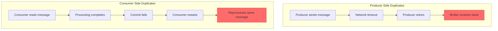
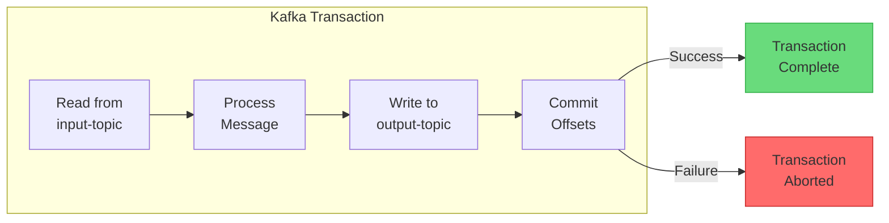
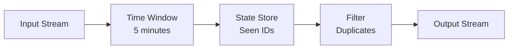
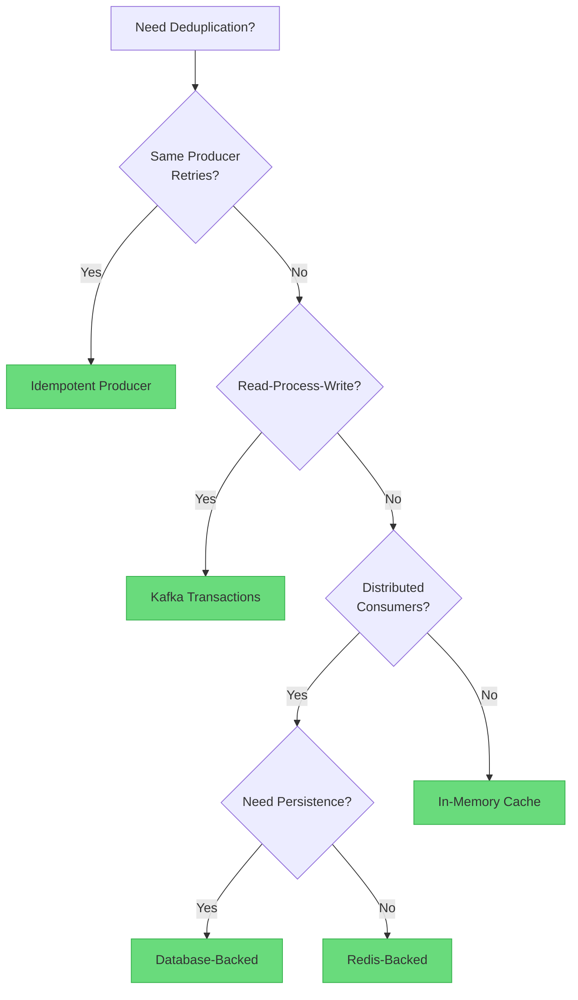

# How to Handle Kafka Message Deduplication

Author: [nawazdhandala](https://www.github.com/nawazdhandala)

Tags: Kafka, Deduplication, Idempotency, Exactly-Once, Message Queue, Java, Backend, Reliability

Description: Learn strategies for handling message deduplication in Apache Kafka, including idempotent producers, exactly-once semantics, and consumer-side deduplication patterns.

---

> Duplicate messages in Kafka are common due to network issues, producer retries, and consumer reprocessing after failures. Proper deduplication ensures data consistency and prevents double-processing of business logic. This guide covers multiple strategies for handling duplicates at different levels.

Duplicate messages can cause incorrect counts, double charges, and data corruption. Proper deduplication is essential for reliable systems.

---

## Why Duplicates Occur



---

## 1. Idempotent Producer

Enable idempotent producer to prevent duplicates from retries:

```java
// Configure idempotent producer
// This prevents duplicates caused by network retries
import org.apache.kafka.clients.producer.KafkaProducer;
import org.apache.kafka.clients.producer.ProducerConfig;
import org.apache.kafka.clients.producer.ProducerRecord;

Properties props = new Properties();
props.put(ProducerConfig.BOOTSTRAP_SERVERS_CONFIG, "localhost:9092");
props.put(ProducerConfig.KEY_SERIALIZER_CLASS_CONFIG,
    "org.apache.kafka.common.serialization.StringSerializer");
props.put(ProducerConfig.VALUE_SERIALIZER_CLASS_CONFIG,
    "org.apache.kafka.common.serialization.StringSerializer");

// Enable idempotent producer - prevents duplicate messages from retries
// The broker tracks producer sequence numbers and deduplicates
props.put(ProducerConfig.ENABLE_IDEMPOTENCE_CONFIG, true);

// These settings are automatically configured with idempotence
// but shown here for clarity:
// - acks=all: Wait for all replicas to acknowledge
// - retries=Integer.MAX_VALUE: Retry indefinitely
// - max.in.flight.requests.per.connection<=5: Limit in-flight requests
props.put(ProducerConfig.ACKS_CONFIG, "all");
props.put(ProducerConfig.RETRIES_CONFIG, Integer.MAX_VALUE);
props.put(ProducerConfig.MAX_IN_FLIGHT_REQUESTS_PER_CONNECTION, 5);

KafkaProducer<String, String> producer = new KafkaProducer<>(props);

// Send message - retries are now deduplicated automatically
producer.send(new ProducerRecord<>("orders", "order-123", orderJson));
```

---

## 2. Exactly-Once Semantics with Transactions

Use transactions for exactly-once processing between topics:



```java
// Exactly-once processing with Kafka transactions
// Guarantees atomic read-process-write operations
import org.apache.kafka.clients.consumer.*;
import org.apache.kafka.clients.producer.*;

// Configure transactional producer
Properties producerProps = new Properties();
producerProps.put(ProducerConfig.BOOTSTRAP_SERVERS_CONFIG, "localhost:9092");
producerProps.put(ProducerConfig.KEY_SERIALIZER_CLASS_CONFIG, StringSerializer.class);
producerProps.put(ProducerConfig.VALUE_SERIALIZER_CLASS_CONFIG, StringSerializer.class);

// Transactional ID must be unique per producer instance
// Used to fence zombie producers after failures
producerProps.put(ProducerConfig.TRANSACTIONAL_ID_CONFIG, "order-processor-1");

// Idempotence is required for transactions
producerProps.put(ProducerConfig.ENABLE_IDEMPOTENCE_CONFIG, true);

KafkaProducer<String, String> producer = new KafkaProducer<>(producerProps);

// Initialize transactions - must be called once before any transactional operations
producer.initTransactions();

// Configure consumer for transactional reads
Properties consumerProps = new Properties();
consumerProps.put(ConsumerConfig.BOOTSTRAP_SERVERS_CONFIG, "localhost:9092");
consumerProps.put(ConsumerConfig.GROUP_ID_CONFIG, "order-processor-group");
consumerProps.put(ConsumerConfig.KEY_DESERIALIZER_CLASS_CONFIG, StringDeserializer.class);
consumerProps.put(ConsumerConfig.VALUE_DESERIALIZER_CLASS_CONFIG, StringDeserializer.class);

// Only read committed messages - skip uncommitted transactions
consumerProps.put(ConsumerConfig.ISOLATION_LEVEL_CONFIG, "read_committed");

// Disable auto-commit - we commit offsets within transactions
consumerProps.put(ConsumerConfig.ENABLE_AUTO_COMMIT_CONFIG, false);

KafkaConsumer<String, String> consumer = new KafkaConsumer<>(consumerProps);
consumer.subscribe(Collections.singletonList("input-orders"));

// Process messages with exactly-once semantics
while (true) {
    ConsumerRecords<String, String> records = consumer.poll(Duration.ofMillis(100));

    if (!records.isEmpty()) {
        try {
            // Begin transaction
            producer.beginTransaction();

            for (ConsumerRecord<String, String> record : records) {
                // Process the message
                String processedValue = processOrder(record.value());

                // Send to output topic within the same transaction
                producer.send(new ProducerRecord<>(
                    "processed-orders",
                    record.key(),
                    processedValue
                ));
            }

            // Commit consumer offsets within the transaction
            // This makes the read and write atomic
            producer.sendOffsetsToTransaction(
                getOffsetsToCommit(records),
                consumer.groupMetadata()
            );

            // Commit the transaction - all or nothing
            producer.commitTransaction();

        } catch (ProducerFencedException | OutOfOrderSequenceException e) {
            // Fatal errors - cannot recover
            producer.close();
            throw e;
        } catch (KafkaException e) {
            // Abort transaction and retry
            producer.abortTransaction();
        }
    }
}

// Helper method to extract offsets for committing
private Map<TopicPartition, OffsetAndMetadata> getOffsetsToCommit(
        ConsumerRecords<String, String> records) {

    Map<TopicPartition, OffsetAndMetadata> offsets = new HashMap<>();

    for (TopicPartition partition : records.partitions()) {
        List<ConsumerRecord<String, String>> partitionRecords = records.records(partition);
        // Get the last offset for each partition
        long lastOffset = partitionRecords.get(partitionRecords.size() - 1).offset();
        // Commit offset + 1 (next offset to read)
        offsets.put(partition, new OffsetAndMetadata(lastOffset + 1));
    }

    return offsets;
}
```

---

## 3. Consumer-Side Deduplication with Message IDs

When producer idempotence is not enough, implement consumer-side deduplication:

```java
// Consumer-side deduplication using message ID tracking
// Useful when producers cannot guarantee idempotence
public class DeduplicatingConsumer {

    private final KafkaConsumer<String, String> consumer;
    private final Set<String> processedIds;
    private final int maxCacheSize;

    public DeduplicatingConsumer(Properties props, int maxCacheSize) {
        this.consumer = new KafkaConsumer<>(props);
        // Use LinkedHashSet to maintain insertion order for LRU eviction
        this.processedIds = Collections.synchronizedSet(
            new LinkedHashSet<String>() {
                @Override
                protected boolean removeEldestEntry(Map.Entry<String, ?> eldest) {
                    // Remove oldest entry when cache exceeds max size
                    return size() > maxCacheSize;
                }
            }
        );
        this.maxCacheSize = maxCacheSize;
    }

    public void processMessages() {
        consumer.subscribe(Collections.singletonList("orders"));

        while (true) {
            ConsumerRecords<String, String> records = consumer.poll(Duration.ofMillis(100));

            for (ConsumerRecord<String, String> record : records) {
                // Extract message ID from headers or value
                String messageId = extractMessageId(record);

                // Check if we have already processed this message
                if (processedIds.contains(messageId)) {
                    // Skip duplicate
                    System.out.println("Skipping duplicate message: " + messageId);
                    continue;
                }

                try {
                    // Process the message
                    processMessage(record);

                    // Mark as processed only after successful processing
                    processedIds.add(messageId);

                } catch (Exception e) {
                    // Do not mark as processed if processing fails
                    // Message will be reprocessed on next poll
                    System.err.println("Processing failed for: " + messageId);
                }
            }

            // Commit after processing batch
            consumer.commitSync();
        }
    }

    private String extractMessageId(ConsumerRecord<String, String> record) {
        // Try to get message ID from headers first
        Header idHeader = record.headers().lastHeader("message-id");
        if (idHeader != null) {
            return new String(idHeader.value());
        }

        // Fall back to creating ID from topic, partition, and offset
        // This combination is unique within Kafka
        return String.format("%s-%d-%d",
            record.topic(),
            record.partition(),
            record.offset());
    }

    private void processMessage(ConsumerRecord<String, String> record) {
        // Business logic here
        System.out.println("Processing: " + record.value());
    }
}
```

---

## 4. Database-Backed Deduplication

For persistent deduplication across restarts, use a database:

```java
// Database-backed deduplication for persistent tracking
// Survives consumer restarts and provides audit trail
public class DatabaseDeduplicatingConsumer {

    private final KafkaConsumer<String, String> consumer;
    private final DataSource dataSource;

    public void processMessages() {
        consumer.subscribe(Collections.singletonList("payments"));

        while (true) {
            ConsumerRecords<String, String> records = consumer.poll(Duration.ofMillis(100));

            for (ConsumerRecord<String, String> record : records) {
                String messageId = extractMessageId(record);

                try (Connection conn = dataSource.getConnection()) {
                    // Use database transaction for atomicity
                    conn.setAutoCommit(false);

                    try {
                        // Check if message was already processed
                        if (isMessageProcessed(conn, messageId)) {
                            System.out.println("Skipping duplicate: " + messageId);
                            conn.rollback();
                            continue;
                        }

                        // Process the message and update database
                        processPayment(conn, record);

                        // Mark message as processed
                        markMessageProcessed(conn, messageId);

                        // Commit database transaction
                        conn.commit();

                    } catch (Exception e) {
                        // Rollback on any error
                        conn.rollback();
                        throw e;
                    }
                }
            }

            // Commit Kafka offsets after database commits
            consumer.commitSync();
        }
    }

    private boolean isMessageProcessed(Connection conn, String messageId)
            throws SQLException {

        // Check if message ID exists in processed messages table
        String sql = "SELECT 1 FROM processed_messages WHERE message_id = ?";

        try (PreparedStatement stmt = conn.prepareStatement(sql)) {
            stmt.setString(1, messageId);
            try (ResultSet rs = stmt.executeQuery()) {
                return rs.next();
            }
        }
    }

    private void markMessageProcessed(Connection conn, String messageId)
            throws SQLException {

        // Insert message ID into processed messages table
        String sql = """
            INSERT INTO processed_messages (message_id, processed_at)
            VALUES (?, NOW())
            ON CONFLICT (message_id) DO NOTHING
            """;

        try (PreparedStatement stmt = conn.prepareStatement(sql)) {
            stmt.setString(1, messageId);
            stmt.executeUpdate();
        }
    }

    private void processPayment(Connection conn, ConsumerRecord<String, String> record)
            throws SQLException {

        // Parse payment from message
        Payment payment = parsePayment(record.value());

        // Insert payment with idempotency check using payment ID
        String sql = """
            INSERT INTO payments (payment_id, amount, customer_id, created_at)
            VALUES (?, ?, ?, NOW())
            ON CONFLICT (payment_id) DO NOTHING
            """;

        try (PreparedStatement stmt = conn.prepareStatement(sql)) {
            stmt.setString(1, payment.getPaymentId());
            stmt.setBigDecimal(2, payment.getAmount());
            stmt.setString(3, payment.getCustomerId());
            stmt.executeUpdate();
        }
    }
}
```

---

## 5. Redis-Based Deduplication

Use Redis for fast, distributed deduplication:

```java
// Redis-based deduplication for distributed consumers
// Provides fast lookups and automatic expiration
import redis.clients.jedis.Jedis;
import redis.clients.jedis.JedisPool;

public class RedisDeduplicatingConsumer {

    private final KafkaConsumer<String, String> consumer;
    private final JedisPool jedisPool;
    private final String keyPrefix = "kafka:processed:";
    private final int ttlSeconds = 86400;  // 24 hours

    public RedisDeduplicatingConsumer(Properties kafkaProps, JedisPool jedisPool) {
        this.consumer = new KafkaConsumer<>(kafkaProps);
        this.jedisPool = jedisPool;
    }

    public void processMessages() {
        consumer.subscribe(Collections.singletonList("events"));

        while (true) {
            ConsumerRecords<String, String> records = consumer.poll(Duration.ofMillis(100));

            for (ConsumerRecord<String, String> record : records) {
                String messageId = extractMessageId(record);
                String redisKey = keyPrefix + messageId;

                try (Jedis jedis = jedisPool.getResource()) {
                    // Use SETNX (SET if Not eXists) for atomic check-and-set
                    // Returns 1 if the key was set, 0 if it already existed
                    Long result = jedis.setnx(redisKey, "1");

                    if (result == 0) {
                        // Key already exists - duplicate message
                        System.out.println("Skipping duplicate: " + messageId);
                        continue;
                    }

                    // Set TTL for automatic cleanup of old entries
                    jedis.expire(redisKey, ttlSeconds);

                    try {
                        // Process the message
                        processEvent(record);

                    } catch (Exception e) {
                        // Processing failed - remove the key so message can be reprocessed
                        jedis.del(redisKey);
                        throw e;
                    }
                }
            }

            consumer.commitSync();
        }
    }

    // Batch deduplication for better performance
    public void processMessagesWithBatch() {
        consumer.subscribe(Collections.singletonList("events"));

        while (true) {
            ConsumerRecords<String, String> records = consumer.poll(Duration.ofMillis(100));

            if (records.isEmpty()) {
                continue;
            }

            try (Jedis jedis = jedisPool.getResource()) {
                // Collect all message IDs
                List<String> messageIds = new ArrayList<>();
                Map<String, ConsumerRecord<String, String>> recordMap = new HashMap<>();

                for (ConsumerRecord<String, String> record : records) {
                    String messageId = extractMessageId(record);
                    messageIds.add(keyPrefix + messageId);
                    recordMap.put(messageId, record);
                }

                // Batch check for existing keys using MGET
                List<String> existingValues = jedis.mget(
                    messageIds.toArray(new String[0])
                );

                // Process only new messages
                for (int i = 0; i < messageIds.size(); i++) {
                    if (existingValues.get(i) != null) {
                        // Already processed - skip
                        continue;
                    }

                    String messageId = messageIds.get(i).substring(keyPrefix.length());
                    ConsumerRecord<String, String> record = recordMap.get(messageId);

                    // Mark as processing and set TTL
                    jedis.setex(messageIds.get(i), ttlSeconds, "1");

                    // Process the message
                    processEvent(record);
                }
            }

            consumer.commitSync();
        }
    }
}
```

---

## 6. Kafka Streams Deduplication

Use Kafka Streams for stream-native deduplication:



```java
// Kafka Streams deduplication using state stores
// Provides exactly-once deduplication with windowing
import org.apache.kafka.streams.*;
import org.apache.kafka.streams.kstream.*;
import org.apache.kafka.streams.state.*;

public class KafkaStreamsDeduplication {

    public static void main(String[] args) {
        Properties props = new Properties();
        props.put(StreamsConfig.APPLICATION_ID_CONFIG, "deduplication-app");
        props.put(StreamsConfig.BOOTSTRAP_SERVERS_CONFIG, "localhost:9092");
        props.put(StreamsConfig.DEFAULT_KEY_SERDE_CLASS_CONFIG, Serdes.String().getClass());
        props.put(StreamsConfig.DEFAULT_VALUE_SERDE_CLASS_CONFIG, Serdes.String().getClass());

        // Enable exactly-once processing for guaranteed deduplication
        props.put(StreamsConfig.PROCESSING_GUARANTEE_CONFIG,
            StreamsConfig.EXACTLY_ONCE_V2);

        StreamsBuilder builder = new StreamsBuilder();

        // Create a windowed state store for tracking seen message IDs
        // Messages are deduplicated within a 5-minute window
        Duration windowSize = Duration.ofMinutes(5);
        Duration retentionPeriod = Duration.ofMinutes(10);

        StoreBuilder<WindowStore<String, Long>> storeBuilder = Stores.windowStoreBuilder(
            Stores.persistentWindowStore(
                "dedup-store",
                retentionPeriod,
                windowSize,
                false  // Do not retain duplicates
            ),
            Serdes.String(),
            Serdes.Long()
        );

        builder.addStateStore(storeBuilder);

        // Read from input topic
        KStream<String, String> input = builder.stream("events-input");

        // Transform with deduplication
        KStream<String, String> deduplicated = input.transformValues(
            () -> new DeduplicationTransformer(windowSize),
            "dedup-store"
        );

        // Filter out nulls (duplicates)
        KStream<String, String> output = deduplicated.filter(
            (key, value) -> value != null
        );

        // Write to output topic
        output.to("events-deduplicated");

        // Start the streams application
        KafkaStreams streams = new KafkaStreams(builder.build(), props);
        streams.start();

        // Add shutdown hook
        Runtime.getRuntime().addShutdownHook(new Thread(streams::close));
    }
}

// Custom transformer for deduplication logic
class DeduplicationTransformer
        implements ValueTransformerWithKey<String, String, String> {

    private final Duration windowSize;
    private ProcessorContext context;
    private WindowStore<String, Long> store;

    public DeduplicationTransformer(Duration windowSize) {
        this.windowSize = windowSize;
    }

    @Override
    public void init(ProcessorContext context) {
        this.context = context;
        this.store = context.getStateStore("dedup-store");
    }

    @Override
    public String transform(String key, String value) {
        // Extract message ID from value (or use key)
        String messageId = extractMessageId(value);
        long timestamp = context.timestamp();

        // Calculate window start time
        long windowStart = timestamp - (timestamp % windowSize.toMillis());

        // Check if message ID exists in current window
        WindowStoreIterator<Long> iterator = store.fetch(
            messageId,
            Instant.ofEpochMilli(windowStart),
            Instant.ofEpochMilli(timestamp)
        );

        try {
            if (iterator.hasNext()) {
                // Duplicate found - return null to filter out
                return null;
            }
        } finally {
            iterator.close();
        }

        // Store the message ID with timestamp
        store.put(messageId, timestamp, timestamp);

        // Return original value for non-duplicates
        return value;
    }

    @Override
    public void close() {
        // No cleanup needed
    }

    private String extractMessageId(String value) {
        // Parse JSON and extract ID field
        // Implementation depends on your message format
        return parseJson(value).get("id").asText();
    }
}
```

---

## 7. Producer-Side Message ID Generation

Ensure producers include unique message IDs:

```java
// Producer that generates and includes unique message IDs
// This enables consumer-side deduplication
public class IdempotentProducer {

    private final KafkaProducer<String, String> producer;
    private final ObjectMapper objectMapper = new ObjectMapper();

    public IdempotentProducer(Properties props) {
        // Enable idempotence for retry deduplication
        props.put(ProducerConfig.ENABLE_IDEMPOTENCE_CONFIG, true);
        this.producer = new KafkaProducer<>(props);
    }

    public void sendOrder(Order order) {
        // Generate unique message ID if not present
        if (order.getMessageId() == null) {
            // Use UUID for globally unique ID
            order.setMessageId(UUID.randomUUID().toString());
        }

        try {
            String value = objectMapper.writeValueAsString(order);

            // Create record with message ID in headers
            ProducerRecord<String, String> record = new ProducerRecord<>(
                "orders",
                order.getOrderId(),
                value
            );

            // Add message ID as header for easy extraction
            record.headers().add("message-id",
                order.getMessageId().getBytes(StandardCharsets.UTF_8));

            // Add idempotency key based on business logic
            // Orders with same order ID should deduplicate
            record.headers().add("idempotency-key",
                order.getOrderId().getBytes(StandardCharsets.UTF_8));

            producer.send(record, (metadata, exception) -> {
                if (exception != null) {
                    System.err.println("Send failed for message: " + order.getMessageId());
                    exception.printStackTrace();
                } else {
                    System.out.println("Sent message: " + order.getMessageId() +
                        " to partition " + metadata.partition() +
                        " offset " + metadata.offset());
                }
            });

        } catch (JsonProcessingException e) {
            throw new RuntimeException("Failed to serialize order", e);
        }
    }
}
```

---

## Deduplication Strategy Selection



---

## Best Practices

1. **Always use idempotent producer** - prevents retry duplicates
2. **Include message IDs** - enable consumer-side deduplication
3. **Use transactions** - for exactly-once read-process-write
4. **Choose appropriate storage** - Redis for speed, database for persistence
5. **Set TTL for dedup keys** - prevent unbounded storage growth
6. **Handle edge cases** - consumer restarts, rebalancing
7. **Monitor duplicate rates** - detect upstream issues

---

## Conclusion

Message deduplication in Kafka requires a multi-layered approach. Key takeaways:

- **Idempotent producer** prevents duplicates from retries
- **Transactions** provide exactly-once for read-process-write
- **Consumer-side deduplication** handles cross-producer duplicates
- **Choose storage** based on performance and persistence needs

---

*Need to monitor message deduplication? [OneUptime](https://oneuptime.com) provides comprehensive Kafka monitoring with duplicate detection metrics and alerting.*
