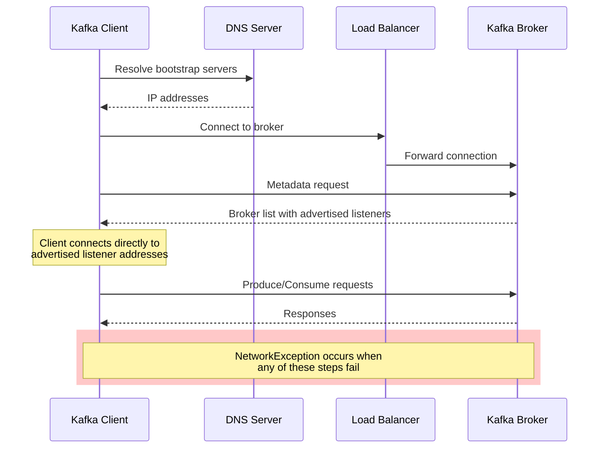
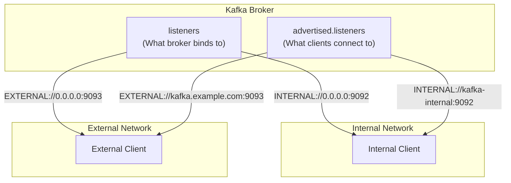
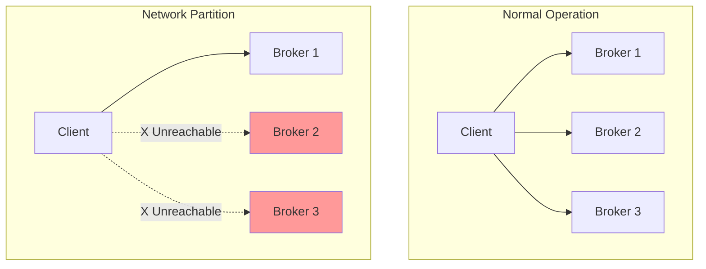
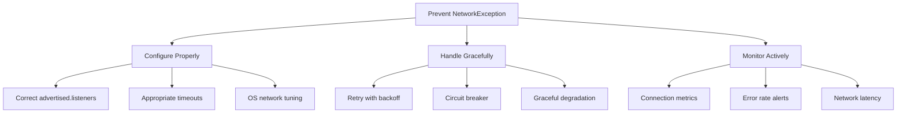

# How to Fix "NetworkException" in Kafka

Author: [nawazdhandala](https://www.github.com/nawazdhandala)

Tags: Kafka, Apache Kafka, Networking, Troubleshooting, Distributed Systems, DevOps, Connection Issues

Description: Learn how to diagnose and resolve NetworkException errors in Apache Kafka by understanding network configurations, timeouts, and connectivity issues.

---

## Introduction

The `NetworkException` in Apache Kafka indicates a communication failure between Kafka clients and brokers. These errors can manifest as connection timeouts, disconnections, or failed requests. Understanding the root causes and implementing proper fixes is essential for maintaining reliable Kafka deployments.

This guide covers the common causes of network exceptions, diagnostic approaches, and solutions for both client-side and server-side issues.

## Understanding NetworkException

### Common Exception Messages

Kafka network exceptions appear in various forms:

```
org.apache.kafka.common.errors.NetworkException: The server disconnected before a response was received.

org.apache.kafka.common.errors.TimeoutException: Failed to update metadata after 60000 ms.

org.apache.kafka.common.errors.DisconnectException: Connection to node -1 was disconnected before the response was read.

java.io.IOException: Connection reset by peer
```

### Network Communication Flow



## Diagnosing Network Issues

### Step 1: Check Broker Connectivity

First, verify basic network connectivity to the Kafka brokers.

```bash
#!/bin/bash
# check-kafka-connectivity.sh
# Tests connectivity to Kafka brokers

BROKERS=("kafka-1:9092" "kafka-2:9092" "kafka-3:9092")

echo "Testing Kafka broker connectivity..."

for BROKER in "${BROKERS[@]}"; do
    HOST=$(echo $BROKER | cut -d: -f1)
    PORT=$(echo $BROKER | cut -d: -f2)

    echo -n "Testing $BROKER: "

    # Test DNS resolution
    if ! host $HOST > /dev/null 2>&1; then
        echo "FAIL - DNS resolution failed"
        continue
    fi

    # Test TCP connection
    if nc -zv -w 5 $HOST $PORT 2>&1 | grep -q "succeeded"; then
        echo "OK"
    else
        echo "FAIL - TCP connection failed"
    fi
done

# Test with Kafka tools
echo ""
echo "Testing with kafka-broker-api-versions..."
kafka-broker-api-versions.sh --bootstrap-server ${BROKERS[0]} --command-config /etc/kafka/client.properties 2>&1 | head -5
```

### Step 2: Verify Advertised Listeners

A common cause of NetworkException is misconfigured advertised listeners. The broker may be reachable through one address but advertise a different, unreachable address.

```bash
# Check broker configuration
kafka-configs.sh --bootstrap-server localhost:9092 \
  --entity-type brokers \
  --entity-name 0 \
  --describe | grep listener

# Check what addresses are being advertised
kafka-metadata.sh --snapshot /var/kafka-logs/__cluster_metadata-0/00000000000000000000.log \
  --command "broker" 2>/dev/null || \
  zookeeper-shell.sh localhost:2181 <<< "get /brokers/ids/0" 2>/dev/null
```

### Step 3: Analyze Client Logs

Enable debug logging to get detailed network information:

```java
import org.apache.kafka.clients.producer.ProducerConfig;
import java.util.Properties;

Properties props = new Properties();
props.put(ProducerConfig.BOOTSTRAP_SERVERS_CONFIG, "kafka:9092");

// Enable detailed logging for network debugging
System.setProperty("org.apache.kafka.common.network", "DEBUG");
System.setProperty("org.apache.kafka.clients", "DEBUG");
```

For log4j configuration:

```properties
# log4j.properties
log4j.logger.org.apache.kafka.common.network=DEBUG
log4j.logger.org.apache.kafka.clients=DEBUG
log4j.logger.org.apache.kafka.clients.NetworkClient=DEBUG
```

## Solution 1: Fix Advertised Listeners Configuration

The most common cause of NetworkException is when clients cannot reach the advertised listener addresses.

### Understanding Listeners vs Advertised Listeners



### Broker Configuration for Multiple Networks

```properties
# server.properties

# Unique broker ID
broker.id=0

# Define listener names and security protocols
listener.security.protocol.map=INTERNAL:PLAINTEXT,EXTERNAL:PLAINTEXT

# Addresses the broker binds to
# 0.0.0.0 means bind to all interfaces
listeners=INTERNAL://0.0.0.0:9092,EXTERNAL://0.0.0.0:9093

# Addresses clients should use to connect
# These MUST be reachable by clients
advertised.listeners=INTERNAL://kafka-1.internal:9092,EXTERNAL://kafka-1.example.com:9093

# Which listener to use for inter-broker communication
inter.broker.listener.name=INTERNAL
```

### Docker/Kubernetes Configuration

```yaml
# docker-compose.yml
version: '3.8'
services:
  kafka:
    image: confluentinc/cp-kafka:7.5.0
    hostname: kafka
    container_name: kafka
    ports:
      - "9092:9092"  # External access
      - "9093:9093"  # Internal access
    environment:
      KAFKA_BROKER_ID: 1
      KAFKA_ZOOKEEPER_CONNECT: zookeeper:2181

      # Listener configuration
      KAFKA_LISTENER_SECURITY_PROTOCOL_MAP: INTERNAL:PLAINTEXT,EXTERNAL:PLAINTEXT
      KAFKA_LISTENERS: INTERNAL://0.0.0.0:9093,EXTERNAL://0.0.0.0:9092

      # For Docker, advertise the host machine's address for external access
      # and container hostname for internal access
      KAFKA_ADVERTISED_LISTENERS: INTERNAL://kafka:9093,EXTERNAL://localhost:9092

      KAFKA_INTER_BROKER_LISTENER_NAME: INTERNAL
```

For Kubernetes:

```yaml
# kafka-statefulset.yaml
apiVersion: apps/v1
kind: StatefulSet
metadata:
  name: kafka
spec:
  serviceName: kafka-headless
  replicas: 3
  template:
    spec:
      containers:
        - name: kafka
          image: confluentinc/cp-kafka:7.5.0
          env:
            - name: KAFKA_BROKER_ID
              valueFrom:
                fieldRef:
                  fieldPath: metadata.name
            - name: POD_NAME
              valueFrom:
                fieldRef:
                  fieldPath: metadata.name

            # Use pod name for internal addressing
            - name: KAFKA_ADVERTISED_LISTENERS
              value: "INTERNAL://$(POD_NAME).kafka-headless.default.svc.cluster.local:9092,EXTERNAL://$(POD_NAME).kafka.example.com:9093"
```

## Solution 2: Configure Client Timeouts

Adjust client timeout settings to handle network latency and temporary failures.

### Producer Timeout Configuration

```java
import org.apache.kafka.clients.producer.ProducerConfig;
import org.apache.kafka.clients.producer.KafkaProducer;
import org.apache.kafka.common.serialization.StringSerializer;

import java.util.Properties;

public class ResilientProducer {

    public static KafkaProducer<String, String> createProducer(String bootstrapServers) {
        Properties props = new Properties();
        props.put(ProducerConfig.BOOTSTRAP_SERVERS_CONFIG, bootstrapServers);
        props.put(ProducerConfig.KEY_SERIALIZER_CLASS_CONFIG, StringSerializer.class.getName());
        props.put(ProducerConfig.VALUE_SERIALIZER_CLASS_CONFIG, StringSerializer.class.getName());

        // Connection and request timeouts
        // Time to wait for connection to broker
        props.put(ProducerConfig.REQUEST_TIMEOUT_MS_CONFIG, 30000);

        // Maximum time to block on send() and partitionsFor()
        props.put(ProducerConfig.MAX_BLOCK_MS_CONFIG, 60000);

        // Time to wait for acknowledgment from broker
        props.put(ProducerConfig.DELIVERY_TIMEOUT_MS_CONFIG, 120000);

        // Metadata refresh settings
        // How long to wait for metadata updates
        props.put(ProducerConfig.METADATA_MAX_AGE_CONFIG, 300000);

        // Retry settings for transient failures
        props.put(ProducerConfig.RETRIES_CONFIG, Integer.MAX_VALUE);
        props.put(ProducerConfig.RETRY_BACKOFF_MS_CONFIG, 100);

        // Connection settings
        // Close idle connections after this time
        props.put(ProducerConfig.CONNECTIONS_MAX_IDLE_MS_CONFIG, 540000);

        // Reconnect backoff
        props.put(ProducerConfig.RECONNECT_BACKOFF_MS_CONFIG, 50);
        props.put(ProducerConfig.RECONNECT_BACKOFF_MAX_MS_CONFIG, 1000);

        return new KafkaProducer<>(props);
    }
}
```

### Consumer Timeout Configuration

```java
import org.apache.kafka.clients.consumer.ConsumerConfig;
import org.apache.kafka.clients.consumer.KafkaConsumer;
import org.apache.kafka.common.serialization.StringDeserializer;

import java.util.Properties;

public class ResilientConsumer {

    public static KafkaConsumer<String, String> createConsumer(String bootstrapServers, String groupId) {
        Properties props = new Properties();
        props.put(ConsumerConfig.BOOTSTRAP_SERVERS_CONFIG, bootstrapServers);
        props.put(ConsumerConfig.GROUP_ID_CONFIG, groupId);
        props.put(ConsumerConfig.KEY_DESERIALIZER_CLASS_CONFIG, StringDeserializer.class.getName());
        props.put(ConsumerConfig.VALUE_DESERIALIZER_CLASS_CONFIG, StringDeserializer.class.getName());

        // Session and heartbeat settings
        // Time before consumer is considered dead
        props.put(ConsumerConfig.SESSION_TIMEOUT_MS_CONFIG, 45000);

        // Heartbeat frequency (should be 1/3 of session timeout)
        props.put(ConsumerConfig.HEARTBEAT_INTERVAL_MS_CONFIG, 15000);

        // Maximum time between polls before leaving group
        props.put(ConsumerConfig.MAX_POLL_INTERVAL_MS_CONFIG, 300000);

        // Request timeout
        props.put(ConsumerConfig.REQUEST_TIMEOUT_MS_CONFIG, 30000);

        // Fetch settings to handle slow networks
        // Minimum data to fetch (wait until this much data is available)
        props.put(ConsumerConfig.FETCH_MIN_BYTES_CONFIG, 1);

        // Maximum wait time for fetch.min.bytes
        props.put(ConsumerConfig.FETCH_MAX_WAIT_MS_CONFIG, 500);

        // Connection settings
        props.put(ConsumerConfig.CONNECTIONS_MAX_IDLE_MS_CONFIG, 540000);
        props.put(ConsumerConfig.RECONNECT_BACKOFF_MS_CONFIG, 50);
        props.put(ConsumerConfig.RECONNECT_BACKOFF_MAX_MS_CONFIG, 1000);

        // Default API timeout
        props.put(ConsumerConfig.DEFAULT_API_TIMEOUT_MS_CONFIG, 60000);

        return new KafkaConsumer<>(props);
    }
}
```

## Solution 3: Implement Retry Logic

Add application-level retry logic for handling transient network failures.

```java
import org.apache.kafka.clients.producer.*;
import org.apache.kafka.common.errors.NetworkException;
import org.apache.kafka.common.errors.TimeoutException;
import org.apache.kafka.common.serialization.StringSerializer;

import java.util.Properties;
import java.util.concurrent.*;

public class RetryableKafkaProducer {

    private final KafkaProducer<String, String> producer;
    private final int maxRetries;
    private final long retryBackoffMs;
    private final ScheduledExecutorService scheduler;

    public RetryableKafkaProducer(String bootstrapServers, int maxRetries, long retryBackoffMs) {
        Properties props = new Properties();
        props.put(ProducerConfig.BOOTSTRAP_SERVERS_CONFIG, bootstrapServers);
        props.put(ProducerConfig.KEY_SERIALIZER_CLASS_CONFIG, StringSerializer.class.getName());
        props.put(ProducerConfig.VALUE_SERIALIZER_CLASS_CONFIG, StringSerializer.class.getName());

        // Let producer handle some retries internally
        props.put(ProducerConfig.RETRIES_CONFIG, 3);
        props.put(ProducerConfig.RETRY_BACKOFF_MS_CONFIG, 100);

        // Ensure ordering during retries
        props.put(ProducerConfig.MAX_IN_FLIGHT_REQUESTS_PER_CONNECTION, 1);

        // Enable idempotence for exactly-once semantics
        props.put(ProducerConfig.ENABLE_IDEMPOTENCE_CONFIG, true);

        this.producer = new KafkaProducer<>(props);
        this.maxRetries = maxRetries;
        this.retryBackoffMs = retryBackoffMs;
        this.scheduler = Executors.newScheduledThreadPool(2);
    }

    /**
     * Sends a message with exponential backoff retry for network errors.
     *
     * @param topic   The topic to send to
     * @param key     The message key
     * @param value   The message value
     * @return CompletableFuture with the result
     */
    public CompletableFuture<RecordMetadata> sendWithRetry(String topic, String key, String value) {
        CompletableFuture<RecordMetadata> future = new CompletableFuture<>();
        sendWithRetryInternal(topic, key, value, 0, future);
        return future;
    }

    private void sendWithRetryInternal(String topic, String key, String value,
                                       int attempt, CompletableFuture<RecordMetadata> future) {

        ProducerRecord<String, String> record = new ProducerRecord<>(topic, key, value);

        producer.send(record, (metadata, exception) -> {
            if (exception == null) {
                // Success
                System.out.printf("Message sent: topic=%s, partition=%d, offset=%d%n",
                    metadata.topic(), metadata.partition(), metadata.offset());
                future.complete(metadata);
                return;
            }

            // Check if error is retryable
            if (isRetryableException(exception) && attempt < maxRetries) {
                int nextAttempt = attempt + 1;
                long backoff = calculateBackoff(nextAttempt);

                System.out.printf("Retryable error on attempt %d, retrying in %d ms: %s%n",
                    nextAttempt, backoff, exception.getMessage());

                // Schedule retry with exponential backoff
                scheduler.schedule(() -> {
                    sendWithRetryInternal(topic, key, value, nextAttempt, future);
                }, backoff, TimeUnit.MILLISECONDS);
            } else {
                // Non-retryable or max retries exceeded
                System.err.printf("Send failed after %d attempts: %s%n",
                    attempt + 1, exception.getMessage());
                future.completeExceptionally(exception);
            }
        });
    }

    /**
     * Determines if an exception is retryable.
     */
    private boolean isRetryableException(Exception e) {
        return e instanceof NetworkException ||
               e instanceof TimeoutException ||
               e.getCause() instanceof NetworkException ||
               e.getCause() instanceof TimeoutException;
    }

    /**
     * Calculates exponential backoff with jitter.
     */
    private long calculateBackoff(int attempt) {
        // Exponential backoff: baseBackoff * 2^attempt
        long exponentialBackoff = retryBackoffMs * (1L << Math.min(attempt, 10));

        // Add jitter (0-25% of backoff)
        long jitter = (long) (exponentialBackoff * 0.25 * Math.random());

        // Cap at 30 seconds
        return Math.min(exponentialBackoff + jitter, 30000);
    }

    public void close() {
        producer.close();
        scheduler.shutdown();
    }

    public static void main(String[] args) throws Exception {
        RetryableKafkaProducer producer = new RetryableKafkaProducer(
            "localhost:9092",
            5,     // max retries
            1000   // initial backoff ms
        );

        try {
            CompletableFuture<RecordMetadata> future = producer.sendWithRetry(
                "orders",
                "order-123",
                "{\"product\": \"laptop\", \"quantity\": 1}"
            );

            // Wait for result with timeout
            RecordMetadata metadata = future.get(60, TimeUnit.SECONDS);
            System.out.println("Message delivered successfully");

        } catch (TimeoutException e) {
            System.err.println("Timed out waiting for message delivery");
        } catch (ExecutionException e) {
            System.err.println("Message delivery failed: " + e.getCause().getMessage());
        } finally {
            producer.close();
        }
    }
}
```

## Solution 4: Configure Network Stack

Optimize the operating system and JVM network settings.

### Linux Kernel Parameters

```bash
# /etc/sysctl.conf

# Increase socket buffer sizes for high throughput
net.core.rmem_max = 16777216
net.core.wmem_max = 16777216
net.core.rmem_default = 1048576
net.core.wmem_default = 1048576

# TCP buffer sizes
net.ipv4.tcp_rmem = 4096 1048576 16777216
net.ipv4.tcp_wmem = 4096 1048576 16777216

# Increase backlog for burst connections
net.core.somaxconn = 32768
net.core.netdev_max_backlog = 32768

# TCP keepalive settings (detect dead connections faster)
net.ipv4.tcp_keepalive_time = 60
net.ipv4.tcp_keepalive_intvl = 10
net.ipv4.tcp_keepalive_probes = 6

# Reduce TIME_WAIT sockets
net.ipv4.tcp_fin_timeout = 15
net.ipv4.tcp_tw_reuse = 1

# Apply changes
# sysctl -p
```

### JVM Network Options

```bash
# Add to KAFKA_OPTS or JVM arguments

# Prefer IPv4 (avoids issues in dual-stack environments)
-Djava.net.preferIPv4Stack=true

# DNS caching (set to 0 to always resolve, useful in dynamic environments)
-Dsun.net.inetaddr.ttl=60
-Dsun.net.inetaddr.negative.ttl=10

# Socket options
-Djdk.net.hosts.file=/etc/hosts

# For debugging DNS issues
-Dsun.net.spi.nameservice.nameservers=8.8.8.8
-Dsun.net.spi.nameservice.provider.1=dns,sun
```

### Broker Network Configuration

```properties
# server.properties

# Network thread configuration
# Number of threads handling network requests
num.network.threads=8

# Number of threads for I/O operations
num.io.threads=16

# Socket buffer sizes
socket.send.buffer.bytes=1048576
socket.receive.buffer.bytes=1048576

# Maximum request size
socket.request.max.bytes=104857600

# Connection limits per IP (0 = unlimited)
max.connections.per.ip=0

# Connection creation rate limit
max.connection.creation.rate=0

# Queued requests limit
queued.max.requests=500

# Request timeout
request.timeout.ms=30000

# Connection close on auth failure
connection.failed.authentication.delay.ms=100
```

## Solution 5: Handle Network Partitions

Implement strategies to handle network partitions gracefully.

### Network Partition Detection



### Circuit Breaker Implementation

```java
import org.apache.kafka.clients.producer.*;
import org.apache.kafka.common.errors.NetworkException;
import org.apache.kafka.common.errors.TimeoutException;

import java.time.Duration;
import java.time.Instant;
import java.util.Properties;
import java.util.concurrent.atomic.AtomicInteger;
import java.util.concurrent.atomic.AtomicReference;

public class CircuitBreakerProducer {

    private final KafkaProducer<String, String> producer;
    private final AtomicReference<CircuitState> state;
    private final AtomicInteger failureCount;
    private final AtomicReference<Instant> lastFailureTime;

    private final int failureThreshold;
    private final Duration resetTimeout;

    enum CircuitState {
        CLOSED,      // Normal operation
        OPEN,        // Blocking all requests
        HALF_OPEN    // Testing if service recovered
    }

    public CircuitBreakerProducer(String bootstrapServers, int failureThreshold, Duration resetTimeout) {
        Properties props = new Properties();
        props.put(ProducerConfig.BOOTSTRAP_SERVERS_CONFIG, bootstrapServers);
        props.put(ProducerConfig.KEY_SERIALIZER_CLASS_CONFIG,
            "org.apache.kafka.common.serialization.StringSerializer");
        props.put(ProducerConfig.VALUE_SERIALIZER_CLASS_CONFIG,
            "org.apache.kafka.common.serialization.StringSerializer");

        // Short timeouts for fast failure detection
        props.put(ProducerConfig.REQUEST_TIMEOUT_MS_CONFIG, 5000);
        props.put(ProducerConfig.MAX_BLOCK_MS_CONFIG, 5000);

        this.producer = new KafkaProducer<>(props);
        this.state = new AtomicReference<>(CircuitState.CLOSED);
        this.failureCount = new AtomicInteger(0);
        this.lastFailureTime = new AtomicReference<>(Instant.MIN);
        this.failureThreshold = failureThreshold;
        this.resetTimeout = resetTimeout;
    }

    /**
     * Sends a message with circuit breaker protection.
     */
    public void send(String topic, String key, String value) throws CircuitOpenException {
        // Check circuit state
        if (!canSend()) {
            throw new CircuitOpenException("Circuit breaker is open, rejecting request");
        }

        ProducerRecord<String, String> record = new ProducerRecord<>(topic, key, value);

        try {
            // Synchronous send for circuit breaker logic
            RecordMetadata metadata = producer.send(record).get();

            // Success - reset failure count
            onSuccess();

            System.out.printf("Sent: topic=%s, partition=%d, offset=%d%n",
                metadata.topic(), metadata.partition(), metadata.offset());

        } catch (Exception e) {
            // Check if it's a network-related failure
            if (isNetworkFailure(e)) {
                onFailure();
            }
            throw new RuntimeException("Send failed", e);
        }
    }

    /**
     * Checks if we can send based on circuit state.
     */
    private boolean canSend() {
        CircuitState currentState = state.get();

        switch (currentState) {
            case CLOSED:
                return true;

            case OPEN:
                // Check if reset timeout has passed
                if (Duration.between(lastFailureTime.get(), Instant.now()).compareTo(resetTimeout) > 0) {
                    // Try to transition to half-open
                    if (state.compareAndSet(CircuitState.OPEN, CircuitState.HALF_OPEN)) {
                        System.out.println("Circuit breaker: OPEN -> HALF_OPEN");
                    }
                    return true;
                }
                return false;

            case HALF_OPEN:
                // Allow limited requests to test
                return true;

            default:
                return false;
        }
    }

    /**
     * Handles successful request - may close circuit.
     */
    private void onSuccess() {
        CircuitState currentState = state.get();

        if (currentState == CircuitState.HALF_OPEN) {
            // Success in half-open state - close the circuit
            state.set(CircuitState.CLOSED);
            failureCount.set(0);
            System.out.println("Circuit breaker: HALF_OPEN -> CLOSED");
        } else if (currentState == CircuitState.CLOSED) {
            // Reset failure count on success
            failureCount.set(0);
        }
    }

    /**
     * Handles failed request - may open circuit.
     */
    private void onFailure() {
        lastFailureTime.set(Instant.now());
        int failures = failureCount.incrementAndGet();

        CircuitState currentState = state.get();

        if (currentState == CircuitState.HALF_OPEN) {
            // Failure in half-open state - reopen circuit
            state.set(CircuitState.OPEN);
            System.out.println("Circuit breaker: HALF_OPEN -> OPEN (failure during test)");

        } else if (currentState == CircuitState.CLOSED && failures >= failureThreshold) {
            // Too many failures - open circuit
            state.set(CircuitState.OPEN);
            System.out.printf("Circuit breaker: CLOSED -> OPEN (failures: %d)%n", failures);
        }
    }

    /**
     * Checks if an exception indicates a network failure.
     */
    private boolean isNetworkFailure(Exception e) {
        Throwable cause = e.getCause();
        return e instanceof NetworkException ||
               e instanceof TimeoutException ||
               (cause != null && (cause instanceof NetworkException ||
                                  cause instanceof TimeoutException ||
                                  cause instanceof java.net.ConnectException ||
                                  cause instanceof java.net.SocketTimeoutException));
    }

    public CircuitState getState() {
        return state.get();
    }

    public void close() {
        producer.close();
    }

    // Custom exception for open circuit
    public static class CircuitOpenException extends Exception {
        public CircuitOpenException(String message) {
            super(message);
        }
    }

    public static void main(String[] args) {
        CircuitBreakerProducer producer = new CircuitBreakerProducer(
            "localhost:9092",
            3,                          // Open circuit after 3 failures
            Duration.ofSeconds(30)      // Reset timeout
        );

        // Simulate sending messages
        for (int i = 0; i < 100; i++) {
            try {
                producer.send("events", "key-" + i, "value-" + i);
                Thread.sleep(100);
            } catch (CircuitBreakerProducer.CircuitOpenException e) {
                System.out.println("Request rejected: " + e.getMessage());
                // Implement fallback logic here
                try {
                    Thread.sleep(5000);  // Wait before retrying
                } catch (InterruptedException ie) {
                    Thread.currentThread().interrupt();
                }
            } catch (Exception e) {
                System.err.println("Send error: " + e.getMessage());
            }
        }

        producer.close();
    }
}
```

## Troubleshooting Checklist

### Client-Side Checks

```bash
#!/bin/bash
# kafka-network-troubleshoot.sh

BOOTSTRAP_SERVERS="${1:-localhost:9092}"

echo "=== Kafka Network Troubleshooting ==="
echo ""

# 1. DNS Resolution
echo "1. Checking DNS resolution..."
for SERVER in $(echo $BOOTSTRAP_SERVERS | tr ',' ' '); do
    HOST=$(echo $SERVER | cut -d: -f1)
    echo -n "   Resolving $HOST: "
    if IP=$(getent hosts $HOST 2>/dev/null | awk '{print $1}'); then
        echo "$IP"
    else
        echo "FAILED"
    fi
done
echo ""

# 2. TCP Connectivity
echo "2. Checking TCP connectivity..."
for SERVER in $(echo $BOOTSTRAP_SERVERS | tr ',' ' '); do
    HOST=$(echo $SERVER | cut -d: -f1)
    PORT=$(echo $SERVER | cut -d: -f2)
    echo -n "   Connecting to $HOST:$PORT: "
    if nc -zv -w 5 $HOST $PORT 2>&1 | grep -q "succeeded\|Connected"; then
        echo "OK"
    else
        echo "FAILED"
    fi
done
echo ""

# 3. SSL/TLS (if applicable)
echo "3. Checking SSL/TLS (if enabled)..."
for SERVER in $(echo $BOOTSTRAP_SERVERS | tr ',' ' '); do
    HOST=$(echo $SERVER | cut -d: -f1)
    PORT=$(echo $SERVER | cut -d: -f2)
    echo -n "   SSL handshake with $HOST:$PORT: "
    if openssl s_client -connect $HOST:$PORT -servername $HOST < /dev/null 2>/dev/null | grep -q "Verify return code: 0"; then
        echo "OK"
    else
        echo "No SSL or handshake failed"
    fi
done
echo ""

# 4. Kafka Protocol Test
echo "4. Testing Kafka protocol..."
if command -v kafka-broker-api-versions.sh &> /dev/null; then
    kafka-broker-api-versions.sh --bootstrap-server $BOOTSTRAP_SERVERS 2>&1 | head -10
else
    echo "   kafka-broker-api-versions.sh not found"
fi
echo ""

# 5. Network latency
echo "5. Checking network latency..."
for SERVER in $(echo $BOOTSTRAP_SERVERS | tr ',' ' '); do
    HOST=$(echo $SERVER | cut -d: -f1)
    echo "   Ping to $HOST:"
    ping -c 3 $HOST 2>/dev/null | tail -1 || echo "   Ping failed or blocked"
done
```

### Common Issues and Solutions

| Symptom | Likely Cause | Solution |
|---------|--------------|----------|
| "Failed to update metadata" | Wrong bootstrap servers | Verify advertised.listeners |
| "Connection refused" | Broker not running | Check broker process and ports |
| "Connection reset" | Firewall or security group | Open required ports |
| "SSL handshake failed" | Certificate issues | Verify SSL configuration |
| "DNS resolution failed" | Network/DNS issues | Check DNS settings |
| Intermittent disconnects | Network instability | Increase timeouts, add retries |

## Best Practices Summary



## Conclusion

NetworkException in Kafka typically indicates misconfiguration or infrastructure issues rather than application bugs. Key takeaways:

1. **Verify advertised.listeners** match the addresses clients can reach
2. **Configure appropriate timeouts** for your network conditions
3. **Implement retry logic** with exponential backoff for transient failures
4. **Use circuit breakers** to prevent cascade failures
5. **Monitor network metrics** to detect issues early

By following these practices, you can build resilient Kafka applications that handle network issues gracefully and recover automatically from transient failures.
