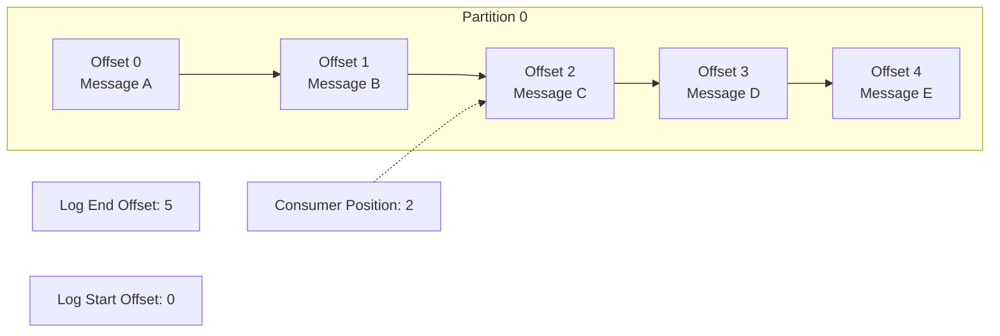
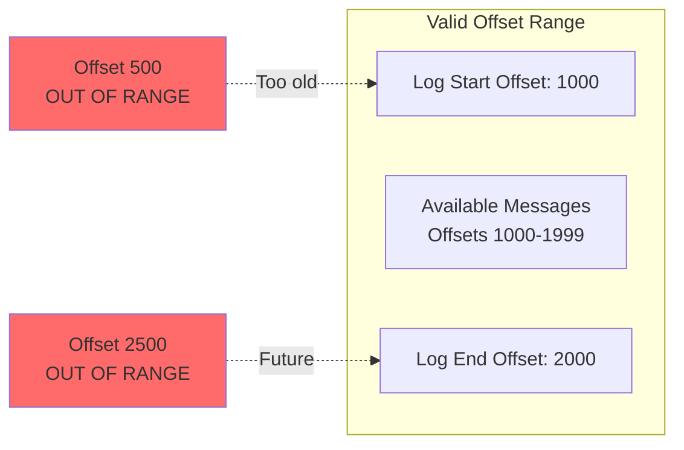
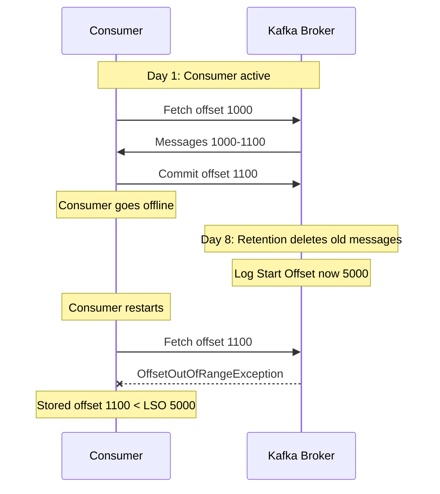
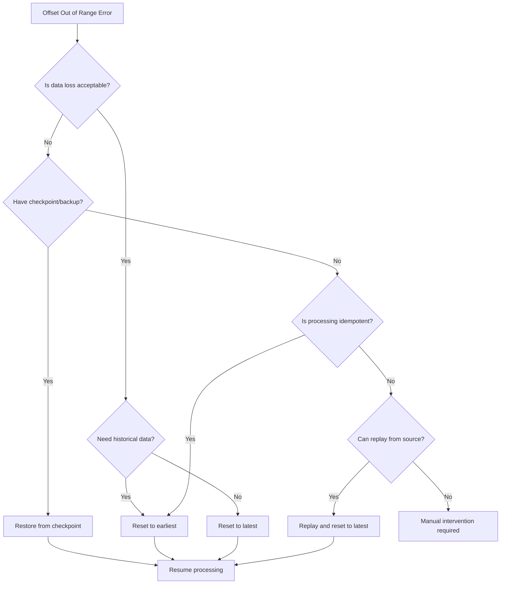

# How to Fix 'Offset Out of Range' Errors in Kafka

Author: [nawazdhandala](https://www.github.com/nawazdhandala)

Tags: Kafka, Troubleshooting, Consumer, Offset Management, Distributed Systems, Message Queue

Description: A comprehensive guide to diagnosing and resolving 'Offset Out of Range' errors in Apache Kafka, including causes, recovery strategies, and prevention techniques.

---

## Introduction

The "Offset Out of Range" error is a common issue in Kafka consumers that occurs when a consumer attempts to fetch messages from an offset that no longer exists in the broker's log. This typically happens when messages have been deleted due to retention policies or when offset metadata becomes stale.

This guide explains why this error occurs, how to diagnose it, and the various strategies for recovering and preventing future occurrences.

## Understanding Kafka Offsets

### What Are Offsets?

In Kafka, each message within a partition has a unique sequential identifier called an offset. Consumers track their position in each partition using these offsets.



### Offset Boundaries

Each partition has two important offset boundaries:

- **Log Start Offset (LSO)**: The earliest available offset (messages before this have been deleted)
- **Log End Offset (LEO)**: The offset of the next message to be written



## Common Causes

### 1. Message Retention Expiration

Messages older than the retention period are automatically deleted, making their offsets invalid.

```bash
# Check topic retention settings
kafka-configs.sh --bootstrap-server localhost:9092 \
    --entity-type topics \
    --entity-name orders \
    --describe

# Example output:
# retention.ms=604800000  (7 days)
# retention.bytes=-1      (unlimited)
```

### 2. Log Compaction

For compacted topics, messages with duplicate keys are removed, creating gaps in offset sequences.

```mermaid
flowchart TB
    subgraph Before Compaction
        B1[Offset 0: key=A, val=1]
        B2[Offset 1: key=B, val=2]
        B3[Offset 2: key=A, val=3]
        B4[Offset 3: key=C, val=4]
        B5[Offset 4: key=A, val=5]
    end

    subgraph After Compaction
        A1[Offset 1: key=B, val=2]
        A2[Offset 3: key=C, val=4]
        A3[Offset 4: key=A, val=5]
    end

    Before Compaction --> |Compaction| After Compaction

    Note[Offsets 0 and 2 no longer exist]
```

### 3. Consumer Downtime

When a consumer is offline for longer than the retention period, its stored offset may become invalid.



### 4. Partition Reassignment

Moving partitions between brokers can sometimes result in offset inconsistencies.

### 5. Corrupted Offset Metadata

Rare cases of metadata corruption can lead to invalid offset values being stored.

## Diagnosing the Error

### Check Consumer Group Offsets

```bash
# Describe consumer group to see current offsets
kafka-consumer-groups.sh --bootstrap-server localhost:9092 \
    --group order-processors \
    --describe

# Output columns:
# GROUP           TOPIC     PARTITION  CURRENT-OFFSET  LOG-END-OFFSET  LAG
# order-processors orders    0          1100           50000           48900

# Check if current offset is within valid range
kafka-get-offsets.sh --bootstrap-server localhost:9092 \
    --topic orders \
    --time earliest

# kafka-get-offsets.sh --bootstrap-server localhost:9092 \
#     --topic orders \
#     --time latest
```

### Examine Topic Details

```bash
# Get detailed topic information including segment offsets
kafka-log-dirs.sh --bootstrap-server localhost:9092 \
    --describe \
    --topic-list orders

# Get earliest and latest offsets per partition
kafka-run-class.sh kafka.tools.GetOffsetShell \
    --bootstrap-server localhost:9092 \
    --topic orders \
    --time -2  # Earliest

kafka-run-class.sh kafka.tools.GetOffsetShell \
    --bootstrap-server localhost:9092 \
    --topic orders \
    --time -1  # Latest
```

### Check Broker Logs

```bash
# Look for offset-related errors in broker logs
grep -i "offset\|out.of.range" /var/log/kafka/server.log | tail -50

# Check for log segment deletion
grep -i "deleted\|retention" /var/log/kafka/server.log | tail -50
```

## Recovery Strategies

### Strategy 1: Reset to Earliest Offset

Reset the consumer to start from the earliest available offset.

```bash
# Reset consumer group to earliest offset
# Consumer group must be inactive (all consumers stopped)
kafka-consumer-groups.sh --bootstrap-server localhost:9092 \
    --group order-processors \
    --topic orders \
    --reset-offsets \
    --to-earliest \
    --execute
```

```python
from kafka import KafkaConsumer

# Configure consumer to reset to earliest on out of range
consumer = KafkaConsumer(
    'orders',
    bootstrap_servers=['localhost:9092'],
    group_id='order-processors',

    # Automatically reset to earliest when offset is out of range
    auto_offset_reset='earliest',

    # Enable this to actually reset (otherwise just logs warning)
    enable_auto_commit=True,
)

# Alternative: Reset programmatically
from kafka import TopicPartition

consumer = KafkaConsumer(
    bootstrap_servers=['localhost:9092'],
    group_id='order-processors',
    enable_auto_commit=False,
)

# Assign partitions manually
partitions = [TopicPartition('orders', p) for p in range(3)]
consumer.assign(partitions)

# Seek to beginning of each partition
consumer.seek_to_beginning(*partitions)

print("Reset to earliest offsets")
for tp in partitions:
    print(f"  {tp}: {consumer.position(tp)}")
```

### Strategy 2: Reset to Latest Offset

Skip all existing messages and start from new messages only.

```bash
# Reset to latest offset
kafka-consumer-groups.sh --bootstrap-server localhost:9092 \
    --group order-processors \
    --topic orders \
    --reset-offsets \
    --to-latest \
    --execute
```

```python
from kafka import KafkaConsumer, TopicPartition

consumer = KafkaConsumer(
    'orders',
    bootstrap_servers=['localhost:9092'],
    group_id='order-processors',

    # Reset to latest when offset is out of range
    auto_offset_reset='latest',
)

# Or programmatically
consumer = KafkaConsumer(
    bootstrap_servers=['localhost:9092'],
    group_id='order-processors',
)

partitions = [TopicPartition('orders', p) for p in range(3)]
consumer.assign(partitions)

# Seek to end of each partition
consumer.seek_to_end(*partitions)

print("Reset to latest offsets")
for tp in partitions:
    print(f"  {tp}: {consumer.position(tp)}")
```

### Strategy 3: Reset to Specific Timestamp

Reset to offsets corresponding to a specific point in time.

```bash
# Reset to offset at specific timestamp (milliseconds since epoch)
# Example: Reset to January 1, 2026 00:00:00 UTC
kafka-consumer-groups.sh --bootstrap-server localhost:9092 \
    --group order-processors \
    --topic orders \
    --reset-offsets \
    --to-datetime 2026-01-01T00:00:00.000 \
    --execute
```

```python
from kafka import KafkaConsumer, TopicPartition
from datetime import datetime, timezone

consumer = KafkaConsumer(
    bootstrap_servers=['localhost:9092'],
    group_id='order-processors',
)

# Subscribe and get assigned partitions
consumer.subscribe(['orders'])
consumer.poll(timeout_ms=1000)  # Trigger assignment
partitions = consumer.assignment()

# Convert timestamp to milliseconds
target_time = datetime(2026, 1, 1, 0, 0, 0, tzinfo=timezone.utc)
target_timestamp_ms = int(target_time.timestamp() * 1000)

# Get offsets for timestamp
timestamps = {tp: target_timestamp_ms for tp in partitions}
offsets = consumer.offsets_for_times(timestamps)

# Seek to the offsets
for tp, offset_and_timestamp in offsets.items():
    if offset_and_timestamp:
        consumer.seek(tp, offset_and_timestamp.offset)
        print(f"Reset {tp} to offset {offset_and_timestamp.offset}")
    else:
        # No message at or after timestamp, seek to end
        consumer.seek_to_end(tp)
        print(f"No messages after timestamp for {tp}, reset to end")

# Commit the new offsets
consumer.commit()
```

### Strategy 4: Reset to Specific Offset

Reset to a known good offset value.

```bash
# Reset to specific offset
kafka-consumer-groups.sh --bootstrap-server localhost:9092 \
    --group order-processors \
    --topic orders:0:5000 \
    --topic orders:1:6000 \
    --topic orders:2:7000 \
    --reset-offsets \
    --execute
```

```python
from kafka import KafkaConsumer, TopicPartition

consumer = KafkaConsumer(
    bootstrap_servers=['localhost:9092'],
    group_id='order-processors',
    enable_auto_commit=False,
)

# Define target offsets for each partition
target_offsets = {
    TopicPartition('orders', 0): 5000,
    TopicPartition('orders', 1): 6000,
    TopicPartition('orders', 2): 7000,
}

# Assign partitions
consumer.assign(list(target_offsets.keys()))

# Seek to specific offsets
for tp, offset in target_offsets.items():
    consumer.seek(tp, offset)
    print(f"Reset {tp} to offset {offset}")

# Commit the new offsets
consumer.commit()
```

### Strategy 5: Automatic Recovery in Code

Implement automatic recovery when the error occurs.

```python
from kafka import KafkaConsumer, TopicPartition
from kafka.errors import OffsetOutOfRangeError
import logging

logging.basicConfig(level=logging.INFO)
logger = logging.getLogger(__name__)

class ResilientConsumer:
    """
    Kafka consumer with automatic recovery from offset out of range errors.
    """

    def __init__(self, topic, group_id, bootstrap_servers,
                 recovery_strategy='earliest'):
        """
        Initialize consumer with recovery strategy.

        Args:
            recovery_strategy: 'earliest', 'latest', or a timestamp (int ms)
        """
        self.topic = topic
        self.group_id = group_id
        self.bootstrap_servers = bootstrap_servers
        self.recovery_strategy = recovery_strategy
        self.consumer = None
        self._create_consumer()

    def _create_consumer(self):
        """Create the Kafka consumer."""
        self.consumer = KafkaConsumer(
            self.topic,
            bootstrap_servers=self.bootstrap_servers,
            group_id=self.group_id,
            enable_auto_commit=False,
            # Don't auto-reset - we handle it manually
            auto_offset_reset='none',
        )

    def _recover_from_offset_error(self, partitions=None):
        """
        Recover from offset out of range error.
        """
        if partitions is None:
            partitions = self.consumer.assignment()

        logger.warning(f"Recovering from offset out of range for {partitions}")

        if self.recovery_strategy == 'earliest':
            self.consumer.seek_to_beginning(*partitions)
            logger.info("Reset to earliest offsets")

        elif self.recovery_strategy == 'latest':
            self.consumer.seek_to_end(*partitions)
            logger.info("Reset to latest offsets")

        elif isinstance(self.recovery_strategy, int):
            # Timestamp-based recovery
            timestamps = {tp: self.recovery_strategy for tp in partitions}
            offsets = self.consumer.offsets_for_times(timestamps)

            for tp, offset_and_ts in offsets.items():
                if offset_and_ts:
                    self.consumer.seek(tp, offset_and_ts.offset)
                else:
                    self.consumer.seek_to_end(tp)
            logger.info(f"Reset to offsets at timestamp {self.recovery_strategy}")

        # Commit the recovered offsets
        self.consumer.commit()

    def consume(self, handler):
        """
        Consume messages with automatic recovery.

        Args:
            handler: Function to process each message
        """
        while True:
            try:
                records = self.consumer.poll(timeout_ms=1000)

                for tp, messages in records.items():
                    for message in messages:
                        handler(message)

                if records:
                    self.consumer.commit()

            except OffsetOutOfRangeError as e:
                logger.error(f"Offset out of range error: {e}")
                # Extract affected partitions from error
                affected_partitions = set()
                for tp_offset in e.args[0].values():
                    affected_partitions.update(tp_offset.keys())
                self._recover_from_offset_error(affected_partitions)

            except Exception as e:
                logger.error(f"Unexpected error: {e}")
                raise

    def close(self):
        """Close the consumer."""
        if self.consumer:
            self.consumer.close()


# Usage example
def process_message(message):
    """Process a single message."""
    print(f"Processing: partition={message.partition}, "
          f"offset={message.offset}, value={message.value}")

if __name__ == '__main__':
    consumer = ResilientConsumer(
        topic='orders',
        group_id='order-processors',
        bootstrap_servers=['localhost:9092'],
        recovery_strategy='earliest',
    )

    try:
        consumer.consume(process_message)
    except KeyboardInterrupt:
        print("Shutting down...")
    finally:
        consumer.close()
```

### Java Implementation

```java
import org.apache.kafka.clients.consumer.*;
import org.apache.kafka.common.TopicPartition;
import org.apache.kafka.common.errors.OffsetOutOfRangeException;

import java.time.Duration;
import java.util.*;
import java.util.logging.Logger;

public class ResilientKafkaConsumer {

    private static final Logger logger =
        Logger.getLogger(ResilientKafkaConsumer.class.getName());

    private final KafkaConsumer<String, String> consumer;
    private final String recoveryStrategy;

    public ResilientKafkaConsumer(Properties props, String recoveryStrategy) {
        // Ensure auto.offset.reset is set to "none" for manual handling
        props.put(ConsumerConfig.AUTO_OFFSET_RESET_CONFIG, "none");
        props.put(ConsumerConfig.ENABLE_AUTO_COMMIT_CONFIG, "false");

        this.consumer = new KafkaConsumer<>(props);
        this.recoveryStrategy = recoveryStrategy;
    }

    public void subscribe(String topic) {
        consumer.subscribe(Collections.singletonList(topic));
    }

    public void consume(MessageHandler handler) {
        while (true) {
            try {
                ConsumerRecords<String, String> records =
                    consumer.poll(Duration.ofMillis(1000));

                for (ConsumerRecord<String, String> record : records) {
                    handler.handle(record);
                }

                if (!records.isEmpty()) {
                    consumer.commitSync();
                }

            } catch (OffsetOutOfRangeException e) {
                logger.warning("Offset out of range, recovering...");
                recoverFromOffsetError(e.offsetOutOfRangePartitions().keySet());
            }
        }
    }

    private void recoverFromOffsetError(Set<TopicPartition> partitions) {
        switch (recoveryStrategy) {
            case "earliest":
                consumer.seekToBeginning(partitions);
                logger.info("Reset to earliest offsets");
                break;

            case "latest":
                consumer.seekToEnd(partitions);
                logger.info("Reset to latest offsets");
                break;

            default:
                // Try to parse as timestamp
                try {
                    long timestamp = Long.parseLong(recoveryStrategy);
                    Map<TopicPartition, Long> timestamps = new HashMap<>();
                    for (TopicPartition tp : partitions) {
                        timestamps.put(tp, timestamp);
                    }

                    Map<TopicPartition, OffsetAndTimestamp> offsets =
                        consumer.offsetsForTimes(timestamps);

                    for (Map.Entry<TopicPartition, OffsetAndTimestamp> entry :
                            offsets.entrySet()) {
                        if (entry.getValue() != null) {
                            consumer.seek(entry.getKey(),
                                entry.getValue().offset());
                        } else {
                            consumer.seekToEnd(
                                Collections.singleton(entry.getKey()));
                        }
                    }
                    logger.info("Reset to offsets at timestamp " + timestamp);

                } catch (NumberFormatException ex) {
                    // Default to earliest if strategy is invalid
                    consumer.seekToBeginning(partitions);
                    logger.warning("Invalid strategy, defaulting to earliest");
                }
        }

        consumer.commitSync();
    }

    public void close() {
        consumer.close();
    }

    @FunctionalInterface
    public interface MessageHandler {
        void handle(ConsumerRecord<String, String> record);
    }
}
```

## Prevention Strategies

### 1. Align Retention with Consumer Downtime

Ensure retention periods are longer than expected consumer downtime.

```bash
# Set retention to 30 days for topics with infrequent consumers
kafka-configs.sh --bootstrap-server localhost:9092 \
    --entity-type topics \
    --entity-name orders \
    --alter \
    --add-config retention.ms=2592000000

# For critical topics, consider even longer retention
# Or use tiered storage for cost-effective long retention
```

### 2. Monitor Consumer Lag

Set up alerts when consumer lag grows too large.

```python
from kafka import KafkaAdminClient, KafkaConsumer
from prometheus_client import Gauge, start_http_server
import time

# Prometheus metrics
CONSUMER_LAG = Gauge(
    'kafka_consumer_lag',
    'Consumer lag by partition',
    ['group_id', 'topic', 'partition']
)

OFFSET_AT_RISK = Gauge(
    'kafka_consumer_offset_at_risk',
    'Consumer offset at risk of going out of range',
    ['group_id', 'topic', 'partition']
)

def monitor_consumer_lag(bootstrap_servers, group_id):
    """
    Monitor consumer lag and detect offsets at risk.
    """
    admin = KafkaAdminClient(bootstrap_servers=bootstrap_servers)

    while True:
        try:
            # Get consumer group offsets
            group_offsets = admin.list_consumer_group_offsets(group_id)

            # Get topic partitions and their log start offsets
            consumer = KafkaConsumer(
                bootstrap_servers=bootstrap_servers,
            )

            for tp, offset_metadata in group_offsets.items():
                # Get earliest offset for partition
                consumer.assign([tp])
                consumer.seek_to_beginning(tp)
                earliest_offset = consumer.position(tp)

                consumer.seek_to_end(tp)
                latest_offset = consumer.position(tp)

                current_offset = offset_metadata.offset
                lag = latest_offset - current_offset

                # Update Prometheus metrics
                CONSUMER_LAG.labels(
                    group_id=group_id,
                    topic=tp.topic,
                    partition=tp.partition
                ).set(lag)

                # Check if offset is at risk
                # At risk if current offset is close to earliest
                buffer = (latest_offset - earliest_offset) * 0.1  # 10% buffer
                at_risk = 1 if current_offset < earliest_offset + buffer else 0

                OFFSET_AT_RISK.labels(
                    group_id=group_id,
                    topic=tp.topic,
                    partition=tp.partition
                ).set(at_risk)

                if at_risk:
                    print(f"WARNING: Offset at risk for {tp}")
                    print(f"  Current: {current_offset}")
                    print(f"  Earliest: {earliest_offset}")
                    print(f"  Latest: {latest_offset}")

            consumer.close()

        except Exception as e:
            print(f"Monitoring error: {e}")

        time.sleep(60)  # Check every minute

if __name__ == '__main__':
    start_http_server(8000)
    monitor_consumer_lag(['localhost:9092'], 'order-processors')
```

### 3. Implement Offset Checkpointing

Store offsets externally as a backup.

```python
import json
import redis
from kafka import KafkaConsumer, TopicPartition

class OffsetCheckpointer:
    """
    Checkpoint Kafka offsets to Redis for recovery.
    """

    def __init__(self, redis_host='localhost', redis_port=6379):
        self.redis = redis.Redis(host=redis_host, port=redis_port)

    def checkpoint(self, group_id, offsets):
        """
        Save offsets to Redis.

        Args:
            group_id: Consumer group ID
            offsets: Dict of TopicPartition -> offset
        """
        key = f"kafka:offsets:{group_id}"
        data = {
            f"{tp.topic}:{tp.partition}": offset
            for tp, offset in offsets.items()
        }
        self.redis.hset(key, mapping=data)
        self.redis.expire(key, 86400 * 30)  # 30 days TTL

    def restore(self, group_id, topic):
        """
        Restore offsets from Redis.

        Returns:
            Dict of TopicPartition -> offset
        """
        key = f"kafka:offsets:{group_id}"
        data = self.redis.hgetall(key)

        offsets = {}
        for tp_str, offset in data.items():
            tp_str = tp_str.decode('utf-8')
            topic_name, partition = tp_str.rsplit(':', 1)
            if topic_name == topic:
                tp = TopicPartition(topic_name, int(partition))
                offsets[tp] = int(offset)

        return offsets


def consume_with_checkpointing():
    """
    Consume with periodic offset checkpointing.
    """
    consumer = KafkaConsumer(
        'orders',
        bootstrap_servers=['localhost:9092'],
        group_id='order-processors',
        enable_auto_commit=False,
    )

    checkpointer = OffsetCheckpointer()
    checkpoint_interval = 100  # Checkpoint every 100 messages
    message_count = 0

    try:
        while True:
            records = consumer.poll(timeout_ms=1000)

            for tp, messages in records.items():
                for message in messages:
                    process_message(message)
                    message_count += 1

                    if message_count >= checkpoint_interval:
                        # Get current offsets and checkpoint
                        offsets = {
                            tp: consumer.position(tp)
                            for tp in consumer.assignment()
                        }
                        checkpointer.checkpoint('order-processors', offsets)
                        consumer.commit()
                        message_count = 0
                        print("Checkpointed offsets")

    except OffsetOutOfRangeError:
        # Try to restore from checkpoint
        print("Attempting to restore from checkpoint...")
        saved_offsets = checkpointer.restore('order-processors', 'orders')

        if saved_offsets:
            for tp, offset in saved_offsets.items():
                consumer.seek(tp, offset)
            print(f"Restored offsets: {saved_offsets}")
        else:
            # Fall back to earliest
            consumer.seek_to_beginning(*consumer.assignment())
            print("No checkpoint found, reset to earliest")


def process_message(message):
    """Process a message."""
    print(f"Processing offset {message.offset}")
```

### 4. Use Idempotent Processing

Design message processing to be idempotent, making offset resets safe.

```python
import hashlib
import redis

class IdempotentProcessor:
    """
    Idempotent message processor using Redis for deduplication.
    """

    def __init__(self, redis_host='localhost'):
        self.redis = redis.Redis(host=redis_host)
        self.dedup_ttl = 86400 * 7  # 7 days

    def _message_id(self, message):
        """Generate unique ID for a message."""
        # Use topic, partition, offset as unique identifier
        unique_str = f"{message.topic}:{message.partition}:{message.offset}"
        return hashlib.md5(unique_str.encode()).hexdigest()

    def process(self, message, handler):
        """
        Process message idempotently.

        Returns True if message was processed, False if duplicate.
        """
        msg_id = self._message_id(message)
        key = f"kafka:processed:{msg_id}"

        # Try to set the key (only succeeds if not exists)
        if self.redis.set(key, '1', nx=True, ex=self.dedup_ttl):
            # First time seeing this message, process it
            try:
                handler(message)
                return True
            except Exception as e:
                # Processing failed, remove the key to allow retry
                self.redis.delete(key)
                raise
        else:
            # Message already processed, skip
            print(f"Skipping duplicate message at offset {message.offset}")
            return False


# Usage
processor = IdempotentProcessor()

def handle_order(message):
    """Process an order message."""
    order = json.loads(message.value)
    print(f"Processing order: {order['id']}")
    # Your processing logic here

for message in consumer:
    processor.process(message, handle_order)
```

## Monitoring and Alerting

### Prometheus Alerting Rules

```yaml
# prometheus-alerts.yaml
groups:
  - name: kafka-offset-alerts
    rules:
      # Alert when consumer lag is very high
      - alert: KafkaConsumerHighLag
        expr: kafka_consumer_lag > 100000
        for: 5m
        labels:
          severity: warning
        annotations:
          summary: "High Kafka consumer lag"
          description: "Consumer {{ $labels.group_id }} has lag of {{ $value }} on {{ $labels.topic }}-{{ $labels.partition }}"

      # Alert when offset is at risk of going out of range
      - alert: KafkaConsumerOffsetAtRisk
        expr: kafka_consumer_offset_at_risk == 1
        for: 10m
        labels:
          severity: critical
        annotations:
          summary: "Kafka consumer offset at risk"
          description: "Consumer {{ $labels.group_id }} offset is at risk on {{ $labels.topic }}-{{ $labels.partition }}"

      # Alert when consumer group is inactive for too long
      - alert: KafkaConsumerGroupInactive
        expr: |
          time() - kafka_consumer_group_last_activity_timestamp > 86400
        for: 5m
        labels:
          severity: warning
        annotations:
          summary: "Kafka consumer group inactive"
          description: "Consumer group {{ $labels.group_id }} has been inactive for over 24 hours"
```

## Decision Flow for Recovery



## Conclusion

The "Offset Out of Range" error is a recoverable situation when you understand the causes and have proper recovery strategies in place. By implementing appropriate offset management, monitoring consumer lag, and designing for idempotent processing, you can minimize the impact of these errors.

Key takeaways:

- Understand the relationship between retention policies and consumer offsets
- Configure `auto.offset.reset` based on your recovery requirements
- Monitor consumer lag and set up alerts for offsets at risk
- Implement checkpointing for critical consumer groups
- Design message processing to be idempotent when possible
- Use the appropriate recovery strategy based on your data requirements

With these practices in place, offset out of range errors become manageable events rather than critical failures.
