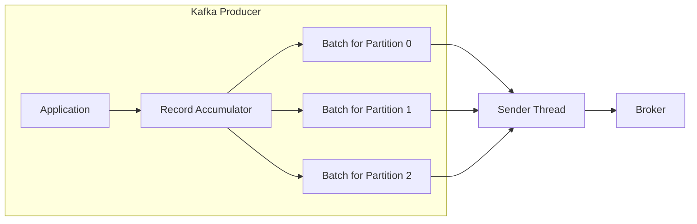
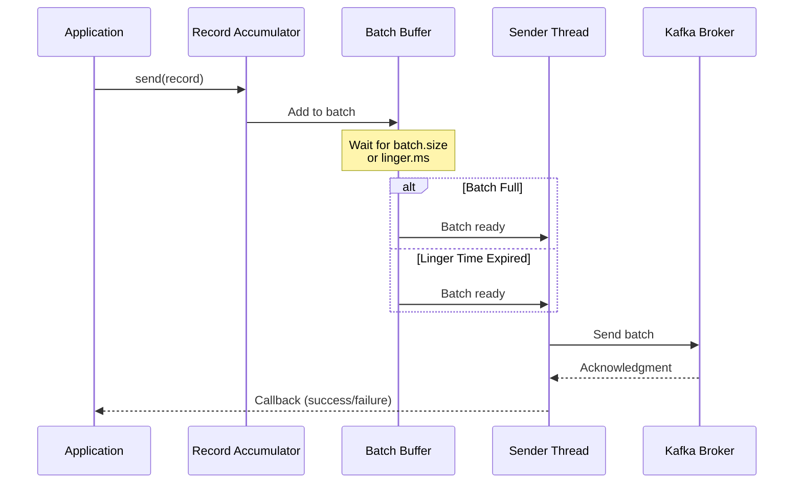

# How to Handle Kafka Producer Batching

Author: [nawazdhandala](https://www.github.com/nawazdhandala)

Tags: Apache Kafka, Producer, Batching, Performance, Throughput, Configuration, Java, Python

Description: Learn how to configure and optimize Kafka producer batching for maximum throughput while maintaining reliability and low latency.

---

Kafka producers batch messages before sending them to brokers, which significantly improves throughput by reducing network overhead. Understanding and tuning batching behavior is essential for building high-performance Kafka applications.

## Understanding Producer Batching

When you call `send()` on a Kafka producer, the message is not immediately sent to the broker. Instead, it is added to a batch buffer. The producer sends the batch when either the batch is full or the linger time expires.



### Key Batching Parameters

| Parameter | Description | Default |
|-----------|-------------|---------|
| `batch.size` | Maximum batch size in bytes | 16384 (16 KB) |
| `linger.ms` | Time to wait for more messages before sending | 0 |
| `buffer.memory` | Total memory for buffering | 33554432 (32 MB) |
| `max.block.ms` | Time to block when buffer is full | 60000 |

## Basic Batching Configuration

### Java Configuration

```java
import org.apache.kafka.clients.producer.*;
import java.util.Properties;

public class BatchingProducerConfig {

    public static KafkaProducer<String, String> createProducer(String bootstrapServers) {
        Properties props = new Properties();
        props.put(ProducerConfig.BOOTSTRAP_SERVERS_CONFIG, bootstrapServers);
        props.put(ProducerConfig.KEY_SERIALIZER_CLASS_CONFIG,
            "org.apache.kafka.common.serialization.StringSerializer");
        props.put(ProducerConfig.VALUE_SERIALIZER_CLASS_CONFIG,
            "org.apache.kafka.common.serialization.StringSerializer");

        // Batching configuration
        // Increase batch size for higher throughput (default: 16384)
        props.put(ProducerConfig.BATCH_SIZE_CONFIG, 65536);  // 64 KB

        // Wait up to 10ms for more messages to arrive before sending
        // Higher values increase throughput but add latency
        props.put(ProducerConfig.LINGER_MS_CONFIG, 10);

        // Total buffer memory for all partitions (default: 32 MB)
        props.put(ProducerConfig.BUFFER_MEMORY_CONFIG, 67108864);  // 64 MB

        // Enable compression for better batching efficiency
        props.put(ProducerConfig.COMPRESSION_TYPE_CONFIG, "lz4");

        return new KafkaProducer<>(props);
    }
}
```

### Python Configuration

```python
from confluent_kafka import Producer

def create_batching_producer(bootstrap_servers: str) -> Producer:
    """
    Create a producer configured for optimal batching.
    """
    config = {
        'bootstrap.servers': bootstrap_servers,

        # Batching configuration
        # Maximum number of messages in a batch
        'batch.num.messages': 10000,

        # Maximum time to wait before sending a batch (in ms)
        'queue.buffering.max.ms': 10,

        # Maximum total message size in the queue
        'queue.buffering.max.kbytes': 65536,  # 64 MB

        # Maximum size of a message batch
        'batch.size': 65536,  # 64 KB

        # Enable compression
        'compression.type': 'lz4'
    }

    return Producer(config)
```

## Batching Strategies

### Strategy 1: High Throughput Configuration

When throughput is the primary concern and some latency is acceptable:

```java
import org.apache.kafka.clients.producer.*;
import java.util.Properties;

public class HighThroughputProducer {

    public static KafkaProducer<String, String> create(String bootstrapServers) {
        Properties props = new Properties();
        props.put(ProducerConfig.BOOTSTRAP_SERVERS_CONFIG, bootstrapServers);
        props.put(ProducerConfig.KEY_SERIALIZER_CLASS_CONFIG,
            "org.apache.kafka.common.serialization.StringSerializer");
        props.put(ProducerConfig.VALUE_SERIALIZER_CLASS_CONFIG,
            "org.apache.kafka.common.serialization.StringSerializer");

        // Large batch size for maximum throughput
        props.put(ProducerConfig.BATCH_SIZE_CONFIG, 131072);  // 128 KB

        // Wait longer for batches to fill up
        props.put(ProducerConfig.LINGER_MS_CONFIG, 50);

        // Large buffer for high volume
        props.put(ProducerConfig.BUFFER_MEMORY_CONFIG, 134217728);  // 128 MB

        // Aggressive compression
        props.put(ProducerConfig.COMPRESSION_TYPE_CONFIG, "lz4");

        // Only wait for leader acknowledgment
        props.put(ProducerConfig.ACKS_CONFIG, "1");

        return new KafkaProducer<>(props);
    }
}
```

### Strategy 2: Low Latency Configuration

When latency is critical and you need messages delivered quickly:

```java
import org.apache.kafka.clients.producer.*;
import java.util.Properties;

public class LowLatencyProducer {

    public static KafkaProducer<String, String> create(String bootstrapServers) {
        Properties props = new Properties();
        props.put(ProducerConfig.BOOTSTRAP_SERVERS_CONFIG, bootstrapServers);
        props.put(ProducerConfig.KEY_SERIALIZER_CLASS_CONFIG,
            "org.apache.kafka.common.serialization.StringSerializer");
        props.put(ProducerConfig.VALUE_SERIALIZER_CLASS_CONFIG,
            "org.apache.kafka.common.serialization.StringSerializer");

        // Smaller batches for faster sending
        props.put(ProducerConfig.BATCH_SIZE_CONFIG, 16384);  // 16 KB

        // Minimal linger time - send almost immediately
        props.put(ProducerConfig.LINGER_MS_CONFIG, 0);

        // Standard buffer size
        props.put(ProducerConfig.BUFFER_MEMORY_CONFIG, 33554432);  // 32 MB

        // No compression to reduce CPU overhead
        props.put(ProducerConfig.COMPRESSION_TYPE_CONFIG, "none");

        return new KafkaProducer<>(props);
    }
}
```

### Strategy 3: Balanced Configuration

A balanced approach that provides good throughput with reasonable latency:

```java
import org.apache.kafka.clients.producer.*;
import java.util.Properties;

public class BalancedProducer {

    public static KafkaProducer<String, String> create(String bootstrapServers) {
        Properties props = new Properties();
        props.put(ProducerConfig.BOOTSTRAP_SERVERS_CONFIG, bootstrapServers);
        props.put(ProducerConfig.KEY_SERIALIZER_CLASS_CONFIG,
            "org.apache.kafka.common.serialization.StringSerializer");
        props.put(ProducerConfig.VALUE_SERIALIZER_CLASS_CONFIG,
            "org.apache.kafka.common.serialization.StringSerializer");

        // Moderate batch size
        props.put(ProducerConfig.BATCH_SIZE_CONFIG, 32768);  // 32 KB

        // Short linger for good latency
        props.put(ProducerConfig.LINGER_MS_CONFIG, 5);

        // Standard buffer
        props.put(ProducerConfig.BUFFER_MEMORY_CONFIG, 67108864);  // 64 MB

        // Snappy compression - good balance
        props.put(ProducerConfig.COMPRESSION_TYPE_CONFIG, "snappy");

        // Full durability
        props.put(ProducerConfig.ACKS_CONFIG, "all");

        return new KafkaProducer<>(props);
    }
}
```

## Advanced Batching Patterns

### Custom Batch Controller

Implement a custom batching mechanism for fine-grained control:

```java
import org.apache.kafka.clients.producer.*;
import java.util.*;
import java.util.concurrent.*;
import java.util.concurrent.atomic.AtomicLong;

public class CustomBatchController {

    private final KafkaProducer<String, String> producer;
    private final BlockingQueue<ProducerRecord<String, String>> buffer;
    private final int batchSize;
    private final long maxLingerMs;
    private final ExecutorService executor;
    private volatile boolean running = true;
    private final AtomicLong messagesSent = new AtomicLong(0);
    private final AtomicLong batchesSent = new AtomicLong(0);

    public CustomBatchController(String bootstrapServers, int batchSize, long maxLingerMs) {
        // Configure producer with minimal internal batching
        // since we handle batching ourselves
        Properties props = new Properties();
        props.put(ProducerConfig.BOOTSTRAP_SERVERS_CONFIG, bootstrapServers);
        props.put(ProducerConfig.KEY_SERIALIZER_CLASS_CONFIG,
            "org.apache.kafka.common.serialization.StringSerializer");
        props.put(ProducerConfig.VALUE_SERIALIZER_CLASS_CONFIG,
            "org.apache.kafka.common.serialization.StringSerializer");
        props.put(ProducerConfig.BATCH_SIZE_CONFIG, 131072);
        props.put(ProducerConfig.LINGER_MS_CONFIG, 1);
        props.put(ProducerConfig.COMPRESSION_TYPE_CONFIG, "lz4");

        this.producer = new KafkaProducer<>(props);
        this.buffer = new LinkedBlockingQueue<>(100000);
        this.batchSize = batchSize;
        this.maxLingerMs = maxLingerMs;
        this.executor = Executors.newSingleThreadExecutor();

        startBatchSender();
    }

    /**
     * Add a message to the buffer for batched sending.
     * This method is non-blocking unless the buffer is full.
     */
    public void send(String topic, String key, String value) throws InterruptedException {
        ProducerRecord<String, String> record = new ProducerRecord<>(topic, key, value);
        buffer.put(record);
    }

    /**
     * Add a message with timeout if buffer is full.
     * Returns false if the message could not be added within the timeout.
     */
    public boolean sendWithTimeout(String topic, String key, String value,
                                    long timeout, TimeUnit unit) throws InterruptedException {
        ProducerRecord<String, String> record = new ProducerRecord<>(topic, key, value);
        return buffer.offer(record, timeout, unit);
    }

    private void startBatchSender() {
        executor.submit(() -> {
            List<ProducerRecord<String, String>> batch = new ArrayList<>();
            long lastSendTime = System.currentTimeMillis();

            while (running || !buffer.isEmpty()) {
                try {
                    // Poll with short timeout for responsive batching
                    ProducerRecord<String, String> record = buffer.poll(10, TimeUnit.MILLISECONDS);

                    if (record != null) {
                        batch.add(record);
                    }

                    long elapsed = System.currentTimeMillis() - lastSendTime;
                    boolean shouldSend = batch.size() >= batchSize ||
                                        (elapsed >= maxLingerMs && !batch.isEmpty());

                    if (shouldSend) {
                        sendBatch(batch);
                        batch.clear();
                        lastSendTime = System.currentTimeMillis();
                    }

                } catch (InterruptedException e) {
                    Thread.currentThread().interrupt();
                    break;
                }
            }

            // Send remaining messages
            if (!batch.isEmpty()) {
                sendBatch(batch);
            }
        });
    }

    private void sendBatch(List<ProducerRecord<String, String>> batch) {
        CountDownLatch latch = new CountDownLatch(batch.size());

        for (ProducerRecord<String, String> record : batch) {
            producer.send(record, (metadata, exception) -> {
                if (exception != null) {
                    System.err.println("Send failed: " + exception.getMessage());
                } else {
                    messagesSent.incrementAndGet();
                }
                latch.countDown();
            });
        }

        try {
            // Wait for batch to complete
            latch.await(30, TimeUnit.SECONDS);
            batchesSent.incrementAndGet();
        } catch (InterruptedException e) {
            Thread.currentThread().interrupt();
        }
    }

    public long getMessagesSent() {
        return messagesSent.get();
    }

    public long getBatchesSent() {
        return batchesSent.get();
    }

    public double getAverageMessagesPerBatch() {
        long batches = batchesSent.get();
        return batches > 0 ? (double) messagesSent.get() / batches : 0;
    }

    public void close() {
        running = false;
        executor.shutdown();
        try {
            executor.awaitTermination(30, TimeUnit.SECONDS);
        } catch (InterruptedException e) {
            Thread.currentThread().interrupt();
        }
        producer.close();
    }
}
```

### Partition-Aware Batching

Optimize batching by grouping messages by partition:

```java
import org.apache.kafka.clients.producer.*;
import org.apache.kafka.common.serialization.StringSerializer;
import java.util.*;
import java.util.concurrent.*;

public class PartitionAwareBatcher {

    private final KafkaProducer<String, String> producer;
    private final Map<Integer, List<ProducerRecord<String, String>>> partitionBuffers;
    private final int batchSize;
    private final String topic;
    private final int numPartitions;

    public PartitionAwareBatcher(String bootstrapServers, String topic,
                                  int numPartitions, int batchSize) {
        Properties props = new Properties();
        props.put(ProducerConfig.BOOTSTRAP_SERVERS_CONFIG, bootstrapServers);
        props.put(ProducerConfig.KEY_SERIALIZER_CLASS_CONFIG, StringSerializer.class.getName());
        props.put(ProducerConfig.VALUE_SERIALIZER_CLASS_CONFIG, StringSerializer.class.getName());
        props.put(ProducerConfig.BATCH_SIZE_CONFIG, 65536);
        props.put(ProducerConfig.LINGER_MS_CONFIG, 5);

        this.producer = new KafkaProducer<>(props);
        this.partitionBuffers = new ConcurrentHashMap<>();
        this.batchSize = batchSize;
        this.topic = topic;
        this.numPartitions = numPartitions;

        // Initialize partition buffers
        for (int i = 0; i < numPartitions; i++) {
            partitionBuffers.put(i, Collections.synchronizedList(new ArrayList<>()));
        }
    }

    /**
     * Send a message to a specific partition.
     * Messages are buffered and sent when the partition batch is full.
     */
    public void send(String key, String value, int partition) {
        ProducerRecord<String, String> record = new ProducerRecord<>(topic, partition, key, value);

        List<ProducerRecord<String, String>> buffer = partitionBuffers.get(partition);
        buffer.add(record);

        if (buffer.size() >= batchSize) {
            flushPartition(partition);
        }
    }

    /**
     * Send a message using default partitioning based on key hash.
     */
    public void send(String key, String value) {
        int partition = Math.abs(key.hashCode() % numPartitions);
        send(key, value, partition);
    }

    /**
     * Flush all messages for a specific partition.
     */
    public void flushPartition(int partition) {
        List<ProducerRecord<String, String>> buffer = partitionBuffers.get(partition);

        List<ProducerRecord<String, String>> toSend;
        synchronized (buffer) {
            toSend = new ArrayList<>(buffer);
            buffer.clear();
        }

        for (ProducerRecord<String, String> record : toSend) {
            producer.send(record, (metadata, exception) -> {
                if (exception != null) {
                    System.err.println("Send failed for partition " + partition +
                                      ": " + exception.getMessage());
                }
            });
        }
    }

    /**
     * Flush all partitions.
     */
    public void flushAll() {
        for (int partition : partitionBuffers.keySet()) {
            flushPartition(partition);
        }
        producer.flush();
    }

    public void close() {
        flushAll();
        producer.close();
    }
}
```

## Monitoring Batch Performance

### Batch Metrics Collector

```java
import org.apache.kafka.clients.producer.*;
import org.apache.kafka.common.Metric;
import org.apache.kafka.common.MetricName;
import java.util.*;

public class BatchMetricsCollector {

    private final KafkaProducer<String, String> producer;

    public BatchMetricsCollector(KafkaProducer<String, String> producer) {
        this.producer = producer;
    }

    /**
     * Collect and display batch-related metrics.
     */
    public void printBatchMetrics() {
        Map<MetricName, ? extends Metric> metrics = producer.metrics();

        // Key batch metrics to monitor
        String[] batchMetrics = {
            "batch-size-avg",           // Average batch size in bytes
            "batch-size-max",           // Maximum batch size
            "record-queue-time-avg",    // Average time in buffer
            "record-queue-time-max",    // Maximum time in buffer
            "records-per-request-avg",  // Average records per request
            "buffer-available-bytes",   // Available buffer space
            "buffer-exhausted-rate",    // Rate of buffer exhaustion
            "bufferpool-wait-time-total" // Time waiting for buffer
        };

        System.out.println("=== Batch Metrics ===");

        for (Map.Entry<MetricName, ? extends Metric> entry : metrics.entrySet()) {
            String name = entry.getKey().name();
            for (String metricName : batchMetrics) {
                if (name.equals(metricName)) {
                    Object value = entry.getValue().metricValue();
                    System.out.printf("%s: %s%n", name, value);
                }
            }
        }
    }

    /**
     * Check if batching is optimal and provide recommendations.
     */
    public List<String> getRecommendations() {
        List<String> recommendations = new ArrayList<>();
        Map<MetricName, ? extends Metric> metrics = producer.metrics();

        for (Map.Entry<MetricName, ? extends Metric> entry : metrics.entrySet()) {
            String name = entry.getKey().name();
            Object value = entry.getValue().metricValue();

            if (value instanceof Double) {
                double doubleValue = (Double) value;

                // Check batch size efficiency
                if (name.equals("batch-size-avg") && doubleValue < 10000) {
                    recommendations.add("Low average batch size (" + doubleValue +
                        " bytes). Consider increasing linger.ms or batch.size");
                }

                // Check queue time
                if (name.equals("record-queue-time-avg") && doubleValue > 100) {
                    recommendations.add("High average queue time (" + doubleValue +
                        " ms). Consider reducing batch.size or linger.ms");
                }

                // Check buffer exhaustion
                if (name.equals("buffer-exhausted-rate") && doubleValue > 0) {
                    recommendations.add("Buffer exhaustion detected. " +
                        "Consider increasing buffer.memory");
                }
            }
        }

        if (recommendations.isEmpty()) {
            recommendations.add("Batching configuration appears optimal");
        }

        return recommendations;
    }
}
```

### Python Metrics Collection

```python
from confluent_kafka import Producer
import time
from typing import Dict, List

class BatchMetricsMonitor:
    """
    Monitor and analyze producer batching metrics.
    """

    def __init__(self, producer: Producer):
        self.producer = producer
        self.metrics_history: List[Dict] = []

    def collect_metrics(self) -> Dict:
        """
        Collect current batching metrics.
        Note: confluent-kafka has limited metric exposure compared to Java client.
        """
        metrics = {
            'timestamp': time.time(),
            'queue_length': len(self.producer),
        }
        self.metrics_history.append(metrics)
        return metrics

    def analyze_batching_efficiency(self) -> List[str]:
        """
        Analyze batching efficiency based on collected metrics.
        """
        recommendations = []

        if len(self.metrics_history) < 2:
            return ["Insufficient data for analysis"]

        # Calculate queue length trend
        recent_queue_lengths = [m['queue_length'] for m in self.metrics_history[-10:]]
        avg_queue_length = sum(recent_queue_lengths) / len(recent_queue_lengths)

        if avg_queue_length > 50000:
            recommendations.append(
                f"High average queue length ({avg_queue_length:.0f}). "
                "Consider increasing throughput or reducing send rate"
            )
        elif avg_queue_length < 100:
            recommendations.append(
                f"Low queue utilization ({avg_queue_length:.0f}). "
                "Batching may be inefficient. Consider increasing linger time"
            )

        return recommendations if recommendations else ["Batching appears optimal"]


def create_monitored_producer(bootstrap_servers: str) -> tuple:
    """
    Create a producer with batching metrics monitoring.
    """
    config = {
        'bootstrap.servers': bootstrap_servers,
        'batch.num.messages': 10000,
        'queue.buffering.max.ms': 10,
        'queue.buffering.max.kbytes': 65536,
        'compression.type': 'lz4',
        # Statistics callback interval
        'statistics.interval.ms': 1000
    }

    producer = Producer(config)
    monitor = BatchMetricsMonitor(producer)

    return producer, monitor
```

## Batching Flow Visualization



## Troubleshooting Common Batching Issues

### Issue 1: Low Throughput Despite High Batch Size

```java
// Problem: Messages sent immediately despite high batch.size
// Solution: Increase linger.ms to wait for more messages

Properties props = new Properties();
props.put(ProducerConfig.BATCH_SIZE_CONFIG, 65536);
// Add linger time to allow batches to fill up
props.put(ProducerConfig.LINGER_MS_CONFIG, 20);  // Wait up to 20ms
```

### Issue 2: Buffer Memory Exhaustion

```java
// Problem: Producer blocks because buffer is full
// Solution: Increase buffer memory and handle back-pressure

Properties props = new Properties();
// Increase buffer memory
props.put(ProducerConfig.BUFFER_MEMORY_CONFIG, 134217728);  // 128 MB
// Reduce max.block.ms to fail faster when buffer is full
props.put(ProducerConfig.MAX_BLOCK_MS_CONFIG, 5000);
```

### Issue 3: High Latency Due to Batching

```java
// Problem: Messages wait too long in buffer
// Solution: Reduce linger time and batch size

Properties props = new Properties();
props.put(ProducerConfig.BATCH_SIZE_CONFIG, 16384);  // 16 KB
props.put(ProducerConfig.LINGER_MS_CONFIG, 1);  // Minimal delay
```

## Best Practices

1. **Start with defaults**: Kafka defaults are reasonable for many use cases
2. **Measure first**: Use metrics to understand current batching behavior before tuning
3. **Balance throughput and latency**: Higher batch sizes improve throughput but add latency
4. **Use compression**: Compression works better with larger batches
5. **Monitor buffer usage**: Watch for buffer exhaustion under load
6. **Test under load**: Validate configuration under realistic traffic patterns

## Conclusion

Effective producer batching is key to achieving high throughput in Kafka. By understanding the relationship between batch.size, linger.ms, and your message patterns, you can optimize for your specific use case. Always monitor batch metrics and adjust configuration based on actual performance data rather than assumptions.
