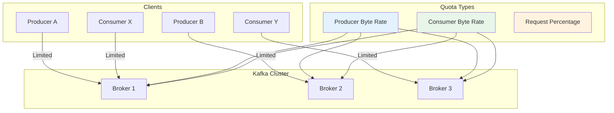
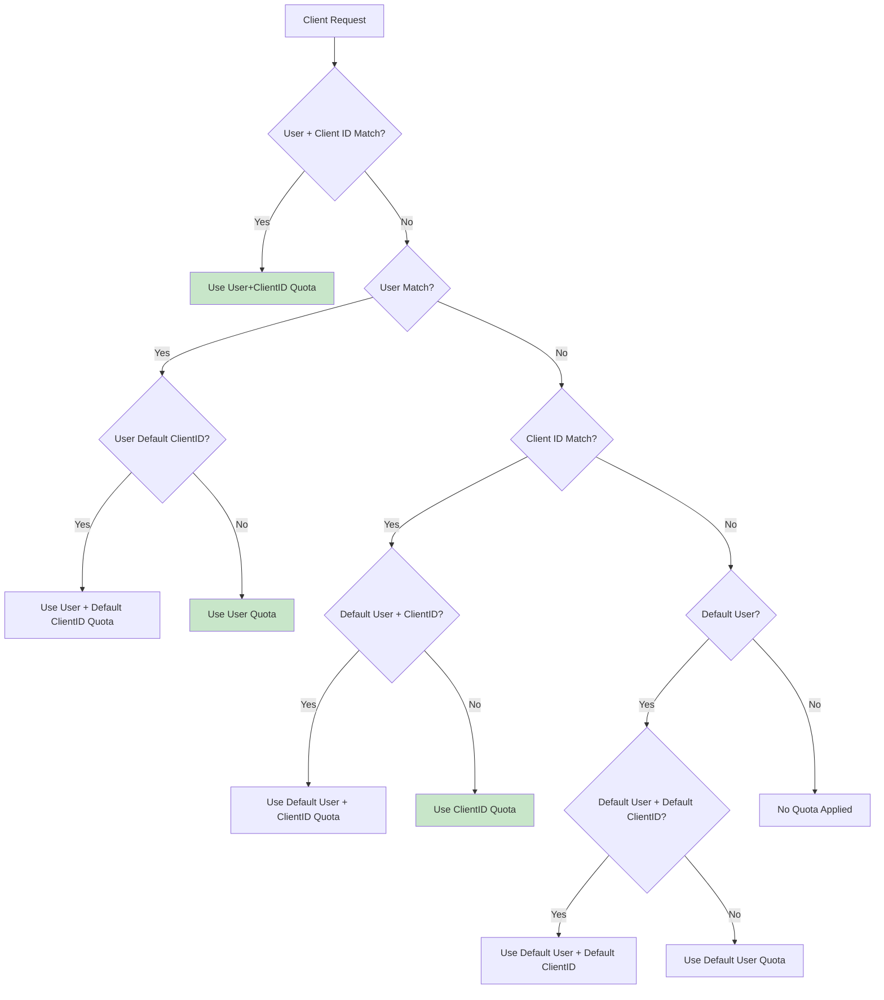

# How to Configure Kafka Quotas for Rate Limiting

Author: [nawazdhandala](https://github.com/nawazdhandala)

Tags: Apache Kafka, Rate Limiting, Quotas, Performance, Multi-tenancy, DevOps, Streaming

Description: Learn how to configure Kafka quotas to implement rate limiting, protect your cluster from runaway clients, and ensure fair resource sharing in multi-tenant environments.

---

Kafka quotas allow you to limit the rate at which clients can produce or consume data. Without quotas, a single misbehaving client can overwhelm your cluster, causing performance degradation for all users. This guide covers how to configure and manage quotas effectively.

## Understanding Kafka Quotas



## Quota Types

| Quota Type | Description | Unit |
|------------|-------------|------|
| **producer_byte_rate** | Maximum bytes/second a producer can send | bytes/sec |
| **consumer_byte_rate** | Maximum bytes/second a consumer can fetch | bytes/sec |
| **request_percentage** | Maximum CPU time for request handling | percentage |
| **controller_mutation_rate** | Maximum partition mutations per second | mutations/sec |

## Configuring User Quotas

User quotas apply to authenticated clients. They are enforced per broker, so the effective cluster-wide rate is the quota multiplied by the number of brokers.

```bash
#!/bin/bash
# Configure user-level quotas

BOOTSTRAP="kafka:9092"

# Set producer quota for user 'producer-app' (10 MB/s per broker)
kafka-configs.sh --bootstrap-server $BOOTSTRAP \
    --alter \
    --add-config 'producer_byte_rate=10485760' \
    --entity-type users \
    --entity-name producer-app

# Set consumer quota for user 'consumer-app' (20 MB/s per broker)
kafka-configs.sh --bootstrap-server $BOOTSTRAP \
    --alter \
    --add-config 'consumer_byte_rate=20971520' \
    --entity-type users \
    --entity-name consumer-app

# Set both producer and consumer quotas
kafka-configs.sh --bootstrap-server $BOOTSTRAP \
    --alter \
    --add-config 'producer_byte_rate=5242880,consumer_byte_rate=10485760' \
    --entity-type users \
    --entity-name batch-processor

# Set request percentage quota (limit CPU usage to 25% per broker)
kafka-configs.sh --bootstrap-server $BOOTSTRAP \
    --alter \
    --add-config 'request_percentage=25' \
    --entity-type users \
    --entity-name analytics-service

# View current quotas for a user
kafka-configs.sh --bootstrap-server $BOOTSTRAP \
    --describe \
    --entity-type users \
    --entity-name producer-app
```

## Configuring Client ID Quotas

Client ID quotas apply to unauthenticated clients or provide additional granularity within a user.

```bash
#!/bin/bash
# Configure client-id level quotas

BOOTSTRAP="kafka:9092"

# Set quota by client.id (useful for unauthenticated clusters)
kafka-configs.sh --bootstrap-server $BOOTSTRAP \
    --alter \
    --add-config 'producer_byte_rate=5242880' \
    --entity-type clients \
    --entity-name my-producer-client

# Set quota for specific user and client.id combination
kafka-configs.sh --bootstrap-server $BOOTSTRAP \
    --alter \
    --add-config 'producer_byte_rate=10485760,consumer_byte_rate=20971520' \
    --entity-type users \
    --entity-name team-analytics \
    --entity-type clients \
    --entity-name dashboard-service

# Set default quota for all client.ids of a specific user
kafka-configs.sh --bootstrap-server $BOOTSTRAP \
    --alter \
    --add-config 'producer_byte_rate=1048576' \
    --entity-type users \
    --entity-name team-analytics \
    --entity-type clients \
    --entity-default

# List all quotas
kafka-configs.sh --bootstrap-server $BOOTSTRAP \
    --describe \
    --entity-type users \
    --entity-type clients
```

## Default Quotas

Set default quotas that apply to all users or clients that do not have specific quotas configured.

```bash
#!/bin/bash
# Configure default quotas

BOOTSTRAP="kafka:9092"

# Default quota for all users (5 MB/s produce, 10 MB/s consume per broker)
kafka-configs.sh --bootstrap-server $BOOTSTRAP \
    --alter \
    --add-config 'producer_byte_rate=5242880,consumer_byte_rate=10485760' \
    --entity-type users \
    --entity-default

# Default quota for all client.ids
kafka-configs.sh --bootstrap-server $BOOTSTRAP \
    --alter \
    --add-config 'producer_byte_rate=2097152' \
    --entity-type clients \
    --entity-default

# Default quota for all users with a specific client.id
kafka-configs.sh --bootstrap-server $BOOTSTRAP \
    --alter \
    --add-config 'producer_byte_rate=1048576' \
    --entity-type users \
    --entity-default \
    --entity-type clients \
    --entity-name test-client
```

## Quota Precedence



## Programmatic Quota Management

```java
// Manage quotas programmatically using AdminClient
public class KafkaQuotaManager {

    private final AdminClient adminClient;

    public KafkaQuotaManager(String bootstrapServers) {
        Properties props = new Properties();
        props.put(AdminClientConfig.BOOTSTRAP_SERVERS_CONFIG, bootstrapServers);
        this.adminClient = AdminClient.create(props);
    }

    // Set quota for a user
    public void setUserQuota(String user, long producerBytesPerSec,
                             long consumerBytesPerSec) {
        ClientQuotaEntity entity = new ClientQuotaEntity(
            Collections.singletonMap(ClientQuotaEntity.USER, user));

        List<ClientQuotaAlteration.Op> ops = new ArrayList<>();

        if (producerBytesPerSec > 0) {
            ops.add(new ClientQuotaAlteration.Op("producer_byte_rate",
                (double) producerBytesPerSec));
        }
        if (consumerBytesPerSec > 0) {
            ops.add(new ClientQuotaAlteration.Op("consumer_byte_rate",
                (double) consumerBytesPerSec));
        }

        ClientQuotaAlteration alteration = new ClientQuotaAlteration(entity, ops);

        try {
            adminClient.alterClientQuotas(Collections.singletonList(alteration))
                .all().get();
            System.out.println("Quota set for user: " + user);
        } catch (Exception e) {
            throw new RuntimeException("Failed to set quota", e);
        }
    }

    // Set quota for user and client combination
    public void setUserClientQuota(String user, String clientId,
                                    long producerBytesPerSec,
                                    long consumerBytesPerSec) {
        Map<String, String> entityMap = new HashMap<>();
        entityMap.put(ClientQuotaEntity.USER, user);
        entityMap.put(ClientQuotaEntity.CLIENT_ID, clientId);

        ClientQuotaEntity entity = new ClientQuotaEntity(entityMap);

        List<ClientQuotaAlteration.Op> ops = new ArrayList<>();
        ops.add(new ClientQuotaAlteration.Op("producer_byte_rate",
            (double) producerBytesPerSec));
        ops.add(new ClientQuotaAlteration.Op("consumer_byte_rate",
            (double) consumerBytesPerSec));

        ClientQuotaAlteration alteration = new ClientQuotaAlteration(entity, ops);

        try {
            adminClient.alterClientQuotas(Collections.singletonList(alteration))
                .all().get();
            System.out.println("Quota set for user: " + user +
                ", clientId: " + clientId);
        } catch (Exception e) {
            throw new RuntimeException("Failed to set quota", e);
        }
    }

    // Set default quota for all users
    public void setDefaultUserQuota(long producerBytesPerSec,
                                     long consumerBytesPerSec) {
        // Use null for default entity
        ClientQuotaEntity entity = new ClientQuotaEntity(
            Collections.singletonMap(ClientQuotaEntity.USER, null));

        List<ClientQuotaAlteration.Op> ops = Arrays.asList(
            new ClientQuotaAlteration.Op("producer_byte_rate",
                (double) producerBytesPerSec),
            new ClientQuotaAlteration.Op("consumer_byte_rate",
                (double) consumerBytesPerSec)
        );

        ClientQuotaAlteration alteration = new ClientQuotaAlteration(entity, ops);

        try {
            adminClient.alterClientQuotas(Collections.singletonList(alteration))
                .all().get();
            System.out.println("Default user quota set");
        } catch (Exception e) {
            throw new RuntimeException("Failed to set default quota", e);
        }
    }

    // Get current quotas for a user
    public Map<String, Double> getUserQuotas(String user) {
        ClientQuotaEntity entity = new ClientQuotaEntity(
            Collections.singletonMap(ClientQuotaEntity.USER, user));

        ClientQuotaFilter filter = ClientQuotaFilter.containsOnly(
            Collections.singletonList(
                ClientQuotaFilterComponent.ofEntity(ClientQuotaEntity.USER, user)
            )
        );

        try {
            Map<ClientQuotaEntity, Map<String, Double>> result =
                adminClient.describeClientQuotas(filter).entities().get();

            return result.getOrDefault(entity, Collections.emptyMap());
        } catch (Exception e) {
            throw new RuntimeException("Failed to get quotas", e);
        }
    }

    // Remove quota for a user
    public void removeUserQuota(String user) {
        ClientQuotaEntity entity = new ClientQuotaEntity(
            Collections.singletonMap(ClientQuotaEntity.USER, user));

        // Set values to null to remove
        List<ClientQuotaAlteration.Op> ops = Arrays.asList(
            new ClientQuotaAlteration.Op("producer_byte_rate", null),
            new ClientQuotaAlteration.Op("consumer_byte_rate", null)
        );

        ClientQuotaAlteration alteration = new ClientQuotaAlteration(entity, ops);

        try {
            adminClient.alterClientQuotas(Collections.singletonList(alteration))
                .all().get();
            System.out.println("Quota removed for user: " + user);
        } catch (Exception e) {
            throw new RuntimeException("Failed to remove quota", e);
        }
    }

    // List all quotas in the cluster
    public Map<ClientQuotaEntity, Map<String, Double>> listAllQuotas() {
        ClientQuotaFilter filter = ClientQuotaFilter.all();

        try {
            return adminClient.describeClientQuotas(filter).entities().get();
        } catch (Exception e) {
            throw new RuntimeException("Failed to list quotas", e);
        }
    }

    public void close() {
        adminClient.close();
    }
}
```

## Multi-Tenant Quota Strategy

```java
// Quota management for multi-tenant Kafka clusters
public class MultiTenantQuotaManager {

    private final KafkaQuotaManager quotaManager;
    private final Map<String, TenantQuotaConfig> tenantConfigs;

    public MultiTenantQuotaManager(String bootstrapServers) {
        this.quotaManager = new KafkaQuotaManager(bootstrapServers);
        this.tenantConfigs = new ConcurrentHashMap<>();
    }

    // Define quota tiers
    public enum QuotaTier {
        FREE(1024 * 1024, 2 * 1024 * 1024),           // 1 MB/s produce, 2 MB/s consume
        BASIC(5 * 1024 * 1024, 10 * 1024 * 1024),     // 5 MB/s produce, 10 MB/s consume
        PROFESSIONAL(20 * 1024 * 1024, 50 * 1024 * 1024), // 20 MB/s produce, 50 MB/s consume
        ENTERPRISE(100 * 1024 * 1024, 200 * 1024 * 1024); // 100 MB/s produce, 200 MB/s consume

        private final long producerBytesPerSec;
        private final long consumerBytesPerSec;

        QuotaTier(long producer, long consumer) {
            this.producerBytesPerSec = producer;
            this.consumerBytesPerSec = consumer;
        }

        public long getProducerBytesPerSec() { return producerBytesPerSec; }
        public long getConsumerBytesPerSec() { return consumerBytesPerSec; }
    }

    // Provision tenant with quota tier
    public void provisionTenant(String tenantId, QuotaTier tier) {
        // Create tenant user quota
        quotaManager.setUserQuota(
            "tenant-" + tenantId,
            tier.getProducerBytesPerSec(),
            tier.getConsumerBytesPerSec()
        );

        // Store configuration
        tenantConfigs.put(tenantId, new TenantQuotaConfig(tenantId, tier));

        System.out.println("Provisioned tenant " + tenantId + " with " + tier + " tier");
    }

    // Upgrade tenant tier
    public void upgradeTenant(String tenantId, QuotaTier newTier) {
        TenantQuotaConfig config = tenantConfigs.get(tenantId);
        if (config == null) {
            throw new IllegalArgumentException("Tenant not found: " + tenantId);
        }

        quotaManager.setUserQuota(
            "tenant-" + tenantId,
            newTier.getProducerBytesPerSec(),
            newTier.getConsumerBytesPerSec()
        );

        config.setTier(newTier);
        System.out.println("Upgraded tenant " + tenantId + " to " + newTier + " tier");
    }

    // Set application-specific quotas within tenant
    public void setApplicationQuota(String tenantId, String appId,
                                     long producerBytesPerSec,
                                     long consumerBytesPerSec) {
        TenantQuotaConfig config = tenantConfigs.get(tenantId);
        if (config == null) {
            throw new IllegalArgumentException("Tenant not found: " + tenantId);
        }

        // Validate against tenant limits
        if (producerBytesPerSec > config.getTier().getProducerBytesPerSec()) {
            throw new IllegalArgumentException(
                "App producer quota exceeds tenant limit");
        }
        if (consumerBytesPerSec > config.getTier().getConsumerBytesPerSec()) {
            throw new IllegalArgumentException(
                "App consumer quota exceeds tenant limit");
        }

        quotaManager.setUserClientQuota(
            "tenant-" + tenantId,
            appId,
            producerBytesPerSec,
            consumerBytesPerSec
        );

        System.out.println("Set quota for tenant " + tenantId +
            ", app " + appId);
    }

    // Deprovision tenant
    public void deprovisionTenant(String tenantId) {
        quotaManager.removeUserQuota("tenant-" + tenantId);
        tenantConfigs.remove(tenantId);
        System.out.println("Deprovisioned tenant: " + tenantId);
    }

    public void close() {
        quotaManager.close();
    }
}

class TenantQuotaConfig {
    private final String tenantId;
    private MultiTenantQuotaManager.QuotaTier tier;

    public TenantQuotaConfig(String tenantId, MultiTenantQuotaManager.QuotaTier tier) {
        this.tenantId = tenantId;
        this.tier = tier;
    }

    public String getTenantId() { return tenantId; }
    public MultiTenantQuotaManager.QuotaTier getTier() { return tier; }
    public void setTier(MultiTenantQuotaManager.QuotaTier tier) { this.tier = tier; }
}
```

## Monitoring Quota Usage

```java
// Monitor quota metrics via JMX
public class QuotaMetricsCollector {

    private final MeterRegistry registry;

    public QuotaMetricsCollector(MeterRegistry registry) {
        this.registry = registry;
    }

    // Collect quota metrics from producer
    public void collectProducerMetrics(KafkaProducer<?, ?> producer, String clientId) {
        // Producer throttle time - how long producer was blocked due to quota
        Gauge.builder("kafka.producer.throttle.time.avg",
            () -> getProducerMetric(producer, "produce-throttle-time-avg"))
            .tag("client.id", clientId)
            .description("Average time producer was throttled due to quota")
            .register(registry);

        // Record send rate
        Gauge.builder("kafka.producer.record.send.rate",
            () -> getProducerMetric(producer, "record-send-rate"))
            .tag("client.id", clientId)
            .description("Records sent per second")
            .register(registry);

        // Byte rate
        Gauge.builder("kafka.producer.byte.rate",
            () -> getProducerMetric(producer, "outgoing-byte-rate"))
            .tag("client.id", clientId)
            .description("Bytes sent per second")
            .register(registry);
    }

    // Collect quota metrics from consumer
    public void collectConsumerMetrics(KafkaConsumer<?, ?> consumer, String clientId) {
        // Consumer throttle time
        Gauge.builder("kafka.consumer.throttle.time.avg",
            () -> getConsumerMetric(consumer, "fetch-throttle-time-avg"))
            .tag("client.id", clientId)
            .description("Average time consumer was throttled due to quota")
            .register(registry);

        // Fetch rate
        Gauge.builder("kafka.consumer.fetch.rate",
            () -> getConsumerMetric(consumer, "fetch-rate"))
            .tag("client.id", clientId)
            .description("Fetch requests per second")
            .register(registry);

        // Byte rate
        Gauge.builder("kafka.consumer.byte.rate",
            () -> getConsumerMetric(consumer, "incoming-byte-rate"))
            .tag("client.id", clientId)
            .description("Bytes received per second")
            .register(registry);
    }

    private double getProducerMetric(KafkaProducer<?, ?> producer, String metricName) {
        for (Map.Entry<MetricName, ? extends Metric> entry :
                producer.metrics().entrySet()) {
            if (entry.getKey().name().equals(metricName)) {
                Object value = entry.getValue().metricValue();
                if (value instanceof Number) {
                    return ((Number) value).doubleValue();
                }
            }
        }
        return 0.0;
    }

    private double getConsumerMetric(KafkaConsumer<?, ?> consumer, String metricName) {
        for (Map.Entry<MetricName, ? extends Metric> entry :
                consumer.metrics().entrySet()) {
            if (entry.getKey().name().equals(metricName)) {
                Object value = entry.getValue().metricValue();
                if (value instanceof Number) {
                    return ((Number) value).doubleValue();
                }
            }
        }
        return 0.0;
    }
}
```

## Broker-Side Quota Configuration

```properties
# server.properties - broker-level quota defaults

# Default quotas (can be overridden per user/client)
# These are per-broker limits

# Default producer byte rate (10 MB/s)
quota.producer.default=10485760

# Default consumer byte rate (20 MB/s)
quota.consumer.default=20971520

# Quota window settings
# Number of samples to retain for calculating averages
quota.window.num=11

# Size of each sample window in seconds
quota.window.size.seconds=1

# Controller mutation quota (partitions/sec)
# Limits topic creation/deletion rate
controller.quota.window.num=11
controller.quota.window.size.seconds=1
```

## Dynamic Quota Adjustment

```java
// Automatically adjust quotas based on usage patterns
public class DynamicQuotaAdjuster {

    private final KafkaQuotaManager quotaManager;
    private final AdminClient adminClient;
    private final Map<String, UsageTracker> usageTrackers;
    private final ScheduledExecutorService scheduler;

    public DynamicQuotaAdjuster(String bootstrapServers) {
        this.quotaManager = new KafkaQuotaManager(bootstrapServers);

        Properties props = new Properties();
        props.put(AdminClientConfig.BOOTSTRAP_SERVERS_CONFIG, bootstrapServers);
        this.adminClient = AdminClient.create(props);

        this.usageTrackers = new ConcurrentHashMap<>();
        this.scheduler = Executors.newScheduledThreadPool(1);
    }

    // Start monitoring and adjusting quotas
    public void start() {
        // Check usage every minute
        scheduler.scheduleAtFixedRate(this::adjustQuotas, 1, 1, TimeUnit.MINUTES);
    }

    private void adjustQuotas() {
        try {
            // Get all quota configurations
            Map<ClientQuotaEntity, Map<String, Double>> quotas =
                quotaManager.listAllQuotas();

            for (Map.Entry<ClientQuotaEntity, Map<String, Double>> entry :
                    quotas.entrySet()) {

                ClientQuotaEntity entity = entry.getKey();
                String user = entity.entries().get(ClientQuotaEntity.USER);

                if (user == null) continue;

                // Track usage
                UsageTracker tracker = usageTrackers.computeIfAbsent(
                    user, k -> new UsageTracker());

                // Get current quota
                Double currentQuota = entry.getValue().get("producer_byte_rate");
                if (currentQuota == null) continue;

                // Check if quota needs adjustment
                double usageRatio = tracker.getAverageUsageRatio();

                if (usageRatio > 0.9 && tracker.isConsistentlyHigh()) {
                    // Usage is consistently high, consider increasing quota
                    System.out.println("User " + user +
                        " consistently using >90% of quota");

                    // Alert or auto-increase based on policy
                    // autoIncreaseQuota(user, currentQuota);
                } else if (usageRatio < 0.1 && tracker.isConsistentlyLow()) {
                    // Usage is consistently low, consider decreasing quota
                    System.out.println("User " + user +
                        " consistently using <10% of quota");

                    // Alert or auto-decrease based on policy
                    // autoDecreaseQuota(user, currentQuota);
                }
            }
        } catch (Exception e) {
            System.err.println("Error adjusting quotas: " + e.getMessage());
        }
    }

    public void trackUsage(String user, long bytesProduced, long quotaLimit) {
        UsageTracker tracker = usageTrackers.computeIfAbsent(
            user, k -> new UsageTracker());
        tracker.recordUsage((double) bytesProduced / quotaLimit);
    }

    public void stop() {
        scheduler.shutdown();
        adminClient.close();
        quotaManager.close();
    }

    private static class UsageTracker {
        private final Deque<Double> recentUsage = new ArrayDeque<>();
        private static final int WINDOW_SIZE = 60; // 1 hour of minute samples

        public synchronized void recordUsage(double ratio) {
            recentUsage.addLast(ratio);
            while (recentUsage.size() > WINDOW_SIZE) {
                recentUsage.removeFirst();
            }
        }

        public synchronized double getAverageUsageRatio() {
            if (recentUsage.isEmpty()) return 0;
            return recentUsage.stream()
                .mapToDouble(Double::doubleValue)
                .average()
                .orElse(0);
        }

        public synchronized boolean isConsistentlyHigh() {
            if (recentUsage.size() < 30) return false;
            return recentUsage.stream()
                .mapToDouble(Double::doubleValue)
                .filter(r -> r > 0.9)
                .count() > 25;
        }

        public synchronized boolean isConsistentlyLow() {
            if (recentUsage.size() < 30) return false;
            return recentUsage.stream()
                .mapToDouble(Double::doubleValue)
                .filter(r -> r < 0.1)
                .count() > 25;
        }
    }
}
```

## Handling Quota Violations

```java
// Producer with quota violation handling
public class QuotaAwareProducer {

    private final KafkaProducer<String, String> producer;
    private final MeterRegistry registry;
    private final Counter throttleCounter;
    private final Timer throttleTimer;

    public QuotaAwareProducer(Properties props, MeterRegistry registry) {
        this.producer = new KafkaProducer<>(props);
        this.registry = registry;

        this.throttleCounter = registry.counter("kafka.producer.throttle.count");
        this.throttleTimer = registry.timer("kafka.producer.throttle.time");
    }

    public void send(String topic, String key, String value) {
        ProducerRecord<String, String> record = new ProducerRecord<>(topic, key, value);

        long startTime = System.nanoTime();

        producer.send(record, (metadata, exception) -> {
            long elapsed = System.nanoTime() - startTime;

            if (exception != null) {
                if (exception.getMessage().contains("throttl")) {
                    // Record was throttled
                    throttleCounter.increment();
                    throttleTimer.record(elapsed, TimeUnit.NANOSECONDS);

                    System.out.println("Producer throttled, consider reducing rate");
                }
            } else {
                // Check if send took too long (possible throttling)
                if (elapsed > TimeUnit.SECONDS.toNanos(1)) {
                    System.out.println("Slow send detected, possible throttling");
                }
            }
        });
    }

    // Adaptive rate control based on throttling
    public void sendWithBackoff(String topic, String key, String value,
                                 RateLimiter rateLimiter) {
        // Get current throttle metrics
        double throttleTime = getThrottleTimeAvg();

        if (throttleTime > 100) { // Throttled for more than 100ms on average
            // Reduce rate
            double newRate = rateLimiter.getRate() * 0.8;
            rateLimiter.setRate(newRate);
            System.out.println("Reducing rate to " + newRate + " due to throttling");
        } else if (throttleTime < 10) {
            // Can increase rate
            double newRate = rateLimiter.getRate() * 1.1;
            rateLimiter.setRate(newRate);
        }

        rateLimiter.acquire();
        send(topic, key, value);
    }

    private double getThrottleTimeAvg() {
        for (Map.Entry<MetricName, ? extends Metric> entry :
                producer.metrics().entrySet()) {
            if (entry.getKey().name().equals("produce-throttle-time-avg")) {
                Object value = entry.getValue().metricValue();
                if (value instanceof Number) {
                    return ((Number) value).doubleValue();
                }
            }
        }
        return 0.0;
    }

    public void close() {
        producer.close();
    }
}
```

## Summary

| Configuration | Use Case |
|--------------|----------|
| **User quotas** | Authenticated multi-tenant clusters |
| **Client ID quotas** | Unauthenticated or per-application limits |
| **Default quotas** | Baseline protection for all clients |
| **Request percentage** | Limit CPU impact of heavy clients |
| **Dynamic adjustment** | Auto-scale based on usage patterns |

Kafka quotas are essential for protecting your cluster from misbehaving clients and ensuring fair resource sharing. Set default quotas as a baseline, configure specific quotas for known clients, and monitor throttle metrics to identify clients that need quota adjustments. For multi-tenant environments, implement tiered quotas based on service levels.
