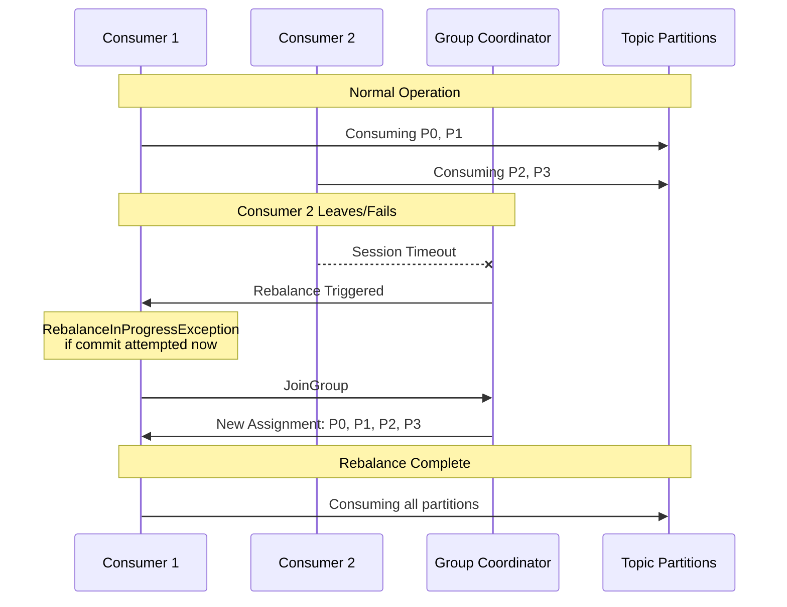
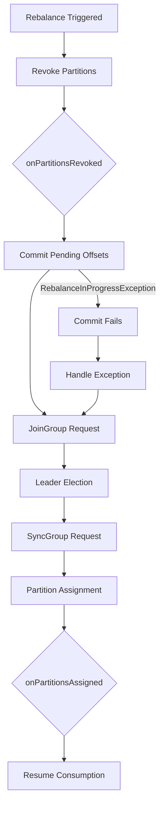
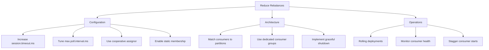

# How to Fix 'RebalanceInProgressException' in Kafka

Author: [nawazdhandala](https://www.github.com/nawazdhandala)

Tags: Apache Kafka, RebalanceInProgressException, Consumer Groups, Rebalancing, Partition Assignment, Error Handling

Description: Learn how to diagnose and fix Kafka RebalanceInProgressException errors, understand rebalancing causes, and implement strategies for stable consumer groups.

---

The `RebalanceInProgressException` occurs when a Kafka consumer attempts to commit offsets or perform other operations during a consumer group rebalance. This guide covers understanding, diagnosing, and preventing these disruptive rebalance events.

## Understanding Consumer Group Rebalancing



## When This Error Occurs

```
org.apache.kafka.clients.consumer.RebalanceInProgressException:
Offset commit cannot be completed since the consumer is undergoing a rebalance for auto partition assignment
```

### Common Triggers

1. **Consumer joins or leaves group**: New consumer starts or existing one stops
2. **Consumer session timeout**: Consumer fails to send heartbeats in time
3. **Poll interval exceeded**: Consumer takes too long between polls
4. **Topic partition changes**: Partitions added or removed
5. **Consumer subscription changes**: Topics added or removed from subscription

## Diagnosing the Problem

### Check Consumer Group Status

```bash
# View consumer group details
kafka-consumer-groups.sh --bootstrap-server localhost:9092 \
  --group my-consumer-group \
  --describe

# Check for frequent rebalances in coordinator logs
kafka-consumer-groups.sh --bootstrap-server localhost:9092 \
  --group my-consumer-group \
  --describe --members --verbose

# List all members with their assignments
kafka-consumer-groups.sh --bootstrap-server localhost:9092 \
  --group my-consumer-group \
  --describe --state
```

### Identify Rebalance Causes

```bash
# Check broker logs for rebalance events
grep -i "rebalance\|join.*group\|leave.*group" /var/log/kafka/server.log | tail -50

# Look for session timeouts
grep -i "session.*timeout\|heartbeat" /var/log/kafka/server.log | tail -50
```

## Rebalance Flow



## Java Solutions

### Proper Rebalance Handling with Listener

```java
import org.apache.kafka.clients.consumer.*;
import org.apache.kafka.common.TopicPartition;
import org.apache.kafka.common.errors.RebalanceInProgressException;

import java.time.Duration;
import java.util.*;
import java.util.concurrent.atomic.AtomicBoolean;

public class RebalanceAwareConsumer {

    private final KafkaConsumer<String, String> consumer;
    private final Map<TopicPartition, Long> pendingOffsets = new HashMap<>();
    private final AtomicBoolean rebalanceInProgress = new AtomicBoolean(false);

    public RebalanceAwareConsumer(Properties props) {
        // Configure for stability
        props.put(ConsumerConfig.SESSION_TIMEOUT_MS_CONFIG, 30000);
        props.put(ConsumerConfig.HEARTBEAT_INTERVAL_MS_CONFIG, 10000);
        props.put(ConsumerConfig.MAX_POLL_INTERVAL_MS_CONFIG, 300000);
        props.put(ConsumerConfig.ENABLE_AUTO_COMMIT_CONFIG, false);

        this.consumer = new KafkaConsumer<>(props);
    }

    public void subscribe(String topic) {
        consumer.subscribe(Collections.singletonList(topic), new ConsumerRebalanceListener() {

            @Override
            public void onPartitionsRevoked(Collection<TopicPartition> partitions) {
                System.out.println("Partitions revoked: " + partitions);
                rebalanceInProgress.set(true);

                // Commit any pending offsets before rebalance
                commitPendingOffsets();
            }

            @Override
            public void onPartitionsAssigned(Collection<TopicPartition> partitions) {
                System.out.println("Partitions assigned: " + partitions);
                rebalanceInProgress.set(false);

                // Clear pending offsets for new assignment
                pendingOffsets.clear();
            }
        });
    }

    public void consume() {
        while (true) {
            try {
                ConsumerRecords<String, String> records = consumer.poll(Duration.ofMillis(1000));

                for (ConsumerRecord<String, String> record : records) {
                    processRecord(record);

                    // Track offset for this partition
                    TopicPartition tp = new TopicPartition(record.topic(), record.partition());
                    pendingOffsets.put(tp, record.offset() + 1);
                }

                // Commit periodically (not every record)
                if (!pendingOffsets.isEmpty() && !rebalanceInProgress.get()) {
                    commitPendingOffsets();
                }

            } catch (RebalanceInProgressException e) {
                System.out.println("Rebalance in progress, skipping commit");
                // The listener will handle committing when safe

            } catch (Exception e) {
                System.err.println("Error during consumption: " + e.getMessage());
            }
        }
    }

    private void commitPendingOffsets() {
        if (pendingOffsets.isEmpty()) {
            return;
        }

        Map<TopicPartition, OffsetAndMetadata> offsetsToCommit = new HashMap<>();
        for (Map.Entry<TopicPartition, Long> entry : pendingOffsets.entrySet()) {
            offsetsToCommit.put(entry.getKey(), new OffsetAndMetadata(entry.getValue()));
        }

        try {
            consumer.commitSync(offsetsToCommit, Duration.ofSeconds(10));
            System.out.println("Committed offsets: " + offsetsToCommit);
            pendingOffsets.clear();
        } catch (RebalanceInProgressException e) {
            System.out.println("Could not commit during rebalance, will retry");
        } catch (Exception e) {
            System.err.println("Commit failed: " + e.getMessage());
        }
    }

    private void processRecord(ConsumerRecord<String, String> record) {
        System.out.printf("Processing: partition=%d, offset=%d, key=%s%n",
            record.partition(), record.offset(), record.key());
    }

    public void close() {
        consumer.close();
    }
}
```

### Cooperative Sticky Assignor (Kafka 2.4+)

```java
import org.apache.kafka.clients.consumer.*;
import org.apache.kafka.common.TopicPartition;

import java.time.Duration;
import java.util.*;

public class CooperativeConsumer {

    private final KafkaConsumer<String, String> consumer;

    public CooperativeConsumer(Properties props) {
        // Use cooperative sticky assignor to reduce rebalance impact
        props.put(ConsumerConfig.PARTITION_ASSIGNMENT_STRATEGY_CONFIG,
            "org.apache.kafka.clients.consumer.CooperativeStickyAssignor");

        // Stability settings
        props.put(ConsumerConfig.SESSION_TIMEOUT_MS_CONFIG, 45000);
        props.put(ConsumerConfig.HEARTBEAT_INTERVAL_MS_CONFIG, 15000);
        props.put(ConsumerConfig.MAX_POLL_INTERVAL_MS_CONFIG, 300000);

        this.consumer = new KafkaConsumer<>(props);
    }

    public void subscribe(String topic) {
        consumer.subscribe(Collections.singletonList(topic), new ConsumerRebalanceListener() {

            @Override
            public void onPartitionsRevoked(Collection<TopicPartition> partitions) {
                // With cooperative assignor, only revoked partitions are stopped
                // Other partitions continue processing
                if (!partitions.isEmpty()) {
                    System.out.println("Partitions revoked (incremental): " + partitions);
                    // Commit offsets only for revoked partitions
                    commitOffsetsForPartitions(partitions);
                }
            }

            @Override
            public void onPartitionsAssigned(Collection<TopicPartition> partitions) {
                if (!partitions.isEmpty()) {
                    System.out.println("Partitions assigned (incremental): " + partitions);
                }
            }

            @Override
            public void onPartitionsLost(Collection<TopicPartition> partitions) {
                // Called when partitions are lost due to consumer failure
                System.out.println("Partitions lost: " + partitions);
                // Do not commit - another consumer may have already taken over
            }
        });
    }

    private void commitOffsetsForPartitions(Collection<TopicPartition> partitions) {
        Map<TopicPartition, OffsetAndMetadata> offsets = new HashMap<>();
        for (TopicPartition tp : partitions) {
            long position = consumer.position(tp);
            offsets.put(tp, new OffsetAndMetadata(position));
        }

        try {
            consumer.commitSync(offsets);
            System.out.println("Committed offsets for revoked partitions");
        } catch (Exception e) {
            System.err.println("Failed to commit offsets: " + e.getMessage());
        }
    }

    public void consume() {
        while (true) {
            ConsumerRecords<String, String> records = consumer.poll(Duration.ofMillis(1000));

            for (ConsumerRecord<String, String> record : records) {
                processRecord(record);
            }

            // Commit async to avoid blocking
            consumer.commitAsync();
        }
    }

    private void processRecord(ConsumerRecord<String, String> record) {
        System.out.printf("Processing: partition=%d, offset=%d%n",
            record.partition(), record.offset());
    }

    public void close() {
        consumer.close();
    }
}
```

### Static Group Membership (Kafka 2.3+)

```java
import org.apache.kafka.clients.consumer.*;

import java.time.Duration;
import java.util.*;

public class StaticMemberConsumer {

    private final KafkaConsumer<String, String> consumer;

    public StaticMemberConsumer(Properties props, String instanceId) {
        // Static membership - consumer keeps same ID across restarts
        props.put(ConsumerConfig.GROUP_INSTANCE_ID_CONFIG, instanceId);

        // Longer session timeout for static members
        props.put(ConsumerConfig.SESSION_TIMEOUT_MS_CONFIG, 60000);

        // Use cooperative assignor with static membership
        props.put(ConsumerConfig.PARTITION_ASSIGNMENT_STRATEGY_CONFIG,
            "org.apache.kafka.clients.consumer.CooperativeStickyAssignor");

        this.consumer = new KafkaConsumer<>(props);
    }

    public void consume(String topic) {
        consumer.subscribe(Collections.singletonList(topic));

        while (true) {
            ConsumerRecords<String, String> records = consumer.poll(Duration.ofMillis(1000));

            for (ConsumerRecord<String, String> record : records) {
                processRecord(record);
            }

            consumer.commitAsync();
        }
    }

    private void processRecord(ConsumerRecord<String, String> record) {
        // Processing logic
    }

    public void close() {
        // With static membership, partitions are not immediately reassigned
        // They wait for session.timeout.ms before rebalancing
        consumer.close();
    }

    // Deploy with unique instance IDs per consumer
    public static void main(String[] args) {
        Properties props = new Properties();
        props.put(ConsumerConfig.BOOTSTRAP_SERVERS_CONFIG, "localhost:9092");
        props.put(ConsumerConfig.GROUP_ID_CONFIG, "static-group");
        props.put(ConsumerConfig.KEY_DESERIALIZER_CLASS_CONFIG,
            "org.apache.kafka.common.serialization.StringDeserializer");
        props.put(ConsumerConfig.VALUE_DESERIALIZER_CLASS_CONFIG,
            "org.apache.kafka.common.serialization.StringDeserializer");

        // Use hostname or container ID as instance ID
        String instanceId = System.getenv().getOrDefault("HOSTNAME", "consumer-1");

        StaticMemberConsumer consumer = new StaticMemberConsumer(props, instanceId);
        consumer.consume("my-topic");
    }
}
```

## Python Solutions

```python
from confluent_kafka import Consumer, KafkaException, TopicPartition
from dataclasses import dataclass
from typing import Dict, List, Callable, Optional
import threading
import time


class RebalanceHandler:
    """Handles consumer rebalances gracefully"""

    def __init__(self, consumer: Consumer):
        self.consumer = consumer
        self.pending_offsets: Dict[TopicPartition, int] = {}
        self.rebalance_in_progress = False
        self.lock = threading.Lock()

    def on_assign(self, consumer, partitions):
        """Called when partitions are assigned"""
        print(f"Assigned partitions: {[p.partition for p in partitions]}")
        with self.lock:
            self.rebalance_in_progress = False
            self.pending_offsets.clear()

    def on_revoke(self, consumer, partitions):
        """Called when partitions are revoked"""
        print(f"Revoked partitions: {[p.partition for p in partitions]}")
        with self.lock:
            self.rebalance_in_progress = True
            # Commit pending offsets before losing partitions
            self._commit_pending()

    def on_lost(self, consumer, partitions):
        """Called when partitions are lost (unclean shutdown)"""
        print(f"Lost partitions: {[p.partition for p in partitions]}")
        with self.lock:
            self.rebalance_in_progress = True
            # Do not commit - another consumer may have taken over
            self.pending_offsets.clear()

    def track_offset(self, topic: str, partition: int, offset: int):
        """Track offset for later commit"""
        with self.lock:
            tp = TopicPartition(topic, partition)
            self.pending_offsets[tp] = offset + 1

    def commit_if_safe(self) -> bool:
        """Commit offsets if not in rebalance"""
        with self.lock:
            if self.rebalance_in_progress:
                print("Skipping commit - rebalance in progress")
                return False
            return self._commit_pending()

    def _commit_pending(self) -> bool:
        """Internal commit method"""
        if not self.pending_offsets:
            return True

        offsets = [
            TopicPartition(tp.topic, tp.partition, offset)
            for tp, offset in self.pending_offsets.items()
        ]

        try:
            self.consumer.commit(offsets=offsets, asynchronous=False)
            print(f"Committed {len(offsets)} offsets")
            self.pending_offsets.clear()
            return True
        except KafkaException as e:
            print(f"Commit failed: {e}")
            return False


class StableConsumer:
    """Consumer configured for minimal rebalancing"""

    def __init__(self, bootstrap_servers: str, group_id: str,
                 instance_id: Optional[str] = None):
        config = {
            'bootstrap.servers': bootstrap_servers,
            'group.id': group_id,
            'auto.offset.reset': 'earliest',
            'enable.auto.commit': False,

            # Stability settings
            'session.timeout.ms': 45000,
            'heartbeat.interval.ms': 15000,
            'max.poll.interval.ms': 300000,

            # Cooperative assignor for incremental rebalancing
            'partition.assignment.strategy': 'cooperative-sticky',
        }

        # Static membership if instance ID provided
        if instance_id:
            config['group.instance.id'] = instance_id
            config['session.timeout.ms'] = 60000  # Longer for static members

        self.consumer = Consumer(config)
        self.rebalance_handler = RebalanceHandler(self.consumer)
        self.running = True

    def consume(self, topic: str, handler: Callable):
        """Consume messages with proper rebalance handling"""
        self.consumer.subscribe(
            [topic],
            on_assign=self.rebalance_handler.on_assign,
            on_revoke=self.rebalance_handler.on_revoke,
            on_lost=self.rebalance_handler.on_lost
        )

        messages_since_commit = 0
        last_commit_time = time.time()

        while self.running:
            try:
                msg = self.consumer.poll(1.0)

                if msg is None:
                    # Periodic commit even without messages
                    if time.time() - last_commit_time > 5:
                        self.rebalance_handler.commit_if_safe()
                        last_commit_time = time.time()
                    continue

                if msg.error():
                    self._handle_error(msg.error())
                    continue

                # Process message
                handler(msg)

                # Track offset
                self.rebalance_handler.track_offset(
                    msg.topic(), msg.partition(), msg.offset()
                )
                messages_since_commit += 1

                # Commit periodically
                if messages_since_commit >= 100 or time.time() - last_commit_time > 5:
                    self.rebalance_handler.commit_if_safe()
                    messages_since_commit = 0
                    last_commit_time = time.time()

            except KafkaException as e:
                print(f"Kafka error: {e}")

    def _handle_error(self, error):
        """Handle consumer errors"""
        error_code = error.code()

        # Check for rebalance-related errors
        if error_code == -168:  # _REVOKE_PARTITIONS
            print("Partition revocation in progress")
        elif error_code == -169:  # _ASSIGN_PARTITIONS
            print("Partition assignment in progress")
        else:
            print(f"Consumer error: {error}")

    def close(self):
        """Graceful shutdown"""
        self.running = False
        # Final commit before closing
        self.rebalance_handler.commit_if_safe()
        self.consumer.close()


class ConsumerPool:
    """
    Pool of consumers with managed lifecycle.
    Helps prevent unnecessary rebalances from rolling deployments.
    """

    def __init__(self, bootstrap_servers: str, group_id: str,
                 topic: str, num_consumers: int):
        self.consumers: List[StableConsumer] = []
        self.threads: List[threading.Thread] = []

        for i in range(num_consumers):
            instance_id = f"{group_id}-{i}"
            consumer = StableConsumer(bootstrap_servers, group_id, instance_id)
            self.consumers.append(consumer)

    def start(self, handler: Callable, topic: str):
        """Start all consumers"""
        for consumer in self.consumers:
            thread = threading.Thread(
                target=consumer.consume,
                args=(topic, handler),
                daemon=True
            )
            thread.start()
            self.threads.append(thread)

            # Stagger consumer starts to reduce rebalance frequency
            time.sleep(1)

    def stop(self):
        """Stop all consumers gracefully"""
        for consumer in self.consumers:
            consumer.running = False

        for consumer in self.consumers:
            consumer.close()


# Example usage
def main():
    bootstrap_servers = "localhost:9092"

    def message_handler(msg):
        print(f"Received: partition={msg.partition()}, offset={msg.offset()}")

    # Single consumer with static membership
    import os
    instance_id = os.environ.get('HOSTNAME', 'consumer-1')

    consumer = StableConsumer(
        bootstrap_servers,
        group_id="stable-group",
        instance_id=instance_id
    )

    try:
        consumer.consume("my-topic", message_handler)
    except KeyboardInterrupt:
        consumer.close()


if __name__ == '__main__':
    main()
```

## Rebalance Prevention Strategies



## Configuration Recommendations

### For Stable Consumer Groups

```properties
# Session management
session.timeout.ms=45000
heartbeat.interval.ms=15000

# Poll interval - increase if processing takes long
max.poll.interval.ms=300000

# Use cooperative assignor (Kafka 2.4+)
partition.assignment.strategy=org.apache.kafka.clients.consumer.CooperativeStickyAssignor

# Static membership (Kafka 2.3+)
group.instance.id=unique-instance-id
```

### For Long-Running Processing

```properties
# Allow more time for processing
max.poll.interval.ms=600000

# Smaller batches to ensure poll() is called frequently
max.poll.records=100

# Stable sessions
session.timeout.ms=60000
heartbeat.interval.ms=20000
```

## Monitoring Rebalances

```java
import org.apache.kafka.clients.consumer.Consumer;
import org.apache.kafka.common.Metric;
import org.apache.kafka.common.MetricName;

import java.util.Map;

public class RebalanceMonitor {

    public void logRebalanceMetrics(Consumer<?, ?> consumer) {
        Map<MetricName, ? extends Metric> metrics = consumer.metrics();

        for (Map.Entry<MetricName, ? extends Metric> entry : metrics.entrySet()) {
            String name = entry.getKey().name();

            // Key rebalance metrics
            if (name.contains("rebalance") || name.contains("join") ||
                name.contains("sync") || name.contains("heartbeat")) {

                System.out.printf("Metric: %s = %s%n",
                    name, entry.getValue().metricValue());
            }
        }
    }

    // Key metrics to monitor:
    // - rebalance-latency-avg
    // - rebalance-latency-max
    // - rebalance-total
    // - failed-rebalance-rate-per-hour
    // - heartbeat-rate
    // - last-heartbeat-seconds-ago
}
```

## Troubleshooting Checklist

1. **Check poll interval**: Is processing time exceeding `max.poll.interval.ms`?
2. **Verify heartbeats**: Are heartbeats being sent within `session.timeout.ms`?
3. **Review consumer health**: Are consumers crashing or being killed?
4. **Check network**: Are there connectivity issues to the coordinator?
5. **Examine assignments**: Is partition assignment stable?
6. **Monitor coordinator**: Is the group coordinator healthy?

## Conclusion

The `RebalanceInProgressException` indicates your consumer is trying to perform operations during a partition rebalance. To minimize disruption:

1. **Use cooperative sticky assignor** for incremental rebalancing
2. **Enable static membership** for stable consumer identity
3. **Configure appropriate timeouts** based on your processing requirements
4. **Implement proper rebalance listeners** to handle offset commits
5. **Monitor rebalance frequency** and investigate root causes

By implementing these strategies, you can significantly reduce rebalance frequency and their impact on your Kafka applications.
