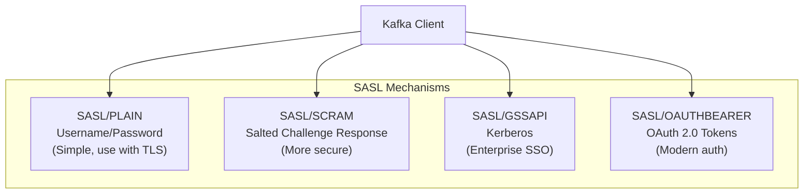
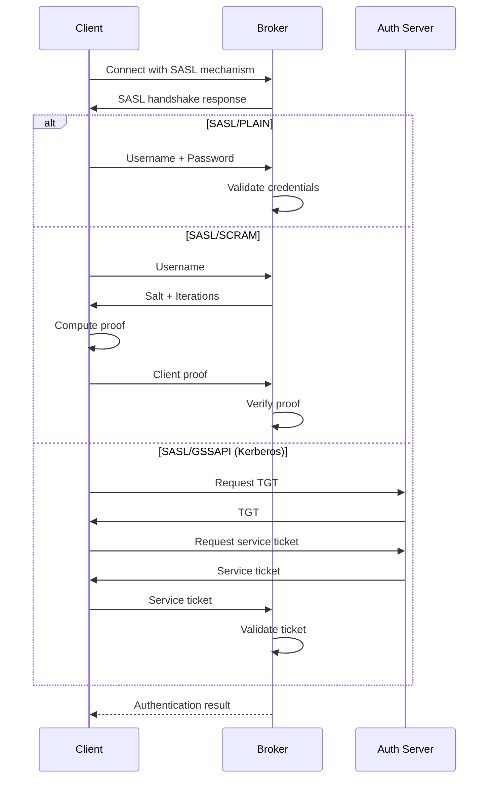
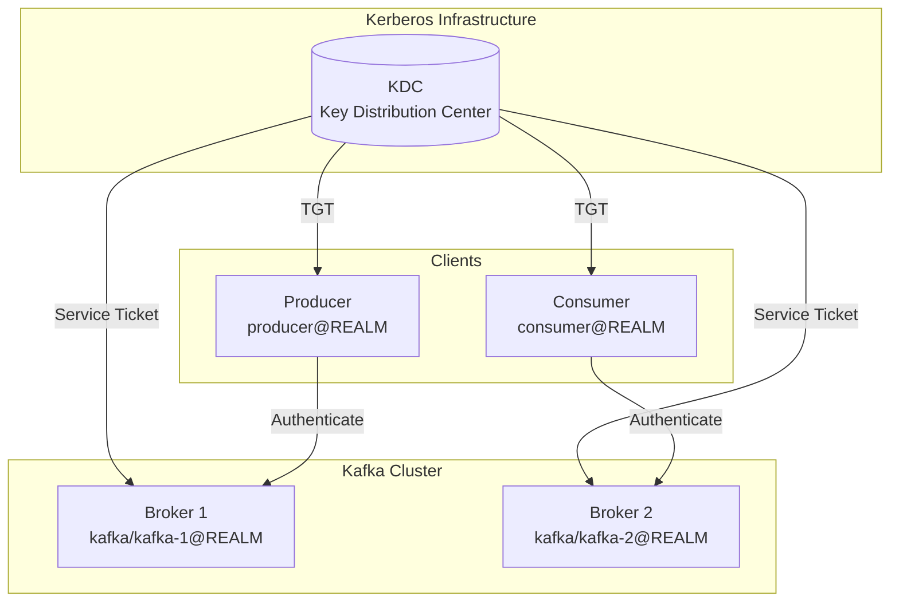
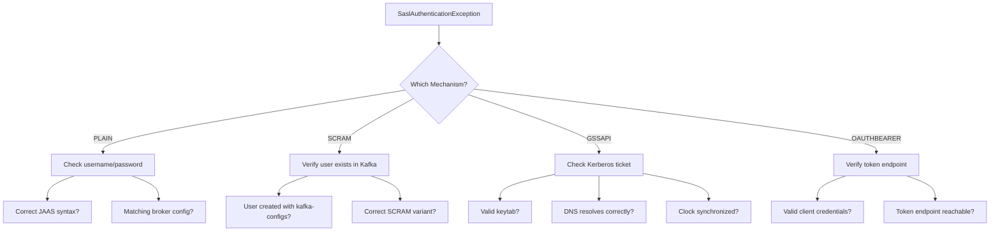

# How to Fix "SaslAuthenticationException" in Kafka

Author: [nawazdhandala](https://www.github.com/nawazdhandala)

Tags: Kafka, Apache Kafka, SASL, Authentication, Security, Troubleshooting, Kerberos, SCRAM

Description: Learn how to diagnose and fix SaslAuthenticationException errors in Apache Kafka by understanding SASL mechanisms, common misconfigurations, and authentication debugging techniques.

---

## Introduction

The `SaslAuthenticationException` in Apache Kafka indicates a failure in the authentication process between clients and brokers. This error can be frustrating because the root cause varies depending on the SASL mechanism being used. This guide covers how to diagnose and fix authentication failures for all common SASL mechanisms.

Understanding SASL authentication is crucial for securing Kafka deployments in enterprise environments where identity verification is required.

## Understanding SASL Authentication

### SASL Mechanisms Overview

Kafka supports several SASL authentication mechanisms:



### Authentication Flow



## Common SaslAuthenticationException Errors

### Error Messages and Their Meanings

| Error Message | Likely Cause |
|--------------|--------------|
| "Authentication failed: Invalid credentials" | Wrong username or password |
| "Authentication failed during authentication" | JAAS configuration issue |
| "No SASL mechanism provided" | Missing security.protocol |
| "Unable to find LoginModule" | Missing JAAS config file |
| "Client SASL mechanism 'X' not enabled" | Mechanism not configured on broker |
| "Error in SASL handshake" | Protocol mismatch |

## Fixing SASL/PLAIN Authentication

### Broker Configuration

```properties
# server.properties

# Listeners with SASL_SSL (recommended) or SASL_PLAINTEXT
listeners=SASL_SSL://0.0.0.0:9093
advertised.listeners=SASL_SSL://kafka-1.example.com:9093

# Security protocol mapping
listener.security.protocol.map=SASL_SSL:SASL_SSL

# Enable PLAIN mechanism
sasl.enabled.mechanisms=PLAIN
sasl.mechanism.inter.broker.protocol=PLAIN

# Inter-broker authentication
security.inter.broker.protocol=SASL_SSL

# SSL configuration (required for SASL_SSL)
ssl.keystore.location=/etc/kafka/ssl/kafka.keystore.jks
ssl.keystore.password=keystore-password
ssl.key.password=key-password
ssl.truststore.location=/etc/kafka/ssl/kafka.truststore.jks
ssl.truststore.password=truststore-password

# JAAS configuration for PLAIN
listener.name.sasl_ssl.plain.sasl.jaas.config=org.apache.kafka.common.security.plain.PlainLoginModule required \
    username="admin" \
    password="admin-secret" \
    user_admin="admin-secret" \
    user_producer="producer-secret" \
    user_consumer="consumer-secret";
```

### Client Configuration

```java
import org.apache.kafka.clients.producer.*;
import org.apache.kafka.common.serialization.StringSerializer;

import java.util.Properties;

public class SaslPlainProducer {

    public static KafkaProducer<String, String> createProducer(String bootstrapServers,
                                                                String username,
                                                                String password) {
        Properties props = new Properties();
        props.put(ProducerConfig.BOOTSTRAP_SERVERS_CONFIG, bootstrapServers);
        props.put(ProducerConfig.KEY_SERIALIZER_CLASS_CONFIG, StringSerializer.class.getName());
        props.put(ProducerConfig.VALUE_SERIALIZER_CLASS_CONFIG, StringSerializer.class.getName());

        // Security protocol - SASL_SSL recommended
        props.put("security.protocol", "SASL_SSL");

        // SASL mechanism
        props.put("sasl.mechanism", "PLAIN");

        // JAAS configuration (inline)
        String jaasConfig = String.format(
            "org.apache.kafka.common.security.plain.PlainLoginModule required " +
            "username=\"%s\" " +
            "password=\"%s\";",
            username, password
        );
        props.put("sasl.jaas.config", jaasConfig);

        // SSL truststore for SASL_SSL
        props.put("ssl.truststore.location", "/path/to/client.truststore.jks");
        props.put("ssl.truststore.password", "truststore-password");

        // Enable hostname verification
        props.put("ssl.endpoint.identification.algorithm", "https");

        return new KafkaProducer<>(props);
    }

    public static void main(String[] args) {
        KafkaProducer<String, String> producer = createProducer(
            "kafka-1.example.com:9093",
            "producer",
            "producer-secret"
        );

        try {
            ProducerRecord<String, String> record = new ProducerRecord<>(
                "test-topic", "key", "value"
            );
            RecordMetadata metadata = producer.send(record).get();
            System.out.printf("Sent to partition %d offset %d%n",
                metadata.partition(), metadata.offset());
        } catch (Exception e) {
            System.err.println("Send failed: " + e.getMessage());
            e.printStackTrace();
        } finally {
            producer.close();
        }
    }
}
```

### Troubleshooting PLAIN Authentication

```bash
#!/bin/bash
# troubleshoot-sasl-plain.sh

BROKER="kafka-1.example.com:9093"
USERNAME="producer"
PASSWORD="producer-secret"

# Create client properties file
cat > /tmp/client.properties << EOF
security.protocol=SASL_SSL
sasl.mechanism=PLAIN
sasl.jaas.config=org.apache.kafka.common.security.plain.PlainLoginModule required username="$USERNAME" password="$PASSWORD";
ssl.truststore.location=/path/to/client.truststore.jks
ssl.truststore.password=truststore-password
EOF

# Test authentication
echo "Testing SASL/PLAIN authentication..."
kafka-broker-api-versions.sh \
    --bootstrap-server $BROKER \
    --command-config /tmp/client.properties

# If successful, list topics
echo ""
echo "Listing topics..."
kafka-topics.sh \
    --bootstrap-server $BROKER \
    --command-config /tmp/client.properties \
    --list

# Cleanup
rm /tmp/client.properties
```

## Fixing SASL/SCRAM Authentication

SCRAM (Salted Challenge Response Authentication Mechanism) is more secure than PLAIN.

### Create SCRAM Users

```bash
# Create SCRAM-SHA-512 user (recommended)
kafka-configs.sh --bootstrap-server localhost:9092 \
    --alter --add-config 'SCRAM-SHA-512=[password=user-password]' \
    --entity-type users --entity-name myuser

# Create SCRAM-SHA-256 user
kafka-configs.sh --bootstrap-server localhost:9092 \
    --alter --add-config 'SCRAM-SHA-256=[password=user-password]' \
    --entity-type users --entity-name myuser

# List SCRAM users
kafka-configs.sh --bootstrap-server localhost:9092 \
    --describe --entity-type users

# Delete SCRAM user
kafka-configs.sh --bootstrap-server localhost:9092 \
    --alter --delete-config 'SCRAM-SHA-512' \
    --entity-type users --entity-name myuser
```

### Broker Configuration for SCRAM

```properties
# server.properties

listeners=SASL_SSL://0.0.0.0:9093
advertised.listeners=SASL_SSL://kafka-1.example.com:9093

listener.security.protocol.map=SASL_SSL:SASL_SSL

# Enable SCRAM mechanisms
sasl.enabled.mechanisms=SCRAM-SHA-512,SCRAM-SHA-256
sasl.mechanism.inter.broker.protocol=SCRAM-SHA-512

security.inter.broker.protocol=SASL_SSL

# SSL configuration
ssl.keystore.location=/etc/kafka/ssl/kafka.keystore.jks
ssl.keystore.password=keystore-password
ssl.truststore.location=/etc/kafka/ssl/kafka.truststore.jks
ssl.truststore.password=truststore-password

# JAAS configuration for inter-broker SCRAM authentication
listener.name.sasl_ssl.scram-sha-512.sasl.jaas.config=org.apache.kafka.common.security.scram.ScramLoginModule required \
    username="admin" \
    password="admin-password";
```

### Client Configuration for SCRAM

```java
import org.apache.kafka.clients.consumer.*;
import org.apache.kafka.common.serialization.StringDeserializer;

import java.time.Duration;
import java.util.Collections;
import java.util.Properties;

public class SaslScramConsumer {

    public static KafkaConsumer<String, String> createConsumer(String bootstrapServers,
                                                                String groupId,
                                                                String username,
                                                                String password) {
        Properties props = new Properties();
        props.put(ConsumerConfig.BOOTSTRAP_SERVERS_CONFIG, bootstrapServers);
        props.put(ConsumerConfig.GROUP_ID_CONFIG, groupId);
        props.put(ConsumerConfig.KEY_DESERIALIZER_CLASS_CONFIG, StringDeserializer.class.getName());
        props.put(ConsumerConfig.VALUE_DESERIALIZER_CLASS_CONFIG, StringDeserializer.class.getName());
        props.put(ConsumerConfig.AUTO_OFFSET_RESET_CONFIG, "earliest");

        // Security protocol
        props.put("security.protocol", "SASL_SSL");

        // SCRAM-SHA-512 mechanism
        props.put("sasl.mechanism", "SCRAM-SHA-512");

        // JAAS configuration for SCRAM
        String jaasConfig = String.format(
            "org.apache.kafka.common.security.scram.ScramLoginModule required " +
            "username=\"%s\" " +
            "password=\"%s\";",
            username, password
        );
        props.put("sasl.jaas.config", jaasConfig);

        // SSL configuration
        props.put("ssl.truststore.location", "/path/to/client.truststore.jks");
        props.put("ssl.truststore.password", "truststore-password");
        props.put("ssl.endpoint.identification.algorithm", "https");

        return new KafkaConsumer<>(props);
    }

    public static void main(String[] args) {
        KafkaConsumer<String, String> consumer = createConsumer(
            "kafka-1.example.com:9093",
            "scram-consumer-group",
            "myuser",
            "user-password"
        );

        consumer.subscribe(Collections.singletonList("test-topic"));

        try {
            while (true) {
                ConsumerRecords<String, String> records = consumer.poll(Duration.ofMillis(100));
                for (ConsumerRecord<String, String> record : records) {
                    System.out.printf("key=%s, value=%s%n", record.key(), record.value());
                }
            }
        } finally {
            consumer.close();
        }
    }
}
```

## Fixing SASL/GSSAPI (Kerberos) Authentication

Kerberos authentication is common in enterprise environments.

### Kerberos Setup Diagram



### Broker JAAS Configuration

Create `/etc/kafka/kafka_server_jaas.conf`:

```
KafkaServer {
    com.sun.security.auth.module.Krb5LoginModule required
    useKeyTab=true
    storeKey=true
    keyTab="/etc/kafka/kafka.keytab"
    principal="kafka/kafka-1.example.com@EXAMPLE.COM";
};

// For Zookeeper client connection
Client {
    com.sun.security.auth.module.Krb5LoginModule required
    useKeyTab=true
    storeKey=true
    keyTab="/etc/kafka/kafka.keytab"
    principal="kafka/kafka-1.example.com@EXAMPLE.COM";
};
```

### Broker Configuration for Kerberos

```properties
# server.properties

listeners=SASL_SSL://0.0.0.0:9093
advertised.listeners=SASL_SSL://kafka-1.example.com:9093

listener.security.protocol.map=SASL_SSL:SASL_SSL

# Enable GSSAPI mechanism
sasl.enabled.mechanisms=GSSAPI
sasl.mechanism.inter.broker.protocol=GSSAPI

security.inter.broker.protocol=SASL_SSL

# Kerberos settings
sasl.kerberos.service.name=kafka
sasl.kerberos.principal.to.local.rules=RULE:[1:$1@$0](.*@EXAMPLE.COM)s/@.*//,DEFAULT

# SSL configuration
ssl.keystore.location=/etc/kafka/ssl/kafka.keystore.jks
ssl.keystore.password=keystore-password
ssl.truststore.location=/etc/kafka/ssl/kafka.truststore.jks
ssl.truststore.password=truststore-password
```

Start broker with JAAS config:

```bash
export KAFKA_OPTS="-Djava.security.auth.login.config=/etc/kafka/kafka_server_jaas.conf -Djava.security.krb5.conf=/etc/krb5.conf"
kafka-server-start.sh /etc/kafka/server.properties
```

### Client JAAS Configuration

Create `kafka_client_jaas.conf`:

```
KafkaClient {
    com.sun.security.auth.module.Krb5LoginModule required
    useKeyTab=true
    storeKey=true
    keyTab="/path/to/client.keytab"
    principal="producer@EXAMPLE.COM";
};
```

### Client Configuration for Kerberos

```java
import org.apache.kafka.clients.producer.*;
import org.apache.kafka.common.serialization.StringSerializer;

import java.util.Properties;

public class KerberosProducer {

    public static void main(String[] args) {
        // Set system properties for Kerberos
        System.setProperty("java.security.auth.login.config", "/path/to/kafka_client_jaas.conf");
        System.setProperty("java.security.krb5.conf", "/etc/krb5.conf");

        Properties props = new Properties();
        props.put(ProducerConfig.BOOTSTRAP_SERVERS_CONFIG, "kafka-1.example.com:9093");
        props.put(ProducerConfig.KEY_SERIALIZER_CLASS_CONFIG, StringSerializer.class.getName());
        props.put(ProducerConfig.VALUE_SERIALIZER_CLASS_CONFIG, StringSerializer.class.getName());

        // Security protocol
        props.put("security.protocol", "SASL_SSL");

        // GSSAPI mechanism for Kerberos
        props.put("sasl.mechanism", "GSSAPI");

        // Kerberos service name (must match broker config)
        props.put("sasl.kerberos.service.name", "kafka");

        // SSL configuration
        props.put("ssl.truststore.location", "/path/to/client.truststore.jks");
        props.put("ssl.truststore.password", "truststore-password");

        KafkaProducer<String, String> producer = new KafkaProducer<>(props);

        try {
            ProducerRecord<String, String> record = new ProducerRecord<>(
                "test-topic", "key", "value"
            );
            RecordMetadata metadata = producer.send(record).get();
            System.out.printf("Sent to partition %d%n", metadata.partition());
        } catch (Exception e) {
            System.err.println("Error: " + e.getMessage());
            e.printStackTrace();
        } finally {
            producer.close();
        }
    }
}
```

### Troubleshooting Kerberos

```bash
#!/bin/bash
# troubleshoot-kerberos.sh

echo "=== Kerberos Troubleshooting ==="

# 1. Check Kerberos configuration
echo ""
echo "1. Kerberos configuration (/etc/krb5.conf):"
cat /etc/krb5.conf | grep -E "default_realm|kdc|admin_server"

# 2. List keytab contents
echo ""
echo "2. Keytab contents:"
klist -kt /path/to/client.keytab

# 3. Test kinit
echo ""
echo "3. Testing kinit with keytab:"
kinit -kt /path/to/client.keytab producer@EXAMPLE.COM
if [ $? -eq 0 ]; then
    echo "kinit successful!"
    klist
else
    echo "kinit failed!"
fi

# 4. Check DNS (Kerberos is DNS-sensitive)
echo ""
echo "4. DNS resolution:"
nslookup kafka-1.example.com
host kafka-1.example.com

# 5. Test connection with debug
echo ""
echo "5. Testing Kafka connection with Kerberos debug..."
export KAFKA_OPTS="-Dsun.security.krb5.debug=true"
kafka-broker-api-versions.sh \
    --bootstrap-server kafka-1.example.com:9093 \
    --command-config /path/to/kerberos-client.properties 2>&1 | head -50
```

## Fixing SASL/OAUTHBEARER Authentication

OAuth 2.0 authentication is useful for modern authentication systems.

### Custom OAuth Callback Handler

```java
import org.apache.kafka.common.security.auth.AuthenticateCallbackHandler;
import org.apache.kafka.common.security.oauthbearer.OAuthBearerToken;
import org.apache.kafka.common.security.oauthbearer.OAuthBearerTokenCallback;

import javax.security.auth.callback.Callback;
import javax.security.auth.callback.UnsupportedCallbackException;
import javax.security.auth.login.AppConfigurationEntry;
import java.io.IOException;
import java.net.URI;
import java.net.http.HttpClient;
import java.net.http.HttpRequest;
import java.net.http.HttpResponse;
import java.util.*;

/**
 * Custom OAuth callback handler that retrieves tokens from an OAuth server.
 */
public class OAuthCallbackHandler implements AuthenticateCallbackHandler {

    private String tokenEndpoint;
    private String clientId;
    private String clientSecret;
    private final HttpClient httpClient = HttpClient.newHttpClient();

    @Override
    public void configure(Map<String, ?> configs, String saslMechanism,
                          List<AppConfigurationEntry> jaasConfigEntries) {
        // Read configuration from JAAS config
        for (AppConfigurationEntry entry : jaasConfigEntries) {
            Map<String, ?> options = entry.getOptions();
            tokenEndpoint = (String) options.get("oauth.token.endpoint.uri");
            clientId = (String) options.get("oauth.client.id");
            clientSecret = (String) options.get("oauth.client.secret");
        }
    }

    @Override
    public void handle(Callback[] callbacks) throws IOException, UnsupportedCallbackException {
        for (Callback callback : callbacks) {
            if (callback instanceof OAuthBearerTokenCallback) {
                OAuthBearerTokenCallback tokenCallback = (OAuthBearerTokenCallback) callback;
                try {
                    OAuthBearerToken token = fetchToken();
                    tokenCallback.token(token);
                } catch (Exception e) {
                    tokenCallback.error("token_fetch_failed", e.getMessage(), null);
                }
            } else {
                throw new UnsupportedCallbackException(callback);
            }
        }
    }

    /**
     * Fetches OAuth token from the token endpoint using client credentials.
     */
    private OAuthBearerToken fetchToken() throws Exception {
        // Build token request
        String requestBody = String.format(
            "grant_type=client_credentials&client_id=%s&client_secret=%s",
            clientId, clientSecret
        );

        HttpRequest request = HttpRequest.newBuilder()
            .uri(URI.create(tokenEndpoint))
            .header("Content-Type", "application/x-www-form-urlencoded")
            .POST(HttpRequest.BodyPublishers.ofString(requestBody))
            .build();

        HttpResponse<String> response = httpClient.send(request,
            HttpResponse.BodyHandlers.ofString());

        if (response.statusCode() != 200) {
            throw new IOException("Token request failed: " + response.body());
        }

        // Parse response (simplified - use a JSON library in production)
        String body = response.body();
        String accessToken = extractJsonValue(body, "access_token");
        long expiresIn = Long.parseLong(extractJsonValue(body, "expires_in"));

        return new OAuthBearerToken() {
            @Override
            public String value() {
                return accessToken;
            }

            @Override
            public Set<String> scope() {
                return Collections.emptySet();
            }

            @Override
            public long lifetimeMs() {
                return System.currentTimeMillis() + (expiresIn * 1000);
            }

            @Override
            public String principalName() {
                return clientId;
            }

            @Override
            public Long startTimeMs() {
                return System.currentTimeMillis();
            }
        };
    }

    private String extractJsonValue(String json, String key) {
        // Simple JSON extraction - use a proper JSON library in production
        int start = json.indexOf("\"" + key + "\":");
        if (start == -1) return null;
        start = json.indexOf(":", start) + 1;
        int end = json.indexOf(",", start);
        if (end == -1) end = json.indexOf("}", start);
        String value = json.substring(start, end).trim();
        return value.replace("\"", "");
    }

    @Override
    public void close() {
        // Cleanup if needed
    }
}
```

### Client Configuration for OAuth

```java
import org.apache.kafka.clients.producer.*;
import org.apache.kafka.common.serialization.StringSerializer;

import java.util.Properties;

public class OAuthProducer {

    public static KafkaProducer<String, String> createProducer(String bootstrapServers) {
        Properties props = new Properties();
        props.put(ProducerConfig.BOOTSTRAP_SERVERS_CONFIG, bootstrapServers);
        props.put(ProducerConfig.KEY_SERIALIZER_CLASS_CONFIG, StringSerializer.class.getName());
        props.put(ProducerConfig.VALUE_SERIALIZER_CLASS_CONFIG, StringSerializer.class.getName());

        // Security protocol
        props.put("security.protocol", "SASL_SSL");

        // OAuth mechanism
        props.put("sasl.mechanism", "OAUTHBEARER");

        // JAAS configuration with custom callback handler
        String jaasConfig =
            "org.apache.kafka.common.security.oauthbearer.OAuthBearerLoginModule required " +
            "oauth.token.endpoint.uri=\"https://auth.example.com/oauth/token\" " +
            "oauth.client.id=\"kafka-client\" " +
            "oauth.client.secret=\"client-secret\";";
        props.put("sasl.jaas.config", jaasConfig);

        // Custom callback handler class
        props.put("sasl.login.callback.handler.class",
            "com.example.OAuthCallbackHandler");

        // SSL configuration
        props.put("ssl.truststore.location", "/path/to/truststore.jks");
        props.put("ssl.truststore.password", "truststore-password");

        return new KafkaProducer<>(props);
    }
}
```

## General Troubleshooting Steps

### Enable SASL Debug Logging

```bash
# For broker
export KAFKA_OPTS="-Djava.security.auth.login.config=/etc/kafka/jaas.conf -Dorg.apache.kafka.common.security.auth.DEBUG=true"

# For client applications
-Djava.security.auth.login.config=/path/to/jaas.conf
-Dorg.apache.kafka.common.security.auth.DEBUG=true
```

### Diagnostic Script

```bash
#!/bin/bash
# diagnose-sasl-auth.sh

BROKER="$1"
MECHANISM="$2"
CONFIG_FILE="$3"

if [ -z "$BROKER" ] || [ -z "$MECHANISM" ] || [ -z "$CONFIG_FILE" ]; then
    echo "Usage: $0 <broker:port> <mechanism> <config-file>"
    echo "Example: $0 kafka:9093 PLAIN /tmp/client.properties"
    exit 1
fi

echo "=== SASL Authentication Diagnostics ==="
echo "Broker: $BROKER"
echo "Mechanism: $MECHANISM"
echo "Config: $CONFIG_FILE"
echo ""

# Check config file
echo "1. Configuration file contents:"
echo "--------------------------------"
cat $CONFIG_FILE
echo ""

# Test DNS
HOST=$(echo $BROKER | cut -d: -f1)
PORT=$(echo $BROKER | cut -d: -f2)

echo "2. DNS resolution for $HOST:"
echo "----------------------------"
host $HOST || nslookup $HOST
echo ""

# Test TCP connectivity
echo "3. TCP connectivity to $BROKER:"
echo "--------------------------------"
nc -zv -w 5 $HOST $PORT 2>&1
echo ""

# Test SSL (if SASL_SSL)
echo "4. SSL certificate check:"
echo "-------------------------"
echo | openssl s_client -connect $BROKER 2>/dev/null | \
    openssl x509 -noout -subject -issuer -dates 2>/dev/null || \
    echo "SSL not available or handshake failed"
echo ""

# Test Kafka authentication
echo "5. Kafka broker API versions (tests authentication):"
echo "----------------------------------------------------"
kafka-broker-api-versions.sh \
    --bootstrap-server $BROKER \
    --command-config $CONFIG_FILE 2>&1

RESULT=$?
echo ""

if [ $RESULT -eq 0 ]; then
    echo "SUCCESS: Authentication succeeded!"

    echo ""
    echo "6. Listing topics:"
    kafka-topics.sh \
        --bootstrap-server $BROKER \
        --command-config $CONFIG_FILE \
        --list
else
    echo "FAILURE: Authentication failed!"
    echo ""
    echo "Common fixes:"
    echo "- Verify username and password"
    echo "- Check JAAS configuration syntax"
    echo "- Ensure SASL mechanism matches broker config"
    echo "- Verify SSL certificates if using SASL_SSL"
fi
```

### Common Fixes Summary



## Best Practices

### Security Recommendations

1. **Always use SASL_SSL** instead of SASL_PLAINTEXT in production
2. **Prefer SCRAM over PLAIN** for better credential security
3. **Rotate credentials regularly** and automate the process
4. **Use strong passwords** (minimum 16 characters for PLAIN/SCRAM)
5. **Enable ACLs** to restrict access after authentication
6. **Monitor authentication failures** for security incidents

### Configuration Checklist

| Item | Check |
|------|-------|
| Security protocol | Matches between client and broker |
| SASL mechanism | Enabled on broker, specified on client |
| JAAS configuration | Valid syntax, correct credentials |
| SSL certificates | Valid and trusted (for SASL_SSL) |
| Network connectivity | Broker reachable on SASL port |
| User exists | For SCRAM, user created in Kafka |
| Kerberos setup | For GSSAPI, valid tickets and keytabs |

## Conclusion

Fixing `SaslAuthenticationException` requires understanding which SASL mechanism is in use and verifying the complete authentication chain. Key takeaways:

1. **Match configurations** between clients and brokers exactly
2. **Verify JAAS syntax** carefully as small errors cause failures
3. **Use debug logging** to identify specific failure points
4. **Test incrementally** starting with basic connectivity
5. **Choose the right mechanism** for your security requirements

By following the troubleshooting steps and configuration examples in this guide, you can resolve authentication issues and establish secure communication with your Kafka cluster.
