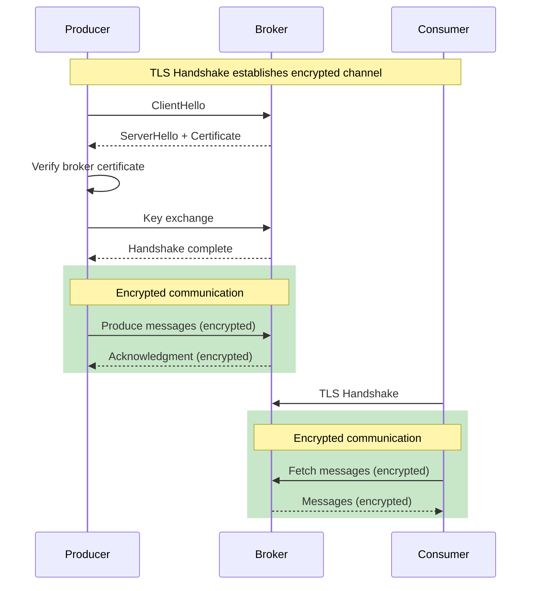
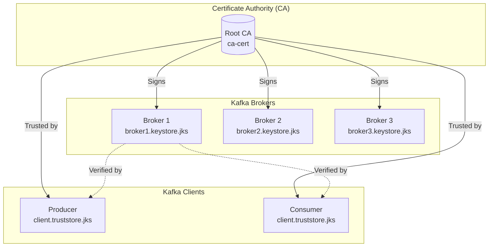
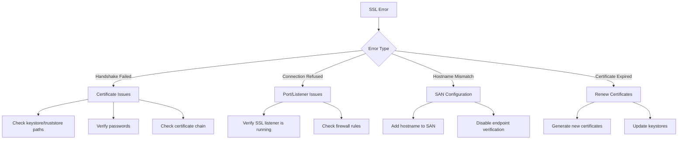
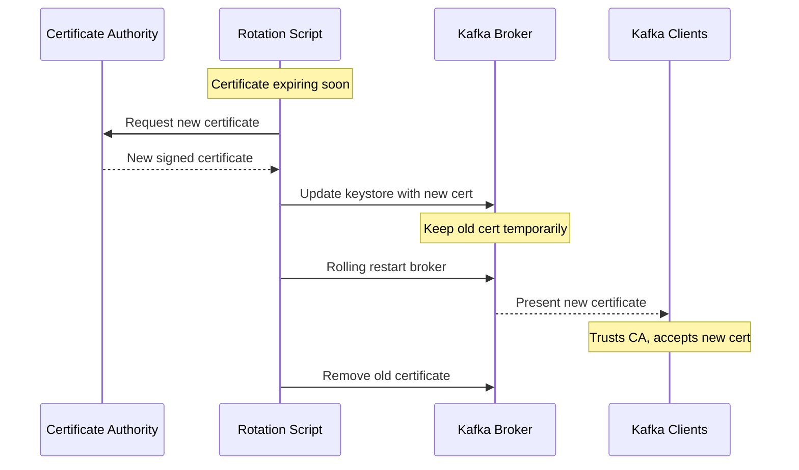

# How to Configure Kafka SSL/TLS Encryption

Author: [nawazdhandala](https://www.github.com/nawazdhandala)

Tags: Kafka, Apache Kafka, SSL, TLS, Security, Encryption, Certificates, DevOps

Description: Learn how to configure SSL/TLS encryption for Apache Kafka to secure data in transit between clients and brokers with step-by-step certificate generation and configuration.

---

## Introduction

Securing Kafka communication with SSL/TLS encryption is essential for protecting sensitive data in transit. Without encryption, messages between producers, consumers, and brokers travel in plaintext, making them vulnerable to interception. This guide provides a complete walkthrough of configuring SSL/TLS encryption for Kafka.

We will cover certificate generation, broker configuration, client setup, and troubleshooting common SSL issues.

## Understanding Kafka SSL Architecture

### Encryption Flow



### Certificate Trust Model



## Step 1: Generate SSL Certificates

### Create Certificate Authority (CA)

First, create a self-signed Certificate Authority that will sign all broker and client certificates.

```bash
#!/bin/bash
# generate-ca.sh
# Creates a Certificate Authority for signing Kafka certificates

# Configuration
CA_DIR="./ssl/ca"
CA_PASSWORD="ca-password"  # Change in production!
VALIDITY_DAYS=3650         # 10 years for CA

# Create directory structure
mkdir -p $CA_DIR

echo "Generating Certificate Authority..."

# Generate CA private key and certificate
openssl req -new -x509 \
    -keyout $CA_DIR/ca-key \
    -out $CA_DIR/ca-cert \
    -days $VALIDITY_DAYS \
    -passout pass:$CA_PASSWORD \
    -subj "/CN=KafkaCA/OU=Kafka/O=MyCompany/L=City/ST=State/C=US"

echo "CA certificate generated: $CA_DIR/ca-cert"
echo "CA private key generated: $CA_DIR/ca-key"

# Display CA certificate details
echo ""
echo "CA Certificate Details:"
openssl x509 -in $CA_DIR/ca-cert -noout -subject -dates
```

### Generate Broker Certificates

Create keystores and certificates for each Kafka broker.

```bash
#!/bin/bash
# generate-broker-certs.sh
# Generates SSL certificates for Kafka brokers

# Configuration
SSL_DIR="./ssl"
CA_DIR="$SSL_DIR/ca"
BROKER_DIR="$SSL_DIR/brokers"
CA_PASSWORD="ca-password"
BROKER_PASSWORD="broker-password"  # Change in production!
VALIDITY_DAYS=365

# Broker hostnames - adjust for your environment
BROKERS=("kafka-1.example.com" "kafka-2.example.com" "kafka-3.example.com")

mkdir -p $BROKER_DIR

for BROKER in "${BROKERS[@]}"; do
    echo "============================================"
    echo "Generating certificates for: $BROKER"
    echo "============================================"

    BROKER_KEYSTORE="$BROKER_DIR/$BROKER.keystore.jks"
    BROKER_TRUSTSTORE="$BROKER_DIR/$BROKER.truststore.jks"

    # Step 1: Create broker keystore with private key
    echo "Creating keystore..."
    keytool -keystore $BROKER_KEYSTORE \
        -alias $BROKER \
        -validity $VALIDITY_DAYS \
        -genkey \
        -keyalg RSA \
        -keysize 2048 \
        -storepass $BROKER_PASSWORD \
        -keypass $BROKER_PASSWORD \
        -dname "CN=$BROKER, OU=Kafka, O=MyCompany, L=City, ST=State, C=US" \
        -ext "SAN=DNS:$BROKER,DNS:localhost"

    # Step 2: Create Certificate Signing Request (CSR)
    echo "Creating CSR..."
    keytool -keystore $BROKER_KEYSTORE \
        -alias $BROKER \
        -certreq \
        -file $BROKER_DIR/$BROKER.csr \
        -storepass $BROKER_PASSWORD \
        -keypass $BROKER_PASSWORD \
        -ext "SAN=DNS:$BROKER,DNS:localhost"

    # Step 3: Sign the CSR with CA
    echo "Signing certificate with CA..."
    openssl x509 -req \
        -CA $CA_DIR/ca-cert \
        -CAkey $CA_DIR/ca-key \
        -in $BROKER_DIR/$BROKER.csr \
        -out $BROKER_DIR/$BROKER-signed.crt \
        -days $VALIDITY_DAYS \
        -CAcreateserial \
        -passin pass:$CA_PASSWORD \
        -extfile <(printf "subjectAltName=DNS:$BROKER,DNS:localhost")

    # Step 4: Import CA certificate into keystore
    echo "Importing CA certificate..."
    keytool -keystore $BROKER_KEYSTORE \
        -alias CARoot \
        -import \
        -file $CA_DIR/ca-cert \
        -storepass $BROKER_PASSWORD \
        -noprompt

    # Step 5: Import signed certificate into keystore
    echo "Importing signed certificate..."
    keytool -keystore $BROKER_KEYSTORE \
        -alias $BROKER \
        -import \
        -file $BROKER_DIR/$BROKER-signed.crt \
        -storepass $BROKER_PASSWORD \
        -noprompt

    # Step 6: Create truststore with CA certificate
    echo "Creating truststore..."
    keytool -keystore $BROKER_TRUSTSTORE \
        -alias CARoot \
        -import \
        -file $CA_DIR/ca-cert \
        -storepass $BROKER_PASSWORD \
        -noprompt

    echo "Broker certificates generated:"
    echo "  Keystore: $BROKER_KEYSTORE"
    echo "  Truststore: $BROKER_TRUSTSTORE"
    echo ""
done

echo "All broker certificates generated successfully!"
```

### Generate Client Certificates

Create certificates for Kafka clients (for mutual TLS authentication).

```bash
#!/bin/bash
# generate-client-certs.sh
# Generates SSL certificates for Kafka clients

SSL_DIR="./ssl"
CA_DIR="$SSL_DIR/ca"
CLIENT_DIR="$SSL_DIR/clients"
CA_PASSWORD="ca-password"
CLIENT_PASSWORD="client-password"  # Change in production!
VALIDITY_DAYS=365

# Client names
CLIENTS=("producer-app" "consumer-app" "admin-client")

mkdir -p $CLIENT_DIR

for CLIENT in "${CLIENTS[@]}"; do
    echo "============================================"
    echo "Generating certificates for client: $CLIENT"
    echo "============================================"

    CLIENT_KEYSTORE="$CLIENT_DIR/$CLIENT.keystore.jks"
    CLIENT_TRUSTSTORE="$CLIENT_DIR/$CLIENT.truststore.jks"

    # Create keystore with private key
    keytool -keystore $CLIENT_KEYSTORE \
        -alias $CLIENT \
        -validity $VALIDITY_DAYS \
        -genkey \
        -keyalg RSA \
        -keysize 2048 \
        -storepass $CLIENT_PASSWORD \
        -keypass $CLIENT_PASSWORD \
        -dname "CN=$CLIENT, OU=Clients, O=MyCompany, L=City, ST=State, C=US"

    # Create CSR
    keytool -keystore $CLIENT_KEYSTORE \
        -alias $CLIENT \
        -certreq \
        -file $CLIENT_DIR/$CLIENT.csr \
        -storepass $CLIENT_PASSWORD \
        -keypass $CLIENT_PASSWORD

    # Sign with CA
    openssl x509 -req \
        -CA $CA_DIR/ca-cert \
        -CAkey $CA_DIR/ca-key \
        -in $CLIENT_DIR/$CLIENT.csr \
        -out $CLIENT_DIR/$CLIENT-signed.crt \
        -days $VALIDITY_DAYS \
        -CAcreateserial \
        -passin pass:$CA_PASSWORD

    # Import CA certificate
    keytool -keystore $CLIENT_KEYSTORE \
        -alias CARoot \
        -import \
        -file $CA_DIR/ca-cert \
        -storepass $CLIENT_PASSWORD \
        -noprompt

    # Import signed certificate
    keytool -keystore $CLIENT_KEYSTORE \
        -alias $CLIENT \
        -import \
        -file $CLIENT_DIR/$CLIENT-signed.crt \
        -storepass $CLIENT_PASSWORD \
        -noprompt

    # Create truststore
    keytool -keystore $CLIENT_TRUSTSTORE \
        -alias CARoot \
        -import \
        -file $CA_DIR/ca-cert \
        -storepass $CLIENT_PASSWORD \
        -noprompt

    echo "Client certificates generated:"
    echo "  Keystore: $CLIENT_KEYSTORE"
    echo "  Truststore: $CLIENT_TRUSTSTORE"
    echo ""
done

echo "All client certificates generated successfully!"
```

## Step 2: Configure Kafka Brokers

### Basic SSL Configuration

Add the following to each broker's `server.properties`:

```properties
# server.properties - SSL Configuration

# Listener configuration
# PLAINTEXT for internal, SSL for external
listeners=PLAINTEXT://0.0.0.0:9092,SSL://0.0.0.0:9093
advertised.listeners=PLAINTEXT://kafka-1.internal:9092,SSL://kafka-1.example.com:9093

# Security protocol mapping
listener.security.protocol.map=PLAINTEXT:PLAINTEXT,SSL:SSL

# Inter-broker communication protocol
# Use SSL for encrypted inter-broker traffic
security.inter.broker.protocol=SSL
inter.broker.listener.name=SSL

# SSL keystore configuration
# Path to the broker's keystore containing its private key and certificate
ssl.keystore.location=/etc/kafka/ssl/kafka-1.example.com.keystore.jks
ssl.keystore.password=broker-password
ssl.key.password=broker-password

# SSL truststore configuration
# Contains CA certificate to verify other brokers and clients
ssl.truststore.location=/etc/kafka/ssl/kafka-1.example.com.truststore.jks
ssl.truststore.password=broker-password

# Client authentication
# Set to 'required' for mutual TLS (mTLS)
# Set to 'requested' to make client certs optional
# Set to 'none' for server-only authentication
ssl.client.auth=required

# SSL protocol and cipher configuration
ssl.enabled.protocols=TLSv1.2,TLSv1.3
ssl.protocol=TLSv1.3

# Recommended cipher suites for TLS 1.2
ssl.cipher.suites=TLS_ECDHE_RSA_WITH_AES_256_GCM_SHA384,TLS_ECDHE_RSA_WITH_AES_128_GCM_SHA256

# Endpoint identification
# Enables hostname verification
ssl.endpoint.identification.algorithm=https
```

### SSL-Only Configuration

For environments requiring all traffic to be encrypted:

```properties
# server.properties - SSL Only

# Only SSL listener
listeners=SSL://0.0.0.0:9093
advertised.listeners=SSL://kafka-1.example.com:9093

# All communication uses SSL
listener.security.protocol.map=SSL:SSL
security.inter.broker.protocol=SSL

# SSL configuration (same as above)
ssl.keystore.location=/etc/kafka/ssl/kafka-1.example.com.keystore.jks
ssl.keystore.password=broker-password
ssl.key.password=broker-password
ssl.truststore.location=/etc/kafka/ssl/kafka-1.example.com.truststore.jks
ssl.truststore.password=broker-password

# Require client certificates
ssl.client.auth=required

# Modern TLS only
ssl.enabled.protocols=TLSv1.3
ssl.protocol=TLSv1.3
```

## Step 3: Configure Kafka Clients

### Java Producer Configuration

```java
import org.apache.kafka.clients.producer.*;
import org.apache.kafka.common.serialization.StringSerializer;

import java.util.Properties;

public class SSLProducer {

    public static KafkaProducer<String, String> createSSLProducer(String bootstrapServers) {
        Properties props = new Properties();

        // Basic configuration
        props.put(ProducerConfig.BOOTSTRAP_SERVERS_CONFIG, bootstrapServers);
        props.put(ProducerConfig.KEY_SERIALIZER_CLASS_CONFIG, StringSerializer.class.getName());
        props.put(ProducerConfig.VALUE_SERIALIZER_CLASS_CONFIG, StringSerializer.class.getName());

        // Security protocol - use SSL
        props.put("security.protocol", "SSL");

        // Truststore configuration
        // Contains the CA certificate to verify the broker
        props.put("ssl.truststore.location", "/path/to/client.truststore.jks");
        props.put("ssl.truststore.password", "client-password");

        // Keystore configuration (required for mutual TLS)
        // Contains the client's private key and certificate
        props.put("ssl.keystore.location", "/path/to/client.keystore.jks");
        props.put("ssl.keystore.password", "client-password");
        props.put("ssl.key.password", "client-password");

        // Enable hostname verification
        props.put("ssl.endpoint.identification.algorithm", "https");

        // TLS protocol version
        props.put("ssl.enabled.protocols", "TLSv1.2,TLSv1.3");

        return new KafkaProducer<>(props);
    }

    public static void main(String[] args) {
        // Connect to SSL listener
        KafkaProducer<String, String> producer = createSSLProducer("kafka-1.example.com:9093");

        try {
            ProducerRecord<String, String> record = new ProducerRecord<>(
                "secure-topic",
                "key-1",
                "encrypted message"
            );

            RecordMetadata metadata = producer.send(record).get();
            System.out.printf("Sent message to partition %d offset %d%n",
                metadata.partition(), metadata.offset());

        } catch (Exception e) {
            System.err.println("Failed to send: " + e.getMessage());
            e.printStackTrace();
        } finally {
            producer.close();
        }
    }
}
```

### Java Consumer Configuration

```java
import org.apache.kafka.clients.consumer.*;
import org.apache.kafka.common.serialization.StringDeserializer;

import java.time.Duration;
import java.util.Collections;
import java.util.Properties;

public class SSLConsumer {

    public static KafkaConsumer<String, String> createSSLConsumer(String bootstrapServers, String groupId) {
        Properties props = new Properties();

        // Basic configuration
        props.put(ConsumerConfig.BOOTSTRAP_SERVERS_CONFIG, bootstrapServers);
        props.put(ConsumerConfig.GROUP_ID_CONFIG, groupId);
        props.put(ConsumerConfig.KEY_DESERIALIZER_CLASS_CONFIG, StringDeserializer.class.getName());
        props.put(ConsumerConfig.VALUE_DESERIALIZER_CLASS_CONFIG, StringDeserializer.class.getName());
        props.put(ConsumerConfig.AUTO_OFFSET_RESET_CONFIG, "earliest");

        // SSL configuration
        props.put("security.protocol", "SSL");

        // Truststore - CA certificate for verifying broker
        props.put("ssl.truststore.location", "/path/to/client.truststore.jks");
        props.put("ssl.truststore.password", "client-password");

        // Keystore - client certificate for mutual TLS
        props.put("ssl.keystore.location", "/path/to/client.keystore.jks");
        props.put("ssl.keystore.password", "client-password");
        props.put("ssl.key.password", "client-password");

        // Hostname verification
        props.put("ssl.endpoint.identification.algorithm", "https");

        return new KafkaConsumer<>(props);
    }

    public static void main(String[] args) {
        KafkaConsumer<String, String> consumer = createSSLConsumer(
            "kafka-1.example.com:9093",
            "ssl-consumer-group"
        );

        consumer.subscribe(Collections.singletonList("secure-topic"));

        try {
            while (true) {
                ConsumerRecords<String, String> records = consumer.poll(Duration.ofMillis(100));

                for (ConsumerRecord<String, String> record : records) {
                    System.out.printf("Received: key=%s, value=%s, partition=%d, offset=%d%n",
                        record.key(), record.value(), record.partition(), record.offset());
                }
            }
        } finally {
            consumer.close();
        }
    }
}
```

### Python Client Configuration

```python
from confluent_kafka import Producer, Consumer
from confluent_kafka.admin import AdminClient

def create_ssl_producer(bootstrap_servers: str) -> Producer:
    """
    Creates a Kafka producer with SSL encryption enabled.

    Args:
        bootstrap_servers: Kafka broker addresses

    Returns:
        Configured SSL producer
    """
    config = {
        'bootstrap.servers': bootstrap_servers,

        # Security protocol
        'security.protocol': 'SSL',

        # Truststore (CA certificate in PEM format for Python)
        'ssl.ca.location': '/path/to/ca-cert.pem',

        # Client certificate and key (for mutual TLS)
        'ssl.certificate.location': '/path/to/client-cert.pem',
        'ssl.key.location': '/path/to/client-key.pem',
        'ssl.key.password': 'client-password',

        # Enable hostname verification
        'ssl.endpoint.identification.algorithm': 'https',
    }

    return Producer(config)


def create_ssl_consumer(bootstrap_servers: str, group_id: str) -> Consumer:
    """
    Creates a Kafka consumer with SSL encryption enabled.

    Args:
        bootstrap_servers: Kafka broker addresses
        group_id: Consumer group ID

    Returns:
        Configured SSL consumer
    """
    config = {
        'bootstrap.servers': bootstrap_servers,
        'group.id': group_id,
        'auto.offset.reset': 'earliest',

        # SSL configuration
        'security.protocol': 'SSL',
        'ssl.ca.location': '/path/to/ca-cert.pem',
        'ssl.certificate.location': '/path/to/client-cert.pem',
        'ssl.key.location': '/path/to/client-key.pem',
        'ssl.key.password': 'client-password',
        'ssl.endpoint.identification.algorithm': 'https',
    }

    return Consumer(config)


# Convert JKS to PEM format for Python clients
def convert_jks_to_pem():
    """
    Commands to convert Java keystore to PEM format for Python.
    Run these in terminal:
    """
    commands = """
    # Extract CA certificate
    keytool -exportcert -alias CARoot -keystore truststore.jks \\
        -rfc -file ca-cert.pem -storepass password

    # Export client certificate and key from keystore
    # First convert to PKCS12
    keytool -importkeystore -srckeystore client.keystore.jks \\
        -destkeystore client.p12 -deststoretype PKCS12 \\
        -srcstorepass password -deststorepass password

    # Extract certificate
    openssl pkcs12 -in client.p12 -nokeys -out client-cert.pem \\
        -passin pass:password

    # Extract private key
    openssl pkcs12 -in client.p12 -nocerts -out client-key.pem \\
        -passin pass:password -passout pass:password
    """
    print(commands)


if __name__ == "__main__":
    # Producer example
    producer = create_ssl_producer("kafka-1.example.com:9093")

    def delivery_callback(err, msg):
        if err:
            print(f"Delivery failed: {err}")
        else:
            print(f"Delivered to {msg.topic()} [{msg.partition()}] @ {msg.offset()}")

    producer.produce(
        topic="secure-topic",
        key="key-1",
        value="encrypted message from Python",
        callback=delivery_callback
    )
    producer.flush()

    # Consumer example
    consumer = create_ssl_consumer("kafka-1.example.com:9093", "python-ssl-group")
    consumer.subscribe(["secure-topic"])

    try:
        while True:
            msg = consumer.poll(1.0)
            if msg is None:
                continue
            if msg.error():
                print(f"Consumer error: {msg.error()}")
                continue
            print(f"Received: {msg.key()} = {msg.value()}")
    finally:
        consumer.close()
```

### Configuration File Approach

Use a properties file for cleaner configuration:

```properties
# ssl-client.properties

# Bootstrap servers (SSL port)
bootstrap.servers=kafka-1.example.com:9093,kafka-2.example.com:9093,kafka-3.example.com:9093

# Security protocol
security.protocol=SSL

# SSL truststore (CA certificate)
ssl.truststore.location=/etc/kafka/ssl/client.truststore.jks
ssl.truststore.password=client-password

# SSL keystore (client certificate for mTLS)
ssl.keystore.location=/etc/kafka/ssl/client.keystore.jks
ssl.keystore.password=client-password
ssl.key.password=client-password

# Hostname verification
ssl.endpoint.identification.algorithm=https

# TLS versions
ssl.enabled.protocols=TLSv1.2,TLSv1.3
```

Use with command-line tools:

```bash
# List topics using SSL
kafka-topics.sh --bootstrap-server kafka-1.example.com:9093 \
    --command-config /etc/kafka/ssl-client.properties \
    --list

# Produce messages using SSL
kafka-console-producer.sh --bootstrap-server kafka-1.example.com:9093 \
    --topic secure-topic \
    --producer.config /etc/kafka/ssl-client.properties

# Consume messages using SSL
kafka-console-consumer.sh --bootstrap-server kafka-1.example.com:9093 \
    --topic secure-topic \
    --consumer.config /etc/kafka/ssl-client.properties \
    --from-beginning
```

## Step 4: Configure Zookeeper SSL (If Using Zookeeper)

For complete security, also encrypt Zookeeper communication:

```properties
# zookeeper.properties

# Server configuration
dataDir=/var/zookeeper
clientPort=2181
secureClientPort=2182

# SSL configuration
serverCnxnFactory=org.apache.zookeeper.server.NettyServerCnxnFactory
ssl.keyStore.location=/etc/zookeeper/ssl/zookeeper.keystore.jks
ssl.keyStore.password=zk-password
ssl.trustStore.location=/etc/zookeeper/ssl/zookeeper.truststore.jks
ssl.trustStore.password=zk-password

# Require client certs
ssl.clientAuth=need
```

Broker configuration for secure Zookeeper:

```properties
# server.properties - Zookeeper SSL

zookeeper.connect=zk1:2182,zk2:2182,zk3:2182
zookeeper.ssl.client.enable=true
zookeeper.clientCnxnSocket=org.apache.zookeeper.ClientCnxnSocketNetty
zookeeper.ssl.keystore.location=/etc/kafka/ssl/kafka.keystore.jks
zookeeper.ssl.keystore.password=broker-password
zookeeper.ssl.truststore.location=/etc/kafka/ssl/kafka.truststore.jks
zookeeper.ssl.truststore.password=broker-password
```

## Troubleshooting SSL Issues

### Common SSL Errors



### Debugging SSL Connections

```bash
#!/bin/bash
# debug-ssl.sh
# Debug SSL connection to Kafka broker

BROKER_HOST="${1:-kafka-1.example.com}"
BROKER_PORT="${2:-9093}"

echo "=== SSL Connection Debug for $BROKER_HOST:$BROKER_PORT ==="
echo ""

# Test basic SSL connection
echo "1. Testing SSL handshake..."
openssl s_client -connect $BROKER_HOST:$BROKER_PORT -servername $BROKER_HOST < /dev/null 2>&1 | \
    grep -E "Verify return code|subject|issuer|notBefore|notAfter"

echo ""
echo "2. Certificate chain..."
openssl s_client -connect $BROKER_HOST:$BROKER_PORT -showcerts < /dev/null 2>&1 | \
    grep -E "s:|i:" | head -10

echo ""
echo "3. Supported protocols and ciphers..."
openssl s_client -connect $BROKER_HOST:$BROKER_PORT -tls1_2 < /dev/null 2>&1 | \
    grep "Protocol\|Cipher"

echo ""
echo "4. Certificate expiry..."
echo | openssl s_client -connect $BROKER_HOST:$BROKER_PORT 2>/dev/null | \
    openssl x509 -noout -dates

echo ""
echo "5. Subject Alternative Names..."
echo | openssl s_client -connect $BROKER_HOST:$BROKER_PORT 2>/dev/null | \
    openssl x509 -noout -ext subjectAltName
```

### Verify Keystore Contents

```bash
# List keystore contents
keytool -list -v -keystore broker.keystore.jks -storepass password

# Verify certificate chain
keytool -list -v -keystore broker.keystore.jks -storepass password | \
    grep -A 2 "Certificate chain"

# Check certificate expiration
keytool -list -v -keystore broker.keystore.jks -storepass password | \
    grep -E "Alias|Valid from"

# Export and verify certificate
keytool -exportcert -alias broker -keystore broker.keystore.jks \
    -storepass password -rfc | \
    openssl x509 -text -noout
```

### Enable SSL Debug Logging

```bash
# Add to KAFKA_OPTS for broker
export KAFKA_OPTS="-Djavax.net.debug=ssl,handshake"

# Or for specific debugging
export KAFKA_OPTS="-Djavax.net.debug=ssl:handshake:verbose"

# Start broker with debugging
kafka-server-start.sh /etc/kafka/server.properties
```

For client applications:

```java
// Add before creating Kafka client
System.setProperty("javax.net.debug", "ssl,handshake");
```

### Common Issues and Solutions

| Issue | Symptom | Solution |
|-------|---------|----------|
| Wrong password | "Keystore was tampered with" | Verify keystore password |
| Missing CA in truststore | "Unable to find valid certification path" | Import CA cert to truststore |
| Hostname mismatch | "No subject alternative names present" | Add SAN or disable verification |
| Certificate expired | "NotAfter" date passed | Generate new certificate |
| Wrong protocol | "No appropriate protocol" | Enable TLSv1.2 or TLSv1.3 |
| Self-signed cert | "Self signed certificate" | Import CA to truststore |

## Certificate Rotation

### Automated Certificate Rotation Process



### Certificate Rotation Script

```bash
#!/bin/bash
# rotate-broker-cert.sh
# Rotates SSL certificates for Kafka broker without downtime

BROKER_HOST=$1
SSL_DIR="/etc/kafka/ssl"
CA_DIR="/opt/kafka/ca"
CA_PASSWORD="ca-password"
BROKER_PASSWORD="broker-password"
VALIDITY_DAYS=365

if [ -z "$BROKER_HOST" ]; then
    echo "Usage: $0 <broker-hostname>"
    exit 1
fi

echo "Rotating certificate for $BROKER_HOST..."

# Backup current keystore
BACKUP_DIR="$SSL_DIR/backup/$(date +%Y%m%d)"
mkdir -p $BACKUP_DIR
cp $SSL_DIR/$BROKER_HOST.keystore.jks $BACKUP_DIR/

# Generate new key pair with unique alias (timestamp-based)
NEW_ALIAS="${BROKER_HOST}-$(date +%s)"

echo "Generating new key pair..."
keytool -keystore $SSL_DIR/$BROKER_HOST.keystore.jks \
    -alias $NEW_ALIAS \
    -validity $VALIDITY_DAYS \
    -genkey \
    -keyalg RSA \
    -keysize 2048 \
    -storepass $BROKER_PASSWORD \
    -keypass $BROKER_PASSWORD \
    -dname "CN=$BROKER_HOST, OU=Kafka, O=MyCompany, L=City, ST=State, C=US" \
    -ext "SAN=DNS:$BROKER_HOST,DNS:localhost"

# Create CSR
echo "Creating CSR..."
keytool -keystore $SSL_DIR/$BROKER_HOST.keystore.jks \
    -alias $NEW_ALIAS \
    -certreq \
    -file /tmp/$BROKER_HOST.csr \
    -storepass $BROKER_PASSWORD \
    -keypass $BROKER_PASSWORD

# Sign with CA
echo "Signing with CA..."
openssl x509 -req \
    -CA $CA_DIR/ca-cert \
    -CAkey $CA_DIR/ca-key \
    -in /tmp/$BROKER_HOST.csr \
    -out /tmp/$BROKER_HOST-signed.crt \
    -days $VALIDITY_DAYS \
    -CAcreateserial \
    -passin pass:$CA_PASSWORD \
    -extfile <(printf "subjectAltName=DNS:$BROKER_HOST,DNS:localhost")

# Import signed certificate
echo "Importing signed certificate..."
keytool -keystore $SSL_DIR/$BROKER_HOST.keystore.jks \
    -alias $NEW_ALIAS \
    -import \
    -file /tmp/$BROKER_HOST-signed.crt \
    -storepass $BROKER_PASSWORD \
    -noprompt

# Update broker configuration to use new alias
echo "Updating broker configuration..."
# Note: You may need to update server.properties if using specific alias
# ssl.keystore.alias=$NEW_ALIAS

# Cleanup
rm -f /tmp/$BROKER_HOST.csr /tmp/$BROKER_HOST-signed.crt

echo "Certificate rotation complete!"
echo "New certificate alias: $NEW_ALIAS"
echo ""
echo "Next steps:"
echo "1. Perform rolling restart of the broker"
echo "2. Verify SSL connectivity"
echo "3. Remove old certificate alias after verification"
```

## Best Practices

### Security Recommendations

1. **Use TLS 1.3** when possible for better security and performance
2. **Enable mutual TLS (mTLS)** for client authentication in production
3. **Rotate certificates** before expiration (automate this process)
4. **Store passwords securely** using secrets management (HashiCorp Vault, AWS Secrets Manager)
5. **Enable hostname verification** to prevent man-in-the-middle attacks
6. **Use strong cipher suites** and disable weak ones

### Configuration Summary

```properties
# Production-ready SSL configuration

# TLS 1.3 only (most secure)
ssl.enabled.protocols=TLSv1.3
ssl.protocol=TLSv1.3

# Strong cipher suites
ssl.cipher.suites=TLS_AES_256_GCM_SHA384,TLS_AES_128_GCM_SHA256

# Require client certificates (mTLS)
ssl.client.auth=required

# Enable hostname verification
ssl.endpoint.identification.algorithm=https

# Secure key algorithm
ssl.keymanager.algorithm=PKIX
ssl.trustmanager.algorithm=PKIX
```

## Conclusion

Configuring SSL/TLS encryption for Kafka requires careful certificate management but provides essential security for production deployments. Key takeaways:

1. **Generate proper certificates** with correct SANs for all hostnames
2. **Configure both brokers and clients** with matching security settings
3. **Test thoroughly** before production deployment
4. **Monitor certificate expiration** and automate rotation
5. **Use mTLS** for client authentication in secure environments

With properly configured SSL/TLS, your Kafka cluster will have encrypted communication that protects sensitive data in transit between all components.
