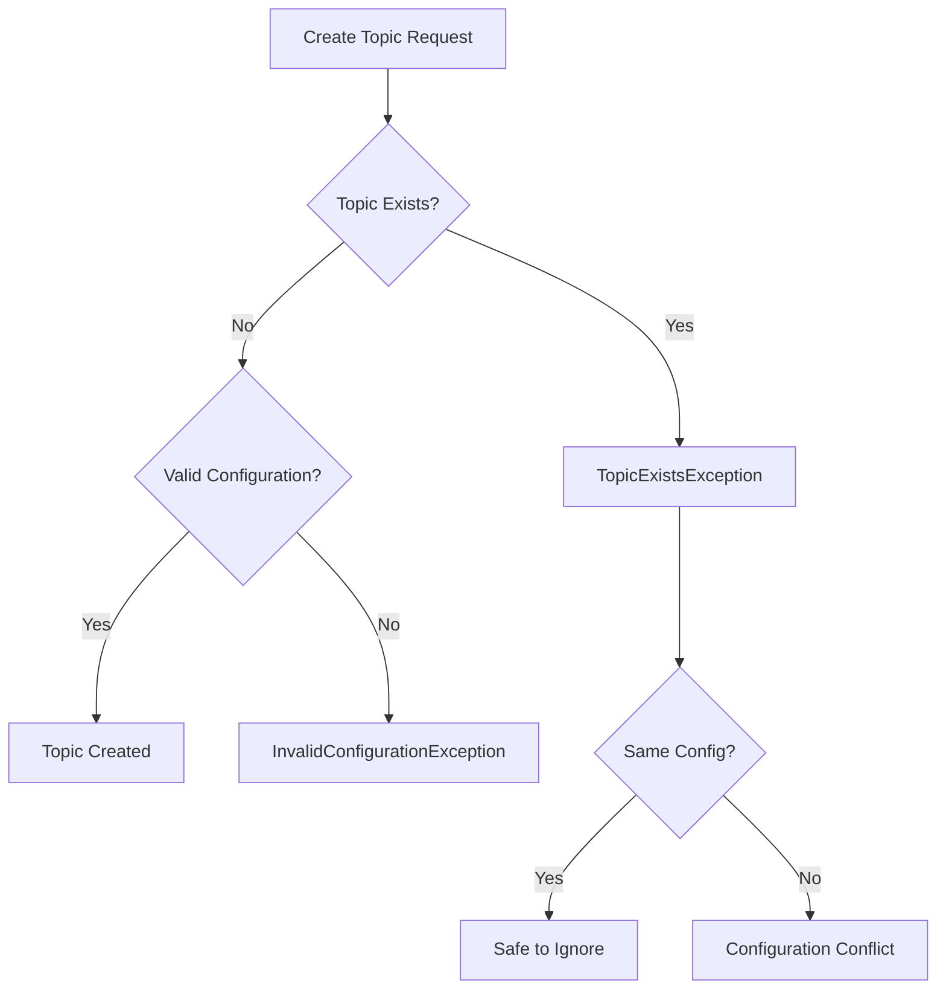
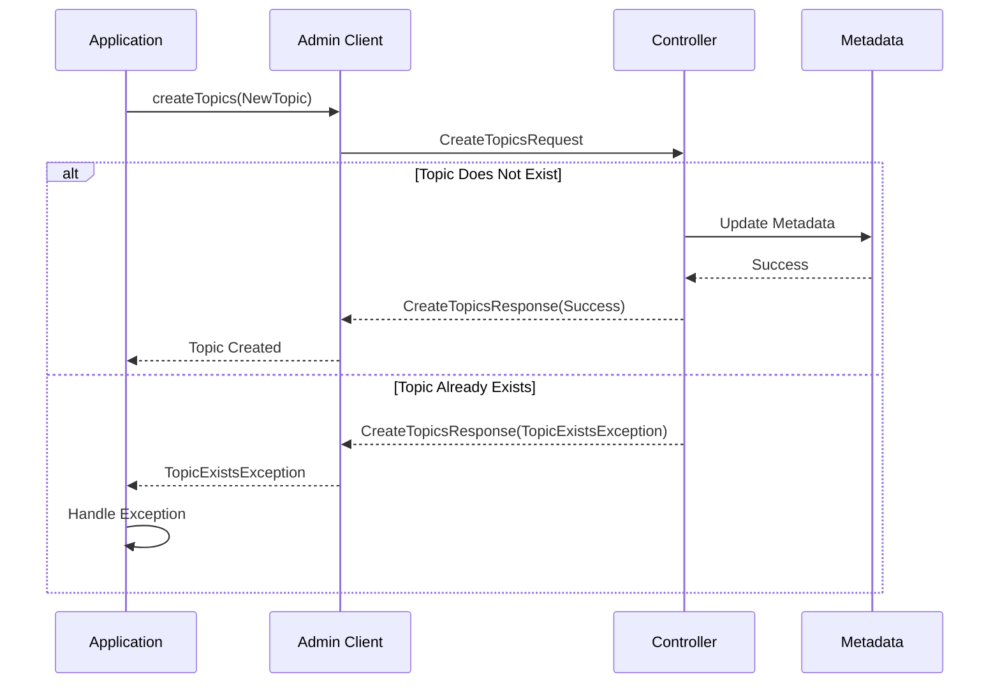
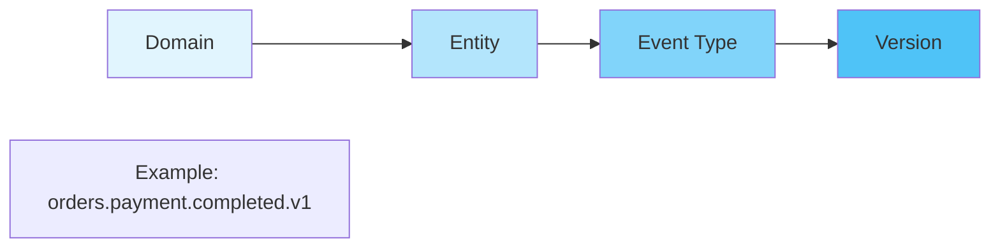

# How to Fix 'TopicExistsException' in Kafka

Author: [nawazdhandala](https://www.github.com/nawazdhandala)

Tags: Apache Kafka, TopicExistsException, Topic Management, Error Handling, Troubleshooting, Admin Client

Description: Learn how to diagnose and fix Kafka TopicExistsException errors when creating topics, including idempotent topic creation patterns and best practices.

---

The `TopicExistsException` occurs when you attempt to create a Kafka topic that already exists. While this seems straightforward, handling it properly requires understanding topic creation semantics and implementing idempotent creation patterns. This guide covers diagnosis, solutions, and best practices.

## Understanding the Error

```
org.apache.kafka.common.errors.TopicExistsException:
Topic 'my-topic' already exists.
```

### When This Error Occurs



### Common Causes

1. **Duplicate creation requests**: Multiple services trying to create the same topic
2. **Race conditions**: Concurrent topic creation during application startup
3. **Auto-creation conflicts**: Topic auto-created by producer before explicit creation
4. **Script re-execution**: Running provisioning scripts multiple times
5. **Misconfigured CI/CD**: Deployment pipelines creating topics on every run

## Diagnosing the Problem

### Check If Topic Exists

```bash
# List all topics
kafka-topics.sh --list --bootstrap-server localhost:9092

# Describe specific topic to see its configuration
kafka-topics.sh --describe --topic my-topic --bootstrap-server localhost:9092

# Output shows partitions, replication, and configuration
Topic: my-topic	PartitionCount: 6	ReplicationFactor: 3	Configs: retention.ms=604800000
	Partition: 0	Leader: 1	Replicas: 1,2,3	Isr: 1,2,3
	Partition: 1	Leader: 2	Replicas: 2,3,1	Isr: 2,3,1
```

### Compare Configurations

```bash
# Get detailed topic configuration
kafka-configs.sh --describe --topic my-topic \
  --bootstrap-server localhost:9092 --all

# Check for configuration differences between intended and actual
kafka-configs.sh --describe --topic my-topic \
  --bootstrap-server localhost:9092 | grep -v "Default"
```

## Java Solutions

### Idempotent Topic Creation

```java
import org.apache.kafka.clients.admin.*;
import org.apache.kafka.common.errors.TopicExistsException;
import org.apache.kafka.common.config.TopicConfig;

import java.util.*;
import java.util.concurrent.ExecutionException;

public class IdempotentTopicCreator {

    private final AdminClient adminClient;

    public IdempotentTopicCreator(String bootstrapServers) {
        Properties props = new Properties();
        props.put(AdminClientConfig.BOOTSTRAP_SERVERS_CONFIG, bootstrapServers);
        props.put(AdminClientConfig.REQUEST_TIMEOUT_MS_CONFIG, 30000);
        this.adminClient = AdminClient.create(props);
    }

    /**
     * Creates a topic if it does not exist.
     * Returns true if topic was created, false if it already existed.
     */
    public boolean createTopicIfNotExists(String topicName, int partitions,
                                          short replicationFactor,
                                          Map<String, String> configs) {
        // First check if topic exists
        if (topicExists(topicName)) {
            System.out.println("Topic already exists: " + topicName);
            validateExistingTopicConfig(topicName, partitions, configs);
            return false;
        }

        // Create the topic
        NewTopic newTopic = new NewTopic(topicName, partitions, replicationFactor);
        if (configs != null && !configs.isEmpty()) {
            newTopic.configs(configs);
        }

        try {
            CreateTopicsResult result = adminClient.createTopics(
                Collections.singletonList(newTopic)
            );
            // Wait for creation to complete
            result.all().get();
            System.out.println("Created topic: " + topicName);
            return true;

        } catch (ExecutionException e) {
            if (e.getCause() instanceof TopicExistsException) {
                // Race condition - topic was created between check and create
                System.out.println("Topic created by another process: " + topicName);
                return false;
            }
            throw new RuntimeException("Failed to create topic: " + topicName, e);
        } catch (InterruptedException e) {
            Thread.currentThread().interrupt();
            throw new RuntimeException("Interrupted while creating topic", e);
        }
    }

    /**
     * Checks if a topic exists in the cluster.
     */
    public boolean topicExists(String topicName) {
        try {
            ListTopicsResult listResult = adminClient.listTopics();
            Set<String> topics = listResult.names().get();
            return topics.contains(topicName);
        } catch (ExecutionException | InterruptedException e) {
            throw new RuntimeException("Failed to list topics", e);
        }
    }

    /**
     * Validates that existing topic matches expected configuration.
     * Logs warnings if there are mismatches.
     */
    private void validateExistingTopicConfig(String topicName, int expectedPartitions,
                                             Map<String, String> expectedConfigs) {
        try {
            DescribeTopicsResult describeResult = adminClient.describeTopics(
                Collections.singletonList(topicName)
            );
            TopicDescription description = describeResult.topicNameValues()
                .get(topicName).get();

            int actualPartitions = description.partitions().size();
            if (actualPartitions != expectedPartitions) {
                System.out.printf("WARNING: Topic %s has %d partitions, expected %d%n",
                    topicName, actualPartitions, expectedPartitions);
            }

            // Check configs
            if (expectedConfigs != null && !expectedConfigs.isEmpty()) {
                ConfigResource resource = new ConfigResource(
                    ConfigResource.Type.TOPIC, topicName);
                DescribeConfigsResult configResult = adminClient.describeConfigs(
                    Collections.singletonList(resource));
                Config config = configResult.all().get().get(resource);

                for (Map.Entry<String, String> expected : expectedConfigs.entrySet()) {
                    ConfigEntry actual = config.get(expected.getKey());
                    if (actual != null && !actual.value().equals(expected.getValue())) {
                        System.out.printf("WARNING: Config %s=%s, expected %s%n",
                            expected.getKey(), actual.value(), expected.getValue());
                    }
                }
            }
        } catch (Exception e) {
            System.err.println("Failed to validate topic config: " + e.getMessage());
        }
    }

    public void close() {
        adminClient.close();
    }

    // Example usage
    public static void main(String[] args) {
        IdempotentTopicCreator creator = new IdempotentTopicCreator("localhost:9092");

        Map<String, String> configs = new HashMap<>();
        configs.put(TopicConfig.RETENTION_MS_CONFIG, "604800000"); // 7 days
        configs.put(TopicConfig.CLEANUP_POLICY_CONFIG, "delete");

        boolean created = creator.createTopicIfNotExists(
            "my-events",
            6,                // partitions
            (short) 3,        // replication factor
            configs
        );

        System.out.println("Topic was created: " + created);
        creator.close();
    }
}
```

### Batch Topic Creation with Error Handling

```java
import org.apache.kafka.clients.admin.*;
import org.apache.kafka.common.KafkaFuture;
import org.apache.kafka.common.errors.TopicExistsException;

import java.util.*;
import java.util.concurrent.ExecutionException;

public class BatchTopicCreator {

    private final AdminClient adminClient;

    public BatchTopicCreator(String bootstrapServers) {
        Properties props = new Properties();
        props.put(AdminClientConfig.BOOTSTRAP_SERVERS_CONFIG, bootstrapServers);
        this.adminClient = AdminClient.create(props);
    }

    /**
     * Creates multiple topics, handling TopicExistsException for each individually.
     * Returns a map of topic names to their creation status.
     */
    public Map<String, TopicCreationResult> createTopics(List<NewTopic> topics) {
        Map<String, TopicCreationResult> results = new HashMap<>();

        CreateTopicsResult createResult = adminClient.createTopics(topics);
        Map<String, KafkaFuture<Void>> futures = createResult.values();

        for (Map.Entry<String, KafkaFuture<Void>> entry : futures.entrySet()) {
            String topicName = entry.getKey();
            try {
                entry.getValue().get();
                results.put(topicName, TopicCreationResult.CREATED);
                System.out.println("Created: " + topicName);

            } catch (ExecutionException e) {
                if (e.getCause() instanceof TopicExistsException) {
                    results.put(topicName, TopicCreationResult.ALREADY_EXISTS);
                    System.out.println("Already exists: " + topicName);
                } else {
                    results.put(topicName, TopicCreationResult.FAILED);
                    System.err.println("Failed: " + topicName + " - " + e.getMessage());
                }
            } catch (InterruptedException e) {
                Thread.currentThread().interrupt();
                results.put(topicName, TopicCreationResult.FAILED);
            }
        }

        return results;
    }

    public enum TopicCreationResult {
        CREATED,
        ALREADY_EXISTS,
        FAILED
    }

    public void close() {
        adminClient.close();
    }

    // Example usage
    public static void main(String[] args) {
        BatchTopicCreator creator = new BatchTopicCreator("localhost:9092");

        List<NewTopic> topics = Arrays.asList(
            new NewTopic("orders", 6, (short) 3),
            new NewTopic("payments", 6, (short) 3),
            new NewTopic("notifications", 3, (short) 3)
        );

        Map<String, TopicCreationResult> results = creator.createTopics(topics);

        // Check results
        long created = results.values().stream()
            .filter(r -> r == TopicCreationResult.CREATED)
            .count();
        long existing = results.values().stream()
            .filter(r -> r == TopicCreationResult.ALREADY_EXISTS)
            .count();

        System.out.printf("Created: %d, Already existed: %d%n", created, existing);
        creator.close();
    }
}
```

## Python Solutions

```python
from confluent_kafka.admin import AdminClient, NewTopic
from confluent_kafka import KafkaException
import time
from typing import Dict, List, Optional
from dataclasses import dataclass
from enum import Enum


class TopicCreationStatus(Enum):
    CREATED = "created"
    ALREADY_EXISTS = "already_exists"
    FAILED = "failed"


@dataclass
class TopicConfig:
    """Configuration for a Kafka topic"""
    name: str
    partitions: int = 6
    replication_factor: int = 3
    config: Optional[Dict[str, str]] = None


class IdempotentTopicCreator:
    """Creates Kafka topics idempotently, handling TopicExistsException"""

    def __init__(self, bootstrap_servers: str):
        self.admin = AdminClient({
            'bootstrap.servers': bootstrap_servers,
            'socket.timeout.ms': 30000
        })

    def topic_exists(self, topic_name: str) -> bool:
        """Check if a topic already exists"""
        metadata = self.admin.list_topics(timeout=10)
        return topic_name in metadata.topics

    def get_topic_config(self, topic_name: str) -> Dict:
        """Get current configuration of an existing topic"""
        metadata = self.admin.list_topics(timeout=10)
        if topic_name not in metadata.topics:
            return {}

        topic_metadata = metadata.topics[topic_name]
        return {
            'partitions': len(topic_metadata.partitions),
            'error': topic_metadata.error
        }

    def create_topic_if_not_exists(self, topic_config: TopicConfig) -> TopicCreationStatus:
        """
        Creates a topic if it does not exist.
        Returns the creation status.
        """
        # Check if topic already exists
        if self.topic_exists(topic_config.name):
            print(f"Topic already exists: {topic_config.name}")
            self._validate_existing_topic(topic_config)
            return TopicCreationStatus.ALREADY_EXISTS

        # Create the topic
        new_topic = NewTopic(
            topic_config.name,
            num_partitions=topic_config.partitions,
            replication_factor=topic_config.replication_factor,
            config=topic_config.config or {}
        )

        try:
            futures = self.admin.create_topics([new_topic])

            # Wait for the operation to complete
            for topic_name, future in futures.items():
                try:
                    future.result()  # Block until complete
                    print(f"Created topic: {topic_name}")
                    return TopicCreationStatus.CREATED
                except KafkaException as e:
                    error_code = e.args[0].code()
                    # Check for TOPIC_ALREADY_EXISTS error code
                    if error_code == 36:  # TOPIC_ALREADY_EXISTS
                        print(f"Topic created by another process: {topic_name}")
                        return TopicCreationStatus.ALREADY_EXISTS
                    raise

        except Exception as e:
            print(f"Failed to create topic {topic_config.name}: {e}")
            return TopicCreationStatus.FAILED

        return TopicCreationStatus.FAILED

    def _validate_existing_topic(self, topic_config: TopicConfig):
        """Validate that existing topic matches expected configuration"""
        current_config = self.get_topic_config(topic_config.name)

        if current_config.get('partitions') != topic_config.partitions:
            print(f"WARNING: Topic {topic_config.name} has "
                  f"{current_config.get('partitions')} partitions, "
                  f"expected {topic_config.partitions}")

    def create_topics_batch(self, topic_configs: List[TopicConfig]) -> Dict[str, TopicCreationStatus]:
        """
        Creates multiple topics, handling errors individually.
        Returns a dictionary of topic names to their creation status.
        """
        results = {}

        # Filter out existing topics
        topics_to_create = []
        for config in topic_configs:
            if self.topic_exists(config.name):
                results[config.name] = TopicCreationStatus.ALREADY_EXISTS
                print(f"Topic already exists: {config.name}")
            else:
                topics_to_create.append(config)

        if not topics_to_create:
            return results

        # Create NewTopic objects
        new_topics = [
            NewTopic(
                config.name,
                num_partitions=config.partitions,
                replication_factor=config.replication_factor,
                config=config.config or {}
            )
            for config in topics_to_create
        ]

        # Execute batch creation
        futures = self.admin.create_topics(new_topics)

        for topic_name, future in futures.items():
            try:
                future.result()
                results[topic_name] = TopicCreationStatus.CREATED
                print(f"Created: {topic_name}")
            except KafkaException as e:
                error_code = e.args[0].code()
                if error_code == 36:  # TOPIC_ALREADY_EXISTS
                    results[topic_name] = TopicCreationStatus.ALREADY_EXISTS
                    print(f"Already exists (race condition): {topic_name}")
                else:
                    results[topic_name] = TopicCreationStatus.FAILED
                    print(f"Failed: {topic_name} - {e}")

        return results


class TopicProvisioner:
    """
    Provisions topics from a configuration file or dictionary.
    Designed for use in deployment scripts and CI/CD pipelines.
    """

    def __init__(self, bootstrap_servers: str):
        self.creator = IdempotentTopicCreator(bootstrap_servers)

    def provision_from_config(self, config: Dict) -> bool:
        """
        Provision topics from a configuration dictionary.
        Returns True if all topics are ready (created or already exist).
        """
        topic_configs = []
        for topic_def in config.get('topics', []):
            topic_configs.append(TopicConfig(
                name=topic_def['name'],
                partitions=topic_def.get('partitions', 6),
                replication_factor=topic_def.get('replication_factor', 3),
                config=topic_def.get('config')
            ))

        results = self.creator.create_topics_batch(topic_configs)

        # Check for failures
        failures = [
            name for name, status in results.items()
            if status == TopicCreationStatus.FAILED
        ]

        if failures:
            print(f"Failed to create topics: {failures}")
            return False

        print("All topics ready")
        return True


# Example usage
def main():
    bootstrap_servers = "localhost:9092"

    # Single topic creation
    creator = IdempotentTopicCreator(bootstrap_servers)

    topic = TopicConfig(
        name="user-events",
        partitions=6,
        replication_factor=3,
        config={
            'retention.ms': '604800000',  # 7 days
            'cleanup.policy': 'delete'
        }
    )

    status = creator.create_topic_if_not_exists(topic)
    print(f"Topic creation status: {status.value}")

    # Batch topic creation
    topics = [
        TopicConfig(name="orders", partitions=6),
        TopicConfig(name="payments", partitions=6),
        TopicConfig(name="notifications", partitions=3)
    ]

    results = creator.create_topics_batch(topics)

    for topic_name, status in results.items():
        print(f"{topic_name}: {status.value}")

    # Provisioning from config
    provisioner = TopicProvisioner(bootstrap_servers)
    config = {
        'topics': [
            {'name': 'events', 'partitions': 12, 'replication_factor': 3},
            {'name': 'logs', 'partitions': 6, 'config': {'retention.ms': '86400000'}}
        ]
    }
    success = provisioner.provision_from_config(config)
    print(f"Provisioning successful: {success}")


if __name__ == '__main__':
    main()
```

## Topic Creation Flow



## Command Line Solutions

### Idempotent Topic Creation Script

```bash
#!/bin/bash
# idempotent-create-topic.sh
# Creates a topic only if it does not exist

BOOTSTRAP_SERVER="${BOOTSTRAP_SERVER:-localhost:9092}"
TOPIC_NAME="$1"
PARTITIONS="${2:-6}"
REPLICATION="${3:-3}"

if [ -z "$TOPIC_NAME" ]; then
    echo "Usage: $0 <topic-name> [partitions] [replication-factor]"
    exit 1
fi

# Check if topic exists
if kafka-topics.sh --list --bootstrap-server "$BOOTSTRAP_SERVER" | grep -q "^${TOPIC_NAME}$"; then
    echo "Topic '$TOPIC_NAME' already exists"

    # Show current configuration
    kafka-topics.sh --describe --topic "$TOPIC_NAME" --bootstrap-server "$BOOTSTRAP_SERVER"
    exit 0
fi

# Create the topic
echo "Creating topic: $TOPIC_NAME"
kafka-topics.sh --create \
    --topic "$TOPIC_NAME" \
    --partitions "$PARTITIONS" \
    --replication-factor "$REPLICATION" \
    --bootstrap-server "$BOOTSTRAP_SERVER"

if [ $? -eq 0 ]; then
    echo "Topic '$TOPIC_NAME' created successfully"
else
    echo "Failed to create topic '$TOPIC_NAME'"
    exit 1
fi
```

### Using the --if-not-exists Flag

```bash
# Kafka 2.2+ supports --if-not-exists flag for idempotent creation
kafka-topics.sh --create \
    --topic my-topic \
    --partitions 6 \
    --replication-factor 3 \
    --if-not-exists \
    --bootstrap-server localhost:9092

# This will succeed whether the topic exists or not
```

## Best Practices

### Topic Naming Conventions



### Configuration Recommendations

```properties
# Topic creation configuration
# Ensure topics have appropriate settings from the start

# Replication for durability
default.replication.factor=3
min.insync.replicas=2

# Allow topic creation only through admin operations
auto.create.topics.enable=false

# Controller settings for faster topic creation
controller.socket.timeout.ms=30000
```

### Handling Auto-Created Topics

```java
// Disable auto-creation on producer side
props.put(ProducerConfig.ALLOW_AUTO_CREATE_TOPICS_CONFIG, "false");

// This ensures TopicExistsException is predictable
// Topics must be explicitly created before use
```

## Prevention Strategies

1. **Use --if-not-exists flag**: When available, use the idempotent creation flag
2. **Disable auto-creation**: Set `auto.create.topics.enable=false` on brokers
3. **Centralize topic management**: Use a single service or script for topic creation
4. **Implement idempotent creation**: Always check existence before creating
5. **Use infrastructure as code**: Define topics in Terraform, Ansible, or similar tools

## Conclusion

The `TopicExistsException` is a common error when managing Kafka topics, especially in automated deployment scenarios. By implementing idempotent topic creation patterns, using the `--if-not-exists` flag when available, and centralizing topic management, you can avoid this error and ensure reliable topic provisioning across your Kafka infrastructure.
