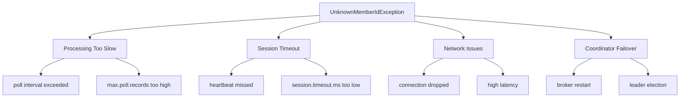
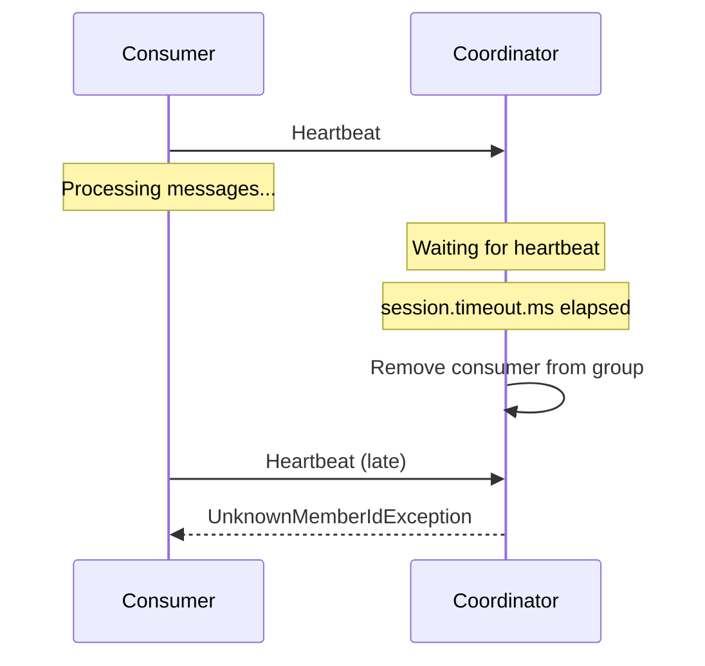
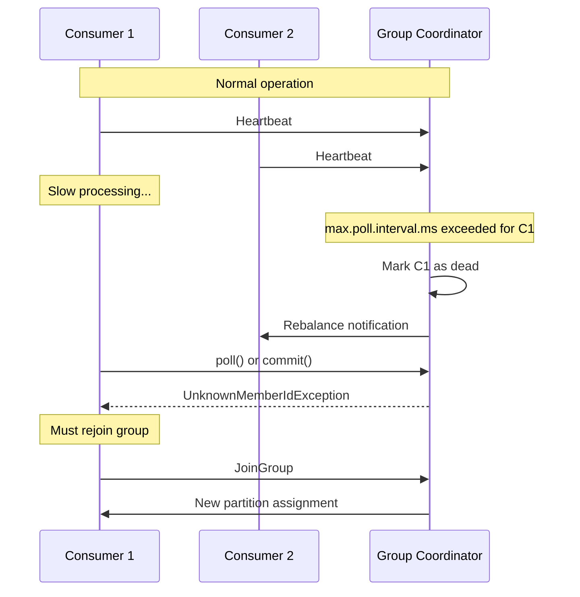

# How to Fix 'UnknownMemberIdException' in Kafka

Author: [nawazdhandala](https://www.github.com/nawazdhandala)

Tags: Apache Kafka, Consumer Groups, UnknownMemberIdException, Troubleshooting, Rebalancing, Configuration

Description: Learn how to diagnose and fix the UnknownMemberIdException error in Kafka consumers, which occurs when a consumer is removed from its group.

---

The `UnknownMemberIdException` is one of the most common errors encountered when working with Kafka consumers. This error indicates that the consumer has been removed from its consumer group, typically due to a session timeout or rebalancing issue.

## Understanding the Error

```
org.apache.kafka.clients.consumer.CommitFailedException:
Commit cannot be completed since the group has already rebalanced and assigned
the partitions to another member. This means that the time between subsequent
calls to poll() was longer than the configured max.poll.interval.ms, which
typically implies that the poll loop is spending too much time message processing.
You can address this either by increasing max.poll.interval.ms or by reducing
the maximum size of batches returned in poll() with max.poll.records.

Caused by: org.apache.kafka.common.errors.UnknownMemberIdException:
The coordinator is not aware of this member.
```

## Root Causes



### Cause 1: Processing Takes Too Long

The most common cause is when message processing takes longer than `max.poll.interval.ms`:

```java
// This pattern causes problems
while (true) {
    ConsumerRecords<String, String> records = consumer.poll(Duration.ofMillis(100));

    for (ConsumerRecord<String, String> record : records) {
        // If this takes > max.poll.interval.ms (default 5 minutes),
        // the consumer will be kicked from the group
        processMessage(record);  // Slow operation
    }
}
```

### Cause 2: Session Timeout

If heartbeats are not sent within `session.timeout.ms`, the consumer is considered dead:



## Solutions

### Solution 1: Increase Timeout Settings

```java
import org.apache.kafka.clients.consumer.*;
import java.util.Properties;

public class ResilientConsumerConfig {

    public static KafkaConsumer<String, String> createConsumer(String bootstrapServers,
                                                                String groupId) {
        Properties props = new Properties();
        props.put(ConsumerConfig.BOOTSTRAP_SERVERS_CONFIG, bootstrapServers);
        props.put(ConsumerConfig.GROUP_ID_CONFIG, groupId);
        props.put(ConsumerConfig.KEY_DESERIALIZER_CLASS_CONFIG,
            "org.apache.kafka.common.serialization.StringDeserializer");
        props.put(ConsumerConfig.VALUE_DESERIALIZER_CLASS_CONFIG,
            "org.apache.kafka.common.serialization.StringDeserializer");

        // Increase max poll interval for slow processing
        // Default is 300000 (5 minutes)
        props.put(ConsumerConfig.MAX_POLL_INTERVAL_MS_CONFIG, 600000);  // 10 minutes

        // Session timeout - consumer marked dead if no heartbeat in this time
        // Default is 45000 (45 seconds) in newer versions
        props.put(ConsumerConfig.SESSION_TIMEOUT_MS_CONFIG, 60000);  // 60 seconds

        // Heartbeat interval - how often to send heartbeats
        // Should be less than session.timeout.ms / 3
        props.put(ConsumerConfig.HEARTBEAT_INTERVAL_MS_CONFIG, 10000);  // 10 seconds

        return new KafkaConsumer<>(props);
    }
}
```

### Solution 2: Reduce Records Per Poll

Fetch fewer records per poll to reduce processing time:

```java
import org.apache.kafka.clients.consumer.*;
import java.util.Properties;

public class ReducedBatchConsumer {

    public static KafkaConsumer<String, String> createConsumer(String bootstrapServers,
                                                                String groupId) {
        Properties props = new Properties();
        props.put(ConsumerConfig.BOOTSTRAP_SERVERS_CONFIG, bootstrapServers);
        props.put(ConsumerConfig.GROUP_ID_CONFIG, groupId);
        props.put(ConsumerConfig.KEY_DESERIALIZER_CLASS_CONFIG,
            "org.apache.kafka.common.serialization.StringDeserializer");
        props.put(ConsumerConfig.VALUE_DESERIALIZER_CLASS_CONFIG,
            "org.apache.kafka.common.serialization.StringDeserializer");

        // Reduce number of records returned per poll
        // Default is 500
        props.put(ConsumerConfig.MAX_POLL_RECORDS_CONFIG, 100);

        // Also limit bytes fetched
        props.put(ConsumerConfig.FETCH_MAX_BYTES_CONFIG, 1048576);  // 1 MB

        return new KafkaConsumer<>(props);
    }
}
```

### Solution 3: Asynchronous Processing Pattern

Process messages asynchronously to keep the poll loop responsive:

```java
import org.apache.kafka.clients.consumer.*;
import java.util.*;
import java.util.concurrent.*;
import java.time.Duration;

public class AsyncProcessingConsumer {

    private final KafkaConsumer<String, String> consumer;
    private final ExecutorService executor;
    private final BlockingQueue<ConsumerRecord<String, String>> processingQueue;
    private volatile boolean running = true;

    public AsyncProcessingConsumer(String bootstrapServers, String groupId,
                                    String topic, int processingThreads) {
        Properties props = new Properties();
        props.put(ConsumerConfig.BOOTSTRAP_SERVERS_CONFIG, bootstrapServers);
        props.put(ConsumerConfig.GROUP_ID_CONFIG, groupId);
        props.put(ConsumerConfig.KEY_DESERIALIZER_CLASS_CONFIG,
            "org.apache.kafka.common.serialization.StringDeserializer");
        props.put(ConsumerConfig.VALUE_DESERIALIZER_CLASS_CONFIG,
            "org.apache.kafka.common.serialization.StringDeserializer");

        // Conservative settings since we process asynchronously
        props.put(ConsumerConfig.MAX_POLL_RECORDS_CONFIG, 500);
        props.put(ConsumerConfig.ENABLE_AUTO_COMMIT_CONFIG, false);

        this.consumer = new KafkaConsumer<>(props);
        this.consumer.subscribe(Collections.singletonList(topic));

        // Processing queue with bounded capacity
        this.processingQueue = new LinkedBlockingQueue<>(10000);

        // Create processing thread pool
        this.executor = Executors.newFixedThreadPool(processingThreads);

        // Start processing workers
        for (int i = 0; i < processingThreads; i++) {
            executor.submit(this::processingWorker);
        }
    }

    /**
     * Main poll loop - keeps polling and adding to queue.
     * This loop stays responsive because actual processing is async.
     */
    public void pollLoop() {
        while (running) {
            try {
                ConsumerRecords<String, String> records = consumer.poll(Duration.ofMillis(100));

                for (ConsumerRecord<String, String> record : records) {
                    // Add to processing queue (blocks if queue is full)
                    if (!processingQueue.offer(record, 5, TimeUnit.SECONDS)) {
                        System.err.println("Processing queue full, applying backpressure");
                        // Could pause consumption here
                    }
                }

                // Commit periodically if queue is being processed
                if (processingQueue.size() < 5000) {
                    consumer.commitSync();
                }

            } catch (InterruptedException e) {
                Thread.currentThread().interrupt();
                break;
            }
        }
    }

    /**
     * Worker that processes messages from the queue.
     */
    private void processingWorker() {
        while (running) {
            try {
                ConsumerRecord<String, String> record =
                    processingQueue.poll(100, TimeUnit.MILLISECONDS);

                if (record != null) {
                    processMessage(record);
                }
            } catch (InterruptedException e) {
                Thread.currentThread().interrupt();
                break;
            } catch (Exception e) {
                System.err.println("Processing error: " + e.getMessage());
            }
        }
    }

    private void processMessage(ConsumerRecord<String, String> record) {
        // Actual message processing - can take as long as needed
        // since it does not block the poll loop
        System.out.printf("Processing: partition=%d, offset=%d%n",
            record.partition(), record.offset());
    }

    public void shutdown() {
        running = false;
        executor.shutdown();
        consumer.close();
    }
}
```

### Solution 4: Pause and Resume Pattern

Pause consumption while processing large batches:

```java
import org.apache.kafka.clients.consumer.*;
import org.apache.kafka.common.TopicPartition;
import java.util.*;
import java.time.Duration;

public class PauseResumeConsumer {

    private final KafkaConsumer<String, String> consumer;
    private final long maxProcessingTimeMs;

    public PauseResumeConsumer(String bootstrapServers, String groupId, String topic) {
        Properties props = new Properties();
        props.put(ConsumerConfig.BOOTSTRAP_SERVERS_CONFIG, bootstrapServers);
        props.put(ConsumerConfig.GROUP_ID_CONFIG, groupId);
        props.put(ConsumerConfig.KEY_DESERIALIZER_CLASS_CONFIG,
            "org.apache.kafka.common.serialization.StringDeserializer");
        props.put(ConsumerConfig.VALUE_DESERIALIZER_CLASS_CONFIG,
            "org.apache.kafka.common.serialization.StringDeserializer");
        props.put(ConsumerConfig.ENABLE_AUTO_COMMIT_CONFIG, false);
        props.put(ConsumerConfig.MAX_POLL_RECORDS_CONFIG, 1000);

        this.consumer = new KafkaConsumer<>(props);
        this.consumer.subscribe(Collections.singletonList(topic));

        // Allow 80% of max poll interval for processing
        this.maxProcessingTimeMs = 240000;  // 4 minutes
    }

    /**
     * Poll loop that pauses when processing takes too long.
     */
    public void pollLoop() {
        while (true) {
            ConsumerRecords<String, String> records = consumer.poll(Duration.ofMillis(100));

            if (records.isEmpty()) {
                continue;
            }

            long startTime = System.currentTimeMillis();
            Set<TopicPartition> partitions = records.partitions();

            // Pause partitions while processing
            consumer.pause(partitions);

            try {
                for (ConsumerRecord<String, String> record : records) {
                    processMessage(record);

                    // Check if we are running out of time
                    long elapsed = System.currentTimeMillis() - startTime;
                    if (elapsed > maxProcessingTimeMs) {
                        System.out.println("Processing time limit reached, " +
                            "committing and continuing");
                        break;
                    }
                }

                // Commit processed records
                consumer.commitSync();

            } finally {
                // Resume partitions
                consumer.resume(partitions);
            }

            // Call poll() to send heartbeat even if not fetching new records
            consumer.poll(Duration.ofMillis(0));
        }
    }

    private void processMessage(ConsumerRecord<String, String> record) {
        // Process message
        System.out.printf("Processing: %s%n", record.value());
    }
}
```

## Python Solutions

```python
from confluent_kafka import Consumer, KafkaError, KafkaException
import threading
from queue import Queue, Full
from typing import Callable
import time
import logging

logging.basicConfig(level=logging.INFO)
logger = logging.getLogger(__name__)


class ResilientConsumer:
    """
    Consumer configured to avoid UnknownMemberIdException.
    """

    def __init__(self, bootstrap_servers: str, group_id: str, topics: list):
        self.config = {
            'bootstrap.servers': bootstrap_servers,
            'group.id': group_id,
            'auto.offset.reset': 'earliest',
            'enable.auto.commit': False,

            # Timeout settings to prevent UnknownMemberIdException
            'max.poll.interval.ms': 600000,      # 10 minutes
            'session.timeout.ms': 60000,          # 60 seconds
            'heartbeat.interval.ms': 10000,       # 10 seconds

            # Reduce batch size for faster processing
            'max.poll.records': 100
        }

        self.consumer = Consumer(self.config)
        self.consumer.subscribe(topics)
        self.running = True

    def poll_loop(self, message_handler: Callable):
        """
        Poll loop with proper error handling.
        """
        while self.running:
            try:
                msg = self.consumer.poll(timeout=1.0)

                if msg is None:
                    continue

                if msg.error():
                    if msg.error().code() == KafkaError._PARTITION_EOF:
                        continue
                    else:
                        logger.error(f"Consumer error: {msg.error()}")
                        continue

                # Process message
                try:
                    message_handler(msg)
                    self.consumer.commit(msg)
                except Exception as e:
                    logger.error(f"Processing error: {e}")

            except KafkaException as e:
                logger.error(f"Kafka exception: {e}")
                # Check for UnknownMemberIdException
                if 'unknown member' in str(e).lower():
                    logger.warning("Consumer removed from group, " +
                                  "this is handled by the client")

    def close(self):
        self.running = False
        self.consumer.close()


class AsyncProcessingConsumer:
    """
    Consumer with async processing to avoid timeout issues.
    """

    def __init__(self, bootstrap_servers: str, group_id: str, topics: list,
                 num_workers: int = 4):
        self.config = {
            'bootstrap.servers': bootstrap_servers,
            'group.id': group_id,
            'auto.offset.reset': 'earliest',
            'enable.auto.commit': False,
            'max.poll.records': 500
        }

        self.consumer = Consumer(self.config)
        self.consumer.subscribe(topics)

        # Processing queue
        self.queue = Queue(maxsize=10000)
        self.running = True

        # Start worker threads
        self.workers = []
        for i in range(num_workers):
            worker = threading.Thread(target=self._worker_loop, daemon=True)
            worker.start()
            self.workers.append(worker)

        # Track pending offsets
        self.pending_offsets = {}
        self.offset_lock = threading.Lock()

    def _worker_loop(self):
        """Worker thread that processes messages from queue."""
        while self.running:
            try:
                item = self.queue.get(timeout=1.0)
                if item is None:
                    continue

                msg, callback = item
                try:
                    self._process_message(msg)
                    callback(msg, None)
                except Exception as e:
                    callback(msg, e)

            except Exception:
                continue

    def _process_message(self, msg):
        """Actual message processing - can be slow."""
        # Simulate slow processing
        time.sleep(0.1)
        logger.debug(f"Processed: {msg.key()}")

    def poll_loop(self):
        """
        Main poll loop - stays responsive while workers process.
        """
        while self.running:
            try:
                msg = self.consumer.poll(timeout=0.1)

                if msg is None:
                    self._commit_completed()
                    continue

                if msg.error():
                    if msg.error().code() != KafkaError._PARTITION_EOF:
                        logger.error(f"Error: {msg.error()}")
                    continue

                # Add to processing queue
                def completion_callback(m, error):
                    if error is None:
                        with self.offset_lock:
                            key = (m.topic(), m.partition())
                            current = self.pending_offsets.get(key, -1)
                            if m.offset() > current:
                                self.pending_offsets[key] = m.offset()

                try:
                    self.queue.put((msg, completion_callback), timeout=5.0)
                except Full:
                    logger.warning("Queue full, applying backpressure")
                    time.sleep(1)

            except KafkaException as e:
                logger.error(f"Kafka error: {e}")

        self._commit_completed()

    def _commit_completed(self):
        """Commit offsets for completed messages."""
        with self.offset_lock:
            if not self.pending_offsets:
                return

            for (topic, partition), offset in self.pending_offsets.items():
                self.consumer.commit(offsets=[{
                    'topic': topic,
                    'partition': partition,
                    'offset': offset + 1
                }], asynchronous=False)

            self.pending_offsets.clear()

    def close(self):
        self.running = False
        for worker in self.workers:
            worker.join(timeout=5)
        self.consumer.close()
```

## Diagnostic Commands

Check consumer group status to diagnose issues:

```bash
# Describe consumer group
kafka-consumer-groups.sh --bootstrap-server localhost:9092 \
  --describe --group my-consumer-group

# Check for lagging consumers
kafka-consumer-groups.sh --bootstrap-server localhost:9092 \
  --describe --group my-consumer-group --members --verbose

# Reset offsets if needed (after stopping consumers)
kafka-consumer-groups.sh --bootstrap-server localhost:9092 \
  --group my-consumer-group --reset-offsets --to-earliest \
  --topic my-topic --execute
```

## Consumer Group Rebalancing Flow



## Monitoring and Alerting

Set up monitoring to catch issues before they cause problems:

```java
import org.apache.kafka.clients.consumer.*;
import org.apache.kafka.common.Metric;
import org.apache.kafka.common.MetricName;
import java.util.*;

public class ConsumerHealthMonitor {

    private final KafkaConsumer<String, String> consumer;

    public ConsumerHealthMonitor(KafkaConsumer<String, String> consumer) {
        this.consumer = consumer;
    }

    /**
     * Check consumer health metrics.
     */
    public HealthStatus checkHealth() {
        Map<MetricName, ? extends Metric> metrics = consumer.metrics();
        HealthStatus status = new HealthStatus();

        for (Map.Entry<MetricName, ? extends Metric> entry : metrics.entrySet()) {
            String name = entry.getKey().name();
            Object value = entry.getValue().metricValue();

            if (value instanceof Double) {
                double doubleValue = (Double) value;

                // Check last poll time
                if (name.equals("last-poll-seconds-ago") && doubleValue > 60) {
                    status.addWarning("Last poll was " + doubleValue + " seconds ago");
                }

                // Check rebalance rate
                if (name.equals("rebalance-rate-per-hour") && doubleValue > 10) {
                    status.addWarning("High rebalance rate: " + doubleValue + "/hour");
                }

                // Check failed rebalances
                if (name.equals("failed-rebalance-total") && doubleValue > 0) {
                    status.addWarning("Failed rebalances: " + doubleValue);
                }
            }
        }

        return status;
    }

    public static class HealthStatus {
        private final List<String> warnings = new ArrayList<>();

        public void addWarning(String warning) {
            warnings.add(warning);
        }

        public boolean isHealthy() {
            return warnings.isEmpty();
        }

        public List<String> getWarnings() {
            return warnings;
        }
    }
}
```

## Best Practices

1. **Set appropriate timeouts**: Tune `max.poll.interval.ms` based on your actual processing time
2. **Keep poll loop responsive**: Do not block in the poll loop; use async processing for slow operations
3. **Monitor consumer lag**: High lag often precedes timeout issues
4. **Use pause/resume**: Pause partitions if you need extended processing time
5. **Handle exceptions gracefully**: Always handle `UnknownMemberIdException` and allow rejoin
6. **Test under load**: Verify timeout settings work under realistic load conditions

## Conclusion

The `UnknownMemberIdException` indicates that your consumer was removed from its group, usually because processing took too long. The solution involves either increasing timeout settings, reducing the amount of work per poll, or implementing asynchronous processing patterns. Always monitor consumer health metrics to catch issues before they cause problems.
